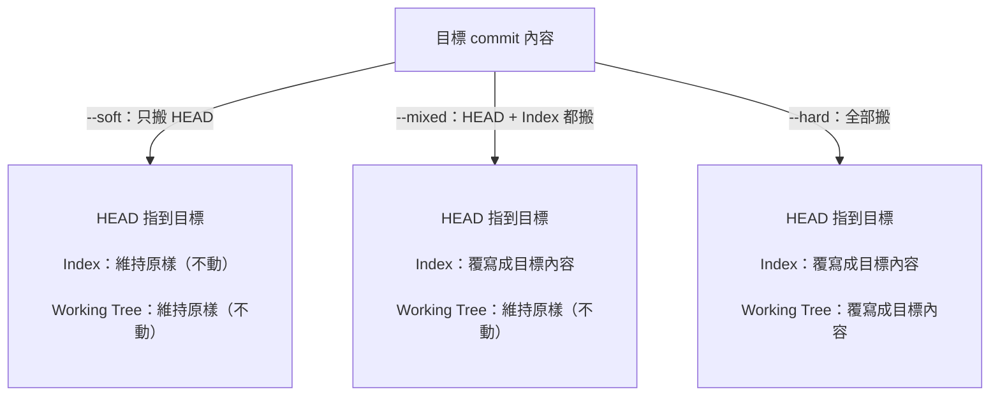

# Git Reset 三種模式

## 前置：Index（暫存區）是什麼？

**Index 是 `git add` 後、`commit` 前的暫存區。只有 add 過的改動才會進 index，沒 add 的不算——commit 時只打包 index 裡的東西。=staged changes?**

一句話：**「Index = add 過後的東西」**。更精準講是「已 staged、等著下次 commit 的快照」。

### Git 的三個區域

```
working tree（你改的檔案）
    │ git add
    ▼
Index / Staging area（暫存區 = add 過的東西）
    │ git commit
    ▼
HEAD / 提交歷史
```

### 在 git status 裡怎麼看

| 顏色 | 狀態 | 在哪一層 |
|---|---|---|
| 🟢 綠字 "Changes to be committed" | 已 staged | **Index** |
| 🔴 紅字 "Changes not staged" | 已改但沒 add | **Working tree** |

### `tracked` / `staged` 是狀態形容詞，`Index` 是那個狀態所在的「層」

這兩個詞常搞混，但其實是不同維度：

- **Index（索引）**：這一「層」的**名字**，暫存區實體存在的地方。
- **staged / unstaged**：形容目前 working tree 的修改，**有沒有被放進 Index 這一層**。
- **tracked / untracked**：形容一個檔案**是否曾經被 `git add` 過、進入過 git 的追蹤範圍**——這是檔案的長期屬性，跟「現在有沒有 staged 修改」是兩回事。一個檔案完全可能是「已 tracked，但目前 working tree 跟 commit 內容一致、沒有 staged 也沒有 unstaged 修改」（就是 `git status` 顯示 clean 的正常狀態）。

一句話：**tracked 決定「git 有沒有在管這個檔案」；staged 決定「這次的修改有沒有排進下一次 commit」；Index 是 staged 修改實際存放的那一層。**

下面講的三種 reset 模式，差別就在**它們會不會清 Index（和 working tree）**。

---

## commit 歷史本身是一個 DAG（有向無環圖）

git 的 commit 歷史，每個 commit 都指向它的「parent」，串起來就是一個 **DAG（Directed Acyclic Graph，有向無環圖）**——「有向」是因為箭頭只能從新指向舊（子指向父），「無環」是因為不可能繞回自己形成迴圈。`HEAD` 不是 commit，是一個**指標**，通常指向目前分支（例如 `main`），分支本身也是一個指標，指向它最新的那個 commit：


上圖 `main`／`HEAD` 目前指到 `D`。`git reset` 做的事，本質上就是**把 `HEAD`（連同它所在的分支指標）搬去指別的 commit**，差別只在「搬走的時候，index 和 working tree 要不要跟著搬」。

---

## 指令格式

```bash
git reset [--soft | --mixed | --hard] <commit>
```

---

## 三種模式比較

| 模式 | 工作目錄 | 暫存區 (staged) | HEAD | 用途 |
|------|---------|----------------|------|------|
| `--soft` | ✓ 保留 | ✓ 保留 | 移動 | 只撤銷 commit，保留所有修改 |
| `--mixed` | ✓ 保留 | ✗ 清除 | 移動 | 撤銷 commit + unstage，保留工作目錄 |
| `--hard` | ✗ **清除** | ✗ **清除** | 移動 | **完全還原**，丟棄所有修改 |

---

## --soft：只撤銷 commit

```bash
git reset --soft HEAD~1
```

**效果**：
- 撤銷最後一個 commit
- 修改內容還在暫存區（綠色）
- 可以直接重新 commit

**用途**：想修改 commit message 或合併多個 commit

---

## --mixed（預設）：撤銷 commit + unstage

```bash
git reset HEAD~1
# 或
git reset --mixed HEAD~1
```

**效果**：
- 撤銷最後一個 commit
- 修改內容在工作目錄（紅色，未暫存）
- 需要重新 `git add`

**用途**：想重新整理要 commit 哪些檔案

---

## --hard：完全還原（危險）

```bash
git reset --hard HEAD~1
```

**效果**：
- 撤銷最後一個 commit
- **刪除所有未提交的修改**
- 工作目錄完全還原到指定 commit

**用途**：放棄所有本地修改，回到乾淨狀態

### 常見誤解：`--hard` 不是「暫存區退回工作目錄」

**`--hard` 不是把內容從 index 退回 working directory 這種單向搬移**，而是**三個區域（working tree、index、HEAD）同時被強制設成目標 commit 的樣子**，跟原本 working tree／index 裡有什麼完全無關、直接覆蓋丟棄。

對照官方定義（[git-reset(1)](https://git-scm.com/docs/git-reset)）：

> Overwrite all files and directories with the version from `<commit>`... Update the index to match the new HEAD, so nothing will be staged.

也就是 working tree 和 index 都是「被覆寫成 commit 的內容」，不是「從 index 這層流向 working tree 這層」。三種模式的差異本質是「**HEAD 移動後，index 和 working tree 要不要跟著被覆寫成新 HEAD 的內容**」：
- `--soft`：index、working tree 都不跟著動（保留原本，含未 commit 的差異）
- `--mixed`：index 跟著覆寫成新 HEAD，working tree 不動
- `--hard`：index、working tree **都**跟著覆寫成新 HEAD

---

## 常用範例

```bash
# 還原到遠端分支狀態（丟棄所有本地修改）
git reset --hard origin/main

# 撤銷最後 3 個 commit（保留修改）
git reset --soft HEAD~3

# 還原到特定 commit
git reset --hard abc1234

# 撤銷剛剛的 reset（如果還沒 garbage collect）
git reset --hard ORIG_HEAD
```

---

## 視覺化

```
執行前：
A → B → C → D (HEAD)
         ↑
      有未提交的修改

git reset --soft HEAD~2：
A → B (HEAD)
    staged: C 和 D 的修改 + 未提交的修改

git reset --mixed HEAD~2：
A → B (HEAD)
    unstaged: C 和 D 的修改 + 未提交的修改

git reset --hard HEAD~2：
A → B (HEAD)
    全部消失！
```

### 用圖表示：HEAD 指標搬家（對照上面的 DAG，A→B→C→D，執行前 HEAD 在 D）

`git reset --hard HEAD~2` 就是把 `HEAD`／`main` 這個指標，從指著 `D` 改成指著 `B`（`C`、`D` 兩個 commit 物件本身還在 `.git` 裡沒被刪，只是沒有任何指標指著它們了，這也是 `git reflog` 還救得回來的原因）。

三種模式移動 HEAD 之後，index／working tree**要不要跟著被覆寫成新 HEAD 的內容**：



---

## 危險警告

`--hard` 會**永久刪除**：
- 未 commit 的修改
- 未 push 的 commit（如果沒有其他分支指向它們）

**救回方法**（有時間限制）：
```bash
# 查看被刪除的 commit
git reflog

# 還原到之前的狀態
git reset --hard HEAD@{2}
```

---

## 簡單記法

- `--soft` = 只動 HEAD，其他都留著
- `--mixed` = 動 HEAD + 清暫存區
- `--hard` = 全部清掉，回到過去
