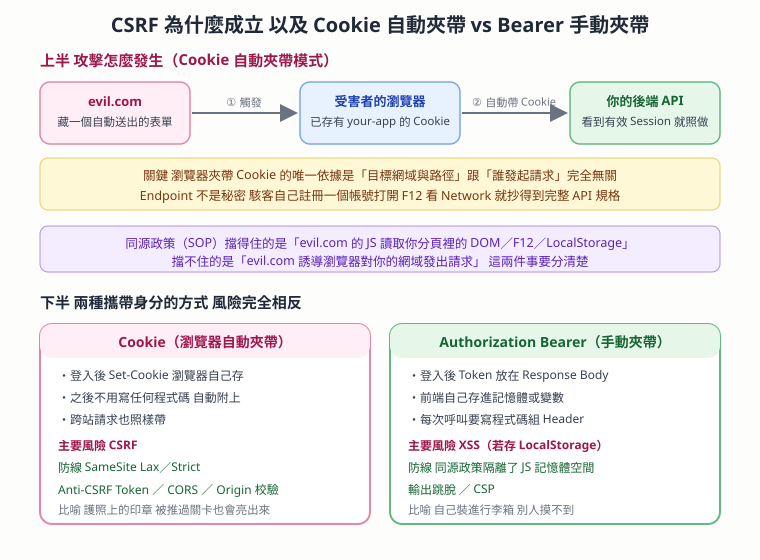

# Cookie 的隔離邊界與跨站請求安全 — Origin、SameSite、CSRF Token 與 Bearer 的分工

> 本篇重點 a–s，共 19 個。
>
> 這篇要回答的是四個很容易混在一起的問題：<mark style="background: #FFF3A3A6;">不同網站的 Cookie 同名會不會打架</mark>、<mark style="background: #FFF3A3A6;">SameSite 到底在管什麼</mark>、<mark style="background: #FFF3A3A6;">為什麼「藏起 Endpoint」不算防禦</mark>、以及 <mark style="background: #FFF3A3A6;">Cookie 自動夾帶跟 Bearer 手動夾帶的風險為什麼是相反的</mark>。



## 重點整理

### 一、Cookie 的儲存邊界：Origin 而不是名稱

(a) <mark style="background: #ADCCFFA6;">Origin（來源）</mark>是瀏覽器安全模型的基本單位，由三件事組成：<mark style="background: #ADCCFFA6;">Protocol（協定，如 `https`）＋ Domain（網域）＋ Port（連接埠）</mark>。三者全部相同才算同源。

(b) <mark style="background: #BBFABBA6;">不同網站的 Cookie 同名完全不會衝突。</mark>`a.com` 設一支叫 `token` 的 Cookie，`b.com` 也設一支叫 `token`，瀏覽器內部會把它們分別放進各自的 Domain 桶子裡。`a.com` 讀不到也蓋不掉 `b.com` 的那一支。

(c) 決定一支 Cookie「存到哪、要不要送出去」的是它的 <mark style="background: #ADCCFFA6;">`Domain`</mark> 與 <mark style="background: #ADCCFFA6;">`Path`</mark> 兩個屬性，跟名稱撞不撞沒有關係。

(d) <mark style="background: #FF5582A6;">SameSite 不是用來劃分網域、也不是用來解決同名衝突的。</mark>這是最常見的誤解。`SameSite`（`Strict` ／ `Lax` ／ `None`）管的是<mark style="background: #BBFABBA6;">「當這個請求是從別的站發起的時候，瀏覽器要不要幫忙把這支 Cookie 塞進 Header」</mark>，目的是防 CSRF 與保護隱私。

### 二、在 F12 判讀一支 Cookie 是不是登入用的

(e) 實務判讀順序：F12 →「Application（應用程式）」分頁 → 左側 Storage 樹的 Cookies → 看每一支的 `Name`、`Domain`、`HttpOnly`、`SameSite`。

(f) <mark style="background: #FFB8EBA6;">常見的「不是登入資訊」的 Cookie 名稱</mark>：

| Cookie 名稱 | 真正用途 | 怎麼認出來 |
| --- | --- | --- |
| `_fbp` | Meta（Facebook）Pixel 廣告追蹤，記錄站上行為做再行銷 | `_fb` 開頭幾乎都是 Meta 系 |
| `_ybar_latest_match` | 第三方元件或分析模組的狀態紀錄 | 帶 `bar`、`match`、`latest` 這類字眼多半是 UI 或分析狀態 |
| `.AspNetCore.Antiforgery` | CSRF 防護 token（見 [[CSRF-與-Antiforgery-Cookie]]） | 出現 `Antiforgery`、`XSRF`、`csrf` 就是防護用 |
| `LOGIN_INFO` | YouTube／Google 系的登入狀態 | Domain 會是 `.youtube.com` 而不是你正在看的站 |

(g) <mark style="background: #FF5582A6;">看不到登入 Cookie 不代表沒登入。</mark>兩種常見原因：一是 Token 已被清除或自然過期（伺服器發 `Set-Cookie` 把到期時間設成過去，或瀏覽器依 `Expires`／`Max-Age` 自動刪掉）；二是<mark style="background: #BBFABBA6;">現代 SPA 根本不用 Cookie 存驗證權杖，而是把 JWT 放在 Application → Local Storage 或 Session Storage</mark>，所以要換一個地方找。

### 三、瀏覽器什麼時候會自動夾帶 Cookie

(h) <mark style="background: #FFF3A3A6;">瀏覽器夾帶 Cookie 的唯一依據是「目標網址的 Domain 與 Path」，跟「誰發起這個請求」完全無關。</mark>使用者自己點連結、頁面裡的 ``、第三方網站的 `fetch`、隱藏表單的自動送出，全部一視同仁。

(i) 比喻：<mark style="background: #D2B3FFA6;">Cookie 像是護照上的印章。只要你走過那道通關門（請求送到那個 Domain），警察（瀏覽器）就會自動把護照亮出來——哪怕是歹徒推你過門的，護照還是會被亮出來。</mark>

### 四、為什麼「別人不知道我的 Endpoint」不算防禦

(j) 攻擊者確實必須知道完整的 URL（Domain ＋ Path），瀏覽器才知道要把請求跟 Cookie 送去哪裡。<mark style="background: #FF5582A6;">但「知道 Endpoint」在實務上極度容易，所以絕對不能當成安全防線。</mark>

(k) 取得 Endpoint 的三條路：

- **命名慣例太好猜**：`/api/v1/user/delete`、`/api/logout`、`/cart/checkout` 這種路徑用列舉就能撞出來。
- **前端程式碼本來就公開**：只要網頁有呼叫這些 API，任何人開 F12 的 Network 分頁就看得到。
- **駭客自己註冊一個帳號**：這是最省事的一條。他到 `your-app.com` 註冊、自己操作一次轉帳或刪除，然後在自己的 F12 看 Network，就完整抄到 `Domain`、`Endpoint`、`Method`、`Body` 格式。

(l) <mark style="background: #BBFABBA6;">正解：Security through obscurity（靠隱藏來求安全）是無效的。</mark>網域與 Endpoint 在前端本來就是公開資訊，防線必須建立在 SameSite、CSRF Token、CORS／Origin 校驗這些機制上。

### 五、同源政策（SOP）擋得住什麼、擋不住什麼

(m) <mark style="background: #ADCCFFA6;">同源政策（Same-Origin Policy, SOP）</mark>擋得住的是「讀取」：`evil.com` 頁面裡的 JavaScript <mark style="background: #BBFABBA6;">無法讀取</mark>你另一個分頁裡 `your-app.com` 的 DOM、Console、開發者工具內容或 LocalStorage。駭客沒辦法遠端窺視你當下正在瀏覽的其他網站。

(n) <mark style="background: #FF5582A6;">SOP 擋不住的是「發送」：evil.com 依然可以誘導你的瀏覽器對 your-app.com 發出請求，而瀏覽器依然會自動附上你的 Cookie。</mark>這就是 CSRF 的全部原理——攻擊者看不到結果，但動作已經被執行了。

```html
<!-- evil.com 頁面裡的隱藏程式碼：受害者一造訪就自動送出 -->
<form action="https://api.your-app.com/v1/user/delete" method="POST">
  <input type="hidden" name="account" value="attacker" />
</form>
<script>document.forms[0].submit();</script>
```

### 六、Anti-CSRF Token 為什麼有效

(o) <mark style="background: #ADCCFFA6;">Anti-CSRF Token</mark> 是後端產生的一串不可預測的隨機字串（例如 `csrf_x9f8a7b6...`），放在前端頁面的 HTML 或 JavaScript 變數裡。<mark style="background: #BBFABBA6;">所有「會變更資料」的請求（POST／PUT／DELETE）都必須把它放進 Body 或 Header 一起送出，後端驗證通過才執行。</mark>

(p) 它能防禦的邏輯是三段扣在一起的：

1. **SOP 阻擋讀取**：`evil.com` 可以發起請求，但依照 (m)，它讀不到 `your-app.com` 頁面裡的 JS 變數或 HTML 內容。
2. **所以無法偽造**：它猜不到那串 Token 是什麼。
3. **後端校驗**：後端收到「有 Session Cookie 但沒有正確 CSRF Token」的請求，直接拒絕。

### 七、自動夾帶 vs 手動夾帶：風險是相反的

(q) 「手動」的意思是<mark style="background: #FFF3A3A6;">由前端工程師寫 JavaScript 主動把 Token 塞進 HTTP Header</mark>，而不是由瀏覽器底層自動完成。

```js
// A. 傳統 Cookie（自動模式）——開發者一行程式碼都不用寫
// 登入成功 → 後端回 Set-Cookie: session_id=abc123
// 之後每個請求瀏覽器自動帶上 Cookie: session_id=abc123

// B. JWT + Authorization Header（手動模式）——每次都要自己組
fetch('https://api.your-app.com/v1/user/profile', {
  method: 'POST',
  headers: {
    'Authorization': `Bearer ${userToken}`,   // 這裡就是手動夾帶
  },
  body: JSON.stringify({ name: 'New Name' }),
})
```

(r) 兩者的風險面完全相反，這是面試很愛問的對照：

| 特性 | Cookie（自動夾帶） | `Authorization: Bearer`（手動夾帶） |
| --- | --- | --- |
| 發送機制 | 瀏覽器自動處理，Domain 匹配就塞進 Header | 由 JavaScript 程式碼控制，前端要主動加 |
| 惡意網站發起請求時 | <mark style="background: #FF5582A6;">依然會自動帶上</mark> | <mark style="background: #BBFABBA6;">拿不到受害者記憶體中的 Token，帶不上</mark> |
| 主要風險 | <mark style="background: #FF5582A6;">CSRF</mark> | <mark style="background: #FF5582A6;">XSS</mark>（若 Token 存在 LocalStorage，被注入的 JS 讀走就完蛋） |
| 主要防線 | `SameSite` Lax／Strict、Anti-CSRF Token、CORS／Origin 校驗 | 同源政策隔離了 JS 記憶體空間；再加輸出跳脫與 CSP |

(s) <mark style="background: #D2B3FFA6;">一句話記法</mark>：<mark style="background: #BBFABBA6;">Cookie 是瀏覽器的親生兒子，到哪都自動跟著；Authorization Header 是前端手動裝進行李箱的東西，惡意網站摸不到你的行李箱。</mark>所以選哪一種不是「哪個比較安全」，而是「你要防的是 CSRF 還是 XSS」——兩邊都要做。

## ⚠️ 存疑／更正

- Gemini 在對話裡把 `_ybar_latest_match` 說成「第三方元件或分析模組的狀態紀錄」，語氣是推測而非確認。<mark style="background: #FF5582A6;">實際判定請以該 Cookie 的 Domain 與該站的隱私權政策為準</mark>，不要把 AI 的猜測當成定論。可靠的做法是查該站的 Cookie 政策頁，或用 Cookiepedia 這類資料庫反查。
- 對話中提到「改用 Authorization Header 就不會被自動夾帶」是正確的，但<mark style="background: #FF5582A6;">Gemini 沒有提醒的是：把 JWT 放進 LocalStorage 會把風險從 CSRF 換成 XSS，並不是無腦升級。</mark>業界目前較推薦的折衷是「Access Token 放記憶體 ＋ Refresh Token 放 `HttpOnly` ＋ `SameSite=Strict` 的 Cookie」，見 [[Refresh-Token與Token-Endpoint-雙Token機制與JWT關係]]。

## 相關題目練習

| 題目 | 連結 | 為什麼相關 |
| --- | --- | --- |
| LeetCode 2622. Cache With Time Limit | https://leetcode.com/problems/cache-with-time-limit/ | Cookie 的 `Expires`／`Max-Age` 就是一個帶時限的快取，手寫一次會對「過期」這件事有體感 |
| LeetCode 2725. Interval Cancellation | https://leetcode.com/problems/interval-cancellation/ | Token 續期與撤銷的最小模型，對應 Refresh Token 的生命週期 |
| LeetCode 2721. Execute Asynchronous Functions in Parallel | https://leetcode.com/problems/execute-asynchronous-functions-in-parallel/ | 練 `fetch` 與 Header 組裝的非同步流程，對應 (q) 的手動夾帶寫法 |
| NeetCode — Design HashMap | https://neetcode.io/problems/design-hashmap | (b) 說的「各自的 Domain 桶子」本質就是以 Origin 為 key 的雜湊分桶 |

## 關聯筆記

- [[Cookie-與-Session]] — 那篇講「為什麼需要 Cookie／Session」這個更前面的問題（HTTP 是無狀態的），本篇則是接著問「有了之後，邊界跟風險在哪」。先看那篇再看這篇順序才對。
- [[CSRF-與-Antiforgery-Cookie]] — 那篇是從一支實際的 `.AspNetCore.Antiforgery` Cookie 反推它的用途，是本篇 (o)(p) 的實機案例版；(f) 的判讀表也直接沿用了那篇的除錯手法。
- [[Refresh-Token與Token-Endpoint-雙Token機制與JWT關係]] — 補完 (r) 那張表沒展開的部分：實務上不會純選一邊，而是雙 Token 各放一處。
- [[剪貼簿劫持攻擊-ClickFix與網站惡意注入排查]] — (r) 提到的 XSS 風險在真實世界怎麼發生，那篇有完整的注入排查流程。
- [[ClickFix社交工程攻擊-假驗證碼誘騙貼上PowerShell與網站被注入的處置]] — 同上，並且那篇有 F12 Application 分頁的實機截圖，可以搭配本篇 (e) 一起看。
- [[XMLHttpRequest-CORS-explanation]] — (l) 提到 CORS 是防線之一，那篇解釋 CORS 的預檢請求與同源判定細節。
- [[JWT_TOKEN_EXPLANATION]] — (q) 的 `Bearer ${userToken}` 裡那串東西的內部結構（Header／Payload／Signature）在那篇。

## 各對話來源（原文）

### Cookie 隔離與登入狀態解析（2026-08-31）— https://gemini.google.com/app/e0228a3107b0433a

**使用者：** 登入請求過期了。但是這邊如果 token 名稱跟其他網站登入名稱撞到，那不是會有問題嗎？有什麼方法解決嗎？是網域控制嗎？控制網域的屬性，是這樣分 SameSite 嗎？我看到關於 104 的 cookies 只有兩個，說我的登入已經過期了。你覺得 `_ybar_latest_match` 還是 `_fbp` 是登入相關的資訊呢？請幫我好好解析。（附 DevTools 截圖）

**Gemini：**

- **Cookie 隔離與命名衝突**：不同網站的 Token 同名完全不會有衝突。瀏覽器的安全模型以 Origin（Protocol ＋ Domain ＋ Port）作為邊界進行儲存隔離。
  - 網域控制（Domain Attribute）：Cookie 的儲存與發送由 `Domain` 與 `Path` 屬性決定作用域。`a.com` 設定名為 `token` 的 Cookie 與 `b.com` 設定名為 `token` 的 Cookie，在瀏覽器內部分別存放於各自的 Domain 桶子中，`a.com` 無法讀取或覆蓋 `b.com` 的 Cookie。
  - SameSite 的真正作用：`SameSite`（`Strict`／`Lax`／`None`）不是用來劃分網域或解決同名衝突的。它的作用是控制跨站請求（Cross-Site Request，如從外部網站點擊連結或發送 fetch）時，瀏覽器是否要在 HTTP 請求標頭中自動帶上該 Cookie，主要用途為防範 CSRF 攻擊與保護使用者隱私。
- **截圖中的 Cookies 解析**：
  - `_fbp` 不是登入資訊。這是 Meta（Facebook）Pixel 廣告追蹤 Cookie，用於記錄使用者在網站上的行為以進行廣告再行銷。Domain 是 `.104.com.tw`。
  - `_ybar_latest_match` 不是登入資訊。這類名稱通常屬於第三方元件或分析模組的狀態紀錄，非驗證身分的 Session Token。
  - 截圖中的 `LOGIN_INFO` 是 YouTube 的。
- **為什麼看不到登入 Token**：一是 Token 已被清除或自然過期——當伺服器判斷驗證過期，或觸發登出，伺服器會發送 `Set-Cookie` 把該 Token Cookie 的到期時間設為過去時間（或瀏覽器已依 `Expires`／`Max-Age` 自動刪除）。二是存放於 Web Storage——許多現代單頁應用（SPA）不使用 Cookie 儲存身份驗證權杖，而是把 JWT 放在 Application → Local Storage 或 Session Storage 中。

### 瀏覽器 Cookie 與請求安全解析（2026-08-31）— https://gemini.google.com/app/3d4429ab61f43591

**使用者：** 瀏覽器對我的伺服器發出一個帶 cookie 的請求⋯是誰都可以對我的伺服器發出帶 cookie 的請求，還是只有他知道我的後端 endpoint 的時候才可以？

**Gemini：** 是的，對方必須知道你的 API 路徑（Endpoint）才能發出請求，但「知道 Endpoint」這件事在實務上極度容易被猜到或取得，因此不能當作安全防線。

1. **瀏覽器發送 Cookie 的機制**：瀏覽器自動夾帶 Cookie 的唯一依據是目標網域（Domain）與路徑（Path），與「誰發起請求」無關。只要滿足兩個條件就會自動附帶：使用者的瀏覽器裡已經存有你網站的 Cookie；第三方惡意網站（例如 `evil.com`）執行了一段 JavaScript，或放了一個表單／圖片，目標指向你的 API 路徑。
2. **「知道 Endpoint」有多容易**：常見慣例如 `/api/v1/user/delete`、`/api/logout`、`/cart/checkout` 非常容易被暴力列舉或猜測；前端程式碼暴露——任何人開 F12 就能直接看到所有 API 路徑；CSRF——只要猜中或得知 Endpoint，就能在他們的網站建構一個隱藏表單自動提交，因為是受害者的瀏覽器發出的，瀏覽器會自動帶上受害者的 Session Cookie。
3. **如何防止**：設定 Cookie 的 `SameSite` 屬性；CSRF Token；CORS 與 Origin Header 校驗（後端校驗請求來源的 Domain 是否為信任的網域）；改用 Authorization Header（如 JWT）——不依賴瀏覽器自動夾帶的 Cookie，將 Token 存於記憶體中並透過 `Authorization: Bearer <token>` 手動發送，瀏覽器不會自動幫跨站請求帶上此 Header。

**使用者：** 他會需要知道我後端的 domain name 嗎？`evil.com` 他可以從我的 F12 知道其他網站例如我的網域跟 endpoint？

**Gemini：** 是的，他一定要知道你的 Domain Name，因為瀏覽器發送請求時必須有完整的 URL（Domain ＋ Path）。至於能不能透過 F12 拿到你的資訊，要分兩種情況：

1. **`evil.com` 頁面上的程式碼，不能直接翻開你電腦裡別分頁的 F12**：同源政策（SOP）會嚴格隔離不同網域。當使用者開啟 `evil.com` 時，其頁面裡的 JavaScript 無法讀取使用者在另一個分頁打開的 `your-app.com` 的 DOM、Console、開發者工具或 LocalStorage。駭客無法遠端透過開發者工具窺視使用者當前正在瀏覽的其他網站。
2. **那駭客是怎麼知道的**：他不需要窺視個別使用者的 F12。他自己先到 `your-app.com` 註冊一個帳號，打開他自己的 F12，操作一次轉帳、刪除資料或變更密碼，在 Network 頁籤中就能直接看到完整的請求：Domain `api.your-app.com`、Endpoint `/v1/user/delete`、Method `POST`、Body 格式 `{"userId": 123}`。知道之後就在 `evil.com` 放上隱藏表單並自動 submit。

**總結（Gemini 原文）：** Domain Name 必須知道；`evil.com` 拿不到「受害者瀏覽器」裡的 F12 資料，但駭客可以透過「自己去你的網站打開 F12」來收集你的 API 規格。防禦重點：網域和 Endpoint 在前端都是公開資訊，無法靠隱藏來確保安全（Security through obscurity 是無效的），必須透過 SameSite Lax／Strict、CSRF Token 或 CORS 嚴格設定來確保只有你認可的前端源（Origin）才能發動有效的請求。

**使用者：** 你說 Anti-CSRF Token 必須在變更的時候帶上這個才能申請變更的意思嗎？何謂瀏覽器自動夾帶的 cookie？What's the difference？所以 JWT 都有經過驗證？何謂透過 authorization bearer「手動」發送？

**Gemini：**

1. **什麼是「瀏覽器自動夾帶」的 Cookie**：只要發出的請求 Target URL 符合 Cookie 設定的 Domain 與 Path，無論這個請求是由誰發起的（使用者點連結、還是 `evil.com` 的腳本觸發），瀏覽器都會在背景默默把對應的 Cookie 塞進 HTTP Request Header 送出。比喻：Cookie 就像印在你護照上的印章，只要你走過通關門，警察（瀏覽器）就會自動把護照亮給對方看，即使是歹徒推你過門的。
2. **何謂 Anti-CSRF Token**：是的，變更資料的請求必須額外附帶這個 Token，後端驗證通過才允許執行。CSRF Token 是後端產生的一串不可預測的隨機字串，放在前端頁面的 HTML 或 JavaScript 變數中。能防禦的原因：SOP 阻擋——`evil.com` 無法讀取 `your-app.com` 頁面裡的 JS 變數或 HTML 內容；無法偽造——猜不到 Token；後端校驗——發現有 Session Cookie 但沒有正確 CSRF Token 就直接拒絕。
3. **何謂「透過 Authorization: Bearer 手動發送」**：「手動」指的是由前端工程師寫 JavaScript 程式碼主動將 Token 放入 HTTP Header，而不是由瀏覽器底層自動完成。傳統 Cookie 是自動模式（登入成功後端回 `Set-Cookie`，之後開發者不用寫任何程式碼）；JWT ＋ Authorization Header 是手動模式（登入成功後端在 Response Body 回傳 JSON，前端把 Token 存在記憶體或變數中，之後每次呼叫 API 都要手動組裝 Header）。
4. **差異總整理**：見本篇 (r) 的表格（原文為同一份對照表）。Gemini 的結語是：「Cookie 是瀏覽器預設的親生兒子，到哪都自動跟著；Authorization Header 是前端程式碼手動裝進行李箱的物品，惡意網站摸不到受害者的行李箱，自然就發不出帶有 JWT 的合法請求。」

## 資料來源（含查證時間）

| 主題 | 連結 | 版本／時間 |
| --- | --- | --- |
| Gemini 對話〈Cookie 隔離與登入狀態解析〉 | https://gemini.google.com/app/e0228a3107b0433a | 對話日期 2026-08-31，擷取於 2026-09-01 |
| Gemini 對話〈瀏覽器 Cookie 與請求安全解析〉 | https://gemini.google.com/app/3d4429ab61f43591 | 對話日期 2026-08-31，擷取於 2026-09-01 |
| MDN — Using HTTP cookies（`Domain`、`Path`、`SameSite` 屬性定義） | https://developer.mozilla.org/en-US/docs/Web/HTTP/Guides/Cookies | MDN 文件，查證於 2026-09-01 |
| MDN — Set-Cookie `SameSite` 指令 | https://developer.mozilla.org/en-US/docs/Web/HTTP/Reference/Headers/Set-Cookie | MDN 文件，查證於 2026-09-01 |
| MDN — Same-origin policy（Origin ＝ Protocol ＋ Domain ＋ Port） | https://developer.mozilla.org/en-US/docs/Web/Security/Same-origin_policy | MDN 文件，查證於 2026-09-01 |
| OWASP — Cross-Site Request Forgery Prevention Cheat Sheet | https://cheatsheetseries.owasp.org/cheatsheets/Cross-Site_Request_Forgery_Prevention_Cheat_Sheet.html | OWASP Cheat Sheet Series，查證於 2026-09-01 |
| RFC 6265bis — Cookies: HTTP State Management Mechanism（`SameSite` 規範來源） | https://datatracker.ietf.org/doc/draft-ietf-httpbis-rfc6265bis/ | IETF 草案，查證於 2026-09-01 |
| 本篇圖解 | `obsidian-attachment/學習資安_圖解_CSRF流程-Cookie自動夾帶vs-Bearer手動夾帶_2026-09-01.svg` | 繪製於 2026-09-01 |

---

*由 Gemini 對話自動整理 · 更新於 2026-09-01*
