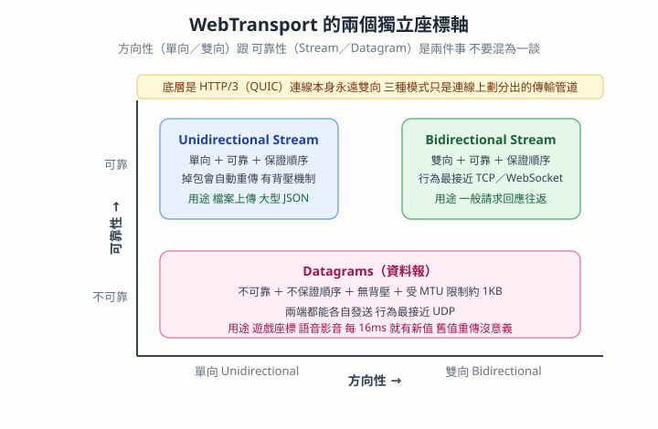

# WebTransport — 雙向傳輸、Streams 與 Datagrams、掉封包會發生什麼

> 本篇重點 a–p，共 16 個。
>
> 核心誤解一句話破解：<mark style="background: #FF5582A6;">「單向／雙向」跟「可靠／不可靠」是兩個完全獨立的維度</mark>，很多人把 Unidirectional Stream 跟 Datagram 混為一談，就是因為只看了方向那一軸。

## 重點整理

### 一、先釐清縮寫

(a) <mark style="background: #ADCCFFA6;">WebTransport</mark>：瀏覽器可用的新一代網路傳輸 API，建立在 <mark style="background: #ADCCFFA6;">HTTP/3</mark> 之上；HTTP/3 的傳輸層是 <mark style="background: #ADCCFFA6;">QUIC（Quick UDP Internet Connections，快速 UDP 網際網路連線）</mark>，也就是「跑在 UDP 上、但自己實作了可靠性與加密的協定」。

(b) <mark style="background: #ADCCFFA6;">MTU（Maximum Transmission Unit，最大傳輸單元）</mark>：一個網路封包能塞的最大位元組數，一般以太網路約 1500 bytes，所以一個 Datagram 實務上大約只有 1KB 出頭可用。

(c) <mark style="background: #ADCCFFA6;">Backpressure（背壓）</mark>：接收端處理不過來時，能反過來通知發送端「慢一點」的機制。有背壓就不會被灌爆，沒背壓就只能丟棄。

### 二、WebTransport 本身就是雙向的

(d) <mark style="background: #BBFABBA6;">WebTransport 一直以來都是雙向傳輸（Bidirectional）。</mark>客戶端與伺服器建立連線後，兩端隨時都可以主動向對方發送資料。

(e) <mark style="background: #FFF3A3A6;">會產生「它是不是單向」的錯覺，是因為 WebTransport 在同一條連線上劃分出三種傳輸模式</mark>，其中一種叫「單向串流」——但那是「管道的方向」，不是「連線的方向」。

### 三、三種傳輸模式

(f) 三種模式的完整對照：

| 模式 | 方向 | 可靠性 | 順序 | 類比 |
| --- | --- | --- | --- | --- |
| <mark style="background: #ADCCFFA6;">Bidirectional Streams（雙向串流）</mark> | 雙向 | 可靠 | 保證 | TCP／WebSocket |
| <mark style="background: #ADCCFFA6;">Unidirectional Streams（單向串流）</mark> | 單向 | 可靠 | 保證 | TCP 但只往一個方向流 |
| <mark style="background: #ADCCFFA6;">Datagrams（資料報）</mark> | 兩端皆可發送 | <mark style="background: #FF5582A6;">不可靠</mark> | <mark style="background: #FF5582A6;">不保證</mark> | UDP |

(g) 補充：<mark style="background: #FFB8EBA6;">Unidirectional Stream 是「單一串流只能由發起方傳給接收方」，但雙方都可以在同一個 WebTransport 連線中隨時各自建立自己的單向串流。</mark>所以連線層級仍然是雙向的。

(h) Stream 與 Datagram 更細的差異：

| 特性 | Unidirectional Stream | Datagrams |
| --- | --- | --- |
| 可靠性 | 100% 可靠，掉封包自動重傳 | 掉了就丟了，<mark style="background: #FF5582A6;">絕不重傳</mark> |
| 順序性 | 保證先發先到 | 後發的可能先到 |
| 資料大小 | 無限制，像水管持續流動 | 受 MTU 限制，約 1KB |
| 背壓機制 | 有 | <mark style="background: #FF5582A6;">無</mark>，發太快接收端處理不及就直接丟棄 |
| 應用場景 | 檔案上下傳、大型 JSON、靜態資源 | 遊戲人物座標、語音／影音 RTP 封包、滑鼠軌跡 |

### 四、什麼時候選哪一個

(i) <mark style="background: #BBFABBA6;">情況 A：Client → Server 傳一個 10MB 檔案 → 用 Unidirectional Stream。</mark>底層會確保每一 byte 都按順序、不漏掉地送達。<mark style="background: #FF5582A6;">不能用 Datagrams</mark>，因為單個封包太小、掉包又不重傳，檔案會破損。

(j) <mark style="background: #BBFABBA6;">情況 B：Server → Client 每秒 60 次送玩家的 X, Y 座標 → 用 Datagrams。</mark>如果第 10 個座標封包掉了，根本不需要重傳，因為 16 毫秒後第 11 個最新座標就到了，重傳舊座標反而沒意義。<mark style="background: #FF5582A6;">不能用 Stream</mark>，因為 Stream 遇到掉包會「卡住等待重傳」，導致畫面延遲（Lag）。

(k) <mark style="background: #FFF3A3A6;">判斷準則</mark>：先問「這條管道的資料方向是單向還是雙向」，再問「掉資料可不可以接受」。<mark style="background: #BBFABBA6;">單向 ＋ 絕對不能掉 → Unidirectional Stream；單向 ＋ 速度優先掉了沒關係 → Datagrams。</mark>

### 五、掉封包（Packet Loss）到底會發生什麼

(l) <mark style="background: #FF5582A6;">掉封包不一定會讓畫面直接消失或變黑。</mark>影像串流不會為每一格畫面都傳一張完整照片，而是靠壓縮：

- <mark style="background: #ADCCFFA6;">I 幀（Keyframe，關鍵幀）</mark>：包含完整的影像資料。
- <mark style="background: #ADCCFFA6;">P 幀／B 幀（Delta Frame，差異幀）</mark>：只紀錄「跟上一格畫面相比變動了什麼」。

(m) 所以掉不同的幀，表現完全不同：掉差異幀 → 局部破圖、殘影、馬賽克；掉關鍵幀 → 畫面凍結，直到下一個 I 幀成功抵達才突然跳到最新進度（跳幀）；<mark style="background: #FF5582A6;">只有連線徹底中斷、或連續丟失大量關鍵幀導致播放器完全無法解碼，才會黑屏或轉圈圈。</mark>

(n) <mark style="background: #FFF3A3A6;">為什麼即時影音不用 TCP 重傳來保證不掉包？因為 Head-of-Line Blocking（隊頭阻塞）。</mark>TCP 為了保證不掉包，遇到掉包時會要求重傳，並<mark style="background: #FF5582A6;">暫停後面所有資料的接收</mark>，畫面會硬生生卡住數百毫秒甚至數秒，即時性被徹底破壞。<mark style="background: #BBFABBA6;">即時影音寧可「輕微破圖或跳幀但順暢播下去」，也不要「為了補齊 0.1 秒前的舊封包而讓整場會議卡住」。</mark>

(o) 現代技術怎麼補救掉封包：

- <mark style="background: #ADCCFFA6;">FEC（Forward Error Correction，前向糾錯）</mark>：發送端額外附加一些算好的冗餘封包，即使途中掉了 10%～20%，接收端也能用數學公式把遺失的封包「算」回來，畫面完全不受影響。
- <mark style="background: #ADCCFFA6;">FIR／PLI（Full Intra Request／Picture Loss Indication）</mark>：接收端發現掉包嚴重導致畫面壞掉時，立刻傳訊號要求發送端「馬上重發一張完整的 I 幀」，迅速刷掉殘影與花屏。

(p) <mark style="background: #D2B3FFA6;">面試延伸</mark>：被問到「WebSocket 跟 WebTransport 差在哪」時，最有力的答案就是 (n)——<mark style="background: #BBFABBA6;">WebSocket 跑在 TCP 上，一定會有隊頭阻塞；WebTransport 跑在 QUIC 上，多條 Stream 彼此獨立，而且還多提供了 Datagrams 這條「明確放棄可靠性換低延遲」的路。</mark>

## ⚠️ 存疑／更正

- Gemini 在對話裡把 Datagrams 的方向性寫成「雙向」，這個用詞容易誤導。<mark style="background: #FF5582A6;">精確說法是：Datagram 是無連線的單次發送，兩端各自都能發送，所以「連線層級雙向、單次發送單向」。</mark>W3C 的 WebTransport 規格用的是 `datagrams.writable` 與 `datagrams.readable` 兩條獨立的流，語意上更接近「兩端各有一條單向管道」。
- 對話中的一個公式渲染成了 `C$\rightarrowS或S\rightarrow$C` 這種壞掉的 LaTeX，那是 Gemini 的排版錯誤，原意就是 `Client → Server 或 Server → Client`，不影響內容正確性。

## 相關題目練習

| 題目 | 連結 | 為什麼相關 |
| --- | --- | --- |
| LeetCode 2721. Execute Asynchronous Functions in Parallel | https://leetcode.com/problems/execute-asynchronous-functions-in-parallel/ | 對應 (n)：多條任務彼此獨立不互相阻塞，正是 QUIC 多 Stream 相對 TCP 的優勢 |
| LeetCode 2637. Promise Time Limit | https://leetcode.com/problems/promise-time-limit/ | 對應 (j)：「超過時限就放棄，不要等」的低延遲取捨思維 |
| LeetCode 622. Design Circular Queue | https://leetcode.com/problems/design-circular-queue/ | 對應 (c) 背壓：緩衝區滿了要怎麼處理，是背壓機制的最小模型 |
| NeetCode — Design Circular Queue | https://neetcode.io/problems/design-circular-queue | 同上，有影片講解 |

## 關聯筆記

- [[DNS查詢-TCP與TLS握手RTT-邊緣節點與網頁效能]] — 那篇講 TCP ＋ TLS 要幾個 RTT 才能開始傳資料，正好解釋了 QUIC 為什麼要把握手併進 UDP：本篇 (a) 的 QUIC 就是為了砍掉那些 RTT 而生的。
- [[Vite-HMR機制與Rollup打包原理]] — HMR 用的是 WebSocket，跟本篇 (p) 的對照可以一起看：同樣是「伺服器主動推給瀏覽器」，但一個是開發工具、一個是即時傳輸。
- [[IoT大範圍斷線-告警機制與重試策略-系統設計面試]] — 那篇的重試策略跟本篇 (h) 的「可靠性由誰負責」是同一組取捨：底層自動重傳，還是應用層自己決定要不要重試。
- [[Dev-Server在Node環境-devServer-proxy繞過CORS-HMR用WebSocket-與原生語言打包工具]] — 那篇有 Node.js 端 WebSocket 的實作面（`ws`／`sockjs` 套件），跟本篇的協定層剛好互補。
- [[Cookie隔離邊界與跨站請求安全-Origin-SameSite-CSRF-Token與Bearer]] — WebTransport 同樣受 Origin 與 CORS 規範管轄，安全模型那一段可以對照著看。

## 各對話來源（原文）

### WebTransport 的雙向傳輸機制（2026-08-31）— https://gemini.google.com/app/fdc25096a295234d

**使用者：** WebTransport 難道原本不是雙向傳輸嗎？（附截圖，截圖中標註了 `bidirectional`）

**Gemini：** WebTransport 一直以來都是雙向傳輸（Bidirectional），你截圖中標註的 `bidirectional` 說明是正確的。WebTransport 本身基於 HTTP/3（QUIC）協定，在客戶端與伺服器建立連線後，兩端隨時都可以主動向對方發送資料。之所以有時會讓人產生「它是不是單向」的錯覺，是因為 WebTransport 在具體的傳輸管道上劃分了三種資料傳輸模式：

1. **Bidirectional Streams（雙向串流）**：雙向、可靠、保證順序的傳輸（類似 TCP／WebSocket）。由一方建立後，兩端都能在該串流上持續收發資料。
2. **Unidirectional Streams（單向串流）**：單向、可靠、保證順序的傳輸。單一串流只能由發起方傳給接收方（例如單純的 Client → Server 或 Server → Client）。不過雙方都可以在同一個 WebTransport 連線中隨時建立各自的單向串流。
3. **Datagrams（資料報）**：不可靠、不保證順序的高速傳輸（類似 UDP），兩端皆可發送，適用於線上遊戲、影音即時傳輸等容許掉包但極度看重低延遲的場景。

雖然它提供了「單向串流」這種彈性的底層 API 供開發者使用，但 WebTransport 整個 API 與連線架構本身就是雙向通訊機制。

**使用者：** 掉封包不就是會有畫面不見嗎？

**Gemini：** 掉封包（Packet Loss）不一定會導致畫面直接消失或變黑，具體效果取決於影像編碼機制（Codec）與網路傳輸協定如何處理丟失的資料。

1. **掉封包常見的畫面表現**：影像串流通常不會為每一個畫面都傳送完整照片，而是透過影片壓縮技術傳輸——I 幀（Keyframe，關鍵幀）包含完整影像資料；P 幀／B 幀（Delta Frame，差異幀）只紀錄「跟上一格畫面相比變動了什麼」。丟失差異幀會出現局部破圖與殘影；丟失關鍵幀則畫面凍結，直到下一個 I 幀成功抵達才突然跳到最新進度（跳幀）。只有在連線徹底中斷、或連續丟失大量關鍵幀導致播放器完全無法解碼時，才會黑屏、轉圈圈或顯示錯誤。
2. **為什麼應用層不直接用 TCP 重傳來避免掉封包**：即時影音通訊（Zoom、Google Meet、RTC 視訊）或線上遊戲通常選擇基於 UDP（或 WebTransport 的 Datagrams）。TCP 的問題是 Head-of-Line Blocking——為了保證不掉封包，遇到掉包會要求重傳並暫停後面所有資料的接收，畫面直接卡住數百毫秒甚至數秒，即時性被徹底破壞。UDP／Datagrams 的邏輯是：即時影音寧可「帶有輕微破圖或跳幀地順暢播放下去」，也不要「為了補齊 0.1 秒前的舊封包而讓整場會議卡住」。
3. **現代技術如何修復掉封包**：FEC（Forward Error Correction，前向糾錯）——發送端額外附加算好的冗餘演算法封包，即使掉了 10%～20%，接收端也能用數學公式把遺失的封包算回來；FIR／PLI（請求快速關鍵幀）——接收端發現掉包嚴重時立刻傳訊號要求發送端馬上重新發送一張完整的 I 幀，迅速刷掉殘影與花屏。

**使用者：** `Client → Server` 或 `Server → Client` 這種單向的還不是 datagrams？

**Gemini：** 這裡有一個觀念需要釐清：「單向／雙向（方向性）」與「Streams／Datagrams（可靠性／傳輸方式）」是兩個完全不同維度的概念。`Client → Server` 或 `Server → Client` 可以是 Unidirectional Stream，也可以是 Datagram。

| 特性 | Unidirectional Streams | Datagrams |
| --- | --- | --- |
| 傳輸方向 | 單向（由建立者決定是 C→S 或 S→C） | 單向發送（但連線建立後兩端各自都能獨立發送） |
| 可靠性 | 100% 可靠（掉封包會自動重傳） | 不可靠（掉封包就丟了，絕不重傳） |
| 順序性 | 保證順序（先發的資料一定先收到） | 不保證順序（後發的可能先到） |
| 資料大小 | 無限制（像管道一樣持續流動的 Stream） | 有限制（受限於 MTU，通常一個封包約 1KB 左右） |
| 背壓機制 | 有（接收端處理不過來時會通知發送端減速） | 無（發太快接收端處理不及就直接丟棄） |
| 應用場景 | 檔案下載／上傳、傳送大型 JSON、靜態資源 | 遊戲人物座標更新、語音／影音 RTP 封包、滑鼠軌跡 |

**具體情境舉例**

- 情況 A：Client → Server 傳送一個 10MB 的檔案 → 使用 Unidirectional Stream。客戶端建立一條 Client → Server 的單向串流，把檔案切割成位元流塞進去，TCP／QUIC 底層會確保每一 byte 都按順序、不漏掉地送達伺服器。為什麼不能用 Datagrams：單個封包太小，而且掉封包不會重傳，拿來傳檔案會導致檔案破損。
- 情況 B：Server → Client 每秒傳送 60 次玩家在遊戲裡的 X, Y 座標 → 使用 Datagrams。如果第 10 個座標封包掉了，根本不需要重傳，因為 16 毫秒後第 11 個最新座標就到了（舊座標重傳過來反而沒意義）。為什麼不用 Unidirectional Stream：因為 Stream 遇到掉封包會「卡住等待重傳」，這會導致遊戲畫面產生延遲（Lag）。

**總結（Gemini 原文）：** 單向（Unidirectional）只代表「這條管道的資料傳輸方向只有單一方向」。如果這個單向傳輸要求「絕對不能掉資料」，它就是 Unidirectional Stream；如果這個單向傳輸要求「速度最優先，掉了沒關係」，它才是 Datagrams。

## 資料來源（含查證時間）

| 主題 | 連結 | 版本／時間 |
| --- | --- | --- |
| Gemini 對話〈WebTransport 的雙向傳輸機制〉 | https://gemini.google.com/app/fdc25096a295234d | 對話日期 2026-08-31，擷取於 2026-09-01 |
| MDN — WebTransport API | https://developer.mozilla.org/en-US/docs/Web/API/WebTransport_API | MDN 文件，查證於 2026-09-01 |
| W3C — WebTransport 規格（`createBidirectionalStream`／`createUnidirectionalStream`／`datagrams`） | https://w3c.github.io/webtransport/ | W3C Working Draft，查證於 2026-09-01 |
| RFC 9000 — QUIC: A UDP-Based Multiplexed and Secure Transport | https://datatracker.ietf.org/doc/html/rfc9000 | IETF 標準（2021-05 發布），查證於 2026-09-01 |
| RFC 9114 — HTTP/3 | https://datatracker.ietf.org/doc/html/rfc9114 | IETF 標準（2022-06 發布），查證於 2026-09-01 |
| RFC 9221 — An Unreliable Datagram Extension to QUIC | https://datatracker.ietf.org/doc/html/rfc9221 | IETF 標準（2022-03 發布），查證於 2026-09-01 |
| RFC 4585 — RTP/AVPF（PLI／FIR 回饋訊息定義） | https://datatracker.ietf.org/doc/html/rfc4585 | IETF 標準，查證於 2026-09-01 |
| 本篇圖解 | `obsidian-attachment/學習網路_圖解_WebTransport三種傳輸模式-方向性與可靠性兩軸_2026-09-01.svg` | 繪製於 2026-09-01 |

---

*由 Gemini 對話自動整理 · 更新於 2026-09-01*
