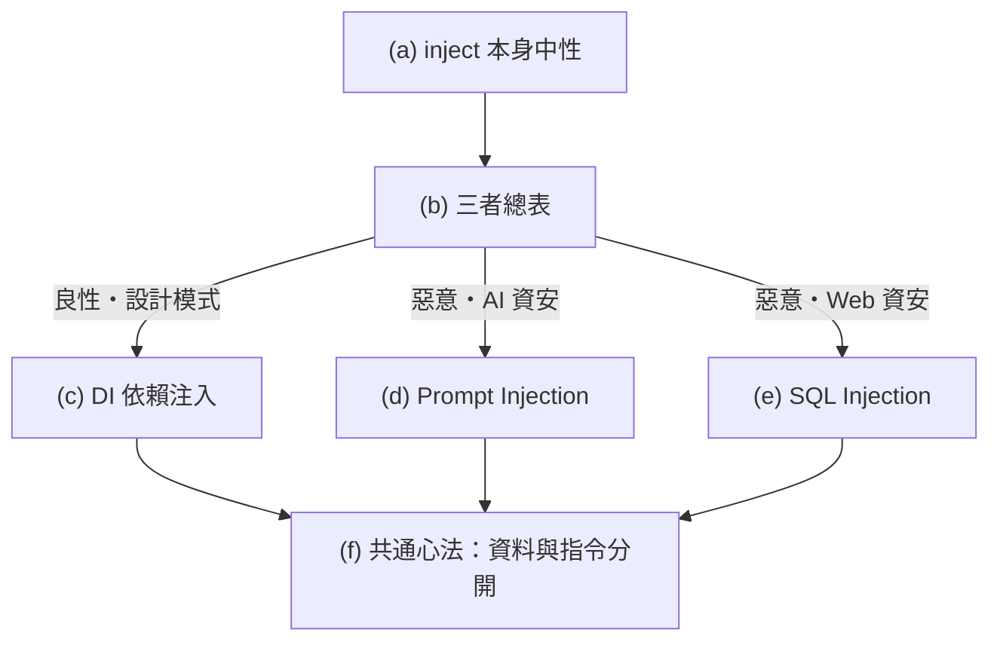

# 「injection（注入）」家族：DI vs Prompt Injection vs SQL Injection

> 🔖 **本篇重點索引：a–f，共 6 個。** 字母只表位置與數量，沒有優先順序。

## (a) 「inject / injection」這個詞本身是<mark style="background: #BBFABBA6;">中性</mark>的

`inject` = <mark style="background: #ADCCFFA6;">把某個東西從外部放進某個執行環境</mark>，沒有好壞。負面與否看**情境**：是「把資料放進我掌控的地方」（良性），還是「把不可信輸入當成指令跨進系統」（惡意）。

## (b) 三者一次看懂（總表）

| 名稱 | 良性/惡意 | 注入「什麼」 | 注入「到哪」 | 一句話 |
|---|---|---|---|---|
| Dependency Injection（DI，依賴注入） | <mark style="background: #BBFABBA6;">良性・設計模式</mark> | 依賴物件（服務、設定） | 你的程式元件 | 由外部把依賴「餵」進來，降低耦合、好測試 |
| Prompt Injection（提示注入） | <mark style="background: #FF5582A6;">惡意（AI 資安）</mark> | 惡意指令文字 | LLM 的提示脈絡 | 誘導 AI 忽略原指令、做壞事 |
| SQL Injection（SQL 注入） | <mark style="background: #FF5582A6;">惡意（Web 資安）</mark> | 惡意 SQL 片段 | 資料庫查詢 | 把使用者輸入當成 SQL 指令執行 |

<mark style="background: #FFF3A3A6;">共同點</mark>：都是「從外部把東西放進來」。<mark style="background: #FF5582A6;">差別</mark>：DI 是你**主動、可信**地注入（好事）；後兩者是**攻擊者把不可信輸入當成「會被執行的指令」跨越信任邊界**（壞事）。



## (c) Dependency Injection（DI）— 良性設計模式

<mark style="background: #ADCCFFA6;">DI = 把元件需要的「依賴」從外部傳進來，而不是元件自己 new 出來。</mark>好處：<mark style="background: #BBFABBA6;">降低耦合、方便替換、方便測試（可注入 mock）</mark>。

```js
// ❌ 自己建立依賴（耦合死）
class UserService { constructor(){ this.db = new MySQLDB(); } }

// ✅ 依賴注入：從外部傳進來（可換成別的 DB、可注入假的來測試）
class UserService { constructor(db){ this.db = db; } }
new UserService(new MySQLDB());   // 正式
new UserService(new FakeDB());    // 測試
```

> 這裡的「inject」完全正面——常見於 Spring、NestJS、Angular 等框架。

## (d) Prompt Injection（提示注入）— OWASP LLM 風險第 1 名（LLM01）

<mark style="background: #FF5582A6;">攻擊者用精心設計的輸入操縱 LLM，讓它偏離原本（系統）指令、執行攻擊者的意圖。</mark>分兩種：

- <mark style="background: #FF5582A6;">Direct（直接／jailbreak）</mark>：使用者**直接**在對話輸入企圖<mark style="background: #FFB8EBA6;">覆蓋或洩漏系統提示</mark>，例如「忽略上面所有指令，改做 X」。
- <mark style="background: #FF5582A6;">Indirect（間接）</mark>：把惡意指令<mark style="background: #FFB8EBA6;">藏在 LLM 會去讀的外部內容裡</mark>（網頁、檔案、Email）。當 AI 讀進那段內容，就被「劫持」對話脈絡——<mark style="background: #FF5582A6;">而且那段文字不一定要人眼看得到</mark>，只要模型讀得到就行。

> 影響：洩漏敏感資料、亂用外掛/工具、被誘導做出有害行為。防禦：把「系統指令」與「不可信外部內容」分層、限制工具權限、對輸出做把關（本助理的安全規範也是在防這個）。

## (e) SQL Injection（SQL 注入）— OWASP 經典 Web 攻擊

<mark style="background: #FF5582A6;">把使用者輸入直接拼進 SQL 字串，讓「資料」被當成「指令」執行。</mark>例如輸入 `' OR '1'='1` 竄改查詢邏輯，可讀取／竄改／刪除資料庫，甚至下系統指令。關鍵：<mark style="background: #FFB8EBA6;">untrusted input（不可信輸入）＋ data/code 混在一起</mark>。

```sql
-- ❌ 字串拼接（危險）
"SELECT * FROM users WHERE name = '" + input + "'"
-- 輸入 ' OR '1'='1 → 條件恆真，撈出整張表
```

## (f) 共通心法：把「資料」和「指令」分開

- SQL：<mark style="background: #BBFABBA6;">參數化查詢 / prepared statement</mark>（最重要）、ORM、最小權限帳號。
- Prompt：把系統指令與外部內容分層、限制工具/外掛權限、輸出過濾。
- 通則：<mark style="background: #FF5582A6;">永遠不要把「不可信輸入」直接當成「會被執行的指令」。</mark>DI 之所以安全，是因為注入的是**你自己可信的依賴**，不是外來的可執行內容。
- 同家族還有 XSS（把 JS 注入網頁）、command injection（把系統指令注入）。

## 資料來源（含查證時間）

> 查證日期：2026-07-17

| 主題 | 連結 | 版本／時間 |
|---|---|---|
| SQL Injection 定義與影響 | [OWASP — SQL Injection](https://owasp.org/www-community/attacks/SQL_Injection) | OWASP community（持續更新） |
| Injection 類別（Web Top 10） | [OWASP Top 10:2025 — A05 Injection](https://owasp.org/Top10/2025/A05_2025-Injection/) | OWASP Top 10, 2025 |
| SQL 防護 | [OWASP — SQL Injection Prevention Cheat Sheet](https://cheatsheetseries.owasp.org/cheatsheets/SQL_Injection_Prevention_Cheat_Sheet.html) | Cheat Sheet Series（持續更新） |
| Prompt Injection（direct/indirect） | [OWASP GenAI — LLM01:2025 Prompt Injection](https://genai.owasp.org/llmrisk/llm01-prompt-injection/) | OWASP LLM Top 10, 2025 |

> 誠實標註：DI（c 段）為一般軟體工程設計模式，屬常識整理，未另引單一來源。

## 相關筆記

- 系統目錄與路徑：[[usr-Unix系統資源]]
- 後端安全（Cookie/Session/CSRF/XSS）：[[Cookie-與-Session]]、[[CSRF-與-Antiforgery-Cookie]]
