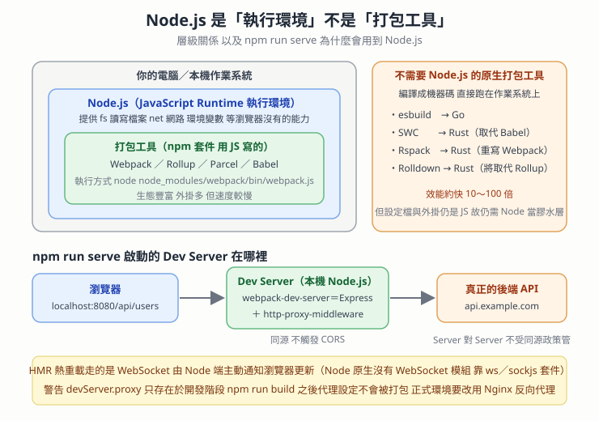

# Dev Server 跑在 Node 環境 — devServer.proxy 繞過 CORS、HMR 用 WebSocket、以及原生語言打包工具

> 本篇重點 a–r，共 18 個。
>
> 這篇回答的是「我明明只寫前端，為什麼要裝 Node.js」這個每個前端新手都問過的問題，順便把三個常被搞混的角色分乾淨：<mark style="background: #FFF3A3A6;">執行環境（Runtime）／打包工具（Bundler）／套件管理器（Package Manager）</mark>。



## 重點整理

### 一、先釐清縮寫

(a) <mark style="background: #ADCCFFA6;">Runtime（執行環境）</mark>：提供程式碼「能跑起來」所需的一切基礎能力，例如讀寫檔案、開網路連線、存取環境變數。Node.js 就是讓 JavaScript 能在瀏覽器之外執行的 Runtime。

(b) <mark style="background: #ADCCFFA6;">Bundler（打包工具）</mark>：讀取專案程式碼、解析 `import`／`export` 依賴圖，把多個 `.vue`／`.ts`／`.scss`／`.js` 檔案編譯、壓縮並合併成瀏覽器看得懂的靜態 Bundle。

(c) <mark style="background: #ADCCFFA6;">HMR（Hot Module Replacement，熱模組替換）</mark>：改完程式碼按下儲存，畫面自動更新且不用整頁重新整理、不丟失目前的狀態。

(d) <mark style="background: #ADCCFFA6;">CORS（Cross-Origin Resource Sharing，跨來源資源共享）</mark>：<mark style="background: #FF5582A6;">這是瀏覽器實施的限制，不是伺服器之間的限制</mark>——這一句是本篇 (i) 的關鍵。

### 二、Dev Server 到底在哪裡

(e) <mark style="background: #BBFABBA6;">建構工具的開發伺服器（Dev Server）就跑在你自己的電腦上，是一個 Node.js 起的 HTTP 伺服器。</mark>執行 `npm run serve`（Vue CLI／webpack）或 `npm run dev`（Vite）時，它會掛在 `http://localhost:8080` 或 `http://localhost:5173`。

(f) 底層組成：<mark style="background: #FFF3A3A6;">Vue CLI 的 `devServer` 底層是 `webpack-dev-server`，它內部用的是 Node.js 的 Express 框架加上 `http-proxy-middleware` 這層膠水。</mark>

(g) 整體位置示意：

```
[ 瀏覽器（前端頁面） ]
        │
        │ ① 發送 API 請求（例如 /api/users）到同源的 localhost:8080
        ▼
[ 本機 Dev Server ]        ← 跑在 Node.js 環境（例如 localhost:8080）
        │ 內部的 http-proxy-middleware
        │ ② 匹配到 /api 規則，由 Node.js 端發起轉發
        ▼
[ 後端 API 伺服器 ]        ← 真正的後端服務（例如 api.example.com）
```

### 三、devServer.proxy 為什麼能繞過 CORS

(h) 瀏覽器對「同源」的 `http://localhost:8080/api/...` 發起請求，所以<mark style="background: #BBFABBA6;">從瀏覽器的角度看根本沒有跨來源，不會觸發 CORS 檢查</mark>。

(i) <mark style="background: #FFF3A3A6;">真正的關鍵：CORS 是瀏覽器為了安全實施的同源政策，「伺服器對伺服器」之間的 HTTP 請求並不受它管轄。</mark>所以 Node Dev Server 再去打真正的後端，可以順利拿到資料，再把結果交還給瀏覽器。

(j) <mark style="background: #FF5582A6;">⚠️ 這個開發伺服器只存在於開發階段。</mark>當專案執行 `npm run build` 打包成靜態檔案並部署到正式環境（Nginx、Apache、Cloudflare Pages 等）時，<mark style="background: #FF5582A6;">Dev Server 與 `devServer.proxy` 設定完全不會被打包進去</mark>，正式環境的反向代理必須改由 Nginx 這類 Web 伺服器處理。這是很多人在本機好好的、一上線 API 就全炸的原因。

### 四、只寫前端為什麼需要 Node.js

(k) <mark style="background: #FFF3A3A6;">因為 `npm run serve` 本身就是一個 Node.js 程式。</mark>你寫的是最後在瀏覽器執行的程式碼沒錯，但開發階段負責打包、熱重載、提供 HTTP 服務與反向代理的那些工具，全都是用 Node.js 寫出來的。Node.js 在開發階段扮演三個角色：

1. **開發 HTTP 伺服器**：瀏覽器之所以能透過 `localhost:8080` 看到網頁，就是這個 Node.js 伺服器（Express 或 Connect 構建）在提供檔案與回應。
2. **檔案編譯與打包**：<mark style="background: #BBFABBA6;">瀏覽器只看得懂純粹的 JavaScript、HTML 和 CSS。</mark>你寫的 `.vue` 單檔案元件、Sass／Less、ES6+ 語法或 TypeScript，瀏覽器無法直接執行，Node.js 會在背景跑 `@vue/compiler-sfc`、Babel、PostCSS 把它們即時轉譯掉。
3. **開發輔助功能**：HMR 與 API 代理。

(l) <mark style="background: #FFB8EBA6;">開發階段 vs 正式部署的角色對照</mark>：

| 階段 | 誰在執行 Node.js | 發生了什麼 |
| --- | --- | --- |
| 開發（`npm run serve`） | 你的本機電腦 | Node.js 作為開發工具與伺服器運作，即時編譯、提供 localhost 服務、代理 API |
| 正式部署（`npm run build`） | <mark style="background: #BBFABBA6;">不需要 Node.js</mark>（除非用 SSR） | Node.js 把專案打包成純粹的 `index.html`、`.js`、`.css` 靜態檔，任務就結束了。這些檔案放到 Nginx 或 Cloudflare 上供使用者存取 |

### 五、HMR 靠的是 WebSocket，而 Node 原生沒有 WebSocket

(m) <mark style="background: #FF5582A6;">WebSocket 不是 Node.js 自帶的原生工具。</mark>它是 HTTP 之外的獨立網路通訊協定（`ws://` 或 `wss://`）。Node.js 核心內建的網路模組只有 `http`／`https`（標準 HTTP）、`net`（底層 TCP）、`dgram`（底層 UDP）。

(n) 要在 Node.js 伺服器端用 WebSocket，得裝第三方套件：<mark style="background: #ADCCFFA6;">`ws`</mark>（最常用、最輕量，直接實作協定）或 <mark style="background: #ADCCFFA6;">`socket.io`</mark>（在 WebSocket 之上封裝了房間 Rooms、自動重連、廣播與 Polling fallback）。

(o) <mark style="background: #BBFABBA6;">瀏覽器端則是原生自帶 WebSocket API，不用安裝任何套件</mark>：

```js
// 瀏覽器原生自帶
const socket = new WebSocket('ws://localhost:8080')

socket.onopen = () => {
  socket.send('Hello Server!')
}

socket.onmessage = (event) => {
  console.log('收到回應:', event.data)
}
```

(p) <mark style="background: #FFF3A3A6;">所以 Vue CLI 的 HMR 是怎麼來的？`webpack-dev-server` 在安裝時已經把 `ws` 或 `sockjs` 打包成它自己的相依套件（dependency）</mark>，所以你不用手動裝就自動具備即時通訊能力。這也是為什麼 `node_modules` 那麼肥。

### 六、Node.js 不是打包工具，而且新一代打包工具根本不用 Node

(q) <mark style="background: #FF5582A6;">Node.js 不算打包工具。</mark>它是執行環境，打包工具（Webpack、Vite、Rollup）是<mark style="background: #BBFABBA6;">執行在這個引擎上的應用軟體</mark>。三個角色分清楚：

| 角色 | 代表項目 | 主要職責 |
| --- | --- | --- |
| 執行環境（Runtime） | Node.js | 提供在瀏覽器之外執行 JS 的能力（`fs` 讀寫檔案、網路 Socket、環境變數） |
| 打包工具（Bundler） | Webpack, Vite, Rollup, Parcel, Esbuild | 解析依賴圖，把多檔案編譯壓縮合併成靜態 Bundle |
| 套件管理器（Package Manager） | npm, yarn, pnpm | 下載並管理打包工具與其他第三方函式庫 |

執行 `npm run build` 時底層發生的事：npm 讀 `package.json` 的 scripts → 啟動 Node.js 來執行打包工具的 JS 程式碼 → Webpack 利用 Node.js 提供的 `fs` 模組把檔案讀進來打包輸出。<mark style="background: #BBFABBA6;">打包工作完全是 Webpack／Vite 做的，Node.js 只負責提供運行環境。</mark>

(r) <mark style="background: #FFF3A3A6;">並不是所有打包工具都需要 Node.js。</mark>新一代工具改用 Go、Rust 編寫，編譯出來是機器碼（可執行檔），<mark style="background: #FFB8EBA6;">效能約快 10～100 倍</mark>：

| 工具 | 語言 | 定位 |
| --- | --- | --- |
| esbuild | Go | 極速的 JS／TS 打包與轉譯器，是獨立的二進位檔，可直接在 command line 執行 |
| SWC | Rust | 高性能轉譯器，用來取代 Babel |
| Rspack | Rust | 字節跳動（ByteDance）開發，用 Rust 重寫 Webpack 的核心架構 |
| Rolldown | Rust | Vue／Vite 團隊開發中，未來會取代 Vite 底層的 Rollup |

<mark style="background: #D2B3FFA6;">那為什麼還是要裝 Node.js？</mark>兩個原因：**膠水層與設定檔**——核心演算法是 Go／Rust 寫的，但 `vite.config.js` 以及社群絕大多數外掛仍然是 JavaScript，Vite 會啟動 Node.js 讀這些設定再傳給底層核心；**套件生態系**——npm 是 Node.js 的套件管理器，你需要它來下載這些二進位工具（npm 會依你的作業系統抓對應的 esbuild 二進位檔）。

## ⚠️ 存疑／更正

- Gemini 說「Vue CLI 底層的 `webpack-dev-server` 已將 `ws` 或 `sockjs` 打包作為它的相依套件」——<mark style="background: #BBFABBA6;">方向正確但版本有差</mark>：`webpack-dev-server` v3 時期用的是 SockJS，<mark style="background: #FF5582A6;">v4 之後預設改用 `ws`</mark>，SockJS 變成可選的 `webSocketServer` 設定。查自己專案時請以 `package-lock.json` 為準。
- Gemini 用「Node.js 想像成作業系統或引擎」這個比喻，<mark style="background: #FF5582A6;">「作業系統」的說法不精確</mark>。Node.js 是跑在作業系統之上的執行環境（內含 V8 引擎 ＋ libuv），它自己並不管理硬體資源。本篇的圖解已經把作業系統另外畫成最外層。
- 對話中提到「Vue CLI」——<mark style="background: #FF5582A6;">Vue CLI 官方已於 2026 年前進入維護模式（maintenance mode），Vue 官方文件現在一律推薦用 `create-vue` ／ Vite 建立新專案</mark>。這篇的原理仍然適用（Vite 的 `server.proxy` 概念完全一樣），但新專案不要再從 Vue CLI 起手。

## 相關題目練習

| 題目 | 連結 | 為什麼相關 |
| --- | --- | --- |
| LeetCode 2621. Sleep | https://leetcode.com/problems/sleep/ | 最小的非同步暖身，理解 Dev Server 的事件迴圈模型從這裡開始 |
| LeetCode 2622. Cache With Time Limit | https://leetcode.com/problems/cache-with-time-limit/ | 對應打包工具的快取機制（Webpack 的 `cache`、Vite 的 `node_modules/.vite` 預打包快取） |
| LeetCode 207. Course Schedule | https://leetcode.com/problems/course-schedule/ | (b) 說的「解析 `import`／`export` 依賴圖」本質就是有向圖的拓撲排序與環偵測 |
| LeetCode 210. Course Schedule II | https://leetcode.com/problems/course-schedule-ii/ | 同上，而且要輸出實際順序，等同打包工具決定模組的執行順序 |
| NeetCode — Course Schedule | https://neetcode.io/problems/course-schedule | 同上，有影片講解拓撲排序 |

## 關聯筆記

- [[Vite-HMR機制與Rollup打包原理]] — 那篇講「Vite 開發階段為什麼免打包」與「HMR 壞掉時為何整頁空白」，本篇 (m)–(p) 補的是「HMR 這條通道底下是什麼協定、Node 端靠哪個套件」，兩篇合起來才是完整的 HMR 故事。
- [[2026-06-02-Dev-Server-功能與價值]] — 那篇是從 Vite 腳手架初始化的角度紀錄的（`npm create vite`、`react-scripts` 對比），本篇則是同一個 Dev Server 的網路與執行環境剖面。
- [[編輯器與執行環境-VSCode是Electron與Toolchain]] — 同樣是「這個工具其實跑在什麼環境上」的思路：VSCode 是 Electron，Dev Server 是 Node.js。
- [[XMLHttpRequest-CORS-explanation]] — (i) 說的「CORS 是瀏覽器實施的」在那篇有完整的預檢請求（Preflight）流程。
- [[Cookie隔離邊界與跨站請求安全-Origin-SameSite-CSRF-Token與Bearer]] — 同源政策的另一面：那篇談的是「同源擋得住讀取但擋不住發送」，本篇談的是「代理如何合法地繞過同源」。
- [[WebTransport-雙向傳輸-Streams與Datagrams-掉封包與FEC]] — (m) 提到的 WebSocket 跑在 TCP 上，那篇有它跟 QUIC／WebTransport 的協定層對照。
- [[前端開發工具-打包編譯Lint與Parser]] — (q) 那張三角色表格的延伸：Lint 與 Parser 又是另一組跑在 Node 上的工具。

## 各對話來源（原文）

### Vue CLI 開發伺服器運作解析（2026-08-31）— https://gemini.google.com/app/78bcdf5f3bba396e

**使用者：** Vue CLI 的 `devServer.proxy` 是建構工具的開發伺服器反向代理，用途是把前端的 API 請求轉發到後端主機，解決本機開發的跨來源問題。它跟響應式、依賴收集、`ref()` 一點關係都沒有。建構工具的開發伺服器在哪？

**Gemini：** 開發伺服器（Dev Server）運行在你的本機開發環境（Node.js 環境）中。當你在開發階段執行 `npm run serve`（Vue CLI／webpack）或 `npm run dev`（Vite）時，建構工具會在你的電腦上啟動一個 Node.js HTTP 伺服器（通常掛在 `http://localhost:8080` 或 `http://localhost:5173`）。

- **底層核心**：Vue CLI 的 `devServer` 底層是基於 `webpack-dev-server`，它內部使用的是 Node.js 的 Express 框架以及 `http-proxy-middleware` 膠水層。
- **請求轉接**：瀏覽器對同源的 `http://localhost:8080/api/...` 發起請求，運行在 Node.js 的 Dev Server 接到後轉發給真正的後端，再把結果交還給瀏覽器。
- **跨域解決原理**：CORS 限制是瀏覽器為了安全實施的同源策略。伺服器對伺服器（Node.js Dev Server → 後端 API）之間的 HTTP 請求並不受瀏覽器同源策略限制，因此可以順利拿到資料。
- **需要特別注意**：這個開發伺服器僅存在於本機開發階段。當專案執行 `npm run build` 打包成靜態檔案並部署到正式環境（如 Nginx、Apache）時，Dev Server 與代理設定都不會被打包進去，正式環境的反向代理需改由 Nginx 等 Web 伺服器處理。

**使用者：** 如果只有前端 `npm run serve` 為何還有 Node.js？

**Gemini：** 因為 `npm run serve` 本身就是一個 Node.js 程式。雖然你寫的是「前端程式碼」，但在開發階段你需要一個工具來做打包、熱重載、提供 HTTP 服務與反向代理，而這些工具都是用 Node.js 寫出來的。Node.js 在開發階段扮演三個關鍵角色：

1. **開發 HTTP 伺服器（Dev Server）**：`npm run serve` 其實是呼叫 Vue CLI（或 Vite／webpack），它們在你的電腦上啟動一個 Node.js HTTP 伺服器（通常是 Express 或 Connect 構建的）。瀏覽器之所以能透過 `http://localhost:8080` 看到網頁，就是由這個伺服器在提供檔案與回應。
2. **檔案編譯與打包（Build Tools）**：瀏覽器只看得懂純粹的 JavaScript、HTML 和 CSS。你寫的 `.vue` 單檔案組件、Sass／Less 樣式、ES6+ 語法或 TypeScript，瀏覽器無法直接執行。Node.js 會在背景默默執行 Vue 模組編譯器（如 `@vue/compiler-sfc`）、Babel、PostCSS 等工具，即時轉譯成瀏覽器看得懂的格式。
3. **開發輔助功能（代理與熱重載）**：HMR——修改程式碼按下儲存時，Node.js 伺服器會透過 WebSocket 即時通知瀏覽器更新畫面；API 代理（`devServer.proxy`）——這是運行在 Node.js 裡的中介軟體（Middleware），瀏覽器發送 `/api` 請求給 localhost 時，是 Node.js 伺服器用 HTTP 客戶端幫你轉發到後端主機，繞過瀏覽器的 CORS 同源限制。

Gemini 並附上「開發階段 vs 正式部署」對照表，內容即本篇 (l)。

**使用者：** WebSocket 是 Node.js 自帶的工具嗎？

**Gemini：** 不是。WebSocket 是 HTTP 之外的獨立網路通訊協定（`ws://` 或 `wss://`），並不是 Node.js 內建的原生工具。

1. **Node.js 內建的網路模組**：`http`／`https`（處理標準的 HTTP 請求與回應）、`net`（底層 TCP 連線）、`dgram`（底層 UDP 連線）。Node.js 原生沒有提供 `const ws = require('websocket')` 這種可以直接開箱即用的 API。
2. **要如何使用**：需透過 npm 安裝第三方套件——`ws`（最常用、最輕量，直接實作 WebSocket 協定，效能高）或 `socket.io`（在 WebSocket 之上封裝了房間 Rooms、自動重連、廣播機制以及 Polling fallback，適合複雜的即時應用）。
3. **前端瀏覽器有內建嗎**：有。現代瀏覽器（Chrome, Firefox, Safari, Edge）都原生自帶 WebSocket API，可以直接在前端 JS 使用（程式碼見本篇 (o)）。
4. **補充：Vue CLI 裡的 WebSocket 是怎麼來的**：Vue CLI 開發伺服器支援熱重載，這個機制就是透過 WebSocket 實作的。`webpack-dev-server` 在安裝時已經將 `ws` 或 `sockjs` 這類第三方套件打包作為它的相依套件（dependency），因此不需要手動安裝就能直接具備即時通訊的能力。

**使用者：** Node.js 算打包工具嗎？

**Gemini：** 不算。Node.js 是一個 JavaScript 執行環境（Runtime），而不是打包工具。你可以把 Node.js 想像成作業系統或引擎，而打包工具（如 Webpack、Vite、Rollup）是執行在這個引擎上的應用軟體。（附三角色對照表，內容即本篇 (q)。）

為什麼容易產生誤解？執行 `npm run build` 時底層發生的事情是：npm 讀取 `package.json` 中的腳本設定 → Node.js 被啟動，用來執行打包工具（例如 Webpack 的 JS 程式碼）→ Webpack 利用 Node.js 提供的檔案讀寫能力（`fs` 模組），把專案裡的檔案讀進來打包輸出。因此打包的工作完全是由 Webpack／Vite 完成的，Node.js 只是負責提供它們運行所需的環境與資源。

**使用者：** 請問是所有的打包工具的底層環境都是需要 Node.js 的嗎？

**Gemini：** 不是所有打包工具的底層都需要 Node.js。雖然傳統上（Webpack、Rollup、Parcel）大多數打包工具都是用 JavaScript 寫的，因此必須依賴 Node.js 作為執行環境，但現代前端建構工具已經進入了「原生語言（Native Languages）」的時代。越來越多新型工具改用 Go、Rust 或 C++ 編寫，這些語言編譯出來的是機器碼（可執行檔），執行時完全不需要 Node.js 環境。

1. **傳統／基於 Node.js 的打包工具**：Webpack, Rollup, Parcel, Babel。執行方式如 `node node_modules/webpack/bin/webpack.js`。特點是生態系極度豐富、外掛多，但打包速度較慢。
2. **新一代／基於原生語言的打包工具**：直接編譯成原生可執行檔（Binary），直接調用作業系統核心與 CPU 多核心運算，效能通常比 Node.js 快 10～100 倍。esbuild（Go）、SWC（Rust，替代 Babel）、Rspack（Rust，字節跳動開發，重寫 Webpack 核心架構）、Rolldown（Rust，Vue／Vite 團隊開發中，未來會取代 Vite 底層的 Rollup）。

**既然它們不用 Node.js，為什麼我們在前端專案還是需要安裝 Node.js？** 兩個原因：一是膠水層與配置檔——雖然核心打包演算法是用 Go／Rust 寫的，但專案的配置檔（如 `vite.config.js`）以及社群大多數外掛仍然是用 JavaScript 寫的，Vite 會啟動 Node.js 來讀取這些 JS 設定，再傳給底層的 Go／Rust 核心去跑執行緒；二是套件生態系——npm 是 Node.js 的套件管理器，你需要 Node.js／npm 來下載安裝這些二進位打包工具（npm 會根據你的作業系統下載適當的 esbuild 二進位檔）。

## 資料來源（含查證時間）

| 主題 | 連結 | 版本／時間 |
| --- | --- | --- |
| Gemini 對話〈Vue CLI 開發伺服器運作解析〉 | https://gemini.google.com/app/78bcdf5f3bba396e | 對話日期 2026-08-31，擷取於 2026-09-01 |
| Vue CLI — `devServer.proxy` 設定文件 | https://cli.vuejs.org/zh/config/#devserver-proxy | Vue CLI 官方文件（專案已進入維護模式），查證於 2026-09-01 |
| webpack — DevServer 設定（`proxy`、`webSocketServer`） | https://webpack.js.org/configuration/dev-server/ | webpack 官方文件，查證於 2026-09-01 |
| Vite — Server Options（`server.proxy`、`server.hmr`） | https://vite.dev/config/server-options.html | Vite 官方文件，查證於 2026-09-01 |
| Node.js — 內建模組清單（`http`／`net`／`dgram`，無原生 WebSocket 伺服器） | https://nodejs.org/api/ | Node.js 官方 API 文件，查證於 2026-09-01 |
| MDN — WebSocket API（瀏覽器原生支援） | https://developer.mozilla.org/en-US/docs/Web/API/WebSocket | MDN 文件，查證於 2026-09-01 |
| esbuild — 官方網站（Go 撰寫、獨立二進位檔） | https://esbuild.github.io/ | 官方文件，查證於 2026-09-01 |
| Rspack — 官方網站（Rust 重寫 webpack） | https://rspack.dev/ | 官方文件，查證於 2026-09-01 |
| Rolldown — 官方網站（Rust，Vite 未來底層） | https://rolldown.rs/ | 官方文件，查證於 2026-09-01 |
| 本篇圖解 | `obsidian-attachment/學習前端工程_圖解_NodeJS執行環境與打包工具的層級關係_2026-09-01.svg` | 繪製於 2026-09-01 |

---

*由 Gemini 對話自動整理 · 更新於 2026-09-01*
