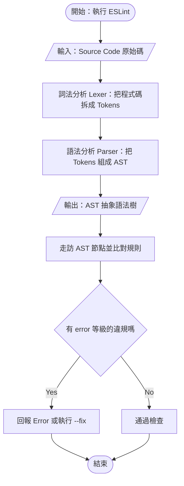

# Mermaid 流程圖——ISO 5807 標準符號與 `Error parsing` 排錯

> 本篇重點 a–m，共 13 個。
> 關聯筆記：[[HTML-Parsing-瀏覽器拿到HTTP-response-body之後]]（vault 裡第一張照 ISO 5807 畫的流程圖）、[[Vue腳手架套件全表與Linter工具鏈-npm生命週期鉤子-Oxlint與ESLint分工-Vite-Dev-Inspector]]（那篇的主軸圖就是照本篇規則畫的）、[[Jekyll與GitHub-Pages把Markdown筆記變成免費網站]]（同一張圖在 GitHub Pages 上能不能渲染）。
> 關聯的原因：Abby 的筆記規範要求「每篇一張主軸流程圖」，本篇就是那條規範的工具手冊——符號怎麼選、語法為什麼爆、三個平台（Obsidian／iThome／GitHub Pages）能不能渲染。

## 一、`flowchart TD` 本身沒有錯

<mark style="background: #BBFABBA6;">**`flowchart TD` 是 Mermaid 完全合法且標準的開頭。**</mark>出現 `Error parsing mermaid diagram` 時，問題幾乎不在這一行，而在後面某個字元。

(a) `TD` ＝ Top-Down（由上而下），同義寫法是 `TB`（Top-Bottom）；其他方向有 `LR`（左到右）、`RL`、`BT`。
(b) 舊寫法 `graph TD` 也還能用，但官方已改推 `flowchart`，兩者的邊線語法略有差異。

## 二、Mermaid parse error 的五個常見原因

| # | 原因 | 錯誤寫法 | 正確寫法 |
| --- | --- | --- | --- |
| 1 | 節點文字含括號、引號、冒號、減號 | `A[設定 Process: A]` | `A["設定 Process: A"]` |
| 2 | 用了全形標點 | `A[（開始）]` | `A["(開始)"]` |
| 3 | 節點 ID 有空格或特殊符號 | `node 1[文字]` | `node1["node 1"]` |
| 4 | 邊線標籤寫法錯 | `A -> 標籤 -> B` | `A -- 標籤 --> B` 或 `A -->|標籤| B` |
| 5 | subgraph 標題含括號 | `subgraph Parser 解析器 (Espree)` | `subgraph Parser["Parser (Espree)"]` |

(c) **最常踩的是第 1 項與第 5 項**：只要節點文字裡出現 `(` `)` `:` `-` `"`，一律用雙引號整段包起來就不會錯。
(d) **第 2 項是中文使用者專屬地雷**：中文輸入法打出的 `（）`、`“”`、`；` 都是全形字元，Mermaid 的 lexer 不認得。
(e) **第 3 項**：節點 ID 是給程式看的識別碼，只能用英數與底線；要顯示的中文請寫在中括號裡。

> [!warning] ⚠️ 更正
> Gemini 在對話中示範的那段 subgraph 其實自己就踩了第 5 項的雷：
> `subgraph ESLint_Parser [Parser 解析器 (Espree / Babel-ESLint)]` —— 中括號裡有 `(`、`)` 與 `/`，沒有用雙引號包，這段貼進 Obsidian 是**會噴 parse error 的**。
> 正確寫法是 `subgraph ESLint_Parser["Parser (Espree / Babel-ESLint)"]`。

## 三、ISO 5807 標準流程圖符號

Abby 的筆記規範要求「每篇一張主軸流程圖」，符號要照國際標準 ISO 5807（程式流程圖符號）：

| 符號形狀 | 名稱 | 用途 | Mermaid 語法 |
| --- | --- | --- | --- |
| 圓角矩形／體育場形 | Terminator 起止符號 | 流程的開始與結束 | `A([開始])` |
| 平行四邊形（斜四邊形） | Input／Output 輸入輸出 | 資料進出，例如「輸入：原始碼」 | `B[/"輸入：Source Code"/]` |
| 矩形 | Process 處理步驟 | 系統做的運算或動作 | `C[詞法分析 Lexer]` |
| 菱形 | Decision 決策 | 條件判斷，分出 Yes／No | `D{有語法錯誤嗎}` |
| 圓柱形 | Database 資料儲存 | 資料庫／持久化儲存 | `E[(資料庫)]` |
| 圓形 | Connector 連接點 | 跨頁或跨段落的接點 | `F((接點))` |

(f) **Abby 原本的疑問「起頭該不該用圓邊起止符號寫 ESLint」的答案是：不該**。起止符號寫的是**動作的起訖**（「開始：執行 ESLint」），工具名稱本身應該放在 Process 矩形裡。
(g) **輸入的原始碼用平行四邊形是對的**，Abby 這個直覺完全正確。

### 範例：ESLint 從 Source Code 到 AST 的標準流程圖



(h) 這張圖對應到 [[Vue腳手架套件全表與Linter工具鏈-npm生命週期鉤子-Oxlint與ESLint分工-Vite-Dev-Inspector]] 裡的方框 ⑤，兩篇可以互相對照。

## 四、三個平台的渲染支援（貼之前先確認）

| 平台 | 支援 Mermaid | 怎麼寫 | 注意 |
| --- | --- | --- | --- |
| Obsidian | ✅ 內建 | 用 ` ```mermaid ` 圍籬 | 版本較舊時新語法可能不支援 |
| GitHub / GitHub Pages | ✅ GitHub 內建（2022 起） | 同上 | GitHub Pages 若用 Jekyll 預設主題，**不會**自動渲染，要自己引 mermaid.js |
| iThome 鐵人賽 | ❌ 不支援 | 只能貼圖片 | 請先在 mermaid.live 匯出 PNG／SVG 再上傳 |

(i) **iThome 不吃 Mermaid**，這是 Abby 投稿時最容易踩的坑——要先在 [mermaid.live](https://mermaid.live) 產出 SVG，存進 `obsidian-attachment/` 再插圖。
(j) **GitHub Pages 要自己引 script**，見 [[Jekyll與GitHub-Pages把Markdown筆記變成免費網站]]。
(k) **自己寫 inline SVG 是最保險的**：三個平台都吃，而且可以用 highlightr 的配色，本 vault 的主軸圖多半這樣做。

## 五、排錯 SOP

(l) 貼到 [mermaid.live](https://mermaid.live) 先跑一次，它會標出**第幾行第幾個字元**出錯，比在 Obsidian 裡瞎猜快十倍。
(m) 仍找不到就用二分法：把圖砍掉一半再貼，確定是哪一半有問題，再往下砍。

## 六、資料來源（含查證時間）

| 主題 | 連結 | 版本／時間 |
| --- | --- | --- |
| 本篇原始對話一（Mermaid 排錯，Gemini） | https://gemini.google.com/app/1cf3a8ae56dd73a6 | 對話擷取 2026-09-15 |
| 本篇原始對話二（ISO 5807 符號，Gemini） | https://gemini.google.com/app/b03b80e2bc03fbdb | 對話擷取 2026-09-15 |
| Mermaid Flowchart 語法（含跳脫與引號規則） | https://mermaid.js.org/syntax/flowchart.html | Mermaid 官方文件，查證 2026-09-15 |
| Mermaid Live Editor（線上排錯） | https://mermaid.live | 查證 2026-09-15 |
| 流程圖（ISO 5807 符號說明） | https://zh.wikipedia.org/zh-tw/%E6%B5%81%E7%A8%8B%E5%9B%BE | 維基百科，查證 2026-09-15 |
| GitHub 支援 Mermaid 的公告 | https://github.blog/developer-skills/github/include-diagrams-markdown-files-mermaid/ | GitHub Blog，2022-02-14，查證 2026-09-15 |
