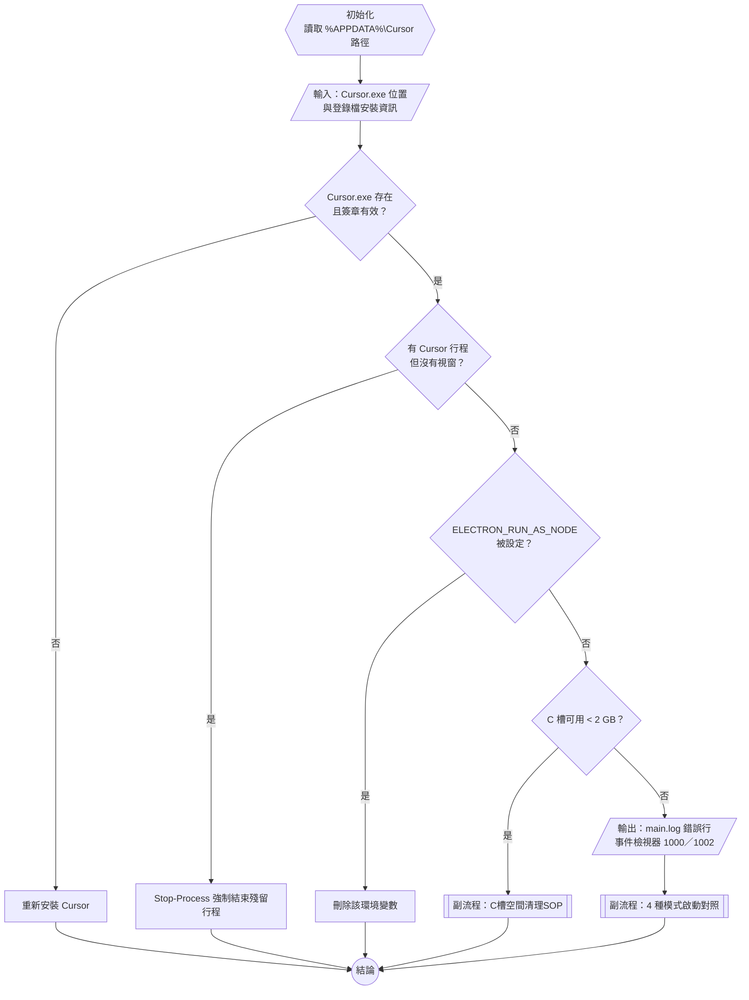

# Cursor 打不開：診斷腳本與排查流程

> 同資料夾檔案
> - `cursor-doctor.ps1`（診斷腳本本體）
> - `Cursor打不開-診斷流程.html`（互動流程圖＋自我測驗，可用 HTML reader 開）

相關筆記
- [[C槽空間清理SOP]]：C 槽滿了 → Cursor 寫不進 `state.vscdb` → 啟動失敗，所以空間不足是本篇的第 4 項檢查
- [[C槽空間週檢紀錄]]：2026-09-06 紀錄只剩約 15 GB（使用率 98%），是這次打不開的頭號嫌疑之一
- [[本機應用程式用途清單]]：列出 `.cursor` 資料夾的用途，對照本篇第 5 節要看的路徑
- [[DevTools-Performance-面板-渲染管線與Repaint判讀]]：`--disable-gpu` 關的就是那篇講的 GPU 合成（compositing）階段

---

## 1. 怎麼跑

```powershell
# 在 PowerShell 裡切到腳本所在資料夾
cd C:\coding\futuresign\Abby-notes\debugging\cursor-doctor

# a. 只做靜態檢查（不關任何程式，安全）
powershell -ExecutionPolicy Bypass -File .\cursor-doctor.ps1

# b. 靜態檢查＋實際用 4 種參數啟動 Cursor 對照（會先問你要不要關掉現有 Cursor）
powershell -ExecutionPolicy Bypass -File .\cursor-doctor.ps1 -LaunchTest
```

白話解釋
- `-ExecutionPolicy Bypass`：Windows 預設不讓你執行下載來的 `.ps1`，這個參數只對這一次執行放行，不會改系統設定
- `-File .\cursor-doctor.ps1`：告訴 PowerShell 要跑哪個檔案，`.\` 代表「目前資料夾」
- `-LaunchTest`：腳本裡宣告成 `[switch]`（開關型參數），有寫就是 `$true`，沒寫就是 `$false`

跑完會在同資料夾產生 `cursor-doctor-report-日期.txt`，把內容貼給我就能判讀。

---

## 2. 主軸圖：排查流程（ISO 5807 符號）



形狀對照
- 六邊形 `{{ }}`＝初始化
- 平行四邊形 `[/ /]`＝資料（輸入／輸出）
- 菱形 `{ }`＝判斷
- 直角矩形 `[ ]`＝處理
- 雙邊線矩形 `[[ ]]`＝副流程
- 圓形 `(( ))`＝連接點／結束

---

## 3. 腳本 10 個區段在做什麼

| # | 區段 | 誰 用什麼 做什麼 → 產物 | 抓到代表什麼 |
|---|---|---|---|
| 1 | 安裝完整性 | 腳本 用 `Get-ItemProperty`（讀登錄檔）找安裝位置 → 用 `Get-AuthenticodeSignature`（驗數位簽章）檢查 `Cursor.exe` → 產出「執行檔在不在、有沒有被改過」 | 更新到一半被中斷、防毒刪檔 |
| 2 | 殘留行程 | 腳本 用 `Get-Process` 列出所有 `Cursor` 行程 → 看 `MainWindowHandle`（視窗代號，0＝沒視窗） → 判斷是不是「有行程沒視窗」 | **最常見**：新點的 Cursor 把請求丟給卡住的舊實例，看起來像沒反應 |
| 3 | 環境變數 | 腳本 用 `[Environment]::GetEnvironmentVariable` 讀 Process／User／Machine 三層 → 找 `ELECTRON_RUN_AS_NODE`、`NODE_OPTIONS` | Cursor.exe 被當成純 Node.js 跑，一閃就結束 |
| 4 | C 槽空間 | 腳本 用 `Get-PSDrive C` 讀剩餘空間 → 小於 2 GB 判 FAIL | SQLite 寫不進去，啟動卡死 |
| 5 | 使用者資料 | 腳本 用 `Get-ChildItem` 量 `state.vscdb` 大小 → 用 `[IO.File]::Open(..., 'None')` 試獨佔開檔 → 開不了就代表被別的程式鎖住 | 資料庫過大、被 OneDrive／Syncthing／防毒咬住、`code.lock` 舊鎖 |
| 6 | main.log | 腳本 找 `%APPDATA%\Cursor\logs` 最新資料夾 → 用 `Select-String` 搜 `error／ENOSPC／EBUSY／SQLITE` → 印最後 15 行 | log 會直接寫出死因 |
| 7 | 事件檢視器 | 腳本 用 `Get-WinEvent` 讀 Application 記錄檔的事件 1000（崩潰）與 1002（無回應） → 篩出 `Cursor.exe` | 有真的 crash，並顯示出錯的 dll |
| 8 | GPU／防毒 | 腳本 用 `Get-CimInstance Win32_VideoController` 列顯示卡驅動 → 用 `Get-MpThreatDetection` 查 Defender 攔截紀錄 | 驅動太舊、檔案被隔離 |
| 9 | 啟動對照 | 腳本 用 `Start-Process` 分別以 normal／`--disable-gpu`／`--disable-extensions`／全新 `--user-data-dir` 啟動 → 等 15 秒看有沒有視窗 → 沒有就印 stderr | 用「哪一種能開」反推病灶 |
| 10 | 結論 | 腳本 依第 9 節結果 → 輸出對應修法 | 見下表 |

### 3a. 啟動對照怎麼判讀

| 能開的模式 | 病灶 | 修法 |
|---|---|---|
| normal 就能開 | 殘留行程（第 9 節開跑前已被砍掉） | 下次打不開先 `Stop-Process -Name Cursor -Force` |
| 只有 `--disable-gpu` | 顯示卡驅動或 `GPUCache` 壞掉 | 更新驅動，或刪 `%APPDATA%\Cursor\GPUCache` |
| 只有 `--disable-extensions` | 某個擴充功能卡住啟動 | 把 `%USERPROFILE%\.cursor\extensions` 裡的擴充一個個移走排查 |
| 只有全新 profile | `%APPDATA%\Cursor` 設定或 `state.vscdb` 損毀 | **先備份整個資料夾**（`系統維護-C槽清理/Cursor對話備份` 已有對話匯出，但整個資料夾仍要另外備份），再改名讓 Cursor 重建 |
| 全部都不能開 | 程式本體或系統層 | 重新安裝，並回看第 1、3、7、8 節 |

---

## 4. 關鍵語法逐行白話

```powershell
param([switch]$LaunchTest, [int]$WaitSeconds = 15)
```
「這個腳本接受兩個參數：`LaunchTest` 是開關，有寫就開啟
`WaitSeconds` 是整數，沒給就預設 15 秒。」

```powershell
$win = @($procs | Where-Object { $_.MainWindowHandle -ne 0 })
```
「把所有 Cursor 行程丟進管線（`|`），只留下視窗代號不等於 0 的那些
外面包 `@()` 是強制變成陣列，這樣就算只有 1 個結果，`.Count` 也能正確算出 1。」

```powershell
$fs = [IO.File]::Open($path, 'Open', 'ReadWrite', 'None')
```
「呼叫 .NET 的 `File.Open`，第四個參數 `'None'` 代表『我開的時候不准別人共用』
如果已經有別的程式開著這個檔，這行就會丟例外 → 被 `catch` 接住 → 回傳 `$true`（被鎖住）。」

```powershell
Start-Process -FilePath $exe -ArgumentList $argList -PassThru -RedirectStandardError $err
```
「啟動 Cursor.exe 並帶參數
`-PassThru` 讓指令把行程物件交回來，之後才能查 `HasExited`、`ExitCode`
`-RedirectStandardError` 把錯誤輸出寫進檔案，Cursor 沒開起來時我們就讀這個檔看死因。」

---

## 5. 名詞

- **Electron**：用 Chromium（畫面）＋Node.js（系統能力）包成桌面 App 的框架，VS Code 與 Cursor 都是 Electron App
- **ELECTRON_RUN_AS_NODE**：Electron 官方環境變數，設成 1 時 Electron 執行檔會以一般 Node.js 行程執行，不開任何視窗
- **state.vscdb**：VS Code 系編輯器存全域狀態（含 Cursor 對話紀錄）的 SQLite 資料庫，`-wal` 是它的預寫日誌（Write-Ahead Log）
- **Crashpad**：Chromium 的崩潰回報元件，崩潰時會留下 `.dmp`（記憶體傾印）
- **事件 1000／1002**：Windows Application Error（應用程式崩潰）／Application Hang（應用程式無回應）

---

## 6. 自我測驗

- [ ] 是非：Cursor 行程還在背景跑，但 `MainWindowHandle` 全是 0，這時再點捷徑通常會開出新視窗。
    - 答案：非，新啟動會把請求轉交給卡住的舊實例
- [ ] 填空：讓 Electron 執行檔變成純 Node.js 行程的環境變數是 ________。
    - 答案：`ELECTRON_RUN_AS_NODE`
- [ ] 申論：只有 `--user-data-dir` 指到全新資料夾時 Cursor 能開，請說明病灶在哪、修之前必須先做什麼、為什麼。

---

## 7. 參考來源

- [Electron 環境變數文件：ELECTRON_RUN_AS_NODE](https://www.electronjs.org/docs/latest/api/environment-variables)（Electron 官方，查閱於 2026-09-17）
- [VS Code 命令列參數：--disable-extensions、--disable-gpu、--user-data-dir、--verbose](https://code.visualstudio.com/docs/configure/command-line)（VS Code 官方，查閱於 2026-09-17）
- [vscode Issue #5064：ATOM_SHELL_INTERNAL_RUN_AS_NODE 導致 Electron 無法啟動](https://github.com/Microsoft/vscode/issues/5064)（2016）
- [vscode Issue #113687：ELECTRON_RUN_AS_NODE=1 外洩到子終端機](https://github.com/microsoft/vscode/issues/113687)（2020）
- [vscode Issue #220147：Electron 框架問題導致 VS Code 無法啟動](https://github.com/microsoft/vscode/issues/220147)（2024）
