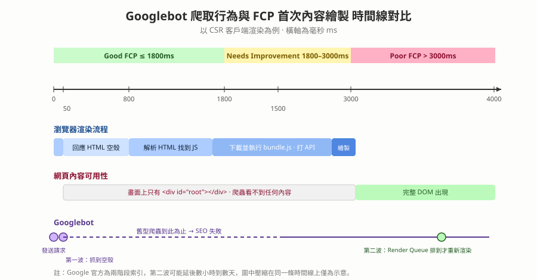

# FCP 首次內容繪製 — 與 SEO 爬蟲的關係，以及打包五步驟怎麼影響它

本篇重點 a–t，共 20 個

## 重點整理

### 一、FCP 是什麼、跟 FP 差在哪

a. <mark style="background: #ADCCFF;">FCP（First Contentful Paint，首次內容繪製）</mark>是指瀏覽器從回應使用者請求、開始載入網頁，到<mark style="background: #FFF3A3;">首次在畫面上渲染出「任何 DOM 內容」</mark>的那個時間點。

b. <mark style="background: #BBFABB;">算數的內容</mark>：文字、圖片（含背景圖）、非白色的 `<canvas>` 或 SVG。<mark style="background: #FF5582;">不算數的內容</mark>：`<iframe>` 裡面的東西、純白的空白畫面。

c. <mark style="background: #ADCCFF;">FP（First Paint，首次繪製）</mark>是「瀏覽器開始把任何像素畫上螢幕」的時間點，可能只是背景色改變或導覽列外框出現（裡面還沒有字）。

| 比較項目 | FP（First Paint） | FCP（First Contentful Paint） |
| --- | --- | --- |
| 定義 | 渲染出任何像素 | 渲染出第一個具體 DOM 內容 |
| 視覺呈現 | 背景色變了、外框出現 | 出現實質內容（文字段落、Logo、標題） |
| 對使用者的意義 | 「瀏覽器有收到請求並開始做事了」 | 「我看到網站的資訊或骨架了」 |

d. <mark style="background: #FFF3A3;">FCP 一定大於或等於 FP</mark>。要優化體驗，FCP 是更具參考價值的核心指標，因為它是使用者主觀判斷「這網站到底有沒有在載入」的第一個關鍵訊號，FCP 越快跳出率越低。

### 二、Lighthouse 怎麼看 FCP

e. <mark style="background: #FFB8EB;">分數級距（行動裝置）</mark>：
   - 綠色（快）：0 ～ 1.8 秒
   - 橘色（需改善）：1.8 ～ 3.0 秒
   - 紅色（慢）：大於 3.0 秒

f. <mark style="background: #FF5582;">⚠️ 更正 Abby 原本的記憶</mark>：對話中提到「FCP 有 0.8 秒內、0.8–3 秒、3 秒以上 poor」。<mark style="background: #BBFABB;">0.8 秒那條線其實是 TTFB（Time To First Byte，首位元組時間）的 good 門檻，不是 FCP 的</mark>。FCP 的官方門檻是 1.8 秒 / 3.0 秒（web.dev 標準），請以 (e) 為準。

g. <mark style="background: #BBFABB;">除了分數之外要看的東西</mark>：Lighthouse 報表的「商機（Opportunities）」與「診斷（Diagnostics）」區塊才是可執行的行動清單，四個跟 FCP 最相關的項目是：
   - Eliminate render-blocking resources（消除阻斷渲染的資源）：檢查有沒有擋住 DOM 渲染的 CSS 或同步 JS。
   - Minify JS / CSS（縮減程式碼）：移除無用代碼與空白。
   - Ensure text remains visible during webfont load（字型載入時文字仍可見）：避免 <mark style="background: #ADCCFF;">FOIT（Flash Of Invisible Text，不可見文字閃現）</mark>拖慢 FCP，通常用 `font-display: swap` 解決。
   - Reduce server response time（TTFB）：FCP 的起點受制於後端回應速度，TTFB 太高 FCP 不可能快。

### 三、SEO 為什麼跟爬蟲、跟 FCP 有關

h. <mark style="background: #ADCCFF;">SEO（Search Engine Optimization，搜尋引擎最佳化）</mark>的目的是讓網頁在搜尋結果排名更高。搜尋引擎靠<mark style="background: #ADCCFF;">爬蟲（Crawler／Spider）</mark>探索網路、下載並讀取網頁內容，再建立<mark style="background: #ADCCFF;">索引（Index）</mark>。

i. <mark style="background: #FFF3A3;">爬蟲是搜尋引擎「看見」你網站的唯一途徑</mark>。爬蟲爬不到內容或爬到空殼，網頁就不會被收錄，也就無從談排名。

j. Google 的爬蟲叫 <mark style="background: #ADCCFF;">Googlebot</mark>，它不只下載 HTML 原始碼，還會執行 JavaScript、解析連結、理解文字圖片與結構化資料，像真人瀏覽器一樣呈現最終頁面。

k. <mark style="background: #FF5582;">CSR（Client-Side Rendering，客戶端渲染）對 SEO 不友善的核心原因</mark>：伺服器只回傳一個空的 HTML 外殼（Shell，通常就是 `

`），內容全靠瀏覽器下載並執行 JS 之後才產生。

l. <mark style="background: #BBFABB;">SSR（Server-Side Rendering，伺服器端渲染）與 SSG（Static Site Generation，靜態網站生成）</mark>則是伺服器直接回傳含完整內容的 HTML，爬蟲在伺服器回應的當下（約 50ms）就讀得到全部內容。

m. <mark style="background: #FFB8EB;">時間線對照（以 CSR 為例）</mark>：

| 時間 | 發生什麼事 | 爬蟲看到什麼 |
| --- | --- | --- |
| 0 ms | Googlebot 發送初始請求 | — |
| 50 ms | 伺服器回傳 HTML 空殼 | 只有 `

`，沒有實際內容 |
| 800 ms | 瀏覽器解析 HTML、發現 JS 連結 | — |
| 1500 ms | 下載並執行 `bundle.js`，發 API 請求取資料 | — |
| 2800 ms | 最終頁面內容渲染完成 | 完整 DOM 終於出現 |
| 3000 ms＋ | 已落入 Poor FCP 區間 | 對 SEO 極度不利 |

n. 兩種爬蟲的結局對比：

| 爬蟲類型 | 50 ms 時 | 2999 ms 時 | SEO 結果 |
| --- | --- | --- | --- |
| 舊型／簡單爬蟲 | 爬到 HTML 空殼 | 離開，不等 JS 執行 | 失敗，認定頁面無內容 |
| 現代智慧爬蟲（Googlebot） | 爬到 HTML 空殼 | 等 JS 執行完，取得完整 DOM | 成功，但效率極低、伺服器負擔大 |

o. <mark style="background: #FF5582;">⚠️ 存疑／需補充</mark>：Gemini 把 Googlebot 描述成「在同一次請求裡等 JS 跑完」。<mark style="background: #BBFABB;">Google 官方文件的說法是「兩階段索引（two-wave indexing）」</mark>：第一波先抓原始 HTML 建立索引，需要執行 JS 的頁面會被放進一個 <mark style="background: #ADCCFF;">Render Queue（渲染佇列）</mark>，等資源有空才用 headless Chromium 渲染第二次，這中間可能隔數小時到數天。結論方向一致（CSR 對 SEO 不利），但機制不是「站在原地等」，寫進面試答案時要用兩階段的說法。

p. <mark style="background: #FFF3A3;">一句話總結</mark>：SEO 需要爬蟲，而爬蟲讀取內容的能力直接受限於網頁的首次渲染速度。所以 SEO 至關重要的頁面（登陸頁、部落格文章）應該用 SSR 或 SSG。

### 四、打包五步驟怎麼一路影響 FCP

q. <mark style="background: #ADCCFF;">打包（Bundling）</mark>指的是 Webpack、Vite、Rollup 這類工具把原始碼處理成瀏覽器可用檔案的過程，五個核心步驟每一步都牽動 FCP：

r. 五步驟與 FCP 的關係：
   1. <mark style="background: #ADCCFF;">解析與依賴圖建立（Parsing & Dependency Resolution）</mark>：從 Entry Point 出發遞迴解析所有 `import` / `require`。若引入肥大的第三方套件又沒做好 Tree Shaking，打包體積變大、傳輸時間拉長，FCP 就被延後。
   2. <mark style="background: #ADCCFF;">轉換與編譯（Transformation / Loader）</mark>：用 Babel、TypeScript 或 SWC 把 ES6+、JSX 轉成瀏覽器看得懂的語法，避免因不支援語法而停滯。
   3. <mark style="background: #ADCCFF;">程式碼分割（Code Splitting）</mark>：用 <mark style="background: #BBFABB;">動態匯入 `import()`</mark> 把程式碼拆成多個 chunk 做按需載入。<mark style="background: #FFF3A3;">這一步對 FCP 幫助最大</mark>，因為首頁不必載入其他頁面的巨大程式碼，首屏 JS 體積降到最低。
   4. <mark style="background: #ADCCFF;">最佳化與壓縮（Minification & Tree Shaking）</mark>：Terser 移除空白換行、縮短變數名，Tree Shaking 剃掉沒用到的 export。檔案越小網路傳輸越快，主執行緒（Main Thread）越早開工，FCP 秒數大幅下降。
   5. <mark style="background: #ADCCFF;">輸出與資源雜湊（Emitting & Hashing）</mark>：輸出檔名加雜湊值（例如 `main.82b21c.js`）搭配長期快取（Long-term Caching），使用者回訪時直接讀快取，達到接近秒開的 FCP。

s. <mark style="background: #FFF3A3;">Abby 原本的直覺是對的</mark>：「bundle、minify 做得好，Lighthouse 效果才會好」——因為第 3、4、5 步直接決定首屏要下載與解析多少位元組，而那正是 FCP 起跑到終點之間最長的一段。

t. <mark style="background: #D2B3FF;">延伸備註</mark>：FCP 只是 Lighthouse 效能分數的其中一項權重，另外還有 LCP（Largest Contentful Paint，最大內容繪製）、TBT（Total Blocking Time，總阻塞時間）、CLS（Cumulative Layout Shift，累積版面配置位移）等指標，優化時不要只盯著 FCP 一個數字。

## 圖解

## 練習題（LeetCode／NeetCode 對應）

> 這是偏系統與效能的主題，LeetCode 沒有直接對應題，以下挑「概念骨架相同」的題目練手感。

- LeetCode 207 — Course Schedule：https://leetcode.com/problems/course-schedule/ 　打包第 1 步的「依賴圖」本質就是有向圖＋拓撲排序，循環相依就是這題的環偵測。
- LeetCode 210 — Course Schedule II：https://leetcode.com/problems/course-schedule-ii/ 　輸出依賴的正確載入順序，等同 bundler 決定模組執行順序。
- NeetCode — Graph 專題（含上面兩題影片解說）：https://neetcode.io/practice 　建立依賴圖直覺後再回頭看 Rollup 的 module graph 會很好懂。

## 關聯筆記（附關聯原因）

- [[Vite-HMR機制與Rollup打包原理]] — 那篇是本篇 (r) 五步驟在 Vite / Rollup 上的具體實作，本篇補上「這五步各自怎麼影響 FCP 秒數」。
- [[gatsby-static-site-generator]] — 本篇 (l) 說 SSG 能讓爬蟲在 50ms 拿到完整 HTML，那篇是 SSG 的實際工具說明。
- [[DNS查詢-TCP與TLS握手RTT-邊緣節點與網頁效能]] — 本篇 (g) 說 TTFB 決定 FCP 的起跑點，那篇解釋 TTFB 之前的 DNS 與握手成本從哪來。
- [[CloudFront-CDN概念與快取失效Invalidation]] — 對應 (r) 第 5 步的長期快取策略，CDN 是把這個效果放大到全球節點。
- [[Node-js底層架構-V8-libuv-Bindings與CSR澄清]] — 那篇已澄清過 CSR 的定義，本篇 (k) 直接沿用該定義討論它對 SEO 的代價。

## 各對話來源（原文）

### FCP 優化與前端打包解析（2026-08-27）— https://gemini.google.com/app/7ee6da02bef71e28

使用者：Fcp first contentful paint 是什麼，比較 fp，並且把前端開發者所會需要知道跟 FCP 有關的 lighthouse 知識也加進去，除了分數還有嗎，跟打包的五個步驟也連結一下，因為 bundle minify 做得好 lighthouse 效果才會好嘛，減少無用檔案

Gemini：一、什麼是 FCP：FCP 是指瀏覽器從回應使用者請求、開始載入網頁到首次在畫面上渲染出任何 DOM 內容的時間點。包含的內容：文字、圖片（包含背景圖）、非白色的 `<canvas>` 或 SVG。不包含的內容：`<iframe>` 內的內容、或是白色的空白畫面。為什麼重要：它是使用者主觀感受「網站有沒有在載入」的第一個關鍵指標。二、FCP vs FP：FP 是瀏覽器開始渲染任何像素到螢幕上的時間點（可能是背景顏色改變、或是導覽列的外框出現）；FCP 是瀏覽器渲染出第一個具體內容（DOM）的時間點（畫面上必須出現實質的內容）。FCP 永遠大於或等於 FP。三、Lighthouse 與 FCP：分數級距（行動裝置）綠色 0～1.8 秒、橘色 1.8～3.0 秒、紅色大於 3.0 秒。除了整體效能分數，開發者更應該看商機（Opportunities）與診斷（Diagnostics）區塊：消除阻斷渲染的資源、縮減 JavaScript / CSS、有效載入字型（避免 FOIT）、減少伺服器回應時間（TTFB）。四、前端打包的五大步驟與 FCP 的連結：（1）解析與依賴圖建立，若沒做好 Tree Shaking 會導致打包體積變大、延後 FCP；（2）轉換與編譯，透過 Babel、TypeScript 或 SWC 轉譯，避免瀏覽器解析不支援語法而停滯；（3）程式碼分割，透過 Dynamic Import 拆成多個 chunk 實現按需載入，對 FCP 幫助極大；（4）最佳化與壓縮，Terser 移除空白換行縮短變數名、Tree Shaking 剃除未使用的 exports，檔案越小網路傳輸越快；（5）輸出與資源雜湊，加上檔案雜湊值搭配長期快取，使用者回訪時可直接從快取讀取。

### SEO、爬蟲與首次渲染的關係（2026-08-27）— https://gemini.google.com/app/9e25a1fa1fe501e3

使用者：為什麼 seo 跟爬蟲有關係呀？Google 引擎是用爬蟲嗎？爬蟲不是找資料用的嗎？而且首次渲染還跟爬蟲有關係？可以幫我畫一個時間線圖是首次渲染的秒數（我記得 FCP 有 0.8 秒內、0.8-3 秒、3 秒以上 poor）跟爬蟲的秒數嗎？因為我還是沒辦法視覺化知道他們有什麼關係

Gemini：（產出一份時間線視覺化資料，內容為：0 ms Googlebot 發送初始請求；50 ms 伺服器回傳 HTML CSR Shell，簡單爬蟲只爬到空殼；800 ms 達到 Good FCP 標準，瀏覽器開始解析 HTML 發現 JS 連結；1500 ms 瀏覽器下載並執行 bundle.js，發送 API 請求；2800 ms 最終頁面內容渲染完成；3000 ms 之後渲染的內容對 SEO 極度不利。並附「簡單爬蟲 vs 現代爬蟲」對比：舊型爬蟲在 2999 ms 離開不等待 JS，SEO 失敗；現代 Googlebot 會等 JS 執行完畢取得完整 DOM，SEO 成功但效率極低。）

文字解答：1. 為什麼 SEO 跟爬蟲有關係：SEO 的核心目的是讓網頁在搜尋結果中排名更高，搜尋引擎透過爬蟲來探索網際網路、下載並讀取網頁內容，然後建立索引。如果爬蟲爬不到您的網頁內容，或爬到的內容是空的，網頁就不會被收錄。2. Google 引擎是用爬蟲嗎：是的，其背後運作的基礎就是 Googlebot。3. 爬蟲不是找資料用的嗎：完全正確，但它找資料的方式決定了它的 SEO 價值；網站索引爬蟲必須更深入地閱讀頁面內容，理解文字、圖片、結構化資料，甚至執行 JavaScript。4. 首次渲染跟爬蟲的關係：傳統伺服器渲染（SSR）伺服器直接回傳包含完整內容的 HTML，爬蟲在 50ms 就能讀取所有內容；客戶端渲染（CSR）伺服器只回傳一個空的 HTML 外殼，內容全靠瀏覽器下載並執行 JS 後才產生。Googlebot 現在會嘗試等待並執行 JS，但這對 SEO 是巨大的懲罰，因為 Google 資源被嚴重浪費，如果渲染總是拖到 3 秒甚至更久，Googlebot 可能會降低爬取頻率或認定該頁面體驗不佳而降低排名。總結：SEO 需要爬蟲，而爬蟲讀取內容的能力直接受限於網頁的首次渲染速度；建議 SEO 至關重要的頁面使用 SSR 或 SSG。

## 資料來源（含查證時間）

| 主題 | 連結 | 版本／查證時間 |
| --- | --- | --- |
| 本篇 Gemini 對話（SEO 與爬蟲） | https://gemini.google.com/app/9e25a1fa1fe501e3 | 2026-08-27 擷取 |
| 本篇 Gemini 對話（FCP 與打包） | https://gemini.google.com/app/7ee6da02bef71e28 | 2026-08-27 擷取 |
| web.dev — First Contentful Paint (FCP) 定義與 1.8s / 3.0s 門檻 | https://web.dev/articles/fcp | 2026-08-27 查證 |
| web.dev — Time to First Byte (TTFB) 0.8s 門檻（用來更正本篇 f） | https://web.dev/articles/ttfb | 2026-08-27 查證 |
| Google Search Central — Understand JavaScript SEO basics（兩階段索引與 Render Queue） | https://developers.google.com/search/docs/crawling-indexing/javascript/javascript-seo-basics | 2026-08-27 查證 |
| Chrome for Developers — Lighthouse Performance scoring | https://developer.chrome.com/docs/lighthouse/performance/performance-scoring | 2026-08-27 查證 |
| MDN — font-display（避免 FOIT） | https://developer.mozilla.org/en-US/docs/Web/CSS/@font-face/font-display | 2026-08-27 查證 |
| Rollup 官方文件 — Code Splitting | https://rollupjs.org/tutorial/#code-splitting | 2026-08-27 查證 |
