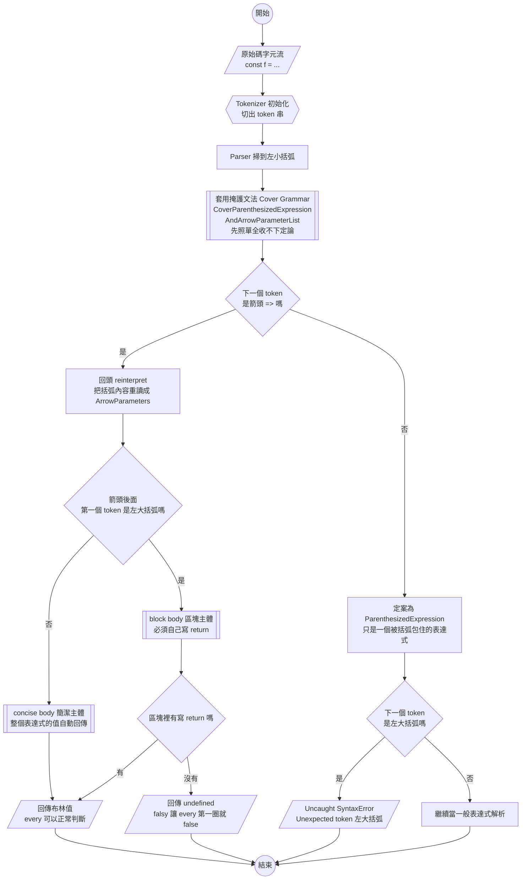
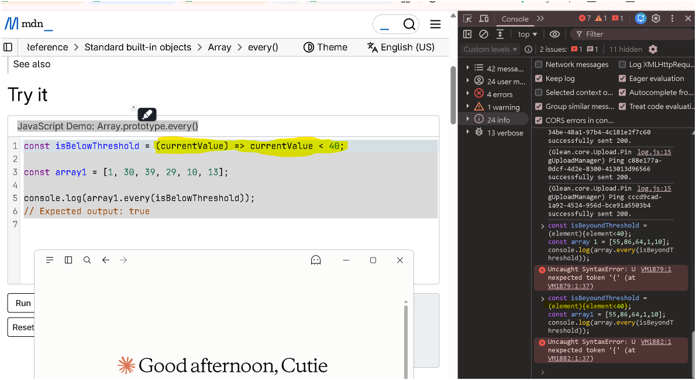

# every() 短路求值與初始長度快照｜箭頭函式改寫成一般函式的四個錯

> [!info] 本篇重點 a–v，共 22 個
> 三場對話合併：兩場 Gemini（「箭頭函式檢查小於 40」與「`!isValid(request)` 為什麼建議改寫成 `every`」），一場 Claude（2026-09-18，實測把 MDN 的箭頭函式 callback 改寫成一般函式，連噴四個錯）。
> 關聯筆記：<mark style="background: #ADCCFFA6;">[[箭頭函式的兩組括號-參數小括弧與主體大括弧-隱式回傳]]</mark> 講「兩組括號各自的規則」，本篇第二節是它的<mark style="background: #FF5582A6;">實戰驗屍報告</mark>，示範當兩組括號被拆錯時 parser 會在哪一個 token 停下來。
> <mark style="background: #ADCCFFA6;">[[04-filter方法與callback定義]]</mark> 講同一族 callback 三參數簽名 `(value, index, array)`，本篇把重心放在「短路」與「長度快照」這兩個 `filter` 沒有的行為。
> <mark style="background: #ADCCFFA6;">[[高階函式與函數式範式-取代OOP三大設計模式]]</mark> 講為什麼宣告式寫法能取代樣板程式碼，本篇第六節是它在 `every` 上的具體案例。

---

## 主軸圖：parser 看到 `(` 之後走哪一條路

> 這張圖是本篇的定位圖。後續追問請指回圖上的某個方框，不要另開章節。
> 依 ISO 5807：六邊形＝初始化、直角矩形＝處理、菱形＝判斷、雙邊線矩形＝副流程、平行四邊形＝資料（輸入／輸出）、圓形＝連接點。



> [!tip] 你這次踩到的是哪一格
> 你寫 `(element){element<40}` 走的是右下角 `Q1 -- 否` → `Q4 -- 是` → <mark style="background: #FF5582A6;">紅色的 SyntaxError</mark>。
> 你如果補上 `function` 卻忘記 `return`，走的是左邊 `Q3 -- 沒有` → <mark style="background: #FFB86CA6;">回傳 undefined</mark>，那條路<mark style="background: #FFF3A3A6;">不報錯但答案永遠是 `false`</mark>，更難抓。

---

## 重點整理

### 一. 先讀懂 MDN 那個 callback

```js
const isBelowThreshold = (currentValue) => currentValue < 40
```

(a) `const` 宣告一個不可重新賦值的綁定，名字叫 `isBelowThreshold`。
　　不可重新賦值 ≠ 值不可變，只是不能再 `isBelowThreshold = 別的東西`。

(b) `=>` 是箭頭函式（Arrow Function）。它跟 `function` 的差別在於：<mark style="background: #FF5582A6;">沒有自己的 `this`、沒有 `arguments`、不能當建構子 `new`、沒有 `prototype` 屬性、不能當 generator</mark>。當 callback 用時這五件事通通不需要，所以箭頭函式最合適。

(c) `(currentValue)` 是形式參數（parameter）。
　　呼叫 `every` 時，陣列每一個元素會被當成實際參數（argument）餵進來。

(d) 箭頭後面直接接 `currentValue < 40` 是<mark style="background: #ADCCFFA6;">簡潔主體（concise body）</mark>，等同於 `{ return currentValue < 40 }`，運算結果自動被 return。

(e) <mark style="background: #FFF3A3A6;">`<` 是嚴格小於，不含等於。`40` 本身會得到 `false`。</mark>

---

### 二. 你把它改成「一般函式」為什麼壞掉（2026-09-18 實測）



你實際貼進 Console 的是這三行：

```js
const isBeyondThreshold = (element){element<40};
const array 1 = [55,86,64,1,10];
console.log(array.every(isBeyondThreshold));
```

Console 回你：`Uncaught SyntaxError: Unexpected token '{'`，而且<mark style="background: #FFF3A3A6;">游標指在第 1 行左大括弧那個位置</mark>。

(f) <mark style="background: #FF5582A6;">第一個錯（致命）：你只把 `=>` 刪掉，沒有補上 `function` 關鍵字。</mark>
　　`=>` 不是可省略的裝飾符號，它是<mark style="background: #BBFABBA6;">箭頭函式唯一的識別 token</mark>。
　　拿掉它又沒補 `function`，你留下的 `(element)` 在文法上只是<mark style="background: #ADCCFFA6;">一個被小括弧包住的表達式（ParenthesizedExpression）</mark>，也就是「一個叫 element 的變數，外面套了一層括號」。
　　一個表達式後面直接接左大括弧，文法上接不下去，parser 只能拋 SyntaxError。

(g) 底層原因是<mark style="background: #D2B3FFA6;">掩護文法（Cover Grammar）</mark>，也就是主軸圖中間那個雙邊線方框。
　　情境是這樣：parser 從左到右一個 token 一個 token 讀，讀到 `(` 的當下，它<mark style="background: #FFF3A3A6;">還不知道</mark>這是「括號表達式」還是「箭頭函式的參數列」，因為兩者開頭長得一模一樣。
　　ECMA-262 的解法是先定義一條夠寬鬆的產生式 `CoverParenthesizedExpressionAndArrowParameterList` 把括號裡的東西照單全收，不下定論。
　　接著 parser 看下一個 token 是不是 `=>`：
　　- 是 `=>` → 回頭把剛才收下的內容 <mark style="background: #BBFABBA6;">reinterpret（重新解讀）成 ArrowParameters 參數列</mark>，繼續組出箭頭函式。
　　- 不是 `=>` → 定案為 ParenthesizedExpression，剛才收下的內容就永遠是「表達式」了。
　　你的程式碼走的是第二條，所以 `element` 被當成一個變數名而不是參數名，後面的 `{` 就成了非法 token。
　　順帶一提：規範規定 `=>` <mark style="background: #FF5582A6;">前面不可以換行</mark>（`[no LineTerminator here]`），因為換行會讓這個「回頭重讀」的機制失效。

(h) <mark style="background: #FF5582A6;">第二個錯（安靜的殺手）：就算你補上 `function`，大括弧的身分也換了，`return` 要自己寫。</mark>

```js
// ❌ 語法過了，但每一圈都回 undefined
const isBelowThreshold = function (element) { element < 40 }
;[55, 86, 64, 1, 10].every(isBelowThreshold)   // false，而且是因為 undefined 是 falsy

// ✅ 一般函式的大括弧一律是 block body，必須明寫 return
const isBelowThreshold = function (element) { return element < 40 }
```

　　箭頭函式的 concise body 有<mark style="background: #ADCCFFA6;">隱式回傳（implicit return）</mark>，`function` 完全沒有這回事。
　　你在主軸圖上走的是 `Q3 -- 沒有` 那條線。詳細的兩種主體對照見 [[箭頭函式的兩組括號-參數小括弧與主體大括弧-隱式回傳]] §2。

(i) <mark style="background: #FFB86CA6;">第三個錯：`const array 1 = [...]` 中間多一個空白。</mark>
　　識別碼（identifier）不能包含空白字元，`array 1` 會被切成 `array` 與 `1` 兩個 token。
　　parser 讀完 `const array` 就以為宣告到此為止，於是抱怨 <mark style="background: #FFF3A3A6;">`SyntaxError: Missing initializer in const declaration`</mark>（`const` 一定要在同一個宣告裡給初始值），而不是 `Unexpected token`。這行單獨執行也是 SyntaxError。
　　你之所以只看到左大括弧那個錯，是因為<mark style="background: #FFF3A3A6;">引擎在 parse 階段遇到第一個語法錯誤就整段中止</mark>，後面幾行根本沒被檢查。這跟 [[15-ReferenceError-vs-undefined-值與錯誤的分界]] 講的「parse 期錯 vs 執行期錯」是同一條分界線。

(j) <mark style="background: #FFB86CA6;">第四個錯（執行期）：你宣告的是 `array1`，卻呼叫 `array.every(...)`。</mark>
　　就算前面三個都修好，這行會丟 `Uncaught ReferenceError: array is not defined`。

(k) 另外一個不是錯但會誤導自己的地方：<mark style="background: #FFF3A3A6;">函式名字跟條件對不起來。</mark>
　　你取名 `isBeyondThreshold`（超過門檻），條件卻寫 `< 40`（低於門檻）。
　　用你的資料實測，兩種條件都會得到 `false`，但理由完全不同：

| 寫法 | 逐圈發生什麼事 | 結果 |
| --- | --- | --- |
| `[55,86,64,1,10].every(v => v < 40)` | 第 1 圈 `55 < 40` 就是 `false`，<mark style="background: #BBFABBA6;">立刻短路</mark>，後面四個沒跑 | `false` |
| `[55,86,64,1,10].every(v => v > 40)` | 55✓ 86✓ 64✓ 都過，第 4 圈 `1 > 40` 才 `false`，第 5 個沒跑 | `false` |

　　命名要對得上條件，否則半年後回來讀自己的程式碼會先誤判一次。

#### 三種正確寫法對照（行為完全相同）

```js
// 寫法 A：箭頭函式 ＋ concise body（MDN 用的，最短）
const isBelowThreshold = (currentValue) => currentValue < 40

// 寫法 B：函式運算式（function expression）＋ block body，必須寫 return
const isBelowThreshold = function (currentValue) {
  return currentValue < 40
}

// 寫法 C：函式宣告（function declaration），會被 hoist 到作用域頂端
function isBelowThreshold(currentValue) {
  return currentValue < 40
}

const array1 = [1, 30, 39, 29, 10, 13]
console.log(array1.every(isBelowThreshold))   // true
```

> [!warning] B 與 C 不只是寫法差別
> 寫法 C 有<mark style="background: #FF5582A6;">函式宣告提升（hoisting）</mark>，寫在 `console.log` 後面也能用；寫法 A 與 B 都綁在 `const` 上，有 TDZ，必須先宣告後使用。詳見 [[09-Hoisting-函式宣告vs函式表達式-TDZ]]。

---

### 三. 「普通函式」這個講法對嗎

(l) 口語上可以，別人聽得懂，但<mark style="background: #FFF3A3A6;">規範裡沒有「普通函式」這個術語</mark>。MDN 在跟箭頭函式對比時用的字是 **traditional function** 或 **regular function**，中文社群翻成「<mark style="background: #BBFABBA6;">一般函式</mark>」或「<mark style="background: #BBFABBA6;">傳統函式</mark>」比較通用。建議統一用「一般函式」。

| 你想講的東西 | 建議中文 | 英文 | ECMA-262 產生式名稱 |
| --- | --- | --- | --- |
| `function f() {}` | 函式宣告 | function declaration | `FunctionDeclaration` |
| `const f = function () {}` | 函式運算式（匿名） | anonymous function expression | `FunctionExpression` |
| `const f = function g() {}` | 具名函式運算式 | named function expression | `FunctionExpression` |
| `const f = () => {}` | 箭頭函式 | arrow function | `ArrowFunction` |
| A、B、C 三者的統稱，用來對比箭頭函式 | 一般函式／傳統函式 | traditional / regular function | 無專屬產生式 |

(m) <mark style="background: #FF5582A6;">一個常見的誤解要先拆掉</mark>：不能說「函式運算式 vs 箭頭函式」，因為<mark style="background: #ADCCFFA6;">箭頭函式本身也是一種 expression</mark>，`const f = () => {}` 同樣是「把一個函式運算式賦值給 f」。
　　正確的兩組對立是：
　　- 位置維度：**函式宣告（statement）** vs **函式運算式（expression）** ← 決定有沒有 hoisting
　　- 語法維度：**一般函式（`function` 關鍵字）** vs **箭頭函式（`=>`）** ← 決定有沒有自己的 `this`、`arguments`、`prototype`

---

### 四. 「不會存取超出陣列初始長度的元素」是什麼意思

(n) 規格的意思是：<mark style="background: #FFF3A3A6;">`every()` 一開始執行時就把 `length` 拍了一張快照，之後你在 callback 裡怎麼 `push`，它都不會多跑那幾圈。</mark>

```js
const arr = [1, 2, 3]

arr.every((val, index, array) => {
  array.push(99)                        // 每一圈都往後面塞新元素
  console.log(`檢查索引 ${index}，值為 ${val}`)
  return val < 10
})
// 檢查索引 0，值為 1
// 檢查索引 1，值為 2
// 檢查索引 2，值為 3
// arr 最後是 [1, 2, 3, 99, 99, 99]，但那三個 99 完全沒被檢查過
```

(o) 逐行拆解：`array` 是 callback 的第三個參數，<mark style="background: #ADCCFFA6;">指向的就是原陣列本體（傳址）</mark>，所以 `array.push` 真的會改到 `arr`。

(p) <mark style="background: #FF5582A6;">陷阱：長度快照只擋「往後長」，不擋「往前縮」。</mark>
　　如果你在 callback 裡 `pop()` 或 `splice()` 把元素刪掉，走到那些索引時會讀到 `undefined`（更精確說是該索引已不存在，會被當成 hole 跳過或讀成 `undefined`，視刪法而定）。
　　所以規則不是「陣列被凍結」，而是「<mark style="background: #BBFABBA6;">圈數被凍結</mark>」。

(q) 同一套規則適用於 `forEach`、`map`、`filter`、`some`、`every`。這是 ES5 這一批陣列方法共用的規格描述。

---

### 五. `!isValid(request)` 的邏輯拆解

```js
for (const request of requests) {
  if (!isValid(request)) { everyRequestValid = false; break }
}
```

(r) `isValid(request)` 回傳布林值：有效回 `true`，無效回 `false`。

(s) `!` 是邏輯非（Logical NOT）運算子，把結果反轉：

| request 狀態 | `isValid(request)` | `!isValid(request)` | 進 if 嗎 |
| --- | --- | --- | --- |
| 無效 | `false` | `true` | <mark style="background: #FF5582A6;">進去，標記失敗並 break</mark> |
| 有效 | `true` | `false` | 不進去，繼續下一筆 |

(t) 整段話翻成人話：<mark style="background: #FFF3A3A6;">「只要發現任何一個 request 無效，就把整體標記為無效並跳出迴圈。」</mark>

---

### 六. 為什麼講者建議改寫成 `every`

```js
// 重構前（命令式 Imperative）
let everyRequestValid = true
for (const request of requests) {
  if (!isValid(request)) { everyRequestValid = false; break }
}
if (everyRequestValid) { /* ... */ }

// 重構後（宣告式 Declarative）
if (requests.every(isValid)) { /* ... */ }
```

(u) 四個理由：

- **意圖更直覺**：命令式要讀者一步步追變數狀態與迴圈流程，`requests.every(isValid)` 直接用英文語意說「是不是每個 request 都有效」。
- **減少樣板程式碼（Boilerplate）**：省掉暫存變數、`for...of`、`if`、手動 `break`、最後那個 `if`。
- **避免狀態污染**：少一個可變動的 `let`，就少一個被其他地方誤改的風險。
- **自動具備短路求值（Short-circuiting）**：<mark style="background: #BBFABBA6;">`every()` 遇到第一個回傳 `false` 的元素就立刻停，效能跟手寫 `break` 完全相同</mark>，但程式碼乾淨很多。

(v) <mark style="background: #D2B3FFA6;">補充一個面試常考的邊界</mark>：空陣列 `[].every(fn)` 回傳 `true`（vacuous truth，空真），`[].some(fn)` 回傳 `false`。
　　如果 `requests` 可能是空的，要先確認「零筆算不算通過」符合你的商業邏輯。

---

## 程式碼範例（同層資料夾）

| 檔名 | 用途 |
| --- | --- |
| `06-demo-every-length-snapshot.js` | 跑 `node 06-demo-every-length-snapshot.js`，親眼看到 push 進去的元素沒被檢查 |
| `06-demo-arrow-vs-function-syntax.js` | 跑 `node 06-demo-arrow-vs-function-syntax.js`，把本篇第二節四個錯用 `eval` 逐一重現，並印出正確寫法的結果 |
| `06-every短路求值與初始長度快照-命令式重構為宣告式.html` | 互動版：填空、是非題、申論題、逐格 highlight 的 parser 主軸圖 |

---

## 練習題（LeetCode / 30 Days of JavaScript）

| 題號 | 題名 | 為什麼相關 |
| --- | --- | --- |
| 2634 | [Filter Elements from Array](https://leetcode.com/problems/filter-elements-from-array/) | 手刻 `filter`，會逼你面對 callback 三參數與長度快照 |
| 2635 | [Apply Transform Over Each Element in Array](https://leetcode.com/problems/apply-transform-over-each-element-in-array/) | 手刻 `map`，同一族簽名 |
| 2626 | [Array Reduce Transformation](https://leetcode.com/problems/array-reduce-transformation/) | 累加器版本的高階函式 |
| 2629 | [Function Composition](https://leetcode.com/problems/function-composition/) | 函式當參數與回傳值，宣告式思維 |
| 2620 | [Counter](https://leetcode.com/problems/counter/) | 回傳函式本身 vs 回傳呼叫結果，會逼你分清 concise body 與 block body |
| 2703 | [Return Length of Arguments Passed](https://leetcode.com/problems/return-length-of-arguments-passed/) | <mark style="background: #FFF3A3A6;">必須用一般函式或 rest 參數</mark>，因為箭頭函式沒有 `arguments`，正好驗證本篇 (b) |

---

## 各對話來源（原文）

### Claude：箭頭函式改寫成一般函式的 SyntaxError（2026-09-18）

**Abby：** 請問這為什麼換成普通函式的寫法而非箭頭函式不行？我話說我叫他普通函式是對的嗎

**Claude：** 不是「一般函式不行」，是那段寫法既不是箭頭函式也不是一般函式——`=>` 被刪掉之後沒有補 `function`，parser 走掩護文法那條路把 `(element)` 定案成括號表達式，後面的 `{` 就成了非法 token。另外一般函式的 `{}` 沒有隱式回傳，必須自己寫 `return`。術語上「普通函式」不是規範用字，MDN 用 traditional / regular function，中文建議說「一般函式」。（完整拆解見上方第二、三節）

### Gemini：JavaScript 箭頭函式小於 40 檢查（2026-08）— https://gemini.google.com/app/82fbb980432600fc

**使用者：** `const isBelowThreshold = (currentValue) => currentValue < 40;` 檢查值是否小於40還是轉成...

**Gemini：** 這段程式碼是用來檢查傳入的值是否「嚴格小於 40」。`currentValue < 40`：若 `currentValue` 小於 40，回傳 `true`，否則回傳 `false`。在 `Array.prototype.every()` 中，它被作為測試函數（callback），用來確認陣列裡的每一個元素是否都小於 40。

**使用者：** 当开始调用 every() 时，callbackFn 将不会访问超出数组初始长度的任何元素。什麼意思

**Gemini：** 這句話的意思是：`every()` 在執行前，就已經先「固定」了陣列的長度。如果在執行 `every()` 的過程中，你在 callbackFn 裡面動態新增元素到陣列中，`every()` 不會去檢查那些新加進去的元素。（程式碼範例與執行結果見上方第四節）

### Gemini：解釋 `!isValid(request)` 邏輯（2026-08）— https://gemini.google.com/app/443a99c0d326252e

**使用者：** `if(!isValid(request)){everyRequestValid =false; break;}` 前面的 call site 是檢查傳入的 request 如果沒有效那就是 true？如果有效就是 false？

**Gemini：** 拆解這段邏輯運作方式：`isValid(request)` 本身是一個會傳回布林值的函式，有效傳回 `true`，無效傳回 `false`。當前面加上邏輯非運算子 `!` 時，會將結果反轉。整體意思是：「只要發現任何一個 request 無效，就將整體標記為無效並跳出迴圈」。

**使用者：** 他是覺得用 every 這個寫法比較好嗎？

**Gemini：** 是的。1. 意圖更直覺（語意化）。2. 大幅減少樣板程式碼。3. 避免狀態污染。4. 自動具備 Short-circuiting。

---

## 相關筆記（含關聯理由）

- [[箭頭函式的兩組括號-參數小括弧與主體大括弧-隱式回傳]]
  **理由**：那篇建立「參數小括弧」與「主體大括弧」是兩組獨立規則的觀念，本篇第二節就是那組規則被違反時 parser 的實際反應。那篇講規則，本篇講違規現場。
- [[03-陳述式-Statement-vs-表達式-Expression]]
  **理由**：(g) 掩護文法之所以存在，根源就是 `(` 開頭的東西可能是表達式也可能是參數列。先懂 statement / expression 的分界才看得懂那段。
- [[09-Hoisting-函式宣告vs函式表達式-TDZ]]
  **理由**：第二節三種正確寫法的 B 與 C 差在 hoisting，那篇有完整的 TDZ 時序圖。
- [[15-ReferenceError-vs-undefined-值與錯誤的分界]]
  **理由**：(i) 說的「parse 期錯會整段中止，執行期錯才逐行發生」是那篇的核心分界。
- [[04-filter方法與callback定義]]
  **理由**：同一族 callback 三參數簽名，本篇補上 `filter` 沒有的短路與長度快照。
- [[05-find方法-短路與falsy陷阱-如何取得所有符合的索引]]
  **理由**：`find` 與 `every` 都會短路，但一個回傳元素一個回傳布林，兩篇對讀可以看出「短路」是共通機制。
- [[JavaScript-函式類型總整理]]
  **理由**：第三節的術語對照表在那篇有更完整的函式分類全景。
- [[高階函式與函數式範式-取代OOP三大設計模式]]
  **理由**：第六節的宣告式重構是那篇論點在 `every` 上的具體案例。

---

## 資料來源（含查證時間）

| 主題 | 連結 | 版本 / 查證時間 |
| --- | --- | --- |
| MDN `Array.prototype.every()` | [every()](https://developer.mozilla.org/en-US/docs/Web/JavaScript/Reference/Global_Objects/Array/every) | 查證 2026-09-18 |
| MDN 箭頭函式（concise body 與 traditional function 用語） | [Arrow function expressions](https://developer.mozilla.org/en-US/docs/Web/JavaScript/Reference/Functions/Arrow_functions) | 查證 2026-09-18 |
| MDN 函式運算式 | [function expression](https://developer.mozilla.org/en-US/docs/Web/JavaScript/Reference/Operators/function) | 查證 2026-09-18 |
| MDN 函式宣告 | [function declaration](https://developer.mozilla.org/en-US/docs/Web/JavaScript/Reference/Statements/function) | 查證 2026-09-18 |
| ECMA-262 掩護文法 `CoverParenthesizedExpressionAndArrowParameterList` | [規範原文](https://tc39.es/ecma262/#prod-CoverParenthesizedExpressionAndArrowParameterList) | ES2026 草案，查證 2026-09-18 |
| ECMA-262 `ArrowFunction`（含 `[no LineTerminator here]`） | [規範原文](https://tc39.es/ecma262/#sec-arrow-function-definitions) | ES2026 草案，查證 2026-09-18 |
| ECMA-262 `Array.prototype.every` | [規範原文](https://tc39.es/ecma262/#sec-array.prototype.every) | ES2026 草案，查證 2026-09-18 |
| Gemini 對話：箭頭函式與 every 初始長度 | https://gemini.google.com/app/82fbb980432600fc | 2026-08，歸檔 2026-08-25 |
| Gemini 對話：`!isValid` 與 every 重構 | https://gemini.google.com/app/443a99c0d326252e | 2026-08，歸檔 2026-08-25 |

> [!warning] ⚠️ 存疑 / 補充
> Gemini 的說明只講「不會存取超出初始長度」，沒有提到<mark style="background: #FF5582A6;">刪除元素的反向情況</mark>，也沒有提到<mark style="background: #FF5582A6;">空陣列 `[].every()` 回傳 `true`</mark> 這個面試常見坑。這兩點是本篇 (p)(v) 補上的。
> 第二節 (g) 的掩護文法說明是 Claude 依 ECMA-262 產生式整理，不是 Console 直接告訴你的資訊，請以 tc39.es 規範原文為準。

---

*Gemini 對話歸檔於 2026-08-25 · Claude 補充第二、三節與主軸圖於 2026-09-18*
