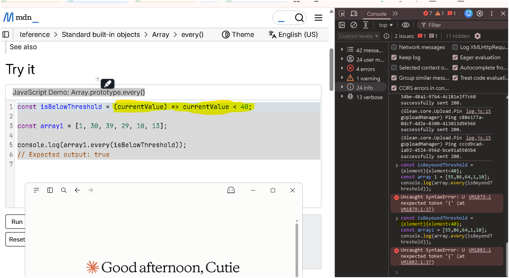

# 函式的四種寫法與 SyntaxError 排查

> [!info] 本篇重點 a–r，共 18 個
> 兩場 Gemini 對話併成一條主線：先把「宣告 vs 表達式」與「具名 vs 匿名」兩條軸分開 → 再用 Abby 在 Console 踩到的 <mark style="background: #FF5582A6;">`Uncaught SyntaxError: Unexpected token '{'`</mark> 反推引擎是怎麼 parse 的 → 最後收在「加了大括號就必須自己寫 `return`」這個不報錯卻更陰險的陷阱。

> [!info] 與其他筆記的關聯（附理由）
> a. 深追語法細節請看 [[箭頭函式的兩組括號-參數小括弧與主體大括弧-隱式回傳]]：那篇把「參數的小括弧」與「主體的大括弧」拆成兩組獨立規則講到底，本篇只講到踩雷當下需要的程度。
> b. 承接 [[09-Hoisting-函式宣告vs函式表達式-TDZ]]：本篇 g 節說「宣告可以提前呼叫、表達式不行」，那篇解釋為什麼——差別不在有沒有被 hoist，而在有沒有被初始化。
> c. 對照 [[JavaScript-函式類型總整理]]：那篇是四條分類軸的完整比較表，本篇是其中兩條軸的實戰排查版。
> d. 呼應 [[06-every短路求值與初始長度快照-命令式重構為宣告式]]：Abby 這次踩雷的現場就是 MDN 的 `Array.prototype.every()` 範例頁，那篇講 `every` 本身在做什麼。
> e. 呼應 [[03-陳述式-Statement-vs-表達式-Expression]]：本篇 h 節「引擎在 `=` 右邊期待一個表達式」的整個推論，地基都在那篇。

![[學習JS_圖解_const右邊的括號怎麼被parse-箭頭函式cover-grammar_2026-09-18.svg]]

---

## 1. 先把兩條軸分開：它們互相獨立（a–d）

> [!important]+ Abby 的原問題：<mark style="background: #FFF3A3A6;">「是因為寫成表達式的都一定要搭配箭頭函式嗎？」</mark>
> <mark style="background: #BBFABBA6;">不是。</mark>「函式表達式」講的是**函式出現在哪個位置**，「箭頭函式」講的是**函式用哪種語法寫**，兩者完全正交，可以自由組合。

- (a) <mark style="background: #ADCCFFA6;">軸一：函式宣告（Function Declaration）vs 函式表達式（Function Expression）</mark>
	- 以 `function` 這個關鍵字開頭、獨立成一句的是**宣告**。
	- 被放在「需要一個值」的位置（賦值右邊、當引數、當回傳值）的是**表達式**。
- (b) <mark style="background: #ADCCFFA6;">軸二：具名（Named）vs 匿名（Anonymous）</mark>
	- 指的是 `function` 後面有沒有寫名字，跟變數叫什麼無關。
	- `const greet = function () {}` 裡的函式本體是匿名的，`greet` 只是綁著它的變數。
- (c) ★ 兩軸交叉後的四格，四格都合法：

| | 用 `function` 關鍵字 | 用箭頭 `=>` |
|---|---|---|
| **宣告位置** | `function f(x) { return x < 40; }` | 不存在，箭頭函式只能是表達式 |
| **表達式位置** | `const f = function (x) { return x < 40; };` | `const f = (x) => x < 40;` |

- (d) <mark style="background: #FF5582A6;">所以「寫成 `const xxx = ...` 就一定要用箭頭函式」是錯的</mark>，`const f = function (x) { ... }` 完全合法，只是現代寫法偏好箭頭。

---

## 2. 那行 Console 到底錯在哪：`Unexpected token '{'`（e–j）



> 現場：MDN [`Array.prototype.every()`](https://developer.mozilla.org/en-US/docs/Web/JavaScript/Reference/Global_Objects/Array/every) 的範例頁，Console 連丟兩次 `Uncaught SyntaxError: Unexpected token '{'`。

- (e) Abby 寫的是：

```js
const isBeyondThreshold = (element){element < 40};   // ❌ SyntaxError
```

- (f) <mark style="background: #ADCCFFA6;">引擎讀到 `const isBeyondThreshold =` 之後，接下來**只接受一個表達式**</mark>（因為 `=` 右邊要的是一個值）。
- (g) 接著讀到 `(element)`，這時它**還不知道**這是什麼。JS 規格用一種叫 <mark style="background: #D2B3FFA6;">cover grammar</mark> 的手法先把它暫存成「可能是括號表達式、也可能是箭頭函式的參數列」，等下一個 token 來決定。
- (h) ★ 下一個 token 決定一切：
	- 若是 `=>` → 回頭把 `(element)` 重新解讀成**參數列**，整體是箭頭函式。✅
	- 若是 `{` → <mark style="background: #FF5582A6;">沒有任何一條文法允許「括號表達式後面直接接一個區塊」</mark>，於是當場丟 `Unexpected token '{'`。❌
- (i) 這就是為什麼<mark style="background: #FFF3A3A6;">錯誤訊息指的是 `{` 而不是 `(`</mark>：`(element)` 本身沒錯，錯在它後面接了引擎接不下去的東西。
- (j) 四種改法都能跑，選一種就好：

| 改法 | 寫法 | 說明 |
|---|---|---|
| 補箭頭，用 concise body | `const isBeyondThreshold = (element) => element < 40;` | 最短，自動回傳 |
| 補箭頭，用 block body | `const isBeyondThreshold = (element) => { return element < 40; };` | 大括號在，就得自己寫 return |
| 改成函式宣告 | `function isBeyondThreshold(element) { return element < 40; }` | 會被 hoist，可以提前呼叫 |
| 改成傳統函式表達式 | `const isBeyondThreshold = function (element) { return element < 40; };` | 補上 `function` 關鍵字，引擎就知道你要哪一種 |

```js
// 用宣告出來的函式餵給 every，兩種都行
function isBeyondThreshold(element) { return element < 40; }
const array1 = [55, 86, 64, 1, 10];
console.log(array1.every(isBeyondThreshold));            // false

// 或直接把匿名的傳統函式當 callback 傳進去
console.log(array1.every(function (element) { return element < 40; }));  // false
```

> [!tip]+ DevTools Console 貼多行程式碼的小技巧
> - (r) <mark style="background: #BBFABBA6;">在 Console 裡按 `Shift + Enter` 是換行，按 `Enter` 才是執行</mark>。寫 class 或多行函式時先用 `Shift + Enter` 把整段（包含最後那個 `}`）寫完再送出，才不會因為括號沒收尾而被判 `SyntaxError`。
> - 同一場對話裡 Abby 的 `class Dog { ... }` 報錯也是同一個病根：<mark style="background: #FF5582A6;">最外層的 `}` 漏掉</mark>，引擎以為 class 還沒結束，讀到下一行的 `const myDog` 就爆。

---

## 3. 有大括號就得自己 return：concise body vs block body（k–n）

> [!warning]+ 名詞先澄清
> - (k) Gemini 說的<mark style="background: #FFF3A3A6;">「多行程式塊」指的是**語法形態**，不是你在編輯器裡實際敲了幾行</mark>。就算全部擠在同一行，只要有 `{}`，它就是 block body。

- (l) <mark style="background: #ADCCFFA6;">concise body（簡潔主體）＝箭頭後面直接接一個表達式，沒有大括號</mark>，引擎**自動回傳**那個表達式的值。
- (m) <mark style="background: #ADCCFFA6;">block body（區塊主體）＝箭頭後面接 `{}`</mark>，引擎**不會**自動回傳，沒寫 `return` 就回 `undefined`。
- (n) ⚠️ 這個錯比 (e) 那個更陰險，因為<mark style="background: #FF5582A6;">它不報錯，只是默默給你錯的答案</mark>：

```js
// 有大括號卻沒寫 return → 每次呼叫都回 undefined（falsy）
const isBeyondThreshold = (element) => { element < 40 };
[55, 86, 64, 1, 10].every(isBeyondThreshold);   // false —— 看起來「對」，其實是誤打誤撞

// 換成應該要是 true 的資料就露餡了
[1, 2, 3].every((e) => { e < 40 });             // false ← 錯！正確答案是 true
[1, 2, 3].every((e) => e < 40);                 // true  ← 這才對
```

| 形態 | 寫法 | 要自己寫 `return` 嗎 |
|---|---|---|
| concise body | `(x) => x < 40` | 不用，自動回傳 |
| block body | `(x) => { return x < 40; }` | 必須寫，否則回 `undefined` |
| 傳統函式 | `function (x) { return x < 40; }` | 必須寫，否則回 `undefined` |

---

## 4. 傳統匿名函式的三種常見場景（o–q）

- (o) <mark style="background: #BBFABBA6;">用 `function` 關鍵字定義的「傳統函式」完全可以是匿名的</mark>，最常出現在下面三個位置：

1. <mark style="background: #ADCCFFA6;">函式表達式（Function Expression）</mark>：把沒名字的函式賦值給變數，<mark style="background: #FFF3A3A6;">變數名代表該函式，但函式本體本身是匿名的。</mark>

```js
const greet = function () { console.log("Hello World"); };
greet();
```

2. <mark style="background: #ADCCFFA6;">立即執行函式（IIFE）</mark>：定義當下立刻執行，<mark style="background: #FFF3A3A6;">常用來建立獨立作用域、避免污染全域變數。</mark>

```js
(function () { console.log("立刻執行，且沒有名字"); })();
```

3. <mark style="background: #ADCCFFA6;">回呼函式（Callback）</mark>：直接當參數傳給其他方法，事件監聽與非同步最常見。

```js
setTimeout(function () { console.log("延遲 1 秒後執行"); }, 1000);
```

- (p) 現代多用箭頭函式取代，但兩者**行為**關鍵不同，不只是寫法長短：

| 面向 | 傳統匿名函式 | 箭頭函式 |
|---|---|---|
| `this` 綁定 | <mark style="background: #FF5582A6;">動態綁定：取決於「呼叫時」的上下文</mark> | <mark style="background: #BBFABBA6;">沒有自己的 this，繼承「定義時」外層環境（靜態）</mark> |
| `arguments` | 內部可用 `arguments` 存取所有傳入參數 | <mark style="background: #FF5582A6;">不支援 `arguments`</mark> |
| 能不能 `new` | 可以，是建構函式 | <mark style="background: #FF5582A6;">不行，會丟 TypeError</mark> |
| 有沒有 `prototype` 屬性 | 有 | 沒有 |

- (q) <mark style="background: #ADCCFFA6;">宣告與表達式還有一個執行期差異</mark>：函式宣告在進入作用域時就連名帶身體一起就緒，可以提前呼叫；`const`／`let` 的函式表達式只建綁定不初始化，提前呼叫會撞 TDZ 丟 `ReferenceError`。理由見 [[09-Hoisting-函式宣告vs函式表達式-TDZ]]。

---

## 5. ⚠️ 存疑／更正（Gemini 講得不夠精確的地方）

| Gemini 原文 | 問題 | 補正 |
|---|---|---|
| 把「漏掉 `=>`」與「漏掉 `return`」並列成「兩個語法錯誤」 | <mark style="background: #FF5582A6;">只有前者是 SyntaxError，後者根本不報錯</mark>，會靜默回傳 `undefined` | 兩者嚴重性完全不同：前者當場爆、後者是邏輯 bug，要分開講 |
| 「漏掉花括號內的 return，否則預設會回傳 undefined」 | 說法沒錯，但沒說清楚<mark style="background: #FFF3A3A6;">這跟傳統函式是同一條規則</mark>，不是箭頭函式特有 | 只要是 block body（含傳統 `function`），一律不自動回傳 |
| 只說「語法解析器不知道你要寫哪一種」 | 講對了方向但沒講機制 | 規格上的名詞是 <b>cover grammar</b>：`(element)` 先被暫存成兩義，等下一個 token（`=>` 或其他）才定案，見 h 節 |

---

## 對應題目練習

- [LeetCode 2667. Create Hello World Function](https://leetcode.com/problems/create-hello-world-function/) — 最小規模的「回傳一個函式」，逼你分清楚回傳函式本身與回傳呼叫結果
- [LeetCode 2620. Counter](https://leetcode.com/problems/counter/) — 表達式位置的函式＋閉包，正好驗收第 1 節兩條軸
- [LeetCode 2634. Filter Elements from Array](https://leetcode.com/problems/filter-elements-from-array/) — callback 寫成 concise body 還是 block body，寫錯就回 `undefined`，直球考第 3 節
- [LeetCode 2666. Allow One Function Call](https://leetcode.com/problems/allow-one-function-call/) — 傳統函式與箭頭函式在 `this`／`arguments` 上的差異會真的影響解法

---

## 各對話來源（原文摘要）

### 傳統函式可否為匿名函式（2026-06）— https://gemini.google.com/app/1c2e605259537e41

**使用者：** 傳統函式可以是匿名函式嗎？

**Gemini：** 可以。傳統函式（用 `function` 關鍵字定義）完全可以是匿名函式，常見三種形式——① 函式表達式 `const greet = function () {...}`，變數名代表函式、函式本體匿名；② IIFE `(function () {...})()`，建立獨立作用域、避免污染全域；③ 回呼函式如 `setTimeout(function () {...}, 1000)`，當參數傳給其他方法。傳統匿名函式與箭頭函式的關鍵差異在 `this`（動態綁定 vs 繼承定義時外層環境）與 `arguments`（可用 vs 不支援）。

### JavaScript 函式寫法與錯誤解析（2026-09）— https://gemini.google.com/app/a934bc9778ee91b7

**使用者：** 為何我把 isBeyondThreshold 改成一般函式就不行了，話說這個算一般函式嗎？

**Gemini：** 報 `Uncaught SyntaxError` 是因為語法寫錯，不是因為不能改寫成一般函式。`const isBeyondThreshold = (element){element < 40};` 有兩個問題——漏掉箭頭 `=>`，以及若用了花括號就必須手動寫 `return`。這不算一般函式，而是「語法不完整的箭頭函式」。正確傳入 `.every()` 的方式有兩種：先宣告一般函式再傳入，或直接在 `.every()` 內部寫匿名一般函式。

**使用者：** 「內部就屬於多行程式」本來不是多行嗎？

**Gemini：** 「多行程式塊（Block Body）」是語法上的專有名詞，指的是語法結構的形式而不是編輯器裡的行數。沒有花括號的是 concise body，會自動回傳運算結果；一旦加了花括號，不論寫幾行都算 Block Body，不會自動 return，沒寫就回 `undefined`。

**使用者：** 是因為寫成表達式的都一定要搭配箭頭函式嗎？

**Gemini：** 不是，表達式與箭頭函式是兩回事。只要把函式賦值給變數就叫函式表達式，右邊用傳統 `function` 或箭頭 `=>` 都可以。報錯的原因是寫了 `(element){ ... }`，引擎在 `const` 後面既找不到 `function` 關鍵字、又找不到箭頭 `=>`，不知道你要寫哪一種，所以丟 `SyntaxError`。

---

## 資料來源（含查證時間）

| 主題 | 連結 | 版本／時間 |
|---|---|---|
| 踩雷現場的範例頁 Array.prototype.every | https://developer.mozilla.org/en-US/docs/Web/JavaScript/Reference/Global_Objects/Array/every | MDN，2026-09-18 查證 |
| 箭頭函式語法與 concise／block body | https://developer.mozilla.org/en-US/docs/Web/JavaScript/Reference/Functions/Arrow_functions | MDN，2026-09-18 查證 |
| 函式表達式 function expression | https://developer.mozilla.org/en-US/docs/Web/JavaScript/Reference/Operators/function | MDN，2026-09-18 查證 |
| 函式宣告 function declaration | https://developer.mozilla.org/en-US/docs/Web/JavaScript/Reference/Statements/function | MDN，2026-09-18 查證 |
| IIFE 術語定義 | https://developer.mozilla.org/en-US/docs/Glossary/IIFE | MDN，2026-09-18 查證 |
| 規範原文 ArrowFunction 與 cover grammar | https://tc39.es/ecma262/#sec-arrow-function-definitions | ECMA-262，2026-09-18 查證 |
| Console 多行輸入與 Shift+Enter | https://developer.chrome.com/docs/devtools/console/reference | Chrome DevTools 文件，2026-09-18 查證 |
