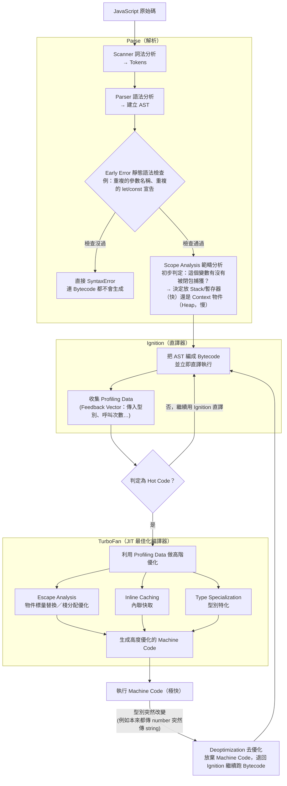
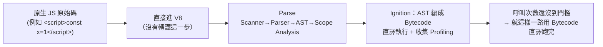
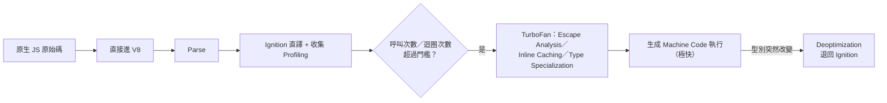
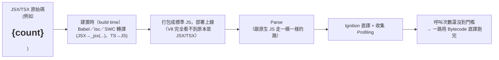
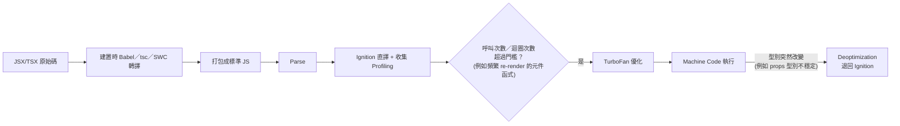

# V8 引擎完整管線：Parse → Ignition → TurboFan → Deoptimization

> [!info]- 📍 00號：整個編號序列的起點
> <mark style="background: #BBFABBA6;">起點</mark>：這是`JS_Core_and_Runtime`資料夾照編譯到執行順序編號的第一篇，畫出Parse→Ignition→TurboFan→Deoptimization整條管線地圖。
> <mark style="background: #ADCCFFA6;">下一步</mark>：管線圖裡第一個要拆解的詞就是「引擎」本身，下一篇[[01-引擎-Engine-到底是什麼]]先把這個詞定義清楚。

> 比 [[機器碼與bytecode的差異]] 那篇「6. V8 的實際管線」更詳細的版本，把 Scanner/Scope Analysis、Profiling、Escape Analysis、Inline Caching、Type Specialization、Deoptimization 全部串起來。

## V8 是 Chrome 的 JS 引擎嗎？跟 SSR 有關係嗎？

<mark style="background: #BBFABBA6;">「V8 是 Chrome 的 JS 引擎」這句話對，但不完整</mark>——V8 最早是為 Chrome 開發的沒錯，但它是一個**獨立、可嵌入任何 C++ 專案的引擎**，不是只綁死在 Chrome 瀏覽器裡：

- **Chrome / Edge / Brave** 等 Chromium 系瀏覽器：直接內嵌 V8。
- **Node.js**：把 V8 抽出來，外面包 `libuv`（處理檔案 I/O、網路等的事件迴圈）與 Node 專屬 API（`fs`、`http`…），讓 JS 可以離開瀏覽器、在伺服器上跑。<mark style="background: #FFF3A3A6;">「只包一層 libuv」是簡化說法</mark>，完整架構（libuv 具體是什麼、Node 還有哪些層、CSR 渲染邏輯在哪執行、純前端會不會用到 Node API）另開一篇：[[Node-js底層架構-V8-libuv-Bindings與CSR澄清]]。
- **Deno、Electron**：也是內嵌 V8（Electron 甚至同時內嵌 V8 + Chromium）。

<mark style="background: #FFF3A3A6;">跟 SSR（Server-Side Rendering）的關係</mark>：Next.js、Nuxt 這類 SSR 框架，是讓 React／Vue 的渲染邏輯改在**伺服器上的 Node.js**執行，而 Node.js 底層就是 V8。也就是說，SSR 時伺服器產生 HTML 字串的那段 JS，走的**正是本篇這一整套 Parse → Ignition → TurboFan → Deoptimization 管線**，只是少了瀏覽器提供的 `window`/`document`（改用 Node 的 host 環境），並不是換了一顆完全不同的引擎。差異只在**執行環境（host environment：瀏覽器 Web APIs vs Node.js APIs）**，不是引擎本身或編譯管線。

Node.js 在一般前端「打包」流程裡的角色（跟 SSR 不是同一件事，容易搞混）另有詳細說明，見 [[前端開發工具-打包編譯Lint與Parser]] 第 7 節。

## 完整流程圖



> 上圖 Parse 裡新增的 **Early Error** 節點，例子（重複參數名稱何時合法、何時直接 SyntaxError）見 [[函式呼叫核心機制-Execution-Context-與-Parameter-Binding]] 的 (e) 節——這類錯誤在 Parse 階段就會被抓出來，根本不會走到 Ignition 生成 Bytecode。

## 各階段名詞解釋

### Parse 階段

- **Scanner（詞法分析／Lexer／Tokenizer）**：三個詞<mark style="background: #BBFABBA6;">可以直接畫等號——Scanner＝Lexer＝Tokenizer</mark>，業界混用，指同一件事：把原始碼文字**逐字掃過**，切成一顆顆有意義的最小單位——**Token**（也叫 Lexeme／語素；關鍵字、identifier、運算子、字面量…）。這一步只管「切詞」，不管文法對不對。
- **Parser（語法分析）**：把 Token 序列按 JS 文法規則組成樹狀結構 **AST**，同時檢查語法對不對（少個括號這種錯誤在這裡就會被抓到）。遇到解構參數（`{a,b}`／`[a,b]`）這種寫法時，Parser 具體依據的正是 [ECMA-262 Destructuring Binding Patterns](https://tc39.es/ecma262/#sec-destructuring-binding-patterns) 這份規格條文——**關係**：規格文字定義「合法的解構模式長怎樣」，Parser 就是把這份規格條文轉成程式邏輯的那個實作；**重要性**：Scanner 產生的 Token 是 Lexical Grammar 的產物（見 [[字面量-關鍵字-識別碼基礎]]），Parser 再依這份 Syntactic Grammar 規則把 Token 組合成樹——兩份文件合起來，正好對應 Parse 階段「先切詞、再組句」的兩個步驟。
- **Scope Analysis（範疇分析）**：在建好 AST 後，V8 對每個 scope 做的事**不只「判斷閉包捕獲」一項**，而是把整個靜態範疇結構都定下來：
  - **解析變數的歸屬（scope chain 解析）**：把 AST 裡每一個識別碼的「使用」都對應回它到底是**哪個 scope 宣告的**（或者哪個都不是、屬於全域/未宣告），建立完整的範疇鏈——這是所有後續判斷的地基。
  - **判斷閉包捕獲，決定放 Stack 還是 Heap**：這個變數有沒有被內層函式（閉包）捕獲？**沒被捕獲** → 留在**快速的 Stack／暫存器**（函式執行完直接釋放，效能好，見 [[return-清理記憶體-stack-frame與閉包例外]]）；**有被捕獲** → 放進**堆積（Heap）上的 Context 物件**，讓閉包長期抓著它。這是**初步／必要的**判定（決定正確性，不是可有可無的優化），只看**語法結構**——「AST 上有沒有內層函式引用這個變數」，不看實際執行狀況。
    - <mark style="background: #ADCCFFA6;">這個「初步判定」跟下面 TurboFan（圖裡 `H1` 節點）做的 **Escape Analysis（逃逸分析）＋物件標量替換（Scalar Replacement）** 是兩個不同層次的機制，容易被搞混，對照如下</mark>：

      | | Scope Analysis 的初步判定（這裡） | TurboFan 的 Escape Analysis（下方 TurboFan 階段） |
      |---|---|---|
      | 發生時機 | Parse 階段，**每個函式都會做一次** | 只有被判定為 Hot Code、送進 TurboFan 之後才會做 |
      | 判斷依據 | **靜態語法結構**：AST 上有沒有內層函式引用這個變數 | **實際執行 Profile**：這個物件在真正跑過的案例裡，有沒有被回傳、存到外部變數、被閉包捕獲 |
      | 保守程度 | 保守——只要「可能」被捕獲就先放 Heap，確保正確性優先 | 激進——只要「證明」完全不會逃逸，可以直接連 Heap 都不配置 |
      | 對物件的處理 | 二選一：整包放 Stack 或整包放 Heap Context | 可以更細：把物件拆成好幾個獨立的純量值（scalar），例如物件的每個欄位各自變成一個暫存器變數，完全跳過「配置一整個物件」這件事 |
      | 目的 | 決定**正確性**（閉包捕獲的變數絕對不能被提早釋放） | 追求**極致效能**（能不進 Heap 就不進，省下配置與 GC 成本） |

      一句話：**Scope Analysis 是「看語法就能做的保守判斷」，Escape Analysis 是「看實際執行狀況才敢做的激進優化」——前者是每次都跑的必要步驟，後者是熱點程式碼才有的加碼優化。**
  - **var／function Hoisting 與 let／const 的 TDZ 邊界**：確定 `var` 要被提升到哪個最近的函式 scope、`function` 宣告要不要整個提升，以及 `let`/`const` 的暫時性死區（TDZ）範圍從哪裡到哪裡。
  - **偵測 `eval` / `with`**：如果這個 scope 裡出現直接 `eval()` 呼叫或 `with` 語句，因為它們可以在執行期**動態新增/改變綁定**，會破壞靜態分析的前提，V8 必須把整個 scope 標記成「不可靜態優化」，退回保守、較慢的處理方式。
  - **判斷要不要建立 `arguments` 物件**：如果函式本體根本沒引用 `arguments`，V8 可以直接省略建立它，省一筆開銷（哪種參數列表會影響 `arguments` 是「mapped」還是「unmapped」，見 [[函式呼叫核心機制-Execution-Context-與-Parameter-Binding]] 的簡單參數列表說明）。
  - **strict mode 判定**：從 `"use strict"` 指令或 ES Module 環境推定這段程式碼是不是 strict mode，會影響後面一系列語法限制。
  - **Early Error 靜態語法檢查**：例如同一個參數列表裡重複的參數名稱、同一 scope 裡重複的 `let`/`const` 宣告，這類「編譯期就能確定是錯的」語法錯誤，也是在這個階段被抓出來（完整的重複參數名稱規則見 [[函式呼叫核心機制-Execution-Context-與-Parameter-Binding]] 的 (e)）。

### Ignition（直譯器）階段

- 把 AST **編譯**成精簡的 **Bytecode**，然後**直譯執行**（見 [[機器碼與bytecode的差異]] 對 bytecode 概念的完整解釋）。
- 執行的同時**順手收集 Profiling Data**（V8 內部叫 **Feedback Vector**）：記錄「這個函式被呼叫幾次」「傳進來的參數通常是什麼型別」「這個屬性存取通常是對哪種物件形狀（Shape/Hidden Class）」等統計資料，供之後 TurboFan 判斷要不要優化、怎麼優化。

### Hot Code 判定

V8 監控函式的**呼叫次數**（以及迴圈的**執行次數**，這種情況叫 OSR／On-Stack Replacement），超過門檻就標記成「熱點程式碼」，送去給 TurboFan 優化。**沒達標的程式碼就繼續留在 Ignition 直譯執行**——多數程式碼其實只跑一兩次，直接省下 TurboFan 的編譯成本。

### TurboFan（JIT 優化編譯器）階段

利用 Ignition 收集到的 Profiling Data，針對**這個熱點函式實際觀察到的情況**做高度客製化的優化：

- **Escape Analysis（逃逸分析）＋ 物件標量替換（Scalar Replacement）**：分析一個物件會不會「逃出」目前函式（被回傳、被存到外部變數、被閉包捕獲…）。**如果證明完全不會逃逸**，TurboFan 甚至可以**直接不配置這個物件在 Heap 上**，改把它拆成幾個獨立的純量值（scalar，例如物件的每個欄位各自變成一個暫存器變數），完全跳過 Heap 配置與之後的垃圾回收成本——這比 Scope Analysis 那個「初步判定」更激進、更精確，因為它是**根據實際執行 profile** 做的優化，不是單純看語法結構。
- **Inline Caching（內聯快取，IC）**：物件的屬性存取（`obj.x`）如果**每次遇到的物件形狀（Hidden Class）都一樣**，V8 就把「這個屬性在記憶體的哪個偏移量」直接快取起來，之後同樣形狀的物件存取可以跳過查找過程直接取值——這是 V8（以及 Smalltalk 以降各種動態語言引擎）加速屬性存取的經典技巧。
- **Type Specialization（型別特化）**：既然 Profiling Data 顯示這個函式「目前為止」呼叫時傳進來的都是同一種型別（例如都是 number），TurboFan 就**假設這個前提永遠成立**，生成一份**專門針對這個型別、跳過泛用型別檢查**的極致優化機器碼——這是換取速度的關鍵一步，但也正因為是「假設」，才需要下面的 Deoptimization 機制當安全網。

### Deoptimization（去優化）—— TurboFan 賭錯的安全網

TurboFan 生成的優化機器碼，內部埋了「假設檢查點（deopt guard）」。**一旦執行時真的違反了當初假設的前提**（例如 Type Specialization 假設永遠是 number，結果這次傳進來的是 string），V8 會：

1. **立刻放棄**這份已經在跑的優化機器碼。
2. **退回 Ignition**，改用穩健、不做激進假設的 Bytecode 直譯執行，確保結果正確。
3. 這個函式之後可能會**重新被觀察、重新累積 Profiling Data**，如果情況穩定下來，還是有機會再次被送去 TurboFan 優化（但太頻繁 deopt 的函式，V8 也可能乾脆放棄再嘗試優化它）。

**這解釋了一個常見的效能建議「同一個函式盡量固定傳同一種型別」**：不是因為 JS 語言本身要求型別固定，而是因為型別一直變會不斷觸發 deoptimization，讓 V8 反覆優化又放棄，效能反而比一直用 Ignition 直譯還差。

### 實例：拿掉 return 的無窮迴圈，OSR 實際發生的過程

> 出處：`JavaScript-practicing/smallest-divisible-digit-product.js`，把 `return i;` 拿掉後實測（見 [[JavaScript-字串方法]] 的 `String(i)` 段落）

```js
var smallestNumber = function (n, t) {
    for (let i = n; ; i++) {           // 沒有終止條件
        const digits = String(i).split('');
        const product = digits.reduce((acc, digit) => acc * Number(digit), 1);
        if (product % t === 0) {
            // 拿掉 return i; 之後，這裡什麼都不做
        }
    }
};
```

實測跑起來 5 秒內沒結束，被系統丟到背景程序，之後手動強制終止才停下來。對照上面的管線：

1. **Parse + Ignition 生成 Bytecode**：只做一次，不會每圈重做
2. **Ignition 直譯執行**：逐行跑 `String(i)`→`.split()`→`.reduce()`→`i++`，同時收集 Feedback Vector（`i`、`product` 一直是 number）
3. **迴圈 back-edge 計數超過門檻 → 觸發 OSR**：迴圈還沒結束（沒有 return 可以走出函式），V8 直接在「執行中的這一幀」把 Ignition Bytecode 換成 TurboFan 優化機器碼，不用等函式 return
4. **TurboFan 型別特化**：假設 `i`/`product` 永遠是 number，生出跳過泛用檢查的機器碼——迴圈跑更快，但邏輯上還是同一個沒有終止條件的迴圈，不會自己停
5. **GC 持續回收，但主執行緒被永久佔用**：`digits`/`product` 是短命值，Heap 不會爆掉，但單執行緒的 JS 沒有機會讓出控制權，process／分頁會整個卡死，只能靠外部強制終止（例如手動 kill 該 process）

一句話：**OSR 讓迴圈「跑得更快」，但不會讓迴圈「知道該停」——終止條件永遠得靠程式邏輯自己（`return`／`break`）交代清楚，引擎不會幫你補上。**

## 編譯期 vs 執行期：Creation Phase／Hoisting 算哪一邊？

快速結論（完整版見 [[函式呼叫核心機制-Execution-Context-與-Parameter-Binding]] 的 (f)(g)(h) 三節）：

- **Parse（本篇最上面 Scanner→Parser→AST→Scope Analysis 那段）是編譯期**，對同一個函式只做一次（V8 甚至會 lazy parsing，delay 到第一次被呼叫前才補做），產出可重複使用的 Bytecode。
- **Hoisting／參數綁定屬於 Execution Context 的 Creation Phase，是執行期**，函式被呼叫幾次就重做幾次——這跟 Parse 是兩個完全不同時間點的動作，只是 lazy compilation 讓兩者在時間上很靠近，容易被誤以為是同一件事。
- 「編譯」跟「翻譯／直譯」的用詞差異：編譯＝把原始碼轉成另一種可重複執行的表示法（Parse＋Bytecode 產生，一次性）；翻譯／直譯＝真的執行已編譯好的表示法（Ignition 跑 Bytecode，每次呼叫都重來）。

## 逐字保留：Tokenizer → Parser → AST → Bytecode 完整教學（對話逐字稿）

> Abby 要求「一字不漏」保留這段教學問答，故原樣轉錄，不改寫、不精簡。下文的 **Tokenizer** 就是上面 Parse 階段講的 **Scanner／Lexer**，同一件事的三種說法。

以剛剛一直舉的例子：

```js
const str = "Hello World";
```

### 第一步：Tokenizer（詞法分析）

先切成一個個 Token：

```text
const
str
=
"Hello World"
;
```

更精確一點是：

```text
Keyword      const
Identifier   str
Operator     =
String       "Hello World"
Semicolon    ;
```

---

## 第二步：Parser（語法分析）

Parser 看這些 Token 是否符合 JavaScript 文法。

如果符合，就建立 AST（Abstract Syntax Tree）。

概念上會長這樣：

```text
Program
│
└── VariableDeclaration (const)
    │
    └── VariableDeclarator
        ├── id
        │    └── Identifier
        │          name: "str"
        │
        └── init
             └── Literal
                   value: "Hello World"
```

這就是 AST。

---

如果用 JSON 表示（像 Babel Esprima 輸出的格式），大概會像：

```js
{
  type: "Program",
  body: [
    {
      type: "VariableDeclaration",
      kind: "const",
      declarations: [
        {
          type: "VariableDeclarator",
          id: {
            type: "Identifier",
            name: "str"
          },
          init: {
            type: "Literal",
            value: "Hello World"
          }
        }
      ]
    }
  ]
}
```

---

## 再看一個比較有趣的例子

```js
const c = a + b;
```

AST：

```text
Program
│
└── VariableDeclaration
    │
    └── VariableDeclarator
        ├── Identifier(c)
        │
        └── BinaryExpression (+)
             ├── Identifier(a)
             └── Identifier(b)
```

注意：

這裡沒有「字串」。

沒有「加法」。

只有節點(Node)。

每個 Node 都有自己的 type。

例如：

* Program
* VariableDeclaration
* Identifier
* Literal
* BinaryExpression
* CallExpression
* FunctionDeclaration

---

## 再複雜一點

```js
console.log(a + b);
```

AST 概念：

```text
Program
│
└── ExpressionStatement
    │
    └── CallExpression
         │
         ├── callee
         │     └── MemberExpression
         │           ├── Identifier(console)
         │           └── Identifier(log)
         │
         └── arguments
               │
               └── BinaryExpression(+)
                    ├── Identifier(a)
                    └── Identifier(b)
```

---

## 為什麼要 AST？

因為 **Bytecode 並不是直接從原始碼產生的，而是根據 AST 產生的。**

也就是：

```text
JavaScript 原始碼
        │
        ▼
Tokenizer（詞法分析）
        │
        ▼
Token
        │
        ▼
Parser（語法分析）
        │
        ▼
AST（抽象語法樹）
        │
        ▼
Bytecode Generator
        │
        ▼
Bytecode
        │
        ▼
Ignition 執行
```

---

### 面試很容易考的一個問題

> **為什麼叫「抽象」語法樹（Abstract Syntax Tree）？**

因為 **AST 不保留原始碼的所有細節，只保留程式的語意結構。**

例如這兩段：

```js
const a = 1 + 2;
```

```js
const    a=1+2;
```

空格完全不同，但 AST 幾乎是一樣的。

甚至：

```js
(1 + 2)
```

和

```js
1 + 2
```

在很多情況下產生的 AST 也相同。

也就是說，**AST 關心的是「這是一個變數宣告、右邊是一個加法運算」，而不是你用了幾個空白、幾次換行或括號的排版方式。**

這也是 Babel、ESLint、Prettier 等工具都能運作的基礎：它們不是直接修改原始字串，而是先分析成 AST，再根據 AST 進行轉換或檢查。

## Parser 之後如果是 TypeScript／JSX 呢？——Babel 是「轉譯器」（Transpiler）

你的理解是對的：**Parser 拿到 Token 建出 AST 之後，如果原始碼是 TS 或 JSX，就會先被轉譯器處理，把「一種高階語言轉成另一種高階語言」**（TS→JS、JSX→純 JS 函式呼叫），這件事跟 Ignition／TurboFan 那種「高階語言→低階 Bytecode/機器碼」的**編譯（Compile）**是不同層次：

| | 轉譯 Transpile | 編譯 Compile（本篇 Ignition/TurboFan 那段） |
|---|---|---|
| 轉換方向 | 高階語言 → 另一個**同樣高階**的語言（TS→JS、JSX→JS） | 高階語言 → **更低階**的表示法（AST→Bytecode→機器碼） |
| 誰來做 | Babel／`tsc`／SWC，在**建置時（build time）**、瀏覽器與 V8 都還沒看到程式碼之前 | V8 引擎自己，在**執行時（runtime）**，瀏覽器/Node 載入腳本當下 |
| V8 看不看得到轉譯前的原始碼？ | **看不到**——V8 收到的永遠是轉譯完的標準 JS，完全不知道原本寫的是 TSX 還是純 JS | — |

<mark style="background: #FFF3A3A6;">關鍵一點：轉譯發生在 V8 的 Parse 階段之前，而且是在完全不同的地方（建置工具的 Node.js 環境）、完全不同的時間（部署前）做完的</mark>，所以「React 專案」跟「原生 JS 專案」對 V8 來說，最終看到的都是同一種東西——標準 JS，沒有特殊待遇。完整的 Babel／`tsc`／SWC／JSX 轉譯細節見 [[前端開發工具-打包編譯Lint與Parser]] 第 1、5、6 節。

## AST 不管格式，那為什麼還需要 ESLint？

<mark style="background: #FF5582A6;">不是因為 Git diff 看空格</mark>（那是 Prettier 的職責範圍），而是因為 **ESLint 檢查的根本不是格式，是「語意」與「潛在錯誤」**——這兩者剛好都是 AST 才能看到、原始文字看不到的東西：

- ESLint 讀的也是 AST（不是原始字串），它在 AST 節點上做規則比對，抓的是**邏輯層級的問題**：宣告了卻沒用的變數（`no-unused-vars`）、用了未定義的識別碼（`no-undef`）、React Hooks 呼叫順序錯誤（`react-hooks/rules-of-hooks`）、`==` 應該用 `===`……這些都跟「你打了幾個空格」完全無關，AST 本來就不記錄空格，ESLint 也不需要空格資訊就能抓到這些問題。
- **格式（縮排、換行、引號、分號）才是 Prettier 的工作**，而格式化真正的價值確實跟 Git 有關：團隊多人協作時，如果每個人縮排/引號習慣不同，光是重新排版就會讓 `git diff` 充滿雜訊（一行邏輯沒改，卻整段變紅變綠），拖慢 code review。Prettier 統一格式後，diff 才只顯示「真正改了什麼邏輯」。

所以「團隊規定到最後 AST 就沒用了」這個推論反了：**正因為 AST 不管格式，ESLint 才能只抓邏輯錯誤、完全不受個人排版習慣干擾**——格式與邏輯本來就是兩個獨立關注點，AST 讓這個切分變得乾淨（ESLint 管邏輯／Prettier 管格式），不是讓 AST 變得多餘。

## 原生 JS vs React：兩條進場路徑 × Ignition／TurboFan 兩種執行狀態，共 4 張圖

前面「完整流程圖」只畫了 V8 內部（Parse→Ignition→TurboFan→Deopt）一條線，但實務上程式碼進到 V8 之前有兩種不同起點——**原生 JS**（直接是標準 JS，不需要轉譯）vs **React／TSX**（要先經過上面講的 Babel/`tsc` 轉譯）；而進到 V8 之後，同一段程式碼在它的生命週期裡又會經歷**冷路徑（Ignition 直譯，剛開始執行、次數還少）**跟**熱路徑（TurboFan 優化，被判定為 Hot Code 之後）**兩種狀態。兩個維度交叉，共 4 張圖：

### 圖① 原生 JS ×（冷）Ignition 直譯



### 圖② 原生 JS ×（熱）TurboFan 優化



### 圖③ React／TSX ×（冷）Ignition 直譯



### 圖④ React／TSX ×（熱）TurboFan 優化



**四張圖的關鍵差異，一句話總結**：①②（原生 JS）跟③④（React）唯一的差別，是③④在 Parse 之前多了一段**建置時、V8 管線之外**的轉譯步驟；一旦進了 V8，①③（冷）跟②④（熱）就完全是同一套 Ignition/TurboFan 邏輯，跟程式碼原本是不是 React 完全無關——V8 分不出來、也不在乎。互動版（4 個按鈕切換 + 差異高亮）見同資料夾 `00-V8引擎完整管線-Parse到Deoptimization.html`。

## 相關筆記
- [[機器碼與bytecode的差異]] —— bytecode／機器碼／JIT 的通用概念（Java/Python 對照）
- [[作用域-scope-global-function-block]] —— Lexical Scope、Parse 階段的基礎討論
- [[函式呼叫核心機制-Execution-Context-與-Parameter-Binding]] —— Parse（編譯期，一次性）vs Creation/Execution Phase（執行期，每次呼叫都重來）的完整釐清，以及參數綁定如何用這裡的 Scope Analysis 決定放 Stack 還是 Heap Context
- [[前端開發工具-打包編譯Lint與Parser]] —— Babel/tsc/SWC 轉譯細節、ESLint vs Prettier 分工、Node.js 在打包流程中的角色（跟 SSR 是兩件事）
- [[Node-js底層架構-V8-libuv-Bindings與CSR澄清]] —— libuv 到底是什麼、Node.js 完整分層架構、CSR 渲染邏輯在哪執行、純前端會不會用到 Node 專屬 API
- [[陳述式-Statement-vs-表達式-Expression]] —— 上面 AST 逐字稿裡 `ExpressionStatement`、`VariableDeclaration` 這些節點名稱背後的分類邏輯
- [[引擎-Engine-到底是什麼]] —— 「引擎」這個詞的正式定義，以及 Engine／Interpreter／Compiler／Runtime／Host Environment 的名詞辨析

---

> [!info]- ➡️ 下一篇
> [[01-引擎-Engine-到底是什麼]]——引擎到底是什麼、這篇管線圖裡每一站的主角是誰。
