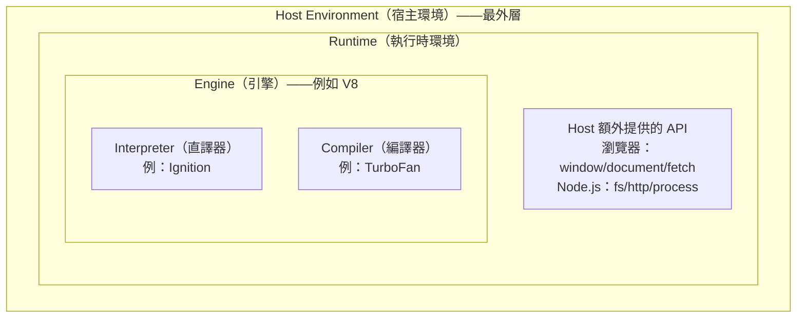
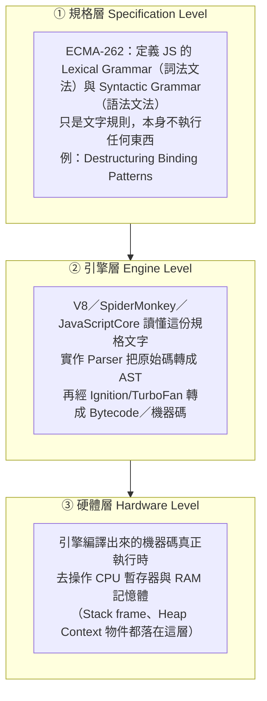

# 引擎（Engine）到底是什麼

> [!info]- 📍 承接00，銜接02
> <mark style="background: #ADCCFFA6;">承接</mark>：[[00-V8引擎完整管線-Parse到Deoptimization]]畫出「引擎」在做的事，這篇先把「引擎」這個詞本身講清楚——是誰在跑Parse、Compile、GC這些步驟。
> <mark style="background: #ADCCFFA6;">參考</mark>：[[Node-js底層架構-V8-libuv-Bindings與CSR澄清]]（更新於2026年7月31日）已經先把「V8加libuv加Host額外提供的API」這層分工拆過一次，這篇把其中「引擎」這個詞單獨抽出來，往前補一次正式定義，建議兩篇搭配著看。
> <mark style="background: #BBFABBA6;">下一步</mark>：知道引擎是誰之後，下一篇[[02-字面量-關鍵字-識別碼基礎]]講引擎的Parser實際掃到原始碼時，看到的最小單位。

> 本篇重點 (a)–(h)，共 8 個。這篇是壓軸的總覽筆記，把 [[V8引擎完整管線-Parse到Deoptimization]]、[[Node-js底層架構-V8-libuv-Bindings與CSR澄清]] 這些筆記裡一直出現的「引擎」這個詞，回頭做一次正式定義。

## (a) 先講廣義的「引擎」——軟體工程裡是什麼意思

「引擎」不是 JS 專屬的詞，軟體工程裡泛指：<mark style="background: #FFF3A3A6;">**一套可重複使用的核心運算/處理系統，接收輸入、依照固定規則處理、產出輸出，通常被包在一個更大的應用程式或環境裡，當作可以抽換的核心元件**。</mark>同樣的概念在不同領域都有對應：

| 領域 | 引擎範例 | 接收什麼輸入 | 負責做什麼 |
|---|---|---|---|
| 遊戲 | Unity、Unreal | 3D 模型、腳本、關卡資料 | 渲染畫面、物理運算、輸入偵測 |
| 搜尋 | Google 搜尋引擎 | 網頁內容、使用者查詢字串 | 建索引、依相關性排序 |
| 資料庫 | InnoDB、MyISAM | SQL 指令 | 儲存、索引、交易（Transaction）管理 |
| **JavaScript** | **V8**、SpiderMonkey | **你寫的 JS 原始碼** | 解析、編譯、執行 |

## (a-1) 追問：只講「輸入→處理→輸出」這樣夠嗎？跟CPU、RAM有什麼關係

<mark style="background: #FFF3A3A6;">「接收輸入、依規則處理、產出輸出」只是最外層的黑盒子比喻，拿來當第一層直覺可以，但沒講到引擎實際上怎麼把輸入變成輸出，也還沒接到硬體——這裡補完整，對照(g-1)已經拆過的規格層／引擎層／硬體層三層架構。</mark>

以V8這類語言／程式碼執行引擎來說，更精確的定位是：**介於「你寫的高階語言原始碼」跟「CPU加RAM這組硬體」之間的中介層**，具體做四件事：

a. 解析（Parsing）——把原始碼轉成AST（抽象語法樹，Abstract Syntax Tree），這是[[V8引擎完整管線-Parse到Deoptimization]]裡Parser模組在做的事
b. 轉換執行——用Interpreter逐條直譯，或用Compiler編譯成機器碼／Bytecode，見(e)跟下面(e-1)
c. 記憶體管理——在RAM裡配置與回收Call Stack、Heap，見[[記憶體模型-stack-heap-動態配置-GC]]
d. 交給CPU真正執行——最終要落地成CPU看得懂的機器碼，CPU才會真的動起來

跟CPU、RAM的關係，一句話講結論：<mark style="background: #FFF3A3A6;">**CPU（中央處理器，Central Processing Unit）只認得自己指令集（ISA，指令集架構，Instruction Set Architecture）定義的二進位機器碼，完全看不懂JS或任何高階語言；RAM（隨機存取記憶體，Random Access Memory）則是引擎執行期間，Call Stack、Heap這些資料實際存放的地方。**</mark>引擎的角色，就是把CPU看不懂的原始碼轉成CPU看得懂的東西，同時管理RAM裡的記憶體配置——這正是(g-1)那張圖裡②引擎層在做的事，③硬體層才是機器碼真正去動CPU暫存器跟RAM的地方。

> [!info]- 🔍 換句話說：引擎不是憑空產出輸出，它是「翻譯官加管家」
> <mark style="background: #ADCCFFA6;">翻譯官</mark>：把你寫的JS翻成CPU看得懂的東西（Bytecode或機器碼）。
> <mark style="background: #ADCCFFA6;">管家</mark>：程式執行期間，變數放哪裡、什麼時候該回收、Call Stack疊到哪一層，這些RAM裡的記帳工作也是引擎（含它裡面的GC，垃圾回收，Garbage Collection）在管。
> 兩件事都做完才會有「輸出」這個結果，不是引擎憑空生出輸出，是它把原始碼一路轉譯、搬運、執行到CPU跟RAM上跑出來的。

## (a-2) 追問：(a-1)的四步驟，是(a)表格裡所有廣義引擎都適用，還是只限語言/程式碼執行引擎

<mark style="background: #FF5582A6;">只限語言／程式碼執行引擎這一類，不是(a)表格列的所有引擎都照這四步驟走，範圍要收窄講清楚，不要誤會成放諸四海皆準。</mark>

(a-1)講的「解析→轉換執行→記憶體管理→交給CPU執行」，是**專門描述「讀懂某種語言、把它變成可執行的東西」這一類引擎**——V8、JVM（Java虛擬機，Java Virtual Machine）、CPython、gcc這些都屬於這一類，因為它們的輸入本來就是原始碼，天生會有Parser把原始碼轉AST這一步。(a)表格裡另外三個例子，管線長得不一樣，只有「最底層都要落在CPU加RAM上跑」這件事是共通的：

a. Unity、Unreal（遊戲引擎）——處理的不是程式語言原始碼，而是3D模型、貼圖、關卡資料，管線是資源載入（Asset Loading）、場景圖更新、物理運算、渲染管線（把3D資料轉成畫面），沒有AST這個東西，比較接近下面(c-4)講的Blink渲染管線那一套
b. Google搜尋引擎——它的「編譯」比較接近建索引（Indexing，把爬到的網頁內容轉成反向索引），「執行」是查詢時依索引跟排序演算法找結果，不是先Parse成AST再Interpret
c. InnoDB、MyISAM（資料庫引擎）——反而跟語言引擎最像，SQL指令進來要先Parse成語法樹，再轉成Query Plan（查詢計畫，類似AST），由Query Executor執行，中間也要管Buffer Pool（RAM裡的頁快取），是四個例子裡跟(a-1)四步驟最貼近的一個

一句話：<mark style="background: #ADCCFFA6;">「有輸入、有處理規則、有輸出、底層都要靠CPU加RAM跑」，是(a)表格四個引擎的共同點；但(a-1)那套「解析成AST→interpreter/compiler→記憶體管理→CPU執行」的具體步驟，是語言/程式碼執行引擎專屬的實作方式，不能直接套到遊戲引擎或搜尋引擎身上，各自有各自對應的管線。</mark>

## (b) 共同特徵：<mark style="background: #FFF3A3A6;">引擎本身通常不是「完整產品」，是被 Host（宿主）包起來用的核心元件</mark>

Unity 引擎本身不是一款遊戲，是被「某一款具體的遊戲」包起來使用；同樣地，<mark style="background: #FFB8EBA6;">**V8 引擎本身不是瀏覽器，也不是 Node.js**——它是被 Chrome、Node.js 這些「宿主應用程式（Host）」包起來、當成核心元件使用的一支獨立程式</mark>。這個「引擎 vs Host」的分工，正是 [[Node-js底層架構-V8-libuv-Bindings與CSR澄清]] 裡「<mark style="background: #FFF3A3A6;">同一顆 V8，配上不同 Host 就有不同 API</mark>」的根本原因。

## (c) <mark style="background: #FFF3A3A6;">JS 引擎具體</mark>是什麼？——<mark style="background: #FFF3A3A6;">一支用 C++ 寫的獨立程式</mark>

- V8 本身是一支Google開發的，用 **C++** 寫成、可以「被」獨立編譯、獨立嵌入任何 C++ 專案的程式庫（library），
		V8被編譯，是被動的那一層。V8自己的C++原始碼要先被一套C++編譯工具像Clang編譯成一隻獨立的函式庫/執行檔。
	- 這個編譯過程跟Chrome自己的<mark style="background: #FFB8EBA6;">建置流程</mark>是分開的、獨立的，這樣V8才能被包進Chrome、也能被包進Node.js、Deno等不同的宿主。
- 職責明確界定在：**讀懂 JS 原始碼 → 轉換成可執行的表示法 → 執行它 → 提供 ECMAScript 規格要求的所有語言核心功能**（閉包、Promise、陣列方法、`class`……）。
  **它完全不包含 DOM、`fetch`、`fs`、`http` 這些——這些統統是 <mark style="background: #FFF3A3A6;">Host 環境額外加上去的</mark>**，V8 自己對「網頁」或「檔案系統」一無所知，只認得 ECMAScript 這份語言規格。完整管線見 [[V8引擎完整管線-Parse到Deoptimization]]（Parser、Ignition、TurboFan 都是 V8 這個引擎內部的模組）。

> [!info]- 🔍 主詞釋清：上面這些動作的主體都是誰
> <mark style="background: #ADCCFFA6;">讀懂JS原始碼的是**V8**（準確說是V8內部的Parser模組）；把它轉換成可執行表示法的也是**V8**（Ignition產生Bytecode、TurboFan產生優化過的機器碼）；執行它的還是**V8**；提供閉包、Promise、陣列方法、class這些ECMAScript規格要求的核心語言功能的，同樣是**V8**。
> <mark style="background: #FF5582A6;">Host環境不是V8——這是最容易搞混的地方。</mark>Host環境指的是**包住V8、額外提供DOM/fetch/fs/http這些API的那個外層程式**：在瀏覽器裡Host是Chrome，在伺服器端Host是Node.js，在Deno環境裡Host是Deno。V8本身只認ECMAScript規格，DOM、fetch、fs、http全部是Host（Chrome／Node.js／Deno）自己寫的API、透過C++ Bindings注入到V8的執行環境裡，不是V8自己會的東西。

> [!info]- 🔍 DOM、fetch、fs、http到底是誰提供的？不要全部籠統地共用一句，下面拆開看
> | API／功能 | 瀏覽器（Chrome）提供 | Node.js提供 | 說明 |
> |---|---|---|---|
> | **DOM**（`window`、`document`） | ✅ | ❌ | DOM代表網頁的HTML結構，只有瀏覽器需要處理「畫面」，Node.js沒有視窗、沒有畫面，天生不需要DOM |
> | **`fetch`**（發送HTTP請求，當Client端用） | ✅瀏覽器原生就有 | ✅Node.js 18+內建（早期版本要補node-fetch套件） | <mark style="background: #FFB8EBA6;">這個現在兩邊都有，是少數例外</mark>——Node.js後來為了貼近瀏覽器標準，把fetch也內建進去了 |
> | **`fs`**（讀寫本機檔案系統） | ❌ | ✅ | 瀏覽器基於安全考量，網頁JS完全不能任意讀寫使用者電腦上的檔案，只有Node.js這種跑在伺服器/本機的環境才有 |
> | **`http`**（建立HTTP伺服器、監聽Port） | ❌ | ✅ | <mark style="background: #ADCCFFA6;">你抓到重點了</mark>——瀏覽器只能當Client發請求（用fetch），沒辦法建立一個HTTP伺服器去監聽連線；Node.js的`http`模組則兩者都能做（建立伺服器＋發請求） |
>
> 一句話：<mark style="background: #FF5582A6;">DOM是瀏覽器獨有；fs、http（建立伺服器）是Node.js獨有；fetch是少數例外，現在兩邊都有。</mark>

## (c-1) 追問：V8被C++編譯過才能用，那瀏覽器上面「有」C++嗎？Chrome的「建置流程」到底是什麼？

<mark style="background: #FFF3A3A6;">有，但不是你想的那種「瀏覽器上面裝著C++原始碼、隨時在編譯」——C++→機器碼這個編譯動作，早在你下載Chrome之前，就已經在Google的建置伺服器上做完了。</mark>你下載安裝的Chrome，是一支已經編譯好、可以直接執行的**原生執行檔（native binary）**，裡面裝的是機器碼，不是C++原始碼本身；你的電腦不需要、也沒有再重新編譯一次。

**Chrome的「建置流程（build process）」具體指什麼**：Google工程師維護一份巨大的原始碼庫（Chromium），裡面包含瀏覽器UI、Blink渲染引擎、網路堆疊……以及V8（V8有自己獨立的repo，被Chromium當成外部依賴拉進來）。Google用一套建置系統（GN負責產生建置設定、Ninja負責實際編譯）把這些全部C++原始碼（含V8）一起編譯，針對Windows／macOS／Linux／Android等每一種目標平台各自產出對應的原生執行檔——這整套「把原始碼變成可執行檔」的流程，就是建置流程，全部發生在Google那邊，使用者只負責下載已經編譯好的成品。

**為什麼要強調V8的編譯是「跟Chrome的建置流程分開、獨立」**：因為V8自己有獨立的repo跟建置系統，可以**單獨**被編譯成一支獨立的函式庫，不一定要跟著整個Chrome一起編譯——這樣Node.js、Deno才能只拉V8這個部分進來用，不需要把整個Chrome瀏覽器一起打包進去。Chrome自己在建置的時候，則是把V8當成其中一個依賴項目，一起編譯進最終的Chrome執行檔裡。

**一句話**：C++是Google／Node.js／Deno開發者拿來寫 V8、寫 Chrome本身的**原始碼語言**；到使用者手上的Chrome，已經是編譯完成的機器碼執行檔，使用者的電腦本身不需要裝C++編譯器，也不會現場編譯任何東西。

> [!info]- 🔍 追問：Compile（編譯）跟Build（建置）是同一件事嗎？
> <mark style="background: #FFF3A3A6;">不完全是同一件事——Compile是Build裡面的其中一個步驟，Build的範圍比Compile大。</mark>
> - **Compile（編譯）**：專指「把某一份原始碼，翻譯成另一種形式」這個**單一動作**，例如把一支`.cc`檔的C++原始碼，翻譯成`.o`目的檔（object file）裡的機器碼；或V8內部把JS原始碼翻譯成Bytecode，也是一種compile。
> - **Build（建置）**：範圍大很多，指「從一堆原始碼，產出最終可執行成品」的**整套流程**，通常包含好幾個步驟：先把每一支原始碼各自compile成目的檔，再把所有目的檔**Link（連結）**在一起組成最終執行檔，中間可能還有資源打包、程式碼產生（code generation）、版本號寫入等其他步驟。
> - 對應到(c-1)講的Chrome建置流程：**GN產生建置設定，Ninja執行的正是整套Build**——裡面包含大量的Compile動作（把Chromium裡每一支C++原始碼各自編譯），加上最後把它們全部Link起來，才產出你下載到的那支Chrome執行檔。
>
> 一句話：<mark style="background: #FF5582A6;">Compile是生產線裡的其中一步（原始碼→目的檔）；Build是整條生產線（Compile＋Link＋其他步驟→最終可執行成品）。</mark>

> [!info]- 🔍 追問：GN是什麼？
> <mark style="background: #FFF3A3A6;">GN全稱**Generate Ninja**，是Google自己寫來給Chromium專案用的一套**建置設定產生工具**（後來Google的Fuchsia作業系統也拿去用）——**GN自己不負責編譯**，只負責「產生建置設定」這一步。</mark>
> - 開發者實際寫的是`BUILD.gn`這種**宣告式設定檔**，裡面列出「這個模組有哪些原始碼檔」「依賴哪些其他模組」這種層級的關係，並不直接寫編譯指令。
> - GN讀懂這些`BUILD.gn`之後，會換算、產生出一大堆Ninja看得懂的低階建置檔（`.ninja`檔），真正呼叫編譯器、執行Compile跟Link動作的是**Ninja**，不是GN。
> - 可以對照你若用過CMake：關係就像CMake會先讀懂`CMakeLists.txt`、再產生出Makefile供make執行一樣——**GN→產生→Ninja執行**，跟**CMake→產生→Make執行**是同一種角色分工的模式，只是換了一套Google自己的工具鏈。
>
> 一句話：<mark style="background: #FF5582A6;">GN只負責「規劃課表」（產生建置設定）；真正動手編譯、連結的是Ninja。</mark>

## (c-2) 追問：Chrome跟Chromium是什麼關係？是同一個東西嗎？

<mark style="background: #FFF3A3A6;">不是同一個東西——Chromium是「原始碼／底層」，Chrome是「拿Chromium原始碼蓋出來的其中一款產品」，兩者是「開源基底」跟「商業成品」的關係。</mark>

- **Chromium**：Google主導、完全開源（**BSD授權**，全稱**Berkeley Software Distribution**授權，源自加州大學柏克萊分校當年釋出BSD Unix時使用的授權條款，屬於**寬鬆式開源授權**——只要保留原作者版權聲明，允許任何人自由使用、修改、甚至拿去做成商業產品，不強制要求公開衍生產品的原始碼）的專案，任何人都能下載原始碼、自己編譯出一支瀏覽器來用。上一節(c-1)講的「Google維護一份巨大原始碼庫」，指的就是Chromium這份原始碼庫——瀏覽器UI、Blink渲染引擎、網路堆疊、V8，全部裝在這裡。
- **Chrome**：Google拿Chromium原始碼當地基，蓋出來的正式商業產品，在Chromium之外**額外加上**幾樣Chromium沒有、也不能有的東西：
	a. Google品牌（圖示、名稱、自動更新機制）；
	b. 當機／使用回報，會把資料送回Google（Chromium預設沒有這層）；
	c. Widevine DRM（讓Netflix這類有版權保護的影音網站能播放）；
	d. 有版權授權費的音訊／視訊解碼器（例如H.264、AAC）——這些Chromium身為開源專案，**法律上不能**免費內建，只有Google付了授權費的Chrome才有。
- **其他瀏覽器也是拿Chromium當地基蓋的**：新版Microsoft Edge、Opera、Brave、Vivaldi，全部都是「Chromium＋自己的品牌／額外功能」，跟Chrome是「同個地基、不同蓋法」的關係，不是互相抄襲。

一句話：<mark style="background: #FF5582A6;">Chromium是開源地基，任何人都能拿去蓋；Chrome是Google自己蓋、加了授權內容跟遙測的其中一棟房子；新版Edge／Opera／Brave也是蓋在同一塊地基上的其他房子。</mark>

## (c-3) 追問：window本身算不算一個API？DOM在(c)的表格裡有講到嗎

先回頭對照(c)的表格：<mark style="background: #ADCCFFA6;">DOM那一列已經寫了window、document，答案是有——DOM（文件物件模型，Document Object Model）就是瀏覽器把HTML頁面結構轉成一棵可以用JS操作的樹狀物件，`document`正是這棵樹的進入點，`document.querySelector`、`document.getElementById`操作的就是DOM這一層。</mark>

window算不算API，答案分兩層講：

a. <mark style="background: #FFF3A3A6;">window本身是一個物件（Host Object），不是一支API</mark>——它是瀏覽器（Host環境）提供的全域物件（global object），也是瀏覽器物件模型（Browser Object Model，簡稱BOM）的進入點，這個物件本身是V8執行JS時掛上去的global scope，物件裡裝的內容則是瀏覽器塞進去的
b. <mark style="background: #FFF3A3A6;">但掛在window身上的東西，才是真正的API</mark>——`window.document`（DOM）、`window.fetch`（Fetch API，網路請求用）、`window.localStorage`、`window.setTimeout`、`window.navigator`，這些掛在window底下的方法跟屬性，才是(c)表格裡講的那些Host額外提供的API，全部透過C++ Bindings注入到V8的執行環境裡，不是window這個物件的本體

所以嚴格說：<mark style="background: #FF5582A6;">window是「裝API的容器」，不是API本身，但因為幾乎所有瀏覽器API都掛在它身上，日常說「window的API」也不算錯，只是精確層次是window（物件）再掛一堆API（方法/屬性）在它身上。</mark>換到Node.js對照，Node.js沒有window，Node專屬API（`fs`、`http`、`process`）大多直接是模組匯出的函式，不像瀏覽器統一掛在同一個全域物件底下，這也是(c)表格裡「Node.js提供」那些API跟window完全脫鉤的原因。

## (c-4) 追問：DOM如果是Blink負責渲染跟重繪，那DOM算不算被寫進V8裡面

<mark style="background: #FF5582A6;">抓到重點了，DOM的資料結構、渲染、重繪，完全不是V8的工作，是Blink（Chromium的渲染引擎，見(c-1)(c-2)）在管，V8只是透過Bindings去「操作」DOM，不是DOM長在V8裡面。</mark>精確分工：

a. <mark style="background: #FFF3A3A6;">Blink負責</mark>——解析HTML建出DOM樹本體、解析CSS建出CSSOM、把兩者合成Render Tree、算Layout（版面配置）、Paint（繪製）、Composite（合成圖層），畫面重繪（repaint）跟重排（reflow）全部是Blink內部的C++程式在做，這些跟V8完全無關，V8不會執行任何一行跟畫面繪製有關的邏輯
b. <mark style="background: #FFF3A3A6;">V8負責</mark>——只執行你寫的JS本身（包含呼叫`document.getElementById`這行JS陳述式），V8完全不知道「畫面」是什麼，它只知道呼叫了一個叫getElementById的函式、傳了一個字串參數進去
c. <mark style="background: #FFF3A3A6;">Bindings負責</mark>——連接a跟b的橋樑，是一層用Web IDL（Web介面定義語言，Web Interface Definition Language）定義、事先產生好的C++膠水程式碼，把Blink內部真正的DOM物件（C++物件）包裝成V8看得懂的JS物件，讓JS的`document.getElementById`呼叫能夠「穿過」V8、實際去讀Blink裡那棵DOM樹、把結果包成JS物件傳回來

所以(c)表格寫「DOM／window、document：瀏覽器（Chrome）提供」方向是對的，但可以更精確：<mark style="background: #ADCCFFA6;">DOM的實作本體（資料結構、渲染、重繪）歸Blink，不歸V8；V8只是被動地透過Bindings去操作Blink手上的DOM，DOM從來沒有真的「寫進V8裡面」。</mark>之前(c)寫「透過C++ Bindings注入到V8的執行環境裡」，指的是Blink把DOM物件的介面（不是DOM的渲染邏輯本身）注入進V8的global scope讓JS摸得到，不是說V8自己實作了DOM——這也呼應(a-2)提到的，Blink的渲染管線是完全獨立於V8這顆語言引擎之外的另一套系統。

## (c-5) 追問：平常看到的開發者工具，是Host Environment提供的嗎

<mark style="background: #ADCCFFA6;">廣義說對，DevTools是Chrome這個Host應用程式內建、隨瀏覽器一起附贈的一套獨立工具，但它跟window、document、fetch那種「注入進頁面JS執行環境、讓你的程式碼直接呼叫」的Host API性質不一樣，位置要分清楚。</mark>

a. <mark style="background: #FFF3A3A6;">DevTools本身是什麼</mark>——它是一個獨立的前端應用程式（自己也是用HTML、CSS、JS寫的），執行在跟「被檢查的網頁」完全隔開的另一個特殊context裡，不是注入到你網頁的`window`底下讓你的程式碼呼叫的東西，你的網頁JS沒辦法用`window.devtools.xxx`去操作它
b. <mark style="background: #FFF3A3A6;">DevTools怎麼拿到資料</mark>——透過一套叫Chrome DevTools Protocol（簡稱CDP）的協定，從外部連進被檢查的分頁，跟V8引擎、Blink引擎溝通，把它們內部的狀態撈出來視覺化呈現，這跟(c-4)講的Bindings（JS呼叫穿進去操作DOM）方向相反，是DevTools從外面伸手進去讀取V8跟Blink內部的狀態
c. <mark style="background: #FFF3A3A6;">各面板實際對應到誰</mark>——可以跟之前的分工直接對起來：

| DevTools面板 | 資料主要來自誰 | 說明 |
|---|---|---|
| Console | V8 | `console.log`輸出、JS錯誤訊息、直接在這裡打JS互動執行，都是V8在跑 |
| Sources（斷點除錯） | V8 | 設breakpoint、看Call Stack、單步執行，是CDP連進V8的Debugger協定 |
| Memory（Heap Snapshot） | V8 | 抓RAM裡Heap的快照，見[[記憶體模型-stack-heap-動態配置-GC]] |
| Elements | Blink | DOM樹、CSSOM、Computed樣式，見(c-4) |
| Layout／Rendering | Blink | Reflow、Repaint、Layer合成 |
| Network | Chrome網路堆疊 | 不是V8也不是Blink，是Chrome另一層獨立的網路模組 |
| Application | Host環境的儲存API | Cookie、localStorage、sessionStorage、IndexedDB這些Host額外提供的API的檢查介面 |

一句話：<mark style="background: #FF5582A6;">DevTools是Host（Chrome）附贈的外部檢查工具，不是塞進網頁JS執行環境的API；它從外面用CDP協定分別探進V8（Console、Sources、Memory）跟Blink（Elements、Layout）內部把狀態撈出來，Network跟Application兩個面板則是另外對到Chrome的網路堆疊跟Host儲存API。</mark>

> [!info]- 📚 (c-6)～(c-9) 來源
> 這四小節整理自你跟Gemini的對話《Event Loop Specialization》，對話時間2026年8月5日，原始連結：https://gemini.google.com/app/75aeb1c279e7c8f6

## (c-6) 追問：把V8叫成Library對嗎？嵌入C++專案具體是什麼意思

<mark style="background: #ADCCFFA6;">對，V8同時是一個Library（程式庫／函式庫）也是一個JavaScript引擎，這兩個身分不衝突。</mark>

a. <mark style="background: #FFF3A3A6;">為什麼說V8是Library</mark>——V8是Google用C++開發的開源專案，可以被單獨編譯成純粹的軟體庫（例如`.a`、`.so`、`.dll`檔），C++程式只要引入V8的標頭檔（Header Files）並連結V8程式庫，就能獲得解析與執行JavaScript程式碼的能力
b. <mark style="background: #FFF3A3A6;">「嵌入（Embed）到C++專案」是什麼意思</mark>——指把V8當作一具腳本引擎，裝進C++主程式裡面。沒有嵌入V8時，C++程式只能執行編譯好的C++機械碼；嵌入V8後，C++程式就能在執行期間讀取並執行外部的`.js`檔案，Node.js正是最典型的例子：Node.js本身是一個C++專案，把V8嵌入自己的C++程式碼裡專門處理JS的解析、編譯、執行，同時自己另外寫C++程式碼結合libuv處理檔案系統、網路連線這些OS層級的操作，見[[Node-js底層架構-V8-libuv-Bindings與CSR澄清]]
c. <mark style="background: #FFF3A3A6;">除了Node.js，還有哪些嵌入應用場景</mark>——遊戲引擎（底層繪圖用C++寫求極致效能，遊戲裡的任務、角色行為邏輯嵌入V8後可以用JS撰寫，改腳本不用重新編譯整個C++專案）、資料庫伺服器（MongoDB早期就嵌入V8，讓使用者能用JS寫自訂的MapReduce函數或查詢腳本）、應用程式插件系統（C++桌面軟體嵌入V8，讓第三方開發者用JS寫擴充套件）

## (c-7) 追問：V8明明內容固定，為什麼不直接做成一支執行檔就好，還要每次被編譯？C++真的可以用V8嗎

先釐清一個常見誤會：<mark style="background: #FF5582A6;">V8本身「已經是編譯好的機器碼」，不需要每次被重新編譯——是V8在編譯並執行你寫的JavaScript，不是V8自己每次被重編。</mark>

a. <mark style="background: #FFF3A3A6;">V8其實真的有執行檔版本</mark>——V8專案編譯出來後，有一支叫`d8`的可執行檔（Developer Shell），可以直接在終端機打`d8 script.js`，就是一個單純的V8 JavaScript執行環境
b. <mark style="background: #FFF3A3A6;">但為什麼大家更常把V8當Library用，而不是直接發行`d8`這支執行檔</mark>——如果V8只是個獨立`.exe`，就只能執行純粹的ECMAScript邏輯（算數、跑迴圈），沒辦法操控電腦硬體或網頁畫面，因為V8本身不知道`window`、`document`是什麼，也不知道怎麼讀硬碟或建TCP連線；當Chrome、Node.js這些C++程式把V8當Library嵌入後，才能各自注入自己寫好的C++功能（Chrome注入DOM/Blink API，Node.js注入`fs`/`http`/libuv API），JS才能透過V8呼叫到這些延伸的C++能力
c. <mark style="background: #FFF3A3A6;">C++真的可以用V8嗎</mark>——可以，而且順序本來就是反過來的：是C++開發者先拿V8來用，寫JS的人才有環境可以跑。V8本身100%用C++寫成，對C++開發者來說，V8就跟一般的C++矩陣運算庫、影像處理庫一樣，是普通的第三方C++庫。C++裡面嵌入V8的流程大致是：初始化V8（建立Isolate，V8的虛擬機器實例）→建立Context（設定JS的全域物件與執行範疇）→把C++函式導出給JS（綁定到JS全域物件上）→把一段JS程式碼字串交給V8編譯並執行、拿回結果

> [!info]- 🔬 動手驗證
> 你已經在自己電腦上用Node.js REPL打過`window`、`document`、`global`、`process`實測過這一節的內容，逐行解釋跟截圖見[[Node-global與process物件屬性逐行解釋]]，裡面也對到`process.config.variables.node_enable_d8: false`——直接證實你這支Node.js編譯時就沒把`d8`打包進來。

## (c-8) 追問：宿主環境是「把自己的C++功能寫進V8裡一起編譯」嗎

<mark style="background: #FF5582A6;">不是，比較精確的說法是「在執行期（Runtime）把C++函式註冊（Register）到V8的執行環境（Context）裡」，不是寫進V8原始碼裡一起編譯。</mark>

a. <mark style="background: #FFF3A3A6;">為什麼不是「寫進V8一起編譯」</mark>——V8下載下來就已經能單獨編譯成軟體庫，不需要修改V8內部的原始碼；如果宿主環境每加一個C++功能都要去改V8原始碼再重編V8，專案會極度混亂難維護
b. <mark style="background: #FFF3A3A6;">宿主環境實際上怎麼做</mark>——用V8提供的一套C++ API，在Runtime把自己的C++函式「暴露」給V8的JS環境，可以想成開餐廳：V8先建好一個乾淨的JS執行環境（Global Object，只有`Object`、`Array`、`Math`這些JS原生語法，像空菜單），宿主環境自己另外寫好C++函式（像`CPP_ReadFile()`，像準備好C++廚師），再呼叫V8的API做動態綁定，跟V8說「請在你的JS全域物件上掛一個叫`fs.readFile`的屬性，JS呼叫這個屬性時，請指引它去執行我的`CPP_ReadFile()`」，這樣JS呼叫`fs.readFile()`時，V8發現這個位置綁定的是宿主的C++函式，就把參數轉交給宿主的C++去執行

三層對照：

| 層級 | 角色 | 負責的工作 |
|---|---|---|
| 頂層：JavaScript程式碼 | 腳本邏輯 | 撰寫商業邏輯，呼叫Web API或Node API |
| 中層：宿主環境（Node.js／Chrome） | 橋梁與擴充 | 提供底層硬體/系統能力的C++實作，並透過V8 API進行綁定 |
| 底層：V8引擎（Library） | JS機器 | 解析／編譯JS程式碼，並在遇到綁定函式時跨界呼叫宿主的C++ |

一句話：<mark style="background: #ADCCFFA6;">宿主環境不需要修改或重新編譯V8本身，而是把V8當成一個模組，透過V8提供的API介面，在執行階段把自己的C++功能掛載／註冊到JS的全域範疇（Global Scope）裡——這也呼應(c)(c-4)講的Bindings機制，只是這裡把「怎麼綁」的執行期細節講得更具體。</mark>

## (c-9) 追問：V8跟Blink實際上怎麼合作

<mark style="background: #ADCCFFA6;">V8跟Blink在Chrome裡的合作，主要靠Bindings（綁定層）跟Event Loop（事件迴圈）串起來，可以拆成四個環節，呼應(c-4)講的分工。</mark>

a. <mark style="background: #FFF3A3A6;">DOM跟JS的跨界溝通</mark>——Blink解析HTML時，在自己的C++領域建立DOM樹（這些DOM物件本質上是C++物件）；JS想操控網頁，例如`document.getElementById('btn')`，這不是JS原生語法，是Blink透過C++ Bindings暴露給V8的Web API；當JS改`element.style.color = 'red'`，V8透過Bindings呼叫Blink底層對應的C++函式，Blink收到後標記該DOM需要重新計算樣式與繪製（Reflow／Repaint，見(c-4)）
b. <mark style="background: #FFF3A3A6;">事件觸發與回呼</mark>——使用者點擊、滾動、輸入時，是Blink（跟底層瀏覽器行程）先接收到作業系統的硬體事件；如果JS綁定了`addEventListener('click', callback)`，Blink會把這個點擊事件包裝成任務放進Event Loop，輪到該任務時再通知V8執行這段JS的callback
c. <mark style="background: #FFF3A3A6;">非同步請求與資料傳遞</mark>——以`fetch()`為例：V8執行到`fetch()`，把請求參數傳給Blink暴露的Web API；Blink接手後交給瀏覽器的Network Stack背景抓資料，V8的JS主執行緒不阻塞、繼續往下跑；資料抓完後，Blink把Promise的resolve任務放進微任務佇列（Microtask Queue），V8再於適當時機執行`.then()`或`await`後續的程式碼
d. <mark style="background: #FFF3A3A6;">記憶體管理與垃圾回收</mark>——V8跟Blink各自有自己的記憶體回收機制，但因為DOM物件跟JS物件常互相引用（JS變數持有DOM節點，DOM節點上也綁著JS的event handler），兩者需要協調，Chrome採用**Oilpan**（聯合垃圾回收機制，Unified Garbage Collection）確保JS不再引用某個DOM、且該DOM也已從畫面移除時，兩邊的記憶體能同時安全釋放，避免記憶體洩漏（Memory Leak）

一句話：<mark style="background: #FF5582A6;">Blink像網頁的骨架與肌肉，負責結構與畫面；V8則是大腦指令中心，負責邏輯運算；兩者透過C++ Bindings橋梁跟Event Loop維持每秒60影格以上的流暢互動。</mark>

## (d) 常見的 JS 引擎清單

| 引擎 | 誰在用 | 備註 |
|---|---|---|
| **V8** | Chrome、Edge（新版）、Node.js、Deno、Electron | Google 開發，本系列筆記主要圍繞它 |
| **SpiderMonkey** | Firefox | **史上第一個 JS 引擎**，1995 年 Brendan Eich 寫 JS 語言本身的同時一起寫出來的 |
| **JavaScriptCore（暱稱 Nitro）** | Safari、WebKit | Apple 開發 |
| **Chakra** | 舊版 Edge（EdgeHTML 時代）、IE | 新版 Edge 已改用 V8，Chakra 停用 |

## (e) 名詞辨析：Engine vs Interpreter/Compiler vs Runtime vs Host Environment

這幾個詞常被混用，但其實是**不同層次**的概念，範圍由小到大：



> [!info]- 🔍 Runtime環境具體有哪些例子？上面那張圖太抽象，下面換成真實存在的6支 Runtime來對照
> ```mermaid
> %%{init: {'flowchart': {'htmlLabels': true, 'nodeSpacing': 45, 'rankSpacing': 55, 'padding': 14}} }%%
> flowchart TD
>     subgraph R1["🌐 Runtime範例①：瀏覽器 Chrome"]
>         direction TB
>         E1["Engine：V8<br/>Ignition＋TurboFan"]
>         A1["Host額外API：<br/>window／document／fetch／localStorage/DOM"]
>         L1["Event Loop＋Call Stack<br/>（Stack Frame疊放的地方）"]
>         E1 --- A1 --- L1
>     end
>     subgraph R2["🖥️ Runtime範例②：Node.js"]
>         direction TB
>         E2["Engine：V8<br/>Ignition＋TurboFan"]
>         A2["Host額外API：<br/>fs／http／process／Buffer"]
>         L2["Event Loop（由libuv實作）＋Call Stack"]
>         E2 --- A2 --- L2
>     end
>     subgraph R3["🦕 Runtime範例③：Deno"]
>         direction TB
>         E3["Engine：V8<br/>Ignition＋TurboFan"]
>         A3["Host額外API：<br/>Deno.readFile／Deno.serve"]
>         L3["Event Loop（由Tokio實作）＋Call Stack"]
>         E3 --- A3 --- L3
>     end
>     subgraph R4["🍞 Runtime範例④：Bun（引擎不同！）"]
>         direction TB
>         E4["Engine：**JavaScriptCore**（不是V8！Safari那顆）"]
>         A4["Host額外API：<br/>Bun.serve／Bun.file"]
>         L4["Event Loop（由Zig實作）＋Call Stack"]
>         E4 --- A4 --- L4
>     end
> ```
> <mark style="background: #ADCCFFA6;">前三個（Chrome／Node.js／Deno）都用同一顆**V8**、只是Host不同；</mark><mark style="background: #FFF3A3A6;">Bun則是連Engine都換成JavaScriptCore、依然能跑JS</mark>——這就是(f)節講的「ECMAScript規格是合約，引擎可以換」實際發生在真實世界的例子。每個 Runtime都是同一套「Engine＋Host額外API＋Event Loop（包含Call Stack）」結構，只是裡面裝的具體元件不一樣。

- **Interpreter／Compiler**：是引擎**內部**執行程式碼的兩種**手段／策略**，不是獨立的大概念。V8 這一個引擎內部同時用了兩者：Ignition 是直譯器（先跑起來，邊執行邊收集資料），TurboFan 是編譯器（把熱點程式碼編譯成優化過的機器碼）。
- **Engine（引擎）**：一整套「讀懂＋執行某種語言」的完整系統，內部可能同時包含 interpreter 跟 compiler（V8 正是這樣）。
- **Runtime（執行時環境）**：比引擎**更大**的概念，
  指「程式實際執行時，除了語言引擎本身之外，還包含的所有額外能力」。
	  例如「Node.js Runtime」＝ V8 引擎 ＋ libuv ＋ Node 專屬 API；
	  「瀏覽器 Runtime」＝ V8（或其他）引擎 ＋ Web APIs ＋ 事件迴圈。
- **Host Environment（宿主環境）**：提供「引擎之外的額外功能」的那個容器本身（瀏覽器、Node.js），是 Runtime 這個詞背後具體所指的那個「誰」。

## (e-1) 追問：引擎裡面一定同時要有Interpreter跟Compiler嗎

<mark style="background: #FF5582A6;">不一定，V8剛好兩者都有（Ignition加TurboFan），但這不是所有引擎的標準配備。</mark>依照「內部怎麼把程式碼變成可執行的東西」，常見分成四種架構：

a. 純直譯型（Pure Interpreter）——只有Interpreter，沒有Compiler，例如早期的Python直譯器，逐行讀取原始碼直接執行，不事先編譯成機器碼，優點是啟動快，缺點是每次執行都要重新翻譯，速度較慢
b. 純編譯型（Pure Compiler）——只有Compiler，沒有Interpreter，例如C、C++透過gcc或clang編譯成機器碼，執行前原始碼就已經變成CPU能直接跑的二進位檔，執行期完全不需要Interpreter介入，見[[機器碼與bytecode的差異]]第4節C/C++的例子
c. Bytecode虛擬機型——先用Compiler把原始碼編成Bytecode，再由虛擬機（Virtual Machine，簡稱VM）裡的Interpreter逐條解釋執行，例如早期的JVM，這種架構Interpreter跟Compiler都有，但Compiler只做「原始碼到Bytecode」這一段，不直接產生機器碼
d. JIT混合型（Just-In-Time Compilation，即時編譯）——Interpreter跟Compiler同時、動態合作，V8正是這一種：Ignition是Interpreter，先直譯Bytecode讓程式快速跑起來，同時側錄哪些函式是熱點（hot function），TurboFan這個Compiler再把熱點程式碼編譯成最佳化過的機器碼，完整流程見[[V8引擎完整管線-Parse到Deoptimization]]

<mark style="background: #ADCCFFA6;">結論</mark>：是否同時具備Interpreter跟Compiler，取決於引擎的設計目標，是要犧牲啟動速度換執行效能（純Compiler），還是犧牲執行效能換啟動速度（純Interpreter），現代主流JS引擎多半選d的JIT混合型，用「先直譯、熱點才編譯」兩邊兼顧。這跟(f)節「ECMAScript規格是合約」不衝突——規格只規定「執行結果要對」，沒規定引擎內部要怎麼實作，這也是Bun可以整個換掉Engine成JavaScriptCore、依然符合規格的原因。

## (f) 為什麼要把「引擎」單獨拆出來、可以互相替換？

因為 **ECMAScript 語言規格**是所有 JS 引擎都要遵守的「合約」——只要都照著這份規格實作，V8、SpiderMonkey、JavaScriptCore **可以互相替換**，不影響你寫的 JS 程式行為（效能跟極少數實作細節可能有差異，但語意上是一致的）。這正是為什麼你能寫「標準 JS」，同一份程式碼丟到 Chrome、Firefox、Safari、Node.js 都能正確跑——因為你依賴的是規格，不是某一顆特定引擎的內部實作。

## (g-1) 延伸：這些語法規則到底在哪一個「Level」？——規格層／引擎層／硬體層

把本系列筆記串起來看，「JS 的一段語法規則」實際上橫跨三個完全不同的層級，越往下越具體、越靠近實際運作的機器：



- **① 規格層**：[ECMA-262](https://tc39.es/ecma262/) 只是一份**文字規則**，它定義「合法的 JS 長怎樣」跟「執行語意應該如何運作」，本身**不會執行任何東西**——[[字面量-關鍵字-識別碼基礎]] 的 Identifier 命名規則、[ECMA-262 Destructuring Binding Patterns](https://tc39.es/ecma262/#sec-destructuring-binding-patterns) 的解構語法規則，都屬於這一層，是給「引擎開發者」看的規格書，不是給 CPU 看的。
- **② 引擎層**：[[V8引擎完整管線-Parse到Deoptimization]] 講的整套 Parser→Ignition→TurboFan 管線，就是 V8 這個「引擎」把①的規格文字**實作成真正能跑的程式**的地方——這一層才第一次把「文字規則」變成「AST、Bytecode、機器碼」這些具體的資料結構。
- **③ 硬體層**：引擎產出的機器碼，執行時才真正去動 **CPU 暫存器**跟 **RAM**——[[記憶體模型-stack-heap-動態配置-GC]]、[[傳值vs傳址-賦值與記憶體空間]]、[[return-清理記憶體-stack-frame與閉包例外]] 這幾篇講的 Stack Frame／Heap Context／GC，都是這一層實際發生的事。

一句話：**規格層決定「什麼是合法的」，引擎層決定「怎麼把合法的東西變成可執行的東西」，硬體層才是真正「東西被執行」的地方**——三層職責完全不同，缺一層都無法讓一段 `{a,b}` 解構語法真的在你電腦上跑起來。

## (g) 對照總結

| 問題 | 答案 |
|---|---|
| 引擎是什麼？ | 一套接收輸入、依規則處理、產出結果的核心運算系統，通常被 Host 包起來用 |
| V8 是不是瀏覽器？ | 不是，V8 只是被 Chrome（Host）包起來使用的核心元件 |
| V8 有沒有 DOM／`fetch`？ | 沒有，這些是 Host 環境（瀏覽器）額外提供的，V8 只管 ECMAScript 語言本身 |
| Interpreter/Compiler 是引擎嗎？ | 不是獨立概念，是引擎**內部**執行程式碼的兩種手段（V8 兩者都有：Ignition + TurboFan） |
| 引擎一定同時有Interpreter跟Compiler嗎？ | 不一定，見(e-1)：純直譯、純編譯、Bytecode虛擬機、JIT混合型都存在 |
| Runtime 跟 Engine 一樣大嗎？ | Runtime 更大：Runtime = Engine ＋ Host 額外提供的 API/事件迴圈 |
| 為什麼引擎可以換？ | 因為都遵守同一份 ECMAScript 規格，規格是引擎間可互換的「合約」 |
| window算不算API？ | 嚴格說是Host Object不是API本身，掛在它身上的document／fetch／localStorage才是API，見(c-3) |
| 引擎跟CPU、RAM是什麼關係？ | 引擎是原始碼跟CPU＋RAM之間的中介層，負責解析、轉換執行、記憶體管理，見(a-1)，只限語言/程式碼執行引擎見(a-2) |
| DOM算是V8引擎的一部分嗎？ | 不算，DOM的資料結構跟渲染／重繪是Blink負責，V8只透過Bindings操作它，見(c-4) |
| 開發者工具是Host提供的嗎？ | 廣義是，但不是注入頁面的API，是Host附贈、用CDP協定從外部探進V8跟Blink的獨立檢查工具，見(c-5) |
| V8有執行檔版本嗎？ | 有，叫`d8`，但單獨執行只有ECMAScript邏輯、碰不到window/document/硬體，見(c-7) |
| 宿主是把C++功能寫進V8一起編譯嗎？ | 不是，是執行期用V8的C++ API把函式動態註冊到Context裡，見(c-8) |
| V8跟Blink記憶體怎麼協調？ | 用Oilpan聯合垃圾回收機制，JS跟DOM互相引用時兩邊要協調釋放，見(c-9) |

---

> [!info]- ➡️ 下一篇
> [[02-字面量-關鍵字-識別碼基礎]]——引擎的Parser實際掃到原始碼時看到的最小單位：字面量、關鍵字、識別碼。
