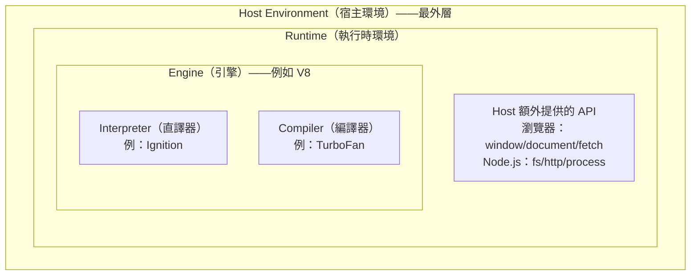
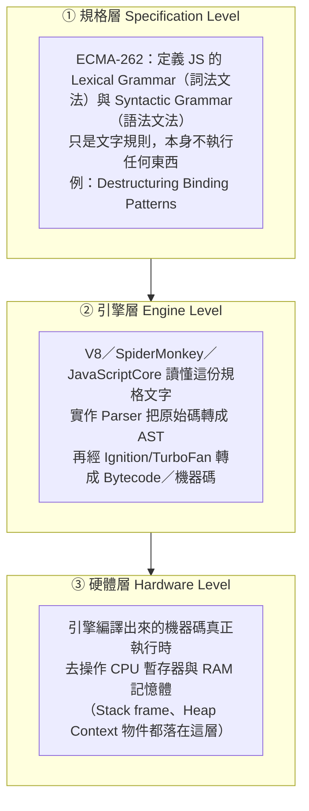

# 引擎（Engine）到底是什麼

> [!info]- 📍 承接00，銜接02
> <mark style="background: #ADCCFFA6;">承接</mark>：[[00-V8引擎完整管線-Parse到Deoptimization]]畫出「引擎」在做的事，這篇先把「引擎」這個詞本身講清楚——是誰在跑Parse、Compile、GC這些步驟。
> <mark style="background: #BBFABBA6;">下一步</mark>：知道引擎是誰之後，下一篇[[02-字面量-關鍵字-識別碼基礎]]講引擎的Parser實際掃到原始碼時，看到的最小單位。

> 本篇重點 (a)–(h)，共 8 個。這篇是壓軸的總覽筆記，把 [[V8引擎完整管線-Parse到Deoptimization]]、[[Node-js底層架構-V8-libuv-Bindings與CSR澄清]] 這些筆記裡一直出現的「引擎」這個詞，回頭做一次正式定義。

## (a) 先講廣義的「引擎」——軟體工程裡是什麼意思

「引擎」不是 JS 專屬的詞，軟體工程裡泛指：<mark style="background: #FFF3A3A6;">**一套可重複使用的核心運算/處理系統，接收輸入、依照固定規則處理、產出輸出，通常被包在一個更大的應用程式或環境裡，當作可以抽換的核心元件**。</mark>同樣的概念在不同領域都有對應：

| 領域 | 引擎範例 | 接收什麼輸入 | 負責做什麼 |
|---|---|---|---|
| 遊戲 | Unity、Unreal | 3D 模型、腳本、關卡資料 | 渲染畫面、物理運算、輸入偵測 |
| 搜尋 | Google 搜尋引擎 | 網頁內容、使用者查詢字串 | 建索引、依相關性排序 |
| 資料庫 | InnoDB、MyISAM | SQL 指令 | 儲存、索引、交易（Transaction）管理 |
| **JavaScript** | **V8**、SpiderMonkey | **你寫的 JS 原始碼** | 解析、編譯、執行 |

## (b) 共同特徵：<mark style="background: #FFF3A3A6;">引擎本身通常不是「完整產品」，是被 Host（宿主）包起來用的核心元件</mark>

Unity 引擎本身不是一款遊戲，是被「某一款具體的遊戲」包起來使用；同樣地，<mark style="background: #FFB8EBA6;">**V8 引擎本身不是瀏覽器，也不是 Node.js**——它是被 Chrome、Node.js 這些「宿主應用程式（Host）」包起來、當成核心元件使用的一支獨立程式</mark>。這個「引擎 vs Host」的分工，正是 [[Node-js底層架構-V8-libuv-Bindings與CSR澄清]] 裡「<mark style="background: #FFF3A3A6;">同一顆 V8，配上不同 Host 就有不同 API</mark>」的根本原因。

## (c) <mark style="background: #FFF3A3A6;">JS 引擎具體</mark>是什麼？——<mark style="background: #FFF3A3A6;">一支用 C++ 寫的獨立程式</mark>

- V8 本身是一支用 **C++** 寫成、可以「被」獨立編譯、獨立嵌入任何 C++ 專案的程式庫（library），
		V8被編譯，是被動的那一層。V8自己的C++原始碼要先被一套C++編譯工具像Clang編譯成一隻獨立的函式庫/執行檔。
	- 這個編譯過程跟Chrome自己的<mark style="background: #FFB8EBA6;">建置流程</mark>是分開的、獨立的，這樣V8才能被包進Chrome、也能被包進Node.js、Deno等不同的宿主。
- 職責明確界定在：**讀懂 JS 原始碼 → 轉換成可執行的表示法 → 執行它 → 提供 ECMAScript 規格要求的所有語言核心功能**（閉包、Promise、陣列方法、`class`……）。
  **它完全不包含 DOM、`fetch`、`fs`、`http` 這些——這些統統是 <mark style="background: #FFF3A3A6;">Host 環境額外加上去的</mark>**，V8 自己對「網頁」或「檔案系統」一無所知，只認得 ECMAScript 這份語言規格。完整管線見 [[V8引擎完整管線-Parse到Deoptimization]]（Parser、Ignition、TurboFan 都是 V8 這個引擎內部的模組）。

> [!info]- 🔍 主詞釋清：上面這些動作的主體都是誰
> <mark style="background: #ADCCFFA6;">讀懂JS原始碼的是**V8**（準確說是V8內部的Parser模組）；把它轉換成可執行表示法的也是**V8**（Ignition產生Bytecode、TurboFan產生優化過的機器碼）；執行它的還是**V8**；提供閉包、Promise、陣列方法、class這些ECMAScript規格要求的核心語言功能的，同樣是**V8**。
> <mark style="background: #FF5582A6;">Host環境不是V8——這是最容易搞混的地方。</mark>Host環境指的是**包住V8、額外提供DOM/fetch/fs/http這些API的那個外層程式**：在瀏覽器裡Host是Chrome，在伺服器端Host是Node.js，在Deno環境裡Host是Deno。V8本身只認ECMAScript規格，DOM、fetch、fs、http全部是Host（Chrome／Node.js／Deno）自己寫的API、透過C++ Bindings注入到V8的執行環境裡，不是V8自己會的東西。

> [!info]- 🔍 DOM、fetch、fs、http到底是誰提供的？不要全部籠統地共用一句，下面拆開看
> | API／功能 | 瀏覽器（Chrome）提供 | Node.js提供 | 說明 |
> |---|---|---|---|
> | **DOM**（`window`、`document`） | ✅ | ❌ | DOM代表網頁的HTML結構，只有瀏覽器需要處理「畫面」，Node.js沒有視窗、沒有畫面，天生不需要DOM |
> | **`fetch`**（發送HTTP請求，當Client端用） | ✅瀏覽器原生就有 | ✅Node.js 18+內建（早期版本要補node-fetch套件） | <mark style="background: #FFB8EBA6;">這個現在兩邊都有，是少數例外</mark>——Node.js後來為了貼近瀏覽器標準，把fetch也內建進去了 |
> | **`fs`**（讀寫本機檔案系統） | ❌ | ✅ | 瀏覽器基於安全考量，網頁JS完全不能任意讀寫使用者電腦上的檔案，只有Node.js這種跑在伺服器/本機的環境才有 |
> | **`http`**（建立HTTP伺服器、監聽Port） | ❌ | ✅ | <mark style="background: #ADCCFFA6;">你抓到重點了</mark>——瀏覽器只能當Client發請求（用fetch），沒辦法建立一個HTTP伺服器去監聽連線；Node.js的`http`模組則兩者都能做（建立伺服器＋發請求） |
>
> 一句話：<mark style="background: #FF5582A6;">DOM是瀏覽器獨有；fs、http（建立伺服器）是Node.js獨有；fetch是少數例外，現在兩邊都有。</mark>

## (c-1) 追問：V8被C++編譯過才能用，那瀏覽器上面「有」C++嗎？Chrome的「建置流程」到底是什麼？

<mark style="background: #FFF3A3A6;">有，但不是你想的那種「瀏覽器上面裝著C++原始碼、隨時在編譯」——C++→機器碼這個編譯動作，早在你下載Chrome之前，就已經在Google的建置伺服器上做完了。</mark>你下載安裝的Chrome，是一支已經編譯好、可以直接執行的**原生執行檔（native binary）**，裡面裝的是機器碼，不是C++原始碼本身；你的電腦不需要、也沒有再重新編譯一次。

**Chrome的「建置流程（build process）」具體指什麼**：Google工程師維護一份巨大的原始碼庫（Chromium），裡面包含瀏覽器UI、Blink渲染引擎、網路堆疊……以及V8（V8有自己獨立的repo，被Chromium當成外部依賴拉進來）。Google用一套建置系統（GN負責產生建置設定、Ninja負責實際編譯）把這些全部C++原始碼（含V8）一起編譯，針對Windows／macOS／Linux／Android等每一種目標平台各自產出對應的原生執行檔——這整套「把原始碼變成可執行檔」的流程，就是建置流程，全部發生在Google那邊，使用者只負責下載已經編譯好的成品。

**為什麼要強調V8的編譯是「跟Chrome的建置流程分開、獨立」**：因為V8自己有獨立的repo跟建置系統，可以**單獨**被編譯成一支獨立的函式庫，不一定要跟著整個Chrome一起編譯——這樣Node.js、Deno才能只拉V8這個部分進來用，不需要把整個Chrome瀏覽器一起打包進去。Chrome自己在建置的時候，則是把V8當成其中一個依賴項目，一起編譯進最終的Chrome執行檔裡。

**一句話**：C++是Google／Node.js／Deno開發者拿來寫 V8、寫 Chrome本身的**原始碼語言**；到使用者手上的Chrome，已經是編譯完成的機器碼執行檔，使用者的電腦本身不需要裝C++編譯器，也不會現場編譯任何東西。

> [!info]- 🔍 追問：Compile（編譯）跟Build（建置）是同一件事嗎？
> <mark style="background: #FFF3A3A6;">不完全是同一件事——Compile是Build裡面的其中一個步驟，Build的範圍比Compile大。</mark>
> - **Compile（編譯）**：專指「把某一份原始碼，翻譯成另一種形式」這個**單一動作**，例如把一支`.cc`檔的C++原始碼，翻譯成`.o`目的檔（object file）裡的機器碼；或V8內部把JS原始碼翻譯成Bytecode，也是一種compile。
> - **Build（建置）**：範圍大很多，指「從一堆原始碼，產出最終可執行成品」的**整套流程**，通常包含好幾個步驟：先把每一支原始碼各自compile成目的檔，再把所有目的檔**Link（連結）**在一起組成最終執行檔，中間可能還有資源打包、程式碼產生（code generation）、版本號寫入等其他步驟。
> - 對應到(c-1)講的Chrome建置流程：**GN產生建置設定，Ninja執行的正是整套Build**——裡面包含大量的Compile動作（把Chromium裡每一支C++原始碼各自編譯），加上最後把它們全部Link起來，才產出你下載到的那支Chrome執行檔。
>
> 一句話：<mark style="background: #FF5582A6;">Compile是生產線裡的其中一步（原始碼→目的檔）；Build是整條生產線（Compile＋Link＋其他步驟→最終可執行成品）。</mark>

> [!info]- 🔍 追問：GN是什麼？
> <mark style="background: #FFF3A3A6;">GN全稱**Generate Ninja**，是Google自己寫來給Chromium專案用的一套**建置設定產生工具**（後來Google的Fuchsia作業系統也拿去用）——**GN自己不負責編譯**，只負責「產生建置設定」這一步。</mark>
> - 開發者實際寫的是`BUILD.gn`這種**宣告式設定檔**，裡面列出「這個模組有哪些原始碼檔」「依賴哪些其他模組」這種層級的關係，並不直接寫編譯指令。
> - GN讀懂這些`BUILD.gn`之後，會換算、產生出一大堆Ninja看得懂的低階建置檔（`.ninja`檔），真正呼叫編譯器、執行Compile跟Link動作的是**Ninja**，不是GN。
> - 可以對照你若用過CMake：關係就像CMake會先讀懂`CMakeLists.txt`、再產生出Makefile供make執行一樣——**GN→產生→Ninja執行**，跟**CMake→產生→Make執行**是同一種角色分工的模式，只是換了一套Google自己的工具鏈。
>
> 一句話：<mark style="background: #FF5582A6;">GN只負責「規劃課表」（產生建置設定）；真正動手編譯、連結的是Ninja。</mark>

## (c-2) 追問：Chrome跟Chromium是什麼關係？是同一個東西嗎？

<mark style="background: #FFF3A3A6;">不是同一個東西——Chromium是「原始碼／底層」，Chrome是「拿Chromium原始碼蓋出來的其中一款產品」，兩者是「開源基底」跟「商業成品」的關係。</mark>

- **Chromium**：Google主導、完全開源（**BSD授權**，全稱**Berkeley Software Distribution**授權，源自加州大學柏克萊分校當年釋出BSD Unix時使用的授權條款，屬於**寬鬆式開源授權**——只要保留原作者版權聲明，允許任何人自由使用、修改、甚至拿去做成商業產品，不強制要求公開衍生產品的原始碼）的專案，任何人都能下載原始碼、自己編譯出一支瀏覽器來用。上一節(c-1)講的「Google維護一份巨大原始碼庫」，指的就是Chromium這份原始碼庫——瀏覽器UI、Blink渲染引擎、網路堆疊、V8，全部裝在這裡。
- **Chrome**：Google拿Chromium原始碼當地基，蓋出來的正式商業產品，在Chromium之外**額外加上**幾樣Chromium沒有、也不能有的東西：
	a. Google品牌（圖示、名稱、自動更新機制）；
	b. 當機／使用回報，會把資料送回Google（Chromium預設沒有這層）；
	c. Widevine DRM（讓Netflix這類有版權保護的影音網站能播放）；
	d. 有版權授權費的音訊／視訊解碼器（例如H.264、AAC）——這些Chromium身為開源專案，**法律上不能**免費內建，只有Google付了授權費的Chrome才有。
- **其他瀏覽器也是拿Chromium當地基蓋的**：新版Microsoft Edge、Opera、Brave、Vivaldi，全部都是「Chromium＋自己的品牌／額外功能」，跟Chrome是「同個地基、不同蓋法」的關係，不是互相抄襲。

一句話：<mark style="background: #FF5582A6;">Chromium是開源地基，任何人都能拿去蓋；Chrome是Google自己蓋、加了授權內容跟遙測的其中一棟房子；新版Edge／Opera／Brave也是蓋在同一塊地基上的其他房子。</mark>

## (d) 常見的 JS 引擎清單

| 引擎 | 誰在用 | 備註 |
|---|---|---|
| **V8** | Chrome、Edge（新版）、Node.js、Deno、Electron | Google 開發，本系列筆記主要圍繞它 |
| **SpiderMonkey** | Firefox | **史上第一個 JS 引擎**，1995 年 Brendan Eich 寫 JS 語言本身的同時一起寫出來的 |
| **JavaScriptCore（暱稱 Nitro）** | Safari、WebKit | Apple 開發 |
| **Chakra** | 舊版 Edge（EdgeHTML 時代）、IE | 新版 Edge 已改用 V8，Chakra 停用 |

## (e) 名詞辨析：Engine vs Interpreter/Compiler vs Runtime vs Host Environment

這幾個詞常被混用，但其實是**不同層次**的概念，範圍由小到大：



> [!info]- 🔍 Runtime環境具體有哪些例子？上面那張圖太抽象，下面換成真實存在的6支 Runtime來對照
> ```mermaid
> %%{init: {'flowchart': {'htmlLabels': true, 'nodeSpacing': 45, 'rankSpacing': 55, 'padding': 14}} }%%
> flowchart TD
>     subgraph R1["🌐 Runtime範例①：瀏覽器 Chrome"]
>         direction TB
>         E1["Engine：V8<br/>Ignition＋TurboFan"]
>         A1["Host額外API：<br/>window／document／fetch／localStorage"]
>         L1["Event Loop＋Call Stack<br/>（Stack Frame疊放的地方）"]
>         E1 --- A1 --- L1
>     end
>     subgraph R2["🖥️ Runtime範例②：Node.js"]
>         direction TB
>         E2["Engine：V8<br/>Ignition＋TurboFan"]
>         A2["Host額外API：<br/>fs／http／process／Buffer"]
>         L2["Event Loop（由libuv實作）＋Call Stack"]
>         E2 --- A2 --- L2
>     end
>     subgraph R3["🦕 Runtime範例③：Deno"]
>         direction TB
>         E3["Engine：V8<br/>Ignition＋TurboFan"]
>         A3["Host額外API：<br/>Deno.readFile／Deno.serve"]
>         L3["Event Loop（由Tokio實作）＋Call Stack"]
>         E3 --- A3 --- L3
>     end
>     subgraph R4["🍞 Runtime範例④：Bun（引擎不同！）"]
>         direction TB
>         E4["Engine：**JavaScriptCore**（不是V8！Safari那顆）"]
>         A4["Host額外API：<br/>Bun.serve／Bun.file"]
>         L4["Event Loop（由Zig實作）＋Call Stack"]
>         E4 --- A4 --- L4
>     end
> ```
> <mark style="background: #ADCCFFA6;">前三個（Chrome／Node.js／Deno）都用同一顆**V8**、只是Host不同；</mark><mark style="background: #FFF3A3A6;">Bun則是連Engine都換成JavaScriptCore、依然能跑JS</mark>——這就是(f)節講的「ECMAScript規格是合約，引擎可以換」實際發生在真實世界的例子。每個 Runtime都是同一套「Engine＋Host額外API＋Event Loop（包含Call Stack）」結構，只是裡面裝的具體元件不一樣。

- **Interpreter／Compiler**：是引擎**內部**執行程式碼的兩種**手段／策略**，不是獨立的大概念。V8 這一個引擎內部同時用了兩者：Ignition 是直譯器（先跑起來，邊執行邊收集資料），TurboFan 是編譯器（把熱點程式碼編譯成優化過的機器碼）。
- **Engine（引擎）**：一整套「讀懂＋執行某種語言」的完整系統，內部可能同時包含 interpreter 跟 compiler（V8 正是這樣）。
- **Runtime（執行時環境）**：比引擎**更大**的概念，
  指「程式實際執行時，除了語言引擎本身之外，還包含的所有額外能力」。
	  例如「Node.js Runtime」＝ V8 引擎 ＋ libuv ＋ Node 專屬 API；
	  「瀏覽器 Runtime」＝ V8（或其他）引擎 ＋ Web APIs ＋ 事件迴圈。
- **Host Environment（宿主環境）**：提供「引擎之外的額外功能」的那個容器本身（瀏覽器、Node.js），是 Runtime 這個詞背後具體所指的那個「誰」。

## (f) 為什麼要把「引擎」單獨拆出來、可以互相替換？

因為 **ECMAScript 語言規格**是所有 JS 引擎都要遵守的「合約」——只要都照著這份規格實作，V8、SpiderMonkey、JavaScriptCore **可以互相替換**，不影響你寫的 JS 程式行為（效能跟極少數實作細節可能有差異，但語意上是一致的）。這正是為什麼你能寫「標準 JS」，同一份程式碼丟到 Chrome、Firefox、Safari、Node.js 都能正確跑——因為你依賴的是規格，不是某一顆特定引擎的內部實作。

## (g-1) 延伸：這些語法規則到底在哪一個「Level」？——規格層／引擎層／硬體層

把本系列筆記串起來看，「JS 的一段語法規則」實際上橫跨三個完全不同的層級，越往下越具體、越靠近實際運作的機器：



- **① 規格層**：[ECMA-262](https://tc39.es/ecma262/) 只是一份**文字規則**，它定義「合法的 JS 長怎樣」跟「執行語意應該如何運作」，本身**不會執行任何東西**——[[字面量-關鍵字-識別碼基礎]] 的 Identifier 命名規則、[ECMA-262 Destructuring Binding Patterns](https://tc39.es/ecma262/#sec-destructuring-binding-patterns) 的解構語法規則，都屬於這一層，是給「引擎開發者」看的規格書，不是給 CPU 看的。
- **② 引擎層**：[[V8引擎完整管線-Parse到Deoptimization]] 講的整套 Parser→Ignition→TurboFan 管線，就是 V8 這個「引擎」把①的規格文字**實作成真正能跑的程式**的地方——這一層才第一次把「文字規則」變成「AST、Bytecode、機器碼」這些具體的資料結構。
- **③ 硬體層**：引擎產出的機器碼，執行時才真正去動 **CPU 暫存器**跟 **RAM**——[[記憶體模型-stack-heap-動態配置-GC]]、[[傳值vs傳址-賦值與記憶體空間]]、[[return-清理記憶體-stack-frame與閉包例外]] 這幾篇講的 Stack Frame／Heap Context／GC，都是這一層實際發生的事。

一句話：**規格層決定「什麼是合法的」，引擎層決定「怎麼把合法的東西變成可執行的東西」，硬體層才是真正「東西被執行」的地方**——三層職責完全不同，缺一層都無法讓一段 `{a,b}` 解構語法真的在你電腦上跑起來。

## (g) 對照總結

| 問題 | 答案 |
|---|---|
| 引擎是什麼？ | 一套接收輸入、依規則處理、產出結果的核心運算系統，通常被 Host 包起來用 |
| V8 是不是瀏覽器？ | 不是，V8 只是被 Chrome（Host）包起來使用的核心元件 |
| V8 有沒有 DOM／`fetch`？ | 沒有，這些是 Host 環境（瀏覽器）額外提供的，V8 只管 ECMAScript 語言本身 |
| Interpreter/Compiler 是引擎嗎？ | 不是獨立概念，是引擎**內部**執行程式碼的兩種手段（V8 兩者都有：Ignition + TurboFan） |
| Runtime 跟 Engine 一樣大嗎？ | Runtime 更大：Runtime = Engine ＋ Host 額外提供的 API/事件迴圈 |
| 為什麼引擎可以換？ | 因為都遵守同一份 ECMAScript 規格，規格是引擎間可互換的「合約」 |

---

> [!info]- ➡️ 下一篇
> [[02-字面量-關鍵字-識別碼基礎]]——引擎的Parser實際掃到原始碼時看到的最小單位：字面量、關鍵字、識別碼。
