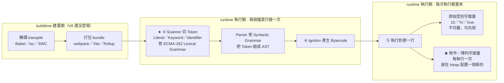

# 字面量(Literals)、關鍵字(Keywords)與識別碼(Identifier)

> [!info]- 📍 承接01，銜接03
> <mark style="background: #ADCCFFA6;">承接</mark>：[[01-引擎-Engine-到底是什麼]]確定了「引擎」在解析原始碼；這篇講引擎的Parser（Scanner/Lexer）掃描原始碼時，第一個看到的最小單位——字面量、關鍵字、識別碼。
> <mark style="background: #BBFABBA6;">下一步</mark>：知道Token長什麼樣之後，下一篇[[03-陳述式-Statement-vs-表達式-Expression]]講這些Token怎麼被組合成陳述式與表達式。

---

## 5W1H 速查：讀本篇之前先把座標定好

> [!important]+ 最常被搞錯的一件事先講：<mark style="background: #FF5582A6;">字面量不是「編譯期就存在的一個值」，它只是一種「寫法」</mark>
> 很多人以為既然叫「直接寫死的固定值」，那 `{ name: "John" }` 這個物件字面量就是在編譯期被做好、之後大家共用同一份。<mark style="background: #FF5582A6;">不是。</mark>
> a. 在 <mark style="background: #ADCCFFA6;">Parse 階段</mark>（每個檔案只做一次），字面量只被 Scanner 切成 Token、被 Parser 變成一個 AST 節點（`ObjectExpression`、`NumericLiteral`…）——這時候<mark style="background: #FFF3A3A6;">記憶體裡還沒有那個物件</mark>。
> b. 在 <mark style="background: #ADCCFFA6;">執行期</mark>，每次執行到那一行，引擎才真的在 Heap 上配置一個**全新**的物件。
> 所以下面這件事才成立，而它正是 [[10-傳值vs傳址-賦值與記憶體空間]] 的起點：
> ```js
> const f = () => ({ a: 1 });
> f() === f();   // false ← 同一個字面量，執行兩次就是兩個不同的物件
> ```
> 只有<mark style="background: #BBFABBA6;">原始型別</mark>的字面量（`10`、`"hi"`、`true`）因為不可變，才可以被引擎放進常數池共用。

| 5W1H | 問題 | 一句話答案 |
|---|---|---|
| **What** 是什麼 | 這三個詞分別是什麼？ | 都是 **Token（詞法單元）**，是 Parser 眼中原始碼的最小單位。<br>a. 字面量＝把值「直接寫出來」的寫法<br>b. 關鍵字＝語言保留、帶文法意義的字<br>c. 識別碼＝你自己取的名字 |
| **When** 什麼時候 | 它們是在哪一格被分辨出來的？ | 在 <mark style="background: #ADCCFFA6;">runtime 執行期最前面的 Parse 那一格</mark>，由 Scanner／Lexer 掃描時決定，<mark style="background: #FFF3A3A6;">每個檔案只做一次</mark>。但「字面量產生值」是執行期的事，執行幾次就產生幾次 |
| **Who** 誰做的 | 誰在切這些 Token？ | 引擎的 <mark style="background: #ADCCFFA6;">Scanner（V8 叫 Scanner，通稱 Lexer／Tokenizer）</mark>。Babel、tsc、ESLint 也各有自己的 Scanner，但那些跑在 buildtime，跟 V8 是不同的兩套 |
| **Where** 在哪裡 | 規則寫在規範的哪一章？ | ECMA-262 的 <mark style="background: #D2B3FFA6;">Lexical Grammar（詞法文法）</mark>。它管的是「字元怎麼變 Token」；Token 怎麼組成句子是下一層的 Syntactic Grammar，那是 [[03-陳述式-Statement-vs-表達式-Expression]] 的範圍 |
| **Which** 哪一種 | 哪些字不能拿來當識別碼？ | a. 保留字：`let`、`const`、`var`、`class`、`return`、`function`…<br>b. 開頭只能是英文字母、`_`、`$`<br>c. 數字不能開頭（`1stPlace` ❌、`place1` ✅）<br>d. 大小寫有別（`Name` 與 `name` 是兩個識別碼） |
| **How** 怎麼做到 | Scanner 怎麼判斷一串字元是哪一種？ | 逐字元往前吃，吃出一個完整的字之後：先查保留字表，中了就是 Keyword；沒中但符合命名規則就是 Identifier；符合數字／字串／布林等寫法就是 Literal |
| **Why** 為什麼 | 為什麼非要分這三類？ | 因為 Parser 下一層完全靠 Token 的**種類**決定文法怎麼組。`let x = 5` 之所以是宣告陳述式，正是因為 Scanner 先告訴 Parser「第一個 Token 是 Keyword `let`」 |

### 時間軸：這件事發生在哪一格

```text
◄──────────── buildtime 建置期 ────────────►◄────────── runtime 執行期 ──────────►
      （你的電腦／CI，部署前就跑完）              （瀏覽器或 Node 載入腳本之後）

 ①轉譯          ②打包            ③Parse                ④Bytecode      ⑤執行
 transpile      bundle           解析                   產生            逐行跑
 ┌────────┐   ┌────────┐      ┌──────────────────┐  ┌──────────┐  ┌──────────────┐
 │Babel   │   │webpack │      │★ Scanner 切 Token │  │Ignition  │  │★ 執行到字面量 │
 │tsc     │──►│Vite    │─────►│  Literal／Keyword │─►│把 AST 編成│─►│  那一行時，才 │
 │SWC     │   │Rollup  │      │  ／Identifier     │  │Bytecode  │  │  在 Heap 配置 │
 └────────┘   └────────┘      │  Parser 組 AST    │  └──────────┘  │  一個新物件   │
                              └──────────────────┘                └──────────────┘
                              ★ 這三個名詞被分辨出來                 ★ 每執行一次
                                的地方就在這一格                        就新配一份
                                每個檔案只做一次
```

字面量還有自己的第二條時間軸——<mark style="background: #D2B3FFA6;">一段字元從原始碼變成記憶體裡的值，中間走了哪幾步</mark>：

```text
 原始碼字元        Token           AST 節點          Bytecode         RAM 裡的值
 ──────────►      ──────────►     ──────────►      ──────────►      ──────────►
 ┌──────────┐   ┌──────────┐   ┌──────────────┐  ┌──────────┐   ┌──────────────┐
 │{ a: 1 }  │──►│PUNCTUATOR│──►│ObjectExpress-│─►│CreateObj-│──►│Heap 上一塊    │
 │ 這 8 個   │   │IDENTIFIER│   │ion           │  │ectLiteral│   │全新的物件      │
 │ 字元      │   │NUMBER    │   │  Property    │  │          │   │位址每次都不同  │
 └──────────┘   └──────────┘   └──────────────┘  └──────────┘   └──────────────┘
   ↑ Scanner       ↑ Parser        ↑ Ignition                      ↑ 執行期
   只做一次         只做一次          只做一次                        每次都重來
```

同一件事用 Mermaid 再畫一次：



---

## 重點整理

### 字面量(Literals)不只是數值

字面量 = 程式碼中「直接寫死固定值」的表達方式,編譯器/解釋器一看就知道值是什麼,不需透過變數讀取或計算。常見類型:

- 數字字面量:`10.50`(浮點數)、`1001`(整數)
- 字串字面量:`"John Doe"`、`'Hello World'`
- 布林字面量:`true`、`false`
- 陣列字面量:`[1, 2, 3]`;物件字面量:`{ name: "John", age: 30 }`

對比:字面量是固定值 `5`;變數是裝資料的盒子 `let x;`;結合 `let x = 5;` 是把字面量 5 賦值給變數 x。**數值只是字面量的其中一種。**

### Keywords 與 Identifier

- `let`、`const`、`var` 都是 **keywords(關鍵字)**:JS 內建保留字,用來宣告變數/常數,不能拿來當變數名(`let const = 10;` 會報錯)。
- **Identifier(識別碼)** = 幫變數、常數、函式取的名字。開頭只能是三種:英文字母(`age`、`Name`)、底線(`_userId`)、錢字號(`$element`)。
- ⚠️ 數字不能放開頭:`let 1stPlace` 不合法;放後面可以:`let place1` 合法。

### 完整命名規則（Identifier naming rules）

- 開頭字元只能是 ASCII 英文字母(大小寫皆可)、底線 `_`、錢字號 `$`；**數字不可用於開頭字元**。
- 開頭之後的字元可以用英文字母、數字、底線。
- **大小寫是有差異的**(`userName` 跟 `username` 是兩個不同的 identifier)。
- 不可使用 JavaScript 的**保留字**(`let`、`const`、`var`、`function`、`class`…)當名稱。
- 這種名稱在 JS 裡統稱 **identifier**，它在程式碼的上下文（同一個 scope 裡）**具有唯一性**——同一個 scope 不能有兩個同名的 `let`/`const` identifier。
  - ⚠️ **例外**：函式參數列表不是這條規則的無條件子集——非 strict + 簡單參數列表時允許重複參數名稱，細節見 [[函式呼叫核心機制-Execution-Context-與-Parameter-Binding]]。

### 這篇的 Identifier，跟 ECMA-262 的「Lexical Grammar」是什麼關係？

<mark style="background: #FF5582A6;">先分清楚一個容易搞混的地方：「Lexical」在 JS／規格書裡有兩種完全不同的意思，不要混在一起</mark>：

| 詞 | 意思 | 在哪篇筆記 |
|---|---|---|
| **Lexical Grammar（詞法文法）** | 規格書定義「原始碼文字要怎麼切成一顆顆 Token」的規則——本篇的 Identifier 命名規則正是 Lexical Grammar 的一部分 | **本篇**、[[00-V8引擎完整管線-Parse到Deoptimization]] 的 Scanner/Lexer |
| **Lexical Scope（詞法範疇）** | 變數的存取權限「在程式碼寫下的那一刻」就決定，不是函式執行時才決定 | [[作用域-scope-global-function-block]]、[[閉包-Closure-私有變數與傳址陷阱]] |

兩者共用「Lexical」這個字只是巧合（都源自「跟原始碼文字本身有關」的字根），**指的是完全不同層次的東西**，本節接下來講的是前者（Lexical Grammar）。

**這篇的 Identifier 命名規則，跟 [ECMA-262 Destructuring Binding Patterns](https://tc39.es/ecma262/#sec-destructuring-binding-patterns) 這份規格連結是什麼關係？**

- **關係**：Destructuring Binding Patterns（解構綁定模式，`{a,b}`／`[a,b]` 這種寫法，見 [[08-函式呼叫核心機制-Execution-Context-與-Parameter-Binding]] (d)）是**Syntactic Grammar（語法文法）**層級的規則，定義「怎麼把好幾個 Token 組合成一個合法的解構模式」；但不管解構出來的是 `{name}` 還是 `[a, b]`，**最終被綁定的每一個變數名稱，本質上仍然是本篇講的 Identifier**，一樣要符合開頭限英文字母/`_`/`$`、不可用保留字這些規則。也就是說：**Lexical Grammar（本篇，定義 Token 長什麼樣）是地基；Syntactic Grammar（那份 spec 連結，定義 Token 怎麼組合）是蓋在地基上的結構**——解構模式再怎麼複雜，拆到最底層還是要靠合法的 Identifier 撐著。
- **重要性**：這解釋了為什麼 `function f({ 1invalid }) {}` 這種寫法會報錯——不是因為解構語法本身有問題，是因為 `1invalid` 這個名稱從最底層的 Lexical Grammar 就不合法（數字開頭），語法文法蓋得再怎麼漂亮，地基（Identifier 規則）不合法照樣蓋不起來。看 Parser 具體怎麼用到這份 spec 建 AST，見 [[00-V8引擎完整管線-Parse到Deoptimization]] 的 Parse 階段。

### 釐清：`var a = 1;` 的 `a` 到底是「identifier」還是「屬性(property)」？（簡版見 [[identifier-vs-property-var全域變數]]）

**兩個都對，只是在講不同層次的東西，不是互斥的：**

- **語法層次（怎麼寫程式碼）**：`a` 是一個 **identifier**——它是原始碼裡「用來稱呼這個變數綁定的名字/token」，要符合上面那串命名規則。不管你用 `var`、`let` 還是 `const` 宣告，`a` 在語法上永遠是 identifier，這點跟宣告方式無關。
- **執行期層次（引擎實際怎麼實作這個綁定）**：只有 `var`（以及沒加關鍵字的隱性全域賦值）在**全域作用域**宣告時，JS 引擎會把這個綁定實作成**全域物件（瀏覽器裡是 `window`）的一個 own property**，所以你才能用 `window.a` 讀到它。`let`/`const` 的全域綁定則是存在另一種內部機制（規格書裡叫 **Declarative Environment Record**，不掛在 `window` 物件上），所以 `window.a` 讀不到。

一句話：**「identifier」是在描述「這個名字在語法上是什麼角色（一個合法的變數名稱 token）」；「property」是在描述「`var` 宣告的全域綁定，執行期被引擎實作成 `window` 物件上的一個 key-value」。前者是語法分類，後者是（`var`全域限定的）執行期實作細節，兩者描述的是同一個 `a`，但站在不同層次講話，不衝突。**

> 🔗 這裡的「執行期」跟 [[函式呼叫核心機制-Execution-Context-與-Parameter-Binding]] (g)(h) 節、[[00-V8引擎完整管線-Parse到Deoptimization]] 的「編譯期 vs 執行期」是同一組定義：Parse 只做一次是編譯期；Creation Phase／Execution Phase 每次呼叫都重來，是執行期。三篇講的是同一條分界線，只是套用在不同例子上。

## 各對話來源

### 字面量不只數值(2026-06)— https://gemini.google.com/app/f5ae34d311e0295c

使用者:literals 字面量是數值的意思嗎

Gemini:不是喔!「字面量(Literals)」並不單指數值,範圍比數值更廣。字面量指的是在程式碼中「直接寫死固定值」的表達方式,編譯器或解釋器一看到就能直接知道它的值,不需要透過變數去讀取或計算。主要類型:(1) 數字字面量:10.50(浮點數)、1001(整數);(2) 字串字面量:"John Doe"、'Hello World';(3) 布林字面量:true、false;(4) 物件與陣列字面量:[1, 2, 3]、{ name: "John", age: 30 }。快速對比——字面量(固定值):5;變數(裝資料的盒子):let x;結合使用:let x = 5;。數值只是字面量的「其中一種」類型,只要是直接寫在程式碼裡的固定資料(文字、數字、布林值)都叫字面量。

使用者:let, const, var 都是 keywords 對吧?identifier 是變數的名稱可以是英文字母或者底線或者 dollar sign 開頭 YEAH?

Gemini:沒錯,完全答對!(1) let、const、var 都是 JavaScript 內建保留的關鍵字,用來宣告變數(或常數),不能拿來當變數名稱(例如 let const = 10; 會直接報錯)。(2) Identifier(識別碼)就是幫變數、常數或函式取的名字。命名開頭只能用三種:英文字母(大小寫皆可,如 age、Name)、底線(_,如 _userId)、錢字號($,如 $element)。小陷阱:數字(0-9)不可以放開頭,let 1stPlace = "Tom"; 不合法;但數字可以放後面,let place1 = "Tom"; 就可以。

---

> [!info]- ➡️ 下一篇
> [[03-陳述式-Statement-vs-表達式-Expression]]——這些Token怎麼被組合成陳述式與表達式兩種語法結構。
