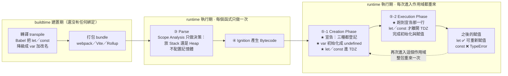

# 變數宣告：let / const / var

> [!info]- 📍 承接03，銜接05
> <mark style="background: #ADCCFFA6;">承接</mark>：[[03-陳述式-Statement-vs-表達式-Expression]]確定變數宣告是一種陳述式，這篇專門拆解let/const/var三種宣告方式的差異。
> <mark style="background: #BBFABBA6;">下一步</mark>：宣告了變數之後，馬上會遇到「這個變數在哪裡看得到」的問題，下一篇[[05-作用域-scope-global-function-block]]講作用域。

> 相關：[[loops-and-increment-operators]]、[[靜態檢查vs動態檢查-TS-vs-JS]]、[[記憶體模型-stack-heap-動態配置-GC]]
> 行事曆練習主題（let vs var + 作用域）

> [!important] 實務慣例
> **預設一律用 `const`；確定要「重新賦值」才用 `let`；`var` 幾乎不用（舊語法、有坑）。**

---

## 5W1H 速查：讀本篇之前先把座標定好

> [!important]+ 最常被搞錯的一件事先講：<mark style="background: #FF5582A6;">「`let` 與 `const` 不會 hoisting」是錯的</mark>
> 三個關鍵字<mark style="background: #BBFABBA6;">全部都會被提升</mark>，差別不在「有沒有被提升」，而在<mark style="background: #FF5582A6;">被提升之後有沒有被初始化</mark>：
> a. `var` → 在 Creation Phase 就<mark style="background: #ADCCFFA6;">登記＋初始化成 `undefined`</mark>，所以宣告前存取拿到 `undefined`。
> b. `let` / `const` → 在 Creation Phase <mark style="background: #FFF3A3A6;">只登記、不初始化</mark>，這段「登記了但還沒初始化」的空窗就是 <mark style="background: #D2B3FFA6;">TDZ（Temporal Dead Zone）</mark>，碰它會丟 `ReferenceError`。
>
> 差別的關鍵在於：`ReferenceError: Cannot access 'x' before initialization` 這句話本身就在說「<mark style="background: #BBFABBA6;">這個名字我認得</mark>，只是還沒初始化」——如果真的沒被提升，訊息會是 `x is not defined`。<mark style="background: #FF5582A6;">兩句錯誤訊息不一樣，就是最好的證據。</mark>

| 5W1H | 問題 | 一句話答案 |
|---|---|---|
| **What** 是什麼 | 這三個關鍵字到底在做什麼？ | 都是「在某個作用域裡建立一個**綁定（binding）**」的宣告陳述式。綁定＝一個名字對應到一塊記憶體位置 |
| **When** 什麼時候 | 綁定是什麼時候被建立的？ | 在<mark style="background: #ADCCFFA6;">執行期</mark>、進入那個作用域的 <mark style="background: #ADCCFFA6;">Creation Phase</mark>，三個都在這時登記完畢，<mark style="background: #FFF3A3A6;">每次進入該作用域都重來一次</mark>。Parse 階段只做決策（要放 Stack 還是 Heap），不配置記憶體 |
| **Who** 誰做的 | 誰在建立這些綁定？ | 引擎（V8）建立 Environment Record 時做的。<mark style="background: #FF5582A6;">跟 Babel 無關</mark>——Babel 把 `let` 降級成 `var` 加改名是 buildtime 的另一回事，那時候還沒有任何綁定存在 |
| **Where** 在哪裡 | 綁定被放進哪個作用域？ | a. `var` → 最近的**函式**作用域或全域，穿透 `{ }`；全域的 `var` 還會變成 `window` 的 property（見 [[07-identifier-vs-property-var全域變數]]）<br>b. `let` / `const` → 最近的**區塊** `{ }` |
| **Which** 哪一種 | 該用哪一個？ | <mark style="background: #BBFABBA6;">預設一律 `const`</mark>；確定要重新賦值才 `let`；`var` 幾乎不用 |
| **How** 怎麼做到 | `const` 到底鎖住了什麼？ | 鎖住的是<mark style="background: #FFF3A3A6;">綁定本身</mark>，不是值的內容。`arr.push(3)` ✅（改的是 Heap 上的物件）、`arr = [9]` ❌（改的是綁定指向誰） |
| **Why** 為什麼 | ES6 為什麼要多這兩個？ | 為了補 `var` 的三個坑：<br>a. 沒有區塊作用域，會漏出去<br>b. 可以重複宣告而不報錯<br>c. 迴圈裡整輪共用同一個綁定，`setTimeout` 全印同一個值 |

### 時間軸：這件事發生在哪一格

```text
◄──────────── buildtime 建置期 ────────────►◄────────── runtime 執行期 ──────────►
      （你的電腦／CI，部署前就跑完）              （瀏覽器或 Node 載入腳本之後）

 ①轉譯          ②打包            ③Parse          ④Bytecode      ⑤每次進入作用域
 transpile      bundle           解析             產生            都重來
 ┌────────┐   ┌────────┐      ┌──────────┐   ┌──────────┐   ┌──────────────────┐
 │Babel   │   │webpack │      │Scanner   │   │Ignition  │   │ Creation Phase   │
 │let→var │──►│Vite    │─────►│Parser    │──►│把 AST 編成│──►│ ★ 建立 var／let／ │
 │加改名   │   │Rollup  │      │AST       │   │Bytecode  │   │   const 的綁定    │
 └────────┘   └────────┘      │Scope     │   └──────────┘   │ ★ var 初始化成    │
      ↑                       │Analysis  │                  │   undefined       │
 Babel 只是把文字換掉，        └──────────┘                  │ ★ let／const 進   │
 這時候記憶體裡              每個函式只做一次                  │   TDZ，不初始化   │
 一個綁定都還沒有。          只做「決策」：                    ├──────────────────┤
                            這個變數會不會被                  │ Execution Phase  │
                            閉包捕獲？→ 決定                  │ 跑到宣告那一行，  │
                            放 Stack 還是 Heap                │ 才初始化＋賦值    │
                                                             └──────────────────┘
 ★ 綁定的建立在第 ⑤ 格，不在第 ①③ 格。
```

變數本身還有自己的第二條時間軸——<mark style="background: #D2B3FFA6;">一個綁定的三個階段：宣告 → 初始化 → 賦值</mark>。四種宣告方式的差別，全部落在「第二步在什麼時候發生」：

```text
              ① 宣告 declaration     ② 初始化 initialization   ③ 賦值 assignment
              （登記這個名字）        （給它第一個值）           （之後再改值）
              ─────────────────      ─────────────────────     ─────────────────
              Creation Phase          ↓ 時機因關鍵字而異 ↓       Execution Phase

 function     ├─ 登記 ────────────────┤ 同時完成，整個函式      （可被重新指派）
              │                       │ 都放進去了
              │
 var          ├─ 登記 ────────────────┤ 同時初始化成 undefined  ── 跑到那行才賦值
              │                       │                            var x = 5
              │
 let          ├─ 登記 ─── ◄TDZ► ──────┤ 跑到宣告那行才初始化    ── 之後可重新賦值
              │           碰到就       │
              │           Reference-   │
 const        ├─ 登記 ─── ◄TDZ► ──────┤ 跑到宣告那行才初始化    ── ❌ 不能重新賦值
              │           Error        │ 而且一定要給初值            TypeError
              │
            進入作用域              執行到宣告那一行           之後的任何一行
```

同一件事用 Mermaid 再畫一次：



---

## let vs const（最常用，差別只有「能不能重新賦值」）

| | `const` | `let` |
|---|---|---|
| 重新賦值 | ❌ 不能 | ✅ 可以 |
| 宣告要給初值 | 必須 | 可不給（undefined） |
| 作用域 | 區塊 `{}` | 區塊 `{}` |

```js
const a = 1; a = 2;   // ❌ TypeError: Assignment to constant variable
let b = 1;   b = 2;   // ✅ 可以被重新賦值。但是不能重新宣告！不能寫let b = 2;
const c;              // ❌ SyntaxError：const 一定要給初值
let d;                // ✅ undefined
```

### ⚠️ const 不是「內容不能改」，是「不能重新賦值」
```js
const arr = [1, 2];
arr.push(3);   // ✅ 改內容可以 → [1,2,3]
arr = [9];     // ❌ 重新賦值不行

const obj = { name: "Abby" };
obj.name = "Joe";  // ✅ 改屬性可以
obj = {};          // ❌ 重新賦值不行
```
→ `const arr` / `const obj` 還能 push、改屬性，就是因為「改內容 ≠ 重新賦值」。

#### 所有「修改原陣列」的方法都能用 const
```js
const arr = [1, 2, 3];
arr.push(4);      // ✅ 加到尾
arr.pop();        // ✅ 移除尾
arr.unshift(0);   // ✅ 加到頭
arr.shift();      // ✅ 移除頭
arr.splice(1, 1); // ✅
arr.sort();       // ✅
arr.reverse();    // ✅
arr[0] = 99;      // ✅ 改某格
arr.length = 0;   // ✅ 清空
arr = [];         // ❌ 只有「重新賦值」不行 → TypeError
```
> 不用背哪些方法可以：只要問「**我在改它的內容，還是讓變數指向全新的東西？**」
> 改內容 → const 永遠 OK；`=` 重新指向 → 才需要 let。
> （`map`/`filter`/`slice`/`concat` 回傳新陣列、不改原本，對 const 也沒問題。）

#### 用「記憶體位址」再講一次同一件事（2026-09-17 由 Gemini 語音對話補入）

- <mark style="background: #ADCCFFA6;">`const` 鎖的是「參考位址（reference）」，不是「值」</mark>。
	宣告 `const arr = [1,2,3]` 時，`arr` 這個綁定被釘死在該陣列所在的那個 heap 位址上，之後不准再指向別處；但那塊 heap 空間裡的內容怎麼改都行。

- <mark style="background: #BBFABBA6;">`let` 允許同一個變數名在不同時間點綁定到完全不同的記憶體位址</mark>，所以底下這段完全合法、不會報錯：

```js
let array1 = [55, 666, 777];
array1 = [888, 999, 444];   // ✅ let 可以整個換掉，綁到另一塊全新的記憶體
```

	對照 `const array1 = [55, 666, 777]; array1 = [...]` 就會丟 `TypeError: Assignment to constant variable`。
	「值 vs 位址」的完整圖解在 [[10-傳值vs傳址-賦值與記憶體空間]]。

- <mark style="background: #FF5582A6;">⚠️ 常見誤解：以為選 `const` 比較「省記憶體／省電」</mark>。
	不成立。選 `let` 或 `const` 不會影響硬體耗電量，記憶體配置與垃圾回收（GC）執行得極快，對能耗的影響微乎其微。
	<mark style="background: #FFF3A3A6;">判準永遠是「程式邏輯與可讀性」</mark>：這個綁定在生命週期內會不會被整個換掉？會就 `let`，不會就 `const`。

- <mark style="background: #ADCCFFA6;">正名：`var` / `let` / `const` 這三個字的正式稱呼是「宣告關鍵字（declaration keywords）」</mark>，因為它們的職責是宣告變數，並同時決定該變數的作用域與能不能重新賦值這兩件事。

---

## let/const vs var（var 的三個坑）

| | `let` / `const` | `var` |
|---|---|---|
| 作用域 | **區塊** `{}`（if/for 內外分開） | **函式**（會漏出 if/for） |
| 提升 hoisting | 有 TDZ，宣告前用會報錯 | 提升並初始化為 `undefined`（不報錯，易出 bug） |
| 重複宣告 | ❌ 同層不能重複 | ✅ 可重複（容易誤蓋） |

### 坑 1：var 沒有區塊作用域（會漏出去）
```js
if (true) { var x = 1; let y = 2; }
console.log(x);   // 1   ← var 漏到外面
console.log(y);   // ❌ ReferenceError ← let 鎖在 {} 內
```

### 坑 2：TDZ（暫時性死區）
```js
console.log(v);   // undefined（var 被提升並初始化）
var v = 1;

console.log(l);   // ❌ ReferenceError（let 在 TDZ，宣告前不能用）
let l = 1;
```

> [!note] TDZ 和「區塊作用域」是兩個不同概念，別搞混
> 兩個都跟 `let`/`var` 有關，但問的是不同的事：
>
> | 概念 | 在問什麼 | 軸線 |
> |---|---|---|
> | **作用域**（區塊 vs 函式） | 變數「**能在哪裡**」被存取 | 空間（`{}` 內外） |
> | **TDZ 暫時性死區** | 變數「**從哪一行起**」能被存取 | 時間／順序（宣告那行的上下） |
>
> ```js
> {
>   // console.log(y);  // ❌ TDZ（在區塊內，但在 let 之前 → 時間軸）
>   let y = 2;
>   console.log(y);     // ✅ 2
> }
> // console.log(y);    // ❌ ReferenceError（跑出區塊了 → 空間軸）
> ```
> 兩行都丟 `ReferenceError`，但原因不同：一個是「太早用」，一個是「在外面用」。
>
> `var` 剛好兩個坑都踩（沒區塊作用域＋提升成 `undefined`），所以常被一起講；
> `let`/`const` 把兩件事都修好（鎖在區塊內＋TDZ 擋提早用），但它們是**兩個獨立的保護機制**。
> 一句話：**作用域決定「進不進得去」，TDZ 決定「到了沒」。**

### 坑 3：迴圈 + setTimeout 經典差異
```js
for (var i = 0; i < 3; i++) setTimeout(() => console.log(i));   // 3 3 3
for (let i = 0; i < 3; i++) setTimeout(() => console.log(i));   // 0 1 2
```
`var` 整個迴圈共用同一個 `i`；`let` 每圈是獨立的 `i`（區塊作用域）。

---

## 一句話總結
- **能不能重新賦值** → 不能用 `const`、要就 `let`。
- **const 鎖的是「綁定」不是「內容」** → 物件/陣列內容照樣可改。
- **var 有函式作用域 + 提升 + 可重複宣告三個坑** → 現代別用。

---

## 資料來源（含查證時間）

| 主題 | 連結 | 版本／時間 |
|---|---|---|
| 「為什麼陣列要用 const 宣告」Gemini 語音對話 | https://gemini.google.com/app/a043276b763882f4 | Gemini Flash，2026-09-17 擷取 |
| MDN — const（綁定不可重新賦值，但值可變） | https://developer.mozilla.org/en-US/docs/Web/JavaScript/Reference/Statements/const | MDN 現行版本，2026-09-17 查證 |
| MDN — let | https://developer.mozilla.org/en-US/docs/Web/JavaScript/Reference/Statements/let | MDN 現行版本，2026-09-17 查證 |
| ECMA-262 — Declarations and the Variable Statement | https://tc39.es/ecma262/#sec-declarations-and-the-variable-statement | ECMAScript 現行草案，2026-09-17 查證 |

---

> [!info]- ➡️ 下一篇
> [[05-作用域-scope-global-function-block]]——變數在哪裡看得到、哪裡會被關在門外。
