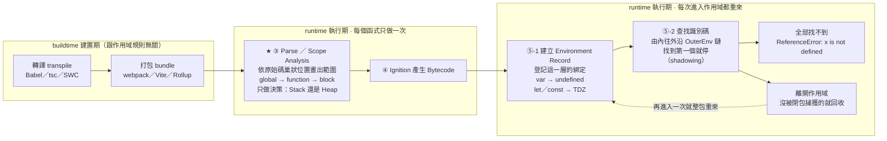

# 作用域 Scope：global / function / block

> [!info]- 📍 承接04，銜接06
> <mark style="background: #ADCCFFA6;">承接</mark>：[[04-變數宣告-let-const-var]]講的是「怎麼建立一個綁定」，這篇往下一步問「這個綁定在哪些範圍內看得見」。
> <mark style="background: #BBFABBA6;">下一步</mark>：作用域決定「看不看得到」，下一篇[[06-靜態檢查vs動態檢查-TS-vs-JS]]決定「型別對不對」，兩者都在程式還沒執行前就定案。

---

## 5W1H 速查：讀本篇之前先把座標定好

> [!important]+ 最常被搞錯的一件事先講：<mark style="background: #FF5582A6;">「有 `{ }` 就有新作用域」是錯的</mark>
> 區塊作用域（block scope）<mark style="background: #FF5582A6;">只對 `let`、`const`、`class` 有效</mark>，`var` 會直接穿透大括號，一路跑到最近的**函式**作用域或全域去。
> ```js
> if (true) {
>   var a = 1;
>   let b = 2;
> }
> console.log(a);   // 1            ← var 穿透了 { }
> console.log(b);   // ReferenceError ← let 被 { } 關住
> ```
> a. 所以「global / function / block」這三層<mark style="background: #FFF3A3A6;">不是每個變數都適用同一套</mark>：`var` 的世界裡只有 global 與 function 兩層，block 那一層是 ES6 才為 `let`／`const` 加的。
> b. 而且<mark style="background: #ADCCFFA6;">函式一定會產生新作用域，大括號不一定</mark>。`if`、`for`、`while` 的 `{ }` 是區塊；物件字面量的 `{ }` 根本不是作用域，只是一個值。

| 5W1H | 問題 | 一句話答案 |
|---|---|---|
| **What** 是什麼 | 作用域到底是什麼？ | 一組規則，決定「<mark style="background: #BBFABBA6;">某個識別碼在原始碼的哪些範圍內查得到</mark>」。它管的是「看不看得見」，不是「值是多少」 |
| **When** 什麼時候 | 作用域什麼時候被決定？ | <mark style="background: #FF5582A6;">寫程式的時候就決定了</mark>。範圍由原始碼的巢狀位置在 <mark style="background: #ADCCFFA6;">Parse 階段的 Scope Analysis</mark> 定案，每個函式只做一次；執行期只是「照著查」，不會因為誰呼叫它而改變 |
| **Who** 誰做的 | 誰在畫這些範圍？誰在查？ | a. 畫範圍：Parser 的 Scope Analysis，只做**決策**（要放 Stack 還是 Heap），不配置記憶體<br>b. 實際查找：執行期沿 Environment Record 的 `[[OuterEnv]]` 鏈往外找 |
| **Where** 在哪裡 | 有哪幾層？ | a. <mark style="background: #FFF3A3A6;">Global Scope</mark>：整支程式最外層<br>b. <mark style="background: #FFF3A3A6;">Function Scope</mark>：每個函式自己一層，`var` 的邊界就到這裡<br>c. <mark style="background: #FFF3A3A6;">Block Scope</mark>：`{ }` 內，ES6 才有，只關得住 `let`／`const`／`class` |
| **Which** 哪一種 | 哪些東西真的會產生新作用域？ | a. 函式（含箭頭函式）→ 一定會<br>b. `if`／`for`／`while`／裸 `{ }` → 只對 `let`／`const`／`class` 算數<br>c. `catch (e)` 的參數 → 會<br>d. 模組頂層 → 會（模組不是全域）<br>e. 物件字面量 `{ a: 1 }` → <mark style="background: #FF5582A6;">不會</mark>，那是值不是作用域 |
| **How** 怎麼做到 | 查一個名字的流程是什麼？ | 從最內層開始，往外一層一層找，<mark style="background: #BBFABBA6;">找到第一個就停</mark>（這就是遮蔽 shadowing）；一路找到全域都沒有 → `ReferenceError: x is not defined` |
| **Why** 為什麼 | 為什麼要有作用域？ | a. 避免命名衝突，兩個函式可以各有自己的 `i`<br>b. 控制變數的生命週期，離開就能被 GC 回收<br>c. 沒有它就沒有閉包——閉包正是「作用域被留下來」的結果 |

### 時間軸：這件事發生在哪一格

```text
◄──────────── buildtime 建置期 ────────────►◄────────── runtime 執行期 ──────────►
      （你的電腦／CI，部署前就跑完）              （瀏覽器或 Node 載入腳本之後）

 ①轉譯          ②打包            ③Parse                ④Bytecode   ⑤每次進入作用域
 transpile      bundle           解析                   產生         都重來
 ┌────────┐   ┌────────┐      ┌──────────────────┐  ┌────────┐  ┌────────────────┐
 │Babel   │   │webpack │      │Scanner／Parser    │  │Ignition│  │Creation Phase  │
 │tsc     │──►│Vite    │─────►│★ Scope Analysis   │─►│AST 編成│─►│★ 真的建立      │
 │SWC     │   │Rollup  │      │  畫出巢狀範圍      │  │Bytecode│  │  Environment   │
 └────────┘   └────────┘      │  決定誰被閉包捕獲  │  └────────┘  │  Record        │
                              └──────────────────┘              │★ 串上[[OuterEnv]]│
                              ★ 作用域的「範圍」在                └────────────────┘
                                這一格就定案了。                   ★ 查找動作在這裡
                                每個函式只做一次。                   每次呼叫都重查
                                這裡只做決策，
                                不配置任何記憶體。
```

作用域主題還有自己的第二條時間軸——<mark style="background: #D2B3FFA6;">同一個作用域的兩段人生：一次性的「畫範圍」與每次呼叫的「搭舞台」</mark>：

```text
 第一段：只做一次（Parse 期）              第二段：每次進入都重來（執行期）
 ─────────────────────────────           ──────────────────────────────────
 ┌───────────────────────────┐           ┌──────────────────────────────────┐
 │ 讀原始碼的巢狀縮排         │           │ ① 建立 Environment Record        │
 │ global                     │           │ ② 把這一層的綁定登記進去          │
 │  └ function outer          │  ──────►  │    var → 初始化成 undefined       │
 │      └ block { }           │           │    let／const → 進 TDZ            │
 │          └ function inner  │           │ ③ [[OuterEnv]] 指向「寫在哪一層」  │
 │                            │           │    的那個外層（不是呼叫者！）      │
 │ 決策：inner 用到 outer 的   │           │ ④ 查找時沿這條鏈往外找            │
 │ 變數 → 那個變數要放 Heap    │           │ ⑤ 離開作用域 → 沒被捕獲的就回收    │
 └───────────────────────────┘           └──────────────────────────────────┘
   ★ 這裡不會分配一格記憶體                  ★ 呼叫幾次就做幾次
```

同一件事用 Mermaid 再畫一次：



