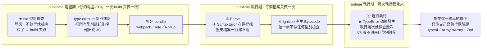

# 靜態檢查 vs 動態檢查（TS 型別 / JS TypeError）

> [!info]- 📍 承接05，銜接07（編譯期收尾）
> <mark style="background: #ADCCFFA6;">承接</mark>：[[05-作用域-scope-global-function-block]]決定「看不看得到」，這篇的靜態型別檢查決定「型別對不對」，兩者都在程式**還沒執行**前就確定——這篇是編譯期這一群（01–06）的收尾。
> <mark style="background: #BBFABBA6;">下一步</mark>：編譯期講完了，下一篇[[07-identifier-vs-property-var全域變數]]開始進入**執行期**，從`var`全域變數的具體例子切入。

> 相關：[[02-陣列遍歷-forEach與callback]]（TypeError vs SyntaxError）、[[原生函式與js引擎-v8]]、[[常見錯誤-括號引號沒收尾]]

---

## 5W1H 速查：讀本篇之前先把座標定好

> [!important]+ 最常被搞錯的一件事先講：<mark style="background: #FF5582A6;">TypeScript 完全不會讓「執行期」變安全</mark>
> `tsc` 的型別檢查<mark style="background: #FF5582A6;">100% 發生在 buildtime 的轉譯那一格</mark>，檢查完就把型別整個擦掉（<mark style="background: #D2B3FFA6;">type erasure，型別抹除</mark>），輸出的是純 JS。
> <mark style="background: #FF5582A6;">V8 在執行期看到的程式碼裡，一個型別註記都沒有</mark>——它根本不知道你曾經寫過 `: string`。
> ```ts
> const res = await fetch('/api/user');
> const u = await res.json() as { name: string };
> u.name.toUpperCase();   // 後端回 null → 執行期照樣 TypeError，TS 一個字都沒擋
> ```
> a. 所以 `any`、`as`、`fetch` 回來的資料，全部是靜態檢查的破口——那些地方 TS 只是「相信你」。
> b. 想在執行期真的擋住，只能自己寫執行期驗證（`typeof`、`Array.isArray`、Zod 這類 schema 驗證），那是<mark style="background: #ADCCFFA6;">動態檢查</mark>，不是 TS 幫你做的。
> 一句話記法：<mark style="background: #BBFABBA6;">TS 是給「寫程式的你」看的護欄，不是給「跑程式的使用者」用的安全網。</mark>

| 5W1H | 問題 | 一句話答案 |
|---|---|---|
| **What** 是什麼 | 靜態與動態的分界是什麼？ | <mark style="background: #BBFABBA6;">有沒有「執行」</mark>。不執行就檢查＝靜態；要執行到那一行才檢查＝動態 |
| **When** 什麼時候 | 各自發生在哪一格？ | a. TS 型別檢查 → <mark style="background: #ADCCFFA6;">buildtime 的轉譯那一格</mark>，一次 build 只做一次<br>b. `SyntaxError` → runtime 的 Parse 那一格，每個檔案只做一次<br>c. `TypeError` → runtime 的執行期，<mark style="background: #FFF3A3A6;">執行到幾次就檢查幾次</mark> |
| **Who** 誰做的 | 誰在檢查？在誰的機器上？ | a. 靜態：`tsc`／ESLint／編輯器的 language server，跑在<mark style="background: #ADCCFFA6;">你的電腦或 CI</mark><br>b. 動態：V8，跑在<mark style="background: #FF5582A6;">使用者的瀏覽器</mark>——這裡爆掉的是使用者看到，不是你 |
| **Where** 在哪裡 | 錯誤會出現在哪裡？ | a. 靜態 → 編輯器裡的紅色波浪線、`tsc` 的終端機輸出、CI 的失敗紀錄<br>b. 動態 → 使用者的 DevTools Console、錯誤監控平台 |
| **Which** 哪一種 | 哪一種錯歸哪一邊？ | a. TS 型別錯 → buildtime，靜態，<mark style="background: #FF5582A6;">執行期完全不存在</mark><br>b. `SyntaxError` → runtime 但在執行前，整支檔案一行都不跑，偏靜態<br>c. `TypeError` → runtime 執行期，純動態 |
| **How** 怎麼做到 | TS 靠什麼在不執行的情況下檢查？ | 讀原始碼建 AST，配合你寫的型別註記做型別推導與比對；比對完<mark style="background: #D2B3FFA6;">把型別全部刪掉</mark>輸出 JS。所以 `tsc` 做的是<mark style="background: #ADCCFFA6;">轉譯 transpile</mark>，不是 V8 那種編譯 compile |
| **Why** 為什麼 | 為什麼 JS 的型別檢查非得是動態的？ | 因為 JS 的值到執行期才有型別，而且同一個變數可以先是 `number` 再變 `string`。引擎沒有「執行前就知道型別」的能力，所以只能跑到那一行再看 |

### 時間軸：這件事發生在哪一格

```text
◄──────────── buildtime 建置期 ────────────►◄────────── runtime 執行期 ──────────►
      （你的電腦／CI，部署前就跑完）              （使用者的瀏覽器或 Node 載入腳本後）

 ①轉譯                ②打包           ③Parse           ④Bytecode    ⑤執行
 transpile            bundle          解析              產生          逐行跑
 ┌──────────────┐   ┌────────┐    ┌────────────┐   ┌────────┐   ┌──────────────┐
 │★ tsc 型別檢查 │   │webpack │    │★ SyntaxErr │   │Ignition│   │★ TypeError   │
 │  靜態：不執行 │──►│Vite    │───►│  在這裡擋   │──►│AST 編成│──►│  動態：跑到   │
 │  就檢查       │   │Rollup  │    │  整支檔案   │   │Bytecode│   │  那一行才爆   │
 │  檢查完把型別 │   │合併壓縮 │    │  一行都不跑 │   └────────┘   │  每次執行都   │
 │  整個擦掉     │   └────────┘    └────────────┘                │  重新檢查一次 │
 └──────────────┘                  每個檔案只做一次               └──────────────┘
   一次 build 只做一次
   ↓
   輸出的 JS 裡
   一個型別註記都沒有
   → 所以第 ⑤ 格完全
     不受 TS 保護
```

這個主題還有自己的第二條時間軸——<mark style="background: #D2B3FFA6;">一個錯誤有三個可能被抓到的時機，愈早抓到愈便宜</mark>：

```text
 愈左邊愈早發現，修起來愈便宜；愈右邊發現，代價愈高
 ◄──────────────────────────────────────────────────────────────────────►

 ①寫程式的當下        ②build 的時候       ③載入腳本時        ④使用者點下去時
 編輯器紅線           tsc／CI 失敗        SyntaxError        TypeError
 ┌──────────────┐   ┌──────────────┐   ┌──────────────┐   ┌──────────────┐
 │ TS language  │   │ tsc --noEmit │   │ V8 Parse     │   │ V8 執行期     │
 │ server 即時   │   │ ESLint       │   │ 語法錯 → 整支 │   │ o.assign 不是 │
 │ 推導          │   │ 沒過就不部署  │   │ 檔案不執行    │   │ function     │
 └──────────────┘   └──────────────┘   └──────────────┘   └──────────────┘
      靜態                靜態              偏靜態              動態
   只有你看到          只有團隊看到       使用者看到白畫面    使用者看到壞掉的功能

 ★ TS 的價值就是把錯誤從第 ④ 格往左推到第 ①② 格；它沒有辦法讓第 ④ 格消失。
```

同一件事用 Mermaid 再畫一次：



---

## 一句話

**「靜態 / 動態」的分界是「有沒有執行」。** 原生 JS 的**型別檢查是動態的（執行時才檢查）**，TypeError 是 runtime 錯誤；TypeScript 把型別檢查**提前到寫 code/編譯時（靜態，不執行就檢查）**。

---

## 靜態 vs 動態

| | 定義 | 工具 / 例子 |
|---|---|---|
| **靜態檢查** | **不執行**就檢查 | TypeScript、ESLint、語法解析 → 編輯器當場畫紅線 |
| **動態檢查** | **執行時**才檢查 | JS 的型別 → 跑到那一行才爆 |

## JS 其實有「兩種錯誤時機」

JS 不是「純直譯」——V8 會先把程式碼**編譯成 bytecode 再跑（JIT）**，但這個編譯**不做型別檢查**。

| 錯誤 | 何時發現 | 例子 |
|---|---|---|
| **SyntaxError** | **解析階段**（執行前就擋下） | 少一個反引號 / 括號 |
| **TypeError** | **執行階段**（跑到才爆） | `xxx.assign is not a function` |

→ JS 並非完全不檢查：**語法錯**在執行前擋；但**型別錯（TypeError）是動態、執行時才知道**。

## 跟「HTML → DOM」沒直接關係

型別檢查是「**程式跑到那一行才檢查**」，不是「DOM 建好之後才檢查」。瀏覽器解析 HTML 建 DOM、遇到 `<script>` 就執行 JS，TypeError 是 JS 引擎**執行到那一行**時才冒出來。

## 三者對照

| | 何時檢查 | 屬於 |
|---|---|---|
| TypeScript 型別 | 寫code/編譯時（不執行） | **靜態** |
| JS SyntaxError | 解析時（執行前） | 偏靜態 |
| JS TypeError | 執行時（跑到才知） | **動態** |

## 實例：為什麼 `obj.assign(...)` 是 TypeError 不是編譯就擋

```js
const o = { a: 1 };
o.assign({});   // ❌ Uncaught TypeError: o.assign is not a function（執行時才爆）
```
- 原生 JS：要**跑到這行**才發現 `o` 上沒有 `assign`（assign 是 `Object` 的靜態方法）。
- 若是 TypeScript：你一打 `o.assign`，編輯器**立刻**畫紅線（靜態，根本不用執行）。

> 記憶：**靜態＝不跑就抓（TS）；動態＝跑到才抓（JS 的 TypeError）。**

---

> [!info]- ➡️ 下一篇（開始進入執行期）
> [[07-identifier-vs-property-var全域變數]]——`var`全域宣告在執行期被實作成`window`的property，是執行期的第一個具體例子。
