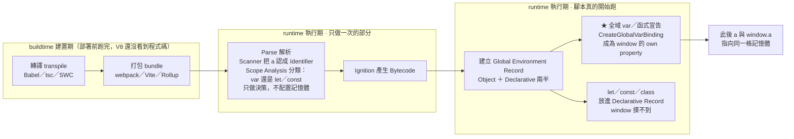

# identifier vs property（簡版）

> [!info]- 📍 承接06，銜接08
> <mark style="background: #ADCCFFA6;">承接</mark>：[[06-靜態檢查vs動態檢查-TS-vs-JS]]是編譯期收尾，這篇是執行期的第一篇——`var`全域宣告在執行期被引擎實作成`window`的property，是識別碼在執行期具體落地的例子。
> <mark style="background: #BBFABBA6;">下一步</mark>：`var`變`window`property只是執行期眾多行為之一；下一篇[[08-函式呼叫核心機制-Execution-Context-與-Parameter-Binding]]講執行期真正的核心機制——Execution Context。

---

## 5W1H 速查：讀本篇之前先把座標定好

> [!important]+ 最常被搞錯的一題先講：<mark style="background: #FF5582A6;">「全域宣告的變數都會掛到 `window` 上」是錯的</mark>
> 只有 <mark style="background: #FFF3A3A6;">`var` 與函式宣告</mark>在全域作用域宣告時，才會被實作成 `window` 的 own property；`let`／`const`／`class` 的全域綁定住在另一個地方（Declarative Environment Record），`window.x` 永遠讀不到，但它們一樣是不折不扣的全域變數。另外，「掛上去」這個動作發生在<mark style="background: #ADCCFFA6;">執行期</mark>——腳本被載入、建立 Global Environment Record 的那一刻，不是你打字的當下，也不是打包的時候。

| 5W1H | 問題 | 一句話答案 |
|---|---|---|
| **What** 是什麼 | identifier 與 property 是什麼關係？ | 同一個 `a` 的兩個層次：identifier 是<mark style="background: #ADCCFFA6;">語法層的角色分類</mark>（原始碼裡用來稱呼它的名字），property 是<mark style="background: #BBFABBA6;">執行期的實作方式</mark>（這個綁定被放成 `window` 的一個 own property）。兩者不衝突、不二選一 |
| **When** 什麼時候 | 什麼時候變成 `window` 的屬性？ | <mark style="background: #FF5582A6;">執行期</mark>。腳本開始跑、引擎建立 Global Environment Record 的那一刻（全域版的 Creation Phase）。Parse 階段只做分類決策，不建立任何綁定 |
| **Who** 誰做的 | 是誰把它掛上去的？ | JS 引擎（V8）依規格的 `GlobalDeclarationInstantiation` 呼叫 `CreateGlobalVarBinding`，寫進宿主提供的全域物件。<mark style="background: #ADCCFFA6;">跟 Babel、跟 webpack 都無關</mark> |
| **Where** 在哪裡 | 綁定實際住在哪？ | Global Environment Record 有兩半：`var`／函式宣告住 **Object Environment Record**（就是 `window` 本體）；`let`／`const`／`class` 住 **Declarative Environment Record**（沒有物件可以摸到它） |
| **Which** 哪一種 | 哪些宣告才會變成屬性？ | 只有<mark style="background: #FFF3A3A6;">全域作用域</mark>的 `var` 與**函式宣告**。函式裡的 `var` 不算、`let`／`const`／`class` 不算、`import` 綁定不算、模組（`type="module"`）頂層的 `var` 也不算 |
| **How** 怎麼做到 | 具體流程是什麼？ | 建立 Global Environment Record（Object ＋ Declarative 兩半）→ 掃出全域的 `var`／函式宣告 → 在 `window` 上開一個 own property → 此後 `a` 與 `window.a` 讀寫的是同一格記憶體 |
| **Why** 為什麼 | 為什麼要這樣設計？ | 歷史包袱。ES1 時代就把全域 `var` 定義成全域物件的屬性；ES6 加入 `let`／`const` 時為了止住這個「全域污染」，才改放進摸不到的 Declarative Record |

### 時間軸：這件事發生在哪一格

```text
◄──────────── buildtime 建置期 ────────────►◄──────── runtime 執行期 ────────────►
        （你的電腦／CI，部署前就跑完）              （瀏覽器或 Node 載入腳本之後）

 ①轉譯          ②打包            ③Parse          ④Bytecode      ⑤腳本開始執行
 transpile      bundle           解析             產生            ↓↓↓↓↓↓↓↓↓↓
 ┌────────┐   ┌────────┐      ┌──────────┐   ┌──────────┐   ┌──────────────────┐
 │Babel   │   │webpack │      │Scanner   │   │Ignition  │   │ 建立 Global       │
 │tsc     │──►│Vite    │─────►│把 a 認成  │──►│把 AST 編成│──►│ Environment      │
 │SWC     │   │Rollup  │      │Identifier│   │Bytecode  │   │ Record           │
 └────────┘   └────────┘      │Scope     │   └──────────┘   ├──────────────────┤
                              │Analysis： │                  │ ★ 全域 var／函式  │
                              │分類這是   │                  │   → 寫成 window   │
                              │var 還是   │                  │     的 own       │
                              │let／const │                  │     property     │
                              └──────────┘                  │ ★ let／const     │
                              每段程式碼只做一次              │   → Declarative  │
                              只做「決策」，                  │     Record       │
                              不配置任何記憶體                │     （摸不到）    │
                                                            └──────────────────┘

 ★ 「a 變成 window.a」站在第 ⑤ 格，不是第 ③ 格，更不是第 ①② 格。
```

同一個 `a` 自己也有一條由早到晚的層次序列：

```text
  層次一 · 語法層 syntax
  ┌──────────────────────────────────────────────┐
  │ 原始碼裡的 a ＝ identifier 識別碼              │
  │ 要合命名規則：開頭限英文字母／_／$，不可用保留字 │
  └───────────────────┬──────────────────────────┘
                      ▼
  層次二 · 編譯期決策 Parse／Scope Analysis
  ┌──────────────────────────────────────────────┐
  │ 認出「這是 var、寫在全域」                     │
  │ 只做分類與決策，此時還沒有任何一格記憶體        │
  └───────────────────┬──────────────────────────┘
                      ▼
  層次三 · 執行期實作 runtime  ★ 本篇主角
  ┌──────────────────────────────────────────────┐
  │ 綁定被真的建立，並被實作成 window 的 own       │
  │ property，此後 a 與 window.a 是同一格記憶體    │
  └──────────────────────────────────────────────┘
```

同一件事用 Mermaid 再畫一次：



> [!warning]- 為什麼這麼多人會把「識別碼」與「屬性」當成互相排斥的兩件事？
> a. <mark style="background: #FFF3A3A6;">因為 `window.a` 真的讀得到值</mark>，很容易腦補成「`a` 被複製了一份到 `window` 上」。其實沒有複製，是<mark style="background: #BBFABBA6;">同一格記憶體的兩種存取路徑</mark>。
> b. <mark style="background: #ADCCFFA6;">因為兩個詞來自不同的描述層</mark>：identifier 是語法規格在講「這個 token 是什麼角色」，property 是執行期規格在講「這個綁定被實作成什麼」。層次不同，本來就不會打架。
> c. <mark style="background: #FF5582A6;">因為 `let` 打破了直覺</mark>：`let b = 1` 明明也是全域變數，`window.b` 卻是 `undefined`，於是有人反推「那 `var` 一定有什麼特別的複製動作」。真相是 `let` 只是被放進另一半 Record 而已。

### 一句話驗證法

想確認某件事在哪一格，問自己：<mark style="background: #BBFABBA6;">「這件事對同一段程式碼做幾次？」</mark>

1. 只做一次 → 屬於 Parse／編譯期（第 ③ ④ 格）

2. 每次執行都重做 → 屬於執行期（第 ⑤ 格）

「把 `var a` 掛上 `window`」顯然是後者：同一份腳本在兩個分頁各載入一次，就有兩個互不相干的 `window.a`。

`var a = 1;` 的 `a`，同時是兩件事，分屬不同層次，不衝突：

- **語法層次**：`a` 是 **identifier**（識別碼）——原始碼裡用來稱呼這個變數的名字，要符合命名規則（開頭限英文字母/`_`/`$`，不可用保留字等）。
- **執行期層次**：只有 `var` 在**全域作用域**宣告時，引擎才會把這個綁定實作成 **`window` 物件的一個 own property**，所以才能用 `window.a` 讀到。`let`/`const` 的全域綁定不會變成 `window` 的 property。

一句話：**identifier 是語法分類（這個名字是什麼角色）；property 是 `var` 全域綁定在執行期的實作方式**，兩者描述同一個 `a`，只是站在不同層次講話。

> 🔗 這裡的「執行期」跟 [[函式呼叫核心機制-Execution-Context-與-Parameter-Binding]] (g) 節講的是同一個「執行期」——都是指 Parse／編譯完成、Bytecode 產生之後，程式碼真正被跑的那個階段（含 Creation Phase、Execution Phase），不是編譯期。

完整版（含命名規則細節、Declarative Environment Record 說明）見 [[字面量-關鍵字-識別碼基礎]]。

---

> [!info]- ➡️ 下一篇
> [[08-函式呼叫核心機制-Execution-Context-與-Parameter-Binding]]——執行期真正的核心機制：每次呼叫函式怎麼建立Execution Context。
