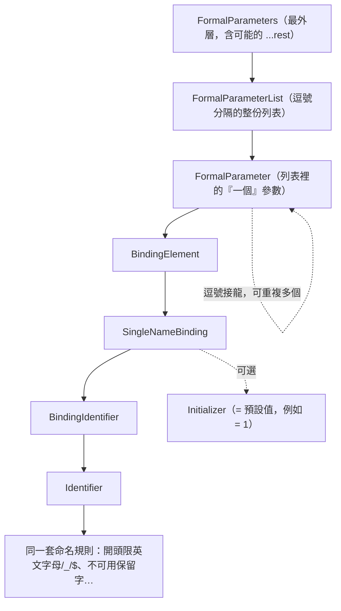
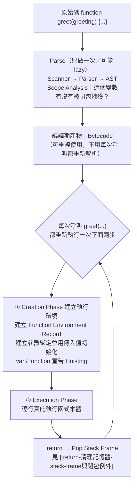

# 函式呼叫核心機制：Execution Context、Creation Phase execution phase與參數綁定

> [!info]- 📍 承接07，銜接09
> <mark style="background: #ADCCFFA6;">承接</mark>：[[07-identifier-vs-property-var全域變數]]是執行期行為的其中一個例子，這篇是執行期的核心機制本身——每次呼叫函式，引擎怎麼建立Execution Context、Creation Phase怎麼運作。
> <mark style="background: #BBFABBA6;">下一步</mark>：Creation Phase做的其中一件事就是Hoisting，下一篇[[09-Hoisting-函式宣告vs函式表達式-TDZ]]專門拆解。

> 本篇重點 (a)–(m)，共 13 個。起點：從 [[閉包-Closure-私有變數與傳址陷阱]] 裡 `createCounter(buttonId)` 的參數討論延伸出來的一連串追問。

## (a) 一般呼叫：括號裡的都是「引數表達式」

```js
foo(a, b);       // a, b 是引數表達式（argument expressions），在呼叫者的 scope 求值
```

`foo` 定義時括號裡的 `function foo(x, y)` 的 `x`、`y` 是**參數（parameter）**；呼叫時 `foo(a, b)` 括號裡的 `a`、`b` 是**引數（argument）**——引數是表達式（Expression，見 [[陳述式-Statement-vs-表達式-Expression]]），會先在呼叫者的 scope 求值出一個值，再拿這個值去初始化被呼叫函式裡全新的參數綁定。

## (b) `greet.call(person, 'Hello')` 算不算引數表達式？——分兩層看

```js
function greet(greeting) {
  console.log(greeting + ', ' + this.name);
}
const person = { name: 'Abby' };
greet.call(person, 'Hello');
```

`greet.call(person, 'Hello')` 本身也是一個函式呼叫——呼叫的是 `Function.prototype.call` 這個方法，所以 `person` 和 `'Hello'` **都是引數表達式沒錯**，都在呼叫當下被求值。但它們流向完全不同的地方：

| 引數 | 流向 | 是不是 `greet` 的 FormalParameter？ |
|---|---|---|
| `person`（第一個引數） | 變成 `greet` 執行時的 **`this` 綁定** | **不是**——`this` 完全不走 `FormalParameterList` 這條文法路徑，是規格另外訂的特殊綁定（`OrdinaryCallBindThis`），跟 [[字面量-關鍵字-識別碼基礎]] 講的 Identifier 命名規則無關，`this` 甚至不是一個合法的變數名稱 |
| `'Hello'`（第二個引數起） | 依序對應到 `greet` 自己宣告的參數（這裡是 `greeting`） | **是**——正常走 (c)(d) 講的參數綁定流程 |

一句話：`call`/`apply`/`bind` 存在的理由，就是因為 `this` **沒有辦法**像一般參數那樣直接在呼叫時用一般語法傳進去（`greet(person, 'Hello')` 沒有意義，`this` 不是 `greet` 參數列表的一員），所以才需要這三個方法提供「手動指定 `this`」的後門。

## (c) 參數綁定是不是「宣告」？——是，而且是每次呼叫都重新做一次的真宣告

函式**被呼叫**的當下（不是定義的當下），引擎執行規格內部的 `FunctionDeclarationInstantiation`：建立一個新的 **Function Environment Record**，把每個參數名稱在裡面建立**綁定（binding）**，並用這次呼叫傳入的引數值去初始化它，這一步做完函式本體才開始執行。

**容易搞混的地方**：引數的「值」可能是呼叫者在別的 lexical scope 早就宣告好的變數（例如 (a) 例子裡的 `a`、`b`）——但這只是說**值的來源**在別處，不代表參數本身不是真宣告。參數這個「綁定」永遠是在**被呼叫函式自己全新的 scope** 裡重新配置出來的一個儲存位置，把呼叫者那個值**複製**（原始值）或**複製參照**（物件）進去，效果上跟 `let greeting = 傳入值` 完全等價，只是引擎自動做、不用你寫關鍵字。這跟 `let x = someOuterVar` 是同一種情況：右手邊的值來自外面，但 `x` 在這裡仍是全新宣告。

## (d) 參數名稱符不符合 Identifier 定義？——符合，文法上是正牌 BindingIdentifier

**先釐清一個常被混用的地方：`FormalParameterList` 跟 `FormalParameter` 不是同一層——是「整體 vs 個別」的關係**，不是同義詞：

- **FormalParameterList**：**整份**參數列表，指 `function foo(a, b, c)` 裡 `a, b, c` 這**一整串**（逗號分開的所有參數合起來）。(e) 講的「簡單／非簡單參數列表」，判定基準就是這一整份 List——只要裡面任何一個參數帶了 default/rest/解構，**整份 List** 就降級為非簡單。
- **FormalParameter**：列表裡的**其中一個**參數項目——`a`、`b`、`c` **各自**是一個 FormalParameter。

完整文法層級（比只寫 `FormalParameter` 開頭更精確一層）：



這條文法路徑跟 [[字面量-關鍵字-識別碼基礎]] 裡 `let x` 的 `x` 是同一種節點（都是 `Identifier`），必須遵守一樣的規則。所以「參數位置不符合 Identifier 定義」的猜測是反的——它是正牌 Identifier，只是「誰來初始化、什麼時候初始化」跟一般變數宣告不同（由呼叫時的引數決定，而不是你手寫在等號右邊的值）。

### 附註：`FormalParameterList` 這個名字，我看得到它的「值」嗎？——看不到，它是規格文字，不是執行期物件

<mark style="background: #FF5582A6;">不行，沒辦法 `console.log(FormalParameterList)`</mark>——`FormalParameterList`／`FormalParameter`／`BindingElement`／`SingleNameBinding` 這些名字，全部都是 **ECMA-262 規格書用來描述文法規則的內部術語**，只存在於 V8 解析你的程式碼那一瞬間（Parse 階段，見 [[V8引擎完整管線-Parse到Deoptimization]]），是「引擎腦內用來判斷語法合不合法」的抽象概念，不是你程式裡可以取用、印出來看的執行期物件——執行期根本沒有一個叫 `FormalParameterList` 的變數或物件存在。

**但有兩種方式可以「看到」它實際對應的東西**：

1. **AST 視覺化工具**（例如 [astexplorer.net](https://astexplorer.net)，貼程式碼進去選 acorn/babel parser）：會把函式參數顯示成 `params` 這個陣列——但注意，工具顯示的節點名稱是 **ESTree**（實際程式碼工具通用的 AST 規範）的命名方式，跟規格書的命名**不一樣**：單純參數是 `Identifier`、有預設值的是 `AssignmentPattern`（`.left` 放名稱、`.right` 放預設值）、rest 參數是 `RestElement`、解構參數是 `ObjectPattern`／`ArrayPattern`。也就是說「FormalParameterList」是規格書講給人類讀的抽象文法名詞，「`params` 陣列」才是 Babel/Acorn 這些真實工具會讓你實際看到的東西——概念相同，命名系統不同。

   **參數列表實際的「長相」**——四種寫法（純參數／預設值／解構／rest）混在同一份參數列表裡：
   ```js
   function foo(a, b = 1, { c, d }, ...rest) {}
   ```
   丟進 astexplorer 之後，`params` 這個陣列長相大致是：
   ```json
   "params": [
     { "type": "Identifier", "name": "a" },

     { "type": "AssignmentPattern",
       "left":  { "type": "Identifier", "name": "b" },
       "right": { "type": "Literal", "value": 1 } },

     { "type": "ObjectPattern",
       "properties": [
         { "type": "Property", "key": { "type": "Identifier", "name": "c" }, "value": { "type": "Identifier", "name": "c" } },
         { "type": "Property", "key": { "type": "Identifier", "name": "d" }, "value": { "type": "Identifier", "name": "d" } }
       ] },

     { "type": "RestElement",
       "argument": { "type": "Identifier", "name": "rest" } }
   ]
   ```
   對照著看：陣列本身（`params`）就是規格書講的 **FormalParameterList**；陣列裡的**每一個項目**（`a`、`b=1`、`{c,d}`、`...rest` 這四個各自）就是規格書講的**一個 FormalParameter**——這就是 (d) 開頭強調的「整體 vs 個別」，在真實工具輸出裡的具體樣子。
2. **`Function.prototype.length`**：唯一一個**真的能在程式裡讀到、反映參數列表資訊的執行期數字**——但它只算「第一個 default/rest/解構參數之前」有幾個單純參數，不是整份列表的完整內容：
   ```js
   function f(a, b, c) {}          console.log(f.length); // 3
   function g(a, b = 1, c) {}      console.log(g.length); // 1 —— 只算到 b 之前，b 開始不算
   function h(a, ...rest) {}       console.log(h.length); // 1 —— rest 也不算進去
   ```
3. **`Function.prototype.toString()`**：會回傳這個函式的**原始碼文字**（含參數列表原始寫法），例如 `f.toString()` 會印出 `"function f(a, b, c) {}"`——這是字串形式的原始文字，不是結構化的 AST 節點，但確實是「看得到參數列表寫了什麼」最直接的方式。

## (e) 參數名稱是不是真的具備唯一性？——規格沒有全面保障（完整版：什麼是「簡單參數列表」）

[[字面量-關鍵字-識別碼基礎]] 裡說「同一個 scope 不能有兩個同名的 `let`/`const` identifier」，但**參數列表是例外**：

| 情境 | 重複參數名稱（如 `function f(a,a)`） |
|---|---|
| 非 strict + 簡單參數列表（無 default/rest/解構） | ✅ 允許，不報錯（歷史遺留，最後一個生效） |
| strict mode | ❌ SyntaxError |
| 非簡單參數列表（用了 default 值/rest/解構，即使非 strict） | ❌ SyntaxError |

```js
function add(a, a) { return a; }
add(1, 2); // 2，合法

function add3(a, a = 1) {} // SyntaxError，即使沒開 strict —— 有 default 值就是「非簡單參數列表」
```

**「簡單參數列表（Simple Parameter List）」精確定義**：列表裡**每一個**參數都必須是單純的 `BindingIdentifier`（見 (d) 文法樹）——沒有 `= 預設值`、不是 `...rest`、不是 `{a,b}`／`[a,b]` 解構。**只要有任何一個參數**帶了預設值、是 rest 參數、或是解構模式，**整份參數列表**就被判定為「非簡單」——不是只有那一個參數受影響，是**整份列表一起降級**：

```js
function a(x, y) {}          // 簡單：兩個都是純 Identifier
function b(x, y = 1) {}      // 非簡單：y 有預設值 → 連 x 也一起算非簡單
function c(x, ...rest) {}    // 非簡單：有 rest 參數
function d({x, y}) {}        // 非簡單：解構模式
```

**先搞懂這三個「現代語法」本身是什麼**（都是 ES6／ES2015 才加進 JS 的功能，在那之前 JS 的參數列表只能寫純變數名稱，沒有下面這幾種寫法）：

- **預設參數（Default Parameters，`= 值`）**：讓你直接在參數列表裡寫「呼叫者沒傳這個引數時，要用什麼預設值」。
  ```js
  function greet(name = 'Guest') {
    console.log('Hello ' + name);
  }
  greet();          // Hello Guest —— 沒傳引數，用預設值
  greet('Abby');    // Hello Abby —— 有傳，蓋掉預設值
  greet(undefined); // Hello Guest —— 明確傳 undefined 也會觸發預設值
  ```
  ES6 之前沒有這個語法，大家只能自己在函式體內手動補：`function greet(name) { name = name || 'Guest'; ... }`——但這種寫法有個經典 bug：如果呼叫者故意傳 `0` 或 `''` 這種 falsy 值，也會被誤判成「沒傳」而被蓋掉，`= 值` 這個新語法就是為了取代這種手動補值、順便修掉這個 bug。

  <mark style="background: #FF5582A6;">澄清一個容易搞混的地方：這個 `name || 'Guest'` fallback 寫法跟 `arguments` 物件完全無關</mark>——`arguments` 是另一個獨立的東西（函式內建、收集全部傳入引數的類陣列物件），這裡只是單純拿參數自己跟預設值做邏輯 OR，兩者只是剛好都跟「參數」沾邊而已。另外要注意這裡**必須是 `||`（邏輯 OR，兩個符號）**，寫成 `|`（位元 OR，一個符號）會先把兩邊轉成 32 位元整數再做位元運算，結果完全不是你要的東西。

  **這個 bug 觸發時，會是 TypeError 還是 SyntaxError？——都不是，完全不會報錯**，這是最反直覺的地方：
  ```js
  function greet(name) {
    name = name || 'Guest';
    console.log(name);
  }
  greet(0);     // 印出 "Guest"，不是 0
  greet('');    // 印出 "Guest"，不是空字串
  greet(false); // 印出 "Guest"，不是 false
  ```
  `0`／`''`／`false` 都是呼叫者**合法傳入**的值，只是剛好是 falsy（JS 裡只有 `0`、`''`、`false`、`null`、`undefined`、`NaN` 這六個值算 falsy），`||` 看到左邊 falsy 就直接換成右邊——這個過程**沒有型別不符（不會 TypeError）、也沒有語法問題（不會 SyntaxError）**，JS 就是安靜地算出一個「技術上合法、但不是你要的」值，繼續往下跑，畫面上不會有任何紅字。這是一個**靜默的邏輯 bug**，不是語言層級會攔下來的錯誤——正是這種「看起來沒事、實際上錯了」的特性，讓 ES6 決定另外設計 `= 值` 這個只認 `undefined`（不理會其他 falsy 值）的專屬語法來取代它。

- **解構（Destructuring，`{a, b}` 或 `[a, b]`）**：讓你直接把一個物件的屬性、或陣列的元素，「拆開」變成獨立的區域變數，不用每次手寫 `obj.屬性名稱`。
  ```js
  // 物件解構
  const person = { name: 'Abby', age: 25 };
  const { name, age } = person;      // 等同於 const name = person.name; const age = person.age;

  // 陣列解構
  const arr = [1, 2, 3];
  const [a, b] = arr;                // a = 1, b = 2

  // 直接寫在參數列表裡（本篇 (e) 例子 d 的情境）
  function printUser({ name, age }) {
    console.log(name, age);
  }
  printUser(person);                 // 不用在函式體內再寫 user.name、user.age
  ```

- **Rest 參數（`...名稱`）**：把「呼叫時多傳進來、參數列表裡沒對應到名字的那些引數」全部收集成一個**真正的陣列**。
  ```js
  function sum(...nums) {            // 不管呼叫時傳幾個引數，全部收進 nums 這個陣列
    return nums.reduce((a, b) => a + b, 0);
  }
  sum(1, 2, 3); // 6

  function f(a, b, ...rest) {}
  f(1, 2, 3, 4, 5); // a=1, b=2，rest=[3, 4, 5] —— rest 只收「命名參數以外」多出來的部分
  ```
  ES6 之前只能用 `arguments` 這個「類陣列物件」——差異有兩點：① `arguments` **不是真正的 Array**，沒有 `.map`/`.reduce` 這些陣列方法，要用還得先手動轉換（`Array.from(arguments)`）；② `arguments` 會**包含全部引數**（連被命名參數接住的也算在內），rest 參數只收「命名參數接不到、多出來的那一截」。
  <mark style="background: #FF5582A6;">Rest 參數有兩條硬性文法限制</mark>：**必須是參數列表裡的最後一個**（`function f(...args, b) {}` 直接 SyntaxError，因為 rest 之後不可能再有其他參數可以接東西）；而且**不能自己再帶預設值**（`function f(...args = []) {}` 也是 SyntaxError）。

三者共同點：**都是 ES6（2015 年）才加進語言的新語法**，跟 ES5 及更早（1997–2009）「參數只能是單純變數名稱」的舊寫法形成對比——這就是 (e) 結論裡「現代語法」這個說法的來源。

**這個「簡單 / 非簡單」的判定，同時決定三件表面上看起來不相關的事**：

1. **重複參數名稱是否合法**（上面表格）——非 strict + 簡單參數列表才允許重複；strict mode 或非簡單參數列表一律 SyntaxError。
2. **`arguments` 物件是不是「mapped」**：非 strict 模式下，**簡單參數列表**的函式會建立一個 **mapped arguments object**——`arguments[0]` 跟第一個參數變數是**連動**的，改其中一個另一個也跟著變；**非簡單參數列表**（或 strict mode）一律得到 **unmapped arguments object**——`arguments` 只是傳入值的獨立快照，跟參數變數各自獨立：
   ```js
   function mapped(a) { arguments[0] = 99; console.log(a); }
   mapped(1); // 99 —— 簡單參數列表，mapped，連動

   function unmapped(a = 0) { arguments[0] = 99; console.log(a); }
   unmapped(1); // 1 —— a=0 讓它變非簡單參數列表，unmapped，各自獨立
   ```
3. **函式體內能不能寫 `"use strict"`**：<mark style="background: #FF5582A6;">非簡單參數列表的函式，函式體裡完全不能寫 `"use strict"` 指令，會直接 SyntaxError</mark>——即使你根本沒打算讓這個函式變 strict mode，光是「非簡單參數列表 + 函式體內的 use strict 指令」這個組合本身就是語法錯誤：
   ```js
   function sum(a = 1, b = 2) {
     "use strict"; // SyntaxError: 'use strict' 不允許用在有預設參數的函式裡
     return a + b;
   }
   ```
   來源：[MDN Strict mode](https://developer.mozilla.org/en-US/docs/Web/JavaScript/Reference/Strict_mode)

一句話：「簡單參數列表」是規格拿來當**共同判斷基準**的一個布林值，同時決定了唯一性檢查、`arguments` 物件行為、能不能宣告 strict mode 這三件事——底層邏輯一致：只要參數列表用了 default／rest／解構這些「現代」語法，V8 就把整個函式當成**天生該遵守較嚴謹規則**的程式碼，不再套用 ES5 以前那些寬鬆的舊行為。這段延伸自 [[閉包-Closure-私有變數與傳址陷阱]] 裡最早提到「簡單參數列表」的地方，回去看可以對照原始情境。

## (f) 函式被呼叫的當下，是已經 Parse 過了，還是正在 Parse？——已經 Parse 過了

Parse（[[V8引擎完整管線-Parse到Deoptimization]] 裡 Scanner→Parser→AST→Scope Analysis 那一段）對**每個函式只做一次**（V8 甚至會 lazy parsing：外層先粗略掃過，內層函式本體真正完整解析可能延到第一次被呼叫前才補做）。**函式一旦真的開始被呼叫執行，代表它那段語法必然已經解析完成**——引擎不可能一邊解析語法一邊執行、卻不知道參數列表長怎樣。

## (g) Creation Phase 是編譯期還是執行期？——執行期，而且每次呼叫都重來一次

這是最容易搞混的分界。每次呼叫函式，都會建立一個全新的 Execution Context，分兩個小階段：



- **Parse**（B）＝**編譯期**，對同一個函式只做一次，產出可重複使用的 Bytecode。
- **Creation Phase + Execution Phase**（E、F）＝**執行期**，函式被呼叫幾次就重做幾次——每次呼叫都是全新的參數綁定、全新的 hoisting，彼此互不干擾（這正是 `createCounter('counter1')`、`createCounter('counter2')` 能各自獨立計數的底層原因）。

一句話回答你的問題：**Hoisting／參數綁定發生在 Creation Phase，而 Creation Phase 屬於執行期，不是編譯期**——即使 V8 的 lazy parsing 讓「編譯」跟「第一次執行」在時間上看起來緊貼在一起，規格上它們仍是兩個獨立步驟：Parse 只做一次；Creation Phase 每次呼叫都重新做。

## (h) 「編譯」跟「翻譯」這兩個詞的糾結，一次講清楚

- **編譯（Compile）**：把原始碼轉成另一種可重複執行的表示法，這個動作本身不執行程式。JS 的 Parse（AST）與 Ignition 把 AST 轉成 Bytecode，都是「編譯」這個大類底下的步驟，且都只做一次。
- **翻譯／直譯（Interpret）**：拿到已編譯好的 Bytecode，**真的執行**它——Ignition 逐條讀 Bytecode、當場解讀成實際動作（有些人愛用「翻譯」形容這個逐條解讀的動作），這件事發生在**每一次**執行時，不是編譯時。
- 所以「編譯期 vs 執行期」的正確分法：**編譯期＝ Parse ＋ Bytecode 產生（一次性）；執行期＝ Ignition 真正跑 Bytecode（含 Creation Phase 與 Execution Phase，每次呼叫都重來）**。V8 的 lazy compilation 只是把「編譯」這一次性動作延後到「第一次被呼叫前」才做，讓兩者在時間點上很靠近，但邏輯上仍是先編譯完、才能開始執行。

## (i) 「對變數環境做宣告與初始化」是不是靠 RAM 達成？——是，這不是比喻

[[V8引擎完整管線-Parse到Deoptimization]] 裡 Scope Analysis 那段已經寫到分岔點，這裡直接對應到記憶體實作：

- 參數**沒有被內層閉包捕獲** → 引擎判定可以放在**快速的 Stack／CPU 暫存器**槽位，函式一 return 就直接釋放（對照 [[return-清理記憶體-stack-frame與閉包例外]]）。
- 參數**有被閉包捕獲**（例如 `createCounter(buttonId)` 內層事件監聽器還要繼續用它）→ 引擎把它配置在**Heap 上的 Context 物件**裡，讓閉包在外層函式返回後還能繼續抓著它，直到沒人引用才被 GC 回收。

也就是說「建立綁定並初始化」具體做的事，就是**在 RAM 裡（Stack 或 Heap 其中一種）分配一塊儲存位置，並把值寫進去**——跟 [[傳值vs傳址-賦值與記憶體空間]] 講的賦值機制是同一套底層邏輯，只是這次是「引擎自動幫你分配」而不是你手寫 `let`。

## (j) 專案真實案例：哪裡是「宣告」、哪裡是「接住」

**宣告現場**——`futuresign.official_website/src/pages/EventDiscountCodesPage.tsx`：

```tsx
function EventDiscountCodesPageContent() {
  const router = useRouter()
  const params = useParams()
  const eventId = params.id          // ← 這裡是真宣告：const 綁定，值來自路由參數
  ...
  const loadEventData = async () => {
    if (!eventId) return
    const event = await eventsApi.getEventById(eventId)   // ← 引數表達式：把 eventId 的值傳出去
    ...
  }
}
```

**接住現場**——`futuresign.official_website/src/lib/api/events.ts`：

```ts
async getEventById(id: string, locale?: string): Promise<Event> {
  const query = locale && locale !== 'zh-TW' ? `?locale=${locale}` : ''
  return apiClient.get<Event>(`/events/${id}${query}`)   // ← id 是全新綁定，只是接住 eventId 傳來的值
},
```

對照三層：`params.id`（原始資料來源）→ `eventId`（呼叫端的 `const` 宣告，(a) 講的引數表達式的求值來源）→ `id`（被呼叫端 `getEventById` 的參數，(c) 講的全新綁定，只是「表明我要接住呼叫者傳來的這個值，而且我內部要叫它 `id`」）。三個名字都合法，因為它們活在三個不同的 scope，彼此不衝突。

## (m) 只要是小括弧都是引數表達式嗎？——不是，`()` 在 JS 文法裡身兼多職

(a) 講的「括號裡都是引數表達式」只在**呼叫式（CallExpression）**這個特定場合成立。同樣是 `()`，在別的文法產生式裡完全是不同角色：

| `()` 出現的地方 | 例子 | 屬於哪個文法產生式 | 裡面是引數表達式嗎？ |
|---|---|---|---|
| 呼叫式 | `foo(a, b)` | `CallExpression → MemberExpression Arguments` | ✅ 是——`Arguments` 產生式裡的東西 |
| 函式定義的參數列表 | `function foo(x, y) {}`、箭頭函式 `(x, y) => x+y` | `FormalParameters`（見 (d) 的文法樹） | ❌ 不是，是**參數宣告**，不是引數 |
| 純分組（提升優先權） | `(1 + 2) * 3` | Grouping Operator，跟任何呼叫都無關 | ❌ 不是，只是告訴 Parser「先算這裡面」 |
| 控制流程關鍵字語法 | `if (x)`、`while (x)`、`for (i=0;...)`、`switch (x)`、`catch (e)` | 各自語句自己的產生式（`IfStatement`、`ForStatement`…），`()` 是該語句語法規定的一部分 | ❌ 不是，這是條件/例外變數，不是函式引數 |
| IIFE 的雙層括號 | `(function(){ ... })()` | 外層＝Grouping（把函式表達式包起來避免被誤判成宣告）；內層＝`Arguments` | 外層 ❌ 不是；內層 ✅ 是（這裡剛好是空的） |

一句話：**只有緊跟在「被呼叫的東西」（callee）後面、屬於 `CallExpression`／`Arguments` 這個文法節點的括號，裡面才是引數表達式**；其他地方的 `()` 是參數宣告、分組運算子，或某個語句自己規定要有的語法配件，跟「呼叫、傳引數」這件事完全無關——判斷方式不是看有沒有括號，是看**這對括號屬於哪個文法產生式**。

**容易誤會的地方：`if (x)` 表格答案是「❌ 不是」，不代表 `x` 不是表達式**——`x` 仍然百分之百是表達式（見 [[陳述式-Statement-vs-表達式-Expression]]，它必須求值出一個真假值才能讓 `if` 判斷要不要進 if 分支）。「❌ 不是」回答的是另一個更窄的問題：**這對括號屬不屬於 `CallExpression`／`Arguments` 這個文法節點**——`if` 不是函式、沒有 callee、沒有在「呼叫」誰，`if (Expression)` 裡的括號是 `IfStatement` 這個語句自己文法規定要有的配件（規格寫死 `IfStatement : if ( Expression ) Statement`），跟 `Arguments` 是完全不同的產生式，只是恰好都要求裡面放一個表達式。

**`if (x = 5)` 這種常見寫法（通常是把 `===` 打成 `=` 的手誤）剛好證明這一點，而不是反例**：`x = 5` 是合法的 `AssignmentExpression`（見 [[陳述式-Statement-vs-表達式-Expression]] (c)），而 `IfStatement` 的文法規定括號裡放「任何 Expression」都合法，賦值表達式當然算——所以 `if (x = 5)` 不會報錯，只會靜靜把 `5` 賦值給 `x`、然後拿 `5`（truthy）去判斷進不進分支。這證明的是「`if(...)` 的括號吃任何表達式，包括賦值表達式」，跟它算不算 `CallExpression` 的 `Arguments`是兩回事——`if` 從頭到尾都不是在呼叫函式、傳引數。

## (k)(l) 圖已內嵌於 (d)、(g)，互動版可 hover 每個節點

FormalParameterList 文法樹見上面 (d)；Execution Context 的 Creation/Execution 兩階段流程圖見上面 (g)。**互動版**（滑鼠移到 `FormalParameter`／`BindingElement`／`SingleNameBinding`／`BindingIdentifier`／`Initializer` 每個節點上都會彈出白話解釋，另外還有 (m) 括號角色對照表的互動版）見同資料夾 `函式呼叫核心機制-Execution-Context-與-Parameter-Binding.html`。延伸閱讀官方文件：[ECMA-262 Destructuring Binding Patterns](https://tc39.es/ecma262/#sec-destructuring-binding-patterns)（FormalParameter/BindingElement 的完整文法定義）、[MDN Default parameters](https://developer.mozilla.org/en-US/docs/Web/JavaScript/Reference/Functions/Default_parameters)（Initializer 的實際行為）。

## 對照總結

| 問題 | 答案 |
|---|---|
| 參數是不是宣告？ | 是，且是每次呼叫都重做一次的真宣告（FunctionDeclarationInstantiation） |
| 參數名稱是不是 Identifier？ | 是，文法上是 `BindingIdentifier` |
| 參數名稱唯一性有保障嗎？ | 沒有全面保障，看 strict mode／simple parameter list |
| 什麼是簡單參數列表？ | 每個參數都是純 Identifier，沒有 default/rest/解構；只要有一個不是，整份列表變非簡單 |
| 簡單/非簡單參數列表還影響什麼？ | `arguments` 物件是 mapped 還是 unmapped、函式體內能不能寫 `"use strict"` |
| Creation Phase 是編譯期還是執行期？ | 執行期，每次呼叫都重來；Parse 才是只做一次的編譯期 |
| 是不是靠 RAM 實現？ | 是，Stack（快、無閉包）或 Heap Context（有閉包捕獲） |
| `this`（如 `.call` 第一引數）算不算參數？ | 不算，`this` 不走 FormalParameterList，是規格另外的特殊綁定 |
| 只要是小括弧都是引數表達式嗎？ | 不是，只有 `CallExpression`／`Arguments` 產生式裡的括號才是；參數宣告、分組運算子、`if`/`while`/`for` 等控制流程語法的括號都不是 |

---

> [!info]- ➡️ 下一篇
> [[09-Hoisting-函式宣告vs函式表達式-TDZ]]——Creation Phase裡的Hoisting跟TDZ怎麼運作。
