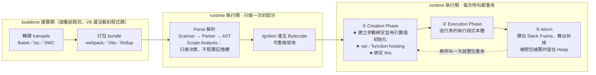
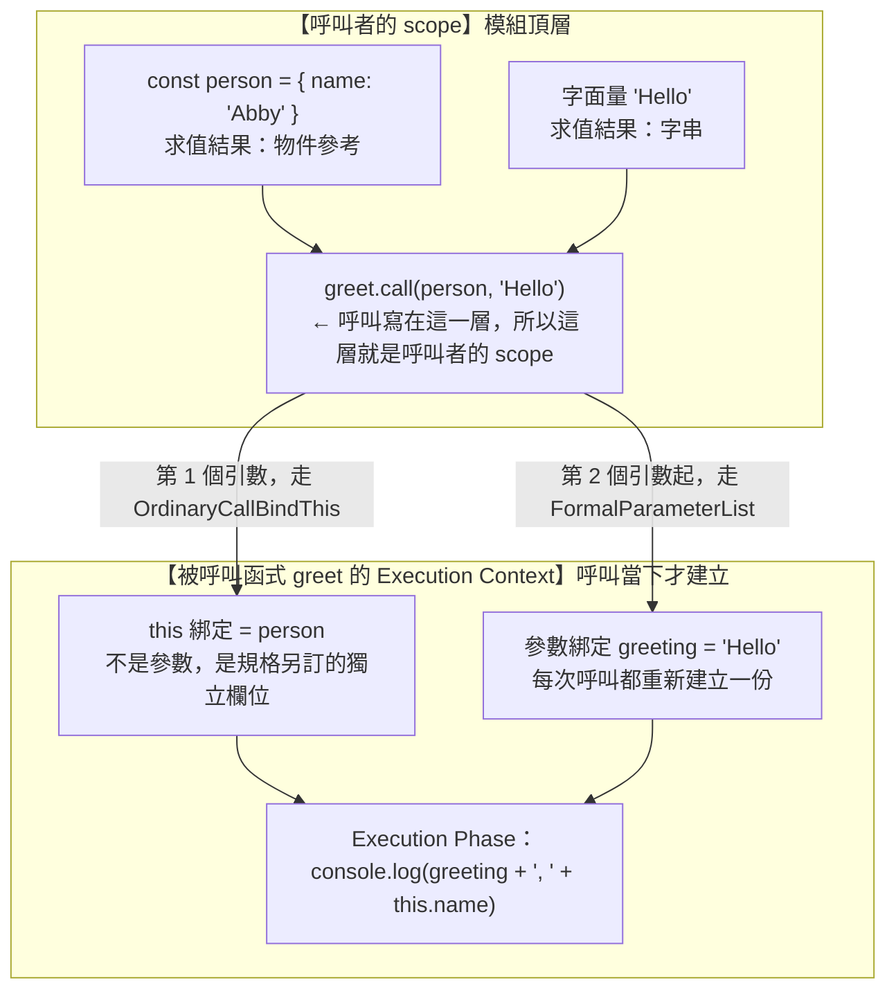
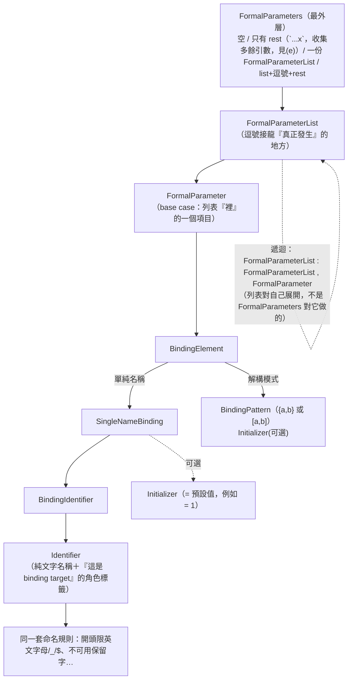
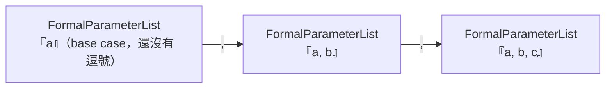
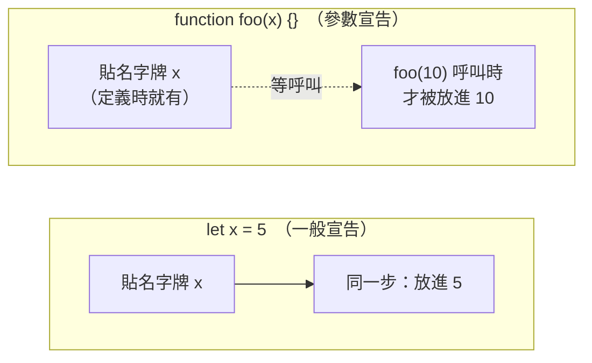
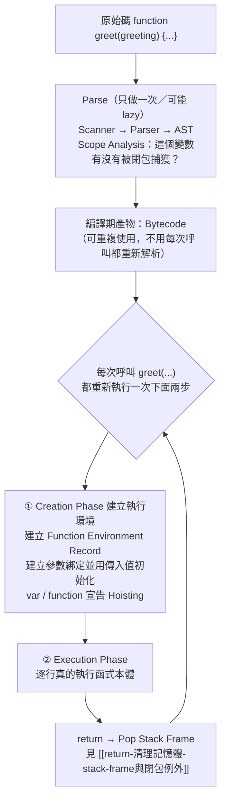

# 函式呼叫核心機制：Execution Context、Creation Phase execution phase與參數綁定

> [!info]- 📍 承接07，銜接09
> <mark style="background: #ADCCFFA6;">承接</mark>：[[07-identifier-vs-property-var全域變數]]是執行期行為的其中一個例子，這篇是執行期的核心機制本身——每次呼叫函式，引擎怎麼建立Execution Context、Creation Phase怎麼運作。
> <mark style="background: #BBFABBA6;">下一步</mark>：Creation Phase做的其中一件事就是Hoisting，下一篇[[09-Hoisting-函式宣告vs函式表達式-TDZ]]專門拆解。

> 本篇重點 (a)–(m)，共 13 個。起點：從 [[閉包-Closure-私有變數與傳址陷阱]] 裡 `createCounter(buttonId)` 的參數討論延伸出來的一連串追問。

---

## 5W1H 速查：讀本篇之前先把座標定好

> [!important]+ 最常被問錯的一題先講：<mark style="background: #FF5582A6;">參數綁定**不是**在 buildtime 的 Parse 階段發生</mark>
> 它發生在 **runtime（執行期）的 Creation Phase**，而且**每次呼叫都重來一次**。Parse 只做一次、而且只做「決策」，真正在記憶體裡挖格子寫值的是 Creation Phase。下面的時間軸把這條界線畫出來。

| 5W1H | 問題 | 一句話答案 |
|---|---|---|
| **What** 是什麼 | Execution Context 是什麼？參數綁定是什麼？ | Execution Context 是引擎每次呼叫函式時在記憶體裡搭起來的一座臨時舞台；參數綁定是「參數名字」與「一塊記憶體位置」的對應關係 |
| **When** 什麼時候 | 是 buildtime 的 Parse 階段嗎？ | <mark style="background: #FF5582A6;">不是</mark>。Parse 屬於編譯期、每個函式只做一次；參數綁定屬於**執行期的 Creation Phase**，呼叫幾次就做幾次 |
| **Who** 誰做的 | 是誰建立這些綁定？ | JS 引擎（V8）自動做的。規格上對應的抽象操作叫 `FunctionDeclarationInstantiation`。<mark style="background: #ADCCFFA6;">跟打包工具、跟 React 都無關</mark> |
| **Where** 在哪裡 | 綁定實際存在哪？ | 在 RAM 裡。沒被閉包捕獲 → **Stack Frame／CPU 暫存器**；被捕獲 → **Heap 上的 Context 物件** |
| **Which** 哪一種 | 括號裡的東西哪些算參數？ | 只有走 `FormalParameterList` 的才算。`this`（`.call` 的第一引數）**不算**；`if (x)` 與 `(a+b)` 的括號也不是引數表達式 |
| **How** 怎麼做到 | 一次呼叫的完整流程？ | 建立 Execution Context → Creation Phase（建 Environment Record、建參數綁定並初始化、hoisting）→ Execution Phase（逐行執行）→ `return` 彈出 Stack Frame |
| **Why** 為什麼 | 為什麼要每次呼叫都重建？ | 因為要讓同一段程式碼被呼叫無數次而互不干擾。遞迴、閉包、React 每次 render 拿到獨立的 props，全部靠這件事 |

### 時間軸：從 buildtime 到 runtime，參數綁定站在哪一格

```text
◄──────────── buildtime 建置期 ────────────►◄──────── runtime 執行期 ────────────►
        （你的電腦／CI，部署前就跑完）              （瀏覽器或 Node 載入腳本之後）

 ①轉譯          ②打包            ③Parse          ④Bytecode      ⑤每次呼叫都重來
 transpile      bundle           解析             產生            ↓↓↓↓↓↓↓↓↓↓
 ┌────────┐   ┌────────┐      ┌──────────┐   ┌──────────┐   ┌──────────────────┐
 │Babel   │   │webpack │      │Scanner   │   │Ignition  │   │ Creation Phase   │
 │tsc     │──►│Vite    │─────►│Parser    │──►│把 AST 編成│──►│ ★ 建立參數綁定    │
 │SWC     │   │Rollup  │      │AST       │   │Bytecode  │   │ ★ 用引數值初始化   │
 │TSX→JS  │   │合併壓縮 │      │Scope     │   │          │   │ ★ var/function    │
 └────────┘   └────────┘      │Analysis  │   └──────────┘   │   hoisting        │
                              └──────────┘                  ├──────────────────┤
                              每個函式只做一次                │ Execution Phase  │
                              （V8 還可能 lazy parse）        │   逐行真的執行    │
                                    │                        ├──────────────────┤
                                    │                        │ return → 彈 Stack │
                              只做「決策」：                   │ Frame，舞台拆掉   │
                              這個變數會不會被                 └────────┬─────────┘
                              閉包捕獲？→ 決定                          │
                              要配置在 Stack 還是 Heap                  └─► 再呼叫一次
                                                                          就整包重來

 ★ 參數綁定站在第 ⑤ 格，不是第 ③ 格。
```

同一件事用 Mermaid 再畫一次：



> [!warning]- 為什麼這麼多人會誤以為參數綁定在 Parse 階段？三個原因
> a. <mark style="background: #FFF3A3A6;">V8 的 lazy parsing 讓兩者在時間上黏得很近</mark>：內層函式的完整 Parse 可能被延到「第一次被呼叫前」才做，於是「編譯」跟「第一次執行」幾乎同時發生，看起來像同一件事。但規格上它們是兩個獨立步驟：Parse 只做一次，Creation Phase 每次呼叫都重做。
> b. <mark style="background: #ADCCFFA6;">Scope Analysis 確實在 Parse 階段就「看到」了參數</mark>，容易被誤讀成「已經建立好了」。但它做的是**決策**（這個變數會不會被閉包捕獲？該放 Stack 還是 Heap？），不是**執行**（真的在 RAM 挖一塊位置、把值寫進去）。決策一次就夠，執行每次都要。
> c. <mark style="background: #BBFABBA6;">「編譯」這個詞被兩邊共用</mark>：buildtime 的 Babel／tsc 做的是**轉譯 transpile**（高階→高階），runtime 的 V8 做的才是**編譯 compile**（AST→Bytecode→機器碼）。用詞約定見 [[03-前端開發工具-打包轉譯Lint與Parser-【打包buildtime】|03-前端開發工具（打包 buildtime）]]，完整管線見 [[04-V8引擎完整管線-Parse到Deoptimization-【編譯runtime】|04-V8引擎完整管線（編譯 runtime）]]。

### 一句話驗證法

想確認某件事在哪一格，問自己：<mark style="background: #BBFABBA6;">「這件事對同一個函式做幾次？」</mark>

1. 只做一次 → 屬於 Parse／編譯期（第 ③ ④ 格）

2. 呼叫幾次就做幾次 → 屬於執行期（第 ⑤ 格）

參數綁定顯然是後者：`greet('Hi')` 呼叫三次，就有三組互不相干的 `greeting` 綁定。

---

## (a) 一般呼叫：括號裡的都是「引數表達式」

```js
foo(a, b);       // a, b 是引數表達式（argument expressions），在呼叫者的 scope 求值
```

`foo` 定義時括號裡的 `function foo(x, y)` 的 `x`、`y` 是**參數（parameter）**；呼叫時 `foo(a, b)` 括號裡的 `a`、`b` 是**引數（argument）**——引數是表達式（Expression，見 [[陳述式-Statement-vs-表達式-Expression]]），會先在呼叫者的 scope 求值出一個值，再拿這個值去初始化被呼叫函式裡全新的參數綁定。

### (a-1) 「呼叫者的 scope」到底是指哪一段？

先給定義：<mark style="background: #BBFABBA6;">**呼叫者的 scope（caller scope）＝ 寫出「呼叫這一行」的那段程式碼所在的作用域**</mark>。引數表達式在這裡被求值，而且求值時機在<mark style="background: #FF5582A6;">被呼叫函式的 Execution Context 還沒建立之前</mark>——換句話說，引數的值是「外面算好了才送進去」，不是「進去以後才算」。

#### 例一：故意用同名變數，一眼看出是誰的 scope

```js
const label = '模組頂層的 label';

function greet(label) {          // ← 這個 label 是「被呼叫函式」自己的參數綁定
  console.log(label);
}

function caller() {
  const label = '呼叫者的 label'; // ← caller 函式自己的區域變數
  greet(label);                  // ← 這個 label 在「caller 的 scope」求值
}

caller();   // 印出：呼叫者的 label
```

整段翻成中文：

「我在模組最外層宣告一個叫 `label` 的常數。接著宣告函式 `greet`，它有一個同樣叫 `label` 的參數——這個 `label` 屬於 `greet` 自己，跟外面那個毫無關係。再宣告一個函式 `caller`，裡面又宣告一個區域的 `label`。`caller` 裡呼叫 `greet(label)` 時，括號裡那個 `label` 要用哪一個？答案是**沿著 `caller` 自己的作用域鏈往上找**，第一個找到的就是 `caller` 內部那個，所以求值結果是字串 `'呼叫者的 label'`。這個字串被送進 `greet`，初始化 `greet` 的參數綁定。」

<mark style="background: #FFF3A3A6;">關鍵：判斷「呼叫者的 scope」是誰，看的是**這一行呼叫寫在哪裡**，不是被呼叫的函式定義在哪裡</mark>。這裡呼叫寫在 `caller` 裡，所以呼叫者的 scope 就是 `caller` 的作用域。

#### 例二：用 (b) 節的 `greet.call(person, 'Hello')` 標出兩段

```js
function greet(greeting) {                     // ─┐ 被呼叫函式（callee）的 scope
  console.log(greeting + ', ' + this.name);    //  │ greeting 與 this 都住在這裡
}                                              // ─┘

const person = { name: 'Abby' };               // ─┐ 呼叫者的 scope（這裡是模組頂層）
greet.call(person, 'Hello');                   // ─┘ person 與 'Hello' 都在這一層求值
```

用箭頭把「誰在哪裡被求值、被送到哪裡」畫出來：

```text
                        【 呼叫者的 scope 】＝ 模組頂層（寫出呼叫那一行的地方）
                        ┌──────────────────────────────────────────────┐
                        │  const person = { name: 'Abby' };            │
                        │                                              │
                        │  greet.call( person , 'Hello' );              │
                        └──────────────┬──────────┬────────────────────┘
                                       │          │
              兩個引數都在這一層先求值   │          │
              （此時 greet 的舞台還沒搭）│          │
                                       │          │
                    求值成 { name:'Abby' }      求值成 'Hello'
                                       │          │
                                       ▼          ▼
                        ┌──────────────────────────────────────────────┐
                        │  【 被呼叫函式 greet 的 Execution Context 】   │
                        │                                              │
                        │   this  ◄────────────┘（走 OrdinaryCallBindThis，
                        │                        不是 FormalParameterList）
                        │                                              │
                        │   greeting  ◄─────────┘（走正常參數綁定）      │
                        │                                              │
                        │   函式本體開始執行：console.log(...)           │
                        └──────────────────────────────────────────────┘
```

同一件事用 Mermaid 再畫一次（可 hover、可縮放）：



#### 時間順序（這是最容易被跳過的一段）

a. 引擎讀到 `greet.call(person, 'Hello')` 這一行時，**還在呼叫者的 Execution Context 裡**。

b. 在這裡把 `person` 這個識別碼沿著作用域鏈解析出來，拿到那個物件的參考；把 `'Hello'` 這個字面量求值成字串。

c. <mark style="background: #ADCCFFA6;">到這一步為止，`greet` 的 Execution Context **完全還不存在**</mark>。

d. 引數都備妥之後，引擎才建立 `greet` 的 Execution Context，進入 Creation Phase（見 (g)）：建立 `greeting` 的綁定並用 `'Hello'` 初始化、把 `this` 綁定設成 `person`。

e. 然後才進入 Execution Phase，真的跑函式本體。

<mark style="background: #FF5582A6;">所以「引數在呼叫者的 scope 求值」不是文縐縐的說法，它是有實際後果的</mark>：如果引數表達式裡用到某個變數，那個變數必須在**呼叫的那一行看得到**才行；被呼叫函式內部有沒有同名變數，完全不影響。這也是為什麼 `greet(x)` 傳的是「`x` 現在的值」，而不是「`x` 這個變數本身」——對照 [[傳值vs傳址-賦值與記憶體空間]]。


## (b) `greet.call(person, 'Hello')` 算不算引數表達式？——分兩層看

```js
function greet(greeting) {
  console.log(greeting + ', ' + this.name);
}
const person = { name: 'Abby' };
greet.call(person, 'Hello');
```

`greet.call(person, 'Hello')` 本身也是一個函式呼叫——呼叫的是 `Function.prototype.call` 這個方法，所以 `person` 和 `'Hello'` **都是引數表達式（Expression，見 [[陳述式-Statement-vs-表達式-Expression]]）沒錯**，都在呼叫當下被求值。但它們流向完全不同的地方：

| 引數 | 流向 | 是不是 `greet` 的 FormalParameter？ |
|---|---|---|
| `person`（第一個引數） | 變成 `greet` 執行時的 **`this` 綁定** | **不是**——`this` 完全不走 `FormalParameterList` 這條文法路徑，是規格另外訂的特殊綁定（`OrdinaryCallBindThis`），跟 [[字面量-關鍵字-識別碼基礎]] 講的 Identifier 命名規則無關，`this` 甚至不是一個合法的變數名稱 |
| `'Hello'`（第二個引數起） | 依序對應到 `greet` 自己宣告的參數（這裡是 `greeting`） | **是**——正常走 (c)(d) 講的參數綁定流程 |

一句話：`call`/`apply`/`bind` 存在的理由，就是因為 `this` **沒有辦法**像一般參數那樣直接在呼叫時用一般語法傳進去（`greet(person, 'Hello')` 沒有意義，`this` 不是 `greet` 參數列表的一員），所以才需要這三個方法提供「手動指定 `this`」的後門。

### (b-1) React 裡的 `this`：函式元件其實沒有 `this`，但有一個東西在扮演它

先直球處理一個很常見的記憶偏差：<mark style="background: #FF5582A6;">「React 已經有 `this`，只是被隱藏起來了」——方向對，但名字不對</mark>。確實有一個「代表這次是哪個元件實例」的東西被藏在背後，但它不是語言層的 `this` 綁定，而是 React 自己的資料結構 fiber。分三種情況講清楚。

#### 一、Class component：`this` 是真的存在，而且很明目張膽

React 用 `new YourComponent(props, context)` 建立實例，之後呼叫 `instance.render()`。<mark style="background: #BBFABBA6;">這是**方法呼叫**（method call），所以引擎自動把 `this` 綁定成那個實例</mark>，`this.props`、`this.state`、`this.setState` 全部從這裡來。

但正因為 `this` 是「呼叫當下才決定」（這就是 (b) 節「`this` 不走 `FormalParameterList`」的直接後果），一旦你把方法**當成值傳出去**：

```jsx
<button onClick={this.handleClick}>切換</button>
```

翻成中文：「我把 `this.handleClick` 這個**函式物件本身**取出來，當成 `onClick` 這個 prop 的值傳給 `button`。取出來的瞬間，它跟 `this` 的關係就斷了——之後 React 呼叫它時是一般函式呼叫，不是方法呼叫，`this` 會是 `undefined`。」

所以才要在 constructor 寫 `this.handleClick = this.handleClick.bind(this)`，或改用 class field 箭頭函式（箭頭函式沒有自己的 `this`，會沿用定義當下的詞法 `this`）。

補一個 Dan Abramov 的重點：<mark style="background: #FFF3A3A6;">class 的 `this.props` 是**同一個實例上會被 React 改寫的欄位**</mark>，所以非同步回呼裡讀 `this.props` 讀到的永遠是最新值；函式元件讀的則是被閉包捕獲的「那一次 render 的 props」，是快照。這是兩者行為差異的根源。

#### 二、函式元件：`this` 是 `undefined`，不是被藏起來

React 原始碼 `packages/react-reconciler/src/ReactFiberHooks.js` 的 `renderWithHooks` 裡，真正呼叫你元件的那一行是：

```js
children = __DEV__
  ? callComponentInDEV(Component, props, secondArg)
  : Component(props, secondArg);
```

翻成中文：「開發模式下走一個包了一層除錯資訊的 `callComponentInDEV`，正式版就直接 `Component(props, secondArg)`。」

重點在後面那個寫法：<mark style="background: #ADCCFFA6;">它是**一般函式呼叫**——沒有接收者（沒有 `obj.method()` 的那個 `obj`）、也沒有 `.call()` 指定</mark>。而 ES Module 的程式碼一律是 strict mode，strict mode 下一般函式呼叫的 `this` 是 `undefined`（非 strict 才會被塞成 `globalThis`）。所以函式元件本體裡的 `this` 就是 `undefined`。

JSX 也幫不上忙：`<Foo bar={1} />` 會被轉譯成 `_jsx(Foo, { bar: 1 })`，`Foo` 是被當成**值**傳進去的，從頭到尾沒有「`Foo` 是誰的方法」這件事，自然沒有接收者可以當 `this`。

#### `secondArg` 到底是什麼？為什麼不直接叫 `ref`？

<mark style="background: #FFF3A3A6;">這個參數之所以取一個這麼含糊的名字，是因為它**在不同的呼叫情境下是不同的東西**</mark>——`renderWithHooks` 這支函式被好幾種元件型別共用，如果把參數命名成 `ref`，對其他呼叫者來說就是錯的名字。

| 呼叫 `renderWithHooks` 的地方 | 傳進去的第 5 個引數（`secondArg`） | 你在元件裡看到的樣子 |
|---|---|---|
| `updateForwardRef`（`forwardRef` 包起來的元件） | 那個 **`ref`** | `forwardRef((props, ref) => ...)` 的第二個參數 |
| `updateFunctionComponent`（一般函式元件） | 歷史上是 **legacy context**（`contextTypes` 那套舊 API）；<mark style="background: #ADCCFFA6;">React 19 已經把 legacy context 移除，所以現在實際上是 `undefined`</mark> | 拿不到，也不該去拿 |
| `updateSimpleMemoComponent`（`memo` 包一般函式元件） | 走的是 `updateFunctionComponent` 那條路，同上 | 同上 |

所以精確的說法是：

a. <mark style="background: #BBFABBA6;">`secondArg` 是一個**位置**，不是一個固定的東西</mark>。它的型別在原始碼裡是泛型參數 `SecondArg`，正是因為它會變。

b. **只有 `forwardRef` 的 render function，這個位置才是 `ref`。** 你自己寫的一般函式元件，這個位置是 `undefined`。

c. 因此「函式元件有第二個參數」這句話要加但書：<mark style="background: #FF5582A6;">語法上位置永遠在，但只有 `forwardRef` 的情況下才有值</mark>。

d. 補一個時代背景：React 19 起 `ref` 可以直接當一般 prop 傳給函式元件（`function Input({ ref })`），`forwardRef` 已被標記為不建議使用。所以未來這個位置會愈來愈少被用到。

e. 不論它是 `ref` 還是 `undefined`，重點都一樣：<mark style="background: #FFF3A3A6;">它是**參數**，走的是正常的 `FormalParameterList`，不是 `this`</mark>。這很可能就是「有東西被偷偷傳進來」這個印象的真正來源。


#### 三、真正在扮演 `this` 角色的東西：fiber

函式元件沒有 `this`，可是 `useState` 又必須知道「這次是哪一個元件實例在呼叫我」。React 的解法是在**模組層級**放一個變數：

```js
let currentlyRenderingFiber: Fiber = null as any;
```

`renderWithHooks` 在呼叫你的函式**之前**先把它設成目前這個 fiber，呼叫結束再清掉。hook 就靠讀這個變數找到自己的家：

```js
if (workInProgressHook === null) {
  // 這是這個元件的第一個 hook
  currentlyRenderingFiber.memoizedState = workInProgressHook = hook;
}
```

翻成中文：「如果目前還沒有任何 hook 節點，就把這個新建的 hook 同時掛到 `currentlyRenderingFiber.memoizedState` 上，並記成目前的 workInProgressHook。」後續每個 hook 再用 `next` 串下去，形成一條**單向鏈結串列**。

> [!warning]+ 一個很容易混在一起的分辨：`renderWithHooks` 是**函式**，`currentlyRenderingFiber` 是**變數**
> a. <mark style="background: #ADCCFFA6;">`renderWithHooks` 是一支函式（動作）</mark>：它是 React 呼叫你元件的那個「外殼流程」。它做的事依序是——把 `currentlyRenderingFiber` 設成這次要 render 的 fiber、換上對應的 dispatcher、然後才 `Component(props, secondArg)` 呼叫你的函式、你的函式回傳之後再把這些全域狀態清乾淨。
> b. <mark style="background: #BBFABBA6;">`currentlyRenderingFiber` 是一個模組層級的變數（一塊狀態）</mark>：它只是一個 `let`，值是「現在正在 render 哪一個 fiber」。
> c. 所以問「hooks 靠哪一個找到自己的家？」——<mark style="background: #FF5582A6;">答案是 `currentlyRenderingFiber` 這個**變數**</mark>。`useState` 內部要掛 hook 節點時，讀的是這個變數。`renderWithHooks` 只是**負責在正確時機把這個變數設好與清掉**的那支函式。
> d. 比喻：`renderWithHooks` 是掛號櫃檯的整套流程，`currentlyRenderingFiber` 是櫃檯桌上那塊「現在輪到幾號」的牌子。護士（hook）看的是牌子，不是看流程本身；但牌子是流程換上去的。
> e. 補一個常被漏掉的第二根隱含變數：**dispatcher**。你在元件裡寫的 `useState` 其實來自 `react` 套件，它只是把呼叫轉發給「當前的 dispatcher」。`renderWithHooks` 會依照這次是**首次掛載**還是**更新**，換上 `HooksDispatcherOnMount` 或 `HooksDispatcherOnUpdate`，所以同一個 `useState` 第一次跑的是 `mountState`（建立新 hook 節點）、之後跑的是 `updateState`（沿著鏈結串列往下走）。<mark style="background: #FFF3A3A6;">dispatcher 決定「這次要用哪一套行為」，`currentlyRenderingFiber` 決定「這次是誰的狀態」</mark>，兩根一起才夠。
> f. 這也是為什麼在元件外面呼叫 hook 會噴 `Invalid hook call`：那時候 dispatcher 是 null、`currentlyRenderingFiber` 也是 null，兩個問題同時發生。


所以精確的說法是：<mark style="background: #BBFABBA6;">React 用一個「模組層級的隱含環境變數（ambient context）」取代了語言層的 `this` 綁定</mark>。兩者在解決同一個問題——「這次呼叫是為誰服務的？」——但實作層次完全不同：

| 比較項目 | Class component | 函式元件 |
|---|---|---|
| 誰保存實例狀態 | `this`（語言層的綁定） | fiber（React 自己的資料結構） |
| 怎麼傳進去 | 方法呼叫時由 JS 引擎自動綁定 | React 在呼叫前先設好模組層級變數 `currentlyRenderingFiber` |
| 函式體內 `this` 的值 | 該實例 | `undefined` |
| 可以用 `call` / `bind` 改嗎 | 可以，而且常常必須 | 沒有意義，因為根本沒用到 |
| 靠什麼對應到上一次的值 | 實例上的欄位名稱（`this.state.x`） | hook 的**呼叫順序**（鏈結串列的索引） |
| 跨呼叫存活的位置 | 實例物件（Heap） | fiber 節點（Heap） |

<mark style="background: #ADCCFFA6;">兩欄的共通點就是 (i) 節那句話：要跨越「函式呼叫」這道邊界活下來，值就必須住在 Heap</mark>。class 用實例物件、函式元件用 fiber，而 Execution Context 本身兩邊都留不住東西——它每次呼叫都重建、每次 `return` 都拆掉。

也順便解釋了 Rules of Hooks：<mark style="background: #FF5582A6;">因為函式元件沒有 `this` 可以用「名字」定位狀態，只能用「第幾個被呼叫」當索引</mark>，所以 hook 一旦寫在 `if` 裡而某次 render 少呼叫一個，後面全部錯位。這條規則的根據是 React 的資料結構，不是 JS 的語言規格。

**本節資料來源**：

a. React 原始碼 `ReactFiberHooks.js`（`currentlyRenderingFiber` 宣告、`renderWithHooks` 的呼叫點、hook 鏈結串列）——<https://github.com/facebook/react/blob/main/packages/react-reconciler/src/ReactFiberHooks.js>，2026-09-06 查證

b. Dan Abramov〈How Are Function Components Different from Classes?〉——<https://overreacted.io/how-are-function-components-different-from-classes/>，原文 2018-12，2026-09-06 重讀

c. React 官方文件〈State as a Snapshot〉——<https://react.dev/learn/state-as-a-snapshot>，2026-09-06 查證

d. React 官方文件 Rules of Hooks 警告頁——<https://react.dev/warnings/invalid-hook-call-warning>，2026-09-06 查證


## (c) 參數綁定是不是「宣告」？——是，而且是每次呼叫都重新做一次的真宣告

函式**被呼叫**的當下（不是定義的當下），引擎執行規格內部的 `FunctionDeclarationInstantiation`：建立一個新的 **Function Environment Record**，把每個參數名稱在裡面建立**綁定（binding）**，並用這次呼叫傳入的引數值去初始化它，這一步做完函式本體才開始執行（這一段跟 [[13-閉包-Closure-私有變數與傳址陷阱]] 最早討論 `createCounter(buttonId)` 時提到的 `FunctionDeclarationInstantiation` 是同一件事，這裡是延伸拆解）。
函式環境記錄（Function Environment Record）是 JavaScript 引擎（如 [V8 引擎](https://vocus.cc/article/663c7890fd89780001cab78a)）在執行函式時，用來管理與儲存該函式作用域內所有變數、參數與 `this` 繫結的內部資料結構。它是ECMAScript規範中詞法環境（Lexical Environment）的一種具體實作。

**容易搞混的地方**：引數的「值」可能是呼叫者在別的 lexical scope 早就宣告好的變數（例如 (a) 例子裡的 `a`、`b`）——但這只是說**值的來源**在別處，不代表參數本身不是真宣告。<mark style="background: #FFF3A3A6;">參數這個「綁定」永遠是在**被呼叫函式自己全新的 scope** 裡重新配置出來的一個儲存位置，</mark>把呼叫者那個值**複製**（原始值）或**複製參照**（物件）進去，效果上跟 `let greeting = 傳入值` 完全等價，<mark style="background: #FFF3A3A6;">只是引擎自動做、不用你寫關鍵字。</mark>這跟 `let x = someOuterVar` 是同一種情況：右手邊的值來自外面，但 `x` 在這裡仍是全新宣告。

## (d) 參數名稱符不符合 Identifier 定義？——符合，文法上是正牌 BindingIdentifier

**先釐清一個常被混用的地方：`FormalParameterList` 跟 `FormalParameter` 不是同一層——是「整體 vs 個別」的關係**，不是同義詞：

- **FormalParameterList**：**整份**參數列表，指 `function foo(a, b, c)` 裡 `a, b, c` 這**一整串**（逗號分開的所有參數合起來）。(e) 講的「簡單／非簡單參數列表」，判定基準就是這一整份 List——只要裡面任何一個參數帶了 default/rest/解構，**整份 List** 就降級為非簡單。
- **FormalParameter**：列表裡的**其中一個**參數項目——`a`、`b`、`c` **各自**是一個 FormalParameter。

完整文法層級（比只寫 `FormalParameter` 開頭更精確一層）：



**逐一拆解：每個節點在做什麼（宣告 vs 初始化 vs 逗號分隔在哪一層）**

| 你的問題                                                                   | 答案                                                                                                                                                                                                                                                                                                                                                                                                                                   |
| ---------------------------------------------------------------------- | ------------------------------------------------------------------------------------------------------------------------------------------------------------------------------------------------------------------------------------------------------------------------------------------------------------------------------------------------------------------------------------------------------------------------------------ |
| `FormalParameters → FormalParameterList` 中間是不是新增了逗號分隔？                 | **不是**。`FormalParameters` 只是最外層包裝——內容可以是空、只有 rest 參數、一份 `FormalParameterList`，或 `FormalParameterList` 後面接逗號再接 rest。**逗號接龍是 `FormalParameterList` 對自己遞迴**：規格寫 `FormalParameterList : FormalParameter` 或 `FormalParameterList : FormalParameterList , FormalParameter`——是它自己展開自己，不是 `FormalParameters` 對它做的事。上一版圖把逗號迴圈畫在 `FormalParameter` 節點上，是簡化畫法，精確位置應該在 `FormalParameterList` 這一層。                                                |
| `FormalParameterList → FormalParameter`，抓出一個是不是「開始一個一個作用」的意思？          | 這一步本身**只是語法樹的組成關係**（parse time：「整份列表是由一個個 `FormalParameter` 組成的」），不是動作。「一個一個作用」是**另一個獨立的執行期演算法**做的事——`FunctionDeclarationInstantiation` 呼叫 `IteratorBindingInitialization`，才會真的按順序走訪每個 `FormalParameter`，依序對應呼叫時傳入的引數。語法樹告訴你「有哪些節點」，執行期演算法才決定「怎麼、何時處理它們」，是兩層不同的東西。                                                                                                                                                                   |
| `BindingElement` 是在初始化階段還是宣告階段？                                        | 兩者都不是它單獨負責，時間點在**宣告之後、初始化當下**。「宣告」（幫每個參數名稱建立空的 binding 槽位，規格叫 `CreateMutableBinding`）在 `FunctionDeclarationInstantiation` **更早的步驟就對全部參數名稱一次做完**；`BindingElement`／`SingleNameBinding` 對應的執行期演算法（`IteratorBindingInitialization`）做的才是**初始化**——把呼叫時傳入的值（或用 `Initializer` 算出的預設值）真正塞進剛剛已經宣告好的那個空槽位。                                                                                                                                      |
| `SingleNameBinding` 在做什麼？跟底下的 `BindingIdentifier` + `Initializer` 差在哪？ | 兩者不是「差在哪」，是**同一件事的兩種寫法**：`SingleNameBinding` 是 production 的**名字**，`BindingIdentifier Initializer(可選)` 是它展開後的**內容**——規格寫 `SingleNameBinding : BindingIdentifier Initializer(opt)`。往上一層看，`SingleNameBinding` 是 `BindingElement` 底下「單純名稱」這條分支，跟旁邊「解構模式」的 `BindingPattern` 分支並列——`BindingElement` 是泛用容器（可能單純名稱、可能解構），`SingleNameBinding` 專指「就是一個名字，可能帶預設值」這種最簡單的情況。                                                                      |
| `BindingIdentifier` 做完之後下一個是 `Identifier`，所以它對識別字做了什麼？                 | **沒有做任何語意加工，純粹是文法角色標籤**。`BindingIdentifier` 展開後就是 `Identifier`（或 `yield`/`await` 這兩個特例），它唯一的作用是告訴 Parser：「這個 `Identifier` 在這裡的身分是**要被拿來當一個新的 binding 名稱使用**」——用來跟同樣是 `Identifier` 節點、但用途不同的其他角色區分開來，例如**參照既有變數的值**（`IdentifierReference`，如 `foo(a)` 裡的 `a`）或**物件屬性名稱**（`IdentifierName`，如 `obj.name` 的 `name`）。真正「宣告」「初始化」的動作發生在更上層 `BindingElement`／`SingleNameBinding` 對應的**執行期演算法**身上，`Identifier` 本身只提供「這是哪個名字（文字內容）」跟「這裡的角色標記」。 |

同一個字「a」，三種角色，文字本身沒被動過手腳：

```js
function foo(a) {   // 這個 a：BindingIdentifier（角色＝binding target）
  return a + 1;      // 這個 a：IdentifierReference（角色＝讀值）
}
foo(3);
const obj = { a: 1 }; // 這個 a：IdentifierName（角色＝屬性名稱，連值都不用查）
```
三個 `a` 是同一個文法節點 `Identifier`，字面完全一樣——差別只在「Parser 當下把它歸進哪個角色」，不是對文字做了什麼轉換。

**具體範例：`function foo(a, b, c) {}` 的逗號接龍長怎樣**



一條線一個逗號：`a` 自己先算一份完整的 `FormalParameterList`（base case）；每接一個逗號＋一個新參數，就長出下一份更大的 `FormalParameterList`，直到 `a, b, c` 全部接完。

這條文法路徑跟 [[字面量-關鍵字-識別碼基礎]] 裡 `let x` 的 `x` 是同一種節點（都是 `Identifier`），必須遵守一樣的規則。所以「參數位置不符合 Identifier 定義」的猜測是反的——它是正牌 Identifier，只是「誰來初始化、什麼時候初始化」跟一般變數宣告不同（由呼叫時的引數決定，而不是你手寫在等號右邊的值，細節見 [[13-閉包-Closure-私有變數與傳址陷阱]] 裡 `FunctionDeclarationInstantiation` 那段）。

### 白話版：置物櫃比喻（講給不熟文法的人聽）

把「Identifier」想成**置物櫃上合法的名字牌**，把「初始化」想成**把東西放進置物櫃裡**——這是兩件不同的事，(d) 整段在講的就是：名字牌合不合法是一套規則，東西什麼時候被放進去是另一套規則。

- `let x = 5;`：你自己走到置物櫃前，貼好名字牌「x」，**同一時間**手把「5」放進去。名字牌合法、放東西這兩件事**一起做完**。
- `function foo(x) { ... }`：定義函式的當下，置物櫃「x」的名字牌就已經貼好了（合法，跟 `let x` 的 `x` 是同一種名字牌）——**但櫃子是空的**，沒有東西放進去。
- `foo(10);`：要等到**呼叫的人**把 `10` 這顆球丟過來，「x」這個櫃子才真正被裝滿。裝東西的動作，是呼叫者做的，不是你寫 `function foo(x)` 那一行做的。



一句話講給小學生聽：**名字牌什麼時候貼、貼的名字合不合規定，跟東西什麼時候放進去、誰放的，是兩件完全不同的事**——`let` 是自己貼牌子自己放東西；函式參數是你先貼好空牌子，東西要等別人（呼叫者）打電話給你、把東西送過來才會有。

### 附註：`FormalParameterList` 這個名字，我看得到它的「值」嗎？——看不到，它是規格文字，不是執行期物件

<mark style="background: #FF5582A6;">不行，沒辦法 `console.log(FormalParameterList)`</mark>——`FormalParameterList`／`FormalParameter`／`BindingElement`／`SingleNameBinding` 這些名字，全部都是 **ECMA-262 規格書用來描述文法規則的內部術語**，只存在於 V8 解析你的程式碼那一瞬間（Parse 階段，見 [[V8引擎完整管線-Parse到Deoptimization]]），是「引擎腦內用來判斷語法合不合法」的抽象概念，不是你程式裡可以取用、印出來看的執行期物件——執行期根本沒有一個叫 `FormalParameterList` 的變數或物件存在。

**但有兩種方式可以「看到」它實際對應的東西**：

1. **AST 視覺化工具**（例如 [astexplorer.net](https://astexplorer.net)，貼程式碼進去選 acorn/babel parser）：會把函式參數顯示成 `params` 這個陣列——但注意，工具顯示的節點名稱是 **ESTree**（實際程式碼工具通用的 AST 規範）的命名方式，跟規格書的命名**不一樣**：單純參數是 `Identifier`、有預設值的是 `AssignmentPattern`（`.left` 放名稱、`.right` 放預設值）、rest 參數是 `RestElement`、解構參數是 `ObjectPattern`／`ArrayPattern`。也就是說「FormalParameterList」是規格書講給人類讀的抽象文法名詞，「`params` 陣列」才是 Babel/Acorn 這些真實工具會讓你實際看到的東西——概念相同，命名系統不同。

   **參數列表實際的「長相」**——四種寫法（純參數／預設值／解構／rest）混在同一份參數列表裡：
   ```js
   function foo(a, b = 1, { c, d }, ...rest) {}
   ```
   丟進 astexplorer 之後，`params` 這個陣列長相大致是：
   ```json
   "params": [
     { "type": "Identifier", "name": "a" },

     { "type": "AssignmentPattern",
       "left":  { "type": "Identifier", "name": "b" },
       "right": { "type": "Literal", "value": 1 } },

     { "type": "ObjectPattern",
       "properties": [
         { "type": "Property", "key": { "type": "Identifier", "name": "c" }, "value": { "type": "Identifier", "name": "c" } },
         { "type": "Property", "key": { "type": "Identifier", "name": "d" }, "value": { "type": "Identifier", "name": "d" } }
       ] },

     { "type": "RestElement",
       "argument": { "type": "Identifier", "name": "rest" } }
   ]
   ```
   對照著看：陣列本身（`params`）就是規格書講的 **FormalParameterList**；陣列裡的**每一個項目**（`a`、`b=1`、`{c,d}`、`...rest` 這四個各自）就是規格書講的**一個 FormalParameter**——這就是 (d) 開頭強調的「整體 vs 個別」，在真實工具輸出裡的具體樣子。
2. **`Function.prototype.length`**：唯一一個**真的能在程式裡讀到、反映參數列表資訊的執行期數字**——但它只算「第一個 default/rest/解構參數之前」有幾個單純參數，不是整份列表的完整內容：
   ```js
   function f(a, b, c) {}          console.log(f.length); // 3
   function g(a, b = 1, c) {}      console.log(g.length); // 1 —— 只算到 b 之前，b 開始不算
   function h(a, ...rest) {}       console.log(h.length); // 1 —— rest 也不算進去
   ```
3. **`Function.prototype.toString()`**：會回傳這個函式的**原始碼文字**（含參數列表原始寫法），例如 `f.toString()` 會印出 `"function f(a, b, c) {}"`——這是字串形式的原始文字，不是結構化的 AST 節點，但確實是「看得到參數列表寫了什麼」最直接的方式。

## (e) 參數名稱是不是真的具備唯一性？——規格沒有全面保障（完整版：什麼是「簡單參數列表」）

[[字面量-關鍵字-識別碼基礎]] 裡說「同一個 scope 不能有兩個同名的 `let`/`const` identifier」，但**參數列表是例外**：

| 情境 | 重複參數名稱（如 `function f(a,a)`） |
|---|---|
| 非 strict + 簡單參數列表（無 default/rest/解構） | ✅ 允許，不報錯（歷史遺留，最後一個生效） |
| strict mode | ❌ SyntaxError |
| 非簡單參數列表（用了 default 值/rest/解構，即使非 strict） | ❌ SyntaxError |

```js
function add(a, a) { return a; }
add(1, 2); // 2，合法

function add3(a, a = 1) {} // SyntaxError，即使沒開 strict —— 有 default 值就是「非簡單參數列表」
```

**「簡單參數列表（Simple Parameter List）」精確定義**：列表裡**每一個**參數都必須是單純的 `BindingIdentifier`（見 (d) 文法樹）——沒有 `= 預設值`、不是 `...rest`、不是 `{a,b}`／`[a,b]` 解構。**只要有任何一個參數**帶了預設值、是 rest 參數、或是解構模式，**整份參數列表**就被判定為「非簡單」——不是只有那一個參數受影響，是**整份列表一起降級**：

```js
function a(x, y) {}          // 簡單：兩個都是純 Identifier
function b(x, y = 1) {}      // 非簡單：y 有預設值 → 連 x 也一起算非簡單
function c(x, ...rest) {}    // 非簡單：有 rest 參數
function d({x, y}) {}        // 非簡單：解構模式
```

**先搞懂這三個「現代語法」本身是什麼**（都是 ES6／ES2015 才加進 JS 的功能，在那之前 JS 的參數列表只能寫純變數名稱，沒有下面這幾種寫法）：

- **預設參數（Default Parameters，`= 值`）**：讓你直接在參數列表裡寫「呼叫者沒傳這個引數時，要用什麼預設值」。
  ```js
  function greet(name = 'Guest') {
    console.log('Hello ' + name);
  }
  greet();          // Hello Guest —— 沒傳引數，用預設值
  greet('Abby');    // Hello Abby —— 有傳，蓋掉預設值
  greet(undefined); // Hello Guest —— 明確傳 undefined 也會觸發預設值
  ```
  ES6 之前沒有這個語法，大家只能自己在函式體內手動補：`function greet(name) { name = name || 'Guest'; ... }`——但這種寫法有個經典 bug：如果呼叫者故意傳 `0` 或 `''` 這種 falsy 值，也會被誤判成「沒傳」而被蓋掉，`= 值` 這個新語法就是為了取代這種手動補值、順便修掉這個 bug。

  <mark style="background: #FF5582A6;">澄清一個容易搞混的地方：這個 `name || 'Guest'` fallback 寫法跟 `arguments` 物件完全無關</mark>——`arguments` 是另一個獨立的東西（函式內建、收集全部傳入引數的類陣列物件），這裡只是單純拿參數自己跟預設值做邏輯 OR，兩者只是剛好都跟「參數」沾邊而已。另外要注意這裡**必須是 `||`（邏輯 OR，兩個符號）**，寫成 `|`（位元 OR，一個符號）會先把兩邊轉成 32 位元整數再做位元運算，結果完全不是你要的東西。

  **這個 bug 觸發時，會是 TypeError 還是 SyntaxError？——都不是，完全不會報錯**，這是最反直覺的地方：
  ```js
  function greet(name) {
    name = name || 'Guest';
    console.log(name);
  }
  greet(0);     // 印出 "Guest"，不是 0
  greet('');    // 印出 "Guest"，不是空字串
  greet(false); // 印出 "Guest"，不是 false
  ```
  `0`／`''`／`false` 都是呼叫者**合法傳入**的值，只是剛好是 falsy（JS 裡只有 `0`、`''`、`false`、`null`、`undefined`、`NaN` 這六個值算 falsy），`||` 看到左邊 falsy 就直接換成右邊——這個過程**沒有型別不符（不會 TypeError）、也沒有語法問題（不會 SyntaxError）**，JS 就是安靜地算出一個「技術上合法、但不是你要的」值，繼續往下跑，畫面上不會有任何紅字。這是一個**靜默的邏輯 bug**，不是語言層級會攔下來的錯誤——正是這種「看起來沒事、實際上錯了」的特性，讓 ES6 決定另外設計 `= 值` 這個只認 `undefined`（不理會其他 falsy 值）的專屬語法來取代它。

- **解構（Destructuring，`{a, b}` 或 `[a, b]`）**：讓你直接把一個物件的屬性、或陣列的元素，「拆開」變成獨立的區域變數，不用每次手寫 `obj.屬性名稱`。
  ```js
  // 物件解構
  const person = { name: 'Abby', age: 25 };
  const { name, age } = person;      // 等同於 const name = person.name; const age = person.age;

  // 陣列解構
  const arr = [1, 2, 3];
  const [a, b] = arr;                // a = 1, b = 2

  // 直接寫在參數列表裡（本篇 (e) 例子 d 的情境）
  function printUser({ name, age }) {
    console.log(name, age);
  }
  printUser(person);                 // 不用在函式體內再寫 user.name、user.age
  ```

- **Rest 參數（`...名稱`）**：把「呼叫時多傳進來、參數列表裡沒對應到名字的那些引數」全部收集成一個**真正的陣列**。
  ```js
  function sum(...nums) {            // 不管呼叫時傳幾個引數，全部收進 nums 這個陣列
    return nums.reduce((a, b) => a + b, 0);
  }
  sum(1, 2, 3); // 6

  function f(a, b, ...rest) {}
  f(1, 2, 3, 4, 5); // a=1, b=2，rest=[3, 4, 5] —— rest 只收「命名參數以外」多出來的部分
  ```
  ES6 之前只能用 `arguments` 這個「類陣列物件」——差異有兩點：① `arguments` **不是真正的 Array**，沒有 `.map`/`.reduce` 這些陣列方法，要用還得先手動轉換（`Array.from(arguments)`）；② `arguments` 會**包含全部引數**（連被命名參數接住的也算在內），rest 參數只收「命名參數接不到、多出來的那一截」。
  <mark style="background: #FF5582A6;">Rest 參數有兩條硬性文法限制</mark>：**必須是參數列表裡的最後一個**（`function f(...args, b) {}` 直接 SyntaxError，因為 rest 之後不可能再有其他參數可以接東西）；而且**不能自己再帶預設值**（`function f(...args = []) {}` 也是 SyntaxError）。

三者共同點：**都是 ES6（2015 年）才加進語言的新語法**，跟 ES5 及更早（1997–2009）「參數只能是單純變數名稱」的舊寫法形成對比——這就是 (e) 結論裡「現代語法」這個說法的來源。

**這個「簡單 / 非簡單」的判定，同時決定三件表面上看起來不相關的事**：

1. **重複參數名稱是否合法**（上面表格）——非 strict + 簡單參數列表才允許重複；strict mode 或非簡單參數列表一律 SyntaxError。
2. **`arguments` 物件是不是「mapped」**：非 strict 模式下，**簡單參數列表**的函式會建立一個 **mapped arguments object**——`arguments[0]` 跟第一個參數變數是**連動**的，改其中一個另一個也跟著變；**非簡單參數列表**（或 strict mode）一律得到 **unmapped arguments object**——`arguments` 只是傳入值的獨立快照，跟參數變數各自獨立：
   ```js
   function mapped(a) { arguments[0] = 99; console.log(a); }
   mapped(1); // 99 —— 簡單參數列表，mapped，連動

   function unmapped(a = 0) { arguments[0] = 99; console.log(a); }
   unmapped(1); // 1 —— a=0 讓它變非簡單參數列表，unmapped，各自獨立
   ```
3. **函式體內能不能寫 `"use strict"`**：<mark style="background: #FF5582A6;">非簡單參數列表的函式，函式體裡完全不能寫 `"use strict"` 指令，會直接 SyntaxError</mark>——即使你根本沒打算讓這個函式變 strict mode，光是「非簡單參數列表 + 函式體內的 use strict 指令」這個組合本身就是語法錯誤：
   ```js
   function sum(a = 1, b = 2) {
     "use strict"; // SyntaxError: 'use strict' 不允許用在有預設參數的函式裡
     return a + b;
   }
   ```
   來源：[MDN Strict mode](https://developer.mozilla.org/en-US/docs/Web/JavaScript/Reference/Strict_mode)

一句話：「簡單參數列表」是規格拿來當**共同判斷基準**的一個布林值，同時決定了唯一性檢查、`arguments` 物件行為、能不能宣告 strict mode 這三件事——底層邏輯一致：只要參數列表用了 default／rest／解構這些「現代」語法，V8 就把整個函式當成**天生該遵守較嚴謹規則**的程式碼，不再套用 ES5 以前那些寬鬆的舊行為。這段延伸自 [[閉包-Closure-私有變數與傳址陷阱]] 裡最早提到「簡單參數列表」的地方，回去看可以對照原始情境。

## (f) 函式被呼叫的當下，是已經 Parse 過了，還是正在 Parse？——已經 Parse 過了

Parse（[[V8引擎完整管線-Parse到Deoptimization]] 裡 Scanner→Parser→AST→Scope Analysis 那一段）對**每個函式只做一次**（V8 甚至會 lazy parsing：外層先粗略掃過，內層函式本體真正完整解析可能延到第一次被呼叫前才補做）。**函式一旦真的開始被呼叫執行，代表它那段語法必然已經解析完成**——引擎不可能一邊解析語法一邊執行、卻不知道參數列表長怎樣。

## (g) Creation Phase 是編譯期還是執行期？——執行期，而且每次呼叫都重來一次

這是最容易搞混的分界。每次呼叫函式，都會建立一個全新的 Execution Context，分兩個小階段：



- **Parse**（B）＝**編譯期**，對同一個函式只做一次，產出可重複使用的 Bytecode。
- **Creation Phase + Execution Phase**（E、F）＝**執行期**，函式被呼叫幾次就重做幾次——每次呼叫都是全新的參數綁定、全新的 hoisting，彼此互不干擾（這正是 `createCounter('counter1')`、`createCounter('counter2')` 能各自獨立計數的底層原因）。

一句話回答你的問題：**Hoisting／參數綁定發生在 Creation Phase，而 Creation Phase 屬於執行期，不是編譯期**——即使 V8 的 lazy parsing 讓「編譯」跟「第一次執行」在時間上看起來緊貼在一起，規格上它們仍是兩個獨立步驟：Parse 只做一次；Creation Phase 每次呼叫都重新做。

## (h) 「編譯」跟「翻譯」這兩個詞的糾結，一次講清楚

- **編譯（Compile）**：把原始碼轉成另一種可重複執行的表示法，這個動作本身不執行程式。JS 的 Parse（AST）與 Ignition 把 AST 轉成 Bytecode，都是「編譯」這個大類底下的步驟，且都只做一次。
- **翻譯／直譯（Interpret）**：拿到已編譯好的 Bytecode，**真的執行**它——Ignition 逐條讀 Bytecode、當場解讀成實際動作（有些人愛用「翻譯」形容這個逐條解讀的動作），這件事發生在**每一次**執行時，不是編譯時。
- 所以「編譯期 vs 執行期」的正確分法：**編譯期＝ Parse ＋ Bytecode 產生（一次性）；執行期＝ Ignition 真正跑 Bytecode（含 Creation Phase 與 Execution Phase，每次呼叫都重來）**。V8 的 lazy compilation 只是把「編譯」這一次性動作延後到「第一次被呼叫前」才做，讓兩者在時間點上很靠近，但邏輯上仍是先編譯完、才能開始執行。

## (i) 「對變數環境做宣告與初始化」是不是靠 RAM 達成？——是，這不是比喻

[[V8引擎完整管線-Parse到Deoptimization]] 裡 Scope Analysis 那段已經寫到分岔點，這裡直接對應到記憶體實作：

- 參數**沒有被內層閉包捕獲** → 引擎判定可以放在**快速的 Stack／CPU 暫存器**槽位，函式一 return 就直接釋放（對照 [[return-清理記憶體-stack-frame與閉包例外]]）。
- 參數**有被閉包捕獲**（例如 `createCounter(buttonId)` 內層事件監聽器還要繼續用它）→ 引擎把它配置在**Heap 上的 Context 物件**裡，讓閉包在外層函式返回後還能繼續抓著它，直到沒人引用才被 GC 回收。

也就是說「建立綁定並初始化」具體做的事，就是**在 RAM 裡（Stack 或 Heap 其中一種）分配一塊儲存位置，並把值寫進去**——跟 [[傳值vs傳址-賦值與記憶體空間]] 講的賦值機制是同一套底層邏輯，只是這次是「引擎自動幫你分配」而不是你手寫 `let`。

## (j) 專案真實案例：哪裡是「宣告」、哪裡是「接住」

**宣告現場**——`futuresign.official_website/src/pages/EventDiscountCodesPage.tsx`：

```tsx
function EventDiscountCodesPageContent() {
  const router = useRouter()
  const params = useParams()
  const eventId = params.id          // ← 這裡是真宣告：const 綁定，值來自路由參數
  ...
  const loadEventData = async () => {
    if (!eventId) return
    const event = await eventsApi.getEventById(eventId)   // ← 引數表達式：把 eventId 的值傳出去
    ...
  }
}
```

**接住現場**——`futuresign.official_website/src/lib/api/events.ts`：

```ts
async getEventById(id: string, locale?: string): Promise<Event> {
  const query = locale && locale !== 'zh-TW' ? `?locale=${locale}` : ''
  return apiClient.get<Event>(`/events/${id}${query}`)   // ← id 是全新綁定，只是接住 eventId 傳來的值
},
```

對照三層：`params.id`（原始資料來源）→ `eventId`（呼叫端的 `const` 宣告，(a) 講的引數表達式的求值來源）→ `id`（被呼叫端 `getEventById` 的參數，(c) 講的全新綁定，只是「表明我要接住呼叫者傳來的這個值，而且我內部要叫它 `id`」）。三個名字都合法，因為它們活在三個不同的 scope，彼此不衝突。

## (m) 只要是小括弧都是引數表達式嗎？——不是，`()` 在 JS 文法裡身兼多職

(a) 講的「括號裡都是引數表達式」只在**呼叫式（CallExpression）**這個特定場合成立。同樣是 `()`，在別的文法產生式裡完全是不同角色：

| `()` 出現的地方 | 例子 | 屬於哪個文法產生式 | 裡面是引數表達式嗎？ |
|---|---|---|---|
| 呼叫式 | `foo(a, b)` | `CallExpression → MemberExpression Arguments` | ✅ 是——`Arguments` 產生式裡的東西 |
| 函式定義的參數列表 | `function foo(x, y) {}`、箭頭函式 `(x, y) => x+y` | `FormalParameters`（見 (d) 的文法樹） | ❌ 不是，是**參數宣告**，不是引數 |
| 純分組（提升優先權） | `(1 + 2) * 3` | Grouping Operator，跟任何呼叫都無關 | ❌ 不是，只是告訴 Parser「先算這裡面」 |
| 控制流程關鍵字語法 | `if (x)`、`while (x)`、`for (i=0;...)`、`switch (x)`、`catch (e)` | 各自語句自己的產生式（`IfStatement`、`ForStatement`…），`()` 是該語句語法規定的一部分 | ❌ 不是，這是條件/例外變數，不是函式引數 |
| IIFE 的雙層括號 | `(function(){ ... })()` | 外層＝Grouping（把函式表達式包起來避免被誤判成宣告）；內層＝`Arguments` | 外層 ❌ 不是；內層 ✅ 是（這裡剛好是空的） |

一句話：**只有緊跟在「被呼叫的東西」（callee）後面、屬於 `CallExpression`／`Arguments` 這個文法節點的括號，裡面才是引數表達式**；其他地方的 `()` 是參數宣告、分組運算子，或某個語句自己規定要有的語法配件，跟「呼叫、傳引數」這件事完全無關——判斷方式不是看有沒有括號，是看**這對括號屬於哪個文法產生式**。

**容易誤會的地方：`if (x)` 表格答案是「❌ 不是」，不代表 `x` 不是表達式**——`x` 仍然百分之百是表達式（見 [[陳述式-Statement-vs-表達式-Expression]]，它必須求值出一個真假值才能讓 `if` 判斷要不要進 if 分支）。「❌ 不是」回答的是另一個更窄的問題：**這對括號屬不屬於 `CallExpression`／`Arguments` 這個文法節點**——`if` 不是函式、沒有 callee、沒有在「呼叫」誰，`if (Expression)` 裡的括號是 `IfStatement` 這個語句自己文法規定要有的配件（規格寫死 `IfStatement : if ( Expression ) Statement`），跟 `Arguments` 是完全不同的產生式，只是恰好都要求裡面放一個表達式。

**`if (x = 5)` 這種常見寫法（通常是把 `===` 打成 `=` 的手誤）剛好證明這一點，而不是反例**：`x = 5` 是合法的 `AssignmentExpression`（見 [[陳述式-Statement-vs-表達式-Expression]] (c)），而 `IfStatement` 的文法規定括號裡放「任何 Expression」都合法，賦值表達式當然算——所以 `if (x = 5)` 不會報錯，只會靜靜把 `5` 賦值給 `x`、然後拿 `5`（truthy）去判斷進不進分支。這證明的是「`if(...)` 的括號吃任何表達式，包括賦值表達式」，跟它算不算 `CallExpression` 的 `Arguments`是兩回事——`if` 從頭到尾都不是在呼叫函式、傳引數。

## (k)(l) 圖已內嵌於 (d)、(g)，互動版可 hover 每個節點

FormalParameterList 文法樹見上面 (d)；Execution Context 的 Creation/Execution 兩階段流程圖見上面 (g)。**互動版**（滑鼠移到 `FormalParameter`／`BindingElement`／`SingleNameBinding`／`BindingIdentifier`／`Initializer` 每個節點上都會彈出白話解釋，另外還有 (m) 括號角色對照表的互動版）見同資料夾 `函式呼叫核心機制-Execution-Context-與-Parameter-Binding.html`。延伸閱讀官方文件：[ECMA-262 Destructuring Binding Patterns](https://tc39.es/ecma262/#sec-destructuring-binding-patterns)（FormalParameter/BindingElement 的完整文法定義）、[MDN Default parameters](https://developer.mozilla.org/en-US/docs/Web/JavaScript/Reference/Functions/Default_parameters)（Initializer 的實際行為）。

## 對照總結

| 問題 | 答案 |
|---|---|
| 參數是不是宣告？ | 是，且是每次呼叫都重做一次的真宣告（FunctionDeclarationInstantiation） |
| 參數名稱是不是 Identifier？ | 是，文法上是 `BindingIdentifier` |
| 參數名稱唯一性有保障嗎？ | 沒有全面保障，看 strict mode／simple parameter list |
| 什麼是簡單參數列表？ | 每個參數都是純 Identifier，沒有 default/rest/解構；只要有一個不是，整份列表變非簡單 |
| 簡單/非簡單參數列表還影響什麼？ | `arguments` 物件是 mapped 還是 unmapped、函式體內能不能寫 `"use strict"` |
| Creation Phase 是編譯期還是執行期？ | 執行期，每次呼叫都重來；Parse 才是只做一次的編譯期 |
| 是不是靠 RAM 實現？ | 是，Stack（快、無閉包）或 Heap Context（有閉包捕獲） |
| `this`（如 `.call` 第一引數）算不算參數？ | 不算，`this` 不走 FormalParameterList，是規格另外的特殊綁定 |
| React 函式元件裡有 `this` 嗎？ | 沒有，是 `undefined`；React 改用模組層級的 `currentlyRenderingFiber` 扮演這個角色，見 (b-1) |
| 「引數在呼叫者的 scope 求值」是什麼意思？ | 寫出呼叫那一行的作用域就是呼叫者的 scope，引數在被呼叫函式的 Execution Context 建立**之前**就已求值完畢，見 (a-1) |
| 只要是小括弧都是引數表達式嗎？ | 不是，只有 `CallExpression`／`Arguments` 產生式裡的括號才是；參數宣告、分組運算子、`if`/`while`/`for` 等控制流程語法的括號都不是 |

---

> [!info]- ➡️ 下一篇
> [[09-Hoisting-函式宣告vs函式表達式-TDZ]]——Creation Phase裡的Hoisting跟TDZ怎麼運作。
