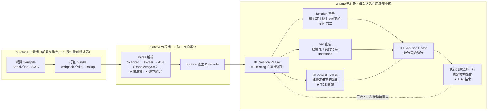

# Hoisting：函式宣告 vs 函式表達式（TDZ）與 toFixed 比較陷阱

> [!info]- 📍 承接08，銜接10
> <mark style="background: #ADCCFFA6;">承接</mark>：[[08-函式呼叫核心機制-Execution-Context-與-Parameter-Binding]]提到Creation Phase會先做Hoisting——先把`var`／`function`宣告在環境記錄裡佔好位置，這篇專門講這件事跟TDZ的關係。
> <mark style="background: #BBFABBA6;">下一步</mark>：Creation Phase除了Hoisting，接著會用傳入的引數初始化參數位置，下一篇[[10-傳值vs傳址-賦值與記憶體空間]]講這一步真正發生的事。

> 此對話標題被自動命名為「閉包」，但實際內容是 Hoisting／TDZ 與折扣計算，故依實質內容歸檔。

---

## 5W1H 速查：讀本篇之前先把座標定好

> [!important]+ 最常被搞錯的一題先講：<mark style="background: #FF5582A6;">`let`／`const` **也會**被 hoist，不是「不會提升」</mark>
> 三種宣告全部都會在進入作用域時被提升，差別只在<mark style="background: #FFF3A3A6;">「提升的同時有沒有被初始化」</mark>：`function` 連名帶身體一起就緒、`var` 被初始化成 `undefined`、`let`／`const` 則<mark style="background: #FF5582A6;">只建綁定、故意不初始化</mark>——那段「已經佔好位置卻還不能碰」的空窗期就是 TDZ。所以 TDZ 恰恰是提升的**證據**，不是沒提升的證據。
> 順帶更正另一個常見的座標錯誤：本篇說的「執行前的編譯階段」指的是<mark style="background: #ADCCFFA6;">執行期的 Creation Phase</mark>，每次進入作用域都重做一次，不是 buildtime 的轉譯打包，也不是每個函式只做一次的 Parse。

| 5W1H | 問題 | 一句話答案 |
|---|---|---|
| **What** 是什麼 | Hoisting 到底是什麼？TDZ 又是什麼？ | Hoisting 是「進入一個作用域時，引擎先把裡面所有宣告在 Environment Record 裡建好綁定」；<mark style="background: #FF5582A6;">沒有任何一行程式碼被搬動</mark>。TDZ 是「綁定已建好、但還沒被初始化」的那段空窗期 |
| **When** 什麼時候 | 提升發生在哪一格？ | <mark style="background: #FF5582A6;">執行期的 Creation Phase</mark>，而且<mark style="background: #BBFABBA6;">每次進入該作用域都重做一次</mark>——函式呼叫十次就 hoist 十次。不是 buildtime，也不是只做一次的 Parse |
| **Who** 誰做的 | 是誰把綁定建起來的？ | JS 引擎（V8）。規格上依作用域種類分別叫 `GlobalDeclarationInstantiation`（全域）、`FunctionDeclarationInstantiation`（函式）、`BlockDeclarationInstantiation`（區塊） |
| **Where** 在哪裡 | 提升出來的綁定住在哪？ | 該作用域的 Environment Record 裡。沒被閉包捕獲 → **Stack Frame／CPU 暫存器**；被捕獲 → **Heap 上的 Context 物件**。函式宣告提升時一併建好的函式物件本身一定在 Heap |
| **Which** 哪一種 | 哪一種宣告享有哪種待遇？ | a. `function` 宣告：建綁定＋<mark style="background: #BBFABBA6;">直接綁上完整函式物件</mark>，所以能先呼叫；b. `var`：建綁定＋初始化為 `undefined`；c. `let`／`const`／`class`：<mark style="background: #FF5582A6;">建綁定但不初始化</mark>，進入 TDZ |
| **How** 怎麼做到 | 一次完整流程長怎樣？ | 進入作用域 → Creation Phase 掃出這個作用域的所有宣告 → 依上面三種待遇建立綁定 → Execution Phase 逐行跑 → 跑到 `const foo = …` 那一行才做初始化，<mark style="background: #BBFABBA6;">TDZ 在這一刻結束</mark> |
| **Why** 為什麼 | 為什麼函式宣告免疫、`let`／`const` 不免疫？ | 函式宣告要支援「先呼叫、後定義」與互相遞迴，所以連身體一起就緒；`let`／`const` 則是<mark style="background: #FFF3A3A6;">刻意保留 TDZ</mark>，把「用在宣告之前」從 `var` 那種安靜的 `undefined` 升級成大聲的 `ReferenceError` |

### 時間軸：這件事發生在哪一格

```text
◄──────────── buildtime 建置期 ────────────►◄──────── runtime 執行期 ────────────►
        （你的電腦／CI，部署前就跑完）              （瀏覽器或 Node 載入腳本之後）

 ①轉譯          ②打包            ③Parse          ④Bytecode      ⑤每次進入作用域
 transpile      bundle           解析             產生            都重來一次
 ┌────────┐   ┌────────┐      ┌──────────┐   ┌──────────┐   ┌──────────────────┐
 │Babel   │   │webpack │      │Scanner   │   │Ignition  │   │ Creation Phase   │
 │tsc     │──►│Vite    │─────►│Parser    │──►│把 AST 編成│──►│ ★ 這裡才是        │
 │SWC     │   │Rollup  │      │AST       │   │Bytecode  │   │   Hoisting 本人   │
 └────────┘   └────────┘      │Scope     │   └──────────┘   │ ★ function 連身體  │
                              │Analysis： │                  │ ★ var → undefined │
                              │知道有哪些 │                  │ ★ let／const 不初  │
                              │宣告、誰被 │                  │   始化 → 進 TDZ    │
                              │閉包捕獲   │                  ├──────────────────┤
                              └──────────┘                  │ Execution Phase  │
                              每個函式只做一次                │ 逐行跑，跑到賦值   │
                              只做「決策」，                  │ 那行 → TDZ 結束    │
                              不建立任何綁定                  └────────┬─────────┘
                                                                      │
                                                                      └─► 再呼叫一次
                                                                          整包重來

 ★ Hoisting 站在第 ⑤ 格，不是第 ③ 格。程式碼從頭到尾沒有被搬動過一個字元。
```

TDZ 自己也有一條更細的階段序列（就是一個綁定的一生）：

```text
  進入作用域                                    執行到宣告那一行
      │                                                │
      ▼                                                ▼
  ┌──────────┐        ┌──────────────────┐        ┌──────────┐
  │ ①宣告     │───────►│  ②尚未初始化      │───────►│ ③初始化   │──► ④之後可重新賦值
  │ declare   │        │  ★ TDZ 死區 ★    │        │initialize│    （const 不行）
  │ 佔好位置  │        │  碰它就           │        │ 綁定拿到 │
  └──────────┘        │  ReferenceError  │        │ 第一個值 │
                      └──────────────────┘        └──────────┘

  function foo(){}      沒有 ②這一格 → 從①直接跳到③，所以隨處可呼叫
  var x                 ②被自動填成 undefined → 讀得到，但讀到 undefined
  let／const x          ②真的空著 → 這段就是 TDZ
```

同一件事用 Mermaid 再畫一次：



> [!warning]- 為什麼「提升 hoisting」這個詞本身就在誤導人？三個原因
> a. <mark style="background: #FFF3A3A6;">「提升」是個比喻，不是實作</mark>：規格裡從來沒有「把宣告搬到頂端」這個步驟，只有「在 Environment Record 裡先建立綁定」。是早期教材為了好懂才畫成「程式碼往上飛」，結果比喻活得比事實還久。
> b. <mark style="background: #ADCCFFA6;">「編譯階段」四個字被兩邊共用</mark>：本篇說的「執行前的編譯階段」是<mark style="background: #BBFABBA6;">執行期的 Creation Phase</mark>（每次進入作用域都做），不是 buildtime 的轉譯 transpile，也不是 V8 只做一次的 Parse。
> c. <mark style="background: #FF5582A6;">TDZ 的錯誤訊息長得像「不存在」</mark>：`Cannot access 'x' before initialization` 常被讀成「x 還沒生出來」。其實它已經生出來了——正因為它存在，引擎才知道要丟這個錯，而不是丟「x is not defined」。這兩個錯誤訊息的分界見 [[15-ReferenceError-vs-undefined-值與錯誤的分界]]。

### 一句話驗證法

想確認某件事在哪一格，問自己：<mark style="background: #BBFABBA6;">「這件事對同一個函式做幾次？」</mark>

1. 只做一次 → 屬於 Parse／編譯期（第 ③ ④ 格）

2. 呼叫幾次就做幾次 → 屬於執行期（第 ⑤ 格）

Hoisting 顯然是後者：同一個函式被呼叫三次，裡面的 `var` 就被重新提升並重新初始化成 `undefined` 三次，三組綁定互不相干。

### 函式宣告為什麼免疫於 TDZ？
JS 引擎在執行前有「編譯階段」。看到 <mark style="background: #ADCCFFA6;">函式宣告</mark> `function foo(){}` 時，會把<mark style="background: #FFF3A3A6;">「名稱＋整個函式內容」一起提升到範疇頂端</mark>，所以在實際第一行之前就能呼叫，沒有死區。

```javascript
processProducts();              // ✅ 可以，提早呼叫沒問題
function processProducts(){ console.log("成功執行！"); }
```

### 什麼時候才會遇到 TDZ？
把函式放進 `let` / `const`（<mark style="background: #ADCCFFA6;">函式表達式</mark>）時，編譯階段<mark style="background: #FF5582A6;">只提升變數名稱、不初始化</mark>。從提升到執行到賦值那行之間就是 <mark style="background: #FF5582A6;">TDZ（暫時性死區）</mark>，在死區內呼叫直接報錯。

```javascript
processProducts();   // ❌ ReferenceError: Cannot access ... before initialization
const processProducts = function(){ console.log("我想執行..."); };
```

> [!note] 記憶法
> `function foo(){}`（宣告）：連名帶身體一起提升，<mark style="background: #BBFABBA6;">沒有 TDZ，隨處可用</mark>。
> `const foo = function(){}`（表達式）：變數雖提升但賦值前都在 TDZ，提早呼叫直接死。

> [!tip] 跟參數初始化的對比
> 這裡的「只提升名稱、不初始化」可以直接拿來對照 [[13-閉包-Closure-私有變數與傳址陷阱]]（以及 [[08-函式呼叫核心機制-Execution-Context-與-Parameter-Binding]] (c)）講的函式參數綁定：兩者都發生在 Creation Phase，差別只在「初始化」這一步有沒有被延後——`let`/`const` 是**先佔位、故意不給值**（TDZ 就是這段空窗期）；函式參數是**佔位的同一時間就被呼叫時傳入的引數值初始化**，沒有空窗期，所以參數名稱從來不會有 TDZ 問題。

### 補充：折扣計算與 `toFixed` 比較陷阱
- 兩種折扣寫法數學等價：`price - price*discount/100` 與 `price*(1 - discount/100)`（discount=30、price=100 都得 70）。
- <mark style="background: #FF5582A6;">陷阱</mark>：`.toFixed(2)` 會把數字轉成<mark style="background: #FFB8EBA6;">字串</mark>，之後若直接拿去和數字（如 `> 80`）比較，會因字串 vs 數字而產生意外結果。比較前要先 `Number(...)` 轉回數字。

### 補充：匯出 / 搬移 AI 對話（對話原文含此實用資訊）
- <mark style="background: #BBFABBA6;">ChatGPT</mark>：設定 → 資料控制 → 匯出資料，幾分鐘後寄到信箱（連結 24 小時有效），解壓有 `chat.html` 與 `conversations.json`。
- <mark style="background: #BBFABBA6;">Gemini</mark>：單一對話用「分享與匯出」可存到 Google 文件／Gmail 草稿；完整歷史要用 <mark style="background: #ADCCFFA6;">Google Takeout</mark> →「取消全選」→ 找「我的活動 My Activity」勾「Gemini Apps」→ 建立匯出。
- 搬家建議：與其丟整坨 JSON（雜訊多），不如請 AI 把「記憶／偏好」整理成 Markdown 清單，貼到新 AI 的自訂指令，理解效率最高。

## 各對話來源

### JavaScript 閉包的重要性（實為 Hoisting/TDZ 與折扣計算 + AI 匯出）（2026-06）— https://gemini.google.com/app/a8283484f401c280

使用者：（看程式碼）finalPrice 先乘折扣再 toFixed，filter 又拿字串和 80 比？

Gemini：`processProducts` 算 finalPrice 時先乘 `(1 - totalDiscount/100)`，第 54 行 `.toFixed(2)` 轉成字串，第 58 行 `.filter` 拿字串與數字 80 比可能有意外結果，比較前應轉回數字。

使用者：黑底與白底畫面的算法差在哪？

Gemini：黑底 `price - price*discount/100`、白底 `price*(1 + ...)`，數學上等價（discount=30、price=100 皆得 70），只是不同表達方式。

使用者：直接 `function processProducts` 不會有 TDZ／暫時性死區嗎？

Gemini：不會。函式宣告在編譯階段「連名帶身體」提升到範疇頂端，提早呼叫也沒問題；只有 `const/let` 的函式表達式才有 TDZ（只提升變數名、不初始化，賦值前呼叫報錯）。記憶法如上。

使用者：要怎麼把 ChatGPT 的記憶/對話全部匯出到其他 AI？

Gemini：沒有一鍵同步。ChatGPT：設定→資料控制→匯出資料（寄信、含 chat.html 與 conversations.json）。搬家建議提煉「記憶/偏好」成 Markdown 貼到新 AI 自訂指令，比丟整坨 JSON 好。

使用者：Gemini 有匯出對話功能嗎？（並請協助記錄今天 1 點後做的事）

Gemini：單一對話可「分享與匯出」到 Docs/Gmail 草稿；完整歷史用 Google Takeout →取消全選→「我的活動」勾「Gemini Apps」→建立匯出。並提供把系統變更紀錄整理成文字、以及 Google 行事曆「一鍵加入」連結／手動欄位（活動 13:00–14:00）。

---

> [!info]- ➡️ 下一篇
> [[10-傳值vs傳址-賦值與記憶體空間]]——Creation Phase參數初始化這一步，傳值/傳址真正發生的時間點。
