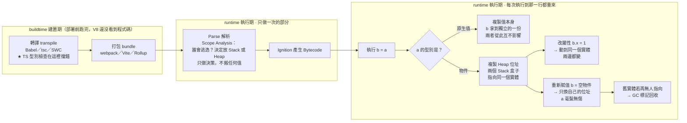

# JS 傳值 vs 傳址、賦值與記憶體空間

---

## 5W1H 速查：讀本篇之前先把座標定好

> [!important]+ 最常被搞錯的一題先講：<mark style="background: #FF5582A6;">「傳址」**不等於**兩個變數被焊在一起</mark>
> `obj2 = obj1` 之後，很多人以為 `obj1` 與 `obj2` 從此永遠同生共死。實際上要分成兩種動作看：
> a. <mark style="background: #FFF3A3A6;">改屬性</mark> `obj2.name = "Bob"` → 順著同一個位址走進 Heap 動到同一個實體，<mark style="background: #FF5582A6;">兩邊都變</mark>。
> b. <mark style="background: #BBFABBA6;">重新賦值</mark> `obj2 = {}` → 只換掉 `obj2` 自己盒子裡裝的位址，<mark style="background: #BBFABBA6;">`obj1` 毫髮無傷</mark>。
> 這也是為什麼嚴謹地說，JS 其實<mark style="background: #ADCCFFA6;">只有一種傳遞方式：複製盒子裡的東西</mark>——原生值的盒子裡裝的是值本身，物件的盒子裡裝的是一個位址。本篇沿用「傳址」這個好記的俗稱，但心裡要記得真正的分界線在這裡。

| 5W1H | 問題 | 一句話答案 |
|---|---|---|
| **What** 是什麼 | 傳值與傳址差在哪？ | 差在<mark style="background: #BBFABBA6;">「盒子裡裝的是什麼」</mark>。原生值的盒子裡裝值本身，複製過去就各過各的；物件的盒子裡裝的是一個 Heap 位址，複製過去等於兩個人拿到同一把鑰匙 |
| **When** 什麼時候 | 複製這件事發生在哪一格？ | <mark style="background: #FF5582A6;">執行期</mark>，而且是<mark style="background: #BBFABBA6;">每一次執行到 `=` 那一行、或每一次把引數傳進函式時</mark>就發生一次。迴圈跑一千圈就複製一千次 |
| **Who** 誰做的 | 誰決定要複製值還是複製位址？ | JS 引擎（V8）在跑 Bytecode 時依<mark style="background: #ADCCFFA6;">值的型別</mark>自動決定，你沒有語法可以指定。TypeScript 只在 buildtime 用型別幫你擋掉錯誤用法，<mark style="background: #FF5582A6;">執行期一行 TS 都不存在</mark>（見第 5 節） |
| **Where** 在哪裡 | 東西各自住在哪？ | a. 變數（綁定）本身住 **Stack Frame／CPU 暫存器**；b. 物件實體一律住 **Heap**；c. 被閉包捕獲的綁定會改放 <mark style="background: #FFF3A3A6;">Heap 上的 Context 物件</mark>（這就是第 6 節逃逸分析在講的事） |
| **Which** 哪一種 | 哪些型別走哪一條路？ | 走複製值：`Number`、`String`、`Boolean`、`null`、`undefined`、`Symbol`、`BigInt`。走複製位址：`Object`、`Array`、`Function`，以及 `Date`、`Map`、`Set`、`RegExp` 這些骨子裡都是物件的東西 |
| **How** 怎麼做到 | 怎麼一眼判斷會不會互相影響？ | 問一句：<mark style="background: #BBFABBA6;">「我是在動 Heap 裡的實體，還是在動 Stack 上那個盒子？」</mark>動實體（改屬性、`push`、`splice`）→ 共用者全受影響；動盒子（`=` 重新賦值）→ 只影響自己 |
| **Why** 為什麼 | 為什麼物件不能像數字一樣直接複製？ | 因為 Stack 需要<mark style="background: #ADCCFFA6;">固定大小、後進先出</mark>才能高速推入彈出，而物件的大小是動態的、可能很大。所以物件放進大小自由的 Heap，Stack 上只留一個固定大小的位址 |

### 時間軸：這件事發生在哪一格

```text
◄──────────── buildtime 建置期 ────────────►◄──────── runtime 執行期 ────────────►
        （你的電腦／CI，部署前就跑完）              （瀏覽器或 Node 載入腳本之後）

 ①轉譯          ②打包            ③Parse          ④Bytecode      ⑤每次執行到那一行
 transpile      bundle           解析             產生            ↓↓↓↓↓↓↓↓↓↓
 ┌────────┐   ┌────────┐      ┌──────────┐   ┌──────────┐   ┌──────────────────┐
 │Babel   │   │webpack │      │Scanner   │   │Ignition  │   │ 執行 b = a       │
 │tsc     │──►│Vite    │─────►│Parser    │──►│把 AST 編成│──►│ ★ 依型別決定      │
 │SWC     │   │Rollup  │      │AST       │   │Bytecode  │   │   複製值 or 位址   │
 │★TS 型別 │   │        │      │Scope     │   └──────────┘   │ ★ 在 Heap 配置    │
 │  檢查在 │   │        │      │Analysis： │                  │   物件實體        │
 │  這一格 │   │        │      │誰會逃逸？ │                  │ ★ 重新賦值 → 切斷 │
 │  擋錯   │   │        │      │→ 決定放   │                  │   舊指標 → 可能   │
 └────────┘   └────────┘      │  Stack 或 │                  │   觸發 GC        │
                              │  Heap     │                  └──────────────────┘
                              └──────────┘
                              每個函式只做一次                 迴圈跑一千圈
                              只做「決策」，不搬任何值          就複製一千次

 ★ 傳值／傳址站在第 ⑤ 格。TypeScript 的型別檢查站在第 ①格，兩者不在同一個世界。
```

一個物件實體自己也有一條由生到死的序列：

```text
  ①配置 allocate      ②共用 share         ③切斷 detach        ④回收 collect
  ┌──────────────┐   ┌──────────────┐   ┌──────────────┐   ┌──────────────┐
  │ { name:"A" } │   │ obj2 = obj1  │   │ obj2 = {}    │   │ 沒有任何一條  │
  │ 在 Heap 生出 │──►│ 兩個 Stack   │──►│ obj2 換了新  │──►│ 從根走得到的  │
  │ 一個實體     │   │ 盒子裝同一個 │   │ 位址，obj1   │   │ 路徑 → GC     │
  │ Stack 存位址 │   │ 位址         │   │ 完全不受影響 │   │ Mark & Sweep │
  └──────────────┘   └──────────────┘   └──────────────┘   └──────────────┘
                            │                                      ▲
                            └── 這一格改屬性會兩邊都變 ──────────────┘
                                （動的是 Heap 實體，不是盒子）

  ★ 本篇第 4 節「重新賦值切斷舊指標 + 觸發 GC」講的就是第 ③ → ④ 這一段。
```

同一件事用 Mermaid 再畫一次：



> [!warning]- 為什麼這麼多人會把「傳址」想成「兩個變數被焊在一起」？三個原因
> a. <mark style="background: #FFF3A3A6;">因為第一個範例永遠是改屬性</mark>：教材都先示範 `obj2.name = "Bob"` 讓兩邊都變，卻很少接著示範 `obj2 = {}` 讓兩邊分家。只看前者，很容易得出「它們是同一個變數」的錯誤結論。
> b. <mark style="background: #ADCCFFA6;">因為「地址」是看不見的</mark>：Stack 上那個裝著位址的小盒子在 console 裡印不出來，印出來的永遠是 Heap 裡的實體長相，於是盒子在腦中就消失了。
> c. <mark style="background: #FF5582A6;">因為「不可變」被誤讀成「傳值的原因」</mark>：這正是本篇第 8 節在拆的東西——<mark style="background: #BBFABBA6;">不可變是「值的性質」，傳值是「賦值時的複製行為」</mark>，原生值剛好兩個都成立，才讓人以為是同一件事。

### 一句話驗證法

想確認某件事在哪一格，問自己：<mark style="background: #BBFABBA6;">「這件事對同一段程式碼做幾次？」</mark>

1. 只做一次 → 屬於 buildtime 或 Parse／編譯期（第 ① ② ③ ④ 格）

2. 執行到幾次就做幾次 → 屬於執行期（第 ⑤ 格）

複製值／複製位址顯然是後者：`for` 迴圈裡的 `let b = a` 跑一千圈，就發生一千次複製；而 TypeScript 幫你擋下型別錯誤，從頭到尾只在第 ① 格做一次。

## 重點整理

### 1. 基本型別「傳值」(Pass by Value)
把基本型別（Number、String、Boolean…）賦給新變數時，JS 會<mark style="background: #BBFABBA6;">開闢一塊全新、獨立的記憶體空間，把值複製一份過去</mark>。

```js
let a = 10;
let b = a;   // 傳值（複製）
b = 20;
// a 仍是 10，b 是 20 → 兩者各自獨立
```

<mark style="background: #ADCCFFA6;">傳值</mark>＝「複製一份全新的自己送到新家」，彼此在記憶體中各過各的。

### 2. 物件型別「傳址」(Pass by Reference)
物件（Object、Array、Function）賦值時複製的是<mark style="background: #ADCCFFA6;">記憶體參考地址（指標）</mark>，不是內容本身。

```js
let obj1 = { name: "Alice" };
let obj2 = obj1;        // 傳址（複製地址）
obj2.name = "Bob";
// obj1.name 也變成 "Bob" → 兩者指向同一個 Heap 物件
```

<mark style="background: #FFB8EBA6;">補充：</mark>即使是傳址，`obj2` 這個變數本身在 Stack 仍有自己的微小空間存放「地址」，只是它們指向的 Heap 實體是同一個。

### 3. 賦值(Assignment) ≠ 傳值(Pass by Value)
這是最容易混淆的點：

| 觀念 | 賦值 (Assignment) | 傳值 (Pass by Value) |
|---|---|---|
| 定義 | 程式語法中的「動作」（使用 `=` 運算子） | JS 底層的「記憶體行為」 |
| 關注點 | 變數現在要綁定哪一個資料？ | 傳過去時是複製獨立副本，還是共用地址？ |
| 反例 | 沒有反例，用 `=` 就是賦值 | 對比的是傳址；物件賦值時底層跑傳址，不產生新副本 |

一句話：<mark style="background: #FFF3A3A6;">「賦值」是你寫程式時的動作（把東西塞給變數）；「傳值」是 JS 在底層默默執行的複製機制。</mark>

> 💡 影印機比喻（解釋給同事聽）：賦值＝「在筆記本上寫字」這個動作；傳值＝執行 `b = a` 時，底層影印機把 a 的內容影印一份全新的貼到 b。因為是影印本，之後在 b 亂塗，a 完全不受影響。

### 4. 重新賦值會切斷舊指標 + 觸發 GC
不論 `d` 一開始是 `undefined` 還是空物件 `{}`，只要執行 `d = c`，結果相同：

```js
var c = { hello: '安安' };
var d = {};   // d 原本指向獨立空物件 B
d = c;        // d 指標斷開 B，改指向 c 的物件 A
c.hello = '你好';
console.log(c); // { hello: '你好' }
console.log(d); // { hello: '你好' }
```

原本那個空物件 `{}` 沒有任何變數引用，會被<mark style="background: #ADCCFFA6;">垃圾回收（Garbage Collection）</mark>自動清除釋放。

### 5. TypeScript 的差異：靜態型別檢查擋下來
若 `d` 先被推導為 `string`，再 `d = c`（物件），TS 編譯期就會報錯：

```ts
var d = '我是字串';  // TS 推導 d: string
d = c;               // ❌ Type '{ hello: string }' is not assignable to type 'string'
```

<mark style="background: #FF5582A6;">差別在編譯期，不在執行期：</mark>若強行編譯成 JS 執行，記憶體覆蓋邏輯跟前面完全一樣（型別限制在 JS 世界已消失）。要允許彈性，用 `any` 或聯合型別：

> 🔗 這裡「編譯期 vs 執行期」的分法，跟 [[函式呼叫核心機制-Execution-Context-與-Parameter-Binding]] (g)(h) 節講的是同一組定義：TS 的型別檢查發生在編譯期（tsc 轉譯成 JS 之前），跟 JS 引擎自己的 Parse（編譯期，一次性）／Creation Phase＋Execution Phase（執行期，每次呼叫都重來）是兩層不同的「編譯」，但用的是同一組詞彙，容易混在一起，值得對照著看。

```ts
var d: any = '我是字串';  // 告訴 TS：什麼都可以裝
d = c;                    // ✅ 不報錯
```

### 6. 追加 2026-07-20：基本型別預設放 Stack，但「逃逸分析」可能讓它跑進 Heap
一般直覺基本型別（primitives）都放 Stack，這**大致正確但不是絕對**：基本型別通常放 Stack，因為生命週期短、存取速度快；但如果<mark style="background: #ADCCFFA6;">變數的生命週期超出原本作用範圍</mark>（例如被閉包捕獲、或被回傳到外部持續引用），編譯器/引擎會做<mark style="background: #ADCCFFA6;">逃逸分析（Escape Analysis）</mark>，判斷該值「逃出」了原本的函式範圍，進而改放到 Heap 裡。

⚠️ 存疑/更正：這次 Gemini 的回答較簡短，「逃逸分析」是 V8 引擎等現代 JS 引擎確實會做的最佳化技術（也常見於 Go、Java），但它屬於引擎內部的效能優化細節，不是 ECMAScript 語言規範保證的行為，也不是所有情境都會發生；面試時仍應以「基本型別預設在 Stack、物件在 Heap」這個規範層級的說法為主要答案，逃逸分析可作為「進階/引擎優化」的加分補充，不要當成基本型別會被隨意搬進 Heap 的常態。

![[學習JS_圖解_StackHeap記憶體示意圖_2026-07-28.svg]]

> 圖示說明：左側Stack裡a、b各自擁有獨立空間存放複製後的值；obj1、obj2存放的則是同一個位址（指標）。右側Heap只有一個物件實體，被obj1與obj2共同指向；虛線框分別對應「逃逸分析例外」與「舊物件被GC回收」兩種情境，呼應[[記憶體模型-stack-heap-動態配置-GC]]裡Mark-and-Sweep的可達性判斷。
> 來源：Claude手繪整理，用於視覺化本篇第6點與GC筆記的關聯，2026-07-28。

### 7. 真實踩坑案例：Go後端一個「共享參照沒清空」導致資料被悄悄覆蓋的bug

<mark style="background: #FF5582A6;">這不是JS，是同一套「傳址風險」在Go語言裡的真實翻版——用來證明這不是紙上談兵的面試考點，是真的會咬到production的東西。</mark>來源：`futuresign_backend`專案`backend-go/internal/service/map_service.go`，commit `7f76894a`，作者Abby，2026-03-10。

a. <mark style="background: #FFF3A3A6;">問題現象</mark>——`UpdateMap`這個函式的流程是：先用`GetByID`把地圖資料`mapObj`（一個指標，指向記憶體裡的同一份struct）讀出來，裡面有一個欄位`mapObj.Areas`（該地圖底下所有攤位區域的關聯資料，是讀取當下的舊資料）。接著呼叫`parseAndSaveConfig`，這個函式會直接把「新的」map_area資料寫進資料庫——但注意，這是**繞過`mapObj`直接寫DB**，不是透過`mapObj.Areas`這個欄位去改。最後整個函式收尾時呼叫GORM的`Save(mapObj)`，GORM看到`mapObj.Areas`這個關聯欄位有值，會把它一併級聯寫回資料庫——問題是`mapObj.Areas`裡裝的還是最開始讀出來的「舊」資料，於是這個`Save()`就把剛剛才寫進去的新map_area資料**整個蓋回舊的**，導致像`isLocked`這種欄位怎麼存都存不進去，而且完全不會報錯，是那種「明明程式碼邏輯看起來都對，資料庫值就是不動」的最難查的一類bug。
a-1. <mark style="background: #BBFABBA6;">拆成時間軸一步一步看</mark>——先講清楚`GORM`是什麼：它是Go語言的物件關聯對映（Object-Relational Mapping，簡稱ORM）套件，讓你可以用Go的struct（結構體）去讀寫SQL資料庫，不用自己手寫SQL語法，`Save()`就是它提供、負責把一個struct存進資料庫的方法。接下來把整個`UpdateMap`函式按照實際執行的先後順序拆開看：

  1. 呼叫`GetByID`，把資料庫裡這筆地圖資料讀進記憶體，存成`mapObj`這個指標。這個當下`mapObj.Areas`裡裝的是「讀取那一刻」資料庫裡的舊map_area資料——先記住這份資料的『版本』是舊的。
  2. 程式接著把`mapUpdate`裡的一些欄位（例如`Name`、`Status`）直接寫進`mapObj`，這幾行沒有問題，因為改的就是`mapObj`自己，記憶體跟這些欄位是同步的。
  3. 如果`Config`有變更，呼叫`parseAndSaveConfig`。這個函式做的事情是自己直接對資料庫下INSERT／UPDATE，把新的map_area資料寫進DB——注意這一步**完全沒有經過`mapObj`這個變數**，是另外開一條路徑直接動資料庫，所以`mapObj.Areas`這個欄位完全不知道資料庫剛剛被改了，它還停在步驟1讀到的那份舊資料。
  4. 到這裡，資料庫裡的map_area已經是新的了，但`mapObj`這個記憶體裡的物件，它身上的`Areas`欄位還是舊的——資料庫跟記憶體，這兩邊已經『分岔』，不同步了。
  5. 函式最後呼叫`Save(mapObj)`要把`mapObj`存回資料庫（目的其實只是想存步驟2那幾個欄位的更新）。但GORM的`Save()`預設行為是：只要struct上掛著關聯欄位（這裡就是`Areas`），它就會把這個關聯欄位的內容也「級聯」（cascade，意思是連帶處理、一併觸發）寫回資料庫。於是GORM看到`mapObj.Areas`有資料，就順手把這份**舊資料**也存回資料庫，直接蓋掉步驟3剛寫進去的新資料。

  這樣拆開看就會發現：問題不是「有人寫錯程式邏輯」，三段程式碼各自看起來都是對的，問題是**沒有人在步驟4那個時間點，去處理『資料庫已經變了、但記憶體裡的副本沒有跟著變』這個落差**，直到步驟5一個無關的存檔動作，意外把這個落差暴露出來，變成資料被覆蓋。

a-2. <mark style="background: #BBFABBA6;">追問：`GetByID`是不是`map_service.go`裡唯一一個？為什麼不讓`parseAndSaveConfig`直接改資料庫就好，何必最後又呼叫一次存檔</mark>——

  一、`GetByID`不是只有這一處，整個`map_service.go`裡總共呼叫了8次（分散在`GetMap`、`DeleteMap`等不同函式裡），(a-1)步驟1指的是`UpdateMap`函式**開頭那一次**（第196行）：先把要更新的地圖從資料庫讀進記憶體，才有東西可以改。而`UpdateMap`函式本身其實呼叫了**兩次**`GetByID`——開頭一次（讀取舊資料準備修改），結尾又一次（存檔完成後，重新讀一次「全新、含完整Areas」的資料，準備回傳給呼叫端）。這一頭一尾都是同一個`GetByID`方法，但用途完全不同：一個是「讀出來準備改」，一個是「改完後重新讀一次乾淨的版本」。

  二、為什麼不能只靠`parseAndSaveConfig`寫DB、乾脆跳過最後的存檔——因為`parseAndSaveConfig`的職責範圍很窄，它**只負責**解析`Config`欄位、寫入`Areas`（攤位區域）這一塊關聯資料，它完全不會去處理(a-1)步驟2那幾個欄位（`EventID`、`Name`、`MapURL`、`Status`、`BoothCount`）。這幾個欄位在步驟2的時候，只是被改在`mapObj`這個記憶體裡的struct上，**還沒有寫進資料庫**——真正把它們寫進資料庫的動作，就是最後那次`mapRepo.Update(mapObj)`（往下挖進去看，這個方法內部做的就是`db.Save(mapObj)`）。所以最後這次存檔完全不是多餘的，它是`Name`、`Status`這些欄位唯一的寫入路徑；問題從來不是「兩條寫入路徑重複了、應該砍掉一條」，而是這兩條路徑剛好都會碰到`Areas`這個欄位——一條（`parseAndSaveConfig`）直接寫新的進DB，另一條（`Save()`）因為看到`mapObj.Areas`還留著舊資料，會把它也一併級聯寫回去，兩條路徑在`Areas`這個欄位上打架，才會出事。(a-1)的修法是把`mapObj.Areas`清空，讓`Save()`的職責縮小回「只處理scalar欄位」，跟`parseAndSaveConfig`的職責（只處理`Areas`）徹底分開，不再互相打架。

  三、結尾那次`GetByID`也不是多餘的重複讀取——存檔的時候故意把`mapObj.Areas`清空了，這時候`mapObj`這個變數本身已經是「不完整」的（少了`Areas`），沒辦法直接拿去回傳給呼叫端；與其自己手動把清空前留著的舊`Areas`資料拼回去（那樣又會冒出跟(a-1)一樣的『拿舊資料充數』風險），不如乾脆重新呼叫一次`GetByID`，讓資料庫當唯一可信的來源，直接讀出一份『存檔完成後』最新、最完整的資料回傳，省得自己在記憶體裡手動維護兩份可能對不上的狀態。

b. <mark style="background: #ADCCFFA6;">為什麼這正是傳址的風險</mark>——`mapObj`是指標（傳址），代表函式裡任何一段程式碼、任何時間點去讀`mapObj.Areas`，看到的都是「這個指標當下指向的那份記憶體內容」。`parseAndSaveConfig`寫DB這個動作，完全沒有義務、也沒有自動去同步更新`mapObj`這份記憶體裡的內容——兩邊各做各的，唯一的共同點是共用同一個指標。這跟本篇(2)講的`obj2.name='Bob'`會連動`obj1`是同一個道理的反面：**不是「改了一邊、另一邊被連動」，而是「改了資料庫這個外部狀態，記憶體裡的副本卻沒有跟著變」**——只要程式後面又拿這個過時的記憶體副本去做一次「全量覆蓋式」的操作（這裡是GORM的`Save()`），舊資料就會反過來把新資料蓋掉。
c. <mark style="background: #FFB8EBA6;">修法</mark>——在`parseAndSaveConfig`成功寫入新map_area之後，手動把`mapObj.Areas = nil`清空，這樣後面`Save(mapObj)`級聯儲存的時候，因為這個欄位是空的，GORM就不會拿它去覆蓋資料庫裡剛寫入的新資料。本質上是「既然這份記憶體裡的資料已經跟資料庫脫鉤、不可信了，就乾脆清掉，不要讓後面的操作誤用它」。

一句話：<mark style="background: #FF5582A6;">傳址不只會發生在「兩個變數同時指向同一份資料、改一個另一個也跟著變」這種直覺情境，也會發生在「一份共用的記憶體參照，被程式的另一條路徑繞過去直接改了外部狀態（這裡是資料庫），但這份記憶體參照本身沒被同步更新」——這種情況下，任何後續對這份過時參照做「全量寫回」的操作，都有可能把新資料蓋回舊的，而且通常不會報錯，只會發現資料莫名其妙存不進去。</mark>面試時可以拿這個案例延伸講：知道「傳址」不代表資料自動同步，只代表「大家看的是同一份記憶體位址」，資料什麼時候新、什麼時候舊，還是要自己在程式邏輯裡管理清楚。

> 🔗 這個案例也被收進面試答題skill `js-interview-answer-framework`（見對話紀錄，2026-08-06），當作「個人踩坑小故事」的示範素材，因為是可驗證、有commit紀錄的真實經驗，不是杜撰的情境。

### 8. 追加 2026-08-31：「不可變（Immutable）」不等於「傳值（Pass by Value）」

> 本節重點 d–i，共 6 個。這是一個很容易把自己繞進去的問題：「原生值是不可變的，意思是他是傳值、所以在記憶體空間會一直開新的嗎？」答案是<mark style="background: #FF5582A6;">不是</mark>，這是兩件被混在一起講的事。

d. <mark style="background: #ADCCFFA6;">不可變（Immutable）</mark>講的是「值本身無法被就地修改」，跟「變數指向哪個記憶體位址」完全是兩回事。以字串為例：

```js
let str = "Hello";
str[0] = "h";          // 嘗試就地改掉第一個字元
console.log(str);      // 依然是 "Hello"，這行修改是無效的（嚴格模式下會直接 TypeError）
```

e. `"Hello"` 這個 <mark style="background: #ADCCFFA6;">原始值（Primitive Value）</mark>在記憶體裡是唯讀的，你唯一能做的是<mark style="background: #BBFABBA6;">重新賦值</mark>，讓變數改指向另一個全新的值：

```js
str = "hello";         // 不是把原本的 "Hello" 改小寫，而是 str 這個綁定改指向新字串 "hello"
```

f. <mark style="background: #ADCCFFA6;">傳值（Pass by Value）</mark>講的則是「把值賦給另一個變數時，複製的是什麼」。`let b = a` 會讓 `b` 拿到一份獨立的 `100`，這才是傳值。

```js
let a = 100;
let b = a;             // 傳值：把 100 這個「值」複製一份給 b，兩者從此互不影響
```

g. <mark style="background: #FFF3A3A6;">所以「不可變」是值的性質，「傳值」是賦值時的複製行為</mark>。原生值剛好兩個都成立，才會讓人以為它們是同一件事；物件則兩個都相反（可變 + 傳址）。

h. 那記憶體會不會「一直開新的」？<mark style="background: #FFB8EBA6;">不一定，這取決於引擎（例如 V8）的最佳化</mark>：

- <mark style="background: #ADCCFFA6;">SMI（Small Integer，小整數）</mark>：V8 會把小整數直接內嵌在變數的 stack 空間或暫存器裡（用指標低位元標記），根本不會去 heap 配置物件，所以談不上「開新空間」。
- <mark style="background: #ADCCFFA6;">字串駐留（String Interning／字串池）</mark>：程式碼裡重複出現的相同字面量字串，引擎通常讓它們指向同一份記憶體，直到沒有變數引用時才由 GC 回收。

i. 一句話收尾對照本篇第 1、2 節：<mark style="background: #FFF3A3A6;">原生值＝值不可變 ＋ 賦值時複製值；物件＝值可變 ＋ 賦值時複製位址。</mark>「不可變」不是「每次都開新記憶體」的意思，恰恰相反，正因為不可變，引擎才敢放心地讓多個變數共用同一份唯讀資料。

## 各對話來源

### 原生值的不可變與傳值解析（2026-08-31）— https://gemini.google.com/app/ec341b6a35870fba

**使用者：** 原生值是不可變的意思是他是傳值所以在記憶體空間會一直開新的嗎？

**Gemini：** 並不完全是因為「傳值」或「一直開新的記憶體空間」，這是兩個經常被混淆的概念。（1）「不可變（Immutable）」指的是值本身無法被修改，而不是變數指向的記憶體位址如何改變；以 `let str = "Hello"; str[0] = "h";` 為例，結果依然是 `"Hello"`，因為 `"Hello"` 這個原始值在記憶體裡是唯讀的，你只能重新賦值 `str = "hello"` 讓變數指向新字串。（2）「傳值（Pass by Value）」是指 `let b = a` 時把值複製一份給 `b`。至於記憶體會不會一直開新的，不一定，取決於 V8 的最佳化：小整數（SMI）通常直接內嵌在 stack 或暫存器中，不需要去 heap 開空間；字串則常用字串池（String Interning）讓相同字串共用同一份位址，直到沒有引用時交給 GC。總結：原生值是值本身不可變、賦值時複製值；物件是值可變、賦值時複製記憶體位址。

### 變數存取：Stack 與 Heap（2026-07-20）— https://gemini.google.com/app/8b05cf4687f2ea6f
使用者：忘記放在 heap 的是什麼樣的型別，是 primitives 基本型別嗎？
Gemini：不是，基本型別通常放在 Stack（生命週期短、存取速度快）；但如果變數生命週期超出原本範圍，編譯器會做逃逸分析，決定把它放到 Heap。

### JavaScript 傳值與記憶體空間（2026-06）— https://gemini.google.com/app/cdde71fb17e6c546

**使用者：** JavaScript 傳值不同變數，他們會各在記憶體中創造不一樣的記憶體空間嗎？（我的說法）vs Joe 說「傳值是不是不會創造新的記憶體空間」，誰對？

**Gemini：** 你是對的，Joe 不準確。基本型別傳值會在記憶體開新空間並複製值（`let a=10; let b=a;` → b 改 20 不影響 a）。Joe 可能把基本型別的傳值跟物件的傳址搞混：物件 `let obj2=obj1` 指向同一空間，改 obj2 會連動 obj1，但 obj2 變數本身在 Stack 仍有自己的指標空間。

**使用者：** 要怎麼解釋給 Joe 聽「賦值跟傳值不同」？

**Gemini：** 用影印機比喻。賦值＝寫字/貼標籤的動作（只要用 `=`）；傳值＝底層影印機把值複製一份的記憶體機制（基本型別特有）。附對比表與對話範本。

**使用者：** `var c={hello:'安安'}; var d; d=c; c.hello='你好'`，如果先宣告 `var d={}` 結果會不同嗎？

**Gemini：** 完全相同。`d=c` 是重新賦值，d 指標斷開原本空物件改指向 A，原空物件被 GC 回收。兩者最後都印 `{hello:'你好'}`。

**使用者：** 那如果 TypeScript 一開始 `var d = 一個字串` 呢？

**Gemini：** 編譯期會報錯（型別不符），但強行轉 JS 執行結果相同。要允許用 `any` 或 Union Types。

---

> [!info]- ➡️ 下一篇
> [[11-記憶體模型-stack-heap-動態配置-GC]]——完整的Stack／Heap／GC記憶體模型。
