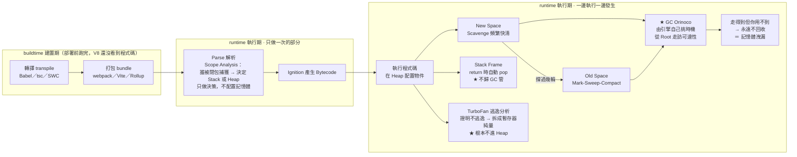
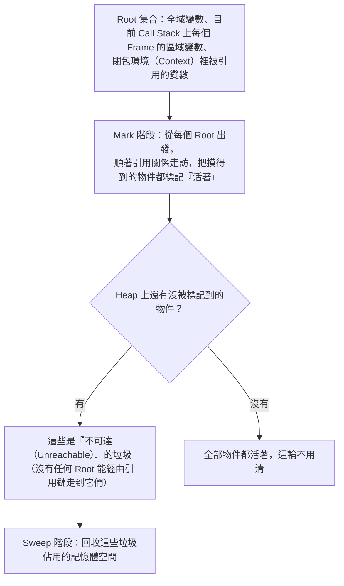

---
title: 垃圾回收 GC 與記憶體模型——Stack／Heap／動態配置
type: topic-note
tags: [javascript, gc, garbage-collection, memory, v8, heap, stack, JS_Core_and_Runtime]
aliases: [記憶體模型-stack-heap-動態配置-GC]
related:
  - "[[return-清理記憶體-stack-frame與閉包例外]]"
  - "[[V8引擎完整管線-Parse到Deoptimization]]"
  - "[[閉包-Closure-私有變數與傳址陷阱]]"
  - "[[傳值vs傳址-賦值與記憶體空間]]"
updated: 2026-08-04
---

# 垃圾回收 GC 與記憶體模型：Stack／Heap／動態配置

> [!info]- 📍 承接10，銜接12
> <mark style="background: #ADCCFFA6;">承接</mark>：[[10-傳值vs傳址-賦值與記憶體空間]]提到primitive放Stack、object指標指向Heap，這篇把Stack／Heap／GC整個記憶體模型攤開來講完整。
> <mark style="background: #BBFABBA6;">下一步</mark>：知道Stack怎麼運作之後，自然會問函式return之後Stack上的東西怎麼被清掉，下一篇[[12-return-清理記憶體-stack-frame與閉包例外]]講這個。

> 本篇重點 (a)–(h)，共 8 個。起點：[[return-清理記憶體-stack-frame與閉包例外]] 裡一直提到 GC，卻從沒單獨解釋過它到底是什麼；這篇也補上其他筆記裡一直連過來、卻遲遲沒建立的 `[[記憶體模型-stack-heap-動態配置-GC]]` 這個檔案本身。

---

## 5W1H 速查：讀本篇之前先把座標定好

> [!important]+ 最常被搞錯的一題先講：<mark style="background: #FF5582A6;">GC 看的是「還連不連得到」，不是「你還用不用得到」</mark>
> a. 一個物件只要<mark style="background: #FFF3A3A6;">還有任何一條從 Root 出發的引用鏈能走到它</mark>，它就永遠不會被回收——哪怕你這輩子再也不會用到它。所謂記憶體洩漏，幾乎都是這種「用不到但連得到」的物件。
> b. 所以 `obj = null` <mark style="background: #FF5582A6;">不是一道「回收指令」</mark>，它只是<mark style="background: #BBFABBA6;">剪斷其中一條路徑</mark>；剪完之後要不要回收、什麼時候回收，全由引擎自己決定，JS 沒有任何語法能命令 GC 立刻動手。
> c. 順帶一提，<mark style="background: #ADCCFFA6;">Stack 根本不歸 GC 管</mark>——函式 `return` 時整個 Stack Frame 是被自動 pop 掉的，那是引擎內建的固定機制，跟 GC 是兩套完全不同的系統。

| 5W1H | 問題 | 一句話答案 |
|---|---|---|
| **What** 是什麼 | GC 到底是什麼東西？ | 一段<mark style="background: #BBFABBA6;">跑在 CPU 上、管理 Heap 記憶體</mark>的 runtime 演算法（V8 裡叫 Orinoco）。它既不是記憶體本身，也不是 CPU 本身，是介於兩者之間的軟體邏輯 |
| **When** 什麼時候 | GC 什麼時候跑？ | <mark style="background: #FF5582A6;">執行期</mark>，由引擎依 Heap 壓力與配置速率自己挑時機，<mark style="background: #ADCCFFA6;">你無法指定也無法預測</mark>。跟 buildtime 完全無關，也不是「函式一結束就跑一次」 |
| **Who** 誰做的 | 誰在跑這件事？ | V8 的 GC 子系統 Orinoco。工作盡量丟到<mark style="background: #BBFABBA6;">背景執行緒</mark>（並行＋平行），但掃描 Root 的那一刻仍要短暫暫停主執行緒（Stop-The-World） |
| **Where** 在哪裡 | GC 管哪一塊記憶體？ | <mark style="background: #FF5582A6;">只管 Heap</mark>。Stack 與 Stack Frame 靠 `return` 自動 pop，生命週期規律可預測，不需要任何演算法判斷 |
| **Which** 哪一種 | 哪些東西歸 GC 管？ | 歸：Heap 上的物件、陣列、函式物件、被閉包捕獲的 Context 物件。不歸：a. 沒被捕獲的區域變數與參數（在 Stack／暫存器）；b. 被 TurboFan 逃逸分析拆成純量的物件（<mark style="background: #FFF3A3A6;">根本沒進過 Heap</mark>） |
| **How** 怎麼做到 | 怎麼判斷誰是垃圾？ | 可達性 Reachability：從 Root（全域、每個 Stack Frame 的區域變數、閉包環境）出發走訪引用鏈 → 摸得到的標記活著 → 摸不到的清掉。V8 實作成<mark style="background: #ADCCFFA6;">分代式</mark>：新生代 Scavenge、老生代 Mark-Sweep-Compact |
| **Why** 為什麼 | 為什麼 Heap 要 GC、Stack 不用？ | 因為 Stack 的生命週期<mark style="background: #BBFABBA6;">規律且可預測</mark>（呼叫就 push、`return` 就 pop）；Heap 上的物件可能被任意數量的變數與閉包引用，生命週期無從預測，<mark style="background: #FF5582A6;">只能靠演算法動態判斷</mark> |

### 時間軸：這件事發生在哪一格

```text
◄──────────── buildtime 建置期 ────────────►◄──────── runtime 執行期 ────────────►
        （你的電腦／CI，部署前就跑完）              （瀏覽器或 Node 載入腳本之後）

 ①轉譯          ②打包            ③Parse          ④Bytecode      ⑤執行＋GC 不定時介入
 transpile      bundle           解析             產生            ↓↓↓↓↓↓↓↓↓↓
 ┌────────┐   ┌────────┐      ┌──────────┐   ┌──────────┐   ┌──────────────────┐
 │Babel   │   │webpack │      │Scanner   │   │Ignition  │   │ 執行程式碼        │
 │tsc     │──►│Vite    │─────►│Parser    │──►│把 AST 編成│──►│ 在 Heap 配置物件  │
 │SWC     │   │Rollup  │      │AST       │   │Bytecode  │   ├──────────────────┤
 └────────┘   └────────┘      │Scope     │   └──────────┘   │ ★ GC（Orinoco）   │
                              │Analysis： │                  │   由引擎自己挑時機 │
                              │誰被閉包   │                  │   背景執行緒為主   │
                              │捕獲 →決定 │                  │   掃 Root 那刻要   │
                              │Stack/Heap│                  │   短暫停主執行緒   │
                              └──────────┘                  ├──────────────────┤
                              每個函式只做一次                │ TurboFan 逃逸分析 │
                              只做「決策」，不配置            │ 熱函式才做，也在   │
                              任何記憶體                     │ 執行期，不是打包期 │
                                                            └──────────────────┘

 ★ GC 站在第 ⑤ 格，而且是「不定時、不可預測」地插進來，不是排好班的固定步驟。
 ★ 注意：逃逸分析有兩層——第 ③ 格 Parse 的粗略決策，與第 ⑤ 格 TurboFan 的
   最佳化決策，兩個都在 runtime，都跟 buildtime 的轉譯打包無關。
```

一個 Heap 物件自己也有一條由生到死的序列：

```text
 ①配置        ②活過幾輪      ③晉升          ④變成不可達     ⑤標記        ⑥清除
 allocate     survive        promotion      unreachable    mark         sweep
┌──────────┐ ┌──────────┐  ┌──────────┐   ┌──────────┐  ┌──────────┐ ┌──────────┐
│在 New    │ │Scavenge  │  │搬進 Old  │   │最後一條  │  │從 Root   │ │回收空間  │
│Space 生  │►│把存活的  │─►│Space     │──►│引用鏈被  │─►│走訪，走  │►│老生代還  │
│出來      │ │複製到另  │  │改用      │   │剪斷      │  │不到的就  │ │要 Compact│
│          │ │一半空間  │  │Mark-     │   │          │  │是垃圾    │ │整理碎片  │
└──────────┘ └──────────┘  │Sweep-    │   └──────────┘  └──────────┘ └──────────┘
                           │Compact   │
  大多數物件走不完 ②        └──────────┘    ★ 卡在 ④ 走不到 ⑤ 的，就是記憶體洩漏
  就變垃圾了（世代假說）                       ——「用不到，但還連得到」
```

同一件事用 Mermaid 再畫一次：



> [!warning]- 為什麼這麼多人以為「設成 null 就會馬上釋放」？三個原因
> a. <mark style="background: #FFF3A3A6;">因為其他語言真的有手動釋放</mark>：C 的 `free()`、C++ 的 `delete` 是立即生效的指令，很多人把這個直覺帶進 JS。但 JS 沒有對應的東西，`= null` 只是<mark style="background: #BBFABBA6;">改寫一個綁定的值</mark>，順帶少了一條引用鏈而已。
> b. <mark style="background: #ADCCFFA6;">因為 DevTools 的 Memory 快照看起來像即時的</mark>：其實你按下拍快照時，DevTools 會先強制觸發一次 GC，才讓你看到「乾淨」的結果——那是工具替你按的，不是你的 `null` 造成的。
> c. <mark style="background: #FF5582A6;">因為「垃圾」這個詞會誤導</mark>：它聽起來像在講「沒用的東西」，但 GC 的定義嚴格得多——<mark style="background: #BBFABBA6;">垃圾 ＝ 不可達</mark>。你心裡覺得沒用，跟引擎判斷連不連得到，是兩回事。要讓它被回收，你要做的不是「叫它清掉」，是**讓它連不到**。

### 一句話驗證法

想確認某件事在哪一格，問自己：<mark style="background: #BBFABBA6;">「這件事對同一段程式碼做幾次？」</mark>

1. 只做一次 → 屬於 Parse／編譯期（第 ③ ④ 格）

2. 執行期間不定次數地發生 → 屬於執行期（第 ⑤ 格）

GC 是最極端的後者：它連「幾次」都不固定，同一支程式跑兩遍，GC 介入的時機與次數可能完全不同——這正是為什麼<mark style="background: #FF5582A6;">任何依賴「GC 什麼時候跑」的程式邏輯都是錯的</mark>。

## (a) GC 是記憶體操作，還是 CPU 操作？——兩者都沾一點，但角色不同

<mark style="background: #BBFABBA6;">精確講法：GC（Garbage Collector）是 JS 引擎裡的一段程式碼（一套演算法），這段程式碼本身要靠 CPU 執行才能跑起來，但它處理／管理的對象是記憶體（Heap）。</mark> 所以「GC 是記憶體操作還是 CPU 操作」這個問法本身，混合了兩個不同的問題：

- **GC 需不需要 CPU？需要**——GC 不是憑空發生的，它是一段跟你寫的 JS 邏輯一樣、要被 CPU 一行一行執行的程式（V8 內部叫 **Orinoco** 的 GC 子系統），執行這段程式會消耗 CPU 時間，這也是為什麼 GC 執行時偶爾會讓網頁「卡一下」（掉幀）。
- **GC 操作的對象是不是記憶體？是**——它做的事情就是**檢查 Heap 上有哪些物件還「活著」（還被引用）、哪些已經沒人指了（變垃圾），把垃圾的那些記憶體空間收回來、標記成可以再被使用**。

一句話：**GC 是「跑在 CPU 上、管理 Heap 記憶體」的一段 runtime 演算法**——它不是記憶體本身（記憶體只是被動的儲存空間），也不是 CPU 本身（CPU 只是負責執行指令的硬體），GC 是介於兩者之間、由 CPU 執行來操作記憶體的**軟體邏輯**。

## (b) GC 管的是 Stack 還是 Heap？——只管 Heap，Stack 不需要它

[[return-清理記憶體-stack-frame與閉包例外]] 已經講過這個分工：

| | Stack（含 Stack Frame） | Heap |
|---|---|---|
| 清理方式 | `return` 時**自動、立即**把整個 frame pop 掉 | 由 **GC** 判斷「還有沒有人指著它」，決定要不要回收 |
| 需要 GC 介入嗎 | **不需要**——這是引擎內建的固定機制，跟 GC 是兩套系統 | **需要**，這才是 GC 真正管轄的範圍 |
| 為什麼這樣分工 | Stack 的生命週期規律、可預測（呼叫→回傳），不需要額外判斷 | Heap 上物件的生命週期不規律，可能被任意數量的變數／閉包引用，只能靠演算法動態判斷 |

## (c) GC 在哪裡執行？是不是主執行緒？

V8 的 GC（Orinoco）盡量把工作丟到**背景執行緒**做，減少對主執行緒（JS 執行的那條 Call Stack）的干擾：

- **並行（Concurrent）**：GC 的部分工作（例如標記階段的一大部分）可以跟主執行緒同時進行，不用暫停 JS。
- **平行（Parallel）**：GC 本身也可以用多個背景執行緒一起分工加速。
- **仍然無法完全避免的 Stop-The-World 短暫停頓**：GC 開始要「掃描 Root」（全域變數、目前 Call Stack 上每個 frame 的區域變數、閉包環境……這些是判斷「誰還活著」的起點）那一刻，必須確保這些 Root 在掃描當下不會被 JS 同時修改，所以還是得短暫暫停主執行緒——這也是為什麼「GC 造成的卡頓」是前端效能討論裡的常見話題，即使 V8 已經很努力把大部分工作搬到背景執行緒，這個短暫停頓還是無法 100% 消除。

## (d) Stack vs Heap 動態配置：快速回顧

（完整版見 [[傳值vs傳址-賦值與記憶體空間]]、[[return-清理記憶體-stack-frame與閉包例外]]）

- **Stack**：存放函式呼叫的區域變數、參數——大小規律、生命週期可預測（呼叫時 push、return 時 pop），存取速度快，**不需要 GC**。
- **Heap**：存放物件、陣列、閉包環境這類**大小不固定、生命週期不規律**的資料——因為不知道什麼時候該釋放，只能交給 GC 動態判斷。

## (e) GC 最基本的演算法：Mark-and-Sweep（標記—清除）



**核心判準是「可達性（Reachability）」，不是「有沒有變數名字指著它」**：只要能從 Root 出發、順著一串引用關係走到某個物件，這個物件就算活著，即使中間繞了好幾層物件也算數。這也解釋了 [[閉包-Closure-私有變數與傳址陷阱]] 裡「被閉包捕獲的變數不會被清」——因為 Root 裡包含了「目前還有人用的閉包環境」，只要那個閉包（例如 `next`）還在，順著它就能走到裡面的 `count`，`count` 就永遠算「可達」，GC 不會動它。

## (f) V8 實際用的是 Generational GC（分代式），不是單純跑一次 Mark-Sweep

V8 觀察到一個經驗法則（**世代假說 Generational Hypothesis**）：**絕大多數物件活得很短**（例如一次函式呼叫裡臨時建立的小物件，用完馬上變垃圾），只有少數物件會活得很久。所以 V8 把 Heap 切成兩個世代，分別用不同頻率、不同演算法清理：

| 世代 | 存放什麼 | 清理演算法 | 清理頻率 |
|---|---|---|---|
| **Young Generation（New Space，新生代）** | 剛建立的新物件 | **Scavenge**（複製存活物件到另一半空間，速度快） | 頻繁（物件大多活不過這關） |
| **Old Generation（Old Space，老生代）** | 在 New Space 撐過好幾輪、被判定「應該會活很久」的物件（晉升 Promotion） | **Mark-Sweep-Compact**（標記—清除，再整理記憶體避免碎片化） | 較少（成本較高，能省則省） |

## (g) 什麼情況可以完全不驚動 GC？

[[V8引擎完整管線-Parse到Deoptimization]] 裡 TurboFan 的 **Escape Analysis（逃逸分析）**：如果 TurboFan 能證明某個物件**完全不會逃出目前函式**（沒被回傳、沒被存到外部、沒被閉包捕獲），甚至可以**直接不把它配置在 Heap 上**，改成幾個獨立的暫存器純量值——這種物件從頭到尾沒進過 Heap，GC 根本不需要管它，是比「GC 清得快」更進一步的「乾脆不用 GC」。

## 補充：怎麼避免物件「無法被 GC」（常見洩漏成因與對策）

(e) 講過判準是**可達性**——只要 Root 還能順著引用鏈走到某物件，它就永遠不會被回收。所以「避免無法被 GC」＝**主動切斷不再需要的引用鏈**：

| 常見成因 | 對策 |
|---|---|
| 忘記 `removeEventListener` | DOM 節點移除前先解除監聽器，否則監聽器閉包會一直抓著它 |
| 忘記 `clearInterval`/`clearTimeout` | timer 的 callback closure 會一直被計時器引用，永遠可達 |
| 閉包意外多抓了不需要的大變數 | 只留真正要用的變數；不需要的設 `null` 或搬到更小的 scope |
| 全域變數／快取（Map、陣列）一直塞東西不清 | 用完 `delete`／`.splice()`／設 `null` 主動斷開；跟著物件生命週期存活的關聯資料改用 `WeakMap`/`WeakSet`（物件被回收時，弱引用的 entry 會自動消失，不會多一條可達路徑） |
| React `useEffect` 忘記 cleanup（訂閱、監聽器） | `return () => { ... }` 裡對稱地解除訂閱／監聽 |

一句話：GC 只看「還連不連得到」，不看「你用不用得到」——你要做的不是「叫它清掉」，是**讓它連不到**。

## (h) 對照總結

| 問題 | 答案 |
|---|---|
| GC 是記憶體操作還是 CPU 操作？ | 兩者都沾邊但角色不同：GC 是**跑在 CPU 上**的演算法，操作／管理的對象是**記憶體（Heap）** |
| GC 管 Stack 嗎？ | 不管，Stack 靠 `return` 自動清，兩套完全不同的機制 |
| GC 在主執行緒跑嗎？ | V8 盡量丟到背景執行緒（並行/平行），但掃描 Root 那一刻仍有無法避免的短暫停頓 |
| GC 怎麼判斷誰是垃圾？ | 可達性（Reachability）：從 Root 出發順著引用鏈走訪，摸不到的才是垃圾 |
| V8 的 GC 演算法是什麼？ | Generational GC：Young Generation 用 Scavenge（快、頻繁），Old Generation 用 Mark-Sweep-Compact（慢、少） |
| 有沒有辦法完全不用 GC？ | 有，TurboFan Escape Analysis 證明物件不逃逸時可以直接不配置在 Heap 上 |

---

> [!info]- ➡️ 下一篇
> [[12-return-清理記憶體-stack-frame與閉包例外]]——`return`發生時Stack Frame怎麼被清掉，以及閉包例外。
