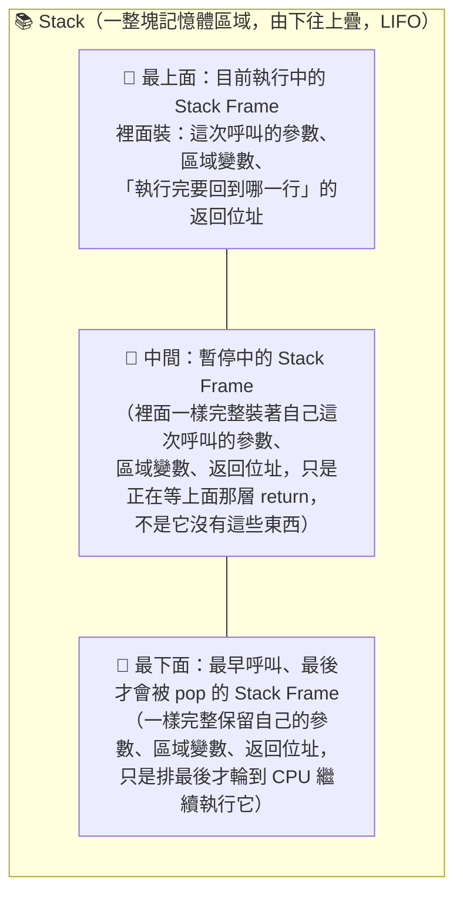
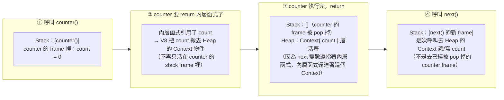

# `return` 到底清掉了什麼？Stack Frame 自動清 vs 閉包例外

> [!info]- 📍 承接11，銜接13
> <mark style="background: #ADCCFFA6;">承接</mark>：[[11-記憶體模型-stack-heap-動態配置-GC]]講完整個Stack／Heap模型，這篇聚焦在一個具體時刻——`return`發生時Stack Frame怎麼被清掉，以及被閉包捕獲的變數為什麼是例外。
> <mark style="background: #BBFABBA6;">下一步</mark>：這篇提到的「閉包例外」只是先點出現象，下一篇[[13-閉包-Closure-私有變數與傳址陷阱]]是閉包本身的深入篇。

> 相關：[[記憶體模型-stack-heap-動態配置-GC]]、[[變數宣告-let-const-var]]、[[設計模式_function]]、[[函式呼叫核心機制-Execution-Context-與-Parameter-Binding]]（參數綁定何時建立、何時被這裡講的 stack frame 一起清掉）
> 起點問題：「return 會清理記憶體喔」→ 對，但只清 Stack，不一定清 Heap。
> 互動考試：`C:\coding\JavaScript-practicing\memory-model-quiz.html`
> 互動動畫（Stack Frame push/pop + GC Mark-and-Sweep 逐步播放）：同資料夾 `return-清理記憶體-stack-frame與閉包例外.html`
> 外部佐證（2026-07-28 補）：V8 確實會把被閉包捕獲的變數放進一個叫 `Context` 的 heap-allocated 物件、掛在 closure（`JSFunction`）上，而且是「一進入該作用域就建立 Context」而非等到真的產生 closure 才建立——見 [Grokking V8 closures for fun (and profit?)](https://mrale.ph/blog/2012/09/23/grokking-v8-closures-for-fun.html)（作者 Vyacheslav Egorov，V8 工程師，發表於 2012-09-23；文章年代較早，但 Context 物件走 Heap 配置這個架構性結論至今仍成立）。

---

## 一句話
> **`return` 清掉的是 Stack 上那一層「呼叫框架(stack frame)」——區域變數、參數自動消失；但 Heap 上的物件要等 GC，而且被「閉包」抓住的變數不會被清。**

---

## 0. Stack 跟 Stack Frame 是什麼關係？

`Stack` 是**一整塊專門用來裝呼叫紀錄的記憶體區域**（一個容器），`Stack Frame` 是**每呼叫一次函式就疊上去的其中一片**（一個呼叫紀錄），彼此**並排堆疊、不是套疊**。新的 frame 永遠疊在最上面，只有最上面那片是「目前正在執行」的，下面的全部處於暫停狀態、乖乖等上面的先跑完、被 pop 掉才會輪到自己（更精確、對應真實 hex 記憶體位址與 Stack Pointer／Base Pointer 的版本，見本篇「## 5. 組合語言視角」）：



⚠️ 容易誤會的地方：上面圖裡只在「最上面」那格寫出「裡面裝：參數、區域變數、返回位址」，**不代表只有最上面那層才有這些東西**——每一層 frame，不管是正在執行的最上層、還是暫停中的中間層／最下層，內部結構都一樣完整：都各自保留著「自己那次呼叫」專屬的參數、區域變數、以及「執行完要跳回哪一行」的返回位址。唯一的差別只在於**CPU目前執行到哪一層**（只有最上層是「正在跑」的，其餘全部原地待命），不是下面的 frame 內容比較少或缺東西。

**實際寫出三層 frame 各自裝了什麼（不再只是抽象講法）：**

```js
function a(x) {
  const y = x + 1;    // y = 11
  return b(y);        // ← a() 執行到這裡時呼叫 b()
}
function b(p) {
  const q = p * 2;    // q = 22
  return c(q);         // ← b() 執行到這裡時呼叫 c()
}
function c(n) {
  const result = n - 1; // result = 21，c() 正在執行這一行
  return result;
}
a(10);
```

呼叫到 `c(22)` 正在執行 `return result;` 的那個瞬間，Stack 上同時存在 3 個 frame，由下到上分別是：

| Frame（由下到上） | 參數 | 區域變數 | 返回位址（白話說明） |
|---|---|---|---|
| `a(10)` 的 frame（最下面，最早呼叫、暫停中） | `x = 10` | `y = 11` | 執行完要跳回「呼叫 `a(10)` 那一行的下一步」（這裡是最外層呼叫者，例如模組頂層） |
| `b(11)` 的 frame（中間，暫停中） | `p = 11` | `q = 22` | 執行完要跳回 `a()` 內部 `return b(y);` 那一行，把 `b` 的回傳值接住，繼續執行 `a` 自己的 `return` |
| `c(22)` 的 frame（最上面，**目前執行中**） | `n = 22` | `result = 21` | 執行完要跳回 `b()` 內部 `return c(q);` 那一行，把 `c` 的回傳值接住，繼續執行 `b` 自己的 `return` |

這個瞬間，3 個 frame **同時**躺在 Stack 上，`x=10`、`y=11`、`p=11`、`q=22` 全部都還在，沒有任何一個因為自己那層暫停中就消失或變成空的——只是CPU現在正在執行 `c(22)` 這個frame裡的程式碼。接下來會依序發生：`c()` return `21` → `c` 的 frame 被 pop，`b` 收到 `21` 接著執行自己的 `return 21` → `b` 的 frame 被 pop，`a` 收到 `21` 接著執行自己的 `return 21` → `a` 的 frame 被 pop，Stack 變空。每一層都是「輪到自己時，用自己 frame 裡本來就保留好的資料繼續跑」，不是臨時生出來的。

**用 (a) `add(a,b)` 例子看單一 frame 長什麼樣**：一個 Stack Frame 不是空盒子，裡面實際裝的是「這一次呼叫」專屬的三樣東西——參數（`a`、`b`）、區域變數（`sum`）、以及「執行完 `return` 之後要跳回哪一行」的返回位址。這三樣東西**只屬於這一次呼叫**，下次再呼叫 `add()` 會是全新的一片 frame，裡面的 `a`/`b`/`sum` 跟上一次完全無關（見 [[函式呼叫核心機制-Execution-Context-與-Parameter-Binding]] (c) 講的「每次呼叫都重新建立綁定」）。

**用本篇 3. 的 `counter()` 例子，看 push/pop 隨時間怎麼變化**：



這張圖是本篇「閉包例外」的核心：**第②步是關鍵轉折**——V8 在 `counter` 的 frame 真的被 pop 掉之前，就已經先把 `count` 搬到 Heap 上的 Context 物件裡（因為偵測到內層函式要抓著它，見 [[00-V8引擎完整管線-Parse到Deoptimization]] 的 Scope Analysis 一節），所以第③步 Stack 清空之後，`count` 完好保留在 Heap，不會跟著 frame 一起消失。

### 0-1. 圖裡「Stack：[counter()]」到底是什麼意思？——是 Frame 的簡寫，不是把函式存成 primitive

**你在上面 T0–T3 圖裡看到的「Stack：[counter()]」，寫的是 Stack Frame 的簡寫標籤，不是說函式本體被當成 primitive 塞進 Stack 裡。**

每呼叫一次函式，不管函式內部處理的是 primitive 還是 object，引擎都會在 Call Stack 上 push 一個新的 Stack Frame，裡面打包這次呼叫的參數、區域變數（可能是 primitive 值，也可能是指向 Heap 物件的位址）、以及 return 之後要跳回哪裡的返回位址。圖裡「counter()」這個標籤，代表的是「呼叫 counter() 這個動作所產生的那一個 Frame」本身——是這次呼叫的「呼叫紀錄」，不是函式定義被存成了一個 primitive 值。

函式在 JS 裡本身就是一種物件（Function 是 Object 的一種），它的程式碼、之後可能形成的 closure 環境，實際存放位置是 Heap，不是 Stack；被呼叫的當下，Stack 上放的只是這次呼叫的執行紀錄（Stack Frame），跟函式定義本身放在哪裡，是完全獨立的兩件事——別把「Frame 裡裝著這次呼叫的 count（primitive）」跟「函式 counter 本身存在哪裡」混為一談。

### 0-2. Stack Frame、Execution Context、「呼叫紀錄」是不是同一件事？

**分兩層看，不是完全同一件事，但緊密綁定、幾乎一對一：**

- **Execution Context（執行環境）是 ECMAScript 規格定義的抽象概念**（見 [[函式呼叫核心機制-Execution-Context-與-Parameter-Binding]]）：每次呼叫函式，規格要求引擎「建立」一個 Execution Context，裡面記錄這次呼叫需要的東西——LexicalEnvironment（變數/參數綁定的環境記錄）、VariableEnvironment、ThisBinding、目前執行到哪一行程式碼等等。這是規格層級的說法，規格本身完全沒提過「Stack Frame」這個詞。
- **Stack Frame（呼叫紀錄）是引擎實作層級的說法**，指的是主呼叫堆疊（Call Stack）上，這次呼叫實際佔用的那一塊記憶體——裡面通常放：返回位址、上一個 frame 的位置（方便 pop）、這次呼叫的參數、以及一個指向這次 Execution Context 內容的指標（或直接內嵌部分內容，如果引擎判斷可以 inline 的話）。
- **兩者的關係**：規格上每次呼叫「建立一個 Execution Context」；V8 實際執行時，靠在 Call Stack 上 push 一個 Stack Frame 來「實現」這個 Execution Context。可以理解成：Execution Context 是「這次呼叫需要記住的東西」的規格藍圖，Stack Frame 是 V8 把這份藍圖實際放進主記憶體時的容器。一般情境下 1 次呼叫對應 1 個 Execution Context、對應 1 個 Stack Frame，可以近似畫等號；但如果 Execution Context 裡的某個變數被閉包捕獲（要逃逸），這部分內容會被搬去 Heap 上的 Context 物件，這時 Stack Frame 本身還是照常 push/pop，只是它「指向」的那份環境記錄，有一部分已經不在 frame 本身裡面了——這就是為什麼 frame 會 pop 掉、但被捕獲的變數還活著的底層原因。

一句話：**「呼叫紀錄」是白話講法，規格叫 Execution Context，V8 拿 Stack Frame 去實作它——三者講的是同一件事的三個層次（概念／規格／實作），日常討論可以互換使用，但要知道背後其實分了層。**

### 0-3. 「Stack 存 primitives」再深入一點：Frame 裡面到底裝了什麼？

一個 Stack Frame 不是只有「一格 primitive 值」這麼簡單，它是一整塊有固定內部結構的記憶體，常見的組成大致是：

| 內容 | 說明 |
|---|---|
| 返回位址（Return Address） | 這次呼叫執行完 `return` 後，要跳回呼叫者程式碼的哪一行繼續執行 |
| 上一個 Frame 的位置（Saved Frame Pointer） | 方便 `return` 時知道要 pop 到哪裡、恢復成呼叫前的狀態 |
| 參數（Parameters） | 這次呼叫傳進來的引數值——primitive 直接複製值進來；object 複製的是位址（指標），指向 Heap 裡的實體 |
| 區域變數（Local Variables） | 函式內部宣告的變數，一樣分兩種存法：primitive 直接把值寫在 frame 裡；object 只在 frame 裡放一個指標 |
| （可能有）指向 Context 的指標 | 如果這次呼叫裡有變數被閉包捕獲，那個變數的環境記錄會搬去 Heap 的 Context 物件，frame 裡對應的位置就變成「指向這個 Context 的指標」，不再是原始值 |

所以「Stack 存 primitives」精確的講法應該是：**Stack Frame 裡的每一個「格子」，存的內容取決於那個變數當下是 primitive 還是 reference——primitive 型別直接把值本身寫進格子裡；reference 型別（object、array、function、閉包環境）格子裡放的是指向 Heap 的位址，不是完整內容。** Stack 本身只是「一整排格式相同的 Frame」，不會因為某個格子放 primitive、另一個格子放指標，就讓 Stack「不夠格」——它裝的從來就是 Frame，Frame 裡本來就允許 primitive 跟指標混合存在。

### 0-4. 這裡講的 Stack，是「記憶體區域」還是「資料結構」？——兩者都是，只是剛好同名

**「Stack」這個字在 CS 裡有兩種意思，本篇（含前面所有討論）用的是第二種：**

- **意思一：抽象資料結構（Abstract Data Type）**——LIFO（Last In First Out）的存取規則，只定義行為（push 把東西疊上去、pop 把最上面拿掉），不規定要放在哪塊實體記憶體。你可以用 JS 的陣列自己實作一個 Stack（`let s = []; s.push(1); s.pop();`），這個 `s` 陣列本身其實是個 Object，實體是配置在 **Heap** 上的——這就是「Stack 資料結構」跟「Stack 記憶體區域」完全脫鉤的例子。
- **意思二：記憶體區域（Call Stack／執行堆疊）**——引擎（或作業系統／CPU）在執行程式時，專門劃出來、用來追蹤函式呼叫紀錄的一塊實體記憶體。本篇跟前面所有討論的「Stack」都是指這個——每次呼叫函式 push 一個 Frame、return 時 pop 掉，追蹤的對象是「目前執行到哪」，不是使用者自己寫程式建立的資料結構。

**兩者的關係**：這塊記憶體區域之所以被取名叫「Stack」，正是因為它的存取行為完全符合意思一的 LIFO 規則（最後呼叫的函式一定最先 return、最先被 pop）——名字借用自資料結構，行為也真的照著 LIFO 跑，但它是引擎／系統層級專屬的一塊記憶體，跟你自己在程式裡用陣列 push/pop 模擬出來的資料結構是兩碼事，只是剛好都遵守同一種存取規則、才共用同一個名字。

### 0-5. 下層 Frame 真的會「等」上層 return 嗎？`return` 本身也是在等待嗎？

**會等，但這裡的「等」是「暫停、被凍結原地」，不是忙碌輪詢；而 `return` 這個動作本身不是在等待，它是結束等待的那個瞬間。**

- 呼叫的當下（caller 呼叫 callee），caller 的執行會整個暫停在呼叫那一行，把 CPU 全部讓給 callee 執行，直到 callee return 為止。這段暫停期間，caller 的 Stack Frame 原封不動躺在 Stack 上（保留這次呼叫的參數、區域變數、目前執行到哪一行），不需要任何 CPU 資源在 caller 身上打轉——這就是「暫停中的 Stack Frame」的意思：不是忙碌等待（busy-wait），是像書籤一樣停在原地，等 CPU 真正回頭執行到它的時候，才會從書籤那一頁繼續。
- `return` 陳述式本身做的事，是「① 算出要回傳的值 → ② 把這個值連同控制權一起交還給呼叫者 → ③ 這次呼叫的 Frame 被 pop 掉」，這三件事幾乎同時發生。不是「return 之後才開始等待」，而是「呼叫者本來就在等（暫停），return 這個動作正是結束那段等待的那一刻」。
- 比喻：你打電話請朋友幫你查一筆資料，問完問題後你不會掛電話去忙別的事（這是同步呼叫的比喻，對應 JS 主執行緒單線程），你會拿著話筒等，直到朋友查完把答案告訴你（return 的值）並掛電話（frame 被 pop），你才接著講下一句——朋友「查資料」的過程你在等；「講出答案掛電話」這個動作本身不是等待，是結束等待的瞬間。

## 1. 正常情況：return → stack frame 自動清

```js
function add(a, b) {
  const sum = a + b;   // a, b, sum 都在這次呼叫的 stack frame
  return sum;
}
add(1, 2); // 一 return,這個 frame 整個 pop 掉,a/b/sum 立刻消失
```

每呼叫一次函式 → push 一個 frame；return → pop 掉。這是**自動、即時**的，不需要 GC，也是為什麼 stack「快」。

---

## 2. Heap 上的物件：return 不一定清，看「還有沒有人指著它」

```js
function make() {
  const obj = { big: "data" };  // obj 實體在 HEAP
  return obj;                   // 把「地址」回傳出去
}
const x = make();  // x 還指著那個 heap 物件 → 沒被清,還活著
```

`make` 的 stack frame 清掉了,但 heap 物件因為 `x` 還指著它 → **GC 不會回收**。
反過來,如果沒人接：

```js
function make() { const obj = { big: "data" }; return obj.big; }
make(); // 回傳字串後,沒人指 obj → 變垃圾 → 下次 GC 回收
```

---

## 3. ⭐ 閉包例外：return 一個函式,卻把變數「留住」

這是最反直覺、也最重要的：

```js
function counter() {
  let count = 0;              // 照理 return 後 count 該消失...
  return function () {        // ...但回傳的函式「抓住」了 count
    return ++count;
  };
}
const next = counter();  // counter 的 frame 結束了
next(); // 1
next(); // 2  ← count 還活著!沒有歸零、沒被清
```

**為什麼？** 因為回傳的內層函式仍然「引用」`count`,所以 `count` 被搬去 heap 保管(閉包環境),只要 `next` 還在,`count` 就不會被 GC 清。
→ 這就是 `closure_counter.html`、`closure_shop.html` 能持續記住狀態的原因。

---

## 4. 收尾對照表

| 東西 | 放哪 | return 後 | 何時真正釋放 |
|---|---|---|---|
| 參數、區域原始值 | Stack frame | **立即清** | return 當下 |
| 沒人指的物件 | Heap | frame 清，物件變垃圾 | 下次 GC |
| 有人接住的物件 | Heap | 不清 | 等到沒人指 + GC |
| 被閉包抓住的變數 | Heap（閉包環境） | **不清** | 閉包本身沒人用 + GC |

> 口訣：**Stack 靠 return 自動清，Heap 靠 GC，閉包是「故意不清」的設計。**

---

## 5. 再往下一層：組合語言視角的 Stack——真的有記憶體位址，還有 SP／BP 兩個暫存器

前面 0～4 節講的都是「JS 引擎眼中的 Stack Frame」；如果拉到組合語言／CPU 的層級，Stack 其實就是**一段真實的 RAM，每個位置都有自己的記憶體位址**，而且有兩個專門的 CPU 暫存器負責追蹤它：

![[學習JS_圖解_Stack位址與SP-BP_2026-07-29.svg]]

**(i) 記憶體位址是不是 16 進位（hex）？——對，這是業界通用寫法，不是 JS 專屬規則**

記憶體位址幾乎都用 hex 表示（例如 `0xFFF8`），原因很單純：**1 個 hex 位數剛好對應 4 個 bit**，一個 32-bit 位址只要 8 位 hex 就能寫完，換成 binary 要寫 32 位、又長又難讀。這件事跟 JS、V8 都沒關係，是所有組合語言／C／作業系統教材的通用慣例。

**(ii) 「屋頂是 Stack Pointer，地板是 Base Pointer」——方向抓對了，補兩個精確定義**

- **Stack Pointer（SP）**：CPU 裡一個獨立的暫存器（register，不是 Stack 裡的內容，是 CPU 內部另一塊儲存空間），裡面存的「值」是一個 hex 位址，永遠指向**目前 Stack 最上面、最後被 push 進去的那個位置**——這就是「屋頂」。每 push 一次東西，SP 存的位址就往數字更小的方向移動（往上疊）；每 pop 一次，就往數字更大的方向移回去。
- **Base Pointer（BP，有些教材叫 Frame Pointer／FP）**：也是 CPU 的一個暫存器，裡面存的值是**這個函式 frame 一開始建立時的位址**，進入函式的當下把當時的 SP 存進 BP，之後整個函式執行期間 BP 都不會變——這就是「地板」，讓函式內部可以用固定的 offset（例如「BP 往回數 2 格」）去存取參數、區域變數，不會因為函式執行過程中 SP 一直變動而找不到東西。
- 呼叫愈多層函式，SP 會不斷往「數字更小」的方向疊上去；每進入一層新函式，BP 就會被重新設成當時的 SP，標記這一層 frame 專屬的地板；`return` 時再把 BP 還原成呼叫者的舊 BP（圖裡 `0xFFFC` 那格「上一層呼叫者的 BP 備份」存的就是這個）。

**(iii) 追問：`mov edi, 3`這行字本身是機器碼嗎？右邊`bf 03 00 00 00`又是什麼？**

不是，`mov edi, 3`是**組合語言（Assembly）的助憶符（mnemonic）**，是寫給人看的、好記的文字版本；CPU真正讀進去執行的，是右邊那串十六進位數字`bf 03 00 00 00`，這才是**機器碼（Machine Code）**。兩者是同一件事的兩種表示法，一一對應：組譯器（Assembler）負責把助憶符翻成機器碼；反組譯器（Disassembler，這張截圖做的事）則反過來，把機器碼翻回人看得懂的助憶符——截圖裡左邊位址、中間助憶符、右邊十六進位機器碼，其實是同一份程式的三種呈現方式，同時列出來對照用。

![[組合語言-movEDI機器碼位元組拆解-2026-07-30.png]]

**(iv) 追問：`bf 03 00 00 00`這五組數字，是不是每一組都是1個byte？跟32-bit有什麼關係？**

對，`bf`、`03`、`00`、`00`、`00`——每一組（兩位十六進位數字）各自代表**1個byte**，五組合起來總共是**5個byte**，不是「這四組合起來才算 1個byte」。這 5 個byte 可以拆成兩部分看：

a. `bf`：這 1 個byte 是**opcode（操作碼）**，告訴CPU「這是一個mov到edi暫存器的指令」；
b. `03 00 00 00`：這 4 個byte 合起來是**operand（運算元）**，也就是要塞進edi的立即值（immediate value）「3」，因為edi是**32-bit**暫存器，所以這個立即值要用32-bit（也就是4個byte）完整表示，即使實際數值只需要`03`就夠，後面的`00 00 00`是補滿32-bit所需的高位0（採用**小端序 little-endian**排列，最低位的byte放最前面）。

所以整條指令 `mov edi, 3` 總共佔用記憶體裡**5個byte**（1個opcode byte + 4個operand byte）——這就是為什麼下一行 `mov esi, 4` 的位址是 `0x0009`，剛好是 `0x0004 + 5`。

> [!info]- 🔍 追問：5組不是8×5＝40 bits嗎？前面的`bf`沒有佔用位元嗎？
> <mark style="background: #FFF3A3A6;">你算得完全沒錯——**整條指令確實是40 bits（5 byte）**，`bf`也確實有佔用8 bits，並不是「免費附送不佔位元」。問題出在「32-bit」這個數字從頭到尾**只在描述operand那四個byte**，從來沒有包含opcode那 1 個byte。</mark>
> - `bf`（opcode，1 byte＝8 bits）：告訴CPU「接下來要執行的是mov到edi、後面跟一個32-bit立即值」這件事情本身，它自己是一個獨立的資訊，不是32-bit數值的一部分。
> - `03 00 00 00`（operand，4 byte＝32 bits）：才是真正被描述成「32-bit值」的那部分，專指要塞進edi裡面的數值3本身。
> - 所以正確的計算是：**整條指令 = opcode（8 bits）+ operand（32 bits）= 40 bits（5 byte）**，不是單純的32 bits。之前(iv)講的「32 bits＝4 bytes」，指的一直都只是operand那四組，不是整條指令的總長度。
>
> 一句話：<mark style="background: #FF5582A6;">「32-bit」描述的是operand那四個byte；operand前面還有一個opcode byte，兩者加起來才是整條指令真正的 40 bits。</mark>

**(v) 追問：32 bits＝4 bytes，是不是他口誤？跟我以前學的byte addressability有什麼關係？**

不是口誤，這是CS裡最基本、固定不變的換算：**1 byte＝8 bits，32 bits÷8＝4 bytes**，永遠成立，跟這支影片、這個指令集無關，是所有電腦架構的共同定義。

這正好呼應你以前學的**byte addressability（以byte為最小定址單位）**：RAM／記憶體位址的最小顆粒度是**1個byte**，每一個記憶體位址（例如`0x1000`）裡面剛好裝得下1個byte，CPU沒辦法定址到「半個byte」或「1個bit」。所以一個32-bit（4-byte）的整數值，在記憶體裡實際上要佔用**4個連續的位址**（例如`0x1000`、`0x1001`、`0x1002`、`0x1003`各存 1個byte），這 4 個位址合起來才拼出完整的32-bit數值——這跟本篇 0-3 節「Stack Frame裡每個格子」、跟上面(i)節「記憶體位址是hex」，其實是同一套「以byte為單位定址」的底層邏輯，只是這裡具體套用在「一個32-bit立即值怎麼被拆進機器碼」這個情境上。

**(vi) 追問：`sub rsp, 4`是「把位子騰出來」的意思嗎？**

對，抓得很準。截圖第二張裡函式開頭那三行：

```
push rbp       ; 把呼叫者的BP存起來（本篇(ii)節講的「地板備份」）
mov rbp, rsp   ; 把目前的SP設成這一層新的BP（新的地板）
sub rsp, 4     ; SP再往「數字更小」的方向移動4個byte
```

`sub rsp, 4`就是**把SP（Stack Pointer，屋頂）往下疊的方向再移動4個byte**，等於在Stack上**預留、騰出4個byte的空間**，專門留給這個函式裡的區域變數`int sum`使用（int剛好是4 byte）——緊接下一行`mov [rbp-4], eax`，就是把加總結果`eax`寫進這個剛騰出來的4-byte空間裡。這正是本篇(ii)節「BP固定當地板、用固定offset存取區域變數」的實際運作範例：`[rbp-4]`就是「從地板往回數4個byte」的意思。

**(vii) 追問：EDI、ESI是什麼縮寫？為什麼`add(3,4)`的兩個參數剛好放進這兩個暫存器？**

a. **EDI＝Extended Destination Index**（延伸目的索引）；
b. **ESI＝Extended Source Index**（延伸來源索引）。

這兩個名字是x86歷史留下來的：早期主要用在字串／記憶體區塊搬移指令（例如`MOVS`），ESI存「來源」位址、EDI存「目的」位址，把資料從`[esi]`複製到`[edi]`，故得名。

但在現代x86-64的**呼叫慣例（Calling Convention，Linux／macOS用的是System V AMD64 ABI）**裡，這兩個暫存器被重新賦予新用途：規定函式的**第1個參數**放進`rdi`（32-bit時用它的子暫存器`edi`）、**第2個參數**放進`rsi`（32-bit時用`esi`）——這就是為什麼截圖裡`add(3,4)`呼叫前會先`mov edi,3`（第1個參數a＝3）、`mov esi,4`（第2個參數b＝4），這不是巧合，是ABI規定死的固定分工，跟EDI/ESI原本「目的/來源索引」的舊用途已經沒有直接關係，只是沿用了舊名字。

![[組合語言-add函式呼叫C對照組譯碼-2026-07-30.png]]

> [!info]- 🔍 追問：ABI全稱是什麼？這是硬體規定的嗎？跟Bytecode有關係嗎？
> <mark style="background: #ADCCFFA6;">ABI＝Application Binary Interface（應用二進位介面）。</mark>
>
> a. 「舊用途」指的是ESI/EDI在字串搬移指令（例如`MOVS`）裡的原始硬體角色——ESI存來源位址、EDI存目的位址，把資料從`[esi]`複製到`[edi]`；
> b. 「沒有直接關係」的意思是：現代把「第1個參數放edi、第2個放esi」這件事，是軟體層級的呼叫慣例（ABI，Application Binary Interface）規定的，**不是CPU硬體規定edi/esi只能做這件事**——CPU看到的edi/esi，永遠都只是兩個通用的32-bit儲存格子，硬體本身不知道、也不強制「這裡面裝的是函式參數」，這純粹是編譯器跟作業系統之間約定俗成的協議，跟它們原本字串指令的硬體用途，是兩件各自獨立的事；
> c. 跟Bytecode的關係：**沒有直接關係**——這整個話題（EDI/ESI、呼叫慣例）講的都是真實x86機器碼這一層，Bytecode是V8這類軟體虛擬機自己定義的抽象格式，通常是stack-based（以Stack為運作核心）、或用自己虛擬的「暫存器」／slot（不是真的CPU暫存器），兩者屬於完全不同的執行層級——呼應本篇(iii)節「助憶符／機器碼／Bytecode是三個不同分類」的區分。
>
> 補充：這張SVG圖裡同時列出16-bit／32-bit／64-bit三種名稱（例如EDI跟RDI），不是互相矛盾——它們是**同一個實體暫存器**，只是依照當下指令用的是32-bit模式還是64-bit模式，而有不同的名字／可見寬度（EDI就是RDI的低32 bits），跟這裡「CPU只把它當通用32-bit儲存格子」這句話完全一致，只是這句話講的是32-bit模式底下的視角。

**(viii) 追問：`bf`這個byte具體代表什麼？能完整解釋、順便整理其他情況嗎？**

> 🔗 這一節與下面(ix)對應的更完整版本（含暫存器全名、+rd官方出處、x86-64新增R8~R15）已經整理成獨立的計算機基礎筆記：[[x86通用暫存器與Register-in-Opcode編碼]]——因為這件事情既是JS/V8的延伸問題，也是計算機組織本身的主題，分開存放才不會讓JS筆記顯得太臃腫。

![[手繪-bf-opcode與operand拆解-2026-07-30.jpeg]]

`bf`不是一個孤立、需要死背的數字，而是由**基底opcode**加上**暫存器編號**拼出來的——這是x86指令集裡一種常見的編碼手法，叫「**register-in-opcode**」（暫存器內嵌在opcode裡，Intel手冊裡寫成`+rd`）：

a. CPU有8個32-bit通用暫存器（EAX、ECX、EDX、EBX、ESP、EBP、ESI、EDI），每一個都有一個固定的3-bit編號（0～7）；
b. 某些指令類型（例如`mov reg, imm32`、`push reg`、`pop reg`）不會另外用一個獨立欄位存「要對哪個暫存器操作」，而是直接把暫存器編號**加到**一個「基底opcode」上，相加之後的結果才是最終真正的opcode。

**暫存器編號對照表**：

| 暫存器 | 編號（3-bit） |
|---|---|
| EAX/RAX | 0 |
| ECX/RCX | 1 |
| EDX/RDX | 2 |
| EBX/RBX | 3 |
| ESP/RSP | 4 |
| EBP/RBP | 5 |
| ESI/RSI | 6 |
| EDI/RDI | 7 |

**三種常見指令家族的基底opcode（並列對照）**：

| 暫存器 | `mov r32, imm32`（基底B8） | `push r64`（基底50） | `pop r64`（基底58） |
|---|---|---|---|
| EAX/RAX | B8 | 50 | 58 |
| ECX/RCX | B9 | 51 | 59 |
| EDX/RDX | BA | 52 | 5A |
| EBX/RBX | BB | 53 | 5B |
| ESP/RSP | BC | 54 | 5C |
| **EBP/RBP** | BD | **55** | 5D |
| **ESI/RSI** | **BE** | 56 | 5E |
| **EDI/RDI** | **BF** | 57 | 5F |

<mark style="background: #ADCCFFA6;">把這張表套回你自己截過的兩張截圖，三個數字全部對得上：</mark>

c. `mov edi, 3` → `bf`：EDI的編號是7，**B8（基底）+ 7（EDI）= BF**；
d. `mov esi, 4` → `be`：ESI的編號是6，**B8（基底）+ 6（ESI）= BE**；
e. `push rbp` → `55`：EBP/RBP的編號是5，**50（基底）+ 5（EBP）= 55**。

一句話：<mark style="background: #FF5582A6;">`bf`不是需要死記硬背的魔法數字，它等於「mov reg, imm32這族指令的基底opcode B8」加上「EDI的暫存器編號7」；只要知道基底opcode跟暫存器編號對照表，任何一支`XX+r`系列的指令都能用同一套邏輯推算出來。</mark>

**(ix) 追問：影片裡講到`call add`時說的「go down」是什麼意思？是位址往下、還是Stack往下？**

`call add`這個指令，實際上**同時做兩件事**：

a. 把**返回位址**（這裡是`0x0013`，也就是`call`指令本身結束後、下一行指令的位址）**推入（push）到Stack上**，讓CPU記得等`add()`執行完要跳回哪裡繼續；
 b. 把程式的執行流程**跳到**`add()`函式定義的位址（這裡是`0x0020`），開始執行`add()`自己的程式碼（也就是`push rbp`、`mov rbp,rsp`、`sub rsp,4`這段開頭）。

影片裡說的「go down」，指的正是(b)這件事——在反組譯清單裡，`add()`這個函式的程式碼被排在呼叫者程式碼的**下面**（`0x0020`排在`0x0004`～`0x0013`的下面），所以呼叫`add()`時，執行流程會「往下」跳到那個區塊去執行——這是「code listing上的下面」，不是Stack成長方向的「下面」。

⚠️容易搞混的地方：影片後面（12:30那章）講的「why the stack is upside down」，講的是另一件完全不同的事：Stack Pointer（SP）在push東西時，是往「數字更小」的方向移動（習慣上畫成往下），這是Stack本身資料結構的成長方向；跟這裡「call add時執行流程跳到add定義的地方」這個「下面」，是兩個不相干、只是剛好都用「下面」這個詞的概念，不要混在一起。

一句話：<mark style="background: #FF5582A6;">「call add，然後go down」指的是——CPU先把返回位址存起來，然後跳去執行`add()`函式（它的程式碼寫在反組譯清單比較下面的位置），不是Stack Pointer往下移動的那個「下」。</mark>

這張圖跟本篇 0 節的 T0–T3／三層 frame 圖是同一件事的不同解析度：0 節講的「返回位址、參數、區域變數」，在這張圖裡都變成了 Stack 上實際的一格一格 hex 位址；SP／BP 則是 CPU 用來追蹤「目前疊到哪、這一層從哪開始」的兩個指標，不是 Stack 本身的內容。

**(x) 追問（附影片4:28截圖）：`call add`把返回位址壓進Stack時，是複製進去的，還是動到main原本那塊？**

![[影片截圖-callAdd後回傳位址壓入main堆疊-2026-07-30.png]]

截圖裡字幕寫「回傳位址壓入main函數的堆疊中」，這個時間點是SP＝0xFFF7（剛壓進去的新格子）、BP仍然是0xFFFF（main自己frame的地板，還沒被改動）。答案是：<mark style="background: #FFF3A3A6;">**既不是複製現有區塊，也沒有動到、搬移任何原本已經在Stack上的東西——這只是單純新增一格。**</mark>

a. `call`執行時，CPU現場計算出「回來後要跳回哪一行」這個新數值（0x0013），把它寫進Stack**一個全新的格子**（0xFFF7），這個值之前不存在於Stack上任何地方，不是從別處複製過來的；
b. 這一格下面、本來屬於main()的那些內容（圖裡更下面那些藍色格子）**完全沒被碰過**，也沒被搬動位置——push這個動作本質上就只會往Stack**新增**一格，從來不會碰到已經存在的舊格子；
c. 至於為什麼字幕說這是壓進「main的堆疊」：因為這一刻`add()`自己的prologue（`push rbp`、`mov rbp,rsp`）還沒執行，BP仍指向main自己frame的地板（0xFFFF），所以這個新壓進去的返回位址在此刻還沒被劃進任何獨立的add() frame——它會在下一步`push rbp`執行後，變add() frame最底層的一部分。

跟上面(ix)提過的`push rbp`一起看，可以看到同一套規則在兩次不同push裡重複發生：`call`自己push的是**新計算出來的返回位址**（不是複製自哪個現有格子）；`add()`自己prologue裡的`push rbp`push的則是**複製自main當下BP暫存器的值**。不管壓進去的是哪種，push這個動作本身永遠只會**新增一格**，從不會碰、移動、覆寫已經在Stack上的任何舊內容。

一句話：<mark style="background: #FF5582A6;">push永遠是「寫一格新的，SP移過去指它」，不是「複製整塊舊區域」、也不是「搬動舊區域」——main自己那些已經存在的Stack內容，從頭到尾都沒被碰過。</mark>

**(xi) 追問：差別在於`call add`這個指令本身也佔用記憶體空間<可是占用應該是數字增加怎麼越來越小？阿你說14+5=19 是怎麼-6變成13？我看不懂的是這裡**

沒有任何減法，是十六進位（hexadecimal）跟十進位（decimal）混著看造成的誤讀。整個推導只有一次加法：`0x000E`換算成十進位是14；14加上`call`指令佔用的5個byte，14+5=19（十進位）；19換算回十六進位寫法就是`0x0013`。看到的「13」其實是十六進位的13，代表的數值是1×16+3=19，只是十六進位的字元「1」「3」長得跟十進位的十三一樣，才會誤以為是「19減6等於13」——實際上從頭到尾都只有14+5這一次加法。

**(xii) 追問：其實我好像可以理解就是說先呼叫的當然先進去，但之所以不會先被編號是因為它實際被記憶體使用的時間沒有那麼早，反而是後呼叫的東西先執行完會先被pop出去所以是最上層的先取得記憶體位址編號**

方向完全正確，因果鏈更明確地講：

1. 呼叫順序（call order）決定「誰先被推入（push）到Stack上」——先被呼叫的函式確實先被放進Stack；
2. 但Stack的成長方向是「往數字變小的方向疊上去」，所以每一次新的push，反而拿到比前一個更小的位址——「先放進去」不等於「位址編號比較小」；
3. 結束順序（pop，取出資料的動作）永遠跟push相反：最晚push進去的東西最早被pop出去，這叫LIFO（Last In First Out，後進先出）；
4. 所以位址編號大小只跟「第幾個被push上去」有關（越晚push、位址越小），跟哪個函式先被呼叫沒有直接關係——「後呼叫的東西先執行完會先被pop出去，所以是最上層」完全正確，這正是LIFO本身的定義。

**(xiii) 追問：SP 乃什麼的縮寫？ S?**

SP＝Stack Pointer（堆疊指標）：S＝Stack（堆疊），P＝Pointer（指標，一種存著某個位址的暫存器）。SP存的就是目前Stack最上面那一格的位址，本篇稱它為「屋頂」。

**(xiv) 追問：3 bits可以排列組合出8可是2的0次方+2的1次方+2的2次方總共只有7欸怎麼湊出8？**

算法弄反了——3個bit（每個只能是0或1）能排出幾種組合，算法是2的3次方（2³＝2×2×2＝8），不是2⁰+2¹+2²相加（那是完全不同的運算，跟「排列組合數」無關）。3個位元真正能排出的8種組合：000＝0、001＝1、010＝2、011＝3、100＝4、101＝5、110＝6、111＝7，剛好8種，對應EAX(0)、ECX(1)、EDX(2)、EBX(3)、ESP(4)、EBP(5)、ESI(6)、EDI(7)這8個暫存器編號，完全對得上。

**(xv) 追問：prologue是什麼？**

Prologue（開場白，這裡指函式的開場設定段落）是函式一開始執行時，用來建立自己的Stack Frame（堆疊呼叫框架）的固定幾行指令：

```
push rbp       ; 把呼叫者的Base Pointer存起來
mov rbp, rsp   ; 把目前的Stack Pointer設成這一層新的Base Pointer
sub rsp, N     ; 預留N個byte給區域變數
```

跟它相對的是epilogue（收尾段落），是函式結束前把這一層Stack清乾淨、把Base Pointer、Stack Pointer還原成呼叫者狀態的那幾行指令。

**(xvi) 追問：承(ix)節的回答，這邊的call跟JS綁定的call/apply/bind有關係嗎？**

沒有直接關係，只是剛好共用英文單字「call」。x86的`call`指令是CPU層級的控制轉移指令；JavaScript的`Function.prototype.call/apply/bind`是語言層級的方法，用來指定`this`綁定和傳入參數，兩者設計目的不同。往最底層看，JS不管用哪種方式呼叫函式，V8引擎編譯出的機器碼最終都會用到某種x86 `call`或跳轉指令去轉移執行流程——只在執行機制底層有間接關聯，命名和設計層面無關。

**(xvii) 追問：ISA全稱是什麼？microcode比機器碼更底層，且不受ISA規格公開保證，這樣說對嗎？**

ISA全稱是Instruction Set Architecture（指令集架構），是CPU對外公開、保證相容的指令規格。microcode（微指令，CPU內部把一條機器碼指令拆解成更小的硬體操作步驟）確實比機器碼更底層，且屬於CPU廠商內部實作細節，不受ISA公開保證——同一條機器碼指令，Intel跟AMD內部可能用不同microcode實現，只要ISA這一層行為結果一樣，軟體完全不需要、也無法得知底層microcode長什麼樣子。

**(xviii) 追問：記憶體位址只有4碼嗎？**

不是固定規則——本篇圖裡看到的位址（例如`0x0004`、`0xFFFF`）之所以是4碼，只是影片為了畫面簡潔採用的簡化示意，不代表所有系統的記憶體位址都固定是4碼。實際位址要顯示幾碼十六進位，取決於這台電腦的定址寬度（address width）——見下一題(xix)整理常見長度。

**(xix) 追問：請舉出常見的記憶體長度給我看**

| 年代／系統 | 定址寬度 | 位址空間上限 | 十六進位碼數 |
|---|---|---|---|
| 8-bit時代（例如6502、Z80） | 16-bit | 64KB | 4碼（例如`0xFFFF`） |
| 8086實模式（16-bit時代） | 20-bit（segment:offset組合） | 1MB | offset本身4碼，實際定址靠segment再往上疊 |
| 32-bit系統（32-bit作業系統／CPU） | 32-bit | 4GB | 8碼（例如`0xFFFFFFFF`） |
| 現代64-bit系統（x86-64） | 暫存器是64-bit，但目前硬體與作業系統通常只使用低48-bit當有效位址（其餘保留給未來擴充） | 實際可用約256TB（2⁴⁸ bytes） | 有效位數約12碼，暫存器欄位本身是16碼 |

**(xx) 追問：例如32GB RAM是幾位？**

32GB＝32×2³⁰ bytes＝2⁵×2³⁰＝2³⁵ bytes。要讓每一個byte都有唯一的位址，至少需要35個bit（2³⁵種位址剛好對應2³⁵個byte）——所以32GB RAM理論上最少需要**35-bit**定址；實際硬體的記憶體控制器通常會抓整數、好處理的寬度（例如36-bit），但數學上的最小值就是35 bits。

**(xxi) 追問：我們討論這麼多的STACK確定就是之前Event loop的call stack嗎？**

是同一個概念，只是站在不同的抽象層級看。Event Loop那邊講的call stack，是JavaScript引擎（V8）自己維護的一份邏輯堆疊，JS的程式碼、瀏覽器開發者工具看到的呼叫堆疊畫面，都是站在這一層說話；而本篇這一路討論的SP（Stack Pointer）、BP（Base Pointer）、真實hex位址、push/pop機器指令，是CPU硬體實際操作的那份Stack——當V8把JS編譯成機器碼並執行時，JS層級看到的那份call stack，最底層正是靠這裡討論的x86硬體Stack機制（真正的push、call指令去移動真正的SP暫存器）去實作出來的。兩者是同一件事（一個LIFO的函式呼叫框架集合）在兩種解析度下的樣子，不是兩個不相干的東西——這篇討論的正是Event Loop那份call stack「底層到底怎麼運作」的版本。

**(xxii) 追問：`call add`是不是只push返回位址進Stack，讓main()的Stack多一層，這樣理解對嗎？**

對，理解正確。`call add`執行的當下，`add()`自己的frame都還沒建立——它只做了一件事：把返回位址push進Stack的新一格，這一格暫時算是main()自己Stack使用量多出來的一層（因為此時BP仍指向main的地板，還沒有任何屬於add()的frame邊界劃出來）。要等到下一步`add()`自己的prologue開始執行（`push rbp`），這一格連同新push的BP備份，才會一起被劃進add()自己的frame——本篇(x)節已經完整說明過這個時間點的細節。

**(xxiii) 追問：`add()`開頭沒有push rbp嗎？此時範例影片怎麼又出現64-bit？之前對話裡edi/esi是32-bit（e開頭），現在rbp/rsp是64-bit（r開頭），為什麼創造add() frame時複製的是main() Base Pointer暫存器裡面的值？**

三個問題一起回答：

a. `add()`開頭確實有`push rbp`——這是(vi)(ix)(x)節反覆提過的prologue第一行，沒有漏掉；

b. 32-bit（e開頭，例如edi/esi）跟64-bit（r開頭，例如rbp/rsp）**同時出現在同一段程式碼裡，是正常、真實會發生的情況，不是影片前後矛盾**：在x86-64架構下，**位址／指標類的暫存器（Stack Pointer、Base Pointer）永遠維持64-bit**，因為64-bit系統裡每一個記憶體位址本身就是64-bit數值，這是架構的硬性規定；但**資料類的暫存器（用來放函式參數）可以依資料本身的型別選用32-bit或64-bit版本**——因為`add(int a, int b)`裡的`a`、`b`宣告成`int`（32-bit整數），所以編譯器選用32-bit的`edi`/`esi`來放這兩個參數，跟`rbp`/`rsp`永遠是64-bit完全不衝突，兩者管的是不同東西（一個管「位址」，一個管「資料數值」）；

c. 創造`add()`自己的frame時，`push rbp`push進去的**確實是`main()`當下Base Pointer暫存器裡的值**——原因很單純：`rbp`是CPU裡**只有一份**的實體暫存器，不會因為換了函式就自動清空或切換。從`main()`開始執行、設定好自己的`rbp`之後，一路到`call add`執行完、跳進`add()`程式碼的第一行為止，中間完全沒有任何指令去改動過`rbp`——所以`add()`剛開始執行的那一刻，`rbp`裡面裝的，就是`main()`最後一次寫進去的那個值。`push rbp`只是把這個「當下還沒被改過的舊值」原封不動存一份備份到Stack上而已。

**(xxiv) 追問：也就是說`add()`會得到呼叫它的函式（`main()`）裡面環境的基礎值嗎？**

**不是**——這裡要澄清一個重要的誤解邊界：`add()`確實**備份了一份main() BP的數值**（一個位址），但這**不等於**`add()`因此就能「存取」或「看到」main()裡面的區域變數、環境或作用域。這個備份的唯一用途，是留到`add()`要`return`的時候，透過`pop rbp`把它原封不動地還原回`rbp`暫存器，好讓`main()`繼續執行時，`rbp`依然正確指向自己原本的frame地板，能繼續用`[rbp-偏移量]`這種寫法存取自己的區域變數——`add()`整個執行過程中，**完全沒有使用**這個備份值去讀寫main()的任何資料，`add()`自己會用`mov rbp, rsp`設定一個全新、完全獨立的BP，跟main()的區域變數毫無關聯。這跟JavaScript閉包（closure，見[[13-閉包-Closure-私有變數與傳址陷阱]]）「內層函式真的持續持有外層變數的即時參照」是完全不同的兩件事——閉包是V8刻意在Heap上建立`Context`物件、讓內層函式長期連著它；這裡的`push rbp`單純只是「借用一份備份、稍後原樣歸還」的暫存動作，過程中不會、也不能拿去讀寫caller的變數。

**(xxv) 追問：那`mov`是什麼？`sub`是什麼意思？**

a. **`mov`＝move**（移動），但實際行為是**複製**：把一個數值從來源（暫存器、記憶體或立即值）複製一份到目的地，來源本身的內容不會被清空或消失，跟中文字面「移動」的直覺不同；
b. **`sub`＝subtract**（減法）：把兩個數值相減，結果寫回目的暫存器，例如`sub rsp, 4`就是把`rsp`目前的值減掉4。

★★★★★ 這一題真正重要、值得標記的重點，不是「add()拿到caller的環境」（這是誤解，見上題(xxiv)），而是：**`push rbp`／`pop rbp`是一組「借用—歸還」的備份機制，讓每個函式都能在使用完BP之後，把它完整還給呼叫者，這是多層函式呼叫能夠正確巢狀運作、不會互相干擾對方Stack Frame的關鍵設計**——這點確實值得五顆星，但重點在「借用—歸還」，不是「取得存取權」。

**(xxvi) 追問（補充Gemini來源）：為什麼Stack數字越往上越小？**

這一題我原本(xii)節的回答，講的是**LIFO的因果順序**（誰先push、誰先pop），沒有正面回答「為什麼Stack的成長方向本身要選擇由高位址往低位址」這個設計動機問題——你補充的Gemini回答，正好是這一塊的答案，兩者互補、不衝突：

1. 硬體世界裡，記憶體位址的大小本身是固定的（例如`0x0000`到`0x7FFF`），Stack的起點被系統設定在**最高位址**（例如`0x7FFF`），之後每次push都往「地下（更低位址）」繼續挖，所以最新push的資料，位址反而最小；
2. 這樣設計的原因，是為了跟另一塊記憶體區域**Heap（堆積，用來動態配置記憶體的空間，見[[11-記憶體模型-stack-heap-動態配置-GC]]）互相對開生長**：Heap從低位址往高位址長，Stack從高位址往低位址長，兩者面對面往中間空地生長，才能最大化利用中間那塊還沒被用到的記憶體——如果兩者都往同一個方向長，就很難預先分配、也容易提早互相撞在一起。

一句話：**Stack由高往低長，是因為要跟Heap反方向對開生長、共用中間那塊空間**，不是隨意決定的方向。

**(xxvii) 追問：`call`推入返回位址跟`push rbp`存起caller的BP，聽起來很像，是同一件事嗎？**

不是同一件事，雖然兩者都屬於「push」這個動作、都只會在Stack新增一格（見(x)節），但觸發者、內容都不同：

a. `call`的push，是`call`這一個指令本身自動、內建做的事——寫進去的內容是CPU現場算出來的「返回位址」，不需要另外寫一行`push`指令；
b. `push rbp`，是`add()`自己prologue裡，另外、獨立寫出來的一行指令——寫進去的內容是`rbp`暫存器當下的數值（如(xxiii)節解釋的，此刻正好是main()的BP）。

一句話：**兩者都是push、都只新增一格，但一個是`call`指令自動附帶的，一個是被呼叫函式自己主動額外寫的，內容也完全不同（返回位址 vs 暫存器備份值）。**

**(xxviii) 追問：影片6:31說「move 4 bytes」，為何實際指令是`sub`（減法）？**

因為Stack的成長方向本身就是「往數字變小的方向移動」（見上面(xxvi)節）——把SP往這個方向移動4個byte，數學上就等於「把SP目前的值減掉4」，所以實際指令用的是`sub rsp, 4`，不是字面上的「move」指令。反過來，如果要把SP往回移（釋放空間、相當於pop的效果），方向是數字變大，這時才會用`add rsp, 4`（加法）。影片口語說「move 4 bytes」，講的是「移動SP指標」這個效果，底層真正對應的機器指令，會依移動方向選用`sub`或`add`。


**(xxix) 追問：4:30秒說要return to `0x0013`而不是`0x000E`，是因為怕無窮迴圈嗎？`0x0013`那行`mov [1234], eax`在做什麼？**

「不會回到`0x000E`」是`call`這個指令定義本身的自然結果，不是特別設計來防無窮迴圈的機制——`call`push進去的返回位址，定義上永遠是「`call`指令本身結束後、下一行指令的位址」，從來就不是`call`指令自己的位址，所以本來就不可能跳回去重新執行`call add`自己那一行。不過妳說的「不然會無窮迴圈」這個**效果**是對的：如果真的跳回`0x000E`重新執行`call add`，確實會造成無限重複呼叫——只是這是「返回位址定義」自然帶來的副作用，不是刻意加上去的防呆機制。

`0x0013`這一行`mov [1234], eax`：`add()`執行完`return`後，依照呼叫慣例（ABI），回傳值會被放進`eax`暫存器；`main()`收到控制權、繼續往下執行的第一件事，就是把`eax`裡的回傳值，複製寫進`main()`自己Stack上某個位置（這裡簡化寫成`[1234]`，代表`main()`裡`result`這個區域變數所在的位址）——對應到C程式碼`int result = add(3, 4);`裡，把等號右邊算出來的值，寫進`result`這個變數的動作。

**(xxx) 追問：EAX是accumulator，但他是創造4個bytes嗎？我可以大膽說eax就是accumulator就是return嗎？以後被問到return我就說他是會動到暫存器的accumulator？**

兩個地方要修正一下，會比較精確：

a. EAX裝得下4個byte，只是因為它是**32-bit暫存器**——所有32-bit暫存器都固定裝4個byte，這是暫存器本身的大小，不是因為要放「回傳值」才特別「創造」出4個byte，跟目前有沒有函式回傳、有沒有在用它都無關；
b. 「eax＝accumulator＝return」這句話把兩件獨立的事混在一起了：**accumulator（累加器）是EAX的歷史名字**，源自早期CPU設計裡它常被用來放算術運算的中間結果；**「函式回傳值放在EAX」則是另一件事**——是現代呼叫慣例（ABI，跟(vii)節edi/esi放第1、2個參數是同一份System V AMD64 ABI規定）額外規定的角色，兩者是「歷史名字」跟「現代軟體慣例」的關係，不是「因為它叫accumulator，所以它的工作就是return」這種因果關係（這點跟edi/esi「舊用途是字串索引、現代慣例是函式參數」完全同一個道理）。

如果之後面試被問到「x86裡return怎麼運作」，更精確的說法是：**「依照呼叫慣例（calling convention／ABI），函式回傳值會被放進EAX（32-bit值）或RAX（64-bit值）暫存器」**，而不是「EAX的工作就是return，因為它是accumulator」。

**(xxxi) 追問：ISA的Instruction等於microcode嗎？**

不等於。ISA（Instruction Set Architecture，指令集架構）裡講的「instruction」，指的是**公開、有文件規格**的機器碼指令本身（例如`mov`、`call`這些，軟體看得到、可以依賴的那一層）；microcode則是**CPU內部、私有、沒有公開規格**的實作細節，負責把「一條ISA層級的instruction」再拆解成更細的硬體微操作步驟去真正執行。一條ISA instruction，在不同廠商的CPU裡，內部可能被拆成完全不同的microcode組合去實現，只要ISA這一層對外行為一致，軟體完全不需要、也無法得知底層microcode長什麼樣子——(xvii)節已經確認過這個分層，這裡再次強調兩者不是同一件事。


**(xxxii) 追問：(xx)節「32GB RAM是幾位」這一題我看不懂你怎麼算的？GB的B是bits還是bytes？**

先回答第二個問題：**GB裡的B是bytes（位元組），不是bits（位元）**。這是資訊工程界一個很穩定的慣例：大寫B＝byte（1 byte＝8 bits，見本篇TL;DR跟(xiv)節已經算過的2的次方關係）、小寫b＝bit。妳平常看到的網路速度單位（例如100 Mbps＝每秒100百萬位元）用的是小寫b；但檔案大小、記憶體容量、硬碟容量這些「容量」單位，幾乎永遠用大寫B（bytes）——所以32GB RAM，講的是32 gigabytes（位元組等級的容量），不是32 gigabits。

接著把整個算式拆成四步：

a. **第一步：把「G」換算成實際數字。** G＝Giga，但這裡有個容易忽略的地方——「Giga」在不同場合有兩種算法：十進位的Giga＝10⁹（十億），這是國際單位制SI的標準定義；二進位的Giga（更精確應該叫Gibi、單位寫成GiB）＝2³⁰。硬碟容量廠商通常用前者（10⁹）標示，但RAM（記憶體）幾乎永遠是用後者（2³⁰）——因為記憶體晶片本身的物理設計就是2的次方大小，不可能剛好湊成10⁹這種十進位整數，所以講RAM容量時，「GB」實務上幾乎都是指2³⁰ bytes，這也是(xx)節原本算式選擇2³⁰的原因（見[TechTarget – What is gibibyte (GiB)?](https://www.techtarget.com/searchstorage/definition/gibibyte-GiB)）。

b. **第二步：算出32GB總共是幾個byte。** 32GB＝32×2³⁰ bytes。因為32本身也是2的次方（32＝2⁵），所以可以把兩個2的次方合併：32×2³⁰＝2⁵×2³⁰＝2⁽⁵⁺³⁰⁾＝2³⁵ bytes（同底數的冪次相乘，指數直接相加，這是次方運算最基本的規則）。所以到這一步，32GB RAM總共有2³⁵個byte。

c. **第三步：搞懂「要幾個bit才能讓每個byte都有唯一地址」這個問題在問什麼。** 想像成一整排連續編號的門牌，一共有2³⁵戶（每戶就是1個byte），要給每一戶一個獨一無二的門牌號碼，門牌號碼本身要用二進位的bit組合去表示。n個bit能排出的組合數是2ⁿ種（見本篇(xiv)節已經解釋過的「n個bit＝2的n次方種排列」）；要讓組合數剛好能覆蓋2³⁵戶（不多也不少），需要2的n次方大於等於2³⁵，而n最小可以剛好等於35，因為2³⁵種bit組合，剛好可以一對一對應到2³⁵個byte，一戶都不多、一戶都不少。

d. **第四步：所以答案是35 bits，不是另外去湊出來的，而是直接沿用第二步算出來的那個指數。** 這是這一題最容易卡住的地方：第二步算出來的「32GB＝2³⁵ bytes」裡面，那個指數35，剛好就是第三步問的「需要幾個bit」的答案——不是兩次獨立計算再湊在一起，是同一個2的35次方，同時回答了「總共幾個byte」跟「需要幾個bit定址」這兩個問題，因為「byte的總數」剛好就是「bit組合能表示的地址總數」，兩者是同一件事的兩種問法。

e. **關於「實際硬體通常抓36-bit」這句話**：這不是因為35 bits不夠用、算錯了，而是工程上的習慣——硬體設計時常常會抓一個比理論最小值再大一點、比較「整齊」的位元寬度（例如36、40、48這種數字），留一點餘裕給未來記憶體再擴充，或是配合其他硬體規格對齊，並不是說35-bit在數學上不精確或不夠——數學上的最小值，就是35 bits，沒有更少的可能。

f. **追問延伸：10的9次方是2的幾次方？** 答案不是一個整數次方，只能算出近似值：對兩邊取log2（以2為底的對數，用來問「2要乘幾次自己才會變成這個數字」），10⁹＝2的(9×log₂10)次方，而log₂10≈3.32193，所以10⁹≈2的29.897次方——落在2²⁹（536,870,912）跟2³⁰（1,073,741,824）之間，比較接近2³⁰但不是剛好等於2³⁰。這正是為什麼十進位的Giga（10⁹，硬碟廠商愛用）跟二進位的Gibi（2³⁰，作業系統跟RAM愛用）長期被搞混、常被直接當成同一個數字——兩者其實只差了大約7.4%（2³⁰÷10⁹≈1.0737），數值很接近、但終究不是同一個東西：10⁹本身不是任何一個整數n的2的n次方，只有2的整數次方才能剛好湊出一個「乾淨」的二進位容量，10⁹做不到，只能無限逼近。這也解釋了一個常見的生活現象：買一顆廠商標示「1TB」（1兆位元組，用10¹²算）的硬碟，插進Windows卻只顯示約931GB——因為Windows顯示的其實是GiB（2的次方），廠商標示的卻是十進位TB（10的次方），兩套算法對同一顆硬碟給出不同數字，硬碟本身沒有少任何容量。

## 資料來源（含查證時間）
| 主題 | 連結／說明 | 版本／時間 |
|---|---|---|
| Stack Pointer／Base Pointer、hex 記憶體位址、frame 屋頂與地板的視覺呈現方式 | 參考 YouTube Shorts〈How Assembly Functions Work – The Stack Explained〉@MxyAhoy 的畫面構圖（使用者提供截圖），本篇圖表為原創重繪，非直接複製 | 查證日期 2026-07-29 |
| 同一支影片更深入的片段：mov edi/esi機器碼位元組拆解、opcode與operand分割、little-endian、EDI/ESI名稱源流與System V AMD64 ABI呼叫慣例 | 同一支@MxyAhoy影片，使用者提供截圖（IMG_5039、IMG_5038） | 查證日期 2026-07-30 |
| bf等register-in-opcode（+rd）編碼手法：基底opcode加暫存器編號（mov r32,imm32、push r64、pop r64對照表），使用者手繪整理 | 使用者提供手繪截圖（photo.jpeg），對照Intel指令集通用編碼慣例 | 查證日期 2026-07-30 |
| `call add`同時push返回位址與跳到被呼叫函式（影片中講的「go down」指code listing上的下面，非Stack成長方向） | [How Assembly Functions Work - The Stack Explained](https://www.youtube.com/watch?v=u_-oQx_4jvo)（@Mxy，YouTube），章節標記 03:44 Stack Frames | 查證日期 2026-07-30 |
| ABI全稱（Application Binary Interface）、ISA全稱（Instruction Set Architecture）與microcode分層、記憶體定址寬度（16/32/64-bit）常見對照、2的3次方排列組合原理 | 一般計算機組織／CPU架構教材通用定義，非單一來源 | 查證日期 2026-07-30 |
| Stack由高位址往低位址生長、與Heap對開生長的設計動機（地下室類比） | 使用者提供之Gemini對話補充 | 查證日期 2026-07-30 |
| GB／GiB的十進位與二進位換算差異（決定(xx)(xxxii)節32GB＝2³⁵ bytes這個算式為何用2³⁰而非10⁹） | [TechTarget – What is gibibyte (GiB)?](https://www.techtarget.com/searchstorage/definition/gibibyte-GiB) | 查證日期 2026-07-31 |

---

> [!info]- ➡️ 下一篇
> [[13-閉包-Closure-私有變數與傳址陷阱]]——閉包深入篇：私有變數、傳址陷阱、跟C++對比。
