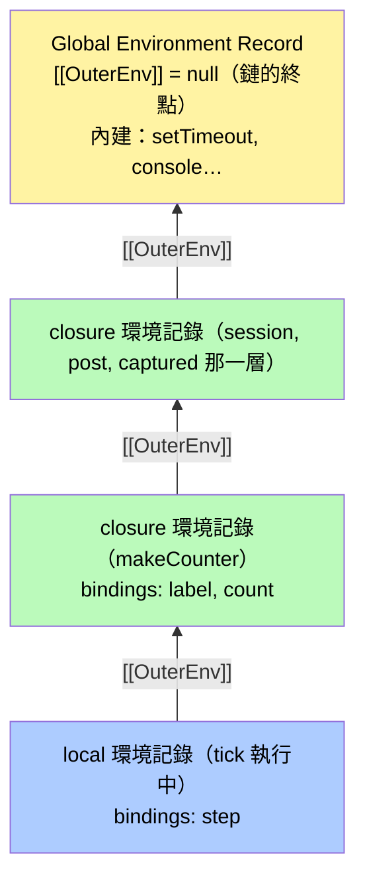

# 詞法作用域 Lexical Scope（面試四段式作答）

> [!info]- 📍 承接13，本篇是編號14
> <mark style="background: #ADCCFFA6;">承接</mark>：[[13-閉包-Closure-私有變數與傳址陷阱]] 裡提到閉包的「兩大基石」之一就是詞法範疇，但只用兩行帶過。這篇把那兩行展開成完整的一篇，補上引擎機制、實測證據與面試作答結構。
> <mark style="background: #BBFABBA6;">互補</mark>：[[05-作用域-scope-global-function-block]] 講的是「有哪幾種作用域」（分類）；這篇講的是「這些作用域憑什麼被串起來、什麼時候定案」（機制）。

> 本篇重點 **a–t，共 20 個**，全篇連續編號。
> 互動版（點擊查找路徑動畫、填空、是非題、申論題）：[[14-詞法作用域-Lexical-Scope-面試四段式.html]]
> 可執行範例：`lexical-scope-demo.js`、`scope-chain-inspector.js`（同資料夾）

---

## 5W1H 速查：讀本篇之前先把座標定好

> [!important]+ 最常被搞錯的一件事：<mark style="background: #FF5582A6;">「寫下來就決定」**不等於**「在 buildtime 決定」</mark>
> a. 詞法作用域的巢狀關係確實是**靜態**的，但真正做這個決定的是 <mark style="background: #ADCCFFA6;">runtime 執行期裡的 Parse／Scope Analysis</mark>——V8 讀到原始碼之後才做。Babel、webpack 那一段只做轉譯與打包，**不看作用域語意**，也不會幫你決定誰是誰的 outer。
> b. 再細一層看，這其實是<mark style="background: #FFF3A3A6;">三個不同時刻</mark>：巢狀關係定案（Parse，每個函式只做一次）→ `[[Environment]]` 被掛上（**函式物件被建立**的那一刻，不是被呼叫的時候）→ 沿著鏈往外查找、找不到才丟 `ReferenceError`（**每次執行都重走一次**）。
> c. 附帶一個最常見的混線：<mark style="background: #BBFABBA6;">變數查找是詞法的（寫下來就決定），`this` 是動態的（呼叫時才決定）</mark>。兩者常被當成同一件事，能主動切開講就是加分題。

| 5W1H | 問題 | 一句話答案 |
|---|---|---|
| **What** 是什麼 | 詞法作用域是什麼？作用域鏈又是什麼？ | 一個識別碼會對應到哪個變數，由它**寫在原始碼的哪個巢狀位置**決定；把每層環境紀錄的 `[[OuterEnv]]` 一路走到底所畫出的**路徑**，就是作用域鏈 |
| **When** 什麼時候 | 這件事是在 buildtime 定案的嗎？ | <mark style="background: #FF5582A6;">不是</mark>。巢狀關係在 **runtime 的 Parse／Scope Analysis** 定案（每個函式只做一次）；`[[Environment]]` 在**函式物件被建立**時掛上；**查找**則是每次執行都重走 |
| **Who** 誰做的 | 誰負責把這條鏈接起來？ | JS 引擎（V8）。規範對應 `OrdinaryFunctionCreate`（§10.2.3）記下 `[[Environment]]`，Environment Record（§9.1）提供 `[[OuterEnv]]` 欄位。<mark style="background: #ADCCFFA6;">跟打包工具無關</mark> |
| **Where** 在哪裡 | 這些環境紀錄實際存在哪？ | 在 RAM 裡。沒被內層引用的變數留在 **Stack Frame**；被內層真的用到而捕獲的才進 **Heap 的 closure 那一層**——DevTools 的 Scope 面板 `Local`／`Closure`／`Script`／`Global` 就是這條鏈 |
| **Which** 哪一種 | 哪些東西是詞法的，哪些不是？ | **變數查找**是詞法的；<mark style="background: #FF5582A6;">`this` 不是</mark>，它是動態的、看呼叫方式。另外 V8 只把「內層真的有引用到」的變數放進 closure 層，沒用到的不會被捕獲 |
| **How** 怎麼做到 | 查找的實際步驟？ | 由內往外**單向**走：本層 Environment Record 找不到 → 沿 `[[OuterEnv]]` 走一格 → 再找不到再走一格 → 走到 Global（`[[OuterEnv]]` 是 `null`）仍找不到，就丟 `ReferenceError` |
| **Why** 為什麼 | 為什麼要用詞法而不是動態？ | 因為「寫在哪就是哪」才能**靜態分析**：編輯器能「跳到定義」、V8 能在 Parse 就決定變數該放 Stack 還是 Heap、閉包才有穩定可預測的語意 |

### 時間軸：這件事發生在哪一格

```text
◄────────── buildtime 建置期 ──────────►◄────────── runtime 執行期 ──────────►
      （你的電腦／CI，部署前就跑完）              （瀏覽器或 Node 載入腳本後）

 ①轉譯        ②打包         ③Parse        ④Bytecode      ⑤每次呼叫／每次執行
 transpile    bundle        解析／AST      Ignition       呼叫幾次做幾次
 ┌────────┐   ┌────────┐   ┌────────┐   ┌────────┐   ┌──────────────────┐
 │Babel   │   │webpack │   │Scanner │   │AST →   │   │ ★ 建函式物件時    │
 │tsc     │──►│Vite    │──►│Parser  │──►│Bytecode│──►│   掛[[Environment]]│
 │SWC     │   │Rollup  │   │★Scope  │   │        │   │ ★ 沿 outer 逐格查 │
 └────────┘   └────────┘   │ Analysis│  └────────┘   │ ★ 找不到才丟      │
  只換寫法      只換位置     └────────┘                │   ReferenceError  │
  巢狀不變      巢狀不變      每個函式只做一次           └──────────────────┘
                            只做「決策」不配置記憶體

 ★ 本篇主題橫跨第 ③ 格與第 ⑤ 格：巢狀關係在 ③ 定案（只做一次），
   實際查找與 ReferenceError 在 ⑤ 發生（每次執行都重來）。
 ★ 第 ① ② 格完全不參與——打包只是搬檔案，不會改變誰包在誰裡面。
```

同一件事，換成詞法作用域自己的階段序列再看一次：

```text
 寫在哪裡（原始碼巢狀位置）
        │
        ▼
 ③ Parse／Scope Analysis：決定誰是誰的 outer（每個函式只做一次）
        │
        ▼
 ⑤-1 函式物件被「建立」：在函式物件上記下 [[Environment]]（掛鉤接上）
        │
        ▼
 ⑤-2 函式被「呼叫」：建立新的 Environment Record，[[OuterEnv]] 指向上一格
        │
        ▼
 ⑤-3 執行到某個識別碼：沿鏈由內往外找 → 找到就停；走到 null 就丟 ReferenceError
```

同一條時間軸用 Mermaid 再畫一次：

```mermaid
flowchart LR
    subgraph BT["buildtime 建置期（部署前跑完，V8 還沒看到程式碼）"]
        T["① 轉譯 transpile<br/>Babel／tsc／SWC<br/>只換寫法，巢狀不變"] --> BU["② 打包 bundle<br/>webpack／Vite／Rollup<br/>只換位置，巢狀不變"]
    end
    subgraph RT1["runtime 執行期 · 每個函式只做一次"]
        P["③ Parse／Scope Analysis<br/>★ 巢狀關係在這裡定案<br/>★ 決定誰是誰的 outer<br/>只做決策，不配置記憶體"] --> BC["④ Ignition 產生 Bytecode<br/>可重複使用"]
    end
    subgraph RT2["runtime 執行期 · 每次呼叫／每次執行都重來"]
        C["⑤-1 函式物件被建立<br/>★ 掛上 &#91;&#91;Environment&#93;&#93;<br/>指向誕生當下的環境紀錄"] --> D["⑤-2 函式被呼叫<br/>新 Environment Record<br/>&#91;&#91;OuterEnv&#93;&#93; 接上上一層"]
        D --> E["⑤-3 執行到某個識別碼<br/>★ 沿鏈由內往外查找<br/>找到就停"]
        E --> F["走到 Global 仍找不到<br/>&#91;&#91;OuterEnv&#93;&#93; = null<br/>★ 丟 ReferenceError"]
    end
    BU --> P
    BC --> C
    E -.->|"再呼叫一次就整包重來"| D
```



---

## 本篇主軸圖：作用域鏈 Scope Chain

![[詞法作用域-scope-chain主軸圖-20260806.png]]

*（上圖：點選 `count` 時的查找路徑——tick 的 local 找不到，沿 outer 走一格到 closure (makeCounter) 找到。之後同主題的追問，都指回這張圖的某一層來講。）*

![[詞法作用域-查找失敗ReferenceError-20260806.png]]

*（上圖：查找 `ghost`，三層全部走完仍找不到，鏈是有盡頭的，走到底就丟 ReferenceError。）*

**(a)** <mark style="background: #FFF3A3A6;">詞法作用域的定義：一個識別碼（Identifier，程式裡的名字）會對應到哪個變數，是由這段程式碼**寫在哪裡**決定的，在原始碼被解析的當下就定案，跟它**被誰呼叫、在哪裡呼叫**完全無關。</mark>

**(b)** 「詞法（Lexical）」這個字來自 **Lexical Analysis（詞法分析）**，也就是編譯器把原始碼切成一個個 token 的階段。叫它「詞法」就是在強調位置在「還沒執行、只是在讀字」時就固定了。它的同義詞是 **靜態作用域（Static Scope）**。

---

## ① 完整脈絡：詞法作用域到底在講什麼

### 1-1 對照組：動態作用域

| 比較項 | 詞法作用域 Lexical（JS 用這個） | 動態作用域 Dynamic |
|---|---|---|
| 誰決定變數的意思 | 程式碼寫下來的巢狀位置 | 執行時的呼叫堆疊（誰呼叫我） |
| 什麼時候定案 | 解析期（執行前） | 執行期（每次呼叫可能不同） |
| 能不能靜態分析 | 可以，所以編輯器能做「跳到定義」 | 難，只能執行看看 |
| 代表語言 | JavaScript、C、Java、Python | Bash 變數、Emacs Lisp、早期 Lisp |

**(c)** 動態作用域是「函式去<mark style="background: #FF5582A6;">呼叫它的人</mark>的環境裡找變數」；同一個函式被 A 呼叫跟被 B 呼叫，看到的東西會不一樣。

**(d)** <mark style="background: #FFF3A3A6;">面試金句：JavaScript 的**變數查找是詞法的（寫下來就決定），`this` 是動態的（呼叫時才決定）**。</mark>這兩件事最常被混在一起，能主動切開講會加分。

### 1-2 引擎怎麼做到的

**(e)** 函式**被建立**的那一刻（不是被呼叫的時候），引擎會在函式物件上記下一個內部欄位 `[[Environment]]`，指向<mark style="background: #FFF3A3A6;">它誕生當下的那個環境紀錄</mark>。規範對應 ECMA-262 的 `OrdinaryFunctionCreate`（§10.2.3）。

**(f)** 每個環境紀錄（Environment Record，§9.1）裡有一個 `outer` 指標指向外層環境，一層接一層串起來就是 **作用域鏈（Scope Chain）**。

**(g)** 查找是<mark style="background: #BBFABBA6;">單向、由內往外</mark>：本層找不到才往 outer 找，一路到最上層還找不到就丟 `ReferenceError`。

**(h)** 所以<mark style="background: #ADCCFFA6;">內層看得到外層，外層看不到內層</mark>——鏈上沒有往下的箭頭。

### 延伸提問：outer 指標固定叫這個名字嗎？outer 指標＝作用域鏈嗎？（2026-09-03）

<mark style="background: #BBFABBA6;">「outer」不是隨口取的暱稱，是 ECMA-262 規範裡真的這樣命名的內部欄位——§9.1 Environment Records 明文規定：「每個 Environment Record 都有一個 `[[OuterEnv]]` 欄位，值是 `null` 或指向外層 Environment Record 的參照。」</mark>所以「outer 指標」這個講法是有規範依據的，不是筆記自己發明的簡稱。

但<mark style="background: #FF5582A6;">「outer 指標」跟「作用域鏈」不是同一個東西，是「一條邊」跟「整條路徑」的關係</mark>：

| | outer 指標（`[[OuterEnv]]`） | 作用域鏈（Scope Chain） |
|---|---|---|
| 是什麼 | **單一個**環境記錄身上的**一個欄位**，只指向**緊鄰**的外一層 | 從內層開始，**反覆跟著** outer 指標一路走到底（`null`）所形成的**整條路徑** |
| 數量 | 每層環境記錄各自只有**一個** | 是把多個 outer 指標**串起來**的結果，不是額外存在的東西 |
| 比喻 | 一節火車車廂跟下一節車廂之間的**掛鉤** | 從車尾走到車頭，把所有掛鉤**依序走過一遍**的那趟路 |

一句話：<mark style="background: #FFF3A3A6;">「作用域鏈」不是一個額外儲存的資料結構，它只是「不斷跟著 outer 指標往外走」這個查找動作所畫出來的路徑</mark>——outer 指標是磚塊，作用域鏈是把磚塊疊起來看到的那道牆。

#### 畫出來：對照本篇最上面的 scope-chain-inspector 實測輸出



查 `count` 的路徑（對應本篇最上面那張「查找路徑」截圖）：`tick` 的 **local** 層沒有 `count` → 沿 `[[OuterEnv]]` 走一格到 **closure(makeCounter)** 這層 → 找到 `count`，停在這裡，不會再往下走到 `C2` 或 `G`。這條「L → C1」的**單步移動**就是 outer 指標；而「L → C1 → C2 → G」這一整條**可能的路徑**，才是作用域鏈。

查一個鏈上沒有的名字（例如 `ghost`）：`L → C1 → C2 → G`，四層全部走完、`G` 的 `[[OuterEnv]]` 是 `null`，無路可走，丟 `ReferenceError: ghost is not defined`——對應本篇上面第二張截圖。

### 1-3 實測證據：真的可以把鏈印出來

用 Node.js 內建的 `node:inspector`（跟 Chrome DevTools 講的是同一套 V8 Inspector Protocol），在 `debugger;` 斷點處把 scopeChain 撈出來。程式碼見同資料夾的 `scope-chain-inspector.js`，實跑輸出：

```text
scope type | 所屬函式     | 這一層看得到的變數
----------------------------------------------------------------------
local      | tick         | step
closure    | makeCounter  | label, count
closure    | -            | session, post, captured
global     | -            | (全域內建：setTimeout、console…)

APP 在鏈上嗎？    false
secret 在鏈上嗎？ false
```

**(i)** <mark style="background: #FFF3A3A6;">V8 只會把「內層真的有引用到」的變數放進 closure 那一層</mark>：`label` 與 `count` 有被 `tick` 用到就在鏈上；`secret` 與 `APP` 沒被用到就**不會**被捕獲。這是判斷「閉包會不會吃記憶體」的關鍵細節，也是多數人講閉包時漏掉的一段。

**(j)** 瀏覽器 DevTools 的 **Sources → 右側 Scope 面板**看到的層級名稱一樣：`Local` ／ `Closure (函式名)` ／ `Script` ／ `Global`。Node 因為模組被包在一層函式裡，頂層會顯示成 `closure` 而不是 `script`——這個差異值得知道，免得對照瀏覽器時以為自己看錯。

---

## ② 沒有這個觀念，會寫出什麼 bug

### 2-1 var 迴圈 ＋ setTimeout（最經典）

```js
for (var i = 0; i < 3; i++) setTimeout(() => console.log(i), 0);
// 3, 3, 3
```

**(k)** 根因不是「setTimeout 太慢」，而是<mark style="background: #FF5582A6;">整個迴圈只有**一個** `i`</mark>：`var` 的環境紀錄以函式為邊界，三個箭頭函式的 `[[Environment]]` 指向**同一個**環境紀錄。

**(l)** 換成 `let` 就變 0,1,2。規範層面的依據是 `CreatePerIterationEnvironment`（ECMA-262 §14.7.4.4）：<mark style="background: #BBFABBA6;">`let` 的 for 迴圈每一輪都建立一個新的環境紀錄</mark>並把上一輪的值複製進去，於是三個閉包各自指向不同的環境紀錄。

### 2-2 把函式搬家，以為變數會跟著改變意思

```js
// utils.js
export function log() { console.log(userId); }   // userId 不在這個檔案

// page.js
const userId = 42;
log();   // ReferenceError: userId is not defined
```

**(m)** <mark style="background: #FF5582A6;">很多人直覺以為「我在有 userId 的地方呼叫它，它就找得到」——這是動態作用域的想像。</mark>詞法作用域下，`log` 在 utils.js 被寫下來，它的鏈就永遠是 utils.js 那一條。

**(n)** 這個 bug 的典型情境是**重構搬檔案**：本來寫在同一個檔案裡、靠外層變數活著的 helper，被抽成獨立模組後就整個壞掉。抽函式之前要先問「它依賴了哪些外層變數」。

### 2-3 遮蔽（Shadowing）＋ 暫時性死區（TDZ）

```js
const name = '外層';
function f() {
  console.log(name);   // 以為印「外層」
  let name = '內層';    // 實際：ReferenceError: Cannot access 'name' before initialization
}
```

**(o)** <mark style="background: #FF5582A6;">只要內層有宣告同名變數，這一層的「名字」就整層被佔走了，引擎**不會**退回外層去找。</mark>宣告雖然寫在下面，但作用域是整個區塊，宣告前的區段就是 TDZ（Temporal Dead Zone，暫時性死區），細節見 [[09-Hoisting-函式宣告vs函式表達式-TDZ]]。

**(p)** 比「印出 undefined」更難察覺的地方在於：<mark style="background: #ADCCFFA6;">錯誤訊息長得像「變數不存在」，真正的原因卻是「變數存在、只是還沒初始化」</mark>。

### 2-4 記憶體：閉包把整個環境紀錄拉住

**(q)** 只要還有函式的 `[[Environment]]` 指著某個環境紀錄，垃圾回收就<mark style="background: #FF5582A6;">不敢回收它</mark>——外層函式明明已經 return 了，變數還活著。機制細節見 [[12-return-清理記憶體-stack-frame與閉包例外]]。

---

## ③ 正確做法：寫 code 時該在哪些時機警覺

| 時機 | 該做什麼 | 為什麼 |
|---|---|---|
| 宣告變數時 | 預設 `const`，要重新賦值才 `let`，不用 `var` | 把作用域縮到最小的區塊，鏈短就不容易誤抓 |
| 迴圈裡建立 callback | 用 `let`，或用參數把值傳進去 | 讓每一輪各自有環境紀錄 |
| 需要「呼叫端的資料」 | 用參數顯式傳，不要靠外層變數偷渡 | 詞法作用域下靠外層變數等於把依賴藏起來 |
| 抽函式／搬模組前 | 先列出它引用的所有外層變數 | 這些是隱形依賴，搬家後就斷了 |
| 不確定捕獲了什麼 | 打斷點看 DevTools 的 Scope 面板，或用 node:inspector 印出來 | 鏈是可以直接看的，不要用猜的 |
| this 出問題時 | 先分清楚是「變數找不到」還是「this 綁錯」 | 箭頭函式救的是 this，救不了變數 |
| 用閉包做私有狀態 | 回傳陣列／物件時切斷參照 | 詞法上是私有的，但參照會漏出去 |

最後一列的「參照會漏出去」就是 [[13-閉包-Closure-私有變數與傳址陷阱]] 的魔王題（`getHistory: () => [...history]`），兩篇是同一件事的前後段。

**(r)** `eval()` 與 `with` 會讓作用域<mark style="background: #FF5582A6;">無法靜態分析</mark>，等於打掉詞法作用域最大的好處（引擎優化、編輯器跳定義、打包工具 tree-shaking），所以嚴格模式限制了它們，實務上直接不要用。

**(s)** 箭頭函式的 `this` 是**詞法綁定**（跟外層一樣），這是 ES6 特地把 `this` 拉回詞法規則的一個例外；一般函式的 `this` 仍然是動態的。

---

## ④ 真實踩坑故事：多顆按鈕「全部」失效

> [!note] 這段取自你自己的除錯紀錄
> 出自 [[13-閉包-Closure-私有變數與傳址陷阱]] 的「實戰除錯：按鈕計數器（Counter）綁定陷阱」小節，面試照講即可，不必另外編故事。

```js
function createCounter(buttonId) {
  let count = 0;
  const button = document.getElementById(buttonId);
  button.addEventListener('click', function () { count++; console.log(count); });
}
createCounter('counter1');
createCounter('counter2');
```

故事線（照這個順序講）：

1. **現象**：做多顆按鈕各自獨立計數，結果畫面上<mark style="background: #FF5582A6;">所有按鈕都沒反應</mark>，看起來像閉包整套寫錯。
2. **誤判**：第一直覺懷疑「是不是每顆按鈕共用到同一個 count」，也就是往經典的 `var` 迴圈陷阱去想。
3. **真因**：某一次 `getElementById` 的 id 打錯，拿到 `null` 再呼叫 `addEventListener` 直接丟 TypeError，<mark style="background: #FF5582A6;">把整段同步程式碼中斷掉</mark>，後面所有按鈕的綁定都沒跑到——所以看起來是「全部壞掉」，根因其實只在第一顆。
4. **詞法作用域在這裡的角色**：<mark style="background: #BBFABBA6;">每呼叫一次 `createCounter` 就產生一份全新的環境紀錄</mark>，`count` 與 `button` 被鎖在各自那一份裡，所以「各按鈕獨立計數」本來就是對的，問題不在作用域。
5. **收尾金句**：這次之後養成一個習慣——<mark style="background: #FFF3A3A6;">出事先看 Scope 面板確認變數真的被捕獲了什麼，而不是憑印象猜閉包</mark>；而且「多個東西同時全壞」通常是同步流程被中斷，不是每個都各自壞。

**(t)** <mark style="background: #FFF3A3A6;">全篇收束金句：作用域在**寫下來的時候**就決定了，`this` 在**被呼叫的時候**才決定；閉包不是額外的功能，只是「詞法作用域」加上「內層函式活得比外層久」這兩件事的自然結果。</mark>

---

## 30 秒濃縮版

> 詞法作用域是說，一個變數指的是誰，看的是這段程式碼**寫在哪一層**，在還沒執行、只是解析原始碼的時候就決定好了，跟它之後被誰呼叫沒有關係。引擎的做法是：函式建立時記住它出生的環境，查變數時由內往外沿著這條鏈找，找不到就 ReferenceError。相對的概念是動態作用域，那是看呼叫者的環境；JavaScript 只有 `this` 是那種動態行為。最常見的坑就是 `var` 加迴圈加 setTimeout 印出 3、3、3，因為三個 callback 共用同一個環境紀錄；換成 `let`，每一輪都會有一份新的。

---

## 互動測驗

完整的填空、是非題、申論題在互動版 HTML：[[14-詞法作用域-Lexical-Scope-面試四段式.html]]

![[詞法作用域-互動是非題-20260806.png]]

*（上圖：互動版的是非題，選完會立刻展開解析。）*

自我檢查用的六個是非題（答案都在 HTML 裡）：

- 函式在「被呼叫」的那一刻才決定它能看到哪些外層變數。
- 內層函式看得到外層變數，外層函式也看得到內層變數。
- 把 `var` 改成 `let`，for 迴圈裡的 setTimeout 就會依序印出 0,1,2。
- 一個內層函式只要寫在外層裡面，外層所有變數都一定會被閉包捕獲、無法被回收。
- 箭頭函式讓 `this` 變成詞法綁定，所以它也讓變數查找變成詞法的。
- 內層宣告了同名的 `let` 之後，在宣告之前使用該名字，引擎會退回外層拿值。

---

## 與其他筆記的關聯（以及為什麼關聯）

| 筆記 | 關聯的原因 |
|---|---|
| 05-作用域-scope-global-function-block | 那篇是「有哪幾種作用域」的分類；這篇是「憑什麼決定、怎麼串成鏈」的機制。分類是名詞，機制是動詞。 |
| 13-閉包-Closure-私有變數與傳址陷阱 | 閉包＝詞法作用域＋函式活得比外層久。那篇是結果與應用，這篇是它的前提；那篇的「兩大基石」之一就是本篇主題。 |
| 12-return-清理記憶體-stack-frame與閉包例外 | 作用域鏈解釋「為什麼還看得到」，那篇解釋「為什麼還沒被回收」——同一件事的兩個提問角度。 |
| 08-函式呼叫核心機制-Execution-Context-與-Parameter-Binding | 環境紀錄是 Execution Context 的組成之一；那篇講呼叫時建立了什麼，這篇講建立時 outer 指向誰。 |
| 09-Hoisting-函式宣告vs函式表達式-TDZ | TDZ 是本篇 2-3 遮蔽陷阱的直接成因，錯誤訊息要靠那篇才解釋得完整。 |
| 04-變數宣告-let-const-var | var／let／const 的差別，本質就是它們在作用域鏈上建立環境紀錄的方式不同。 |

---

## 資料來源（含查證時間）

| 主題 | 連結 | 版本／時間 |
|---|---|---|
| ECMA-262 規範本體（CreatePerIterationEnvironment §14.7.4.4、Environment Records §9.1、OrdinaryFunctionCreate §10.2.3） | https://262.ecma-international.org/16.0/index.html | ECMA-262 第 16 版，2025 年 6 月；2026-08-06 抓取確認 |
| ECMAScript 最新版規範入口 | https://262.ecma-international.org/ | 2026-08-06 查閱 |
| 實測 scope chain 的輸出 | 本地執行 `scope-chain-inspector.js` | Node v22.22.2，2026-08-06 實跑 |
| 按鈕計數器踩坑故事 | 本 vault 的 [[13-閉包-Closure-私有變數與傳址陷阱]] | 該筆記 updated 2026-07-31 |

> [!warning] 未查證項目
> 本篇原本想引用 MDN 的 Closures 頁面定義，但這次抓取被擋下（未成功讀到頁面），因此**沒有**引用它的原文。文中關於 MDN／DevTools 面板名稱的描述屬於既有知識，若要嚴謹引用請自行開 https://developer.mozilla.org/en-US/docs/Web/JavaScript/Guide/Closures 核對。
