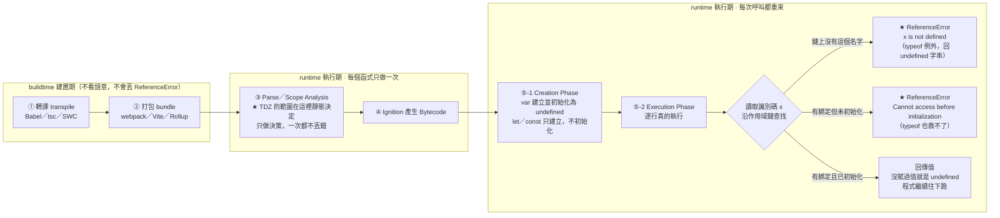

# ReferenceError 與 undefined—「值」與「錯誤」的分界

> 🔖 本篇重點索引：a–k，共 11 個。

---

## 5W1H 速查：讀本篇之前先把座標定好

> [!important]+ 最常被搞錯的一件事：<mark style="background: #FF5582A6;">以為 `typeof` 是萬用護身符</mark>
> a. `typeof` 的「不報錯」特權<mark style="background: #FFF3A3A6;">只對「從頭到尾沒宣告過」的識別碼有效</mark>；變數若是用 `let`／`const` 宣告、只是還在 TDZ 裡，`typeof` <mark style="background: #FF5582A6;">照樣拋 ReferenceError</mark>。本篇 (h) 與「⚠️ 存疑／更正」就是在修正這一點。
> b. 第二個常見誤解：以為 `ReferenceError` 是「語法檢查」或「編譯期」抓到的。<mark style="background: #ADCCFFA6;">不是</mark>——它是**執行到那一行**才被丟出來的執行期錯誤，所以前面的 `console.log` 都會照印，後面的才不會跑。
> c. 第三個誤解：以為 TDZ 是「執行期才決定的區域」。<mark style="background: #BBFABBA6;">TDZ 的範圍在 Parse 階段就靜態決定了（只做一次），但真正丟出 ReferenceError 是執行期的事（每次執行都可能發生）</mark>——決定範圍與丟出錯誤是兩格不同的時間。

| 5W1H | 問題 | 一句話答案 |
|---|---|---|
| **What** 是什麼 | `undefined` 與 `ReferenceError` 各是什麼？ | `undefined` 是**一個值**（原始型別的成員，可以被印出、被比較、被傳遞）；`ReferenceError` 是**一個錯誤物件**，被丟出來就中斷這條執行流 |
| **When** 什麼時候 | 錯誤是在哪一刻被丟出的？ | <mark style="background: #FF5582A6;">執行期、而且是 Execution Phase 逐行執行到那一行的當下</mark>。不是 buildtime、不是 Parse、也不是 Creation Phase |
| **Who** 誰做的 | 誰決定丟錯還是回值？ | JS 引擎在解析識別碼時做的：規範上是 `ResolveBinding` 找綁定、`GetValue` 讀值，讀到**未初始化的綁定**就依規定拋 `ReferenceError` |
| **Where** 在哪裡 | 這個判斷發生在哪？ | 在**作用域鏈**上。沿鏈由內往外找：鏈上完全沒有這個名字 → `not defined`；鏈上有名字但格子還沒初始化 → `Cannot access before initialization` |
| **Which** 哪一種 | 同樣是「找不到」，怎麼分？ | 三種結果要分清楚：<mark style="background: #BBFABBA6;">已宣告已初始化為空 → `undefined`（值）</mark>、<mark style="background: #FFF3A3A6;">已宣告未初始化（TDZ）→ ReferenceError</mark>、<mark style="background: #FF5582A6;">根本沒宣告 → ReferenceError</mark> |
| **How** 怎麼做到 | `var` 與 `let` 為什麼結果不同？ | 差在 Creation Phase：`var` 被建立**並初始化成 `undefined`**，所以提前讀只是拿到值；`let`／`const` 只被建立、**不初始化**，提前讀就是 TDZ 錯誤 |
| **Why** 為什麼 | 為什麼要設計 TDZ？ | 為了<mark style="background: #ADCCFFA6;">把「用了還沒準備好的變數」從沉默的 bug 變成大聲的錯誤</mark>——`var` 的 `undefined` 會一路往下污染，`let` 的 ReferenceError 當場停在出事的那一行 |

### 時間軸：這件事發生在哪一格

```text
◄────────── buildtime 建置期 ──────────►◄────────── runtime 執行期 ──────────►
      （你的電腦／CI，部署前就跑完）              （瀏覽器或 Node 載入腳本後）

 ①轉譯        ②打包         ③Parse        ④Bytecode      ⑤每次呼叫／每次執行
 transpile    bundle        解析／AST      Ignition       呼叫幾次做幾次
 ┌────────┐   ┌────────┐   ┌────────┐   ┌────────┐   ┌──────────────────┐
 │Babel   │   │webpack │   │Scanner │   │AST →   │   │ Creation Phase   │
 │tsc     │──►│Vite    │──►│Parser  │──►│Bytecode│──►│  var→undefined   │
 │SWC     │   │Rollup  │   │★TDZ 範圍│   │        │   │  let/const 不初始│
 └────────┘   └────────┘   │ 靜態決定│   └────────┘   ├──────────────────┤
  不看語意      不看語意     └────────┘                │ Execution Phase  │
  不會報錯      不會報錯      每個函式只做一次           │ ★ 錯誤在這裡丟出  │
                            只做決策不丟錯             └──────────────────┘

 ★ 錯誤是在第 ⑤ 格的 Execution Phase 被丟出的——逐行執行、執行到那一行才炸。
 ★ 第 ③ 格只決定「哪一段程式碼算 TDZ」，它一次都不會丟錯。
 ★ 所以錯誤前面的 console.log 都印得出來，錯誤後面的才不會跑。
```

同一件事，換成「讀一個識別碼」自己的判定序列再看一次：

```text
 執行到 console.log(x) 這一行
        │
        ▼
 沿作用域鏈由內往外找 x 的綁定
        │
        ├─ 鏈上完全沒有 x ──────────────► ★ ReferenceError: x is not defined
        │                                （typeof x 例外，回 "undefined" 不報錯）
        │
        ├─ 有綁定，但還沒初始化（TDZ）───► ★ ReferenceError: Cannot access
        │                                  'x' before initialization
        │                                （typeof 在這裡救不了你）
        │
        └─ 有綁定，且已初始化 ───────────► 回傳那個值
                                          （沒賦過值就是 undefined，程式繼續跑）
```

同一條時間軸用 Mermaid 再畫一次：



---

## 重點整理

**(a)** <mark style="background: #ADCCFFA6;">一句話分界</mark>：`undefined` 是<mark style="background: #FFF3A3A6;">一個「值（Value）」</mark>，`ReferenceError` 是<mark style="background: #FF5582A6;">一個「錯誤（Error）」</mark>。兩者都跟「找不到東西」有關，但層級完全不同——前者程式照跑，後者程式當場中斷。

**(b)** <mark style="background: #BBFABBA6;">白話比喻</mark>：

- `undefined`＝<mark style="background: #FFF3A3A6;">位子佔了，但位子上沒人</mark>。變數已經宣告，只是還沒被賦值。
- `ReferenceError`＝<mark style="background: #FF5582A6;">你試圖叫一個根本不存在的人</mark>。引擎在目前的範疇（Scope，作用域）裡完全找不到這個識別碼的宣告。

**(c)** <mark style="background: #ADCCFFA6;">undefined 的產生時機</mark>：宣告變數卻沒給初始值時，JavaScript 會自動塞一個 `undefined` 當預設值。

```js
let a;
console.log(a);        // undefined
console.log(typeof a); // "undefined"
```

**(d)** <mark style="background: #D2B3FFA6;">可以主動賦值 undefined，但實務上不建議</mark>：語法上 `x = undefined` 合法，不過表達「這裡刻意是空的」時，慣例會用 `null`——`null` 是「開發者主動放的空」，`undefined` 是「引擎自動給的空」，語意上要分開。

**(e)** <mark style="background: #FF5582A6;">ReferenceError 的產生時機</mark>：存取一個完全沒有用 `var`／`let`／`const` 宣告過的識別碼（Identifier，標識符）。

```js
console.log(b); // Uncaught ReferenceError: b is not defined
```

**(f)** <mark style="background: #FFB8EBA6;">核心對比表</mark>：

| 特性 | `undefined` | `ReferenceError` |
|---|---|---|
| 性質 | 原始型別（Primitive Type）的一個值 | 執行期錯誤（Runtime Error） |
| 變數狀態 | 已宣告，但未初始化 | 未宣告，或處於暫時性死區（TDZ） |
| 白話 | 「我知道這東西，但還不知道它是什麼」 | 「我根本沒聽過這東西」 |
| 對程式的影響 | 程式繼續執行 | 當場中斷，後面的程式碼不會跑 |

**(g)** <mark style="background: #FF5582A6;">陷阱—`typeof` 會吃掉未宣告變數的錯誤</mark>：對一個<mark style="background: #FFF3A3A6;">從未宣告</mark>的變數用 `typeof`，不但不會報錯，還會乖乖回傳字串 `"undefined"`。這是 JavaScript 為了向後相容保留的特例，除錯時很容易被它蓋掉真正的 `ReferenceError`。

```js
console.log(typeof notDeclaredVar); // "undefined"（不報錯！）
console.log(notDeclaredVar);        // ReferenceError（這才會炸）
```

**(h)** <mark style="background: #FF5582A6;">陷阱的陷阱—TDZ 不吃這一套</mark>：`typeof` 的保護<mark style="background: #FF5582A6;">只對「完全未宣告」有效</mark>。若變數是用 `let`／`const` 宣告、但還在暫時性死區（TDZ，Temporal Dead Zone）裡，`typeof` <mark style="background: #BBFABBA6;">照樣拋 ReferenceError</mark>。這點 Gemini 原始回答的對比表寫錯了，見下方「⚠️ 存疑／更正」。

```js
console.log(typeof c); // ❌ ReferenceError: Cannot access 'c' before initialization
let c = 10;

console.log(typeof d); // ✅ "undefined"（d 從頭到尾沒宣告過）
```

**(i)** <mark style="background: #ADCCFFA6;">三種最常見的觸發情境</mark>：

- 拼字錯誤：宣告了 `myVariable`，呼叫時打成 `myVarible`。
- 作用域問題：在函式外部去存取函式內部宣告的變數。
- 暫時性死區（TDZ）：在 `let`／`const` 宣告之前就先使用該變數。

**(j)** <mark style="background: #BBFABBA6;">為什麼 `var` 不會有 TDZ 問題</mark>：`var` 在提升（Hoisting）階段就會被<mark style="background: #FFF3A3A6;">初始化為 `undefined`</mark>，所以提前存取只是拿到 `undefined`；`let`／`const` 雖然也會被提升，但<mark style="background: #FF5582A6;">不會初始化</mark>，在賦值那行之前存取一律是 ReferenceError。這正是 TDZ 的設計目的——把「用了還沒準備好的變數」從沉默的 bug 變成大聲的錯誤。

```js
console.log(v); // undefined（var 提升後已初始化）
var v = 1;

console.log(l); // ReferenceError（let 提升但未初始化 → TDZ）
let l = 1;
```

**(k)** <mark style="background: #ADCCFFA6;">undefined 的另一種產生時機——函式沒有寫 `return`，呼叫結果就是 `undefined`</mark>。跟 (c) 「宣告變數沒賦值」是同一個原理的另一個場景：函式本體如果從頭到尾沒有 `return` 陳述式（或寫了 `return;` 不帶值），這次呼叫這個**表達式**求值出來的結果，JS 引擎一律自動補 `undefined`——跟函式內部做了什麼事、有沒有印出東西、有沒有宣告區域變數完全無關。

> 出處：`JavaScript-practicing` 練習，`const b`／`let b` 同名帶出的疑惑

```js
const b = function(){
    let b = "benq";   // 這行只是「賦值給函式內部的區域變數」，不是「回傳」
    // 沒有寫 return
}
console.log("b", b());   // 印出 b undefined
```

外層 `console.log("b", b())` 裡的 `b()` 是**呼叫**外層那個變數 `b` 存的函式；函式本體內的 `let b = "benq"` 只是在函式自己的 Function Scope 裡新建一個**完全獨立、剛好同名**的區域變數（兩個 `b` 是兩個不同的儲存位置，內層 `b` 會遮蔽外層 `b`，但這件事在這裡不是重點——見 [[05-作用域-scope-global-function-block]] 考點四），重點是**這個區域變數從頭到尾沒有被 `return` 出去**。函式執行完本體、沒遇到任何 `return`，執行到 `}` 直接結束，JS 引擎對「這次呼叫」的求值結果就是 `undefined`——所以印出來是 `b undefined`，不是 `b benq`。

> **要印出 `"benq"`，必須補上 `return b;`：**
> ```js
> const b = function(){
>     let b = "benq";
>     return b;      // ✅ 補這行，把值帶出函式本體
> }
> console.log("b", b()); // b benq
> ```
> 這跟 [[05-作用域-scope-global-function-block]] 考點四的 `noSideEffectCanIAccess` 例子是同一個道理：函式內部宣告的變數要「被外部拿到」，唯一合法通道就是 `return`，沒寫 `return` 不是「值不見了」，是「這次呼叫的求值結果從一開始就是 `undefined`」，跟 ReferenceError（identifier 找不到）是完全不同的兩件事，不要混為一談。

## 各對話來源

### ReferenceError 與 Undefined 差異（2026-08）— https://gemini.google.com/app/e4c3fe3d87ee0a0f

<mark style="background: #FFF3A3A6;">使用者：referenceerror 跟 undefined 有什麼關係</mark>

Gemini：先給核心差異摘要——`undefined` 是「值」、`ReferenceError` 是「錯誤」（重點 a、b）；分別說明 `undefined` 的產生時機與 `null` 的使用慣例（重點 c、d）；說明 `ReferenceError` 來自存取未宣告的識別碼（重點 e）；附上四欄對比表（重點 f）；提出 `typeof` 對未宣告變數不報錯的陷阱（重點 g）；最後列出三種常見觸發情境與 TDZ 範例（重點 i）。

## ⚠️ 存疑／更正

<mark style="background: #FF5582A6;">Gemini 對比表中「`typeof` 結果」那一列把 ReferenceError 情境一律寫成 `"undefined"`，這是不完整的說法。</mark>正確情況分兩種：

| 變數狀態 | `typeof x` 的結果 |
|---|---|
| 從未宣告過（undeclared） | 回傳 `"undefined"`，<mark style="background: #BBFABBA6;">不報錯</mark> |
| 用 `let`／`const` 宣告、仍在 TDZ 內 | <mark style="background: #FF5582A6;">拋 ReferenceError</mark>，不會回傳字串 |

也就是說，Gemini 自己在同一則回答裡先寫「TDZ 屬於 ReferenceError」、又在表格裡宣稱這類情況 `typeof` 會回 `"undefined"`，前後互相矛盾。本篇重點 (h) 已修正並補上可自行驗證的程式碼；此行為在 ECMA-262 規範中屬於 `GetValue` 對未初始化繫結（uninitialized binding）拋錯的規定，見下方資料來源。

## 資料來源（含查證時間）

> 查證日期：2026-08-08（Gemini 對話為 2026-08；表格的 `typeof` 描述已依 MDN 與 ECMA-262 更正）

| 主題 | 連結 | 版本／時間 |
|---|---|---|
| 本篇 Gemini 對話原文 | [ReferenceError 與 Undefined 差異](https://gemini.google.com/app/e4c3fe3d87ee0a0f) | 2026-08 |
| `typeof` 運算子與 TDZ 例外說明 | [MDN — typeof](https://developer.mozilla.org/en-US/docs/Web/JavaScript/Reference/Operators/typeof) | MDN，持續更新 |
| 暫時性死區（TDZ）定義 | [MDN — let（Temporal dead zone）](https://developer.mozilla.org/en-US/docs/Web/JavaScript/Reference/Statements/let) | MDN，持續更新 |
| `undefined` 原始值定義 | [MDN — undefined](https://developer.mozilla.org/en-US/docs/Web/JavaScript/Reference/Global_Objects/undefined) | MDN，持續更新 |
| `ReferenceError` 物件 | [MDN — ReferenceError](https://developer.mozilla.org/en-US/docs/Web/JavaScript/Reference/Global_Objects/ReferenceError) | MDN，持續更新 |
| 規範層級：未初始化繫結拋錯 | [ECMA-262 — ResolveBinding / GetValue](https://tc39.es/ecma262/) | TC39 最新草案 |

## 相關筆記

- [[09-Hoisting-函式宣告vs函式表達式-TDZ]]——關聯原因：本篇 (h)(j) 的 TDZ 行為，根源就是提升階段「有沒有順便初始化」的差異；那篇講機制，本篇講機制造成的錯誤訊息長什麼樣。
- [[04-變數宣告-let-const-var]]——關聯原因：`var` 與 `let`／`const` 的宣告差異，直接決定你拿到的是 `undefined` 還是 `ReferenceError`，是本篇 (j) 的前置知識。
- [[05-作用域-scope-global-function-block]]——關聯原因：本篇 (i) 提到的「作用域問題」型 ReferenceError，要先懂 scope chain（作用域鏈）查找失敗才會拋錯這件事。
- [[07-identifier-vs-property-var全域變數]]——關聯原因：解釋為什麼 `window.notExist` 回傳 `undefined`，而裸寫 `notExist` 卻是 ReferenceError——存取「屬性」與存取「識別碼」走的是兩條完全不同的路徑，這是本篇 (g) 陷阱的底層成因。
- [[常見錯誤-串聯比較運算子-chained-comparison]]——關聯原因：同屬「JS 常見錯誤圖鑑」系列，一個是語意錯（不報錯但結果錯），一個是執行期錯（直接炸），適合放在一起對照複習。
