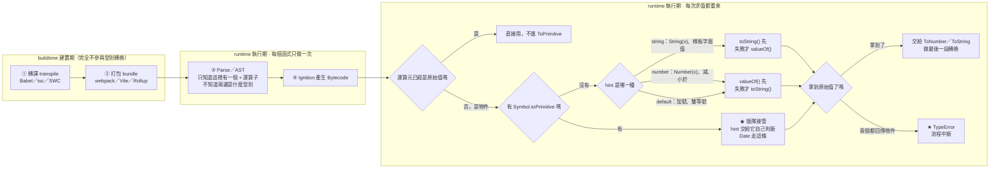

# ToPrimitive／ToNumber／ToString：型別轉換的抽象操作，valueOf 到底在幹嘛

> [!info]- 📍 承接 03/字串方法，本篇編號 15
> <mark style="background: #ADCCFFA6;">起點</mark>：`JavaScript-practicing/smallest-divisible-digit-product.js` 裡誤寫成 `Number(digits).reduce(...)`（對整個陣列做 `Number()`），追查「為什麼 `Number(陣列)` 會變成 `NaN`」一路查到 JS 語言底層統一的型別轉換機制。
> <mark style="background: #BBFABBA6;">跟 [[JavaScript-字串方法]] 的分工</mark>：那篇講「`toString()`/`String()` 實際用起來會怎樣」（現象）；這篇講「底層那套規則到底怎麼運作」（機制）。

---

## 5W1H 速查：讀本篇之前先把座標定好

> [!important]+ 最常被搞錯的一件事：<mark style="background: #FF5582A6;">以為 `Number(陣列)` 是 `NaN`，是因為「JS 不會轉陣列」</mark>
> a. 真正的原因是：<mark style="background: #FFF3A3A6;">陣列**沒有覆寫** `valueOf()`</mark>，繼承到的是 `Object.prototype.valueOf()` 那個「回傳物件自己」的無用版本 —— 交不出原始值就算**失敗**，只好退去試 `toString()`，得到 `"8,6"` 這種帶逗號的字串，再丟給 `ToNumber` 才變成 `NaN`。整條路是走完的，不是「不會轉」。
> b. 第二個常見誤解：以為 `+` 的 hint 是 `"string"`。<mark style="background: #ADCCFFA6;">`+` 的 hint 其實是 `"default"`，順序跟 `"number"` 一樣是 valueOf 先</mark>；它之所以常常變成字串接尾，是因為兩邊都交不出原始值、被迫退到 `toString()`，不是因為它「偏好字串」。
> c. 第三個誤解：以為這是編譯期就算好的。<mark style="background: #BBFABBA6;">整套抽象操作是執行期、每次求值都重跑一次的事</mark>——Babel 與 webpack 不會幫你先把 `[1,2] + [3,4]` 算成 `"1,23,4"`，它們根本不看這件事。

| 5W1H | 問題 | 一句話答案 |
|---|---|---|
| **What** 是什麼 | ToPrimitive／ToNumber／ToString 是什麼？ | ECMA-262 規範裡的**抽象操作（Abstract Operations）**——規範用來定義語言行為的內部步驟，你沒辦法直接呼叫，但每一行牽涉型別轉換的程式碼背後都在跑它 |
| **When** 什麼時候 | 它在哪一格發生？ | <mark style="background: #FF5582A6;">執行期，而且是「每次求值都重跑一次」</mark>。同一行 `x + y` 跑在迴圈裡一百次，這套流程就完整跑一百次 |
| **Who** 誰觸發 | 誰會叫到它？ | `Number(x)`、`String(x)`、`x + y`、`x == y`、樣板字面值、陣列 `join()`⋯⋯<mark style="background: #ADCCFFA6;">全部共用同一套底層規則</mark>，不是每個函式各寫一套 |
| **Where** 在哪裡 | 它實際去找什麼？ | 去物件身上（沿原型鏈）找三個方法：`Symbol.toPrimitive` → `valueOf()` → `toString()`。找不到覆寫版本就用 `Object.prototype` 繼承來的那個無用版本 |
| **Which** 哪一種 | hint 有哪幾種、順序差在哪？ | a. `"number"`（`Number(x)`、`x - y`、`x < y`）→ valueOf 先。b. `"string"`（`String(x)`、樣板字面值）→ toString 先。c. `"default"`（`x + y`、`x == y`）→ 跟 number 同順序。<mark style="background: #D2B3FFA6;">`Date` 例外，它自訂 `Symbol.toPrimitive` 把 default 當字串處理</mark> |
| **How** 怎麼判定失敗 | 什麼叫「失敗」？失敗之後呢？ | 「回傳的**還是物件**」就算失敗，跳去試下一個方法；<mark style="background: #FF5582A6;">兩個都交不出原始值 → 直接丟 `TypeError`</mark> |
| **Why** 為什麼 | 為什麼 `Number(['8','6'])` 是 `NaN`？ | 陣列沒覆寫 `valueOf()` → 回傳自己（失敗）→ 退去 `toString()` → 得到 `"8,6"` → `ToNumber("8,6")` 不是合法數字字面值格式 → `NaN` |

### 時間軸：這件事發生在哪一格

```text
◄────────── buildtime 建置期 ──────────►◄────────── runtime 執行期 ──────────►
      （你的電腦／CI，部署前就跑完）              （瀏覽器或 Node 載入腳本後）

 ①轉譯        ②打包         ③Parse        ④Bytecode      ⑤每次求值都重來
 transpile    bundle        解析／AST      Ignition       求值幾次做幾次
 ┌────────┐   ┌────────┐   ┌────────┐   ┌────────┐   ┌──────────────────┐
 │Babel   │   │webpack │   │Scanner │   │AST →   │   │ ★ ToPrimitive     │
 │tsc     │──►│Vite    │──►│Parser  │──►│Bytecode│──►│ ★ ToNumber        │
 │SWC     │   │Rollup  │   │只知道這 │   │        │   │ ★ ToString        │
 └────────┘   └────────┘   │是個 +   │   └────────┘   │ ★ 可能丟 TypeError│
  不會幫你算    不會幫你算    └────────┘                └──────────────────┘
  [1,2]+[3,4]  [1,2]+[3,4]  每個函式只做一次            同一行跑 100 次
                            不知道兩邊是什麼型別         就整套跑 100 次

 ★ 型別轉換整套落在第 ⑤ 格：它需要「值」，而值只有執行期才存在。
 ★ 第 ③ 格只看得到「這裡有一個 + 運算子」，看不到兩邊會是陣列還是數字。
```

同一件事，換成 ToPrimitive 自己的抽象操作順序再看一次：

```text
 求值 x + y（每次執行到這一行都重跑）
        │
        ▼
 x 已經是原始值？ ──是──► 直接用，不進 ToPrimitive
        │否
        ▼
 ToPrimitive(x, hint)
        │
        ├─ 步驟 1：物件有 Symbol.toPrimitive 嗎？
        │      └─是─► ★ 插隊接管，hint 直接交給它自己判斷（Date 走這條）
        │
        ├─ 步驟 2：hint = "string"  ──► toString() ──失敗──► valueOf()
        │          hint = "number"  ──► valueOf()  ──失敗──► toString()
        │          hint = "default" ──► 同 number 順序（+ 與 == 走這條）
        │
        ├─ 步驟 3：拿到原始值 ──────► 交給 ToNumber／ToString 做最後一段
        │
        └─ 步驟 3'：兩個都回傳物件 ─► ★ TypeError（整條流程到此中斷）
```

同一條時間軸用 Mermaid 再畫一次：



---

## (a) 為什麼需要一套統一的轉換機制？

JS 到處都在「隱式」把值轉成別的型別：`Number(x)`、`String(x)`、`x + y`、`x == y`、樣板字面值 `` `${x}` ``、陣列 `join()`……這些場景**全部共用同一套底層規則**，不是每個函式各自寫一套轉換邏輯。這套規則在 ECMA-262 規範裡叫**抽象操作（Abstract Operations）**，跟你平常寫的函式一樣有輸入輸出，只是它是**規範用來定義語言行為的內部操作**，你沒辦法直接呼叫它，但每一行牽涉到型別轉換的程式碼背後都在跑它。

跟這篇最相關的三個：

| 抽象操作 | 誰會觸發它 | 目的 |
|---|---|---|
| **ToPrimitive** | ToNumber／ToString 遇到物件時，會先呼叫這個 | 把物件「降級」成原始值 |
| **ToNumber** | `Number(x)`、`x - y`、`x * y`、`x < y`… | 把任何值轉成 number |
| **ToString** | `String(x)`、樣板字面值、`x + ""` … | 把任何值轉成 string |

## (b) `valueOf()`：物件「降級」成原始值的第一個嘗試

每個物件都繼承了 `Object.prototype.valueOf()`，**預設行為是回傳物件自己**：

```js
const obj = {a: 1};
obj.valueOf() === obj;  // true —— 沒有真的「降級」，回傳的還是同一個物件
```

這個預設版本**沒有用**——回傳的仍然是物件，不是原始值。所以內建型別幾乎都**覆寫**了自己的 `valueOf()`，回傳真正有意義的原始值：

```js
new Number(42).valueOf();  // 42（number 原始值）
new Date(0).valueOf();     // 0（自 1970/1/1 起的毫秒數，number）
```

**陣列沒有覆寫 `valueOf()`**，繼承的還是 `Object.prototype.valueOf()` 那個「回傳自己」的無用版本——**這就是為什麼 `Number(陣列)` 最終會落到 `toString()` 身上**：`valueOf()` 交不出原始值，只好退而求其次試 `toString()`。

**自訂 `valueOf()` 可以讓你的物件「參與」運算**，這是它存在的意義：

```js
const money = { amount: 100, valueOf() { return this.amount; } };
money + 50;   // 150 —— 走了自訂的 valueOf()，不是字串接尾
```

## (c) ToPrimitive 演算法：先試誰、後試誰

`ToPrimitive(input, hint)` 的 `hint` 有三種：`"number"`、`"string"`、`"default"`，決定「先試 `valueOf()` 還是先試 `toString()`」：

| hint | 觸發場景 | 嘗試順序 |
|---|---|---|
| `"number"` | `Number(x)`、`x - y`、`x < y`、一元 `+x`… | `valueOf()` 先，失敗才 `toString()` |
| `"string"` | `String(x)`、` `${x}` ` 樣板字面值… | `toString()` 先，失敗才 `valueOf()` |
| `"default"` | `x + y`（不確定是加法還是字串接）、`x == y` | `valueOf()` 先，失敗才 `toString()`（跟 number 順序一樣） |

「失敗」的定義：那個方法**回傳的還是物件**（不是原始值）就算失敗，跳去試下一個；兩個都交不出原始值，直接丟 `TypeError`。

**現代規範還有一個插隊機制**：如果物件自己定義了 `Symbol.toPrimitive` 方法，**這個方法會被優先呼叫**，直接接管整個轉換過程，連 hint 是什麼都會傳給它自己判斷，`valueOf`/`toString` 反而不會被用到。

## (d) 實測驗證：經典陷阱與 Date 的騷操作

**陷阱一：`[1,2] + [3,4]` 為什麼是字串接尾，不是數字相加？**

```js
[1,2] + [3,4]   // "1,23,4"
```

`+` 觸發 `hint = "default"`：兩個陣列都先試 `valueOf()`（繼承來的，回傳自己，失敗）→ 退而求其次 `toString()`（陣列的 toString 是逗號接元素，見 [[JavaScript-字串方法]]）→ `[1,2]` 變 `"1,2"`，`[3,4]` 變 `"3,4"` → 兩個字串用 `+` 接起來 → `"1,23,4"`。完全沒有進到「兩個陣列相加」這種語意，從頭到尾都是字串操作。

**陷阱二：`Date` 是少數自己實作 `Symbol.toPrimitive` 的內建物件，`+` 跟 `-` 對它的行為完全不同**

```js
const d = new Date(2024, 0, 1);
d + '';   // "Mon Jan 01 2024 00:00:00 GMT+0800 (台北標準時間)"  ← hint="default"，Date 自己選擇當字串
d - 0;    // 1704038400000                                        ← hint="number"，Date 自己選擇當時間戳記數字
typeof Date.prototype[Symbol.toPrimitive];  // "function" —— 證實 Date 真的自訂了這個插隊方法
```

`Date` 刻意把 `"default"` 這個 hint 也當成字串處理（跟一般物件走 valueOf 優先不一樣），所以 `+` 對日期做的是字串接尾，`-`／`*`／`<` 這類明確要數字的場景才會拿到時間戳記——這也是 JS 面試裡「`new Date() + 1` 跟 `new Date() - 1` 結果為什麼差這麼多」的標準考點。

## (e) 回到起點：`Number(digits)` 為什麼是 `NaN`

```js
const digits = ['8', '6'];
Number(digits);
```

`Number()` 觸發 `ToNumber`，`digits` 是物件（陣列本質上是物件）→ 先做 `ToPrimitive(digits, "number")` → `valueOf()`（繼承的，回傳自己，失敗）→ `toString()`（陣列逗號接元素）→ `"8,6"` → 對這個字串做 `ToNumber("8,6")`，`"8,6"` 不是合法數字字面值格式 → `NaN`。完整的錯誤鏈追蹤見 [[JavaScript-字串方法]] 的 `Number(digits).reduce(...)` 段落。

## (f) 順帶回收：`String(null)` 為什麼不會像 `null.toString()` 一樣噴錯

`ToString(argument)` 這個抽象操作**先看 `argument` 的型別**再決定怎麼轉，對 `Null`／`Undefined` 型別直接寫死「回傳字串常數 `"null"`／`"undefined"`」，全程不做任何屬性存取；而 `null.toString()` 得先做「點屬性」這個動作，`null`/`undefined` 是唯二**不能被裝箱（autobox）**成包裝物件的原始值，點屬性當場依規範丟 `TypeError`，連 `.toString` 這個方法存不存在都還沒查到。兩條完全不同的路，這就是差異的根源。
