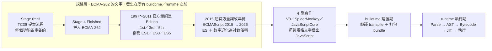

# ECMA-262 標準編號與 ES 俗稱 — 為何規格書不寫「我是 ES 幾」

本篇重點 a–i，共 9 個

---

## 5W1H 速查：讀本篇之前先把座標定好

> [!important]+ 最常被搞錯的一件事：<mark style="background: #FF5582A6;">「ECMA-262 就是 JavaScript」這句話中間漏了一層</mark>
> 正確的鏈是 <mark style="background: #ADCCFFA6;">ECMA-262（標準編號）→ ECMAScript（規格書裡定義的標準語言）→ JavaScript（實作 ECMAScript 再加上 DOM／BOM 的語言）</mark>，三者不是同義詞，而是三個層次。連帶還有第二個誤會：翻遍規格書也找不到「ES6」這三個字——官方量詞是 <mark style="background: #FFF3A3A6;">Edition（第幾版）</mark>，2015 年之後改用年份，「ES ＋ 數字」從頭到尾都只是社群俗稱。對應本篇 (d)、(e)、(g)。

| 5W1H | 問題 | 一句話答案 |
|---|---|---|
| **What** 是什麼 | ECMA-262 到底是什麼？ | 一組<mark style="background: #ADCCFFA6;">標準編號</mark>，不是版本名稱。ECMA 用流水號區分它管轄的各種標準，262 號這一本記載 ECMAScript 語言規格，402 號記載國際化 API |
| **When** 什麼時候 | 什麼時候不再叫「ES 幾」？ | <mark style="background: #FFF3A3A6;">2015 年</mark>。TC39 改成每年定期發布，官方名稱同時改成年份（ECMAScript 2015、ECMAScript 2026）；在那之前官方一律寫 5th Edition 這種 Edition 制 |
| **Who** 誰做的 | 誰寫規格、誰取俗稱？ | 規格文字由 <mark style="background: #ADCCFFA6;">TC39</mark>（Ecma International 底下第 39 號技術委員會）撰寫審查；「ES6」這個叫法是開發者社群自己叫出來的，沒有任何官方文件這樣寫 |
| **Where** 在哪裡 | 這份東西「存在」在哪一層？ | 存在於<mark style="background: #BBFABBA6;">規格文字那一層</mark>，它是寫給引擎實作者看的文件，<mark style="background: #FF5582A6;">不是任何執行期物件</mark>。真正在 RAM 裡跑的是引擎照它做出來的實作 |
| **Which** 哪一種 | 哪些語言算 ECMAScript 的實作？ | JavaScript、ActionScript（Flash）、JScript／JScript .NET（早期 IE）、TypeScript（超集，最後仍轉譯回標準 ECMAScript）、Qt Script。其中 ActionScript 與 JScript 已退場，<mark style="background: #BBFABBA6;">實務上只剩 JavaScript 與 TypeScript</mark> |
| **How** 怎麼做到 | 俗稱怎麼對回官方名稱？ | ES5 ＝ ECMA-262 5th Edition；ES6 ＝ ECMAScript 2015；ES2026 ＝第 17 版。口訣：<mark style="background: #BBFABBA6;">ES6 之前查 Edition，ES6 之後查年份</mark> |
| **Why** 為什麼 | 為什麼要放棄「ES ＋ 數字」？ | 因為大版本制被 ES4 拖垮了。改成每年發一版、版號用年份之後，每個功能各自走 TC39 提案流程，不必再為了湊一個大版號互相等待 |

### 時間軸：規格的命名史，以及它站在 buildtime／runtime 之前

```text
◄════════════ 規格層：ECMA-262 的「文字」 ════════════►
   這一層發生在所有 buildtime 與 runtime 之前。
   它是寫給引擎實作者看的文件，不是執行期的任何東西。

【TC39 提案流程】每個功能各走各的，走完才進規格書
  Stage 0 ───► Stage 1 ───► Stage 2 ───► Stage 3 ───► Stage 4
  Strawperson  Proposal     Draft        Candidate    Finished
  隨口提案      有冠軍推動    寫成規格文字  引擎試作回饋  併入 ECMA-262
                                                          │
【ECMA-262 的命名史】◄─────────────────────────────────────┘
  1997      1998   1999    2008      2009    2011    2015          2026
  1st Ed.   2nd    3rd     ES4 放棄  5th     5.1     6th           17th
  ＝ES1     ＝ES2  ＝ES3             ＝ES5           ＝ES2015 ★     ＝ES2026
  ├────────── 官方量詞是 Edition ──────────┤├──── 官方量詞是年份 ────┤
                                            ★ 命名制度轉折點：
                                              從此官方用年份，
                                              「ES ＋ 數字」退化成俗稱
                                                          │
  規格定案之後，才輪得到下面兩層 ◄────────────────────────┘
      引擎實作（V8／SpiderMonkey／JavaScriptCore）
        └─► 你的 buildtime 建置期（轉譯 transpile ＋ 打包 bundle）
              └─► runtime 執行期（Parse → AST → Bytecode → JIT → 執行）
```

同一件事用 Mermaid 再畫一次：



> [!info]+ 一句話驗證法：這個名字是「官方的」還是「口語的」？
> a. 查得到對應的 Edition 或年份 → 官方名稱，例如 5th Edition、ECMAScript 2015。
> b. 只在部落格、面試、社群聊天出現 → 俗稱，例如 ES6、ES7、ES8。
> c. 兩者指的往往是<mark style="background: #BBFABBA6;">同一份文件</mark>，不是兩個版本，別被嚇到以為自己讀錯本。

---

## 重點整理

a. <mark style="background: #ADCCFF;">ECMA-262</mark> 是一組「標準編號」而不是版本名稱。ECMA（European Computer Manufacturers Association，歐洲電腦製造商協會）用流水編號來區分它管轄的各種技術標準，例如 ECMA-402 是國際化 API（Internationalization API）標準，而 ECMA-262 專門用來記載 ECMAScript 這個語言的規格。

b. <mark style="background: #ADCCFF;">ECMAScript</mark> 是 ECMA-262 規格書裡面所定義的那個「標準語言」本身，它只規範語法、型別、內建物件與抽象操作。

c. <mark style="background: #ADCCFF;">JavaScript</mark> 則是「基於 ECMAScript 標準所做出來的實作與延伸」。瀏覽器裡的 JavaScript 除了實作 ECMAScript 核心語法之外，還多了 DOM（Document Object Model，文件物件模型）與 BOM（Browser Object Model，瀏覽器物件模型）這些規格書裡根本沒有的 API。

d. <mark style="background: #FFF3A3;">三者的正確關係鏈</mark>：ECMA-262（規格書編號）→ 內容定義了 ECMAScript（標準語言）→ JavaScript（實作 ECMAScript 並加上宿主環境 API 的語言）。Abby 原本說「ECMA-262 就是 JavaScript 語言」大體正確但不夠精準，差在中間漏掉了 ECMAScript 這一層。

e. <mark style="background: #FF5582;">規格書裡找不到「ES6」這種字眼是正常的</mark>，不要以為自己讀錯版本。官方在封面與內文用的量詞是 <mark style="background: #ADCCFF;">Edition（第幾版）</mark>，例如俗稱的 ES5，正式名稱是 ECMA-262 5th Edition。

f. 2015 年起 <mark style="background: #ADCCFF;">TC39</mark>（Technical Committee 39，ECMA 底下負責 ECMAScript 的第 39 號技術委員會）把發布模式改成「每年定期發布」，官方名稱也改成按年份命名，例如 ECMAScript 2015、ECMAScript 2026。因此「ES＋數字」從此退化成開發者之間口語溝通用的俗稱，而不是標準文件上的正式標題。

g. <mark style="background: #FFB8EB;">ES6 就是 ECMAScript 2015</mark>，這是同一份文件的兩種叫法，前者是社群俗稱、後者是官方年份名稱。

h. 除了 JavaScript 之外，歷史上還有其他語言是照 ECMAScript 規格實作出來的：
   - ActionScript：Adobe（前身 Macromedia）開發，Flash 的核心語言，ActionScript 3.0 大量參考了當時還在草擬中的 ES4。
   - JScript / JScript .NET：微軟在 1990 年代為了對抗 Netscape 的 JavaScript 而推出的實作，用在早期 Internet Explorer 與 Windows 腳本環境。
   - TypeScript：嚴格說是 JavaScript 的超集（Superset），完整遵循 ECMAScript 語法規格，在編譯階段額外加上型別系統，最後仍轉譯回標準 ECMAScript。
   - Qt Script：嵌入式 C++ 框架 Qt 曾提供的腳本語言，直接實作 ECMA-262（ES3 / ES5），讓 C++ 應用具備腳本擴充能力。

i. <mark style="background: #D2B3FF;">現況備註</mark>：ActionScript 與 JScript 已隨 Flash 和舊版 IE 淘汰而退場，目前實務上幾乎只剩 JavaScript 與 TypeScript 在實作這份規格。

## 關聯筆記（附關聯原因）

- [[ECMA-262規範-TC39與MDN比較]] — 那篇講「要查語言行為時該看 TC39 規格還是 MDN 文件」，本篇補上「規格書編號本身怎麼命名」，兩篇合起來就是一條完整的查規格路徑。
- [[ECMAScript版本沿革-ES1到ES2026]] — 那篇是版本時間軸，本篇解釋為什麼那條時間軸上 ES6 之後改用年份，是同一件事的因與果。
- [[06-靜態檢查vs動態檢查-TS-vs-JS]] — 本篇 (h) 提到 TypeScript 是超集且會轉譯回 ECMAScript，那篇說明超集多出來的型別檢查發生在哪個時間點。

## 各對話來源（原文）

### 為什麼 ECMA-262 未標註 ES 版本？（2026-08-27）— https://gemini.google.com/app/a073e38dcecad874

使用者：why ECMA-262 中沒有寫出它們是ES幾?

Gemini：ECMA-262 是 JavaScript（ECMAScript）的官方標準規格書編號，而我們平時常聽到的 ES5、ES6、ES2015 則是社群與開發者為了方便溝通所使用的版本俗稱或發布年份簡稱。規格書中沒有寫「我是 ES 幾」的主要原因如下：（1）ECMA-262 是標準編號而非版本名稱：ECMA 以數字編號來區分不同的技術標準，例如 ECMA-402 是國際化 API 標準，而 ECMA-262 專門指代 ECMAScript 語言規範。（2）官方標題使用的是「Edition」：在規範的正式封面與內文中，官方採用的是 Edition（第幾版）來記錄版本演進。例如 ECMA-262 第 5 版的正式名稱為 ECMA-262 5th Edition（即俗稱的 ES5）。（3）發布模式改變（ES6 之後）：自 2015 年起，TC39 委員會將 ECMAScript 的更新機制改為每年定期發布，官方正式名稱也改為按年份命名（如 ECMAScript 2015、ECMAScript 2026）。因此，「ES + 數字」的簡稱漸漸退居為開發者之間的俗稱，而非標準文件的正式標題。

使用者：ECMA-262 指的是官方標準規格書編號，也就是 Javascript 語言，我說的對嗎

Gemini：你的說法大體正確，但稍微不夠精準。精準的關係如下：（1）ECMA-262 是標準規格書編號：這完全正確。ECMA 為了規範各種技術而編號，ECMA-262 專門用來記載 JavaScript 的底層標準。（2）ECMAScript 是標準語言：ECMA-262 規格書裡面所定義的語言，正式名稱叫做 ECMAScript。（3）JavaScript 是該標準的實作與延伸：JavaScript 是基於 ECMAScript 標準所實作出來的程式語言（除了實現 ECMAScript 的核心語法外，瀏覽器環境的 JavaScript 還包含了 DOM、BOM 等額外 API）。

使用者：那還有其他語言是依照 ECMAScript 規格實作出來的嗎

Gemini：除了 JavaScript 之外，歷史上與現今確實還有其他程式語言是基於 ECMAScript 規格實作的：ActionScript（Adobe／Macromedia，Flash 核心語言，AS 3.0 大量參考草擬中的 ES4）、JScript / JScript .NET（微軟 1990 年代為反制 Netscape 的實作，用於早期 IE 與 Windows 腳本環境）、TypeScript（JavaScript 的超集，完全遵循 ECMAScript 語法規格，編譯階段加入型別系統，最終轉譯成標準 ECMAScript）、Qt Script（Qt 框架曾提供的腳本語言，直接實作 ECMA-262 的 ES3 / ES5）。大部分非 JavaScript 的 ECMAScript 實作都已隨 Flash 與舊版 IE 淘汰而淡出市場。

## 資料來源（含查證時間）

| 主題 | 連結 | 版本／查證時間 |
| --- | --- | --- |
| 本篇 Gemini 對話 | https://gemini.google.com/app/a073e38dcecad874 | 2026-08-27 擷取 |
| ECMA-262 官方標準頁（各 Edition 一覽） | https://ecma-international.org/publications-and-standards/standards/ecma-262/ | 2026-08-27 查證 |
| TC39 官方網站（規格提案流程） | https://tc39.es/ | 2026-08-27 查證 |
| MDN — JavaScript 語言資源與規格對照 | https://developer.mozilla.org/en-US/docs/Web/JavaScript/JavaScript_technologies_overview | 2026-08-27 查證 |
