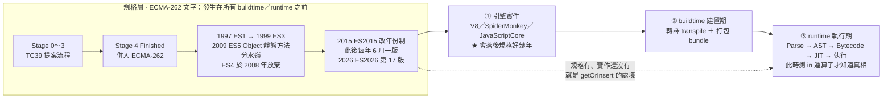

# ECMAScript 版本沿革｜ES1 到 ES2026

> [!info] 這篇的由來
> 在 [[Object建構子-plain-object的建立與存取]] 與 [[Map.prototype完整清單-實例方法與存取器]] 裡一直出現「ES1／ES3／ES5／ES2022」這種標記，
> 這篇把它們一次講清楚，之後任何「這是哪一版的東西」都回頭查這裡。

---

## 5W1H 速查：讀本篇之前先把座標定好

> [!important]+ 最常被搞錯的一件事：<mark style="background: #FF5582A6;">「ES2026 已經通過了」不等於「我現在就能用」</mark>
> 規格定案只是<mark style="background: #FFF3A3A6;">起點</mark>，不是終點。本篇 g 節的 `getOrInsert` 就是活生生的例子：規格上 2026 年 6 月 30 日已經通過，MDN 仍標 Experimental，Node.js v22.22.2 實測 `'getOrInsert' in Map.prototype` 還是 `false`。<mark style="background: #ADCCFFA6;">TC39 只負責把文字寫進 ECMA-262，接下來各家引擎要花時間實作、使用者要花時間升級</mark>。所以看到「ES20XX 新增了什麼」的文章，第一件事永遠是回到自己的執行環境測一下。

| 5W1H | 問題 | 一句話答案 |
|---|---|---|
| **What** 是什麼 | 「ES2026」是什麼東西的版本？ | 是<mark style="background: #ADCCFFA6;">規格書 ECMA-262 的版本</mark>，不是 JavaScript 這個語言的版本。規格規定語言該長什麼樣，JavaScript 是照著做出來的實作 |
| **When** 什麼時候 | 一版多久發一次？ | 2015 年改制之後<mark style="background: #BBFABBA6;">固定每年 6 月發一版</mark>。ES2026 是 2026 年 6 月 30 日通過的第 17 版，目前最新 |
| **Who** 誰做的 | 誰寫規格、誰做實作？ | 規格：<mark style="background: #ADCCFFA6;">TC39</mark> 委員會（Ecma International 底下）；實作：V8、SpiderMonkey、JavaScriptCore 這些引擎。兩批完全不同的人 |
| **Where** 在哪裡 | 「ES2026 已通過」這件事存在哪？ | 只存在<mark style="background: #FF5582A6;">規格文字裡</mark>。你的 Node 或瀏覽器裡到底有沒有那個方法是另一回事——`'方法名' in Map.prototype` 的結果才是你這台機器的真相 |
| **Which** 哪一種 | 哪幾版是真正的分水嶺？ | ES5（2009）把 `Object` 靜態方法一次補齊，造成「兩個盒子」的歷史；ES2015 ＝ ES6 引進 `let`／`const`／`class`／`Promise`／`Symbol`，同時把版號改成年份 |
| **How** 怎麼做到 | 怎麼判斷一個 API 現在能不能用？ | 看 MDN 頁面頂端有沒有 Experimental 或「Baseline 尚未廣泛可用」；直接測 `'方法名' in Map.prototype`；查 MDN 相容表或 caniuse。<mark style="background: #FF5582A6;">VS Code 補完得出來不算數</mark>，`lib.d.ts` 可能比你的執行環境還新 |
| **Why** 為什麼 | 為什麼版號從 3 直接跳到 5？ | ES4 想一次塞進 class、模組與選擇性型別系統，微軟與 Yahoo 以向後相容為由反對，僵持數年後 2008 年正式放棄。這個教訓直接促成「不再攢大版本、每年發一版、每個功能各走提案流程」 |

### 時間軸：規格制定的年份軸，以及它為什麼站在 buildtime／runtime 之前

```text
◄════════════ 規格層：ECMA-262 的「文字」 ════════════►
   這一層是寫給引擎實作者看的文件，
   發生在所有 buildtime 與 runtime 之前，本身不是執行期的任何東西。

【TC39 提案流程】ES2015 之後，每個功能各走各的，不必等大版本
  Stage 0 ───► Stage 1 ───► Stage 2 ───► Stage 3 ───► Stage 4
  Strawperson  Proposal     Draft        Candidate    Finished
  隨口提案      有冠軍推動    寫成規格文字  引擎試作回饋  併入 ECMA-262

【ECMA-262 年份軸】
 1997  1998  1999      2008      2009  2011   2015 ─每年 6 月一版─► 2026
 ES1   ES2   ES3      ✘ES4放棄   ES5   ES5.1  ES2015 … 2022 … 2024   ES2026
 第1版  第2版  第3版    （2008 年   第5版  第5.1  第6版                第17版
 基本   只有  RegExp   正式放棄）  Object 版    let／const／class     Math.sumPrecise
 語法   編輯  try/catch           靜態         Promise／Map／Set      Iterator.concat
       修訂  hasOwn-             方法一        Symbol／Proxy          Map.getOrInsert
             Property            次補齊        ★ 改成年份制
                                  ★分水嶺
 ├──────────── 大版本制，一拖就是好幾年 ────────────┤├─ 每年一版 ─┤

  ▼ 規格通過之後，還有兩道關卡才輪到你
  ① 引擎實作（V8／SpiderMonkey／JavaScriptCore）★ 這一格會落後好幾年
       └─► ② 你的 buildtime 建置期（轉譯 transpile ＋ 打包 bundle）
              └─► ③ runtime 執行期（Parse → AST → Bytecode → JIT → 執行）

 ★ `getOrInsert`：規格在第 ①格前面就通過了，第 ①格還沒跟上，
   所以 runtime 測 `'getOrInsert' in Map.prototype` 仍然是 false。
```

同一件事用 Mermaid 再畫一次：



> [!info]+ 一句話驗證法：這個「有」是哪一種有？
> 1. 規格上有 → 查 ECMA-262 或本篇 b 節的版本表，這是 TC39 的文字。
>
> 2. 引擎上有 → 直接在 Node 或瀏覽器 console 測 `'方法名' in Map.prototype`，這是執行期的事實。
>
> 3. 型別定義上有 → VS Code 自動補完列得出來，這<mark style="background: #FF5582A6;">既不是規格也不是實作</mark>，只是 TypeScript 的 `lib.d.ts` 比你的環境新。

---

## a. 先分清楚兩個詞

| 詞 | 是什麼 | 誰負責 |
| --- | --- | --- |
| **ECMAScript** | **規格書**，規定語言該長什麼樣 | **TC39** 委員會（Ecma International 底下） |
| **JavaScript** | **實作**，照著規格做出來的東西 | 各家引擎：V8、SpiderMonkey、JavaScriptCore |

**所以「ES5」「ES2022」講的都是規格的版本，不是 JavaScript 這個語言的版本。**

規格編號是 **ECMA-262**，官方站是 <https://262.ecma-international.org/>。

---

## 主軸圖

![[學習JS_圖解_ECMAScript版本沿革-ES1到ES2026_2026-08-20.svg]]

---

## b. 完整版本表

| 版本 | 發布 | 代表性新東西 |
| --- | --- | --- |
| **ES1** | 1997 年 6 月 | 第一版標準。基本語法、物件模型、`toString`、`valueOf` |
| ES2 | 1998 年 8 月 | **只有編輯修訂，沒有新功能**（為了跟 ISO 標準對齊） |
| **ES3** | 1999 年 12 月 | 正規表達式、`try/catch`、`hasOwnProperty`、`isPrototypeOf`、`propertyIsEnumerable` |
| ~~ES4~~ | **從未發布** | 想一次加入 class 與型別系統，2008 年正式放棄 |
| **ES5** | 2009 年 12 月 | **物件 API 的分水嶺**（見下方 c 節） |
| ES5.1 | 2011 年 6 月 | 編輯修訂 |
| **ES6 ＝ ES2015** | 2015 年 6 月 | `let`／`const`、箭頭函式、`class`、`Promise`、`Map`／`Set`、`Symbol`、`Proxy`、`Reflect`、`Object.assign`、`Object.is`、`Object.setPrototypeOf`。**Annex B 正式收錄 `__proto__`** |
| ES2016 | 2016 年 6 月 | `**` 指數運算子、`Array.prototype.includes` |
| **ES2017** | 2017 年 6 月 | `async`／`await`、`Object.values`、`Object.entries`、`Object.getOwnPropertyDescriptors` |
| ES2018 | 2018 年 6 月 | 物件的展開與其餘運算子、非同步迭代、`Promise.finally` |
| **ES2019** | 2019 年 6 月 | `Array.flat`／`flatMap`、`Object.fromEntries`、穩定排序 |
| ES2020 | 2020 年 6 月 | `BigInt`、可選鏈 `?.`、空值合併 `??` |
| ES2021 | 2021 年 6 月 | `replaceAll`、`Promise.any`、邏輯賦值 `??=` `&&=` `\|\|=` |
| **ES2022** | 2022 年 6 月 | **`Object.hasOwn`**、`#` 私有欄位、top-level `await`、`static` 初始化區塊 |
| ES2023 | 2023 年 6 月 | `toSorted`、`toReversed`、`findLast`、`findLastIndex` |
| **ES2024** | 2024 年 6 月 | **`Object.groupBy`／`Map.groupBy`**、`Promise.withResolvers`、Set 運算 |
| ES2025 | 2025 年 6 月 | Iterator helpers、`Promise.try`、`RegExp.escape`、`Float16Array` |
| **ES2026** | **2026 年 6 月 30 日通過** | 第 17 版，**目前最新**。見 d 節 |

---

## c. 為什麼 ES5 是「物件 API 的分水嶺」

我們筆記裡用到的 `Object.xxx` 靜態方法，**絕大多數都是 ES5 一次加進來的**：

```js
// ES5（2009）一口氣新增
Object.keys()                      Object.create()
Object.getPrototypeOf()            Object.defineProperty()
Object.getOwnPropertyNames()       Object.getOwnPropertyDescriptor()
Object.freeze() / seal() / preventExtensions()
```

在 ES5 之前，你只有 `Object.prototype` 上那幾個 ES1／ES3 的**實例方法**（`hasOwnProperty`、`toString`、`isPrototypeOf`）可以用。

**這正好解釋了「兩個盒子」的歷史**（見 [[Object靜態方法速查]]）：

| 盒子 | 主要來自 | 為什麼 |
| --- | --- | --- |
| 右盒 `Object.prototype`（實例方法） | ES1、ES3 | 早期的設計習慣，方法掛在原型上 |
| 左盒 `Object`（靜態方法） | **ES5 之後** | 學到教訓：靜態方法不吃 `this`，對 `Object.create(null)` 也安全，不會被同名屬性蓋掉 |

所以 `Object.hasOwn`（ES2022）取代 `obj.hasOwnProperty`（ES3），是同一個趨勢的最新一步 —— **能做成靜態就做成靜態**。

---

## d. ES4 為什麼消失

版號從 **3 直接跳到 5**，中間的 ES4 是 JavaScript 歷史上最有名的一次失敗。

- 目標很大：一次加入 class、模組、**選擇性型別系統**、命名空間
- 微軟與 Yahoo 反對，主要理由是**向後相容性**：改動太大會讓既有網站壞掉
- 僵持數年後，**2008 年正式放棄**
- 功能被拆散：一部分變成 ES5（2009），class 與模組等到 ES2015（2015）才落地

> [!note] 這件事的長期影響
> ES4 的教訓讓 TC39 改變做法：**不再攢大版本，改成每年 6 月發一版、每個功能獨立走提案流程**。
> 這就是為什麼 ES2015 之後版號直接用年份。

---

## e. 為什麼 ES6 又叫 ES2015

第 6 版拖了 **6 年**（2009 → 2015）才出來。出完之後 TC39 決定改制：

- **每年 6 月發一版**，避免再難產
- **版號直接用年份**

所以 **ES6 是舊稱，ES2015 才是正式名稱**。之後理論上不再有「ES7」「ES8」這種叫法，一律講 ES2016、ES2017。

> [!tip] 口語習慣
> 實務上大家還是會說「ES6 語法」來泛指箭頭函式、`let`／`const`、`class` 那一批。
> 面試時講「ES2015」比較精準，但聽到別人講 ES6 也知道是同一件事。

---

## f. ES2026 有什麼（2026 年 6 月 30 日通過）

第 17 版，**目前最新**。加了數學、迭代器、陣列、Map、編碼與 JSON 相關的方法：

| 提案 | 做什麼 |
| --- | --- |
| `Math.sumPrecise` | 精確加總，減少浮點誤差 |
| `Iterator.concat` | 串接多個 iterator |
| `Array.fromAsync` | 從非同步可迭代物件建立陣列 |
| `Error.isError` | 判斷是不是 Error 實例 |
| **`Map`／`WeakMap` 取值時給預設值** | **就是 `getOrInsert`／`getOrInsertComputed`** |
| `Uint8Array` 的 hex 與 base64 轉換 | 二進位與字串互轉 |
| `JSON.parse` 的 reviver 可拿到原始片段 | 保留精度用 |
| `JSON.rawJSON` | 序列化時精細控制原始值 |

---

## g. 最重要的一課：規格 ≠ 實作

> [!warning] `getOrInsert` 就是活生生的例子
> - **規格**：已經寫進 ES2026，2026 年 6 月 30 日通過 ✔
> - **MDN**：仍標為 **Experimental／Limited availability** ✘
> - **Node.js v22.22.2 實測**：`'getOrInsert' in Map.prototype` 是 **`false`** ✘
>
> **規格定案只是起點，各家引擎要花時間實作、使用者要花時間升級。**

判斷一個 API 現在能不能用：

| 方法 | 說明 |
| --- | --- |
| 看 MDN 頁面頂端 | 有 **Experimental** 或「Baseline 尚未廣泛可用」就先別用 |
| 直接測 | `'方法名' in Map.prototype` |
| 查相容表 | MDN 的 Browser compatibility，或 caniuse |

> [!tip] VS Code 提示得出來 ≠ 跑得起來
> TypeScript 的 `lib.d.ts` 型別定義可能比你的執行環境新，自動補完會列出你其實不能用的方法。這是很常見的踩雷點。

---

## h. 面試常被問的三題

**Q：ES6 跟 ES2015 有什麼不同？**
同一個東西。第 6 版拖了 6 年，出完之後改成每年發布、版號用年份，ES2015 才是正式名稱。

**Q：為什麼沒有 ES4？**
它想一次加入 class 與型別系統，因為向後相容性的爭議在 2008 年被放棄，功能拆散進 ES5 與 ES2015。這件事直接促成了「每年發一版」的改制。

**Q：`Object.hasOwn` 跟 `hasOwnProperty` 差在哪？為什麼要多做一個？**
`hasOwnProperty` 是 ES3 的實例方法，`Object.hasOwn` 是 ES2022 的靜態方法。差在靜態方法不吃 `this`，對 `Object.create(null)` 的物件也安全，也不怕被同名屬性蓋掉。這反映了 ES5 之後「能做成靜態就做成靜態」的趨勢。

---

## 參考來源

| 來源 | 網址 | 查證時間 |
| --- | --- | --- |
| ECMA-262 官方站（第 17 版，2026 年 6 月） | https://262.ecma-international.org/ | 2026-08-20 |
| Wikipedia｜ECMAScript version history | https://en.wikipedia.org/wiki/ECMAScript_version_history | 2026-08-20 |
| InfoWorld｜ECMAScript 2026 specification approved | https://www.infoworld.com/article/4193461/ecmascript-2026-specification-approved.html | 2026-08-20 |

---

## 關聯筆記

| 筆記 | 關聯原因 |
| --- | --- |
| [[Object靜態方法速查]] | 「兩個盒子」的歷史成因就是 ES3 與 ES5 的分界 |
| [[Object建構子-plain-object的建立與存取]] | j 節說 `__proto__` 是 ES2015 Annex B 的遺留特性，本篇是完整脈絡 |
| [[Map.prototype完整清單-實例方法與存取器]] | `getOrInsert` 的「規格有、實作沒有」就是本篇 g 節的案例 |
| [[ECMA-262規範-TC39與MDN比較]] | TC39 的提案流程與 MDN 的關係 |
