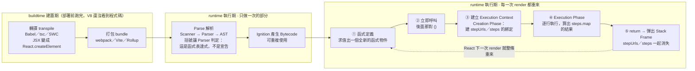

# IIFE Stepper + Link 可點擊步驟導航模式

---

## 5W1H 速查：讀本篇之前先把座標定好

> [!important]+ 最常被搞錯的一件事：<mark style="background: #FF5582A6;">IIFE 的「立即」不等於「只跑一次」</mark>
> 「立即」指的是<mark style="background: #FFF3A3A6;">定義完的那一瞬間就呼叫它</mark>，不是「整支程式只執行一次」。本篇的 IIFE 寫在元件 `return` 出去的 JSX 裡面，所以它是<mark style="background: #FF5582A6;">每一次 render 都重新建立一個新的函式物件、重新呼叫一次</mark>——`stepUrls` 與 `steps` 這兩個綁定，每一次 render 都是全新的一組，上一次的那組早就跟著 Stack Frame 被拆掉了。真正「只做一次」的是 Parse（把這段語法解析成 AST），那是另外一格的事。

| 5W1H | 問題 | 一句話答案 |
|---|---|---|
| **What** 是什麼 | IIFE 到底是什麼？ | Immediately Invoked Function Expression，立即執行函式表達式：把函式擺到**表達式的位置**，定義完馬上補一對 `()` 呼叫它。本篇拿它在 JSX 的 `{}` 裡開一小塊「可以寫 `const` 的空間」 |
| **When** 什麼時候 | 它在哪一格發生？ | <mark style="background: #FF5582A6;">runtime 執行期</mark>，而且是「程式碼執行到那一行」的那一瞬間才發生。在 JSX 裡就等於<mark style="background: #FFF3A3A6;">每一次 render 都整條重來</mark> |
| **Who** 誰做的 | 是誰讓它可以「立即」被呼叫？ | 外面那對括號。它把 `function` ／箭頭函式從**陳述式位置**搬到**表達式位置**，引擎才准你在後面接 `()`。真正建立 Execution Context 的還是 JS 引擎（V8） |
| **Where** 在哪裡 | 它建立的東西住在哪？ | 都在 RAM。函式物件在 **Heap**；這一次呼叫的 `stepUrls`、`steps` 在 **Stack Frame** 裡，沒有被閉包捕獲，所以 `return` 完就跟著 Stack Frame 一起消失 |
| **Which** 哪一種 | 哪些寫法才算 IIFE？ | `(function () {})()`、`(() => {})()`、`(function () {}())`、`!function () {}()` 都算。<mark style="background: #FF5582A6;">`function foo() {}()` 不算</mark>——那是函式**宣告**，後面那對 `()` 會被當成另一段程式碼而語法錯誤 |
| **How** 怎麼做到 | 一次 IIFE 的完整流程？ | 求值出函式物件 → 立即呼叫 → 建立 Execution Context（Creation Phase 建 `stepUrls`／`steps` 的綁定）→ Execution Phase 逐行執行 → `return` 出陣列 → 彈出 Stack Frame，舞台拆掉 |
| **Why** 為什麼 | 為什麼 JSX 裡非得這樣寫？ | 因為 JSX 的 `{}` 只吃**表達式**，而 `const stepUrls = […]` 是**陳述式**。IIFE 把陳述式包進一個「會回傳值的表達式」，順便讓變數定義待在使用處旁邊，不用被推到元件最上面 |

### 時間軸：這件事發生在哪一格

```text
◄──────────── buildtime 建置期 ────────────►◄──────── runtime 執行期 ────────────►
        （你的電腦／CI，部署前就跑完）              （瀏覽器或 Node 載入腳本之後）

 ①轉譯          ②打包            ③Parse          ④Bytecode      ⑤執行到那一行才發生
 transpile      bundle           解析             產生            ↓↓↓↓↓↓↓↓↓↓
 ┌────────┐   ┌────────┐     ┌───────────┐   ┌──────────┐   ┌───────────────────┐
 │Babel   │   │webpack │     │Scanner    │   │Ignition  │   │ 求值出函式物件      │
 │tsc     │──►│Vite    │────►│Parser     │──►│把 AST 編成│──►│ ★ 立即呼叫那對 ()  │
 │SWC     │   │Rollup  │     │AST        │   │Bytecode  │   │ ★ 建 Execution     │
 │JSX→JS  │   │合併壓縮│     │Scope      │   │          │   │   Context          │
 └────────┘   └────────┘     │Analysis   │   └──────────┘   │ ★ 執行完立刻彈出    │
                             └───────────┘                  └───────────────────┘
                             每個函式只做一次                 每一次 render 都重來一遍

 ★ IIFE 站在第 ⑤ 格，不是第 ③ 格。括號在第 ③ 格只是讓 Parser「判定它是表達式」，
   真正呼叫、真正在 RAM 裡挖格子，是第 ⑤ 格的事。
```

再看 IIFE 自己的一生——<mark style="background: #BBFABBA6;">四件事全部擠在執行期的同一瞬間</mark>：

```text
 ①函式定義          ②立即呼叫         ③建立 Execution    ④Execution Phase  ⑤return 彈出
  (() => { … })      後面那對 ()        Context            逐行真的執行       Stack Frame
      ↓                  ↓                  ↓                   ↓                ↓
 ┌───────────┐    ┌───────────┐    ┌─────────────┐    ┌───────────┐    ┌────────────┐
 │外層括號把它│    │不用取名字、│    │Creation      │    │算出       │    │舞台拆掉     │
 │放到表達式  │───►│不用先存進  │───►│Phase：建立   │───►│steps.map()│───►│stepUrls 與  │
 │的位置，引擎│    │變數，當場就│    │stepUrls 與   │    │的結果，    │    │steps 一起消 │
 │才准接 ()   │    │呼叫       │    │steps 的綁定  │    │return 出去 │    │失（沒被閉包 │
 └───────────┘    └───────────┘    └─────────────┘    └───────────┘    │捕獲）       │
                                                                        └──────┬─────┘
                                                                               │
                       React 下一次 render ◄──────────────────────────────────┘
                       整條時間軸從 ① 原封不動再跑一次，拿到全新的一組綁定
```



> [!info]- 為什麼「每次 render 重建一次函式」在這裡不是問題？
> a. <mark style="background: #BBFABBA6;">建立一個函式物件非常便宜</mark>：這裡只是在 Heap 上做一個小物件，跟整棵 Virtual DOM 的比對相比可以忽略。
> b. <mark style="background: #ADCCFFA6;">它沒有被當成 props 傳下去</mark>：會造成子元件重新渲染的是「傳給子元件的函式每次都是新的」，而這個 IIFE 定義完立刻就被呼叫掉了，沒有人拿著它的參考。
> c. <mark style="background: #FFF3A3A6;">這正是本篇不用 `useMemo` 的理由</mark>：`useMemo` 要花記憶體存快取、還要比對依賴陣列，對一組靜態的 stepper 資料來說反而更貴。


## 背景

在品牌商攤位註冊流程中，有一個 5 步驟的 stepper（步驟進度條）：

```
[1 選攤位] ─── [2 電力] ─── [3 設備] ─── [4 支付方式] ─── [5 確認]
```

原本的 stepper 純粹是**視覺展示**，完成的步驟（綠色打勾）只是一個 `<div>`，使用者無法點擊跳回去修改。

## 問題

使用者走到步驟 3（設備），想返回步驟 1（攤位）修改，只能按瀏覽器上一頁反覆退回。

## 解決方案

用兩個技巧改造：
1. **IIFE**（Immediately Invoked Function Expression）— 在 JSX 中定義區域變數
2. **`<Link>`** — 把完成的步驟從 `<div>` 換成 React Router 的 `<Link>`

---

## 什麼是 IIFE？

IIFE = **立即執行函式表達式**。就是「宣告一個函式，馬上執行它」：

```js
// 普通函式
function greet() { return 'hello' }
greet()  // 呼叫

// IIFE — 宣告 + 呼叫合為一步
(() => { return 'hello' })()
```

### 為什麼在 JSX 裡需要 IIFE？

JSX 的 `{}` 只能放**表達式（expression）**，不能放**陳述式（statement）**：

```tsx
// 不行 — const 是陳述式
<div>
  {const x = 5}   // 語法錯誤
</div>

// 可以 — 用 IIFE 包起來
<div>
  {(() => {
    const x = 5          // 區域變數
    return <span>{x}</span>  // 回傳 JSX
  })()}
</div>
```

---

## 改造前的 Stepper（純視覺）

```tsx
<div className="flex items-center justify-between mb-8 max-w-4xl mx-auto px-4">
  {[
    { label: '選攤位', active: false, done: true },
    { label: '電力',   active: true,  done: false },
    { label: '設備',   active: false, done: false },
    { label: '支付方式', active: false, done: false },
    { label: '確認',   active: false, done: false },
  ].map((step, i, arr) => (
    <div key={step.label} className="flex items-center flex-1 last:flex-none">
      {/* 每個步驟都是不可點擊的 <div> */}
      <div className="flex flex-col items-center relative">
        <div className={`w-8 h-8 rounded-full ... ${
          step.active ? 'bg-brand ...' :
          step.done   ? 'bg-green-500 ...' :
                        'bg-white ...'
        }`}>
          {step.done ? <CheckCircle2 /> : i + 1}
        </div>
        <span>{step.label}</span>
      </div>
      {/* 步驟之間的連接線 */}
      {i < arr.length - 1 && (
        <div className={`h-0.5 flex-1 mx-2 ${step.done ? 'bg-green-500' : 'bg-gray-200'}`} />
      )}
    </div>
  ))}
</div>
```

### 問題分析

1. steps 陣列直接寫在 `.map()` 前面，沒有額外空間定義 `stepUrls`
2. 所有步驟都用 `<div>` 渲染，不管完成與否
3. 完成的步驟沒有 hover 效果，使用者不知道可以互動（因為根本不能互動）

---

## 改造後的 Stepper（IIFE + Link）

```tsx
<div className="flex items-center justify-between mb-8 max-w-4xl mx-auto px-4">
  {(() => {
    // IIFE 的好處：可以在這裡定義區域變數
    const stepUrls = [
      `/event/${eventId}/register/booth`,
      // 只列出 done: true 的步驟對應 URL
    ]
    const steps = [
      { label: '選攤位', active: false, done: true },
      { label: '電力',   active: true,  done: false },
      { label: '設備',   active: false, done: false },
      { label: '支付方式', active: false, done: false },
      { label: '確認',   active: false, done: false },
    ]
    return steps.map((step, i, arr) => (
      <div key={step.label} className="flex items-center flex-1 last:flex-none">
        {step.done ? (
          // 完成的步驟 → 可點擊的 <Link>
          <Link to={stepUrls[i]} className="flex flex-col items-center relative group">
            <div className="w-8 h-8 rounded-full ... bg-green-500 ... group-hover:bg-green-600">
              <CheckCircle2 className="w-4 h-4" />
            </div>
            <span className="... group-hover:text-brand transition-colors">
              {step.label}
            </span>
          </Link>
        ) : (
          // 未完成 / 當前步驟 → 不可點擊的 <div>
          <div className="flex flex-col items-center relative">
            <div className={`w-8 h-8 rounded-full ... ${
              step.active ? 'bg-brand ...' : 'bg-white ...'
            }`}>
              {i + 1}
            </div>
            <span>{step.label}</span>
          </div>
        )}
        {i < arr.length - 1 && (
          <div className={`h-0.5 flex-1 mx-2 ${step.done ? 'bg-green-500' : 'bg-gray-200'}`} />
        )}
      </div>
    ))
  })()}
</div>
```

---

## 逐行解說

### 1. IIFE 開頭

```tsx
{(() => {
```

- `{` — JSX 插入表達式
- `(() => {` — 箭頭函式宣告
- 外面的 `(` — 把函式包起來準備立即執行

### 2. 定義區域變數

```tsx
const stepUrls = [
  `/event/${eventId}/register/booth`,
]
```

這是 IIFE 的核心價值：在 JSX 的 `{}` 裡面，我們需要一個地方定義 `stepUrls` 陣列。不用 IIFE 的話，要把它提到元件的上方，增加閱讀距離。

### 3. 條件渲染 `<Link>` vs `<div>`

```tsx
{step.done ? (
  <Link to={stepUrls[i]} ...>  {/* 完成 → 可點擊 */}
) : (
  <div ...>                     {/* 未完成 → 純展示 */}
)}
```

### 4. `group` hover 效果

```tsx
<Link ... className="... group">
  <div className="... group-hover:bg-green-600">
  <span className="... group-hover:text-brand transition-colors">
```

Tailwind 的 `group` 模式：
- 父元素加 `group` class
- 子元素用 `group-hover:xxx` — 當**父元素**被 hover 時，子元素的樣式改變
- 效果：hover 圓圈時，文字顏色也跟著變

### 5. IIFE 結尾

```tsx
  })()}
```

- `})` — 結束箭頭函式
- `()` — 立即執行
- `}` — 結束 JSX 表達式

---

## 各頁面的 stepUrls 設定

每個頁面只需要列出**已完成步驟**的 URL：

| 頁面 | 當前步驟 | stepUrls 數量 | 內容 |
|------|----------|---------------|------|
| 電力頁 (Step 2) | 電力 | 1 | `[booth]` |
| 設備頁 (Step 3) | 設備 | 2 | `[booth, electricity]` |
| 支付方式頁 (Step 4) | 支付方式 | 3 | `[booth, electricity, equipment]` |
| 確認頁 (Step 5) | 確認 | 4 | `[booth, electricity, equipment, vendor-payment]` |

```tsx
// 電力頁 — 只有步驟 1 完成
const stepUrls = [
  `/event/${eventId}/register/booth`,
]

// 設備頁 — 步驟 1、2 完成
const stepUrls = [
  `/event/${eventId}/register/booth`,
  `/event/${eventId}/register/electricity?order_id=${orderId}`,
]

// 支付方式頁 — 步驟 1、2、3 完成
const stepUrls = [
  `/event/${eventId}/register/booth`,
  `/event/${eventId}/register/electricity?order_id=${orderId}`,
  `/event/${eventId}/register/equipment?order_id=${orderId}`,
]

// 確認頁 — 步驟 1、2、3、4 完成
const stepUrls = [
  `/event/${eventId}/register/booth`,
  `/event/${eventId}/register/electricity?order_id=${orderId}`,
  `/event/${eventId}/register/equipment?order_id=${orderId}`,
  `/event/${eventId}/register/vendor-payment-methods?order_id=${orderId}`,
]
```

> 注意：步驟 1（選攤位）不需要 `order_id`，因為訂單是在選攤位時建立的。

---

## 為什麼不用其他方法？

### 方法 A：把 stepUrls 提到元件上方

```tsx
export default function Page() {
  const stepUrls = [...]  // 離 stepper JSX 很遠

  // ... 200 行其他 code ...

  return (
    // stepper 在這裡
  )
}
```

缺點：`stepUrls` 只有 stepper 用到，放在元件上方增加閱讀距離。

### 方法 B：useMemo

```tsx
const stepperData = useMemo(() => ({
  urls: [...],
  steps: [...]
}), [eventId, orderId])
```

可以用，但 stepper 資料是靜態的（不需要快取），用 `useMemo` 有點殺雞用牛刀。

### 方法 C：抽成獨立 Component

```tsx
<RegistrationStepper currentStep={2} eventId={eventId} orderId={orderId} />
```

如果多個頁面共用，這是最好的做法。但目前每個頁面的步驟文字用不同的 i18n key（`text20`~`text24` vs `text30`~`text34`），重構成共用元件需要統一 key，改動範圍較大。

### 結論

IIFE 是目前最小改動、最易讀的方案：
- 變數定義在使用處旁邊
- 不影響元件其他部分
- 不需要新增檔案或元件

---

## 完整程式碼對照

### Before（不可點擊的靜態 stepper）

```tsx
{[
  { label: '選攤位', done: true },
  { label: '電力',   active: true },
  // ...
].map((step, i) => (
  <div>              {/* <-- 永遠是 <div> */}
    <div className={`... ${step.done ? 'bg-green-500' : ''}`}>
      {step.done ? <CheckCircle2 /> : i + 1}
    </div>
  </div>
))}
```

### After（完成步驟可點擊跳回）

```tsx
{(() => {
  const stepUrls = ['/event/.../booth']   // 新增：URL 對照表
  const steps = [
    { label: '選攤位', done: true },
    { label: '電力',   active: true },
    // ...
  ]
  return steps.map((step, i) => (
    <div>
      {step.done ? (
        <Link to={stepUrls[i]}>   {/* <-- 完成 → Link */}
          <div className="... group-hover:bg-green-600">
            <CheckCircle2 />
          </div>
        </Link>
      ) : (
        <div>                      {/* <-- 未完成 → div */}
          {i + 1}
        </div>
      )}
    </div>
  ))
})()}
```

---

## 相關檔案

| 檔案 | 改動 |
|------|------|
| `EventRegisterElectricityPage.tsx` | stepUrls: `[booth]` |
| `EventRegisterEquipmentPage.tsx` | stepUrls: `[booth, electricity]` |
| `EventRegisterVendorPaymentMethodsPage.tsx` | stepUrls: `[booth, electricity, equipment]` |
| `EventRegisterConfirmPage.tsx` | stepUrls: `[booth, electricity, equipment, vendor-payment]` |
| `EventRegisterBoothPage.tsx` | 步驟 1（當前步驟），不需要 stepUrls |
