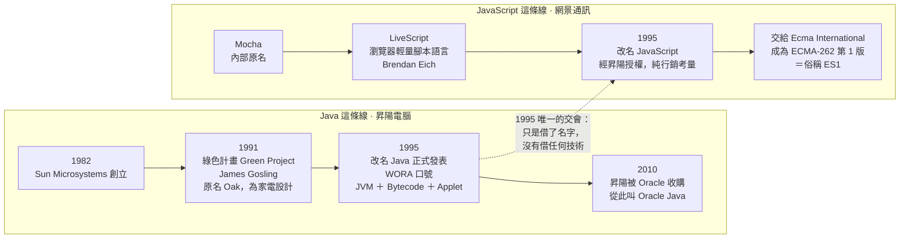

# JavaScript 與 Java 的歷史淵源(網景與昇陽)

---

## 5W1H 速查：讀本篇之前先把座標定好

> [!important]+ 最常被搞錯的一件事：<mark style="background: #FF5582A6;">JavaScript 不是 Java 的簡化版、腳本版或子集</mark>
> 兩者<mark style="background: #ADCCFFA6;">沒有任何技術血緣</mark>。JavaScript 原本叫 LiveScript，1995 年因為 Java 正紅，Netscape 為了行銷合作、經昇陽授權才改成這個名字——<mark style="background: #FFF3A3A6;">最後一步是商業授權，不是技術演進</mark>。語法、設計理念、執行方式全都不同。本篇用的比喻是「雷鋒與雷峰塔」「熱狗與狗」：名字像，血緣零。這一題在面試被問到的機率很高，答錯的人也很多。

| 5W1H | 問題 | 一句話答案 |
|---|---|---|
| **What** 是什麼 | 這兩個名字到底是什麼關係？ | 只有<mark style="background: #FF5582A6;">名字上的關係</mark>。一個是昇陽的通用程式語言與平台，一個是網景做給瀏覽器用的輕量腳本語言，是兩件完全獨立的東西 |
| **When** 什麼時候 | 關鍵年份是哪一年？ | <mark style="background: #FFF3A3A6;">1995 年</mark>。同一年昇陽把 Oak 改名 Java 正式發表，Brendan Eich 也在網景做出了那個瀏覽器腳本語言並改名為 JavaScript |
| **Who** 誰做的 | 各是誰做的？ | Java：昇陽電腦（Sun Microsystems，1982 年創立，2010 年被 Oracle 收購）的 <mark style="background: #ADCCFFA6;">James Gosling</mark>，出自 1991 年的內部「綠色計畫」；JavaScript：Netscape（網景通訊）的 <mark style="background: #ADCCFFA6;">Brendan Eich</mark> |
| **Where** 在哪裡 | 兩者當年各跑在哪裡？ | Java 跑在 <mark style="background: #BBFABBA6;">JVM</mark> 上，靠 Applet 把小程式嵌進網頁；JavaScript 跑在瀏覽器<mark style="background: #BBFABBA6;">內建的腳本引擎</mark>裡。兩套執行模型，只是恰好同時出現在同一個網頁上 |
| **Which** 哪一種 | 「一次編譯，到處執行」講的是哪一個？ | <mark style="background: #FF5582A6;">Java</mark>。WORA（Write Once, Run Anywhere）靠的是把程式編譯成中間碼 Bytecode 加上各平台的 JVM。JavaScript 從來沒有這個口號 |
| **How** 怎麼做到 | 名字是怎麼一路變過來的？ | Mocha（內部原名）→ LiveScript → JavaScript。本篇筆記從 LiveScript 這一段講起，重點在最後一步：那是網景與昇陽談出來的授權，不是語言演化 |
| **Why** 為什麼 | 為什麼今天還要記這段？ | 因為「JavaScript 是 Java 的腳本版」是最常見的錯誤答案；也因為知道它 1995 年是趕出來的，才理解為什麼後來要靠 <mark style="background: #ADCCFFA6;">ECMA-262 標準化</mark>來收拾各家實作分歧 |

### 時間軸：兩條各自獨立的歷史，只在 1995 年交會了一次

```text
1982 ────────► 1991 ────────► 1995 ──────────► 1997 ────────► 2010
                                 ★交會點

【Java 這條線】
 昇陽電腦          內部「綠色計畫」      Oak 改名 Java                    昇陽被
 Sun Microsystems  Green Project        正式發表                        Oracle
 創立               James Gosling        WORA 口號                       收購
 矽谷巨頭           原名 Oak             JVM ＋ Bytecode                 → 變成
 工作站／伺服器      為家電機上盒         Applet 嵌進網頁                  Oracle Java
                   跨平台設計                 │
                                             │ 只有這一刻，
                                             │ 兩條線碰到彼此：
                                             │ 「Java 太紅，
                                             │   借個名字」
                                             ▼
【JavaScript 這條線】                   Mocha（內部原名）
                                          └─► LiveScript
                                                └─► JavaScript
                                                    經昇陽授權改名
                                                    Brendan Eich＠Netscape
                                                          │
                                                          ▼
                                                    交給 Ecma International
                                                    成為 ECMA-262 第 1 版
                                                    ＝俗稱 ES1
                                                    （年份見
                                                     [[ECMAScript版本沿革-ES1到ES2026]]）

 ★ 兩條線在 1995 年之後就再也沒有技術上的交集，
   之後 JavaScript 的演化完全走 TC39 與 ECMA-262 那條路，跟 Java 無關。
```

同一件事用 Mermaid 再畫一次：



> [!warning]- 為什麼這個誤會這麼難消？三個原因
> a. <mark style="background: #FFF3A3A6;">名字實在太像了</mark>：Java 與 JavaScript 只差三個字母，直覺上就會覺得是同一家族的大小號。
> b. <mark style="background: #ADCCFFA6;">1995 年它們真的同時出現在同一個網頁上</mark>：Java Applet 嵌在頁面裡跑動畫，JavaScript 在旁邊做互動，使用者看到的是同一塊畫面，很難不聯想成一組。
> c. <mark style="background: #BBFABBA6;">改名這件事本身就是要讓你誤會</mark>：網景當年就是希望大家把新語言跟當紅的 Java 聯想在一起，行銷目的達成得太成功，副作用留到三十年後還在。

---

## 重點整理

### Netscape(網景)是公司

- 1990 年代著名的美國網際網路軟體公司,招牌產品 Netscape Navigator 瀏覽器。
- 「Netscape 的工程師」= 該公司員工;最著名的是 **Brendan Eich**,1995 年在網景發明瞭 JavaScript。

### 昇陽的 Java

- **昇陽電腦(Sun Microsystems)**,1982 年創立的矽谷巨頭(工作站、伺服器、處理器、作業系統);2010 年被 Oracle 收購,所以現在是「Oracle Java」。
- Java 源自 1991 年內部「綠色計畫(Green Project)」,Java 之父 **James Gosling**;原名 **Oak**,為家電(機上盒)跨平台設計;1995 年隨 WWW 爆發改名 Java 發表。
- 革命性口號:**Write Once, Run Anywhere(一次編譯,到處執行)**,靠兩個核心:
  - **JVM**:程式編譯成中間碼(Bytecode),任何裝了對應 JVM 的系統都能執行。
  - **Applet**:把小程式嵌入網頁,讓早期瀏覽器(如 Netscape Navigator)能跑動態互動內容。

### Java 與 JavaScript 的關係

- 1995 年 Netscape 工程師發明的瀏覽器輕量腳本語言原名 **LiveScript**;因為當時 Java 太紅,Netscape 為行銷合作經昇陽授權改名 **JavaScript**。
- 兩者是完全不同的語言(語法、設計理念、執行方式都不同)——「雷鋒與雷峰塔」「熱狗與狗」的關係,純粹名字相似。

## 各對話來源

### 網景公司與工程師的區別(2026-06)— https://gemini.google.com/app/8287c090ea52a41a

使用者:Netscape(網景)的工程師是一家公司嗎 → Gemini:Netscape 是公司(網景通訊,Navigator 瀏覽器),工程師是員工;Brendan Eich 1995 年在網景發明 JavaScript。

使用者:何謂昇陽的 Java? → Gemini:Sun Microsystems 1995 年推出的 Java 語言與平台;綠色計畫、James Gosling、原名 Oak;WORA 口號與 JVM/Applet 技術;2010 年被 Oracle 收購;並補充 LiveScript 因行銷蹭熱度改名 JavaScript,兩語言實際無關。
