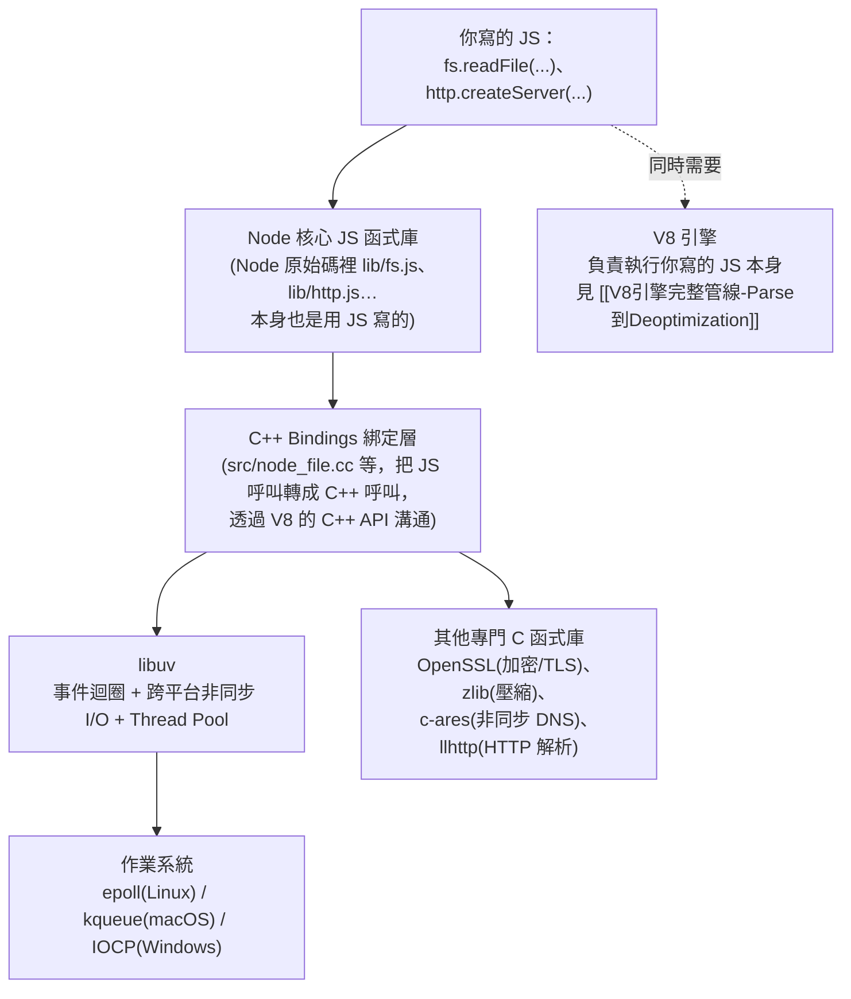
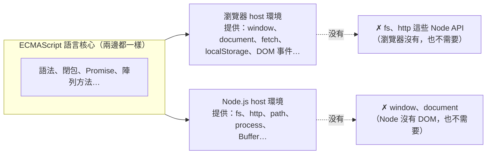

# Node.js 底層架構：V8 + libuv + C++ Bindings

> 本篇重點 (a)–(h)，共 8 個。起點：[[V8引擎完整管線-Parse到Deoptimization]] 裡「Node.js 把 V8 抽出來，外面包一層 libuv」這句話的延伸追問。

## (a) Node.js 只有包一層 libuv 嗎？——不是，libuv 只是其中一層

「V8 外面包一層 libuv」是簡化說法，完整分層其實更多：

也就是說 Node.js＝**V8（跑 JS）＋ libuv（事件迴圈/非同步 I/O）＋ C++ Bindings（連接兩者）＋ 其他專門函式庫（加密、壓縮、DNS、HTTP 解析）＋ 一層用 JS 寫的核心標準庫（`fs`、`http`… 這些你直接呼叫的 API）**——libuv 只負責其中「非同步 I/O 與事件迴圈」這一塊，不是全部。

## (b) libuv 是什麼的縮寫？

<mark style="background: #FF5582A6;">誠實講：libuv 官方 README 並沒有解釋這個名字的由來或縮寫意義</mark>，網路上流傳的各種「uv 代表 XXX」說法都查無官方出處，這裡不瞎猜、不寫進筆記當事實。比較重要、也查證得到的是**它實際做什麼**：

- **事件迴圈（Event Loop）**：跨平台的事件迴圈實作，底層依系統分別用 Linux 的 `epoll`、macOS 的 `kqueue`、Windows 的 `IOCP`。
- **非同步 I/O**：TCP/UDP socket、檔案讀寫、DNS 解析、檔案系統變化通知，全部做成非阻塞。
- **Thread Pool（執行緒池）**：某些系統呼叫本質上是阻塞的（例如部分檔案系統操作、DNS 查詢），libuv 用背景執行緒池去跑這些阻塞呼叫，跑完再把結果丟回主執行緒的事件迴圈——這也是為什麼「JS 單執行緒」但「檔案 I/O 不會卡住整個程式」的底層原因。

一句話：libuv 就是讓 Node.js 的**單一 JS 主執行緒**能用非阻塞方式做檔案/網路/DNS 這些事情的**跨平台非同步 I/O 引擎**，跟 [[事件循環-Event-Loop-微任務與巨任務]] 裡瀏覽器的 Web APIs 扮演的角色是同一個位置——只是瀏覽器裡那層是瀏覽器自己實作，Node.js 裡這層換成 libuv。

## (c) CSR 的渲染邏輯是在瀏覽器執行的嗎？——是，全部在瀏覽器裡完成

CSR（Client-Side Rendering）就是把 React／Vue 這些框架的渲染邏輯（Virtual DOM diff、元件函式呼叫、產生真實 DOM）整套搬到**瀏覽器裡的 V8（或其他引擎）執行**：伺服器只回傳一份幾乎是空殼的 HTML（通常只有 `

`）加上打包好的 JS bundle，瀏覽器下載完 JS 後才開始執行 React 的渲染邏輯、把畫面畫出來。跟 SSR 的對比：

| | CSR | SSR |
|---|---|---|
| 渲染邏輯執行在哪 | 瀏覽器（Client 端 V8） | 伺服器（Server 端 Node.js 裡的 V8） |
| 使用者拿到的第一份 HTML | 幾乎空殼，要等 JS 跑完才有內容 | 伺服器已經把內容渲染好，直接是完整 HTML |
| 用到 libuv 嗎 | 不會，瀏覽器沒有 libuv，用的是瀏覽器自己的事件迴圈/Web APIs | 會，因為渲染邏輯這時是跑在 Node.js 裡 |

## (d) 純前端 + JS 用得到 Node 專屬 API 嗎？——用不到，這是「host 環境」不同的問題

這個問題點到重點了：**Node 專屬 API（`fs`、`http`、`path`…）只存在於 Node.js 這個 host 環境裡，瀏覽器裡的 JS 環境根本沒有這些東西**。同一份 ECMAScript 語言核心（語法、閉包、Promise、陣列方法……）在哪裡跑都一樣，但「host 環境額外提供的 API」完全取決於你身處哪個環境：

所以如果你的程式碼是「純前端、跑在瀏覽器裡的 JS」——不管是原生 JS 還是 React（打包後一樣是標準 JS，見 [[V8引擎完整管線-Parse到Deoptimization]] 的圖③④）——你確實**用不到、也不應該用到** `fs`、`http` 這些 Node 專屬 API；你能用的是瀏覽器提供的 Web APIs（`fetch`、`localStorage`、DOM…）。你只有在寫**跑在 Node.js 裡**的程式碼時才會用到 Node API，常見情境：

- 後端 Server（Express/Fastify/NestJS 這類 Node 後端框架）。
- 建置工具本身（Webpack/Vite/Babel 這些工具的原始碼要讀寫檔案，所以它們是跑在 Node.js 裡的程式，見 [[前端開發工具-打包編譯Lint與Parser]] 第 7 節）。
- SSR 渲染那一段程式碼（因為它是在伺服器的 Node.js 裡執行，見 (c)）。

## (e-1) Deno 跟 Node.js、V8 的關係

<mark style="background: #ADCCFFA6;">Deno底層也嵌入V8這顆引擎</mark>——跟Node.js一樣，都是「V8＋其他東西」組成的host環境，呼應[[引擎-Engine-到底是什麼]]「V8是獨立元件、誰都能包」那個論點。但Deno不是隨便一個團隊做的：<mark style="background: #FFF3A3A6;">Deno是Node.js原作者Ryan Dahl自己跳出來「重做一次」的專案</mark>，用意是修正他自己當年設計Node.js時留下的一些遺憾。

主要差異：

| | Node.js | Deno |
|---|---|---|
| 底層引擎 | V8 | V8 |
| 非同步I/O層 | libuv（C++） | Tokio（Rust） |
| 開發語言 | C++ Bindings | Rust |
| TypeScript支援 | 需另外補ts-node/tsc | 內建，直接執行`.ts`檔 |
| 安全性 | 預設完全信任，程式可以任意讀寫檔案/連網路 | 預設有權限沙盒，讀檔/連網/存取環境變數都要明確授權（`--allow-read`等） |
| 套件管理 | npm + node_modules | 一開始直接用URL import（像瀏覽器），後來加了npm相容層 |

一句話：<mark style="background: #BBFABBA6;">Node.js跟Deno是同一顆V8引擎、兩種不同host外殼——Deno可以看成是原作者事後反省Node.js的安全性/工具鏈設計，用更現代的技術棧（Rust+Tokio）重做一次的結果。</mark>

## (e) 小結對照表

| 問題 | 答案 |
|---|---|
| Node.js 只包一層 libuv 嗎？ | 不是，還有 C++ Bindings、JS 核心標準庫、OpenSSL/zlib/c-ares/llhttp 等 |
| libuv 是什麼縮寫？ | 官方沒有解釋，不確定的東西不瞎猜——重點是它做的事：事件迴圈＋跨平台非同步 I/O＋Thread Pool |
| CSR 渲染邏輯在哪執行？ | 瀏覽器（Client 端） |
| 純前端 JS 會用到 Node API 嗎？ | 不會，Node API 只存在於 Node.js host 環境，瀏覽器沒有 |

## 追加 2026-07-31：三層架構命名釐清、Heap/Stack 歸屬、ECMAScript 為何不寫 window／fs

> 本次追加重點 (f)–(h)，共 3 個。起點：Abby 提出「V8 宿主環境是 Node.js 跟 Chrome，兩者各提供 DOM/fetch/fs/http，中間夾了一層 runtime，這個 runtime 到底是什麼」的追問，跟本篇 (a)–(e) 談的是同一組分層，只是換了一次更完整的三層命名法再確認一遍。

### (f) Runtime 一詞的兩種意思＋三層架構命名對照

<mark style="background: #FFF3A3A6;">「Runtime」本身有兩種常被混用的意思</mark>：

- **執行階段（Runtime Phase）**：與 Compile Time 相對的時間概念，例如「這個變數未定義的錯誤要到 Runtime 才會觸發」。
- **執行環境（Runtime Environment）**：讓某種語言能運作的完整軟體套件，例如 "Node.js is a JavaScript runtime" 講的就是這個意思。

把 (a) 的分層圖再用另一種切法命名一次，會得到這張對照表：

| 分層 | 代表 | 職責 |
|---|---|---|
| ① JS Engine | V8、SpiderMonkey、JavaScriptCore | 解析／編譯 JS、維護 <mark style="background: #ADCCFFA6;">Call Stack 與 Heap</mark>、GC。**完全不知道** `document.getElementById` 或 `fs.readFile` 是什麼 |
| ② Runtime Bridge（中間夾帶層） | Event Loop、Task Queues、C++ Binding | 讓非同步任務能運作；Node.js 這層的核心就是本篇 (a)(b) 講的 <mark style="background: #ADCCFFA6;">libuv</mark>，Chrome 這層是 Chromium/Blink 的 Event Loop + IPC |
| ③ Host Environment APIs | Chrome 提供 DOM/fetch/localStorage；Node.js 提供 fs/http/path/process | 暴露給開發者呼叫的實際功能 |

<mark style="background: #BBFABBA6;">跟本篇 (d) 的 Core/Browser/Node 那張圖是同一件事，只是這裡把「①引擎」跟「②橋接層」拆更細——強調 Event Loop／libuv 這類非同步底層機制並不屬於 V8 引擎本身，而是 host 環境另外補上的橋樑</mark>。

### (g) Heap 與 Stack 算「引擎」的還是「記憶體 Runtime」的？——兩者都對，只是說的是不同面向

Abby 追問：Heap/Stack 不是應該屬於「記憶體的運行時」嗎，為什麼算在 Engine 頭上？答案是<mark style="background: #FFF3A3A6;">兩個描述講的是不同層次，不衝突</mark>：

- <mark style="background: #ADCCFFA6;">實體面（Memory at Runtime）</mark>：Heap 和 Stack 確實是程式**執行階段**才存在於 RAM 裡的記憶體空間——這件事發生在 Runtime（時間點意義）沒有錯。
- <mark style="background: #ADCCFFA6;">管理面（Engine 職責）</mark>：但「這塊空間要怎麼排版、怎麼配發、怎麼回收」的具體演算法與資料結構，完全由 V8 引擎（一支 C++ 程式）自己定義並執行——OS 只負責把一整塊未結構化的原始記憶體丟給 process，V8 接手後才劃出 Call Stack（Stack Pointer 記錄目前執行到哪個 Function Execution Context）與 Heap（New/Old/Large Object Space，GC 演算法如 Scavenger/Mark-Sweep）。

一句話：<mark style="background: #BBFABBA6;">「發生在哪個時間點」是 Runtime Phase 的問題，「由誰定義怎麼管理」是 Engine 的職責——技術文件把 Stack/Heap 標註為引擎組件，指的是後者。</mark>

### (h) ECMAScript 規範完全沒寫 window 或 fs——由 WHATWG／Node API 各自定義

<mark style="background: #FF5582A6;">TC39 的 ECMA-262 規範裡找不到 `window` 或 `fs` 這些詞</mark>，規範只用 **Host Environment（宿主環境）** 與 **Host Objects（宿主物件）** 這種抽象說法，透過 **Host Hooks（宿主鉤子，例如 `HostEnqueuePromiseJob`）** 跟宿主環境溝通。這樣設計是刻意的，理由有三：

- **安全沙盒與硬體邊界**：瀏覽器要跑陌生的網路程式碼，若 ECMAScript 強制內建 `fs`，任何網站都能讀你電腦的檔案；反之 Node.js 沒有螢幕，也不需要 `window`。
- **核心邏輯的通用性（Isomorphic JS）**：不涉及宿主 API 的純邏輯（演算法、`dayjs`、Redux 這類狀態管理）才能在瀏覽器／Node.js／Deno／嵌入式裝置間無縫移植。
- **擴充性**：未來新硬體（VR、智慧手錶）只需要各自定義新的宿主物件，不必回頭修改 JavaScript 語言本身的語法規範。

實際定義權對照表：

| 功能／物件 | ECMAScript 規範 | Chrome 宿主環境 | Node.js 宿主環境 | 遵循標準 |
|---|---|---|---|---|
| `Array`, `Promise`, `Object` | ✅ 有定義 | ✅ 繼承並實現 | ✅ 繼承並實現 | ECMA-262 |
| `globalThis`（ES2020） | ✅ 有定義 | ✅ 指向 `window` | ✅ 指向 `global` | ECMA-262 |
| `window`, `document`（DOM） | ❌ 未定義 | ✅ 有定義 | ❌ 無此物件（呼叫會 `ReferenceError`） | WHATWG HTML／W3C DOM |
| `fs` 模組 | ❌ 未定義 | ❌ 無此模組（瀏覽器出於沙盒安全，只提供受限的 File API／File System Access API） | ✅ 有定義，直接封裝底層 OS 檔案系統呼叫 | Node.js API Spec |
| `fetch` | ❌ 未定義 | ✅ Web API | ✅ 內建支援 | WHATWG Fetch Standard |

<mark style="background: #D2B3FFA6;">跨瀏覽器（Chrome/Firefox/Safari/Edge）的 `window`/`fetch` 行為之所以一致，是因為大家共同遵守 WHATWG／W3C 標準，跟 ECMAScript 無關；ECMAScript 只保證「語法」（`[1,2].map()`、`async/await`）到處一樣。</mark> 這也回答了 Runtime 如何影響 `fs`：Node.js 執行 `fs.readFile()` 時，是內建的 C++ 模組（結合 libuv）直接呼叫 OS 系統呼叫；Chrome 的 Runtime 核心根本沒把硬碟 I/O 暴露給 V8，V8 執行時找不到 `fs` 就直接丟 `ReferenceError`。

來源查證：V8 官方 Embedder's Guide（v8.dev）、TC39 ECMA-262 規範（Host environment／`HostEnqueuePromiseJob`）、MDN Concurrency model and the event loop、Node.js 官方 About／System Architecture 文件（經 Gemini 轉述，查證日 2026-07-31）。

## 各對話來源

### JavaScript Runtime 三層架構再確認（2026-07-31）— https://gemini.google.com/app/35f68098963fef1d （分支自 https://gemini.google.com/app/22e7959c0c3c36e4，後者僅有起頭提問、無新增回覆內容）

使用者：V8 宿主環境是 Node.js 跟 Chrome，兩個各提供 DOM/fetch/fs/http，中間夾帶了 runtime，這邊比較 confused，runtime 可翻譯成具體環境跟具體的執行時間？究竟是什麼／Heap+Stack 屬於引擎？他們不是屬於記憶體的運行時嗎？／ECMAScript 完全沒有寫 window 或 file system，但這兩者在 Chrome 這個宿主環境裡面有定義嗎？／如果沒有透過 ECMAScript 規範去定義，移植到任何宿主環境，是不是都有自己的 window 或 fs？這樣做有什麼意義？

Gemini：Runtime 有「執行階段」與「執行環境」兩種意思；三層架構為 JS Engine（V8，只認 ECMA-262，不懂 DOM/fs）→ Runtime Bridge（Event Loop/libuv/C++ Binding）→ Host Environment APIs（Chrome 的 DOM/fetch、Node.js 的 fs/http）。Heap/Stack 是執行階段存在於 RAM 的記憶體空間，但「怎麼管理」由 V8 引擎的 C++ 資料結構定義，因此歸類在引擎職責。ECMAScript 規範沒有 window／fs，改用 Host Environment／Host Objects／Host Hooks 溝通；window 由 WHATWG HTML 規範定義、fs 由 Node.js API 規範定義；不寫進 ECMAScript 是為了安全沙盒（避免網站任意讀檔）、核心邏輯可跨平台（Isomorphic JS）、以及面向未來擴充性。整合進上方追加第 (f)–(h) 點。
