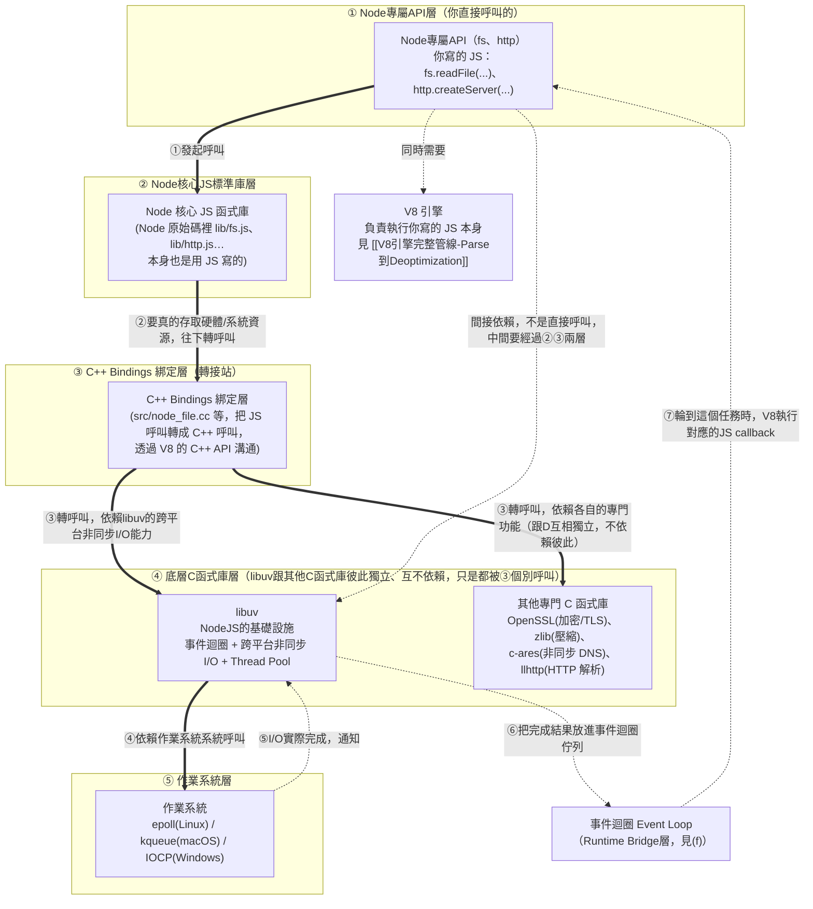
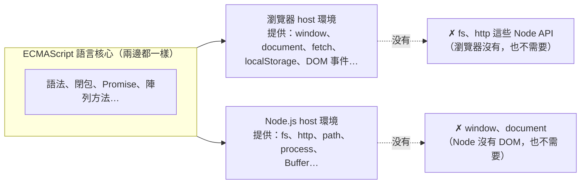

# Node.js 底層架構：V8 + libuv + C++ Bindings

> 本篇重點 (a)–(h)，共 8 個。起點：[[00-V8引擎完整管線-Parse到Deoptimization]] 裡「Node.js 把 V8 抽出來，外面包一層 libuv」這句話的延伸追問。

## (a) Node.js 只有包一層 libuv 嗎？——不是，libuv 只是其中一層

「V8 外面包一層 libuv」是簡化說法，完整分層其實更多：



<mark style="background: #FF5582A6;">回答screenshot裡的追問：libuv不是跟②「Node核心JS函式庫」（`lib/fs.js`那層）同一層，中間還隔著③「C++ Bindings」——真正跟libuv同一層、都是被③呼叫的對象，是④裡的「其他專門C函式庫」（OpenSSL／zlib／c-ares／llhttp）。上面這版圖用subgraph把五個層級明確切開、標上①～⑤編號，就是要讓「誰跟誰同層」一眼能看出來，不用再靠顏色或框的形狀猜。</mark>

### 追問：使用libuv一定會用到其他C函式庫嗎——D跟E到底是什麼關係

<mark style="background: #FF5582A6;">不會，libuv不需要其他這幾個C函式庫就能自己運作，兩者是彼此獨立、互不依賴的關係，不是「左右互相依賴」，也不是「用了其中一個就一定要用另一個」。</mark>

a. <mark style="background: #FFF3A3A6;">查證來源：Node.js官方原始碼倉庫的依賴維護文件</mark>——把libuv、c-ares、zlib、OpenSSL、llhttp都列為Node.js「各自獨立、分開打包」的第三方依賴，libuv被描述成「一個專注在非同步I/O的跨平台支援函式庫，主要是為了給Node.js用而開發的」，文件裡完全沒有提到libuv依賴或需要c-ares／zlib／OpenSSL／llhttp才能運作（查證於2026-08-15，[Node.js maintaining-dependencies.md](https://github.com/nodejs/node/blob/main/doc/contributing/maintaining/maintaining-dependencies.md)）。
b. <mark style="background: #FFF3A3A6;">最能證明兩者互相獨立的實例：Node.js自己的DNS模組，同時用了libuv跟c-ares兩條完全不同的路，彼此不經過對方</mark>——`dns.lookup()`是透過libuv的Thread Pool去呼叫作業系統原生的`getaddrinfo`（不是DNS協定本身，可能讀`/etc/hosts`就解完，也可能完全不連網路）；`dns.resolve()`／`dns.resolve4()`這類函式則完全不經過libuv的這條路，是Node直接呼叫c-ares去對DNS伺服器發真正的DNS協定查詢（查證於2026-08-15，[Node.js dns官方文件](https://nodejs.org/api/dns.html)）。同一個「DNS查詢」的需求，Node分別用libuv跟c-ares兩套獨立機制去做，這正好證明libuv本身不需要c-ares、c-ares也不是靠libuv才能運作，兩者是被Node各自分開呼叫的平行依賴。
c. <mark style="background: #ADCCFFA6;">回到圖上：D跟E之間沒有畫箭頭，就是要表達「彼此無關」</mark>——D（libuv）跟E（其他專門C函式庫）都只被③（C++ Bindings）個別呼叫，各自處理自己的專門任務（libuv管事件迴圈/非同步I/O/Thread Pool；OpenSSL管加密；zlib管壓縮；c-ares管DNS協定；llhttp管HTTP解析），彼此之間沒有呼叫關係。任何只想要「非同步I/O」能力、不需要TLS加密或HTTP解析的專案（例如其他語言的libuv綁定），可以只嵌入libuv，完全不用碰OpenSSL/zlib/c-ares/llhttp。

### 追問：架構圖上下位置代表呼叫方向嗎——不是，箭頭才是，已補上資料回呼方向

<mark style="background: #FF5582A6;">這個問法很準確：Mermaid裡的上下位置本身不保證代表呼叫方向，真正代表方向的是箭頭本身（箭頭指向誰，誰就是被呼叫/依賴的那一方）。</mark>`flowchart TD`只是Mermaid自動排版演算法選擇「把箭頭起點畫在上面、終點畫在下面」比較好讀，這是排版習慣，不是語法保證——如果圖裡出現多個節點互相指向、或有回頭的邊，同一張圖也可能出現「下面的節點呼叫上面的節點」這種畫面，一切都要看箭頭方向本身，不能只看節點物理位置。

上面這版圖也回應了「加入資料流向」這個要求，補了一組原本沒畫出來的東西：<mark style="background: #FFF3A3A6;">粗實線（==>）代表「呼叫/發起請求」方向，是①到④由上往下發起的；虛線（-.->）是另外新增的「資料/結果實際怎麼流回來」方向，標了⑤到⑦</mark>——因為Node是非同步模型，結果不是像一般函式呼叫那樣「原路退回去」，而是：作業系統完成I/O後通知libuv（⑤），libuv把完成結果放進事件迴圈的佇列（⑥），輪到這個任務時，V8才執行妳原本傳進去的JS callback（⑦，這時候技術上通常會先經過②`lib/fs.js`裡包好的wrapper，再呼叫到妳寫在①的callback本人，圖上簡化畫成直接回到①）。這也是為什麼「呼叫」跟「結果回來」在非同步的世界裡，走的根本是兩條不同的路徑，不能只用一條線的方向去理解。</mark>

也就是說 Node.js＝**V8（跑 JS）＋ libuv（事件迴圈/非同步 I/O）＋ C++ Bindings（連接兩者）＋ 其他專門函式庫（加密、壓縮、DNS、HTTP 解析）＋ 一層用 JS 寫的核心標準庫（`fs`、`http`… 這些你直接呼叫的 API）**——libuv 只負責其中「非同步 I/O 與事件迴圈」這一塊，不是全部。

## (b) libuv 是什麼的縮寫？

<mark style="background: #FF5582A6;">誠實講：libuv 官方 README 並沒有解釋這個名字的由來或縮寫意義</mark>，網路上流傳的各種「uv 代表 XXX」說法都查無官方出處，這裡不瞎猜、不寫進筆記當事實。比較重要、也查證得到的是**它實際做什麼**：

- **事件迴圈（Event Loop）**：跨平台的事件迴圈實作，底層依系統分別用 Linux 的 `epoll`、macOS 的 `kqueue`、Windows 的 `IOCP`。
- **非同步 I/O**：TCP/UDP socket、檔案讀寫、DNS 解析、檔案系統變化通知，全部做成非阻塞。
- **Thread Pool（執行緒池）**：某些系統呼叫本質上是阻塞的（例如部分檔案系統操作、DNS 查詢），libuv 用背景執行緒池去跑這些阻塞呼叫，跑完再把結果丟回主執行緒的事件迴圈——這也是為什麼「JS 單執行緒」但「檔案 I/O 不會卡住整個程式」的底層原因。

一句話：libuv 就是讓 Node.js 的**單一 JS 主執行緒**能用非阻塞方式做檔案/網路/DNS 這些事情的**跨平台非同步 I/O 引擎**，跟 [[事件循環-Event-Loop-微任務與巨任務]] 裡瀏覽器的 Web APIs 扮演的角色是同一個位置——只是瀏覽器裡那層是瀏覽器自己實作，Node.js 裡這層換成 libuv。

## (c) CSR 的渲染邏輯是在瀏覽器執行的嗎？——是，全部在瀏覽器裡完成

CSR（Client-Side Rendering）就是把 React／Vue 這些框架的渲染邏輯（Virtual DOM diff、元件函式呼叫、產生真實 DOM）整套搬到**瀏覽器裡的 V8（或其他引擎）執行**：伺服器只回傳一份幾乎是空殼的 HTML（通常只有 `<div id="root"></div>`）加上打包好的 JS bundle，瀏覽器下載完 JS 後才開始執行 React 的渲染邏輯、把畫面畫出來。跟 SSR 的對比：

| | CSR | SSR |
|---|---|---|
| 渲染邏輯執行在哪 | 瀏覽器（Client 端 V8） | 伺服器（Server 端 Node.js 裡的 V8） |
| 使用者拿到的第一份 HTML | 幾乎空殼，要等 JS 跑完才有內容 | 伺服器已經把內容渲染好，直接是完整 HTML |
| 用到 libuv 嗎 | 不會，瀏覽器沒有 libuv，用的是瀏覽器自己的事件迴圈/Web APIs | 會，因為渲染邏輯這時是跑在 Node.js 裡 |

## (d) 純前端 + JS 用得到 Node 專屬 API 嗎？——用不到，這是「host 環境」不同的問題

這個問題點到重點了：**Node 專屬 API（`fs`、`http`、`path`…）只存在於 Node.js 這個 host 環境裡，瀏覽器裡的 JS 環境根本沒有這些東西**。同一份 ECMAScript 語言核心（語法、閉包、Promise、陣列方法……）在哪裡跑都一樣，但「host 環境額外提供的 API」完全取決於你身處哪個環境：



所以如果你的程式碼是「純前端、跑在瀏覽器裡的 JS」——不管是原生 JS 還是 React（打包後一樣是標準 JS，見 [[V8引擎完整管線-Parse到Deoptimization]] 的圖③④）——你確實**用不到、也不應該用到** `fs`、`http` 這些 Node 專屬 API；你能用的是瀏覽器提供的 Web APIs（`fetch`、`localStorage`、DOM…）。你只有在寫**跑在 Node.js 裡**的程式碼時才會用到 Node API，常見情境：

- 後端 Server（Express/Fastify/NestJS 這類 Node 後端框架）。
- 建置工具本身（Webpack/Vite/Babel 這些工具的原始碼要讀寫檔案，所以它們是跑在 Node.js 裡的程式，見 [[前端開發工具-打包編譯Lint與Parser]] 第 7 節）。
- SSR 渲染那一段程式碼（因為它是在伺服器的 Node.js 裡執行，見 (c)）。

## (e-1) Deno 跟 Node.js、V8 的關係

<mark style="background: #ADCCFFA6;">Deno底層也嵌入V8這顆引擎</mark>——跟Node.js一樣，都是「V8＋其他東西」組成的host環境，呼應[[引擎-Engine-到底是什麼]]「V8是獨立元件、誰都能包」那個論點。但Deno不是隨便一個團隊做的：<mark style="background: #FFF3A3A6;">Deno是Node.js原作者Ryan Dahl自己跳出來「重做一次」的專案</mark>，用意是修正他自己當年設計Node.js時留下的一些遺憾。

主要差異：

| | Node.js | Deno |
|---|---|---|
| 底層引擎 | V8 | V8 |
| 非同步I/O層 | libuv（C++） | Tokio（Rust） |
| 開發語言 | C++ Bindings | Rust |
| TypeScript支援 | 需另外補ts-node/tsc | 內建，直接執行`.ts`檔 |
| 安全性 | 預設完全信任，程式可以任意讀寫檔案/連網路 | 預設有權限沙盒，讀檔/連網/存取環境變數都要明確授權（`--allow-read`等） |
| 套件管理 | npm + node_modules | 一開始直接用URL import（像瀏覽器），後來加了npm相容層 |

一句話：<mark style="background: #BBFABBA6;">Node.js跟Deno是同一顆V8引擎、兩種不同host外殼——Deno可以看成是原作者事後反省Node.js的安全性/工具鏈設計，用更現代的技術棧（Rust+Tokio）重做一次的結果。</mark>

## (e) 小結對照表

| 問題 | 答案 |
|---|---|
| Node.js 只包一層 libuv 嗎？ | 不是，還有 C++ Bindings、JS 核心標準庫、OpenSSL/zlib/c-ares/llhttp 等 |
| libuv 是什麼縮寫？ | 官方沒有解釋，不確定的東西不瞎猜——重點是它做的事：事件迴圈＋跨平台非同步 I/O＋Thread Pool |
| CSR 渲染邏輯在哪執行？ | 瀏覽器（Client 端） |
| 純前端 JS 會用到 Node API 嗎？ | 不會，Node API 只存在於 Node.js host 環境，瀏覽器沒有 |

## 追加 2026-07-31：三層架構命名釐清、Heap/Stack 歸屬、ECMAScript 為何不寫 window／fs

> 本次追加重點 (f)–(h)，共 3 個。起點：Abby 提出「V8 宿主環境是 Node.js 跟 Chrome，兩者各提供 DOM/fetch/fs/http，中間夾了一層 runtime，這個 runtime 到底是什麼」的追問，跟本篇 (a)–(e) 談的是同一組分層，只是換了一次更完整的三層命名法再確認一遍。

### (f) Runtime 一詞的兩種意思＋三層架構命名對照

<mark style="background: #FFF3A3A6;">「Runtime」本身有兩種常被混用的意思</mark>：

- **執行階段（Runtime Phase）**：與 Compile Time 相對的時間概念，例如「這個變數未定義的錯誤要到 Runtime 才會觸發」。
- **執行環境（Runtime Environment）**：讓某種語言能運作的完整軟體套件，例如 "Node.js is a JavaScript runtime" 講的就是這個意思。

把 (a) 的分層圖再用另一種切法命名一次，會得到這張對照表：

| 分層 | 代表 | 職責 |
|---|---|---|
| ① JS Engine | V8、SpiderMonkey、JavaScriptCore | 解析／編譯 JS、維護 <mark style="background: #ADCCFFA6;">Call Stack 與 Heap</mark>、GC。**完全不知道** `document.getElementById` 或 `fs.readFile` 是什麼 |
| ② Runtime Bridge（中間夾帶層） | Event Loop、Task Queues、C++ Binding | 讓非同步任務能運作；Node.js 這層的核心就是本篇 (a)(b) 講的 <mark style="background: #ADCCFFA6;">libuv</mark>，Chrome 這層是 Chromium/Blink 的 Event Loop + IPC |
| ③ Host Environment APIs | Chrome 提供 DOM/fetch/localStorage；Node.js 提供 fs/http/path/process | 暴露給開發者呼叫的實際功能 |

<mark style="background: #BBFABBA6;">跟本篇 (d) 的 Core/Browser/Node 那張圖是同一件事，只是這裡把「①引擎」跟「②橋接層」拆更細——強調 Event Loop／libuv 這類非同步底層機制並不屬於 V8 引擎本身，而是 host 環境另外補上的橋樑</mark>。

### (g) Heap 與 Stack 算「引擎」的還是「記憶體 Runtime」的？——兩者都對，只是說的是不同面向

Abby 追問：Heap/Stack 不是應該屬於「記憶體的運行時」嗎，為什麼算在 Engine 頭上？答案是<mark style="background: #FFF3A3A6;">兩個描述講的是不同層次，不衝突</mark>：

- <mark style="background: #ADCCFFA6;">實體面（Memory at Runtime）</mark>：Heap 和 Stack 確實是程式**執行階段**才存在於 RAM 裡的記憶體空間——這件事發生在 Runtime（時間點意義）沒有錯。
- <mark style="background: #ADCCFFA6;">管理面（Engine 職責）</mark>：但「這塊空間要怎麼排版、怎麼配發、怎麼回收」的具體演算法與資料結構，完全由 V8 引擎（一支 C++ 程式）自己定義並執行——OS 只負責把一整塊未結構化的原始記憶體丟給 process，V8 接手後才劃出 Call Stack（Stack Pointer 記錄目前執行到哪個 Function Execution Context）與 Heap（New/Old/Large Object Space，GC 演算法如 Scavenger/Mark-Sweep）。

一句話：<mark style="background: #BBFABBA6;">「發生在哪個時間點」是 Runtime Phase 的問題，「由誰定義怎麼管理」是 Engine 的職責——技術文件把 Stack/Heap 標註為引擎組件，指的是後者。</mark>

### (h) ECMAScript 規範完全沒寫 window 或 fs——由 WHATWG／Node API 各自定義

<mark style="background: #FF5582A6;">TC39 的 ECMA-262 規範裡找不到 `window` 或 `fs` 這些詞</mark>，規範只用 **Host Environment（宿主環境）** 與 **Host Objects（宿主物件）** 這種抽象說法，透過 **Host Hooks（宿主鉤子，例如 `HostEnqueuePromiseJob`）** 跟宿主環境溝通。這樣設計是刻意的，理由有三：

- **安全沙盒與硬體邊界**：瀏覽器要跑陌生的網路程式碼，若 ECMAScript 強制內建 `fs`，任何網站都能讀你電腦的檔案；反之 Node.js 沒有螢幕，也不需要 `window`。
- **核心邏輯的通用性（Isomorphic JS）**：不涉及宿主 API 的純邏輯（演算法、`dayjs`、Redux 這類狀態管理）才能在瀏覽器／Node.js／Deno／嵌入式裝置間無縫移植。
- **擴充性**：未來新硬體（VR、智慧手錶）只需要各自定義新的宿主物件，不必回頭修改 JavaScript 語言本身的語法規範。

實際定義權對照表：

| 功能／物件 | ECMAScript 規範 | Chrome 宿主環境 | Node.js 宿主環境 | 遵循標準 |
|---|---|---|---|---|
| `Array`, `Promise`, `Object` | ✅ 有定義 | ✅ 繼承並實現 | ✅ 繼承並實現 | ECMA-262 |
| `globalThis`（ES2020） | ✅ 有定義 | ✅ 指向 `window` | ✅ 指向 `global` | ECMA-262 |
| `window`, `document`（DOM） | ❌ 未定義 | ✅ 有定義 | ❌ 無此物件（呼叫會 `ReferenceError`） | WHATWG HTML／W3C DOM |
| `fs` 模組 | ❌ 未定義 | ❌ 無此模組（瀏覽器出於沙盒安全，只提供受限的 File API／File System Access API） | ✅ 有定義，直接封裝底層 OS 檔案系統呼叫 | Node.js API Spec |
| `fetch` | ❌ 未定義 | ✅ Web API | ✅ 內建支援 | WHATWG Fetch Standard |

<mark style="background: #D2B3FFA6;">跨瀏覽器（Chrome/Firefox/Safari/Edge）的 `window`/`fetch` 行為之所以一致，是因為大家共同遵守 WHATWG／W3C 標準，跟 ECMAScript 無關；ECMAScript 只保證「語法」（`[1,2].map()`、`async/await`）到處一樣。</mark> 這也回答了 Runtime 如何影響 `fs`：Node.js 執行 `fs.readFile()` 時，是內建的 C++ 模組（結合 libuv）直接呼叫 OS 系統呼叫；Chrome 的 Runtime 核心根本沒把硬碟 I/O 暴露給 V8，V8 執行時找不到 `fs` 就直接丟 `ReferenceError`。

來源查證：V8 官方 Embedder's Guide（v8.dev）、TC39 ECMA-262 規範（Host environment／`HostEnqueuePromiseJob`）、MDN Concurrency model and the event loop、Node.js 官方 About／System Architecture 文件（經 Gemini 轉述，查證日 2026-07-31）。

## 追加 2026-08-06：V8 的 C++ Binding 機制、Context 沙盒、與 d8 開發工具

> 本次追加重點 (i)–(n)，共 6 個。起點：Abby 從「Blink 解析 HTML 建立 DOM Tree、V8 執行 JS」延伸追問「Chrome/Node.js 到底怎麼把功能注入 V8」「Context 是什麼」「能不能直接把 V8 當執行檔跑」，跟本篇 (a)–(h) 談的是同一層架構，但把「② Runtime Bridge／C++ Binding」這塊剖得更細。

### (i) V8 提供的 C++ API：Isolate、Context、FunctionTemplate、ObjectTemplate

V8 本身是<mark style="background: #ADCCFFA6;">已經編譯好的機器碼（Library）</mark>，不需要每次被重新編譯——是它去編譯並執行你寫的 JavaScript。V8 對外提供一套 C++ 類別／方法，讓宿主環境的 C++ 開發者能操控 JS 環境，常見的有：

- `v8::Isolate`：代表一個獨立的 V8 虛擬機器實例，有自己的 Heap 記憶體與 GC。
- `v8::Context`：代表一個獨立的 JS 全域執行環境（見 (k)）。
- `v8::FunctionTemplate`：把一個 C++ 函式包裝成 JS 看得懂的 Function 物件。
- `v8::ObjectTemplate`：用 C++ 定義一個 JS 物件的結構。

### (j) Binding 的具體運作：不是「寫進 V8 一起編譯」，而是「執行期註冊」

<mark style="background: #FF5582A6;">常見誤解：以為宿主環境是把自己的 C++ 功能「寫進 V8 原始碼裡一起編譯」</mark>。實際上 V8 在下載下來時就已經可以單獨編譯成軟體庫（`libv8.a`／`v8.dll`），不需要修改 V8 內部原始碼——如果每次新增功能都要改 V8 原始碼重編，專案會極度混亂難維護。

正確做法是<mark style="background: #BBFABBA6;">執行期動態註冊／綁定（Binding）</mark>：宿主環境利用 V8 提供的 C++ API，在 runtime 把自己的 C++ 函式「暴露」給 V8 的 JS 環境，過程像開餐廳：

1. V8 建立一個乾淨的 JS 執行環境（Context），裡面只有 JS 原生語法（`Object`、`Array`、`Math`）——像一張空菜單。
2. 宿主環境（如 Node.js）用 C++ 寫好實體函式（例如 `CPP_ReadFile()`）——像準備好的廚師。
3. 宿主環境呼叫 V8 API，在 JS 全域物件上掛一個屬性（例如 `fs.readFile`），指定呼叫時要轉去執行哪個 C++ 函式——動態綁定。
4. JS 呼叫 `fs.readFile()` 時，V8 發現這個位置綁的是宿主的 C++ 函式，就把參數轉交給宿主的 C++ 執行。

C++ 註冊給 JS 的簡化範例：

```cpp
// 1. 在 C++ 中定義一個函式
void MyCppLog(const v8::FunctionCallbackInfo<v8::Value>& args) {
  std::cout << "Hello from C++!" << std::endl;
}

// 2. 用 V8 API 把它註冊到 JS 全域物件上，取名 "customLog"
global_template->Set(
  v8::String::NewFromUtf8(isolate, "customLog"),
  v8::FunctionTemplate::New(isolate, MyCppLog)
);
```

執行完這段 C++ 後，JS 就能直接呼叫 `customLog()`，背後執行的是 C++ 的 `MyCppLog`。<mark style="background: #D2B3FFA6;">這套「註冊/綁定」流程不是遊戲引擎特有的機制，而是任何宿主環境（Chrome／Node.js／嵌入 V8 的遊戲引擎）想讓 JS 擁有額外功能時必走的路。</mark>

### (k) Context = 獨立沙盒：一個分頁／iframe 一個 Context

<mark style="background: #ADCCFFA6;">Context 就是「執行上下文（Execution Context）」／全域執行環境</mark>，可以想像成一個完全隔離的沙盒——每個 Context 有自己獨立的全域物件。瀏覽器開 3 個分頁，或頁面裡有 `<iframe>`，每個分頁／iframe 都有自己獨立的 V8 Context，確保 Tab A 的 JS 變數不會污染 Tab B。Chrome 啟動一個分頁時，就會為它建立全新的 V8 Context，並把 DOM、Web API 註冊進這個 Context 的全域物件。

### (l) window／document／DOM 節點的歸屬：屬性、物件、方法怎麼分

| 項目 | 歸屬 | 說明 |
|---|---|---|
| `setTimeout` | `window` 的**方法（屬性）** | 你寫的 `setTimeout(...)` 其實是 `window.setTimeout(...)` 的簡寫，本質是 Blink 把 C++ 計時器函式註冊為 `window` 的屬性方法 |
| `fetch` | `window` 的**方法（屬性）** | 同樣掛載在全域物件 `window` 上的 Web API 方法 |
| `document` | `window` 的**屬性**，本身是一個**獨立物件（Instance）** | `window.document` 指向代表當前網頁 DOM 樹的 `Document` 物件實例；`getElementById` 等是 `document` 本身的方法，不是 `window` 直接的方法 |
| DOM 節點（如 `<div>`） | **獨立物件本人** | Blink 解析 HTML 標籤時在 C++ 內建立對應物件，並透過 V8 Binding 在 JS 側產生對應的 JS DOM 物件（如 `HTMLDivElement` 實例），擁有自己的屬性（`innerHTML`、`style`） |

<mark style="background: #BBFABBA6;">關係圖：`window`（V8 中的 Global Object）→ `setTimeout`／`fetch`（window 的方法，指向 Blink 的 C++ 實作）→ `document`（window 的屬性，指向 Document 物件本人）→ `getElementById`（document 的方法，指向 Blink 的 C++ DOM 搜尋）。</mark>V8 對這些 C++ 功能的角色像「轉接員／經手錢的人」：它知道呼叫對應到哪個 C++ 函式、也經手了傳遞的參數，但不關心該 C++ 功能內部具體怎麼實作。

### (m) d8：純 V8 開發殼層，跟 Chrome／Node.js 差在哪

<mark style="background: #ADCCFFA6;">`d8`</mark> 是 V8 開發團隊為了測試 JS 引擎而編譯出來的命令行工具（Developer Shell），只有純粹的 V8 引擎，沒有載入任何 DOM／Blink／Node.js API：

- 啟動極快：沒有載入任何宿主 API，幾毫秒內啟動。
- 能跑：`console.log`、`1+1`、`Math.random()` 等純 ECMAScript 語法。
- <mark style="background: #FF5582A6;">不能跑</mark>：`document.getElementById`（瀏覽器 API）或 `require('fs')`／`fetch`（Node/Blink API）——會直接報 `ReferenceError`，因為它是沒注入任何外置 C++ 功能的裸引擎。
- 取得方式：官方沒有一般安裝包，多透過開源工具 `jsvu`（`npm install -g jsvu` 後執行 `jsvu` 選 Windows x64 + v8）從 Google CI/CD 儲存庫抓取編譯好的 `d8.exe`。
- 對照：`node script.js` 則是 Node.js（同樣嵌入 V8）在啟動時額外把 `fs`／`net`／`process` 等 C++ API 註冊進 Context，因此能操作系統層功能，但一樣不認得 `document`／`window`（那是 Blink 專屬的宿主功能）。

### (n) 執行方式不限於 Terminal

不論是 `d8` 還是一般 `.js` 檔，執行方式都不只 Terminal 一種：VS Code 等編輯器可用 Code Runner 套件或 `F5` 內建 Debugger 一鍵執行 Node.js；WebStorm 等 IDE 有內建 Play 按鈕；若程式用到 `document`／`window`／`fetch` 等瀏覽器 API，最簡單是直接在 Chrome DevTools 的 Console 貼上執行，或用 `<script src="script.js">` 引入 HTML 由瀏覽器載入。

來源查證：本節內容為 Gemini 對談內容之整理與釐清（V8 C++ API、Binding 機制、Context、d8 工具用法），屬 V8/Chromium 公開架構知識，建議之後如需精確版本號可另查證 V8 官方 Embedder's Guide（v8.dev）。

## 追加 2026-08-15：libuv／C++ Bindings／其他C函式庫分層再確認（Thread Pool、zlib歸屬、事件迴圈算不算Node專屬API）

> 本次追加重點 (o)–(t)，共 6 個。起點：Abby針對本篇(a)那張分層圖，逐一確認「Thread Pool」「zlib」「事件迴圈」這幾個名詞各自該歸類到圖裡哪一層。

### (o) libuv做的「跨平台非同步I/O」跟「Node專屬API」不是包含關係，是上下層關係

<mark style="background: #FF5582A6;">問法裡「libuv的檔案I/O包含Node專屬API」這個方向反了</mark>——回頭看(a)的分層圖：`fs.readFile(...)`這種**Node專屬API**是最上層（JS開發者直接呼叫的），它往下呼叫**C++ Bindings**，C++ Bindings才再往下呼叫**libuv**去做實際的跨平台非同步I/O（TCP/UDP socket、檔案讀寫、DNS解析）。所以正確的說法是：Node專屬API（`fs`、`http`）**底層依賴**libuv做的跨平台非同步I/O，不是libuv「包含」Node專屬API——libuv根本不知道`fs`、`http`這些名字，它只提供更底層、不分語言的I/O能力，是C++ Bindings這層把libuv的能力包裝成`fs.readFile`這種好呼叫的JS介面。

### (p) Thread Pool是libuv內部的機制，不是「專屬API」也不是「檔案I/O」本身

<mark style="background: #FFF3A3A6;">Thread Pool（執行緒池）不屬於(a)圖裡C層「Node專屬API」，也不是「檔案I/O」這個I/O類型本身</mark>，它是libuv內部用來**達成**非阻塞檔案I/O效果的其中一種底層手段：某些系統呼叫（部分檔案系統操作、DNS查詢）本質上是阻塞的，libuv就丟一個背景執行緒去跑這個阻塞呼叫，跑完再把結果送回主執行緒的事件迴圈。跟(a)圖對照，libuv這一格底下實際上同時裝了三個彼此獨立的元件：事件迴圈、跨平台非同步I/O、Thread Pool——Thread Pool是三者之一，是「怎麼做到非阻塞」的實作手段，不是I/O的種類分類。

### (q) 確認：`fs`、`http`是Node核心JS標準庫——沒錯

<mark style="background: #ADCCFFA6;">這點的理解正確</mark>，對照(a)圖最上面兩層：妳寫的`fs.readFile(...)`、`http.createServer(...)`呼叫的，就是「Node核心JS函式庫」這一層——Node原始碼裡`lib/fs.js`、`lib/http.js`這些檔案，本身是用JS寫成的，暴露給開發者直接呼叫的API介面。

### (r) `fs`確實是用JS寫的`lib/fs.js`，但那只是最上面這一層

<mark style="background: #FFF3A3A6;">是，但要接著往下看</mark>：`lib/fs.js`負責的是JS這一側的邏輯——參數檢查、錯誤處理、把妳呼叫`fs.readFile(path, callback)`的方式轉換成正確的底層呼叫格式。它自己**不會**直接去碰硬碟，真正碰硬碟這件事，是`lib/fs.js`再往下呼叫C++ Bindings（Node原始碼裡`src/node_file.cc`這類檔案），由C++ Bindings轉呼叫libuv，libuv才去呼叫作業系統實際的檔案系統呼叫。一句話：`lib/fs.js`是「介面設計」那一層，不是「真的去存取硬碟」那一層。

### (s) zlib算「其他專門C函式庫」，不是JS標準庫、也不是C++ Bindings本身

<mark style="background: #FF5582A6;">zlib兩者都不是</mark>，回頭看(a)圖：C（C++ Bindings綁定層）往下同時接了兩條路——一條接D（libuv），一條接E（其他專門C函式庫：OpenSSL、zlib、c-ares、llhttp）。zlib跟libuv是**同一個層級、被C++ Bindings呼叫的對象**，只是各自負責不同的專門任務：libuv管事件迴圈／非同步I/O／Thread Pool，zlib專門管壓縮、OpenSSL專門管加密／TLS、c-ares專門管非同步DNS解析、llhttp專門管HTTP協定解析。C++ Bindings的角色是「轉接站」：JS呼叫進來之後，依照要做的事情，決定要轉去呼叫libuv還是這些專門函式庫裡的哪一個。

### (t) 事件迴圈不是Node專屬API，是Runtime Bridge層的核心機制

<mark style="background: #FFF3A3A6;">不是</mark>——對照本篇(f)那張三層架構表：①JS Engine（V8）、②Runtime Bridge（Event Loop、Task Queues、C++ Binding，Node這層的核心就是libuv）、③Host Environment APIs（`fs`、`http`、`path`這些Node專屬API）。事件迴圈屬於**第②層Runtime Bridge**，是讓非同步任務能運作的底層機制，開發者不會直接呼叫「事件迴圈」這個東西（沒有`eventLoop.doSomething()`這種API），跟妳會直接`import`或呼叫的`fs`、`http`（屬於第③層Host Environment APIs）是不同層級的兩件事。

一句話（(o)–(t)總結）：<mark style="background: #BBFABBA6;">Node專屬API（`fs`、`http`）是妳直接呼叫的JS介面層；C++ Bindings是轉接站；libuv跟zlib／OpenSSL／c-ares／llhttp是被轉接站呼叫的底層工具，彼此同級但分工不同；Thread Pool是libuv內部達成非阻塞效果的手段；事件迴圈則是介於JS Engine跟Host API之間的Runtime Bridge機制，不是妳能直接呼叫的Node專屬API。</mark>

跟[[機器碼、位元組碼與機器指令是一樣的嗎]]互相對照的原因：那篇講的是「CPU只認得自己ISA的機器碼」這種**硬體層**的排他性；這篇(o)–(t)講的是「JS呼叫最終要下探到哪一層才會真的觸碰作業系統／硬體」的**軟體分層**路徑，兩篇合起來能看出一次`fs.readFile()`從JS呼叫一路往下，最終還是要落到CPU認得的機器碼跟作業系統呼叫上執行。

## 各對話來源

### JavaScript Runtime 三層架構再確認（2026-07-31）— https://gemini.google.com/app/35f68098963fef1d （分支自 https://gemini.google.com/app/22e7959c0c3c36e4，後者僅有起頭提問、無新增回覆內容）

使用者：V8 宿主環境是 Node.js 跟 Chrome，兩個各提供 DOM/fetch/fs/http，中間夾帶了 runtime，這邊比較 confused，runtime 可翻譯成具體環境跟具體的執行時間？究竟是什麼／Heap+Stack 屬於引擎？他們不是屬於記憶體的運行時嗎？／ECMAScript 完全沒有寫 window 或 file system，但這兩者在 Chrome 這個宿主環境裡面有定義嗎？／如果沒有透過 ECMAScript 規範去定義，移植到任何宿主環境，是不是都有自己的 window 或 fs？這樣做有什麼意義？

Gemini：Runtime 有「執行階段」與「執行環境」兩種意思；三層架構為 JS Engine（V8，只認 ECMA-262，不懂 DOM/fs）→ Runtime Bridge（Event Loop/libuv/C++ Binding）→ Host Environment APIs（Chrome 的 DOM/fetch、Node.js 的 fs/http）。Heap/Stack 是執行階段存在於 RAM 的記憶體空間，但「怎麼管理」由 V8 引擎的 C++ 資料結構定義，因此歸類在引擎職責。ECMAScript 規範沒有 window／fs，改用 Host Environment／Host Objects／Host Hooks 溝通；window 由 WHATWG HTML 規範定義、fs 由 Node.js API 規範定義；不寫進 ECMAScript 是為了安全沙盒（避免網站任意讀檔）、核心邏輯可跨平台（Isomorphic JS）、以及面向未來擴充性。整合進上方追加第 (f)–(h) 點。

### V8/Blink 底層架構與 C++ Binding 機制（2026-08-05）— https://gemini.google.com/app/75aeb1c279e7c8f6

使用者：（延續 V8/Blink 分工話題）V8 應該都是固定內容吧，那為什麼他不以執行檔的身分存在就好？還要每次被編譯／通常我們是寫JS可以用到V8來輔助，所以C++也可以用V8?／所以是宿主環境又把自己的C++功能寫到V8裡面讓他再一起編譯？／V8 的 API? For example?／JS的net模組現在還有再用嗎？／Node.js有自己用C++寫好的檔案處理函式喔你是說filesystem嗎?／Context是環境嗎？／DOM操作、fetch、setTimeout是document的屬性還是本人？／下載Google預先編譯好的V8二進位檔給我載點／運行d8 script.js跟node script.js分別會怎樣／所以一定要在terminal中執行嗎

Gemini：V8 本身已編譯成機器碼（Library），不需重新編譯，是它去編譯執行 JS；它有獨立執行檔 `d8`，但更常被當作 Library 嵌入 Chrome／Node.js／遊戲引擎，讓宿主能注入自己的 C++ 功能。C++ 開發者本來就能把 V8 當一般 C++ 庫使用（`v8::Isolate`、`v8::Context`、`v8::FunctionTemplate` 等 API），執行一段 JS 字串並取回結果。宿主環境不是把 C++ 寫進 V8 一起編譯，而是用 V8 提供的 API 在 runtime「註冊/綁定」自己的 C++ 函式到 JS 全域物件（餐廳比喻：V8 給空菜單，宿主準備好 C++ 廚師，動態掛牌讓 JS 呼叫時轉去執行 C++）。不論有無遊戲引擎，只要用到 V8 就必走這套註冊流程。net 模組仍在大量使用（HTTP 框架底層都基於它）；Node.js 的檔案處理函式即 `fs` 模組，底層透過 C++ binding 呼叫 libuv 操作 OS 檔案系統。Context 即獨立沙盒執行環境，每個分頁/iframe 各自一個。setTimeout／fetch 是 window 的方法屬性；document 是 window 的屬性且本身是獨立物件；DOM 節點（如 div）是獨立物件本人。d8 可透過 `jsvu` 工具下載，是純 V8 殼層，能跑純 ECMAScript 但不認得 document／fs；node script.js 則會註冊好 fs/net/process 等 C++ API 但同樣不認得 document／window。執行方式不限 Terminal，VS Code Code Runner/F5、WebStorm Play 鍵、瀏覽器 DevTools Console、`<script src>` 引入 HTML 皆可執行。整合進上方追加第 (i)–(n) 點。
