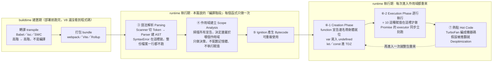

# Promise 是物件、NaN 屬於 Number、以及 JS 編譯階段做了哪三件事

> 本篇重點 a–n，共 14 個。三個看似無關的小問題，其實都指向同一件事：<mark style="background: #FFF3A3A6;">「你以為的型別」跟「引擎眼中的型別」常常不一樣。</mark>

---

## 5W1H 速查：讀本篇之前先把座標定好

> [!important]+ 最常被搞錯的一件事：<mark style="background: #FF5582A6;">本篇第三節說的「編譯階段」，整段都發生在 runtime 執行期</mark>
> 「編譯」這個詞被兩邊共用，所以很多人一看到就自動聯想成 Babel、webpack 那一格。但是：
> a. <mark style="background: #FFF3A3A6;">buildtime 建置期</mark>＝ 轉譯 transpile ＋ 打包 bundle。Babel／tsc／SWC 做的是<mark style="background: #BBFABBA6;">轉譯</mark>（高階語言 → 高階語言），<mark style="background: #FF5582A6;">不可以叫「編譯」</mark>，而且它在你部署前就跑完了，V8 根本還沒看到程式碼。
> b. <mark style="background: #FFF3A3A6;">runtime 執行期</mark>才是本篇 (j)～(m) 講的全部內容：V8 的編譯 compile（Parse → AST → Bytecode → JIT）**加上**執行，兩件事都在瀏覽器或 Node 載入腳本之後才開始。
> c. 還有更細的一刀：(l) 說的「提升」，<mark style="background: #FF5582A6;">Parse 階段做的只是「決策」</mark>（Scope Analysis：這個名字屬於哪個作用域？會不會被閉包捕獲？該放 Stack 還是 Heap？）。真正在 RAM 裡挖格子、把 `var` 寫成 `undefined`、把 `let`／`const` 劃進 TDZ，是<mark style="background: #BBFABBA6;">執行期每次進入該作用域的 Creation Phase</mark> 做的——Parse 每個函式只做一次，Creation Phase 進去幾次就做幾次。

| 5W1H | 問題 | 一句話答案 |
|---|---|---|
| **What** 是什麼 | 本篇的「編譯階段」到底是什麼？ | V8 在 <mark style="background: #BBFABBA6;">runtime 內部</mark>的前半段：詞法分析 → 語法分析 → AST → Scope Analysis → Ignition 產生 Bytecode。<mark style="background: #FF5582A6;">跟 Babel／webpack 完全是兩回事</mark> |
| **When** 什麼時候 | 它在哪一格？ | 在 <mark style="background: #FF5582A6;">runtime 執行期</mark>，瀏覽器或 Node 載入這支腳本之後、真正跑第一行之前。buildtime 那一格在你部署的那一刻就結束了 |
| **Who** 誰做的 | 誰做這三件事？ | V8 自己：Scanner 切 Token、Parser 建 AST、Ignition 產 Bytecode、TurboFan 做 JIT。<mark style="background: #ADCCFFA6;">Babel／tsc／SWC 一件都沒做</mark>，它們只做轉譯 |
| **Where** 在哪裡 | 這些東西存在哪？ | 都在記憶體。AST 與 Bytecode 在 **Heap**；hoisting 真正建立的綁定在 Environment Record（**Stack Frame**，被閉包捕獲的則在 **Heap 的 Context 物件**）。至於 `NaN`，它是 IEEE 754 在 Number 型別裡保留的<mark style="background: #FFF3A3A6;">一組特殊位元樣式</mark>，所以 `typeof` 當然是 `"number"` |
| **Which** 哪一種 | 哪些事只做一次，哪些每次重來？ | <mark style="background: #ADCCFFA6;">只做一次</mark>：Parse、Scope Analysis、產生 Bytecode（而且 V8 有 Lazy Parsing，函式主體可能拖到第一次被呼叫前才完整解析）。<mark style="background: #BBFABBA6;">每次重來</mark>：進入作用域時的 Creation Phase 與 Execution Phase |
| **How** 怎麼做到 | 三件事的先後順序？ | ① 語法解析（Token → AST，語法錯在這裡就 `SyntaxError`，整份檔案一行都不跑）→ ② 作用域建立與 hoisting 的**決策** → ③ Ignition 產生 Bytecode → 進執行期逐行跑 → 變成熱點再交給 TurboFan 編成機器碼 |
| **Why** 為什麼 | 三個看似無關的小題為什麼放一起？ | 因為它們是同一個坑的三種長相：<mark style="background: #FFF3A3A6;">「你以為的」跟「引擎眼中的」不一樣</mark>。你以為 Promise 解開後是什麼它就是什麼（其實容器永遠是物件）、你以為 `NaN` 不是數字（其實是 Number）、你以為「編譯」是 buildtime（其實是 runtime） |

### 時間軸：這件事發生在哪一格

```text
◄──────────── buildtime 建置期 ────────────►◄────────────── runtime 執行期 ──────────────►
     （你的電腦／CI，部署前就跑完，V8 沒看到）          （瀏覽器或 Node 載入腳本之後才開始）

 ①轉譯          ②打包         ┌──────── ★ 本篇第三節講的「編譯階段」全部在這裡 ────────┐
 transpile      bundle        │                                                      │
 ┌────────┐   ┌────────┐      │ ③語法解析          ④作用域建立      ⑤產生 Bytecode    │
 │Babel   │   │webpack │      │ Parsing            Scope Analysis   Ignition         │
 │tsc     │──►│Vite    │─────►│ ┌──────────────┐  ┌─────────────┐  ┌──────────────┐  │
 │SWC     │   │Rollup  │      │ │Scanner 切Token│  │掃描所有宣告  │  │AST → Bytecode│  │
 │TSX→JS  │   │合併壓縮│      │ │Parser  建 AST │─►│★只做「決策」 │─►│可重複使用     │  │
 │「轉譯」 │   │        │      │ │SyntaxError    │  │ 不配置記憶體 │  │              │  │
 │不是編譯 │   │        │      │ │在這裡就拋出   │  │ 不執行賦值   │  │              │  │
 └────────┘   └────────┘      │ └──────────────┘  └─────────────┘  └──────────────┘  │
                              │        每個函式只做一次（而且 V8 還有 Lazy Parsing）    │
                              └──────────────────────────┬───────────────────────────┘
                                                         ▼
                              ┌──────── ⑥執行階段：每次進入作用域都整包重來 ──────────┐
                              │ Creation Phase                                       │
                              │  ★ function 宣告：連名帶身體整包就位                  │
                              │  ★ var：註冊名字並寫入 undefined                      │
                              │  ★ let／const：註冊名字但不初始化 → TDZ               │
                              ├──────────────────────────────────────────────────────┤
                              │ Execution Phase 逐行真的執行                          │
                              │  ★ var x = 10 裡的「= 10」在這裡才做                  │
                              │  ★ new Promise 的 executor 在這裡同步、立刻被呼叫      │
                              ├──────────────────────────────────────────────────────┤
                              │ ⑦變成熱點 Hot Code → TurboFan 編成機器碼（JIT）        │
                              │   假設一旦被推翻 → Deoptimization 掉回 Bytecode        │
                              └──────────────────────────────────────────────────────┘

 ★ 一句話：第 ①② 格叫「轉譯／打包」，第 ③④⑤⑦ 格才叫「編譯」，而它們全都在 runtime 這一側。
```



> [!info]- 另外兩個小題也放進同一條軸看，會更清楚
> a. <mark style="background: #ADCCFFA6;">Promise 是物件</mark>：`new Promise(...)` 這件事發生在 <mark style="background: #BBFABBA6;">Execution Phase</mark>，執行到那一行才在 Heap 上生出一個物件；而 executor 是<mark style="background: #FFF3A3A6;">同步、立刻</mark>被呼叫的，`.then` 的回呼才會被丟進微任務佇列，等同步碼跑完才輪到它。
> b. <mark style="background: #ADCCFFA6;">NaN 屬於 Number</mark>：這件事甚至不在時間軸上——它是<mark style="background: #FFF3A3A6;">型別系統的靜態事實</mark>，由 IEEE 754 規定，不管在哪一格都成立。會覺得它「怪」，是因為名字在騙人，不是因為階段搞錯。
> c. 所以本篇三題的正確讀法是：<mark style="background: #BBFABBA6;">兩題是「型別的事實」，一題是「階段的事實」</mark>，把它們擺在同一張座標上就不會再混。


## 重點整理

### 一、Promise 本身永遠是一個物件

(a) <mark style="background: #ADCCFFA6;">`Promise` 是一個建構函式（Constructor）</mark>，而建構函式在 JavaScript 裡本身就是函式物件。用 `new Promise(...)` 會實例化並回傳一個 <mark style="background: #FFF3A3A6;">Promise 物件實例</mark>。

```js
const p = new Promise((resolve, reject) => {
  resolve('完成')
})

console.log(typeof p)            // "object"
console.log(p instanceof Promise) // true
```

(b) 逐行解釋 (a) 這段：
- `new Promise(...)` — `new` 這個運算子做四件事：建立一個空物件、把它的原型指向 `Promise.prototype`、把 `this` 綁到這個新物件上執行建構函式、最後回傳這個物件。
- `(resolve, reject) => {...}` — 這個叫 <mark style="background: #ADCCFFA6;">executor（執行器）</mark>，它會被<mark style="background: #FF5582A6;">同步、立刻</mark>執行（不是等到 `.then` 才跑），`resolve` 與 `reject` 是 JS 引擎傳給你的兩個內建函式。
- `typeof p` — `typeof` 對所有非函式的物件都回傳 `"object"`，所以這裡是 `"object"`。
- `p instanceof Promise` — `instanceof` 是沿著 `p` 的原型鏈（Prototype Chain）往上找，看有沒有一個環節等於 `Promise.prototype`，有就是 `true`。

(c) <mark style="background: #FFF3A3A6;">要分清楚兩件事：Promise「這個容器」永遠是物件，Promise「解開之後的結果」是什麼型別完全取決於你在 `resolve()` 裡傳了什麼。</mark>

```js
const a = Promise.resolve({ id: 1 })
const b = Promise.resolve('hello')

await a   // { id: 1 }  → 物件
await b   // 'hello'    → 原始值（string）
```

(d) <mark style="background: #D2B3FFA6;">次要備註</mark>：這也是為什麼 `async function` 一定回傳 Promise ——即使你 `return 1`，引擎也會幫你包成 `Promise.resolve(1)`；`await` 做的事就是把這層容器拆掉，把裡面的值交給你。

### 二、NaN 屬於 Number，不是 undefined

(e) <mark style="background: #FF5582A6;">`NaN`（Not a Number）在 JavaScript 的型別系統中屬於 `Number`</mark>，名字非常會誤導人。

```js
console.log(typeof NaN)   // "number"
```

(f) 為什麼叫「不是數字」卻是數字型別？因為 <mark style="background: #ADCCFFA6;">`NaN` 是 IEEE 754 浮點數標準裡定義的一個特殊數值（Special Value）</mark>。當數學運算算不出有意義的結果（例如 `0 / 0`、`'abc' * 2`、`Math.sqrt(-1)`），JavaScript 不會拋錯，而是回傳 `NaN` 表示「這是一個無效的數值結果」。它佔的是 Number 型別裡的一組特殊位元樣式，所以型別當然還是 Number。

(g) 跟 `undefined` 的分界：

| 值 | 意思 | `typeof` |
| --- | --- | --- |
| `undefined` | 變數尚未被賦值，或屬性不存在 | `"undefined"` |
| `NaN` | 變數<mark style="background: #BBFABBA6;">有值、且是數值型別</mark>，但這個數值內容無效 | `"number"` |

(h) <mark style="background: #FF5582A6;">`NaN` 是 JavaScript 中唯一不等於自己的值</mark>：`NaN === NaN` 是 `false`。所以不能用 `===` 去判斷。

(i) <mark style="background: #BBFABBA6;">正確的檢查方式是 `Number.isNaN()`</mark>：

```js
Number.isNaN(NaN)       // true
Number.isNaN('hello')   // false ← 正確：'hello' 本來就不是 number
isNaN('hello')          // true  ← 陷阱：全域舊版 isNaN 會先做型別轉換
```

<mark style="background: #FF5582A6;">全域的 `isNaN()`（沒有 `Number.` 前綴的那個舊 API）會先把參數 ToNumber 轉型再判斷</mark>，所以 `isNaN('hello')` 會是 `true`，這幾乎一定不是你要的。ES2015 之後請一律用 `Number.isNaN()`，它不做任何轉型。

### 三、JS 在編譯階段做了哪三件事

(j) JavaScript 雖然常被叫「腳本語言」，但執行前一樣會經過<mark style="background: #ADCCFFA6;">編譯階段（Compilation Phase）</mark>。V8 這類引擎在這個階段做三件事：語法解析、作用域建立與記憶體配置、生成位元組碼。

(k) <mark style="background: #FFF3A3A6;">① 語法解析（Parsing）</mark>

- <mark style="background: #ADCCFFA6;">詞法分析（Lexical Analysis／Tokenization）</mark>：把原始碼字串拆成最小單位的 Token。`let x = 10;` 會被拆成 `let`、`x`、`=`、`10`、`;`。
- <mark style="background: #ADCCFFA6;">語法分析（Syntactic Analysis）</mark>：把 Token 組成 <mark style="background: #ADCCFFA6;">AST（Abstract Syntax Tree，抽象語法樹）</mark>。
- <mark style="background: #FF5582A6;">語法有誤在這一步就會拋 `SyntaxError`，而且整份程式碼一行都不會執行</mark>——這就是為什麼少打一個括號會讓整個檔案完全不動，而不是「跑到那一行才壞掉」。

(l) <mark style="background: #FFF3A3A6;">② 作用域建立與提升（Scope & Hoisting）</mark>——這是編譯階段最核心的操作。引擎掃描所有變數與函式宣告，建立 <mark style="background: #ADCCFFA6;">作用域鏈（Scope Chain）</mark>：

| 宣告方式 | 編譯階段做的事 | 結果 |
| --- | --- | --- |
| `function foo() {}` | 在記憶體中建立函式物件，並把名稱直接綁到該物件 | <mark style="background: #BBFABBA6;">可以在宣告前呼叫</mark> |
| `var a` | 註冊變數名，預設賦值 `undefined` | 宣告前存取得到 `undefined` |
| `let` / `const` | 註冊變數名，但<mark style="background: #FF5582A6;">不初始化</mark>，劃入 <mark style="background: #ADCCFFA6;">TDZ（Temporal Dead Zone，暫時性死區）</mark> | 宣告前存取拋 `ReferenceError` |

<mark style="background: #FFB8EBA6;">關鍵補充</mark>：編譯階段<mark style="background: #FF5582A6;">完全不執行任何賦值</mark>。`var x = 10` 裡的 `= 10` 是留到執行階段才做的，所謂「提升」提升的只有「宣告」這件事。

(m) <mark style="background: #FFF3A3A6;">③ 生成位元組碼（Bytecode Generation）</mark>

- V8 的解譯器 <mark style="background: #ADCCFFA6;">Ignition</mark> 把 AST 轉成中介語言 <mark style="background: #ADCCFFA6;">Bytecode（位元組碼）</mark>。
- 同時為 <mark style="background: #ADCCFFA6;">JIT（Just-In-Time Compilation，即時編譯）</mark>做準備：執行階段若某段程式碼變成<mark style="background: #FFB8EBA6;">熱點（Hot Code，被反覆執行）</mark>，最佳化編譯器 <mark style="background: #ADCCFFA6;">TurboFan</mark> 會把它進一步編成高效能的機器碼（Machine Code）。

(n) 編譯階段與執行階段的分工：

| 階段 | 主要任務 | 處理的東西 |
| --- | --- | --- |
| 編譯階段 | 語法檢查、建立作用域、配置記憶體位置（提升）、生成位元組碼 | `var a;`／`function foo() {}`／攔截語法錯誤 |
| 執行階段 | 依序執行、變數賦值、函式呼叫、JIT 最佳化 | `a = 1;`／`foo()`／計算與邏輯運算 |

## ⚠️ 存疑／更正

- Gemini 這段說明整體是正確的，但有兩處值得補上：
  1. <mark style="background: #FFB8EBA6;">它只提到 `Number.isNaN()`，沒有提醒全域 `isNaN()` 的轉型陷阱</mark>。這是面試很愛問的一題，本篇 (i) 已補齊。另外還有一招不靠 API 的寫法：`x !== x` 為 `true` 就代表是 `NaN`，因為 (h) 說的那個特性。
  2. <mark style="background: #FFB8EBA6;">「編譯階段」這個詞在 V8 的實際流程裡更精確的說法是「Parse ＋ Ignition 產生 Bytecode」</mark>，而且 V8 有 <mark style="background: #ADCCFFA6;">Lazy Parsing（惰性解析）</mark>：函式主體不會在一開始就完整解析，要等到真的被呼叫才做完整 parse。所以「執行前整份檔案都被完整編譯過一次」的印象並不精確——只有頂層與預解析（Pre-parse）掃過的宣告是這樣。
- Gemini 說 executor 的執行時機這件事在本串對話中沒有提到，(b) 那條「executor 同步立刻執行」是本筆記補充的，出處見下方資料來源表的 MDN 連結。

## 相關題目練習

| 題目 | 連結 | 為什麼相關 |
| --- | --- | --- |
| LeetCode 2723. Add Two Promises | https://leetcode.com/problems/add-two-promises/ | 直接練「Promise 是容器、await 拆容器」這個心智模型 |
| LeetCode 2621. Sleep | https://leetcode.com/problems/sleep/ | 最小的自製 Promise，看清楚 executor 與 resolve 的關係 |
| LeetCode 2727. Is Object Empty | https://leetcode.com/problems/is-object-empty/ | 練 `typeof` 與物件判斷的邊界 |
| LeetCode 2703. Return Length of Arguments Passed | https://leetcode.com/problems/return-length-of-arguments-passed/ | 對照 (l)：形式參數也是在編譯階段就被綁定的 |
| NeetCode — JavaScript / Promise 系列 | https://neetcode.io/courses | 有影片講解非同步與事件迴圈，補足本篇沒展開的部分 |

## 關聯筆記

- [[事件循環-Event-Loop-微任務與巨任務]] — 本篇 (c)(d) 只說 Promise 是容器，「容器什麼時候被打開」屬於微任務佇列的範疇，兩篇合看才完整。
- [[15-ToPrimitive-ToNumber-型別轉換抽象操作]] — (i) 那個全域 `isNaN()` 的陷阱，底層跑的就是那篇講的 ToNumber 抽象操作。
- [[09-Hoisting-函式宣告vs函式表達式-TDZ]] — (l) 的表格是那篇的濃縮版，想細看 TDZ 的行為請看那篇。
- [[04-變數宣告-let-const-var]] — 同上，`var`／`let`／`const` 在編譯階段的差別是那篇的主題。
- [[01-引擎-Engine-到底是什麼]] — (m) 提到的 Ignition 與 TurboFan 屬於引擎內部管線，那篇有完整說明。
- [[V8引擎完整管線-Parse到Deoptimization]] — ⚠️ 那條 Lazy Parsing 的補充，細節在那篇。
- [[15-ReferenceError-vs-undefined-值與錯誤的分界]] — (g) 的 `undefined` 與 (l) 的 TDZ `ReferenceError`，那篇專門處理這條分界線。
- [[JavaScript-函式類型總整理]] — (a) 說「建構函式本身也是函式物件」，那篇有完整的函式分類。

## 各對話來源（原文）

### JavaScript Promise 是 Object 嗎？（2026-08-31）— https://gemini.google.com/app/aa888bdb7c1bb036

**使用者：** promise 沒有回傳 object 嗎

**Gemini：** `Promise` 本身在 JavaScript 中就是一個 Object。具體來說：(1) `Promise` 是一個構造函數，使用 `new Promise(...)` 時會實例化並回傳一個 Promise 物件實例，`typeof p` 是 `"object"`、`p instanceof Promise` 是 `true`。(2) Promise 內部包裝的值（Resolution Value）：Promise 物件的核心作用是作為異步操作結果的容器，`resolve(x)` 傳入物件時 `.then(data => ...)` 或 `await` 拿到的就是那個物件；傳入字串、數字或布林值，拿到的就是對應的原生型別。簡單來說，Promise 結構本身永遠是一個物件，而它最終 resolve 出來的結果取決於你在 `resolve()` 裡傳入什麼資料。

**使用者：** not a number NaN 算是 undefined 還是 Number?

**Gemini：** `NaN` 在 JavaScript 的型別系統中屬於 `Number`，不是 `undefined`，可以用 `typeof NaN` 驗證會得到 `"number"`。為什麼叫「Not a Number」卻是 Number 型別：`NaN` 是 IEEE 754 浮點數標準中定義的一個特殊數值，當數學運算無法產生有意義的數字時（例如 `0 / 0` 或 `'abc' * 2`），JavaScript 不會拋出錯誤而是回傳 `NaN` 表示「無效或無法表達的數值結果」。與 `undefined` 的差異：`undefined` 代表變數尚未被賦值或屬性不存在，`NaN` 代表這個變數有值、是數值型別，但數值內容無效。注意事項：`NaN` 是 JavaScript 中唯一不等於自身的值（`NaN === NaN` 為 `false`），要判斷請用 `Number.isNaN()`。

**使用者：** JS 在編譯階段做了哪些事情

**Gemini：** JavaScript 引擎（例如 V8）在編譯階段主要進行三個步驟。(1) 語法解析（Parsing）：詞法分析把字串拆成 Token，語法分析把 Token 組成 AST，語法有誤在此階段就拋 `SyntaxError`，這也是為什麼語法錯誤發生時程式碼完全不會執行。(2) 作用域建立與提升（Scope & Hoisting）：掃描所有變數與函式宣告建立作用域鏈；`function` 宣告在記憶體中建立函式物件並直接綁定名稱，`var` 註冊變數名並預設賦予 `undefined`，`let`／`const` 註冊變數名但劃分為 TDZ 不予初始化。注意編譯階段完全不執行任何賦值操作。(3) 生成位元組碼（Bytecode Generation）：解釋器（V8 的 Ignition）把 AST 轉譯成 Bytecode，同時為 JIT 做準備，執行階段由 TurboFan 把熱點程式碼進一步優化編譯為機器碼。最後附上編譯階段與執行階段的對比表。

## 資料來源（含查證時間）

| 主題 | 連結 | 版本／查證時間 |
| --- | --- | --- |
| 本篇對話（JavaScript Promise 是 Object 嗎？） | https://gemini.google.com/app/aa888bdb7c1bb036 | Gemini Flash，2026-08-31 |
| MDN — Promise（含 executor 同步執行的說明） | https://developer.mozilla.org/en-US/docs/Web/JavaScript/Reference/Global_Objects/Promise | MDN 現行版本，2026-08-31 查證 |
| MDN — Number.isNaN() vs 全域 isNaN() | https://developer.mozilla.org/en-US/docs/Web/JavaScript/Reference/Global_Objects/Number/isNaN | MDN 現行版本，2026-08-31 查證 |
| ECMA-262 — The Number Type（NaN 的規範定義） | https://tc39.es/ecma262/#sec-ecmascript-language-types-number-type | TC39 現行草案，2026-08-31 查證 |
| IEEE 754-2019 浮點數標準（NaN 的來源） | https://standards.ieee.org/ieee/754/6210/ | IEEE 754-2019，2026-08-31 查證 |
| V8 官方部落格 — Ignition 與 TurboFan 管線 | https://v8.dev/blog/launching-ignition-and-turbofan | v8.dev，原文 2017-05，2026-08-31 查證仍為現行架構說明 |
| V8 官方部落格 — Lazy Parsing（惰性解析） | https://v8.dev/blog/preparser | v8.dev，原文 2019-04，2026-08-31 查證 |

---

由 Gemini 對話自動整理 · 更新於 2026-08-31
