# Symbol 符號型別 & 物件的 key 只能 string / symbol

> 相關：[[查看plain-object的prototype]]、[[Object靜態方法速查]]、[[for...of]]
> MDN：<https://developer.mozilla.org/zh-TW/docs/Web/JavaScript/Reference/Global_Objects/Symbol>

---

## 5W1H 速查：讀本篇之前先把座標定好

> [!important]+ 最常被搞錯的一件事：<mark style="background: #FF5582A6;">原始碼裡的 `Symbol("id")` 不是一個常數，它是一道「每次執行都造一個新值」的指令</mark>
> 很多人把 `Symbol("id")` 看成像 `"id"` 那樣的字面值，以為寫兩次就是同一個東西——所以看到 `Symbol("id") === Symbol("id")` 竟然是 `false` 會傻住。<mark style="background: #ADCCFFA6;">括號裡那串字只是給人看的說明文字，跟身分無關</mark>；真正的身分是<mark style="background: #FFF3A3A6;">執行期執行到那一行的當下，引擎替你造出來的那一個值</mark>。這也是為什麼「你沒留住變數就再也取不到那個值」——你沒辦法重建同一個 Symbol。要「同一個」請改用走全域符號登錄檔的 `Symbol.for("id")`。

| 5W1H | 問題 | 一句話答案 |
|---|---|---|
| **What** 是什麼 | Symbol 是什麼？ | ES6 新增的<mark style="background: #ADCCFFA6;">原始型別（primitive）</mark>，特色是「獨一無二」，每個 Symbol 都不相等。`typeof` 出來是 `"symbol"` |
| **When** 什麼時候 | 一個 Symbol 值是何時被建立的？ | <mark style="background: #FF5582A6;">runtime 執行期</mark>，而且是「執行到那一行」的當下。buildtime 的轉譯與打包只是把這行字搬來搬去，<mark style="background: #FF5582A6;">不會產生任何 Symbol 值</mark> |
| **Who** 誰做的 | 誰建立它？ | JS 引擎。`Symbol()` 每次呼叫都造一個新的；`Symbol.for()` 先去<mark style="background: #ADCCFFA6;">全域符號登錄檔</mark>查表（單純查表，不是迴圈），找到就回傳同一個，沒找到才建立並登記 |
| **Where** 在哪裡 | 它存在哪裡？ | 只存在<mark style="background: #BBFABBA6;">執行期的記憶體</mark>裡。資料庫沒有 Symbol 這個型別，`JSON.stringify` 也直接忽略 Symbol key，<mark style="background: #FF5582A6;">一旦要序列化落地，它就消失了</mark> |
| **Which** 哪一種 | 物件的 key 可以是哪些型別？ | 只有 <mark style="background: #BBFABBA6;">string 與 symbol</mark> 兩種。其他型別都會被自動轉成字串，物件當 key 會全部撞在 `"[object Object]"`。要任意型別當 key 請改用 `Map` |
| **How** 怎麼做到 | 怎麼把 Symbol 當 key？ | 先把它存進變數，再用 `[變數]` 這個計算屬性鍵寫進物件；讀回來也必須用同一個變數加中括號。直接寫 `{ id: 1 }` 得到的是字串 key `"id"`，跟那個 Symbol 完全無關 |
| **Why** 為什麼 | 為什麼需要這種型別？ | 為了解決<mark style="background: #FFF3A3A6;">「同一個 JS 執行環境裡，不同函式庫往同一個物件掛屬性會不會撞名」</mark>。它提供的是<mark style="background: #FF5582A6;">弱封裝（weak encapsulation）</mark>——只是不顯眼，`Object.getOwnPropertySymbols` 與 `Reflect.ownKeys` 照樣撈得到，<mark style="background: #FF5582A6;">絕對不能拿來藏密碼或 token</mark> |

### 時間軸：從 buildtime 到 runtime，Symbol 值站在哪一格

```text
◄──────────── buildtime 建置期 ────────────►◄──────── runtime 執行期 ────────────►
      （你的電腦或 CI，部署前就跑完）              （瀏覽器或 Node 載入腳本之後）

 ①轉譯          ②打包            ③Parse          ④Bytecode      ⑤真的執行到那一行
 transpile      bundle           解析             產生            ↓↓↓↓↓↓↓↓↓↓
 ┌────────┐   ┌────────┐      ┌──────────┐   ┌──────────┐   ┌──────────────────┐
 │Babel   │   │webpack │      │Scanner   │   │Ignition  │   │ ★ 執行 Symbol()   │
 │tsc     │──►│Vite    │─────►│Parser    │──►│把 AST 編成│──►│   造出一個全新、   │
 │SWC     │   │Rollup  │      │AST       │   │Bytecode  │   │   永不相等的值     │
 └────────┘   └────────┘      └──────────┘   └──────────┘   ├──────────────────┤
      │             │              │                        │ ★ Symbol.for()   │
      ▼             ▼              ▼                        │   查全域登錄檔     │
 這三格看到的都只是                                          │   有就拿舊的       │
「Symbol("id") 這幾個字元」，                                 ├──────────────────┤
 沒有任何 Symbol 值被建立。                                   │ ★ 存進物件當 key  │
 打包工具甚至可能把它搬位置、                                  │   讀取要用同一個   │
 改變數名，但值一個都沒生出來。                                │   變數＋中括號     │
                                                            ├──────────────────┤
                                                            │ ★ 序列化就消失    │
                                                            │ JSON.stringify    │
                                                            │ 忽略 Symbol key   │
                                                            │ 資料庫沒這個型別   │
                                                            └──────────────────┘

 ★ Symbol 值站在第 ⑤ 格，而且「同一行程式碼跑幾次就造幾個」。
   這就是 Symbol("id") === Symbol("id") 為 false 的全部原因。
```

同一件事用 Mermaid 再畫一次：

```mermaid
flowchart LR
    subgraph BT["buildtime 建置期：只是字元，沒有任何 Symbol 值"]
        T["轉譯 transpile<br/>Babel／tsc／SWC"] --> BU["打包 bundle<br/>webpack／Vite／Rollup"]
    end
    subgraph RT1["runtime 執行期 · 只做一次的部分"]
        P["Parse 解析<br/>Scanner → Parser → AST<br/>看到的仍只是語法節點"] --> BC["Ignition 產生 Bytecode"]
    end
    subgraph RT2["runtime 執行期 · 執行到那一行才發生"]
        S1["★ Symbol&#40;'id'&#41;<br/>造出全新、永不相等的值<br/>跑幾次就造幾個"] --> S2["★ Symbol.for&#40;'id'&#41;<br/>查全域符號登錄檔<br/>有就回傳同一個"]
        S2 --> S3["★ 當成物件 key 寫入<br/>用計算屬性鍵 中括號變數<br/>不會出現在 for...in／Object.keys"]
        S3 --> S4["★ 序列化就消失<br/>JSON.stringify 忽略<br/>資料庫沒有 Symbol 型別"]
    end
    BU --> P
    BC --> S1
    S4 -.->|"再執行一次同一行<br/>就是另一個全新的 Symbol"| S1
```



> [!info]+ 一句話驗證法：這件事屬於哪一格？
> 問自己：<mark style="background: #BBFABBA6;">「這件事對同一行程式碼做幾次？」</mark>
>
> 1. 只做一次、而且部署前就做完 → buildtime（第 ①②格），例如把 TypeScript 的型別註記拿掉。
>
> 2. 每個函式只做一次 → runtime 的解析與編譯（第 ③④格），例如 Parser 認出 `Symbol("id")` 是一個函式呼叫表達式。
>
> 3. 執行幾次就發生幾次 → runtime 的執行（第 ⑤格），<mark style="background: #FFF3A3A6;">Symbol 值的誕生就在這一格</mark>。

---

## 一句話

**物件(object)的屬性 key 只能是「字串 string」或「符號 Symbol」兩種型別。** 其他型別當 key 都會被「自動轉成字串」。（想用任何型別當 key → 用 `Map`。）

---

## 1. key 只能 string / symbol —— 其他會被轉成字串

```js
const obj = {};
obj[1]   = "a";   // 數字 1 → 被轉成字串 "1"
obj["1"];         // "a" ← 證據：用字串 "1" 拿得到，代表 key 本來就是 "1"
obj[true] = "b";  // → "true"
obj[{}]   = "c";  // → "[object Object]"（物件被Prototype.toString()硬轉成這串字！）
console.log(Object.keys(obj));   // ["1", "true", "[object Object]"] 全是字串
```
→ 所以拿物件當 key 會全部撞在 `"[object Object]"`，這是用物件當字典的大坑。要任意型別 key 請用 **Map**。

---

## 2. Symbol 是什麼

ES6 新增的**原始型別(primitive)**，特色是「**獨一無二**」：每個 Symbol 都不相等。

```js
const s1 = Symbol("desc");   // 括號內只是「說明文字」，方便除錯，不影響唯一性
const s2 = Symbol("desc");
console.log(s1 === s2);      // false ← 即使說明一樣，也是兩個不同的 Symbol
console.log(typeof s1);      // "symbol"
```

## 3. 為什麼用 Symbol 當 key？

- **不會撞名**：給物件加 Symbol key，絕不會跟別人（或函式庫）的字串 key 衝突。
- **預設「隱身」**：Symbol key 不會出現在 `for...in`、`Object.keys`、`JSON.stringify`。

```js
const id = Symbol("id");
const user = { name: "Abby", [id]: 123 };   // 用 [變數] 當 key（computed key）
console.log(Object.keys(user));             // ["name"] ← Symbol key 沒出現
console.log(user[id]);                      // 123 ← 要用同一個 Symbol 才取得到
```

要拿 Symbol key 得用專門的方法（見 [[Object靜態方法速查]]）：
```js
Object.getOwnPropertySymbols(user);   // [Symbol(id)]
Reflect.ownKeys(user);                // ["name", Symbol(id)] ← 字串+Symbol 全拿
```

### 完整範例：把 Symbol 放進物件當 key

關鍵差別：**字串 key 直接寫；Symbol key 一定要先存進變數，再用 `[變數]`。**

```js
// === 字串 key：直接寫，不用變數 ===
const a = { name: "Abby" };     // name 自動變字串 key "name"
console.log(a.name);            // "Abby"

// === Symbol key：要先有變數，再用 [變數] ===
const id = Symbol("id");        // ① 先建立 Symbol，存進變數 id（要保留它！）

// 寫法 1：在物件字面值裡用「計算屬性鍵 [id]」
const user = {
  name: "Abby",                 // 字串 key：直接寫
  [id]: 123                     // Symbol key：一定要 [id]，不能寫 id
};

// 寫法 2：建完物件後再加
const user2 = { name: "Joe" };
user2[id] = 456;                // 用中括號 + 變數

// === 讀回來：必須用「同一個」Symbol 變數，必須用中括號一組 ===
console.log(user[id]);          // 123  ← 用 id 取得到
console.log(user2[id]);         // 456

// === 對照：為什麼不能直接寫 id ===
const wrong = { id: 999 };      // 這個 id 是「字串 key "id"」，不是上面那個 Symbol！
console.log(wrong[id]);         // undefined ← 此物件沒有「那個 Symbol」當 key
console.log(wrong.id);          // 999       ← 它只有字串 key "id"
console.log(wrong["id"]);       // 999

// === Symbol key 會「隱身」===
console.log(Object.keys(user));               // ["name"] ← 看不到 Symbol key
console.log(Object.getOwnPropertySymbols(user)); // [Symbol(id)] ← 要這樣才看得到
```

> 重點：**Symbol 是獨一無二的，你沒留住 `id` 這個變數，就再也取不到那個值**（因為無法重建「同一個」Symbol）。這跟字串 key 可以隨時用 `"name"` 字面值取得，很不一樣。

## 4. 內建的「知名 Symbol」(well-known symbols)

JS 內部用 Symbol 當「協定鉤子」，最常見的是 **`Symbol.iterator`**——物件有沒有它，決定能不能 `for...of`（即「可迭代 iterable」，見 [[查看plain-object的prototype]] 的 enumerable vs iterable）。

```js
const arr = [1, 2, 3];
typeof arr[Symbol.iterator];   // "function" ← 陣列有，所以可 for...of
const obj = {};
obj[Symbol.iterator];          // undefined  ← plain object 沒有，不能 for...of
```

---

## 5. Object key vs Map key（對照）

| | Object 的 key | Map 的 key |
|---|---|---|
| 可用型別 | **只有 string / symbol** | **任何型別**（數字、物件、函式…） |
| 其他型別 | 自動轉成字串 | 原樣保留 |
| 適合 | 固定結構的資料 | 任意鍵值字典 |

> 記憶：**物件 key 只認 string/symbol；要用物件或數字當 key 就改用 Map。**

---

## 追加 2026-08-14（Gemini 對話補充）

> 來源：<https://gemini.google.com/app/64ba1028141e5c94>
> 補充重點 a–f，共 6 個。上面第 1–5 節維持原樣，以下是原本沒寫到的四件事：全域符號登錄檔、`new Symbol()` 為何被禁、弱封裝的正確定義、以及 Symbol 與資料庫的關係。

### 6. `Symbol.for()` 與全域符號登錄檔

a. `Symbol("desc")` 每次呼叫都產生一個<mark style="background: #FFF3A3A6;">全新、永不相等</mark>的 Symbol；`Symbol.for("key")` 則走<mark style="background: #ADCCFFA6;">全域符號登錄檔（Global Symbol Registry）</mark>——它是一個<mark style="background: #BBFABBA6;">單純的查表存取，不是迴圈</mark>：先在登錄檔裡找有沒有這個 key，找到就回傳<mark style="background: #FFF3A3A6;">同一個</mark> Symbol，沒找到才建立新的並登記進去。

```js
Symbol("id")     === Symbol("id");      // false ← 每次都是新的
Symbol.for("id") === Symbol.for("id");  // true  ← 登錄檔裡是同一個
Symbol.keyFor(Symbol.for("id"));        // "id"  ← 反查登錄檔的 key
Symbol.keyFor(Symbol("id"));            // undefined ← 沒登記過，查不到
```

b. <mark style="background: #D2B3FFA6;">用途分界</mark>：要「絕對唯一、誰都撞不到」用 `Symbol()`；要「跨模組／跨 iframe 共用同一個 Symbol」用 `Symbol.for()`。

### 7. 為什麼不能寫 `new Symbol()`

c. `new Symbol()` 會直接<mark style="background: #FF5582A6;">拋出 TypeError</mark>。其他原始型別（Number、String、Boolean）都允許 `new` 出一個<mark style="background: #ADCCFFA6;">包裝物件（wrapper object）</mark>，只有 Symbol 被規格明文禁止。原因是<mark style="background: #FFF3A3A6;">避免混淆</mark>：Symbol 的整個存在意義就是「一個獨一無二的原始值」，如果允許 `new Symbol()`，就會冒出「兩個包著同一個 Symbol 的不同物件」這種自相矛盾的結構。

d. 真的需要包裝物件時，改用 `Object(sym)`。<mark style="background: #FF5582A6;">注意這不是「改變了 Symbol 的型別」</mark>，而是<mark style="background: #BBFABBA6;">另外造了一個物件把它包在裡面</mark>；原本那個 Symbol 仍然是 symbol 型別：

```js
const sym = Symbol("id");
typeof sym;              // "symbol"  ← 原本的沒變
const wrapped = Object(sym);
typeof wrapped;          // "object"  ← 這是新造的包裝物件
wrapped.valueOf() === sym;  // true   ← 裡面裝的還是同一個 Symbol
new Symbol("id");        // TypeError: Symbol is not a constructor
```

### 8. 「弱封裝」到底弱在哪裡

e. <mark style="background: #ADCCFFA6;">封裝（Encapsulation）</mark>是把資料與操作資料的方法包成一個獨立單位，外界只能透過它提供的介面存取。MDN 對 Symbol 的用詞是 <mark style="background: #ADCCFFA6;">weak encapsulation／weak form of information hiding</mark>（弱封裝／弱資訊隱藏），三個關鍵句的意思是：

- <mark style="background: #FFF3A3A6;">hidden from any mechanism other code will typically use to access the object</mark>——Symbol key<mark style="background: #FFF3A3A6;">不會出現在</mark> `for...in`、`Object.keys()`、`JSON.stringify()` 這些「一般人會用的存取管道」裡。
- <mark style="background: #FF5582A6;">但這只是「不顯眼」，不是「真的存取不到」</mark>：`Object.getOwnPropertySymbols(obj)` 與 `Reflect.ownKeys(obj)` 一樣撈得出來。<mark style="background: #FF5582A6;">所以絕對不能拿 Symbol 來藏密碼、token 這類真正的機密。</mark>
- 這就是為什麼叫「<mark style="background: #ADCCFFA6;">弱</mark>」封裝——真正的私有欄位請用 <mark style="background: #BBFABBA6;">class 的 `#privateField` 語法</mark>或閉包，那才是引擎層級擋掉的。

### 9. Symbol 與資料庫（實務上的分界）

f. <mark style="background: #FF5582A6;">資料庫沒有 Symbol 這個資料型別。</mark>PostgreSQL、MySQL 都不支援，主鍵（primary key）一律是整數、字串或 UUID。Symbol 是<mark style="background: #ADCCFFA6;">純執行期（runtime）</mark>的概念，一旦資料要序列化落地（`JSON.stringify` 也會直接忽略 Symbol key），它就消失了。

> [!tip] 實務結論
> Symbol 解決的是<mark style="background: #FFF3A3A6;">「同一個 JS 執行環境裡，不同函式庫往同一個物件上掛屬性會不會撞名」</mark>的問題，跟資料庫的鍵值設計是兩個世界。用 UUID 當主鍵時，撞名問題本來就不存在，不需要也不可能改用 Symbol。

---

### 追加 2026-09-09：`Symbol.for` 與「一定要用變數接住」的再確認

g. 又一次對話問到同樣兩件事，答案跟上面完全一致，這裡只做<mark style="background: #D2B3FFA6;">交叉確認</mark>、不重複展開：

- <mark style="background: #BBFABBA6;">`Symbol.for("b")` 會先去全域符號登錄檔（global registry）找鍵為 `"b"` 的 Symbol，找到就回傳既有的，找不到才新建並註冊</mark>。這正是它跟 `Symbol("b")` 的分水嶺——後者每次執行都造一個新值。
- <mark style="background: #FF5582A6;">為什麼一定要寫 `const a = Symbol("a")` 而不能每次現寫 `Symbol("a")`</mark>：因為沒把值接住就再也拿不到那個 Symbol 的參考，也就無法拿它當 key 去存取。（用 `Symbol.for` 則沒有這個問題，因為登錄檔幫你記住了。）

> [!tip]+ 面試常考的 prototype 三題（同場加映）
> 該次對話也順帶問了「面試會考的 Object.prototype 問題」，Gemini 給的三題是：<mark style="background: #FFF3A3A6;">解釋原型鏈的概念與運作</mark>、<mark style="background: #FFF3A3A6;">`__proto__` 與 `prototype` 的差別</mark>、<mark style="background: #FFF3A3A6;">`instanceof` 與 `Object.create` 怎麼用</mark>。這三題在 vault 裡都有完整答案：[[函式的兩條線-prototype屬性與Prototype原型]]、[[原型鏈階數-互動版]]、[[查看plain-object的prototype]]，以及整理好的 [[原型-面試考題]]。

> [!warning]+ ⚠️ 該次對話品質備註
> 這是一段<mark style="background: #FF5582A6;">語音輸入的對話，逐字稿辨識嚴重破碎</mark>（「新寶石」＝Symbol、「原信念」＝原型鏈、「full」＝`for`），中間還混進了完全無關的生活問題。技術內容<mark style="background: #D2B3FFA6;">全部與本篇既有段落重疊</mark>，因此不另開新筆記，只在此併入來源與交叉確認。<mark style="background: #ADCCFFA6;">`Object.getOwnPropertySymbols` 的使用情境</mark>那一問對方沒有回答完，若還想知道請見本篇第 8 節與 [[Object靜態方法vs原型方法-Symbol弱封裝與species]]。

---

## 資料來源（含查證時間）

| 主題 | 連結 | 版本／時間 |
|---|---|---|
| 第 6–9 節原始對話 | https://gemini.google.com/app/64ba1028141e5c94 | Gemini 對話（語音輸入），整理於 2026-08-14 |
| 追加段：`Symbol.for` 登錄檔、變數接住、prototype 面試三題 | https://gemini.google.com/app/d703923c0ccc127d | Gemini 對話（語音輸入），整理於 2026-09-09 |
| Symbol 型別、`Symbol.for`、`new Symbol()` 拋錯、weak encapsulation 原文 | https://developer.mozilla.org/zh-TW/docs/Web/JavaScript/Reference/Global_Objects/Symbol | MDN，查證於 2026-08-14 |
| class 私有欄位 `#`（真正的封裝） | https://developer.mozilla.org/en-US/docs/Web/JavaScript/Reference/Classes/Private_properties | MDN，查證於 2026-08-14 |
