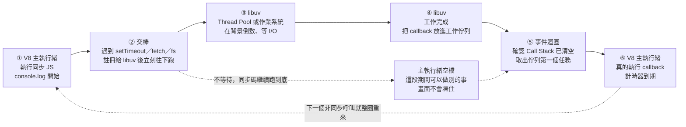

# V8 與 libuv 協同工作原理——瀏覽器與 Node.js 的非同步 I/O

> 承接：[[Node-js底層架構-V8-libuv-Bindings與CSR澄清]] 已整理過 Node.js 分層架構，這篇是同主題的另一次 Gemini 追問，聚焦在「V8 跟 libuv 到底怎麼分工、怎麼互相交接」的具體流程，可對照著看。

---

## 5W1H 速查：讀本篇之前先把座標定好

> [!important]+ 最常被搞錯的一件事先講：<mark style="background: #FF5582A6;">Chromium 瀏覽器並沒有用 libuv</mark>
> 很多人看到「V8 ＋ libuv」就以為只要有 V8 的地方就有 libuv，於是把「瀏覽器的 Event Loop」講成「libuv 的 Event Loop」——<mark style="background: #FFF3A3A6;">這是錯的</mark>。libuv 是 Node.js 這個宿主環境用的；Chromium 內部有自己的多進程事件迴圈與 I/O 機制（Mojo、net 模組），只是<mark style="background: #ADCCFFA6;">「非同步事件迴圈」的設計思想一脈相承</mark>而已。講的時候要分清楚「libuv 本體」與「libuv 式的設計思想」。順帶一提：瀏覽器的事件迴圈是由 HTML 規格定義的，跟 V8 也沒有關係——<mark style="background: #BBFABBA6;">V8 從頭到尾只做一件事：執行 JS</mark>。

| 5W1H | 問題 | 一句話答案 |
|---|---|---|
| **What** 是什麼 | V8 跟 libuv 各自是什麼？ | V8 是<mark style="background: #FFF3A3A6;">大腦</mark>：讀取、編譯、執行 JavaScript；libuv 是<mark style="background: #FFF3A3A6;">手腳與管家</mark>：跨平台非同步 I/O、事件迴圈、Thread Pool |
| **When** 什麼時候 | 兩者什麼時候交接？ | 在 <mark style="background: #BBFABBA6;">runtime 執行期</mark>，而且是「JS 一碰到會等待的工作就當場交出去」。V8 交完立刻往下跑，不停下來等 |
| **Who** 誰做的 | 那一秒鐘到底是誰在等？ | <mark style="background: #FF5582A6;">不是 V8，也不是 JS 主執行緒</mark>。是 libuv 的 Thread Pool，或是作業系統本身在等（epoll／kqueue／IOCP） |
| **Where** 在哪裡 | 哪個環境有 libuv、哪個沒有？ | Node.js 有，libuv 就編在 `node` 執行檔裡；<mark style="background: #FF5582A6;">Chromium 沒有</mark>，它用自己的 Mojo／net。DOM、`fetch` 這些 Web API 也是 Blink／Chromium 提供的，不是 V8 會的 |
| **Which** 哪一種 | 哪些工作會被交給 libuv，哪些不會？ | 會：網路請求、檔案讀寫、計時器、DNS 這類<mark style="background: #ADCCFFA6;">需要等待或要跟作業系統打交道</mark>的。不會：純計算——你寫一個十億次的 `for` 迴圈，還是死死卡在主執行緒上 |
| **How** 怎麼做到 | `setTimeout(fn, 1000)` 的完整流程？ | ① V8 執行同步碼 → ② 遇到 `setTimeout`，把計時任務註冊給 libuv 後立刻往下跑 → ③ 同步碼跑完 → ④ libuv 倒數完，把 callback 放進佇列 → ⑤ Call Stack 清空後，事件迴圈把 callback 交給 V8 執行 |
| **Why** 為什麼 | 為什麼非得這樣分工？ | 因為 JS 只有一條主執行緒，<mark style="background: #FF5582A6;">停下來等就是全店卡死</mark>。把「等待」外包出去，主執行緒才能一直有事做——這叫非阻塞 non-blocking，<mark style="background: #BBFABBA6;">不等於把 JS 變成多執行緒</mark> |

### 時間軸：這件事發生在哪一格

```text
◄─────────── buildtime 建置期 ───────────►◄─────────── runtime 執行期 ───────────►
      （你的電腦／CI，部署前就跑完）              （瀏覽器載入腳本／node app.js 之後）

 ①轉譯 transpile   ②打包 bundle        ③V8 編譯＋執行       ④V8 與 libuv 交接
 Babel／tsc／SWC    webpack／Vite       Parse→AST→Bytecode  ★ 本篇主題
 ┌─────────────┐  ┌─────────────┐    ┌──────────────┐  ┌───────────────────┐
 │TS→JS        │─►│合併、壓縮    │───►│★ V8 的「編譯」│─►│★ 非同步工作外包     │
 │高階→高階     │  │             │    │ 就發生在這裡  │  │★ 事件迴圈取回回呼   │
 └─────────────┘  └─────────────┘    └──────────────┘  └───────────────────┘

  這兩格叫「轉譯」與「打包」        這一格才叫「編譯 compile」   libuv 在這一格才出場
  不可以叫做編譯                   Parse→AST→Bytecode→JIT

 ★ 本篇主題整個落在 runtime 執行期，而且是最右邊那一格。
```

再把最關鍵的那一格放大：<mark style="background: #FFF3A3A6;">一次非同步呼叫的交接時間軸</mark>（以 `setTimeout(fn, 1000)` 為例）

```text
 t0 ─────────► t1 ─────────► t2 ─────────► t3 ─────────► t4 ─────────► t5
 │             │             │             │             │             │
 ①V8 主執行緒  ②交棒        ③libuv／OS    ④libuv        ⑤事件迴圈     ⑥V8 主執行緒
 執行同步碼    遇到          在背景倒數    時間到         看到 Call     真的執行
 console.log  setTimeout    1000ms        把 callback    Stack 空了     callback
 開始          註冊給 libuv  或等 I/O      放進工作佇列   取出佇列首位   計時器到期
 │             立刻往下跑    完成
 │                 │
 └─► 繼續跑 console.log 結束 ──► 同步碼跑完，Call Stack 清空
                                          （這整段期間主執行緒都是空的，可以做別的事）

 ★ t2～t4 完全沒有 V8 的事，也不佔用 JS 主執行緒。
 ★ 就算你寫的是 setTimeout(fn, 0)，callback 也一定要繞完這一圈才回得來。
```

同一條時間軸用 Mermaid 再畫一次：



> [!warning]- 兩個很容易連帶搞錯的延伸點
> a. <mark style="background: #FFF3A3A6;">libuv 有 Thread Pool，不代表你的 JS 變成多執行緒</mark>：Thread Pool 是 libuv 內部用來處理「作業系統沒提供非同步 API」的檔案 I/O 的機制，那些執行緒跑的是 C 程式碼，不是你的 JS。<mark style="background: #FF5582A6;">你的 JS 永遠只有一條主執行緒</mark>。
>
> b. <mark style="background: #ADCCFFA6;">事件迴圈不屬於 V8，但也不是只有 libuv 一種</mark>：Node.js 的事件迴圈在 libuv 裡；瀏覽器的事件迴圈由 HTML 規格定義、由瀏覽器自己實作。兩者概念相同、實作完全不同，細節見 [[事件循環-Event-Loop-微任務與巨任務]]。

## 重點整理

本篇重點 (a)–(e)，共 5 個。

### (a) 一句話分工
<mark style="background: #FFF3A3A6;">V8 是「大腦」</mark>：負責閱讀、編譯並執行 JavaScript 程式碼。
<mark style="background: #FFF3A3A6;">libuv 是「手腳與管家」</mark>：負責處理所有需要等待或跟作業系統打交道的非同步 I/O 任務（網路請求、檔案讀寫、計時器）。

### (b) V8 引擎：JIT 編譯 + 單線程 + 自帶 GC
Google 開發、C++ 撰寫的高效能 JavaScript／WebAssembly 引擎。核心任務是透過 <mark style="background: #ADCCFFA6;">JIT (Just-In-Time)</mark> 編譯技術，把 JS 原始碼直接轉譯成 CPU 看得懂的機器碼並執行；內建 <mark style="background: #ADCCFFA6;">Garbage Collector</mark> 自動回收記憶體；執行 JS 程式碼時只有一條主線程（Single-threaded）。

### (c) libuv：跨平台非同步 I/O 抽象層 + 線程池
最初為 Node.js 開發的跨平台 C 語言庫，專門實現事件循環（Event Loop）與非同步操作，解決「單線程被阻塞」的問題：

- 當 JS 需要網路請求、讀寫檔案、啟動 `setTimeout` 時，V8 本身不處理，交給 libuv 向作業系統申請資源。
- <mark style="background: #ADCCFFA6;">跨平台抽象化</mark>：不同 OS 的非同步機制不同（Linux 用 epoll、macOS 用 kqueue、Windows 用 IOCP），libuv 把這些差異封裝成統一 API。
- <mark style="background: #ADCCFFA6;">線程池（Thread Pool）</mark>：對某些 OS 沒提供非同步 API 的操作（如部分檔案 I/O），libuv 會在背景開額外線程處理，完成後把結果送回主線程。

### (d) 協同流程範例
```javascript
console.log("開始");
setTimeout(() => { console.log("計時器到期"); }, 1000);
console.log("結束");
```
1. V8 執行 `console.log("開始")`。
2. V8 遇到 `setTimeout`，把計時任務註冊、交給 libuv 管理，自己繼續往下跑、不等待。
3. V8 執行 `console.log("結束")`。
4. libuv 在背景倒數 1000ms，時間到後把對應的 Callback 放進事件佇列（Event Queue）。
5. V8 主線程清空、有空閒時，Event Loop 把佇列裡的 Callback 抓出來交給 V8 執行 `console.log("計時器到期")`。

### (e) Chromium 瀏覽器的特別之處
Chromium 系列瀏覽器（Chrome/Edge/Brave）直接內嵌 V8，但瀏覽器的 DOM API、Fetch API 等 Web API 是由 <mark style="background: #ADCCFFA6;">Blink / Chromium</mark> 宿主環境提供的，不是 V8 自己會的。<mark style="background: #FF5582A6;">⚠️ 補充澄清：Node.js 直接使用 V8 + libuv 的組合；但 Chromium 內部其實有自己的多進程 Event Loop 架構與底層 I/O 處理機制（如 Mojo / net 模組），並非直接套用 libuv 本身</mark>——只是兩者「非同步 Event Loop」的設計思想是一脈相承的，回答時需區分「libuv 本體」與「libuv 式的設計思想」。

## 各對話來源

### V8 與 libuv 協同工作原理（2026-07-29）— https://gemini.google.com/app/93d844f125b325f0

使用者：Chrome、Edge、Brave 等 Chromium 系列瀏覽器直接內嵌 V8，libuv 是什麼？

Gemini：V8 是「大腦」負責讀取、編譯並執行 JS；libuv 是「手腳與管家」負責處理非同步 I/O。V8 是 C++ 開發、JIT 編譯、單線程、自帶 GC 的 JS 引擎。libuv 是跨平台 C 語言庫，實現事件循環，把不同 OS 的非同步機制（epoll/kqueue/IOCP）封裝成統一 API，並用線程池處理沒有原生非同步 API 的操作。以 `setTimeout` 為例說明兩者如何交接任務、事件佇列、Event Loop 執行順序。補充：Chromium 瀏覽器裡 DOM/Fetch 等 Web API 由 Blink/Chromium 提供而非 V8；Node.js 直接用 V8+libuv，Chromium 則有自己的多進程 Event Loop（Mojo/net），與 libuv 思想一脈相承但非同一套實作。

## 資料來源（含查證時間）

| 主題 | 連結 | 版本／時間 |
|---|---|---|
| Gemini 對話原文 | https://gemini.google.com/app/93d844f125b325f0 | 2026-07-29 查證 |
| libuv 官方文件（背景知識，供交叉核對） | https://docs.libuv.org/ | 查證時間 2026-07-29（Gemini 回答未附官方連結，建議 Abby 之後自行核對線程池與各平台 I/O 機制細節是否有更新） |

> ⚠️ 存疑／更正提醒：Gemini 原句「Chromium 內部則有自己的多進程 Event Loop 架構與底層 I/O 處理機制…不過其運作邏輯與 libuv 的非同步 Event Loop 思想是一脈相承的」屬於概念性類比，並非指 Chromium 直接使用 libuv 原始碼，筆記中已在 (e) 標註澄清，避免誤解為「Chromium 也用 libuv」。
