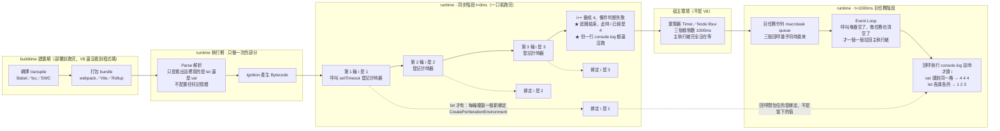

# for 迴圈 ＋ setTimeout 的經典陷阱 — var 共享一個變數、let 每輪新綁定、IIFE 舊解法

> [!info]- 🔗 與既有筆記的關聯
> 這是把三篇既有筆記綁在一起的「綜合題」，所以獨立成篇而不是塞進任何一篇：
> (1) [[04-變數宣告-let-const-var]] 提供「var 是函式作用域、let 是區塊作用域」的前提。
> (2) [[13-閉包-Closure-私有變數與傳址陷阱]] 提供「callback 記住的是環境不是值」的機制——本篇是那條規則最有名的翻車現場。
> (3) [[事件循環-Event-Loop-微任務與巨任務]] 與 [[執行緒-非同步-延遲的差異]] 提供「為什麼 callback 會晚 1 秒才讀變數」的時間軸。
> 三個觀念缺一個都答不出這題，這也是它成為經典面試題的原因。

> 本篇重點 a–m，共 13 個。

---

## 5W1H 速查：讀本篇之前先把座標定好

> [!important]+ 最常被搞錯的一件事：<mark style="background: #FF5582A6;">`let` 之所以有效，**不是**因為「`let` 有區塊作用域」</mark>
> 這是本篇 (m) 那個常見追問的核心。如果理由真的只是「區塊作用域」，那答案應該還是三個一樣的數字——因為 <mark style="background: #FFF3A3A6;">`for (let i = ...)` 的括號從頭到尾就只有一個區塊</mark>，一個區塊只會有一個綁定。
> 真正的理由是規格額外開的一條後門：<mark style="background: #BBFABBA6;">`for` 迴圈用 `let` 宣告時，每一輪迭代都會建立一個全新的環境，並把上一輪 `i` 的值複製進去（CreatePerIterationEnvironment）</mark>。所以三個回呼閉包住的是**三個不同的綁定**，不是同一格。
> 而且這件事<mark style="background: #FF5582A6;">發生在執行期的每一輪迭代當下</mark>，不是 buildtime、也不是 Parse 階段——Parse 只是「看出」這裡用了 `let`，真正複製綁定是迴圈跑到那一輪才做的。

| 5W1H | 問題 | 一句話答案 |
|---|---|---|
| **What** 是什麼 | 這個陷阱到底是什麼？ | 三個 `setTimeout` 回呼全部在<mark style="background: #FFF3A3A6;">迴圈已經跑完之後</mark>才執行，而 `var` 從頭到尾只有**一格** `i`，所以三個回呼讀到的是同一格、同一個最終值 |
| **When** 什麼時候 | 迴圈與回呼分別在哪一刻？ | 全在 runtime 執行期，但不同刻：<mark style="background: #ADCCFFA6;">t≈0ms</mark> 同步迴圈一口氣跑完（`i` 已經變成 4）；<mark style="background: #ADCCFFA6;">t≈1000ms</mark> 回呼才從巨任務佇列被拉回主執行緒執行 |
| **Who** 誰做的 | 是誰在管這三段？ | a. `i++`、登記計時器 → V8 主執行緒；b. 1000ms 倒數、時間到把回呼推進佇列 → <mark style="background: #FFF3A3A6;">宿主環境</mark>（瀏覽器 Timer／Node 的 libuv timers 階段）；c. 把回呼拉回主執行緒 → Event Loop；d. `let` 的每輪新綁定 → V8 依規格做 |
| **Where** 在哪裡 | 那個 `i` 到底住在哪？ | `var`：<mark style="background: #FF5582A6;">一格</mark>，而且因為被回呼閉包捕獲，配置在 **Heap 的 Context 物件**上，三個回呼共用同一格。`let`：<mark style="background: #BBFABBA6;">每一輪一個新的 Environment Record</mark>，三個回呼各抓各的那一格 |
| **Which** 哪一種 | 回呼排在哪一種佇列？ | <mark style="background: #ADCCFFA6;">巨任務（macrotask）</mark>。就算延遲寫成 `0`，也一定要等當下這段同步碼跑完、而且所有微任務（`.then`、`queueMicrotask`）都清空之後，才輪得到它 |
| **How** 怎麼做到 | 兩種解法為什麼都能修好？ | 共同原理只有一句：<mark style="background: #BBFABBA6;">製造三個不同的綁定</mark>。`let` 是引擎每輪幫你複製一份；IIFE 是你自己用**函式參數**複製一份——參數本來就是一個全新的區域綁定 |
| **Why** 為什麼 | 為什麼是 4 不是 3？ | 因為 `for` 是靠<mark style="background: #FFF3A3A6;">「`i++` 之後那次條件判斷失敗」</mark>才結束的，退出迴圈的當下 `i` 已經被加到 4。回呼讀到的是「退出後」的值，不是「最後一輪」的值 |

### 時間軸：這件事發生在哪一格

```text
◄──────────── buildtime 建置期 ────────────►◄──────── runtime 執行期 ────────────►
        （你的電腦／CI，部署前就跑完）              （瀏覽器或 Node 載入腳本之後）

 ①轉譯          ②打包            ③Parse          ④Bytecode      ⑤執行期，每一輪都做
 transpile      bundle           解析             產生            ↓↓↓↓↓↓↓↓↓↓
 ┌────────┐   ┌────────┐     ┌───────────┐   ┌──────────┐   ┌────────────────────┐
 │Babel   │   │webpack │     │Scanner    │   │Ignition  │   │ ★ let：每一輪迭代    │
 │tsc     │──►│Vite    │────►│Parser     │──►│把 AST 編成│──►│   複製出一個新綁定   │
 │SWC     │   │Rollup  │     │AST        │   │Bytecode  │   │ ★ var：從頭到尾一格  │
 │        │   │合併壓縮│     │只是「看出」│   │          │   │ ★ 回呼在 1 秒後才讀 │
 └────────┘   └────────┘     │這裡用了let│   └──────────┘   └────────────────────┘
                             └───────────┘
                             每個函式只做一次                 迴圈跑幾輪就做幾次

 ★ CreatePerIterationEnvironment 站在第 ⑤ 格。Parse 只知道「這裡寫的是 let」，
   真正複製出新的那一格記憶體，是迴圈執行到那一輪的當下才發生。
```

再看本篇真正的主角——<mark style="background: #FF5582A6;">同步迴圈跑完，回呼才開始執行</mark>：

```text
 ── 執行期，時間往右 ──────────────────────────────────────────────────────────►

 t≈0ms～0.3ms  主執行緒：一口氣把整個 for 迴圈跑完，中間完全不會停下來等 1 秒
 ┌───────────┬───────────┬───────────┬────────────────────────┐
 │第 1 輪 i＝1│第 2 輪 i＝2│第 3 輪 i＝3│i++ 變成 4，條件判斷失敗 │
 │登記 timer │登記 timer │登記 timer │迴圈結束                │
 └─────┬─────┴─────┬─────┴─────┬─────┴────────────────────────┘
       │           │           │        ★ 到這一刻為止，一行 console.log 都還沒跑
       ▼           ▼           ▼        ★ 而 i 已經是 4 了
 ┌──────────────────────────────────────┐
 │ 宿主環境（瀏覽器 Timer／Node libuv）  │  三個都在同一毫秒登記、延遲都是 1000ms
 │ 各自倒數 1000ms，主執行緒沒在等它們   │  所以它們會「幾乎同時」到期
 └───────────────────┬──────────────────┘
                     ▼ 時間到 → 推進「巨任務佇列 macrotask queue」
 t≈1000ms  ┌─────────────────────────────────────────┐
           │ Event Loop：確認呼叫堆疊空了、微任務也     │
           │ 清空了，才一個一個把回呼拉回主執行緒       │
           └───────────────────┬─────────────────────┘
                               ▼
                  回呼① console.log(i)  ← 現在才「抬頭問：i 現在是多少？」
                  回呼② console.log(i)
                  回呼③ console.log(i)   三行在同一瞬間一起印出來

 ▼ 同一條時間軸，差別只在「第 ⑤ 格複製了幾個綁定」

 var  →  ┌───────┐                        三個回呼的 [[Scope]] 都指向這一格
         │ i ＝ 4 │◄── 回呼① 回呼② 回呼③   →  印出 4 4 4
         └───────┘

 let  →  ┌───────┐ ┌───────┐ ┌───────┐    每一輪迭代「進入迴圈主體之前」
         │ i ＝ 1 │ │ i ＝ 2 │ │ i ＝ 3 │    現場複製出來的三個獨立綁定
         └───┬───┘ └───┬───┘ └───┬───┘    →  印出 1 2 3
             ▲         ▲         ▲
           回呼①     回呼②     回呼③

 IIFE →  同樣是三格，只是這三格叫 currentI，是「函式參數」這個天然的新綁定
```



> [!warning]- 三個最容易接著問錯的追問，先在這裡擋掉
> a. <mark style="background: #FFF3A3A6;">「把 1000 改成 0 就會印 1 2 3 了吧？」</mark>不會。延遲多少完全不影響這件事——`setTimeout(fn, 0)` 的回呼仍然是巨任務，還是要等整段同步碼跑完才執行，那時 `i` 一樣已經是 4。
> b. <mark style="background: #ADCCFFA6;">「所以是每隔一秒印一次嗎？」</mark>不是。三次 `setTimeout` 都在同一毫秒內登記、延遲都是 1000ms，所以是 1 秒後<mark style="background: #BBFABBA6;">一次印三行</mark>。要每秒印一次得寫成 `1000 * i`，本篇 (k) 有補這條。
> c. <mark style="background: #D2B3FFA6;">「閉包記住的是值還是變數？」</mark>記住的是<mark style="background: #FF5582A6;">綁定（那一格記憶體）</mark>，不是當下的值。這正是為什麼「換成 `let`」有效而「把 `i` 讀出來看一眼」無效——你要換掉的是那一格，不是那個值。


## 重點整理

![[學習JS_圖解_for迴圈與setTimeout時間軸-var共享vs-let每輪新綁定_2026-09-05.svg]]

> 本篇主軸圖：左半邊是 `var` 的「一格記憶體被三個 callback 共用」，右半邊是 `let` 的「三格各自獨立」。後續追問請直接指回圖上的位置。

### 一、那個 5280 是什麼（a–c）

```js
for (var i = 1; i <= 3; i++) {
  setTimeout(() => { console.log(i) }, 1000);
}
// 5280
// (3) 4      ← VM2706:2
```

(a) <mark style="background: #ADCCFFA6;">`5280` 是最後一次呼叫 `setTimeout` 回傳的「定時器編號（Timer ID）」</mark>。`setTimeout()` 會回傳一個正整數 ID，用途是交給 `clearTimeout(id)` 取消定時器。

(b) <mark style="background: #FFF3A3A6;">為什麼會印出來？因為 DevTools Console 預設會顯示「最後一個運算式的回傳值」</mark>。整個 `for` 敘述句最後執行的表達式就是第三次 `setTimeout`，所以它的回傳值被印在主畫面上。

(c) <mark style="background: #FFB8EBA6;">這個數字是瀏覽器累加分配的，每次重跑或換頁都不一樣</mark>（可能是 `1`、`42` 或 `5280`），不要以為它有什麼意義。

### 二、為什麼印出的是 4 4 4（d–g）

(d) <mark style="background: #FF5582A6;">`4` 是因為用 `var` 宣告 `i`</mark>。`var` 是函式／全域作用域，整段程式碼<mark style="background: #FF5582A6;">只有一個共享的 `i` 記憶體空間</mark>，不會因為迴圈跑三次就產生三個 `i`。

(e) <mark style="background: #ADCCFFA6;">`setTimeout` 是非同步排程</mark>：它的意思是「先把這個任務登記到計時器，1 秒後再拉回主執行緒；現在繼續往下跑」。

(f) 時間軸拆解（全部發生在毫秒等級）：

| 時間 | 主執行緒在做什麼 | `i` 的值 | 計時器佇列 |
| --- | --- | --- | --- |
| 0ms | 執行 i = 1 那輪 | 1 | 登記 1 秒後執行 `()=>log(i)` |
| 0.1ms | 執行 i = 2 那輪 | 2 | 登記第二個 |
| 0.2ms | 執行 i = 3 那輪 | 3 | 登記第三個 |
| 0.3ms | `i++` 變 4，不符合 `i <= 3`，迴圈結束 | 4 | 等待中 |
| 1000ms | 三個 callback 依序執行 | 4 | 印出 4、4、4 |

(g) <mark style="background: #FFF3A3A6;">關鍵句：`console.log(i)` 執行時才「抬頭去問現在 i 是多少」，而那時迴圈早就跑完、`i` 已經是 4</mark>。三個 callback 讀的是同一格記憶體，所以答案一致。

> [!note] 前面那個 `(3)` 與 `VM2706:2`
> `(3)` 是 DevTools 把連續三次相同輸出合併顯示；`VM2706:2` 是 DevTools 為 console 執行的程式碼自動產生的虛擬腳本檔名與行號（Virtual Machine Script），不是你的檔案。

### 三、兩種解法（h–k）

(h) <mark style="background: #BBFABBA6;">解法一：把 `var` 改成 `let`（最推薦）</mark>。`let` 是區塊作用域，<mark style="background: #FFF3A3A6;">規格規定 for 迴圈每一輪迭代都會建立一個新的環境並把 `i` 複製過去（CreatePerIterationEnvironment）</mark>，所以三個 callback 各自閉包住不同的 `i`。

```js
for (let i = 1; i <= 3; i++) {
  setTimeout(() => { console.log(i) }, 1000);  // 印出 1, 2, 3
}
```

(i) <mark style="background: #D2B3FFA6;">解法二：IIFE（ES6 之前的做法）</mark>。用立即執行函式把「當下的 `i`」複製一份傳進函式的區域作用域，固定住它。

```js
for (var i = 1; i <= 3; i++) {
  (function (currentI) {
    setTimeout(() => { console.log(currentI) }, 1000);
  })(i);   // 把當下的 i 傳入，固定住 currentI
}
```

(j) <mark style="background: #ADCCFFA6;">兩種解法的共同原理都是「製造三個不同的變數綁定」</mark>，`let` 是引擎幫你做，IIFE 是你自己用函式參數做。參數本來就是一個新的區域綁定，這是它能救場的原因。

(k) <mark style="background: #FF5582A6;">補一個 Gemini 沒說的細節：三個 callback 幾乎同時到期，並不是每隔一秒印一次</mark>。因為三次 `setTimeout` 都是在同一毫秒內登記、延遲都是 1000ms，所以是 1 秒後「一次印三行」。要每隔一秒印一次得寫 `setTimeout(..., 1000 * i)`。

### 四、面試怎麼答（l–m）

(l) <mark style="background: #FFF3A3A6;">三段式答法</mark>：先講「`var` 只有一個綁定」（作用域）→ 再講「callback 一秒後才執行，那時迴圈已結束」（事件迴圈）→ 最後講「callback 記住的是環境不是當下的值」（閉包）。三個層次都講到才算完整。

(m) <mark style="background: #FF5582A6;">常見追問：那 `let` 為什麼可以？</mark> 標準答案不是「因為 let 有區塊作用域」就結束，而要補上「for 迴圈的 let 有一個特別規則，每輪迭代會複製出一個新綁定」——否則按「區塊作用域」的直覺，`for` 的括號只有一個區塊，答案應該還是 3 3 3。

## ⚠️ 存疑／更正

- Gemini 說「`5280` 是最後一次 `setTimeout` 的回傳值，所以被印在主畫面上」，這是對的，<mark style="background: #FF5582A6;">但它把原因寫成「for 敘述句最後執行的表達式」，略有語病</mark>。實際規則是 DevTools 顯示「你輸入的整段程式碼的 completion value」；`for` 陳述式的 completion value 恰好是最後一輪迴圈主體的值，才等於最後一次 `setTimeout` 的回傳值。
- Gemini 說 Timer ID 是「瀏覽器隨機/累加分配」。<mark style="background: #FF5582A6;">HTML 規格規定它是同一個 global object 內遞增的正整數，不是隨機</mark>；看起來像亂數只是因為那個分頁先前已經跑過很多計時器。
- Gemini 沒有提到「三次輸出是同時發生」這個細節，容易讓人誤以為會每秒印一次，已在 (k) 補上。

## 🔗 相關練習題（LeetCode JavaScript 專區）

| 主題 | 題目 | 連結 |
| --- | --- | --- |
| setTimeout 包成 Promise | 2621. Sleep | https://leetcode.com/problems/sleep/ |
| setTimeout ＋ clearTimeout 取消 | 2715. Timeout Cancellation | https://leetcode.com/problems/timeout-cancellation/ |
| 計時器與快取過期 | 2622. Cache With Time Limit | https://leetcode.com/problems/cache-with-time-limit/ |
| 閉包保存獨立變數 | 2665. Counter II | https://leetcode.com/problems/counter-ii/ |

## 各對話來源

### JavaScript 迴圈與 setTimeout 解析（2026-09）— https://gemini.google.com/app/c9278af0bac7bc41

**使用者：** `for (var i =1; i<=3; i++){ setTimeout(()=>{console.log(i)},1000); }` 印出 `5280` 和 `3VM2706:2 4`，為何這會有 5280？

**Gemini：** `5280` 是最後一次呼叫 `setTimeout` 時回傳的定時器編號（Timer ID），用來提供給 `clearTimeout(id)` 取消定時器。你在 DevTools Console 執行程式碼時，除了程式印出的結果外，瀏覽器預設會把最後一行運算式的回傳值顯示出來。迴圈跑三次各產生一個 ID（5278、5279、5280），控制台把最後那個印出來。這個數字是瀏覽器累加分配的，每次重跑都不一樣。至於 `4`：因為使用 `var` 宣告 `i`，`var` 具有全域／函式作用域，3 次 `setTimeout` 的 callback 共享同一個 `i`；1 秒過去 callback 開始執行時，迴圈早就跑完，`i` 已經變成 4。前方的 `3` 是 DevTools 把連續 3 次的 `4` 合併顯示為 `(3) 4`；`VM2706:2` 是 DevTools 自動產生的虛擬腳本檔名與行號。把 `var` 改成 `let` 即可印出 1, 2, 3。

**使用者：** 為什麼 `console.log` 的 i 跟 `setTimeout` 的 i 值是不同的？

**Gemini：** 其實它們是同一個變數。之所以印出 4 而不是 1, 2, 3，是因為「迴圈執行的時間」與「`console.log` 執行的時間」存在時間差。核心原因有兩個：(1) `var i` 只會建立同一個共享的記憶體空間，不會因為跑三次就產生三個 `i`；(2) `setTimeout` 是非同步排程，意思是「先登記，1 秒後再拉回主執行緒，現在先繼續往後跑」。時間軸上 0ms 到 0.3ms 主執行緒就跑完迴圈、`i` 變成 4，1000ms 時三個 `console.log(i)` 才開始執行，抬頭去問 `i` 的值已經是 4。解法一是用 `let`（ES6 區塊作用域，每次迭代單獨綁定一個 `i`）；解法二是用閉包／IIFE，把當時的 `i` 複製一份傳進區域作用域固定住。

## 資料來源（含查證時間）

| 主題 | 連結 | 版本／查證時間 |
| --- | --- | --- |
| 本篇 Gemini 對話 | https://gemini.google.com/app/c9278af0bac7bc41 | Gemini Flash，2026-09-05 |
| ECMA-262 — CreatePerIterationEnvironment（let 每輪新綁定） | https://tc39.es/ecma262/#sec-createperiterationenvironment | ECMAScript 現行草案，2026-09-05 查證 |
| HTML 規格 — setTimeout 回傳遞增的 timer handle | https://html.spec.whatwg.org/multipage/timers-and-user-prompts.html#dom-settimeout | WHATWG HTML Living Standard，2026-09-05 查證 |
| MDN — setTimeout（回傳值與 clearTimeout） | https://developer.mozilla.org/en-US/docs/Web/API/Window/setTimeout | MDN 現行版本，2026-09-05 查證 |
| MDN — Closures（迴圈中建立閉包的經典問題） | https://developer.mozilla.org/en-US/docs/Web/JavaScript/Guide/Closures | MDN 現行版本，2026-09-05 查證 |
| Chrome DevTools — Console 顯示 completion value | https://developer.chrome.com/docs/devtools/console/ | 現行文件，2026-09-05 查證 |

---

由 Gemini 對話自動整理 · 更新於 2026-09-05
