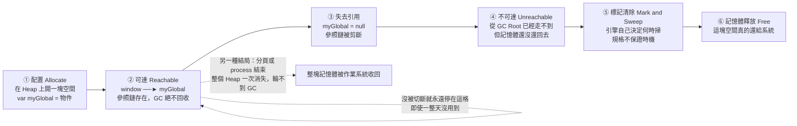

# 全域變數的 GC 回收時機：Reachability 與 window 生命週期

> [!info]- 🔗 與既有筆記的關聯
> 這篇是 Gemini 來源的補充小筆記，因為 [[11-記憶體模型-stack-heap-動態配置-GC]] 與 [[07-identifier-vs-property-var全域變數]] 是既有手寫/整理筆記（非 Gemini 來源），依筆記工作守則不直接編輯，改開新篇並互相 wikilink。本篇補的是「全域變數具體什麼時候被回收」這個更細的問題，跟 [[11-記憶體模型-stack-heap-動態配置-GC]] 的 GC 總論、[[10-傳值vs傳址-賦值與記憶體空間]] 的指標概念是同一個記憶體模型的不同切面。

本篇重點 a–h，共 8 個

---

## 5W1H 速查：讀本篇之前先把座標定好

> [!important]+ 最常被搞錯的一件事先講：<mark style="background: #FF5582A6;">GC 看的是「還走得到嗎」，不是「還有沒有在用」</mark>
> 「這個變數我很久沒用到了，應該被回收了吧？」——<mark style="background: #FFF3A3A6;">不會</mark>。GC 的唯一判斷依據是<mark style="background: #BBFABBA6;">可達性 Reachability</mark>：只要能從 GC Root（瀏覽器裡就是 `window`）沿著參照鏈走得到，它就是 reachable，GC 絕對不碰它，放著一百年也一樣。<mark style="background: #ADCCFFA6;">「沒被使用」與「不可達」是兩件完全不同的事</mark>。而且反過來也要小心：就算你寫了 `myGlobal = null` 切斷參照，那也<mark style="background: #FF5582A6;">不是當下就釋放記憶體</mark>——它只是變成「等下一次 GC 掃到才會被清掉」的狀態，而下一次是什麼時候，<mark style="background: #FFF3A3A6;">由引擎決定，規格不保證</mark>。

| 5W1H | 問題 | 一句話答案 |
|---|---|---|
| **What** 是什麼 | GC 在回收什麼？依據什麼？ | 回收 Heap 上<mark style="background: #BBFABBA6;">不可達 unreachable</mark> 的記憶體。唯一依據是可達性，<mark style="background: #FF5582A6;">不是使用頻率、不是變數名稱、也不是作用域</mark> |
| **When** 什麼時候 | 全域變數什麼時候被回收？ | 只要還掛在 `window` 上就<mark style="background: #FF5582A6;">永遠不會</mark>，一路活到分頁關閉／`process` 結束。除非你手動切斷參照，而且還要<mark style="background: #FFF3A3A6;">等引擎下一次觸發 GC</mark>——時間點不保證 |
| **Who** 誰做的 | 誰在回收？我能叫它現在做嗎？ | JS 引擎（V8）內建的 Garbage Collector 自動做。<mark style="background: #ADCCFFA6;">開發者不能命令它「現在立刻回收」</mark>，你能做的只有「切斷參照」這一件事 |
| **Where** 在哪裡 | 全域變數住在哪？ | <mark style="background: #ADCCFFA6;">Heap</mark>。它不屬於任何 stack frame，所以不像區域變數那樣會隨著函式 `return`、stack frame 被 pop 就自動釋放 |
| **Which** 哪一種 | GC Root 是哪些東西？全域物件叫什麼？ | 瀏覽器是 `window`、Node.js 是 `global`、跨環境統一用 `globalThis`。從 Root 沿參照鏈走得到的，全部算 reachable |
| **How** 怎麼做到 | 怎麼判斷可不可達？ | 概念版是<mark style="background: #BBFABBA6;">標記清除 Mark-and-Sweep</mark>：從 Root 出發標記所有走得到的，剩下沒被標記的清掉。<mark style="background: #FFF3A3A6;">但這是簡化說法</mark>，V8 實務上用分代式 GC（新生代 Scavenge ＋ 老生代 Mark-Sweep-Compact） |
| **Why** 為什麼 | 為什麼 React 組件 unmount 不會回收它？ | 因為全域變數掛在 `window` 上，<mark style="background: #FF5582A6;">不屬於任何組件</mark>。unmount 只清理該組件自己的資源（例如 `useEffect` 的 cleanup），碰不到 `window` 上的東西 |

### 時間軸：這件事發生在哪一格

```text
◄─────────── buildtime 建置期 ───────────►◄─────────── runtime 執行期 ───────────►
      （你的電腦／CI，部署前就跑完）                （瀏覽器載入腳本之後）

 ①轉譯 transpile   ②打包 bundle        ③V8 編譯          ④執行＋記憶體管理
 Babel／tsc／SWC    webpack／Vite       Parse→AST→Bytecode ★ 配置與 GC 都在這裡
 ┌─────────────┐  ┌─────────────┐    ┌──────────────┐  ┌───────────────────┐
 │TS→JS        │─►│合併、壓縮    │───►│只決定程式碼長 │─►│★ Heap 配置         │
 │             │  │             │    │什麼樣，不配置 │  │★ 可達性判斷         │
 └─────────────┘  └─────────────┘    │任何記憶體     │  │★ GC 回收           │
                                     └──────────────┘  └───────────────────┘

 ★ 記憶體從頭到尾都是 runtime 的事，buildtime 沒有 Heap、也沒有 GC。
```

再把最關鍵的那一格放大：<mark style="background: #FFF3A3A6;">一塊記憶體的一生</mark>

```text
 t0 ─────────► t1 ─────────► t2 ─────────► t3 ─────────► t4 ─────────► t5
 │             │             │             │             │             │
 ①配置         ②可達         ③失去引用      ④不可達        ⑤標記清除      ⑥記憶體釋放
 Allocate      Reachable     myGlobal      Unreachable   Mark & Sweep  Free
 在 Heap 上     window ──►    = null       從 Root 已經   從 Root 出發   這塊空間才
 開一塊空間     myGlobal      參照鏈被剪斷   走不到它了     標記，沒被標   真的還給系統
              這條鏈存在                                 記的就清掉
              GC 絕不回收
              （即使一整天沒用到）

              │◄──── 只要沒到 t2，這段可以無限長 ────►│
              （分頁不關、process 不結束，就一直待在 ② 這一格）

 ★★ 最關鍵的一件事：t4「什麼時候發生」完全由引擎決定，規格不保證。
    t2 切斷引用 ≠ t5 立刻釋放。你只負責讓它變成不可達，何時真的清掉不歸你管，
    也沒有任何標準 API 可以強制觸發。

 另一條完全不同的結局：整份文件被關掉
 t0 配置 ──► t2 一直可達 ──────────────► ★分頁／process 結束 ──► 整個 Heap 一次消失
                                        （這時候根本輪不到 GC，是整塊記憶體被作業系統收回）
```

同一條時間軸用 Mermaid 再畫一次：



> [!warning]- 三個很容易連帶搞錯的延伸點
> a. <mark style="background: #FFF3A3A6;">兩句看似矛盾的話其實在講不同情境</mark>：「全域變數要等應用程式結束才回收」講的是仍被 `window` 參照著的情況；「全域變數留在 heap 等垃圾回收」講的是已經被手動切斷參照、變成不可達之後的情況。
>
> b. <mark style="background: #ADCCFFA6;">區域變數與全域變數的回收路徑不同</mark>：函式內的區域變數隨 stack frame pop 就沒了；全域變數不在任何 stack frame 上，只能靠可達性判斷。
>
> c. <mark style="background: #BBFABBA6;">Mark-and-Sweep 是概念版不是 V8 的精確描述</mark>：理解「可達性」這個核心沒問題，但別把它當成 V8 的實作細節去回答面試，V8 用的是分代式 GC。

## 重點整理

a. <mark class="b">JS 變數本質是抽象指標：</mark>JS 引擎自動處理記憶體配置與管理，開發者看不到、也不能像 C 語言那樣直接操作實體位址；「指標」在這裡是幫助理解的抽象概念，不是語言規格中可觀察的具體實作細節。

b. <mark class="p">⚠️ 存疑：</mark>Gemini 原話「數字變成 5 之後，指標會轉向記憶體中存放 5 的新位置，而非直接覆蓋」，這個說法把物件（object）的傳址概念套用到基本型別（number）上；嚴謹來說 ECMAScript 規格並未定義 primitive 有可觀察的「指標指向新位置」語意，這只是引擎實作細節的簡化比喻，詳見與 [[10-傳值vs傳址-賦值與記憶體空間]] 對照，primitive 的正規理解是「開闢新的獨立記憶體、複製值過去」，不是「指標轉向」。

c. <mark class="y">全域變數 vs 區域變數的回收時機差異：</mark>函式內的區域變數（基本型別）會隨著 call stack 的 stack frame pop 而自動釋放；全域變數不屬於任何 stack frame，只要沒被切斷參照，理論上會一直存活到「應用程式生命週期結束」（網頁：分頁或瀏覽器關閉；Node.js：process 結束）。

d. <mark class="g">GC 回收的唯一依據是「可達性 Reachability」，不是「有沒有被使用」：</mark>瀏覽器環境中 `window`（全域物件）是 GC Root；只要一個變數能從 GC Root 沿著參照鏈（Reference Chain）找到，就是 Reachable，GC 絕對不會回收它——即使這個變數「很久沒被用到」也一樣，因為「沒被使用」與「不可達」是兩件不同的事。

e. <mark class="r">看似矛盾的兩句話，其實描述兩個不同情境：</mark>①「全域變數會在應用程式結束後才被回收」——指一般仍被 `window` 參照著的全域變數，`window -> myGlobal` 這條參照鏈只要頁面不關閉就一直存在，GC 永遠不會碰它；②「全域變數會留在 heap 中等待垃圾回收」——指變數被手動切斷參照之後（例如 `myGlobal = null`），物件與 GC Root 的連結斷開、變成 Unreachable，才會「留在 heap 裡等 GC 下次觸發時被真正掃描回收」（不是切斷的瞬間就立刻釋放）。

f. <mark class="b">React 組件 unmount 不會回收全域變數：</mark>全域變數掛在 `window`（全域範圍），不屬於任何特定組件；組件 unmount 只會清理該組件自己的資源（例如 `useEffect` 的 cleanup），完全不會影響 `window` 上的全域變數，它會繼續佔用記憶體直到應用程式結束或被手動切斷參照。

g. <mark class="v">全域物件（Global Object）在不同環境的名稱：</mark>瀏覽器環境是 `window`（`document` 是 `window` 的屬性，即 `window.document`，代表整份 HTML 文件/DOM）；Node.js 後端環境是 `global`；現代 JavaScript 統一提供 `globalThis`，可以跨瀏覽器/Node.js 環境存取全域物件。

h. <mark class="p">⚠️ 存疑：</mark>Gemini 把 GC 演算法簡化描述為單一的「Mark-and-Sweep（標記清除）」，這是主流演算法之一、方向正確，但實務上 V8 等現代引擎採用更複雜的分代式 GC（Generational GC，新生代 Scavenge + 老生代 Mark-Sweep-Compact 等組合），Gemini 的說法是簡化版，理解核心概念（可達性判斷）沒問題，但不宜直接當作 V8 實作的精確描述。

## 各對話來源

### 全域變數 x 的更新與覆蓋（2026-08-01 擷取）— https://gemini.google.com/app/43acb93f9ef325bd

**使用者：** 你剛說如果數字變成5了，那記憶體會有個指標指向5是嗎？

**Gemini：** 沒錯！在 JavaScript中，變數本身就像是一個指標，當你把數值修改為 5 的時候，這個指標就會轉向記憶體中存放 5 的那個新位置，而不是直接覆蓋原本的數值。

**使用者：** 那那個指標是一個抽象的概念還是說真的有一個像紙真的東西？

**Gemini：** 在 JavaScript 中，指標是一個抽象的概念。JavaScript 引擎會幫你處理記憶體的配置和管理，所以你並不會像在 C 語言—

**使用者：** 那這個零如果是寫在全域的話，它是在什麼時候會被回收？它應該會被誰回收？

**Gemini：** 當你更新 x 的數值後，這個存放 0 的記憶體區塊只要不再被任何變數參照，就會交由 JavaScript 的垃圾回收機制來回收。

**使用者：** 全域的變數如果沒有被使用到會被 garbage collector 回收，那麼如果是函數內的變數呢？它會隨著 call stack 的 stack frame pop 之後才消失對嗎？那這兩者的記憶體、效能或資源更新有什麼需要注意的？

**Gemini：** 沒錯，全域變數會留在 heap 中等待垃圾回收，而函數內的區域變數如果是基本型別，則會隨著 stack frame pop 而自動釋放。在記憶體效能方面，要特別注意避免讓全域變數長時間未使用而造成記憶體洩漏，同時也要小心閉包或過度的物件配置，以免增加記憶體負擔。

**使用者：** 局變數長時間未使用而造成記憶體洩漏，這個在 JavaScript 中也會發生嗎？

**Gemini：** 在 JavaScript 中，區域變數是不太會因為沒使用就造成記憶體洩漏的。因為只要函式執行—

**使用者：**（追問全域變數量大是否會造成記憶體洩漏）

**Gemini：** 是的，如果全域變數的量非常大且長時間不使用，確實有可能導致記憶體負擔過重，甚至產生類似記憶體洩漏的情況。這是因為全域變數會被附加在全域物件上，而全域物件在應用程式的生命週期內是不會被垃圾回收的。

**使用者：** 所以全局變量會在應用程序的生命周期結束後，react 的組件 unmount 之後也會被回收嗎？

**Gemini：** 是的，全域變數確實會在應用程式的生命週期結束後被回收。不過，當 React 組件解除掛載（unmount）時，由於全域變數存放在全域範圍，並不屬於特定組件，因此並不會隨著組件的回收而被清除。

**使用者：** 那什麼叫應用程序的結束啊？

**Gemini：** 對網頁應用程式來說，當使用者關閉頁面、分頁，或者瀏覽器整個關閉時，應用程式的生命週期就結束了，這時候全域物件和裡面的全域變數就會被釋放。

**使用者：** 全域物件像是 window or documents

**Gemini：** 沒錯，你理解得非常精準！在瀏覽器環境下：`window` 就是最頂層的全域物件（Global Object）；`document`（注意沒有 s 喔）則是 `window` 的一個屬性，也就是 `window.document`，用來代表整份 HTML 文件（DOM）。只要你用 `var` 在最外層宣告變數，或是直接寫 `window.x = 0`，這個變數就會掛在 `window` 物件下，只要這個網頁分頁沒有被關閉或重新整理，`window` 及其附屬的變數就永遠不會被回收；`document` 負責網頁內容與 DOM 元素的操控，關閉或刷新頁面時，舊的 `document` 與 `window` 都會被銷毀，記憶體就會全部釋放。小補充：Node.js 後端環境全域物件叫 `global`；現代 JavaScript 統一用 `globalThis` 就可以在任何環境下存取全域物件。

**使用者：**「全域變數會留在 heap 中等待垃圾回收」和「全域變數會等應用程式結束後才被回收，不會在 unmount 後被回收」兩句話出現矛盾，兩個時機不同，請查證給我看，我要 JavaScript 的。

**Gemini：** 這兩句話看似矛盾，其實是因為「全域變數什麼時候會變得『可以被回收』」與「垃圾回收器（GC）什麼時候『真正去清掉它』」是兩個不同的階段。核心觀念是 GC 回收的條件是「不可達（Unreachable）」：`window` 是 GC Root，只要一個變數能從 GC Root 順著參照鏈找到，它就是 Reachable，GC 絕對不會回收它。情境一（一般全域變數，如 `let myGlobal = {name:"Data"}`）：因為永遠被 `window` 參照著，是 Reachable 的，直到頁面關閉/分頁重新整理前都不會被回收，React 組件 unmount 也不影響它。情境二（全域變數被手動切斷參照，如 `myGlobal = null`）：原本的物件與 GC Root 的連結被切斷，變成 Unreachable，雖然變成垃圾但 JS 引擎不會瞬間清空，會「留在 Heap 中」，等待 GC 下一次觸發執行時才被真正掃描並釋放。一句話結論：全域變數如果一直被參照，就會等到應用程式結束（頁面關閉）才消失；但如果手動將它切斷參照（例如設為 null），它就會留在 Heap 裡等待 GC 搬走——兩者描述的是變數在不同參照狀態下的記憶體命運。

## 資料來源（含查證時間）

| 主題 | 連結 | 版本/時間 |
| --- | --- | --- |
| 全域變數 x 的更新與覆蓋對話 | https://gemini.google.com/app/43acb93f9ef325bd | Gemini 對話，擷取存檔於 2026-08-01 |
| Mark-and-Sweep 與 V8 分代式 GC 補充比對 | [[11-記憶體模型-stack-heap-動態配置-GC]] | Abby-notes 既有筆記，updated 2026-07-29 |
| 傳值 vs 傳址記憶體模型比對 | [[10-傳值vs傳址-賦值與記憶體空間]] | Abby-notes 既有筆記，updated 2026-07-29 |

⚠️ 存疑/更正：見「重點整理」b、h 兩點——Gemini 把「指標轉向新位置」套用到 primitive 數值變更、以及把 GC 簡化成單一 Mark-and-Sweep，皆為簡化說法，細節請以 [[11-記憶體模型-stack-heap-動態配置-GC]]、[[10-傳值vs傳址-賦值與記憶體空間]] 的既有筆記為準。
