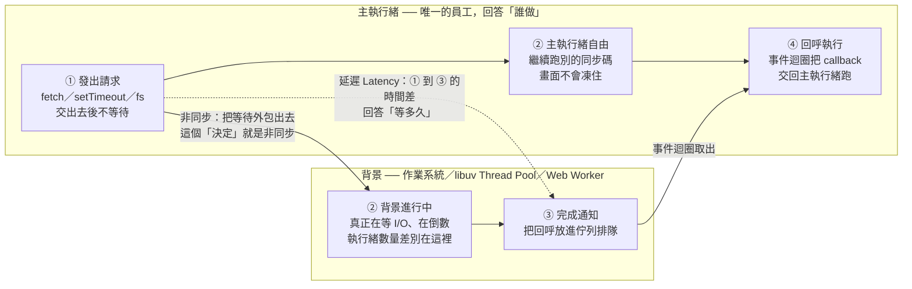

# 執行緒 vs 非同步 vs 延遲（含執行緒／線程術語釐清與四象限）

> 🔖 本篇重點索引：a–q，共 17 個。

---

## 5W1H 速查：讀本篇之前先把座標定好

> [!important]+ 最常被搞錯的一件事先講：<mark style="background: #FF5582A6;">非同步不等於多執行緒</mark>
> 最常見的誤解是「既然可以同時進行，那一定是偷偷多開了執行緒」——<mark style="background: #FFF3A3A6;">不是</mark>。JavaScript 正好就站在四象限裡最容易被搞混的那一格：<mark style="background: #BBFABBA6;">非同步 ＋ 單執行緒</mark>。它從頭到尾只有一個員工，靠的是「<mark style="background: #ADCCFFA6;">把要等的工作交出去，自己轉身先做別的，等通知回來再處理</mark>」。廚房比喻：你把水燒開後去旁邊切菜，水壺鳴笛再回來——<mark style="background: #FF5582A6;">你只有一個人，照樣可以非同步</mark>。

| 5W1H | 問題 | 一句話答案 |
|---|---|---|
| **What** 是什麼 | 這三個詞各自是什麼？ | 執行緒是<mark style="background: #ADCCFFA6;">「做事的人」</mark>（作業系統排程的最小單位）；非同步是<mark style="background: #BBFABBA6;">「做事的方法」</mark>（一種程式流程控制模式）；延遲是<mark style="background: #FFB8EBA6;">「等待的時間」</mark>（一個可量測的物理指標） |
| **When** 什麼時候 | 這三件事在哪個時間點出現？ | 全部在 <mark style="background: #BBFABBA6;">runtime 執行期</mark>。buildtime 只是把程式碼轉譯 transpile、打包 bundle 成檔案，那時候沒有人在跑、也沒有人在等 |
| **Who** 誰做的 | 誰是那個「員工」？ | 執行緒才是員工。<mark style="background: #FF5582A6;">你的 JS 永遠只有一條主執行緒</mark>；libuv 的 Thread Pool、Web Worker、作業系統本身才是另外那些員工，但它們跑的不是你的 JS |
| **Where** 在哪裡 | 三者分屬哪一層？ | 執行緒在<mark style="background: #ADCCFFA6;">硬體／作業系統層</mark>；同步非同步在<mark style="background: #ADCCFFA6;">程式流程控制層</mark>；延遲則是橫跨兩層、可以用碼錶量出來的時間差。<mark style="background: #FF5582A6;">不同維度，不要混談</mark> |
| **Which** 哪一種 | 四象限裡 JavaScript 是哪一格？ | <mark style="background: #FFF3A3A6;">非同步 ＋ 單執行緒</mark>。同步＋單執行緒會全卡住；同步＋多執行緒是開了工人卻還站著等；非同步＋多執行緒是最強但 JS 主執行緒不走這條 |
| **How** 怎麼做到 | 一個員工怎麼做到不卡住？ | ① 發出請求後把等待<mark style="background: #ADCCFFA6;">外包給宿主環境</mark> → ② 主執行緒立刻去做別的 → ③ 背景完成後把回呼放進佇列 → ④ 事件迴圈在主執行緒空了以後叫它回來執行 |
| **Why** 為什麼 | 為什麼一定要分清楚？ | 因為「畫面卡住」有<mark style="background: #FF5582A6;">兩種完全不同的病因</mark>：一種是同步阻塞（該外包卻站著等），改成非同步就好；另一種是純計算佔住主執行緒（根本外包不掉），<mark style="background: #FFF3A3A6;">再包幾層 `setTimeout` 也沒用，只能真的多開執行緒（Web Worker）</mark>。診斷錯了就會用錯藥 |

### 時間軸：這件事發生在哪一格

```text
◄─────────── buildtime 建置期 ───────────►◄─────────── runtime 執行期 ───────────►
      （你的電腦／CI，部署前就跑完）              （瀏覽器載入腳本／node app.js 之後）

 ①轉譯 transpile   ②打包 bundle        ③V8 編譯          ④執行中
 Babel／tsc／SWC    webpack／Vite       Parse→AST→Bytecode ★ 執行緒／非同步／延遲
 ┌─────────────┐  ┌─────────────┐    ┌──────────────┐  ┌───────────────────┐
 │TS→JS        │─►│合併、壓縮    │───►│產生 Bytecode  │─►│★ 三個詞全部在這裡   │
 └─────────────┘  └─────────────┘    └──────────────┘  └───────────────────┘

  這兩格沒有「執行緒」可言                                只有真的在跑，
  也沒有人在等，所以談不上延遲                             才有誰在做、怎麼等、等多久

 ★ 三個詞全部落在 runtime 執行期，一個都不屬於 buildtime。
```

再把最關鍵的那一格放大：<mark style="background: #FFF3A3A6;">三個詞各自對應到時間軸的哪一段</mark>

```text
                ①發出請求        ②背景進行中          ③完成通知      ④回呼執行
 主執行緒 ───────●─────────────────────────────────────────●─────────────►
 （唯一的員工）   │                                        │
                │  不站著等，立刻轉身去做別的事              │  回來執行 callback
                │  ↓↓↓ 這段期間主執行緒是自由的 ↓↓↓          │
                │                                        │
 背景            └──►■■■■■■■■■■■■■■■■■■■■■■■■■■■■■■■■■■──┘
 作業系統／libuv          真正在等 I/O、在倒數的是這裡
 Thread Pool／           （執行緒數量的差別發生在這一條線上）
 Web Worker

                │◄─────────── 延遲 Latency／Delay ────────►│
                （① 到 ③ 的長度，可以用碼錶量，跟人數與方法都無關）

 ★ 執行緒 ＝ 上面有幾條橫線、各是誰在動手           → 回答「誰做」
 ★ 非同步 ＝ 主執行緒在 ① 之後不站著等的那個決定     → 回答「怎麼做」
 ★ 延遲   ＝ ① 到 ③ 中間那一段的長度               → 回答「等多久」

 反例（同步阻塞）：主執行緒在 ① 之後整條線變成 ■■■■，什麼都不能做，整店卡死。
 反例（純計算）：連 ② 這條背景線都沒有，工作根本外包不出去，只能自己算完。
```

同一條時間軸用 Mermaid 再畫一次：



> [!warning]- 兩個很容易連帶搞錯的延伸點
> a. <mark style="background: #FFF3A3A6;">`setTimeout(fn, 3000)` 保證的是「不早於 3000ms」，不是「剛好 3000ms」</mark>：時間到只代表 callback 被放進巨任務佇列，還要等主執行緒空出來才輪得到它，所以實際延遲一定 ≥ 3000ms。
>
> b. <mark style="background: #ADCCFFA6;">把耗時的純計算包進 `setTimeout` 並不會讓它變成非同步</mark>：計算本身還是在主執行緒上跑，只是換了個時間點卡住而已。要真的不卡，得交給另一條執行緒（Web Worker），詳見 [[事件循環-Event-Loop-微任務與巨任務]]。

## 重點整理

三者都跟「時間、等待」有關，但本質完全不同。用<mark style="background: #FFF3A3A6;">飲料店</mark>比喻最好懂。

### 一、執行緒 Thread —「做事的人」

**(a)** <mark style="background: #ADCCFFA6;">執行緒（Thread，執行緒／線程）定義</mark>：作業系統能進行運算排程的<mark style="background: #ADCCFFA6;">最小單位</mark>，就是「實際動手做事的員工」。

**(b)** <mark style="background: #BBFABBA6;">單執行緒</mark>：只有一個員工，做完一杯才能接下一單；遇到要現榨很久的果汁，整條人龍就卡住。這是 JavaScript 的本質。

**(c)** <mark style="background: #BBFABBA6;">多執行緒</mark>：請了四五個員工分工，某人卡住其他人仍能服務別的客人。

### 二、非同步 Asynchronous —「做事的方法（切換任務）」

**(d)** <mark style="background: #ADCCFFA6;">非同步定義</mark>：一種<mark style="background: #ADCCFFA6;">程式設計架構模式</mark>，任務執行順序不必死板地等前一件完全做完。

**(e)** <mark style="background: #FF5582A6;">同步（Synchronous）</mark>：員工點完餐死站在廚房等茶煮好，不收錢不接單，整店「卡死（Blocking，阻塞）」。生活案例——去櫃檯排隊點餐，點完站在櫃檯等餐點做好才離開。

**(f)** <mark style="background: #BBFABBA6;">非同步（Asynchronous）</mark>：把茶葉丟進熱水（發出請求）後不等它好，立刻轉身服務下一位；計時器逼逼叫（完成通知）才回來把茶倒出。生活案例——去美食街點餐，拿了震動取餐牌就回座位滑手機，震動了再去拿餐。

> [!note] 核心
> JavaScript 雖然只有「一個員工（單執行緒）」，但它是時間管理大師，靠「非同步」在等待空檔塞別的事做，所以網頁才不會動不動卡死。

### 三、延遲 Latency / Delay —「等待的時間」

**(g)** <mark style="background: #FFB8EBA6;">延遲定義</mark>：不是人也不是方法，而是一個<mark style="background: #FFB8EBA6;">物理指標</mark>——從發出指令到看到結果中間消耗的時間差。飲料店：點完餐到拿到飲料隔了 10 分鐘，這 10 分鐘就是延遲。

**(h)** <mark style="background: #FFB8EBA6;">程式中的兩種延遲</mark>：

- <mark style="background: #ADCCFFA6;">網路延遲（Network Latency）</mark>：`fetch` 請求到 API 伺服器、資料傳回花了 200ms。
- <mark style="background: #ADCCFFA6;">人為延遲（Delay）</mark>：你刻意寫 `setTimeout(() => {}, 3000)` 製造的等待。

**(i)** 一句話總結：<mark style="background: #FFF3A3A6;">執行緒是「誰做」、非同步是「怎麼做」、延遲是「等多久」</mark>。

### 追加 2026-08-08

### 四、「執行緒」跟「線程」是不同東西嗎

**(j)** <mark style="background: #BBFABBA6;">答案：完全同一個東西，差別只在翻譯地區</mark>。英文原文都是 <mark style="background: #FFF3A3A6;">Thread</mark>；台灣慣用「執行緒」，中國大陸慣用「線程」。不是兩種技術，也沒有細微差別。

**(k)** <mark style="background: #FFB8EBA6;">常見術語兩岸對照表</mark>（看技術文件與影片時很常兩套並用）：

| 英文原文 | 台灣（繁體） | 大陸（簡體） |
|---|---|---|
| Process | 程序／行程 | 进程 |
| Thread | 執行緒 | 线程 |
| Multi-threading | 多執行緒 | 多线程 |
| Context Switch | 內文切換／上下文切換 | 上下文切换 |
| Coroutine | 協程／協同程序 | 协程 |

**(l)** <mark style="background: #FF5582A6;">⚠️ 台灣用語的地雷</mark>：Process 在台灣同時被翻成「<mark style="background: #FF5582A6;">程序</mark>」與「<mark style="background: #BBFABBA6;">行程</mark>」，但「程序」這個詞在中文裡也常指 program／procedure（程式、程序步驟），非常容易誤讀。<mark style="background: #BBFABBA6;">建議一律寫「行程（Process）」或直接寫英文</mark>，把「程序」留給別的意思。

**(m)** <mark style="background: #ADCCFFA6;">工廠比喻—行程與執行緒的關係</mark>：

- <mark style="background: #ADCCFFA6;">行程（Process）＝一間工廠</mark>：擁有獨立的資源（空間、電力、原料），也就是獨立的記憶體位址空間。
- <mark style="background: #ADCCFFA6;">執行緒（Thread）＝工廠裡的工人</mark>：一間工廠可以有多個工人（多執行緒），所有工人<mark style="background: #FFF3A3A6;">共享工廠內的資源（記憶體空間）</mark>。
- 工人之間可以協同工作，但也可能<mark style="background: #FF5582A6;">同時搶同一個工具而衝突</mark>——這就是死鎖（Deadlock）與競爭條件（Race Condition）的由來。

**(n)** <mark style="background: #BBFABBA6;">執行緒的兩個關鍵特性</mark>：<mark style="background: #FFF3A3A6;">資源共享</mark>（同一行程內的執行緒共享記憶體）與<mark style="background: #FFF3A3A6;">輕量化</mark>（建立與切換執行緒的成本比行程低很多，因為不必重建整套位址空間）。

**(o)** <mark style="background: #D2B3FFA6;">搜尋小技巧</mark>：在台灣開發環境建議習慣寫「執行緒」，但用 Google 查技術問題時，搜「線程」往往能撈到更多簡體中文的技術討論資源。

### 五、同步／非同步 與 執行緒 是不同維度

**(p)** <mark style="background: #FFF3A3A6;">兩者分屬完全不同的維度，不要混談</mark>：

| 概念 | 屬於哪一層 | 回答什麼問題 |
|---|---|---|
| 執行緒（Thread） | 硬體／作業系統層面 | <mark style="background: #ADCCFFA6;">「有幾個 CPU 通道在運算？」</mark>——是誰在做 |
| 同步／非同步（Sync／Async） | 程式流程控制層面 | <mark style="background: #ADCCFFA6;">「任務發出後，呼叫者要不要阻塞等待？」</mark>——怎麼等 |

**(q)** <mark style="background: #FF5582A6;">四象限—破除「非同步就是開多執行緒」的誤解</mark>：

| 組合 | 實際狀況 |
|---|---|
| 同步 ＋ 單執行緒 | 最基礎模式，程式碼一行一行執行，<mark style="background: #FF5582A6;">卡住就全卡住</mark>（例如 JS 沒處理好耗時工作時） |
| 同步 ＋ 多執行緒 | 開另一個工人去做，但<mark style="background: #FF5582A6;">主執行緒依然停下來等</mark>那個工人做完 |
| <mark style="background: #FFF3A3A6;">非同步 ＋ 單執行緒</mark> | <mark style="background: #FF5582A6;">最容易搞混的一格</mark>。例如 JavaScript——只有一個執行緒，卻透過<mark style="background: #BBFABBA6;">事件循環（Event Loop）</mark>達成非同步：先去做別的小任務，等 I/O 好了再回來 |
| 非同步 ＋ 多執行緒 | 最強大的組合，開另一個工人去做，主執行緒繼續忙自己的，互不干擾 |

> [!warning] 一句話記住
> <mark style="background: #BBFABBA6;">非同步不代表一定要開新執行緒</mark>。廚房比喻——你把水燒開後去旁邊切菜，等水壺鳴笛再回來；<mark style="background: #FFF3A3A6;">你只有一個人（單執行緒），照樣可以非同步</mark>。

## 各對話來源

### 執行緒、非同步、延遲差異解析（2026-06）— https://gemini.google.com/app/e215a3e48b97b46c

<mark style="background: #FFF3A3A6;">使用者：解釋非同步跟執行序跟延遲三個的差異。</mark>

Gemini：（見上方重點 a–i）用飲料店比喻——執行緒＝做事的員工（單／多執行緒，JS 本質單執行緒）；非同步＝做事方法，同步會 Blocking 卡死、非同步在等待空檔切換任務；延遲＝物理時間差（網路延遲 vs `setTimeout` 人為延遲）。

### 執行緒與線程的差異（2026-08，共 2 個使用者回合）— https://gemini.google.com/app/cb4bbefd8cb4a80f

<mark style="background: #FFF3A3A6;">使用者：線程跟執行緒是不一樣的東西嗎？</mark>

Gemini：（見上方重點 j–o）明確回答「同一個東西，只是地區翻譯不同」，英文原文都是 Thread；定義執行緒為作業系統排程的最小單位、包含在行程之中；用「工廠與工人」比喻說明行程擁有獨立資源、執行緒共享記憶體，並帶出 Deadlock 與 Race Condition 的成因；附上 Process／Thread／Multi-threading／Context Switch／Coroutine 的兩岸術語對照表；最後建議台灣環境用「執行緒」，但搜尋時用「線程」可撈到更多資源。

<mark style="background: #FFF3A3A6;">使用者：同步異步跟執行緒是不同概念嗎</mark>

Gemini：（見上方重點 p–q）指出兩者分屬不同維度——執行緒是「執行者（是誰在做）」、同步／非同步是「訊息通知機制（怎麼等）」；用排隊點餐 vs 震動取餐牌的生活案例區分同步與非同步；提出四象限表格破除「非同步就是開多執行緒」的誤解，特別點名 JavaScript 屬於「非同步＋單執行緒」；最後用「一個人也能一邊燒水一邊切菜」的廚房比喻收尾。

## ⚠️ 存疑／補充

- Gemini 在第一回合把 Process 譯為「程序」，但同一份對話的對照表又並列「程序／行程」。<mark style="background: #FF5582A6;">台灣技術圈實務上「行程」較不易誤讀</mark>，本篇重點 (l) 已補上這個提醒。
- Gemini 說「多執行緒可以同時處理多件事（平行處理）」——嚴格來說<mark style="background: #FFB8EBA6;">要在多核心 CPU 上才是真正的平行（Parallelism）</mark>；單核心上的多執行緒只是快速切換造成的並行（Concurrency）錯覺。這個區分在面試時常被追問，值得記住。

## 資料來源（含查證時間）

> 查證日期：2026-08-08（兩則 Gemini 對話分別為 2026-06 與 2026-08；術語定義與並行／平行的區分另依下列文件核實）

| 主題 | 連結 | 版本／時間 |
|---|---|---|
| Gemini 對話一：執行緒、非同步、延遲差異 | [執行緒 vs 非同步 vs 延遲](https://gemini.google.com/app/e215a3e48b97b46c) | 2026-06 |
| Gemini 對話二：執行緒與線程的差異 | [執行緒與線程的差異](https://gemini.google.com/app/cb4bbefd8cb4a80f) | 2026-08 |
| JavaScript 事件循環與單執行緒非同步模型 | [MDN — The event loop](https://developer.mozilla.org/en-US/docs/Web/JavaScript/Reference/Execution_model) | MDN，持續更新 |
| Node.js 事件循環與非阻塞 I/O | [Node.js — The Node.js Event Loop](https://nodejs.org/en/learn/asynchronous-work/event-loop-timers-and-nexttick) | Node.js 官方文件，持續更新 |
| 國家教育研究院雙語詞彙（Thread／Process 中文譯名） | [樂詞網 terms.naer.edu.tw](https://terms.naer.edu.tw/) | 教育部審定名詞，持續更新 |

## 相關筆記

- [[事件循環-Event-Loop-微任務與巨任務]]——關聯原因：本篇 (q) 四象限中「非同步＋單執行緒」那一格的完整機制就在那篇；本篇給的是判斷框架，那篇給的是執行細節。
- [[V8與libuv協同工作原理-非同步IO]]——關聯原因：解釋 JS 明明是單執行緒、為什麼檔案與網路 I/O 不會卡住——因為 libuv 底下其實有<mark style="background: #FFF3A3A6;">執行緒池（Thread Pool）</mark>在幫忙；這正是本篇 (q) 「非同步不等於開執行緒」在 Node.js 上的實際邊界。
- [[Node-js底層架構-V8-libuv-Bindings與CSR澄清]]——關聯原因：把 (m) 的「工廠與工人」對應到 Node.js 的實際架構分層，看得到執行緒到底藏在哪一層。
- [[並行串行]]——關聯原因：那篇處理的是 Concurrency（並行）與 Serial（串行）的差異，正好補上本篇「⚠️ 存疑／補充」提到的並行 vs 平行區分。
- [[13-閉包-Closure-私有變數與傳址陷阱]]——關聯原因：(m) 提到的「共享記憶體造成搶資源」在 JS 單執行緒下不會變成 Race Condition，卻會以閉包捕捉同一個變數參考的形式製造類似的直覺陷阱，適合對照理解。
