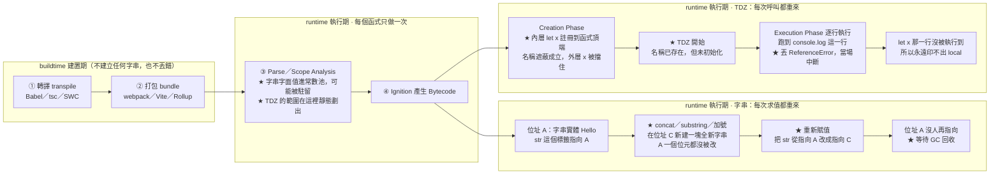

# 字串不可變性（JS vs C）與 let 區塊變數遮蔽下的 TDZ

> [!info]- 🔗 與既有筆記的關聯
> 本篇是 Gemini 來源的補充筆記。字串不可變性是全新主題（vault 尚無專篇），歸進 JS_Core_and_Runtime；TDZ 部分與 [[04-變數宣告-let-const-var]]（手寫，同層變數作用域坑）、[[09-Hoisting-函式宣告vs函式表達式-TDZ]]（Gemini 來源，函式宣告 vs 函式表達式的 TDZ）主題重疊但角度不同，本篇補的是「函式內部宣告同名 let 變數時，TDZ 如何跟作用域鏈的名稱遮蔽（shadowing）互動」這個更細的情境，兩篇既有筆記都是手寫或另一子主題，依筆記工作守則不直接編輯，改開新篇並互相 wikilink。與 [[10-傳值vs傳址-賦值與記憶體空間]] 的「變數是指標、值是記憶體實體資料」概念也直接相關。

本篇重點 a–z，共 26 個

---

## 5W1H 速查：讀本篇之前先把座標定好

> [!important]+ 最常被搞錯的一件事：<mark style="background: #FF5582A6;">把「字串不可變」讀成「字串變數不能改」</mark>
> a. 不可變的是<mark style="background: #FFF3A3A6;">**值**（記憶體裡那塊字串實體）</mark>，不是<mark style="background: #BBFABBA6;">**變數**（指向位址的標籤）</mark>。`greeting = "Hello"` 完全合法，它做的是「在新位址建一塊新字串，再把標籤改指過去」，位址 A 上的 `"Hi"` 從頭到尾一個位元都沒被改過。
> b. 由此延伸：`str[0] = "J"` 之所以沒效果，不是「改失敗」，是<mark style="background: #ADCCFFA6;">語言根本不提供這條路</mark>——非嚴格模式靜默忽略、嚴格模式直接報錯。C 可以這樣寫，是因為 C 的字串本質是字元陣列，能原地覆寫同一塊位址。
> c. 本篇第二主題也有一個對稱的誤解：以為 `let x` 報錯是<mark style="background: #FF5582A6;">「因為 `let` 不會 hoisting」</mark>。<mark style="background: #BBFABBA6;">剛好相反</mark>——正是因為它**有** hoisting，名稱被鎖在函式頂端遮蔽了外層的 `x`，才不會往外找到 `"global"`，只是還沒初始化，所以落在 TDZ。

| 5W1H | 問題 | 一句話答案 |
|---|---|---|
| **What** 是什麼 | 到底什麼東西不可變？ | 不可變的是**值**，不是**變數**。變數只是一個指向記憶體位址的標籤，標籤永遠可以改指到別的地方；被指到的那塊字串實體，一旦建立就再也不會被改寫 |
| **When** 什麼時候 | 新字串是什麼時候被建出來的？ | <mark style="background: #ADCCFFA6;">字串**字面值**在 Parse／編譯階段就進常數池（每個函式只做一次，還可能被駐留共用）</mark>；<mark style="background: #FFF3A3A6;">`concat`／`substring`／`+` 產生的新字串則是執行期、每次求值都新建一塊</mark> |
| **Who** 誰做的 | 誰在管這些字串？ | JS 引擎（V8）。字串駐留（String Interning）是**引擎實作優化**、不是 ECMAScript 規格保證；沒人再指向的舊字串由 GC 自動回收 |
| **Where** 在哪裡 | 新舊字串各放哪？ | 字串實體在 **Heap**；變數這個「標籤／指標」本身放在 Stack Frame 或環境紀錄裡。重新賦值改的只有標籤那一格，Heap 上的舊實體原封不動 |
| **Which** 哪一種 | 哪些操作會改到原字串？ | <mark style="background: #BBFABBA6;">一個都沒有</mark>。`substring`／`concat`／`+`／`toUpperCase` 全部是「回傳新字串」；想更新變數就得自己**重新賦值**，方法不會幫你放回去 |
| **How** 怎麼做到 | C 憑什麼可以原地改？ | C 的字串是**字元陣列**，位址 X 開一塊空間放字元，之後直接覆寫同一塊。代價是要人工管理記憶體、多個指標共享時容易產生 Side Effect；JS 用「每次新建」換掉這個風險 |
| **Why** 為什麼 | 為什麼那個 `let x` 例子不是印出 `"global"`？ | 因為 `let` **也會** hoisting：`x` 被鎖定給內層版本、遮蔽了外層，作用域鏈不會再往外找；而程式是逐行執行的，`console.log(x)` 先跑到時 `x` 還在 TDZ，於是丟 `ReferenceError` |

### 時間軸：這件事發生在哪一格

```text
◄────────── buildtime 建置期 ──────────►◄────────── runtime 執行期 ──────────►
      （你的電腦／CI，部署前就跑完）              （瀏覽器或 Node 載入腳本後）

 ①轉譯        ②打包         ③Parse        ④Bytecode      ⑤每次執行都重來
 transpile    bundle        解析／AST      Ignition       執行幾次做幾次
 ┌────────┐   ┌────────┐   ┌────────┐   ┌────────┐   ┌──────────────────┐
 │Babel   │   │webpack │   │★字面值 │   │AST →   │   │ ★ concat／substr  │
 │tsc     │──►│Vite    │──►│ 進常數池│──►│Bytecode│──►│   ／+ 新建字串    │
 │SWC     │   │Rollup  │   │★TDZ 範圍│   │        │   │ ★ 改指標、GC 舊值 │
 └────────┘   └────────┘   │ 靜態決定│   └────────┘   │ ★ TDZ 丟          │
  只換寫法      只換位置     └────────┘                │   ReferenceError  │
  不建字串      不建字串      每個函式只做一次           └──────────────────┘
                            只做決策不新建             同一行跑 100 次
                                                      就新建 100 塊字串

 ★ 本篇兩個主題落在兩個不同的格子，這正是它們容易被搞混的原因：
   ・字串「字面值」與 TDZ 的「範圍」在第 ③ 格定案（只做一次）。
   ・字串的「新建／改指標／GC」與 TDZ 的「丟錯」在第 ⑤ 格（每次執行都重來）。
```

同一件事，換成這兩個主題自己的階段序列再看一次：

```text
【序列一】str = str.concat(" World") 在記憶體裡的四步（執行期，每次求值都重跑）

 ① 位址 A：字串實體 "Hello"          ← str 這個標籤指向 A
        │
        ▼ ② 執行 concat：在位址 C 建立一塊全新的 "Hello World"
          （A 與參數那塊 " World" 一個位元都沒被改動）
        │
        ▼ ③ 重新賦值：把 str 這個標籤從指向 A 改成指向 C
        │
        ▼ ④ 位址 A 沒有任何變數再指向它 ──► 等待 GC 回收

 ★ 全程沒有任何一塊字串被「修改」過，只有「新建」與「改指向」。


【序列二】function test 裡那個同名 let x 的執行序（每次呼叫都重來）

 ① Creation Phase：把內層 let x 的名稱註冊到 test 頂端
        │            ★ 名稱遮蔽成立，外層的 x 從此在函式內被擋住
        ▼
 ② TDZ 開始：名稱已存在，但還沒初始化
        │
        ▼ ③ Execution Phase 逐行跑到 console.log(x)
        │    ★ 人在 TDZ 裡 → ReferenceError，程式當場中斷
        │
        ▼ ④ let x = "local" 這一行根本沒被執行到（所以也不會印出 local）
```

同一條時間軸用 Mermaid 再畫一次：



---

## 重點整理

a. <mark class="b">變數（Variable）與值（Value）是兩件事：</mark>變數只是一個指向記憶體位址的「標籤/指標」，值才是真正存在記憶體裡的實體資料；理解「不可變 vs 可變」的關鍵就是分清楚這兩者。

b. <mark class="y">JS 的 reassignment（重新賦值）改的是「指標指向」，不是「原本內容」：</mark>`let greeting = "Hi"; greeting = "Hello";` 執行後，記憶體位址 A 上的 `"Hi"` 從頭到尾沒被修改過，JS 只是在新的位址 B 建立 `"Hello"`，再把 `greeting` 這個指標改指向 B。

c. <mark class="p">舊值沒人參照就會被 GC 回收：</mark>位址 A 上的 `"Hi"` 若之後沒有任何變數再指向它，就會被 JavaScript 的垃圾回收機制自動清理掉（可與 [[11-記憶體模型-stack-heap-動態配置-GC]] 的 GC 概念對照）。

d. <mark class="r">直接改字串的單一字元會被靜默忽略：</mark>`let str = "Hello"; str[0] = "J";` 之後 `str` 仍是 `"Hello"`，一般模式下這個賦值會被忽略，嚴格模式下則會直接報錯，這就是「原生字串不可變」的具體表現。

e. <mark class="b">C 語言字串本質是字元陣列（Character Array）：</mark>`char greeting[] = "Hi";` 在記憶體位址 X 開闢空間存放 `['H','i','\0']`，之後可以直接 `greeting[0]='H'; greeting[1]='e';` 原地覆蓋位址 X 裡的內容，`greeting` 指向的位址從頭到尾不變，這就是「可變（Mutable）」。

f. <mark class="v">C（可變）與 JS（不可變）的效能/安全權衡：</mark>C 原地修改、不必頻繁申請新記憶體，字串拼接效能高，但需要人工管理記憶體、且多個指標指向同一塊記憶體時一處修改會影響所有地方，容易有 Side Effect／Race Condition；JS 每次修改或拼接都建立新字串，記憶體負擔較大、增加 GC 負擔，但傳遞字串時完全不用擔心被其他函式意外修改，安全性與可預測性更高。

g. <mark class="g">JS 選擇不可變字串的理由之一：字串駐留（String Interning）：</mark>因為字串不可變，V8 等引擎可以讓多個相同的字串字面值（例如程式裡所有的 `"Hello"`）共享同一塊記憶體位址，藉此節省記憶體，這是引擎實作優化，非 ECMAScript 規格保證的行為。

h. <mark class="g">不可變字串也降低了 Bug 發生率：</mark>把字串當參數傳進函式時，呼叫者不用擔心字串內容被函式意外修改，資料流更可預測，是前端開發中降低隱藏 Bug 的重要設計。

i. <mark class="b">轉入第二主題：ReferenceError 不是因為「不會 hoisting」：</mark>`let`／`const`／`var` 三者在 JavaScript 中全部都會發生 Hoisting，差別在於 hoisting 之後「初始化」的處理方式不同，不是有沒有 hoisting 的問題。

j. <mark class="y">var 的 hoisting：宣告＋初始化一起做：</mark>編譯階段就把 `var` 提升到作用域頂端並直接初始化為 `undefined`，所以宣告前讀取只會拿到 `undefined`、不會報錯，例如 `console.log(a); var a = 10;` 印出 `undefined`。

k. <mark class="r">let／const 的 hoisting：只做宣告，初始化要等執行到那一行：</mark>編譯階段只把名稱註冊到作用域頂端，真正的「初始化（賦予預設值）」要等程式執行到宣告那一行才發生；從宣告到初始化之間的這段空窗期就是 <mark class="r">TDZ（暫時性死區，Temporal Dead Zone）</mark>，在 TDZ 內存取變數會丟出 `ReferenceError: Cannot access '...' before initialization`。

l. <mark class="v">變數生命週期三步驟：</mark>①宣告（Declaration，在作用域註冊名稱）→②初始化（Initialization，分配記憶體並給預設值）→③賦值（Assignment，賦予實際值）；`var` 是 hoisting 時①②一起做，`let`/`const` 是 hoisting 時只做①，②要等執行到宣告那行。

m. <mark class="p">驗證「let 真的有 hoisting」的實驗：</mark>

```javascript
let x = "global";
function test() {
  console.log(x);   // 猜猜看：印出 "global" 還是報錯？
  let x = "local";
}
test();
// 結果：Uncaught ReferenceError: Cannot access 'x' before initialization
```

如果 `test()` 內部的 `let x` 完全沒有 hoisting，`console.log(x)` 應該會順著作用域鏈往外找到全域的 `"global"`；但它卻直接報錯，這證明了函式內部的 `let x` 確實被提升到了 `test()` 頂端並「鎖定」了 `x` 這個名稱，只是還沒初始化，所以落在 TDZ 內。

n. <mark class="b">名稱遮蔽（Shadowing）加上逐行執行，才是報錯而非印出 "local" 的真正原因：</mark>一旦 `test()` 內部宣告了同名的 `let x`，`x` 這個名稱在整個函式作用域內就被「鎖定」給內層版本，JS 不會再往外層作用域鏈查找；接著程式是逐行執行的，`console.log(x)` 這一行先被執行到，此時內層 `x` 還在 TDZ（未初始化），於是拋出 `ReferenceError` 並中斷，程式根本還沒執行到下面 `let x = "local"` 那一行賦值。

o. <mark class="g">要印出 `"local"`，讀取動作必須寫在初始化之後：</mark>把 `let x = "local";` 搬到 `console.log(x);` 前面，執行順序才會先完成初始化與賦值，再讀取到 `"local"`；這也呼應 [[04-變數宣告-let-const-var]] 裡「TDZ 決定的是『時間軸』、作用域決定的是『空間軸』」的區分，這裡踩到的是時間軸（TDZ），不是空間軸（跑到作用域外）的問題。

### 追加 2026-09-05：substring／concat 的示範，以及 `+` 串接的型別轉換

(p) <mark style="background: #FFF3A3A6;">所有字串方法都是「回傳新字串」，原本的變數一動也不動</mark>。這就是不可變性在 API 層面的具體長相。

```js
let originalStr = "JavaScript";
let newStr = originalStr.substring(0, 4);   // 取索引 0 到 4（不含 4）

console.log(newStr);       // "Java"        ← 回傳的新字串
console.log(originalStr);  // "JavaScript"  ← 原字串完全沒變
```

```js
let str1 = "Hello";
let str2 = " World";
let combinedStr = str1.concat(str2);

console.log(combinedStr);  // "Hello World"
console.log(str1);         // "Hello"   ← 保持原樣
console.log(str2);         // " World"  ← 保持原樣
```

(q) <mark style="background: #BBFABBA6;">要更新變數就必須「重新賦值」</mark>，因為方法只會把新字串交給你，不會幫你放回去。

```js
let str = "Hello";
str = str.concat(" World");   // 重新賦值
console.log(str);             // "Hello World"
```

(r) <mark style="background: #ADCCFFA6;">`+` 也是回傳新字串，但它多做了一件事：型別轉換</mark>。只要 `+` 兩邊有任何一邊是字串，另一邊就會被轉成字串再串接；兩邊都不是字串時才做數字加法。

![[螢幕擷取畫面 2026-09-05 132900.png]]

上圖 F12 Console 實測：`"con" + 78` 得到 `"con78"`，數字 78 被自動轉成 `"78"` 再串接。

![[螢幕擷取畫面 2026-09-05 122243.png]]

上圖是同一個規則的兩個變形：`7 + '7'` 得到 `"77"`（不是 14），因為右邊是字串；下半段 `let` 宣告只是宣告，Console 顯示 `undefined` 是「這段陳述式沒有回傳值」，不是變數的值是 undefined。

(s) <mark style="background: #FF5582A6;">這是面試常考的陷阱</mark>：`+` 對字串是串接、對數字是加法，而 `-` 只有數字語意，所以 `'7' - 7` 會得到 `0`（字串被轉成數字），但 `'7' + 7` 得到 `"77"`。詳細的轉換規則見 [[15-ToPrimitive-ToNumber-型別轉換抽象操作]]。

### 追加 2026-09-19：那個「沒人接住」的新字串去了哪裡，以及字串為什麼能呼叫方法

(t) <mark style="background: #FFF3A3A6;">`str.replace("a","b")` 會佔用新的記憶體</mark>，理由跟 (p) 的 `substring`／`concat` 完全一樣：<mark style="background: #ADCCFFA6;">字串不可變，所以任何「修改」都只能靠新建一塊</mark>。這不是 `replace` 特別耗資源，而是整個 String API 的共同體質。

(u) <mark style="background: #BBFABBA6;">沒有變數接住的回傳值，走的是「建立 → 失去可達性 → 等 GC」這條路</mark>。把 (c) 那條「舊值沒人參照就會被 GC 回收」反過來看就懂了：(c) 講的是「舊字串被拋下」，(u) 講的是「新字串從出生就沒人牽」，兩者最後都落到同一個回收機制。

```js
str.replace("a", "b");   // 沒用變數接，也沒印出來
```

&nbsp;&nbsp;&nbsp;&nbsp;這一行執行的那一瞬間，引擎確實在 Heap 建了一塊新字串當作回傳值；但因為沒有寫成 `const result = str.replace(...)`、也沒有把它傳給任何函式，<mark style="background: #FF5582A6;">這行結束時它就變成 unreachable（無法從根物件走到的孤兒）</mark>，下一輪 GC 掃過就被釋放。<mark style="background: #D2B3FFA6;">短暫佔用過記憶體，但不會造成洩漏</mark>。

(v) <mark style="background: #FF5582A6;">要小心的是「大字串 × 大量重複替換」</mark>：單次替換的暫時開銷可以忽略，但在迴圈裡對一個很大的字串連續 `replace`，每一輪都在 Heap 新建一塊近乎同樣大的字串，會把 GC 壓力拉高。處理大量文字時改用陣列收集片段再 `join('')`，或直接用一次性的正規表達式全域替換 `str.replace(/a/g, 'b')`。

> [!note]+ ⚠️ 存疑／更正（2026-09-19）
> Gemini 說「字串（String）是**不可變的（Primitive / Immutable）**」，把 primitive 與 immutable 當成同一件事寫在一起——<mark style="background: #FF5582A6;">這兩個概念是分開的</mark>：primitive 講的是「型別分類」，immutable 講的是「值能不能被原地改寫」。
> 另外它說「新字串會被分配到新的記憶體空間」在語意上成立，但<mark style="background: #ADCCFFA6;">實作細節上 V8 不一定真的複製整塊</mark>：拼接時常先做成 ConsString（把兩塊的指標串起來的「繩索」結構），等到真的要逐字元讀時才 flatten 成連續記憶體。這不影響「你看到的是一個新字串」這個語意，只影響效能直覺。

(w) <mark style="background: #ADCCFFA6;">字串明明是 primitive，為什麼能呼叫 `.toUpperCase()`、讀 `.length`</mark>？因為有**自動包裝（auto-boxing）**。引擎在背後做三步：

1. 暫時把原始字串包成一個 `String` 物件（概念上等同 `new String("hello")`）
2. 在這個臨時物件上執行方法或讀屬性
3. 用完<mark style="background: #BBFABBA6;">立刻丟棄該臨時物件</mark>（又是一個 (u) 式的 unreachable 物件，交給 GC）

&nbsp;&nbsp;&nbsp;&nbsp;JS 的 7 種 primitive 裡，<mark style="background: #FFF3A3A6;">String／Number／Boolean／Symbol／BigInt 有對應的包裝物件，`null` 與 `undefined` 沒有</mark>，所以 `null.toString()` 會直接丟 `TypeError`。

(x) <mark style="background: #FF5582A6;">日常開發一律用純值，不要寫 `new String()`</mark>，因為它會製造出一個真正的物件，行為跟純值不一樣：

```js
let primitive = "hello";           // 原始型別（推薦）
let boxed     = new String("hello"); // String 物件（不推薦）

typeof primitive;        // "string"
typeof boxed;            // "object"   ← 型別就不同了

primitive ==  boxed;     // true   （鬆散等於會先 ToPrimitive，值相同）
primitive === boxed;     // false  （嚴格等於連型別一起比）

Boolean(new String(""))  // true ← 空字串物件是 truthy，最惡名昭彰的坑
```

&nbsp;&nbsp;&nbsp;&nbsp;比較規則的細節見 [[比較三兄弟-鬆散等於-嚴格等於-Object-is-與React-Vue的狀態比對]] 與 [[15-ToPrimitive-ToNumber-型別轉換抽象操作]]。

> [!danger]+ ⚠️ 存疑／更正（2026-09-19）：Gemini 的程式碼是錯的
> 它寫成 <mark style="background: #FF5582A6;">`console.typeof(primitive)`</mark>，<mark style="background: #FF5582A6;">這不是合法語法</mark>——`console` 物件上沒有 `typeof` 這個方法，照抄會丟 `TypeError: console.typeof is not a function`。
> <mark style="background: #BBFABBA6;">正確寫法是 `typeof primitive`</mark>：`typeof` 是**一元運算子**不是函式，所以不需要（也不該）用點號掛在 `console` 底下；要印出來要寫成 `console.log(typeof primitive)`。

(y) <mark style="background: #D2B3FFA6;">auto-boxing 與字串駐留（(g)）是兩件互補的事</mark>：駐留讓「相同的字串字面值共用同一塊記憶體」，auto-boxing 讓「那塊唯讀的記憶體也能用物件的方式操作」。兩者都只有在「字串不可變」這個前提成立時才做得到——可變的話，共用會互相污染，臨時包裝也會寫回原值。

(z) <mark style="background: #FFF3A3A6;">把 (t)(u)(w) 串成一條線記</mark>：<mark style="background: #BBFABBA6;">JS 的字串操作是一台「只出不進」的機器</mark>——每次呼叫方法都在 Heap 產出一塊新東西（新字串或臨時包裝物件），原料（原字串）原封不動，產物有人接就活著、沒人接就等 GC。理解這一條，`replace` 的記憶體問題、`substring` 為什麼要重新賦值、`.length` 為什麼能讀，全部是同一個答案的三種問法。

### 追加來源：JavaScript 字串的不可變性與操作（2026-09-05）— https://gemini.google.com/app/f4da8ca9d6c67841

**使用者：** 當我們用 `substring()` 來擷取字串，或用 `concat()` 來把兩個字串合為一，這些都是會回傳另一個字串，而非改變原本的字串。示範

**Gemini：** 這段文字在說明 JavaScript 中字串的原生值不可變性（Immutability）。對字串進行擷取或拼接時，原本的字串變數內容不會受到任何影響，方法只會回傳一個全新的字串。`substring(0, 4)` 會回傳 `"Java"` 而 `originalStr` 仍是 `"JavaScript"`；`str1.concat(str2)` 會回傳 `"Hello World"` 而 `str1`、`str2` 保持原樣。觀念小結：如果希望更新變數的值，必須明確地把回傳的新字串重新賦值給該變數（`str = str.concat(" World")`）。

## 各對話來源

### JS 字串不可變性與 C 差異（2026-08-02 擷取）— https://gemini.google.com/app/41d3c779dee10274

**使用者：** 原生值是不可變的（immutable），意思是我們不能改變那個值本身。舉例來說字串（string）是其中一個，這是在 explain this 的網站看到的前端面試考題，題目是如何知道變數的型別？答案之一在講到字串，他說 JavaScript 原生值，我們不能去改變 'Hi' 這一個字串（但在其他程式語言，字串有可能是可變的，例如在 C 就是可變的）。我們僅可以把某個變數，賦予另一個字串，例如：`let greeting = "Hi"; greeting = "Hello";`。那重新覆值呢？難道不是嗎，還是說是記憶體位址挖一個新的空格放字串，舊的等沒有用到就會被丟掉？C 就是可變的，那效能差在哪？

**Gemini：** 你的直覺非常敏銳！重新賦值（Reassignment）改變的是「變數綁定的記憶體指標」，而不是「原本的資料內容本身」。變數（如 `greeting`）只是標籤/指標，指向儲存資料的記憶體位址；值（如 `"Hi"`）才是真正存在記憶體裡的實體資料。`let greeting = "Hi"` 在位址 A 建立 `"Hi"`；`greeting = "Hello"` 在位址 B 建立全新的 `"Hello"`，再把指標改指向 B，位址 A 的 `"Hi"` 從頭到尾沒被修改過，這就是「不可變」；若再沒有變數指向它，之後會被 GC 清掉。若嘗試 `str[0] = "J"` 直接改字元，會被靜默忽略（嚴格模式報錯）。C 語言字串本質是字元陣列，可以原地修改（`greeting[0]='H'`），指向的記憶體位址不變，這就是「可變」。效能上：C 原地修改快、但需人工管理記憶體且多指標共享一塊記憶體容易有 Side Effect；JS 每次修改都建立新字串、GC 負擔較大，但因為字串不可變可以做字串駐留（String Interning）節省記憶體，且傳遞字串永遠不怕被意外修改，安全性更高。

**使用者：** 假如某個變數還沒被宣告，我們就先使用，在 JavaScript 會出現索引錯誤 ReferenceError，是因為 let var 宣告的變數不會 hoisting？

**Gemini：** 不是因為「不提升（Hoisting）」，而是因為 `let`/`const` 與 `var` 的 Hoisting 機制與宣告狀態不同！實際上 `var`、`let`、`const` 全部都會發生 Hoisting，只是提升後的處理方式不一樣。`var` 是宣告＋初始化一起做（初始化為 `undefined`），所以宣告前使用不報錯只回傳 `undefined`；`let`/`const` 是 hoisting 時只做宣告，要等執行到宣告那一行才做初始化，宣告到初始化之間的空窗期就是暫時性死區（TDZ），在 TDZ 內存取會拋出 `ReferenceError`。

**使用者：** 那為什麼 `let x = "global"; function test(){ console.log(x); let x = "local"; } test();` 結果不是印出 local？

**Gemini：** 因為程式碼是「由上到下、依序執行」的！第一階段（編譯階段/hoisting）：引擎掃描 `test()` 內部所有宣告，把 `x` 註冊到 `test()` 作用域頂端並鎖定這個名稱，此時 `x` 還沒初始化、處於 TDZ。第二階段（執行階段）：逐行執行到 `console.log(x)` 時，發現 `x` 還在 TDZ、還沒初始化，於是拋出 `ReferenceError` 並立刻中斷，根本還沒執行到下面 `let x = "local"` 那一行。若要印出 `"local"`，必須把 `let x = "local"` 搬到 `console.log(x)` 前面，讓執行順序先完成初始化。

**使用者：** 但可是會被鎖定在（原輸入為斷句形式：「但 可 是 會 被 鎖 定 在」）

**Gemini：** 沒錯，在這個區塊內，變數名稱就被鎖定給了這個函式的作用域。因為已經宣告了一個區域的 `x`，所以會優先指向這個內部的 `x`，而不是全域的 `x`；只是在這行宣告被執行到之前，這塊區間都處於暫時性死區，才會導致 `ReferenceError`。

**使用者：**（以斷字輸入複述理解）所以宣告的那個部分，因為一開始那個名單被提升了，那提升是這個名單會讓他鎖定，但是又先跑到 console log，那有 console log 就會造成 TDZ 裡面，它就會顯示 x 還在 TDZ 裡面，那還沒有初始化。只要知道還在 TDZ 裡面，就會有 reference error。是嗎？

**Gemini：** 完全正確！你的理解非常精準。宣告被提升鎖定了變數名稱，而執行到 `console.log(x)` 時，因為它還處在暫時性死區、也就是還沒初始化的狀態，所以才會立刻爆出 `ReferenceError`。

### JavaScript 字串取代的記憶體佔用（2026-09-19 擷取）— https://gemini.google.com/app/982a8a4c879baf13

**使用者：** 「這樣會佔新的記憶體空間嗎」

**Gemini：** 會的，會佔用新的記憶體空間。在 JavaScript 中，字串（String）是不可變的（Primitive／Immutable）。不可變特性：`replace()` 方法不會修改原本的字串，而是建立並傳回一個全新的字串物件／值。記憶體配置：這個新產生的字串會被分配到新的記憶體空間中；如果原本的字串沒有其他變數引用，後續才會被垃圾回收機制（Garbage Collection）釋放。如果在處理極大字串或進行大量重複的替換操作，建議注意記憶體的暫時開銷。

**使用者：** 「那他回傳的新字串會記錄在哪 沒變數保存它阿」

**Gemini：** 如果不使用變數去接收回傳的新字串，這個新字串會經歷三個過程。（1）暫時儲存在 Heap 記憶體：執行 `replace()` 時，JavaScript 引擎會在 Heap 中建立這個新的字串物件／值，並將它作為該函式的回傳值。（2）如果沒有任何引用：因為沒有寫成 `const result = str.replace(...)` 來用變數指向它，也沒有把它傳給其他函式（例如 `console.log(str.replace(...))`），這個新字串在該行程式碼執行完畢後就會變成無法被存取的孤兒物件（Unreachable object）。（3）觸發垃圾回收：GC 會定期掃描記憶體，當它發現這個字串沒有被任何變數或物件引用時，就會在適當的時機自動將這塊記憶體釋放掉。

**使用者：** 「啥意思」

**Gemini：** 白話來說，`str.replace("a", "b");` 這行執行的那一瞬間，JS 引擎確實默默在記憶體裡產生了一個新字串；但因為你沒有給它名字（變數），程式碼執行到下一行時，這塊記憶體就變成了再也找不到的廢棄物。就像你在紙上寫了一個新單字，但沒有把紙張貼到公告欄，也沒交給任何人；雖然這個單字佔用了紙張的一小角，但因為誰都拿不到這張紙，清潔工（Garbage Collector）過不久就會把它扔進垃圾桶。所以它雖然短暫佔用過記憶體，但會立刻變成可回收狀態，不會造成記憶體永久洩漏。

⚠️ **存疑／更正：**「Primitive／Immutable」把兩個不同概念寫成同一件事；「分配到新的記憶體空間」語意上成立但實作上 V8 常先做成 ConsString 再延後 flatten。見重點 (t)(u) 的 callout。

### HTML表單與IDL屬性解析（岔題段，2026-09-19 擷取）— https://gemini.google.com/app/c2e73f83487fd392

（本對話的主題是 HTML 表單與 IDL 屬性，完整原文見 [[content-attribute-vs-IDL-property-與表單提交機制]]；此處只收與字串包裝物件相關的最後一問。）

**使用者：** 「所以還有一個 STRING 物件是因為資料型別都互有一個自己的的物件嗎？」

**Gemini：** 在 JavaScript 與網頁環境中，答案是是的，大部分原始型別都有對應的包裝物件（Wrapper Objects）。JavaScript 有 7 種原始型別，其中 String ↔ 字串、Number ↔ 數字、Boolean ↔ 布林值、Symbol ↔ 符號、BigInt ↔ 大整數都有對應的全域物件；`null` 與 `undefined` 這兩個沒有對應的物件包裝器。
&nbsp;&nbsp;&nbsp;&nbsp;為什麼字串可以呼叫方法？當你寫 `let str = "hello";` 時它只是一段純資料並不是物件，但當你執行 `str.toUpperCase()` 或存取 `str.length` 時，JavaScript 會在背後做三件事（稱為 Auto-boxing 自動包裝）：暫時將原始字串包裝成一個 String 物件（`new String("hello")`）→ 執行物件上的方法或存取屬性 → 執行完畢後立即銷毀該臨時物件。這就是為什麼你不需要手動建立 String 物件，就能直接在純字串上使用各種字串方法。
&nbsp;&nbsp;&nbsp;&nbsp;雖然有 String 物件存在，但日常開發中強烈建議只使用原始純值，避免使用 `new String()`，因為 `primitive == object` 為 true（值相同）但 `primitive === object` 為 false（型別不同）。

⚠️ **存疑／更正：** 原文的程式碼寫成 `console.typeof(primitive)`，**這不是合法語法**。`typeof` 是一元運算子不是函式，正確寫法是 `typeof primitive`，要印出來寫成 `console.log(typeof primitive)`。見重點 (x) 的 callout。

## 資料來源（含查證時間）

| 主題 | 連結 | 版本/時間 |
| --- | --- | --- |
| JS 字串不可變性與 C 差異對話 | https://gemini.google.com/app/41d3c779dee10274 | Gemini 對話，擷取存檔於 2026-08-02 |
| var/let 作用域與 TDZ 基礎對照 | [[04-變數宣告-let-const-var]] | Abby-notes 既有筆記，updated 2026-07-29 |
| 函式宣告 vs 函式表達式的 TDZ | [[09-Hoisting-函式宣告vs函式表達式-TDZ]] | Abby-notes 既有筆記，updated 2026-07-29 |
| 傳值 vs 傳址記憶體模型 | [[10-傳值vs傳址-賦值與記憶體空間]] | Abby-notes 既有筆記，updated 2026-07-29 |
| 字串不可變性的 substring／concat 示範（Gemini 對話） | https://gemini.google.com/app/f4da8ca9d6c67841 | Gemini Flash，2026-09-05 |
| replace 回傳值的記憶體與 GC（Gemini 對話） | https://gemini.google.com/app/982a8a4c879baf13 | Gemini Flash，2026-09，擷取於 2026-09-19 |
| String 包裝物件與 auto-boxing（Gemini 對話，岔題段） | https://gemini.google.com/app/c2e73f83487fd392 | Gemini Flash，2026-09，擷取於 2026-09-19 |
| MDN：String.prototype.replace（回傳新字串，不改原字串） | https://developer.mozilla.org/en-US/docs/Web/JavaScript/Reference/Global_Objects/String/replace | MDN，查證於 2026-09-19 |
| MDN：Primitive 與 wrapper object（auto-boxing） | https://developer.mozilla.org/en-US/docs/Glossary/Primitive | MDN，查證於 2026-09-19 |
| MDN：typeof 是運算子不是函式 | https://developer.mozilla.org/en-US/docs/Web/JavaScript/Reference/Operators/typeof | MDN，查證於 2026-09-19 |
| V8 對字串拼接的 ConsString／flatten 機制 | https://v8.dev/blog/string-concatenation | V8 官方部落格，查證於 2026-09-19 |

2026-08／2026-09-05 兩次的 Gemini 內容與 MDN《String》《let》《Hoisting》等標準文件描述一致，未發現需要標記存疑／更正之處；g 點的「字串駐留」屬引擎（如 V8）實作優化，非 ECMAScript 規格強制保證行為，已在該點註明。

2026-09-19 這次追加的兩段**有兩處需要更正**，已在內文標出：(t)(u) 的「Primitive／Immutable 被寫成同一件事」與「新字串一定被複製到新空間」（V8 實際上常先做 ConsString），以及 (x) 的 <mark style="background: #FF5582A6;">`console.typeof(primitive)` 不是合法語法</mark>，正確是 `typeof primitive`。
