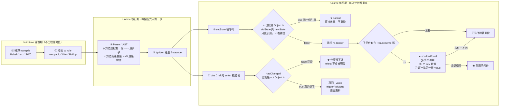

# 比較三兄弟 — `==`、`===`、`Object.is`，以及 React／Vue 為何靠 Object.is 判斷要不要重繪

> [!info]- 🔗 與既有筆記的關聯
> (1) [[15-ToPrimitive-ToNumber-型別轉換抽象操作]] 是 `==` 會自動轉型的底層機制，本篇不重複那套抽象操作，只講「所以現代開發為什麼避開它」。
> (2) [[useState底層-Fiber-Tree-memoizedState與過期閉包]] 講 memoizedState 怎麼存，本篇補的是「存進去之前先用什麼比對」——兩篇接得上。
> (3) [[00-ref與reactive-響應式的兩種實作]] 與 [[Proxy與Reflect-13個攔截器與框架響應式原理]] 講 Vue 響應式，本篇補的是 setter 裡那行 `hasChanged`，也就是 Proxy 攔截到之後「要不要真的 trigger」的判斷。
> (4) [[10-傳值vs傳址-賦值與記憶體空間]] 解釋為什麼 `Object.is({}, {})` 是 `false`——比的是記憶體位址不是內容。

> 本篇重點 a–x，共 24 個（s–x 為 2026-09-06 追加：不可變更新與巢狀盲點）。

---

## 5W1H 速查：讀本篇之前先把座標定好

> [!important]+ 最常被搞錯的一件事：<mark style="background: #FF5582A6;">以為 `useState` 會幫你做「淺比較」</mark>
> a. <mark style="background: #FFF3A3A6;">`useState`／`useReducer` 的 bailout 只做一件事：`Object.is(oldState, newState)`，也就是**比引用**</mark>，完全不看欄位。所以 `setState({...oldObj})` 就算每個欄位都一樣，引用是新的就照樣重繪——這正是「保持 Immutable 更新」這個慣例的來源。
> b. 做淺比較的是<mark style="background: #ADCCFFA6;">`React.memo`／`PureComponent` 內部的 `shallowEqual`</mark>：① 先比引用 → ② 比 key 數量 → ③ 逐一比第一層 value（每一步仍用 `is()`）。<mark style="background: #FF5582A6;">兩者是不同層級的東西，不要混講</mark>。本篇「⚠️ 存疑／更正」記的就是這個錯被抓出來的過程。
> c. 第三個誤解：以為 `Object.is` 比較「聰明」所以會看內容。<mark style="background: #BBFABBA6;">不會</mark>——`Object.is(空物件, 空物件)` 依然是 `false`，它比的是記憶體位址；它跟 `===` 的差別只有 `NaN` 與 `±0` 這兩個洞而已。

| 5W1H | 問題 | 一句話答案 |
|---|---|---|
| **What** 是什麼 | 三兄弟到底差在哪？ | 只差兩件事：a. 會不會自動轉型。b. 怎麼處理 `NaN` 與 `±0`。`==` 會轉型；`===` 不轉型但 `NaN === NaN` 是 false、`+0 === -0` 是 true；`Object.is` 不轉型並補上這兩個洞 |
| **When** 什麼時候 | 這個比較在哪一格發生？ | <mark style="background: #FF5582A6;">執行期，而且每次都重跑</mark>。框架端更具體：**每次 `setState`**、**每次 Vue ref 的 setter 被觸發**都完整跑一次判斷 |
| **Who** 誰在用 | 誰真的在呼叫它？ | a. React 的 `useState`／`useReducer` bailout 用自家 polyfill `is()`（`shared/objectIs.js`），不是全域 `Object.is`。b. `React.memo`／`PureComponent` 用 `shallowEqual`。c. Vue 3 的 `hasChanged` 就是 `!Object.is(...)` |
| **Where** 在哪裡 | 比的到底是什麼東西？ | 對物件而言，比的是<mark style="background: #FFF3A3A6;">**記憶體位址**，不是內容</mark>。這是所有框架比對機制的起點，也是它的限制 |
| **Which** 哪一種 | 什麼時候該用哪一個？ | a. 日常業務邏輯 → `===`。b. 底層封裝、狀態管理、通用工具函式、Custom Hook → `Object.is`（要面對別人傳進來的任意值，包含 `NaN`）。c. `==` → 現代開發基本不用 |
| **How** 怎麼做到 | React 的 polyfill 憑什麼分得出來？ | 兩個經典技巧：<mark style="background: #ADCCFFA6;">`1 / x === 1 / y` 用 `Infinity` 與 `-Infinity` 分辨 `+0` 與 `-0`</mark>；<mark style="background: #ADCCFFA6;">`x !== x` 抓出唯一不等於自己的 `NaN`</mark> |
| **Why** 為什麼 | 為什麼框架不能只用 `===`？ | 因為兩個死角都會變成工程問題：`NaN` 前後相同卻判 false → <mark style="background: #FF5582A6;">無效渲染（沒變卻重繪）</mark>；`±0` 分不出來 → 高精度圖表與數學運算庫會拿到錯的極限方向 |

### 時間軸：這件事發生在哪一格

```text
◄────────── buildtime 建置期 ──────────►◄────────── runtime 執行期 ──────────►
      （你的電腦／CI，部署前就跑完）              （瀏覽器或 Node 載入腳本後）

 ①轉譯        ②打包         ③Parse        ④Bytecode      ⑤每次比較都重來
 transpile    bundle        解析／AST      Ignition       setState 幾次做幾次
 ┌────────┐   ┌────────┐   ┌────────┐   ┌────────┐   ┌──────────────────┐
 │Babel   │   │webpack │   │Scanner │   │AST →   │   │ ★ ===／Object.is  │
 │tsc     │──►│Vite    │──►│Parser  │──►│Bytecode│──►│ ★ React 的 is()   │
 │SWC     │   │Rollup  │   │只知道這 │   │        │   │ ★ shallowEqual    │
 └────────┘   └────────┘   │是個 === │   └────────┘   │ ★ Vue hasChanged  │
  不比較任何    不比較任何    └────────┘                └──────────────────┘
  值            值            每個函式只做一次           每次 setState、
                            不知道兩邊會是什麼            每次 setter 都重跑

 ★ 三兄弟全部落在第 ⑤ 格：比較需要「值」，而值只有執行期才存在。
 ★ 第 ③ 格只看得到「這裡有一個 === 運算子」，看不到兩邊會是 NaN 還是物件。
 ★ 所以 Babel 與 webpack 不會、也不可能幫你先判斷「這次要不要重繪」。
```

同一件事，換成框架判斷路徑自己的序列再看一次：

```text
【React 的兩條路徑】每次 setState 都從頭跑一次

 ① setState(newState) 被呼叫
        │
        ▼
 ② is(oldState, newState)   ← 就是 Object.is 的 polyfill，只比引用
        │
        ├─ true（同一個引用）──► ★ bailout：直接放棄，不重繪
        │
        └─ false ─────────────► ③ 排程 re-render
                                     │
                                     ▼
                          ④ 子元件有包 React.memo 嗎？
                                     │
                                     ├─否─► 子元件跟著重繪
                                     │
                                     └─是─► ⑤ shallowEqual(prevProps, nextProps)
                                              ├─ ⓐ 先比引用（is）
                                              ├─ ⓑ 比 key 數量
                                              └─ ⓒ 逐一比第一層 value（仍用 is）
                                                   │
                                                   ├─ 全部相同 ─► ★ 跳過子元件
                                                   └─ 有任一不同 ─► 子元件重繪

【Vue 3 的單一路徑】每次 ref 的 setter 被觸發都從頭跑一次

 ① ref.value = newValue 觸發 setter
        │
        ▼
 ② hasChanged(newValue, oldValue) ＝ !Object.is(newValue, oldValue)
        │
        ├─ false（沒變）──► ★ 什麼都不做，effect 不會被觸發
        │
        └─ true（真的變了）► ③ 寫回 _value → ④ triggerRefValue → ⑤ 畫面更新
```

同一條時間軸用 Mermaid 再畫一次：



---

## 重點整理

![[學習JS_圖解_比較三兄弟與React重繪判斷路徑_2026-09-05.svg]]

> 本篇主軸圖：上半是三兄弟的嚴格度階梯，下半是 React 的兩條判斷路徑。後續追問請直接指回圖上的方框。

### 一、三者的核心差異（a–d）

(a) <mark style="background: #ADCCFFA6;">三者的差別只有兩件事：會不會自動轉型，以及怎麼處理 `NaN` 與 `±0` 這兩個特例。</mark>

| 比較方式 | 語法 | 型別轉換 | 特殊案例 | 主要用途 |
| --- | --- | --- | --- | --- |
| 鬆散比較 | `a == b` | 會自動轉換 | `1 == "1"` 為 true；`null == undefined` 為 true | 現代開發極少使用（防禦性程式碼除外） |
| 嚴格比較 | `a === b` | 不轉換 | `NaN === NaN` 為 false；`+0 === -0` 為 true | 日常業務邏輯的首選標準 |
| 同值比較 | `Object.is(a, b)` | 不轉換 | `Object.is(NaN, NaN)` 為 true；`Object.is(+0, -0)` 為 false | 精準判斷兩值是否完全相同 |

(b) <mark style="background: #FF5582A6;">`===` 的兩個死角</mark>：`NaN === NaN` 是 `false`（`NaN` 是唯一不等於自己的值），以及 `+0 === -0` 是 `true`（分不出正負零）。

(c) <mark style="background: #BBFABBA6;">`Object.is` 就是專門補這兩個洞的</mark>，其他情況跟 `===` 完全一樣。所以它的規格名稱叫 SameValue，`===` 叫 Strict Equality。

(d) <mark style="background: #FF5582A6;">`Object.is({}, {})` 依然是 `false`</mark>——它比的是「是不是同一個記憶體位址」，不會去比內容。這是後面所有框架比對機制的起點與限制。

### 二、為什麼框架不能只用 ===（e–g）

(e) <mark style="background: #ADCCFFA6;">現代 UI 框架的核心機制是「資料變更 → 觸發重新渲染」</mark>，所以「狀態到底有沒有變」這個判斷必須無副作用而且極度準確。

(f) <mark style="background: #FF5582A6;">不用 `==` 的理由</mark>：自動型別轉換會引發不可預期的渲染 Bug（例如 `0` 變成 `false` 卻沒被偵測到）。

(g) <mark style="background: #FF5582A6;">不只用 `===` 的理由有兩個</mark>：
- <mark style="background: #FF5582A6;">`NaN` 死角</mark>：state 前後都是 `NaN` 時 `===` 判 false，框架誤以為資料改了，做一次無謂的重繪。
- `+0` 與 `-0`：在高精度圖表或數學運算庫中兩者代表不同的極限方向，`===` 分不出來。

> [!tip] 工程上的兩種錯誤
> 無效渲染（Over-rendering）＝沒變卻重繪，浪費效能；漏渲染（Under-rendering）＝變了卻沒偵測到，UI 不更新。比對機制不夠精準時兩種都會發生。

### 三、React 的兩條路徑（h–l）

(h) <mark style="background: #FFF3A3A6;">`useState` / `useReducer` 的 bailout 機制，底層預設就是 `Object.is(oldState, newState)`</mark>。

(i) <mark style="background: #FF5582A6;">`useState` 本身完全沒有做任何欄位層面的淺比較</mark>。你傳入一個全新的物件引用（例如 `setState({...oldObj})`），即使欄位一模一樣，`Object.is` 仍回傳 `false`，就會觸發 re-render。這就是「保持 Immutable 更新」這個慣例的來源。

(j) React 內部的 `is()` 是 `Object.is` 的 polyfill（`shared/objectIs.js`）：

```js
function is(x, y) {
  return (
    (x === y && (x !== 0 || 1 / x === 1 / y)) ||   // 用 1/x 分辨 +0 與 -0
    (x !== x && y !== y)                            // 專門處理 NaN
  );
}
export default typeof Object.is === 'function' ? Object.is : is;
```

(k) <mark style="background: #ADCCFFA6;">`React.memo` / `React.PureComponent` 用的是內部的 `shallowEqual`</mark>，邏輯是三步：

```js
function shallowEqual(objA, objB) {
  if (is(objA, objB)) return true;                 // ① 先比引用

  if (typeof objA !== 'object' || objA === null ||
      typeof objB !== 'object' || objB === null) return false;

  const keysA = Object.keys(objA);
  const keysB = Object.keys(objB);
  if (keysA.length !== keysB.length) return false;  // ② 比 key 數量

  for (let i = 0; i < keysA.length; i++) {          // ③ 逐一比第一層 value
    const key = keysA[i];
    if (!Object.prototype.hasOwnProperty.call(objB, key) ||
        !is(objA[key], objB[key])) return false;
  }
  return true;
}
```

(l) <mark style="background: #FF5582A6;">`shallowCompare` 是不同的東西而且已經廢棄</mark>。它是 React v15 時代 `react-addons-shallow-compare` 這個 package 裡的附加工具，手動寫在 class component 的 `shouldComponentUpdate` 裡；官方文件早就要求改用 `React.memo`（函式元件）或 `React.PureComponent`（class 元件）。

| 機制／工具 | 底層邏輯 | 現行官方建議 |
| --- | --- | --- |
| `useState` / `useReducer` | 直接執行 `Object.is(old, new)`，不比對內部 key | 保持 Immutable 更新，傳入新引用 |
| `React.memo` / `PureComponent` | 內部呼叫 `shallowEqual`，先比引用再比第一層屬性（仍用 `Object.is`） | 避免子元件不必要 re-render 的首選 |
| `shallowCompare`（add-on） | 舊版生命週期輔助函式 | 不要使用 |

### 四、Vue 3 的 hasChanged（m–n）

(m) <mark style="background: #FFF3A3A6;">Vue 3 的 `ref` 在 setter 被觸發時，會先呼叫 `hasChanged`，而 `hasChanged` 就是 `!Object.is(...)`</mark>。

```ts
// Vue 3 packages/shared/src/index.ts（極簡版）
export const hasChanged = (value: any, oldValue: any): boolean =>
  !Object.is(value, oldValue);
```

```ts
class RefImpl<T> {
  private _value: T;
  set value(newValue) {
    if (hasChanged(newValue, this._value)) {
      this._value = newValue;
      triggerRefValue(this, newValue);   // 只有確定變更才觸發 effect 與畫面更新
    }
  }
}
```

(n) <mark style="background: #ADCCFFA6;">React 與 Vue 是兩套完全不同的架構，卻不約而同把 `Object.is` 當成第一道防線</mark>——這正是「最小化無效計算」這個共同工程原則的體現。

### 五、給自己的結論（o–p）

(o) <mark style="background: #BBFABBA6;">日常業務邏輯：優先用 `===`</mark>，語法簡潔且涵蓋絕大多數情境。

(p) <mark style="background: #BBFABBA6;">寫底層封裝、狀態管理、通用工具函式或 Custom Hook 時：改用 `Object.is`</mark>，因為那些程式碼要面對別人傳進來的任意值，包含 `NaN`。

### 六、順手記下的 Markdown 表格陷阱（q–r）

(q) <mark style="background: #FF5582A6;">Markdown 表格的每一列必須維持在同一行內</mark>。在儲存格內直接按 Enter 換行，表格就會被打斷、拆成碎片段落與純文字（Abby 那次的表格就是這樣爆掉的）。

(r) <mark style="background: #BBFABBA6;">要在同一儲存格內換行請用 `<br>` 標籤</mark>，不要按 Enter。另外表頭下面一定要有 `| :--- | :--- |` 這一列分隔線。

### 七、承上：不可變更新與巢狀物件的盲點（s–x，2026-09-06 追加）

(s) <mark style="background: #BBFABBA6;">Abby 自己在語音對話中先講出結論、Gemini 確認完全正確</mark>：<mark style="background: #FFF3A3A6;">因為 React 底層是用 `Object.is` 在比，比的是「兩個陣列／物件是不是同一個記憶體位址」而不是內容</mark>，所以要更新陣列裡的某一筆資料時，<mark style="background: #FF5582A6;">不能直接改原陣列</mark>，必須複製出一個新陣列、建立新的參照，狀態改變才會被偵測到。這條規則的正式名稱叫 <mark style="background: #ADCCFFA6;">Immutable Update（不可變更新）</mark>。

```js
const [items, setItems] = useState([1, 2, 3]);

// ❌ 位址沒變 → Object.is(old, new) 為 true → React 直接 bailout，畫面不動
items.push(4);
setItems(items);

// ✅ 展開運算子產生新陣列 → 新位址 → Object.is 為 false → 觸發 re-render
setItems([...items, 4]);
```

(t) <mark style="background: #ADCCFFA6;">展開運算子（Spread Operator，`...`）</mark>之所以成為標準做法，是因為它<mark style="background: #FFB8EBA6;">用最短的語法產生一個「內容一樣但位址不同」的新容器</mark>，剛好滿足 (i) 那條「傳入全新引用就一定重繪」的規則。<mark style="background: #FF5582A6;">但它只複製第一層</mark>——這正是下一點的陷阱來源。

(u) <mark style="background: #FF5582A6;">巢狀物件的盲點（本次對話的核心）</mark>：<mark style="background: #FFF3A3A6;">淺比較只檢查最外層物件的記憶體位置</mark>，所以直接改巢狀內部的屬性時，最外層參照沒變，React 偵測不到，畫面不會更新。<mark style="background: #BBFABBA6;">正解是「改到哪一層，就從最外層一路複製到那一層」</mark>：

```js
const [user, setUser] = useState({
  name: 'Abby',
  address: { city: 'Taoyuan' }
});

// ❌ 直接改內層：user 的參照沒變，React 不會重新渲染
user.address.city = 'Taipei';
setUser(user);

// ✅ 逐層建立新參照（外層 user 換新、內層 address 也換新）
setUser({
  ...user,
  address: { ...user.address, city: 'Taipei' }
});
```

<mark style="background: #D2B3FFA6;">巢狀太深時的實務替代方案</mark>：改用 [Immer](https://immerjs.github.io/immer/)（`useImmer` 讓你寫起來像直接改，底層自動幫你產生新參照），或先用 `structuredClone(user)` 深拷貝再改——<mark style="background: #FF5582A6;">但 `structuredClone` 無法複製函式、DOM 節點與 class 實例的原型</mark>，別當萬用解。

(v) <mark style="background: #ADCCFFA6;">函式更新（Functional Update／Updater Function）</mark>：Abby 在對話裡把 `prev` 誤唸成「韓式蒸氣」，Gemini 給的正解是——<mark style="background: #FFF3A3A6;">`setState(prev => ...)` 這種寫法叫函式更新，它在更新函式中接收「先前的狀態」，確保這次更新是基於最新的數值</mark>。

```js
// ❌ 批次更新（batching）時三行讀到的都是同一個過期的 count，結果只加 1
setCount(count + 1);
setCount(count + 1);
setCount(count + 1);

// ✅ 每一次都拿 React 排隊時的最新值，結果加 3
setCount(prev => prev + 1);
setCount(prev => prev + 1);
setCount(prev => prev + 1);
```

<mark style="background: #FFB8EBA6;">這一點與 [[useState底層-Fiber-Tree-memoizedState與過期閉包]] 是同一個問題的兩面</mark>：那篇講「為什麼閉包會抓到過期的 state」，這裡講「用 updater function 繞過它」。

(w) <mark style="background: #FF5582A6;">⚠️ 存疑／更正（用詞精確度）</mark>：Gemini 回答「React 確實採用淺比較，也就是檢查記憶體位置是否相同」——<mark style="background: #FF5582A6;">這句把兩件事混成一句了</mark>。依本篇 (h)(i)(k) 已建立的區分：<mark style="background: #BBFABBA6;">`useState` 的 bailout 只做 `Object.is`，那是「比一層引用」不是「淺比較」；真正逐 key 比第一層的 `shallowEqual` 是 `React.memo` / `PureComponent` 在用的</mark>。結論方向沒錯（都是「不換新參照就不重繪」），但面試時把兩者講混會被追問。

(x) <mark style="background: #D2B3FFA6;">順帶釐清兩個都叫 shallow 的東西</mark>：<mark style="background: #ADCCFFA6;">Shallow Copy（淺拷貝）</mark>是「`...` 只複製第一層」，講的是<mark style="background: #FFB8EBA6;">產生資料</mark>；<mark style="background: #ADCCFFA6;">Shallow Comparison（淺比較）</mark>是「只比第一層」，講的是<mark style="background: #FFB8EBA6;">比對資料</mark>。<mark style="background: #FFF3A3A6;">(u) 那個巢狀 bug 之所以出現，正是因為淺拷貝的深度與淺比較的深度剛好對不上你想改的那一層。</mark>

```markdown
| 比較方式 | 語法 | 特殊案例處置 |
| :--- | :--- | :--- |
| **嚴格比較** | `a === b` | `NaN === NaN` (false)<br>`+0 === -0` (true) |
```

## ⚠️ 存疑／更正

- Gemini 說 `useState` 底層「呼叫 `Object.is(oldState, newState)`」——<mark style="background: #FF5582A6;">方向對，但 React 原始碼裡呼叫的是自己包的 `is()`（`shared/objectIs.js`），不是直接呼叫全域的 `Object.is`</mark>，那是為了相容沒有 `Object.is` 的舊環境。Gemini 在後面的回合有補上這段原始碼，前面的說法是簡化。
- Gemini 一開始把 `shallowEqual` 講成「比對 useState」，<mark style="background: #FF5582A6;">這是錯的，已在 (i) 更正</mark>：`useState` 只做 `Object.is`，`shallowEqual` 是 `React.memo` / `PureComponent` 在用的。Abby 自己在第二回合抓到這個錯誤並追問，Gemini 才修正——這一題也證明 Abby 的直覺是對的。
- Gemini 給的 React polyfill 程式碼寫法正確，`1 / x === 1 / y` 是分辨 `+0`（`Infinity`）與 `-0`（`-Infinity`）的經典技巧，`x !== x` 是判斷 `NaN` 的經典技巧，兩者都與 MDN 的 polyfill 一致。

## 🔗 相關練習題（LeetCode JavaScript 專區）

| 主題 | 題目 | 連結 |
| --- | --- | --- |
| 嚴格相等與型別 | 2704. To Be Or Not To Be | https://leetcode.com/problems/to-be-or-not-to-be/ |
| valueOf 與 toString 的隱含轉換 | 2695. Array Wrapper | https://leetcode.com/problems/array-wrapper/ |
| 用比對結果決定要不要重算（memoize） | 2623. Memoize | https://leetcode.com/problems/memoize/ |
| 不可變更新：回傳新陣列而非改原陣列（對應 (s)(t)） | 2634. Filter Elements from Array | https://leetcode.com/problems/filter-elements-from-array/ |
| 排序的 mutating vs non-mutating 差異（對應 (s)） | 2724. Sort By | https://leetcode.com/problems/sort-by/ |
| 巢狀物件逐層走訪與重建（對應 (u)） | 2705. Compact Object | https://leetcode.com/problems/compact-object/ |
| 深比較 vs 淺比較的實作差異（對應 (w)(x)） | 2628. JSON Deep Equal | https://leetcode.com/problems/json-deep-equal/ |

## 各對話來源

### JavaScript 的 toString 運作原理（實際主題是 ==／===／Object.is，2026-09）— https://gemini.google.com/app/8f6c417da3d7d31d

**使用者：** 在 JavaScript 當中 `==`、`===` 與 `Object.is()` 的區別、現代函式庫與 JavaScript 的關係，我要將前者改寫為後者的主題，你會建議我怎麼撰寫？

**Gemini：** 先用表格快速對比三者（型別轉換、特殊案例、主要用途），再過渡到「既然 `===` 已滿足 99% 需求，為什麼 React、Vue、Redux 卻大量依賴 `Object.is()`」。核心是現代 UI 框架的狀態變更偵測：不用 `==` 是因為自動型別轉換會引發不可預期的渲染 Bug；不只用 `===` 是因為 `NaN === NaN` 為 false 會導致無謂重繪，以及 `+0` 與 `-0` 在高精度計算中代表不同極限方向。實戰剖析可拆成 React 的 `useState` 與 `useMemo`、Vue 3 的 `hasChanged`、以及不可變資料與淺比對三塊。結論：業務邏輯用 `===`，底層封裝與狀態管理用 `Object.is()`。

**使用者：** 要（請給 React／Vue 原始碼的實作細節與淺比對範例程式碼）

**Gemini：** React 內部的 `is()`（`shared/objectIs.js`）用 `(x === y && (x !== 0 || 1 / x === 1 / y)) || (x !== x && y !== y)` 這個 polyfill 處理 `±0` 與 `NaN`，並在有原生 `Object.is` 時直接使用它。`React.memo` 用的 `shallowEqual` 先用 `is` 比引用、再比 key 數量、再逐一比第一層 value（每個 value 仍用 `is`）。Vue 3 的 `hasChanged` 是 `!Object.is(value, oldValue)`，`RefImpl` 的 setter 只有在 `hasChanged` 為真時才 `triggerRefValue` 觸發副作用與畫面更新。總結：現代框架的核心精神是最小化無效計算。

### Markdown 表格語法錯誤修正（含 shallowEqual 更正，2026-09）— https://gemini.google.com/app/cf9f976d4245fde5

**使用者：** （貼上排版壞掉的表格）為什麼我這邊會長這樣？

**Gemini：** 因為 Markdown 的表格語法被換行與多餘的豎線 `|` 打斷了。表格的每一列必須維持在同一行內，且標題與內容之間需要有分隔線（`|---|---|`）。一旦在儲存格內直接換行，Markdown 就無法正確解析，原本成排的表格會被拆成碎片段落與純文字。若要在同一儲存格中換行，請使用 `<br>` 標籤，不要直接按 Enter。

**使用者：** 你跟我說 React 內部的 shallowEqual 演算法是比對 useState（我知道有一個 memoizedState）底層預設就是呼叫 `Object.is(oldState, newState)`，可是 shallowCompare 是一個舊的附加工具了，React 官方文件說用 `React.memo` 或 `React.PureComponent` instead。

**Gemini：** 你這個觀念完全正確，這裡有兩個容易混淆的概念要釐清。第一，`useState` 的底層更新機制（Fiber 架構的 bailout）預設就是 `Object.is(oldState, newState)`，傳入新的物件引用即使欄位相同也會觸發 re-render，`useState` 本身完全沒有做欄位層面的淺比較。第二，`shallowCompare` 是 React v15 時代 `react-addons-shallow-compare` 裡的附加工具，用於舊式 class component 的 `shouldComponentUpdate`，官方早已要求改用 `React.memo` 或 `React.PureComponent`；而 `shallowEqual` 是 React 內部在 `React.memo` / `PureComponent` 時使用的輔助函式，先用 `Object.is` 比引用、再比 key 數量與第一層 value。

### 追加 2026-09-06｜React 淺比較、巢狀物件與函式更新（Gemini Live 語音對話）— https://gemini.google.com/app/37f6337ba7e3988d

> 註：Gemini Live 語音逐字稿誤差極大（「單向」被辨識成「安士」、「淺比較」被辨識成「錢比較」、「巢狀」被辨識成「槽狀」、「prev」被辨識成「韓式蒸氣」），以下依語意還原。

**使用者：** 它需要複製原始陣列，避免動到原本的陣列。如果要更新某個資料的話，通常會採用展開運算子。因為它的底層是用 `Object.is` 在做比較，它會比較兩個陣列的位置是否一樣。我說的對嗎？

**Gemini：** 完全正確。React 確實採用淺比較，也就是檢查記憶體位置是否相同，所以更新陣列內容時，必須複製並建立新的陣列參照，這樣狀態改變才能被偵測到。（⚠️ 見重點 (w) 的用詞更正）

**使用者：** 那如果是巢狀的物件結構，它用淺比較還是可以正常的更新與比較嗎？

**Gemini：** 淺比較只會檢查最外層物件的記憶體位置，所以若更新巢狀內部的屬性，最外層的參照沒有變，React 就無法偵測到狀態更新，必須建立每一層的新參照。

**使用者：** 什麼意思啊？舉個例子。

**Gemini：** 如果狀態是 `user = { name: 'Abby', address: { city: 'Taoyuan' } }`，你直接修改 `user.address.city = 'Taipei'`，React 會發現 `user` 的參照沒變，因此不會重新渲染。必須使用展開運算子建立新物件，例如 `setUser({ ...user, address: { ...user.address, city: 'Taipei' } })`。

**使用者：** 那 `prev` 這是叫什麼？

**Gemini：** 這個叫做函式更新。它在狀態更新函式中接收先前的狀態，確保更新是基於最新的數值。

## 資料來源（含查證時間）

| 主題 | 連結 | 版本／查證時間 |
| --- | --- | --- |
| 比較運算子與框架比對（Gemini 對話） | https://gemini.google.com/app/8f6c417da3d7d31d | Gemini Flash，2026-09-05 |
| Markdown 表格與 shallowEqual 更正（Gemini 對話） | https://gemini.google.com/app/cf9f976d4245fde5 | Gemini Flash，2026-09-05 |
| MDN — Object.is（SameValue，含 polyfill 寫法） | https://developer.mozilla.org/en-US/docs/Web/JavaScript/Reference/Global_Objects/Object/is | MDN 現行版本，2026-09-05 查證 |
| MDN — Equality comparisons and sameness（四種相等演算法比較） | https://developer.mozilla.org/en-US/docs/Web/JavaScript/Guide/Equality_comparisons_and_sameness | MDN 現行版本，2026-09-05 查證 |
| React 原始碼 — shared/objectIs.js | https://github.com/facebook/react/blob/main/packages/shared/objectIs.js | React main 分支，2026-09-05 查證 |
| React 原始碼 — shared/shallowEqual.js | https://github.com/facebook/react/blob/main/packages/shared/shallowEqual.js | React main 分支，2026-09-05 查證 |
| React 官方 — memo | https://react.dev/reference/react/memo | React 現行文件，2026-09-05 查證 |
| 淺比較、巢狀物件與函式更新（Gemini Live 對話） | https://gemini.google.com/app/37f6337ba7e3988d | Gemini Live Flash-Lite，2026-09-06 查證 |
| React 官方 — Updating Objects in State（巢狀展開運算子與 Immer，支撐 (t)(u)） | https://react.dev/learn/updating-objects-in-state | React 現行文件，2026-09-06 查證 |
| React 官方 — Updating Arrays in State（不可變陣列操作對照表，支撐 (s)） | https://react.dev/learn/updating-arrays-in-state | React 現行文件，2026-09-06 查證 |
| React 官方 — Queueing a Series of State Updates（updater function 與 batching，支撐 (v)） | https://react.dev/learn/queueing-a-series-of-state-updates | React 現行文件，2026-09-06 查證 |
| MDN — structuredClone（深拷貝的限制，支撐 (u) 的備註） | https://developer.mozilla.org/en-US/docs/Web/API/Window/structuredClone | MDN 現行版本，2026-09-06 查證 |
| Vue 3 原始碼 — packages/shared/src/general.ts（hasChanged） | https://github.com/vuejs/core/blob/main/packages/shared/src/general.ts | Vue core main 分支，2026-09-05 查證 |
| GitHub Flavored Markdown — Tables（每列必須同一行、用 br 換行） | https://github.github.com/gfm/#tables-extension- | GFM 規格，2026-09-05 查證 |

---

由 Gemini 對話自動整理 · 更新於 2026-09-05
