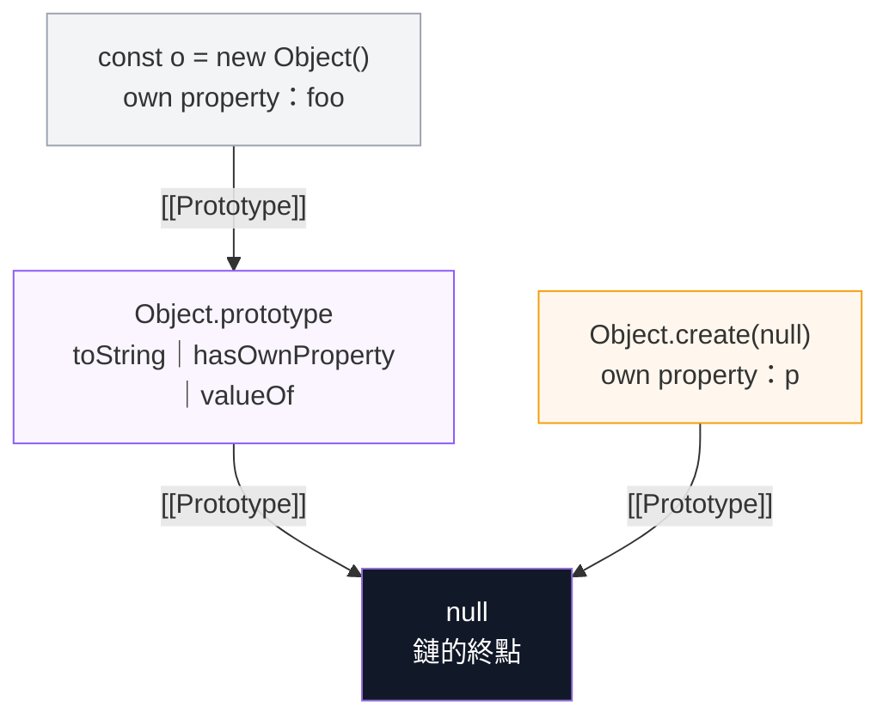

# Object() 建構子｜plain object 的建立與存取

> [!info] 承接與去向
> a. 承接 [[Constructor-與-Prototype-關係]]：那篇講「建構子跟原型是怎麼綁在一起的」，這篇是把最原始的那個建構子 `Object()` 單獨拆開看。
> b. 建好物件之後想看它繼承了什麼，去 [[查看plain-object的prototype]]，那篇是本篇的下一步實作。
> c. 本篇規則 2 產出的包裹物件，會在 [[valueOf-預設行為與原始值轉換]] 與 [[15-ToPrimitive-ToNumber-型別轉換抽象操作]] 被轉回原始值，兩篇是同一條路的頭尾。
> d. 本篇規則 3「原封不動回傳同一個參考」是 [[10-傳值vs傳址-賦值與記憶體空間]] 的直接應用，看不懂那條就先回去補。

---

## 主軸圖

![[學習JS_圖解_Object建構子四條分流與原型鏈_2026-08-19.svg]]

> [!tip] 這張圖是本主題的主軸圖
> 之後任何 Object 相關的追問，都會回頭指這張圖的「分流 1 到分流 4」與右側原型鏈，不另開新章。

---

## a. 先把名詞講清楚

| 名詞 | 全名與意思 |
| --- | --- |
| plain object | 普通物件。指原型鏈接在 `Object.prototype` 上的物件，也就是 `{}` 或 `new Object()` 做出來的那種。不含陣列、Map、Date、函式 |
| wrapper object | 包裹物件。把原始型別（number、string、boolean、bigint、symbol）包成物件的外殼，例如 `Object(1)` 得到 `Number {1}` |
| own property | 自有屬性。直接寫在物件自己身上的鍵值，相對於從原型鏈繼承來的 |
| `[[Prototype]]` | 內部插槽，物件真正指向原型的那條線。在 DevTools 裡顯示成 `[[Prototype]]`，用 `Object.getPrototypeOf()` 讀取 |
| null-prototype object | 空原型物件。用 `Object.create(null)` 建立，原型直接是 `null`，什麼都沒繼承 |
| `new.target` | 一個只在函式被呼叫時存在的中繼屬性。用 `new` 呼叫時它等於那個建構子，一般呼叫時是 `undefined` |

---

## b. 為什麼要單獨開這一篇

你原本把三種東西混在同一批練習檔裡，但它們的原型鏈根本不同：

```js
Object.getPrototypeOf({})           // Object.prototype  → plain object
Object.getPrototypeOf([])           // Array.prototype   → 不是 plain object
Object.getPrototypeOf(new Map())    // Map.prototype     → 不是 plain object
```

所以檔案拆成三支各自獨立：

- `plain-object-建立與存取.html`：本篇的示範檔
- `array-of-objects-存取練習.html`：對應 [[物件陣列-陣列層vs物件層存取]]
- `map-object.html`：Map 有自己的 `get`／`set`／`size`，跟 plain object 是兩套 API

---

## c. Object() 建構子的四條分流

MDN 的語法區塊只有四行，但行為分成四種：

```js
new Object()
new Object(value)
Object()
Object(value)
```

### c-1. 分流 1｜傳 null、undefined 或不傳

回傳一個全新的空 plain object。

```js
new Object()            // {}
new Object(null)        // {}
new Object(undefined)   // {}
Object.getPrototypeOf(Object(null)) === Object.prototype   // true
```

### c-2. 分流 2｜傳原始型別

回傳對應型別的包裹物件，不是原始值。

```js
typeof Object(1)                  // "object"，不是 "number"
Object(1) instanceof Number       // true
Object(1n).constructor.name       // "BigInt"
typeof Object(Symbol("foo"))      // "object"
Object.prototype.toString.call(Object(1))   // "[object Number]"
```

> [!warning] 面試常考的陷阱
> `Object(1) == 1` 是 `true`，因為寬鬆相等會先把物件做 ToPrimitive 轉回 `1`。
> 但 `Object(1) === 1` 是 `false`，型別根本不同。
> 而且 `Object(1) === Object(1)` 也是 `false`，每次呼叫都是新的物件。

### c-3. 分流 3｜傳一個已經是物件的值

原封不動回傳同一個參考，完全不複製。

```js
const src = { a: 1 };
Object(src) === src        // true

const arr = [1, 2];
Object(arr) === arr        // true，陣列也是物件
```

這條規則的實際用途是「保證我拿到的一定是物件」，常見於函式開頭做防禦：把可能是原始值的參數統一轉成物件再處理。

### c-4. 分流 4｜透過 super() 呼叫且 new.target 不是 Object

```js
class MyObj extends Object {}
const m = new MyObj(123);

m instanceof Number                       // false ← 參數 123 被完全忽略了
m instanceof MyObj                        // true
Object.getPrototypeOf(m) === MyObj.prototype   // true

// 對照組
Object(123) instanceof Number             // true
```

這條是子類別繼承時的特例，日常寫程式幾乎用不到，但它解釋了「為什麼 `class X extends Object` 不會把數字變成 Number 實例」。

---

## d. 三種建立方式的關係

```js
const a = new Object();   // 建構子呼叫
const b = Object();       // 一般函式呼叫
const c = {};             // 字面量 object literal
```

實測結果：

| 比較項目 | 結果 |
| --- | --- |
| 三者的原型是否都是 `Object.prototype` | `true` |
| `a === b` | `false` |
| `b === c` | `false` |
| `({}).constructor.name` | `"Object"` |
| `Object.is({}, {})` | `false` |

> [!note] 結論
> 內容一樣不代表是同一個物件。物件的相等比的是參考位址，不是內容。
> 這也是為什麼 MDN 在 Object 頁面特別開一節講 comparing objects，並建議用 `Object.is()` 而不是 `==`。
> 詳見 [[10-傳值vs傳址-賦值與記憶體空間]]。

MDN 的建議很直接：日常建立物件一律用字面量 `{}`，比較簡潔也比較慣用。`Object()` 真正不可取代的用途只有一個，就是「把任意值強制轉成物件」。

---

## e. 存取屬性：點記法與中括號記法

```js
const user = new Object();

user.name = "Abby";        // 點記法，key 必須是合法識別字
user["my age"] = 30;       // 有空格的 key 只能用中括號
user[1] = "one";           // 數字 key 會被自動轉成字串 "1"

const k = "name";
user[k];                   // "Abby"，只有中括號能放變數
user.k;                    // undefined，這是在找一個叫 "k" 的屬性

Object.keys(user);         // ["1", "name", "my age"] ← 注意 1 變成 "1"

delete user["my age"];     // 刪除屬性用 delete 運算子
```

> [!warning] Object 沒有 delete 方法
> MDN 明確寫了：`Object` 上沒有 `delete()` 這種方法，要用 `delete` 運算子。
> 另外 key 的型別強制轉字串這件事，唯一的例外是 Symbol，詳見 [[Symbol-符號型別與物件key]]。

---

## f. null-prototype object：什麼都沒繼承的物件

```js
const np = Object.create(null);   // 或寫成 const np = { __proto__: null };
np.p = 1;

typeof np.hasOwnProperty          // "undefined" ← 根本沒這個方法
`${np}`                           // TypeError: Cannot convert object to primitive value

Object.keys(np)                   // ["p"]   靜態方法照樣可用
"p" in np                         // true    運算子不走原型鏈查方法
Object.hasOwn(np, "p")            // true
```

| 面向 | 說明 |
| --- | --- |
| 好處 | 可以當成乾淨的字典使用，不會被原型污染 prototype pollution 攻擊，也不會有 `constructor`、`toString` 這些鍵混進來 |
| 代價 | 所有 `Object.prototype` 的方法都不見了，連字串轉換都會爆 TypeError |
| 因應方式 | 改用靜態方法 `Object.keys()`、`Object.hasOwn()`，而不是 `obj.hasOwnProperty()` |

這正是 MDN 建議「modern code should prefer static methods」的原因，靜態方法對 null-prototype 物件也安全。相關速查在 [[Object靜態方法速查]]。

---

## g. 原型鏈實際長相

用 DevTools 展開一個 plain object，可以看到 `[[Prototype]]` 那一層：

![[JS_DevTools_物件原型鏈展開_2026-06-10.png]]

繼承來的方法都掛在 `Object.prototype` 上：

![[plain-object繼承的prototype方法-builderio.png]]



---

## h. 一句話總結

- `Object()` 的本質是「型別轉換函式」而不是「物件工廠」，加不加 `new` 在日常用法上沒有差別
- 要做空物件請寫 `{}`，那才是慣用寫法
- 會用到 `Object()` 的時機只有兩個：把不確定型別的值強制轉成物件，或是刻意要建立包裹物件

---

## 參考來源

| 來源 | 網址 | 頁面最後更新 |
| --- | --- | --- |
| MDN｜Object() constructor | https://developer.mozilla.org/en-US/docs/Web/JavaScript/Reference/Global_Objects/Object/Object | 2025-07-10 |
| MDN｜Object | https://developer.mozilla.org/en-US/docs/Web/JavaScript/Reference/Global_Objects/Object | 2026-05-22 |
| MDN｜delete 運算子 | https://developer.mozilla.org/en-US/docs/Web/JavaScript/Reference/Operators/delete | — |

> [!note] 驗證方式
> 本篇所有輸出結果都在 Node.js 實際跑過一次確認，不是憑記憶寫的。
> 可執行的示範檔在 `C:\coding\JavaScript-practicing\plain-object-建立與存取.html`，用 Live Server 開啟後按按鈕即可看到結果。

---

## 關聯筆記

| 筆記 | 關聯原因 |
| --- | --- |
| [[查看plain-object的prototype]] | 本篇建立物件，那篇檢查物件。同一個主題的前後兩步 |
| [[Constructor-與-Prototype-關係]] | 本篇的四條分流全部繞著「建構子如何決定原型」在轉 |
| [[valueOf-預設行為與原始值轉換]] | 分流 2 產出的包裹物件要靠 `valueOf` 才轉得回原始值 |
| [[15-ToPrimitive-ToNumber-型別轉換抽象操作]] | 解釋 `Object(1) == 1` 為什麼是 true 的底層規格 |
| [[10-傳值vs傳址-賦值與記憶體空間]] | 分流 3 回傳同一參考，就是傳址的教科書案例 |
| [[Symbol-符號型別與物件key]] | 物件 key 只有字串與 Symbol 兩種，本篇 e 節的例外 |
| [[Object靜態方法速查]] | f 節說要改用靜態方法，清單在那裡 |
| [[物件陣列-陣列層vs物件層存取]] | 拆檔的另一半，說明為什麼陣列不是 plain object |
| [[for...in]] | 遍歷 plain object 時會走原型鏈，跟 f 節的 null-prototype 直接相關 |

> [!note] 追問延伸（2026-08-19）
> 「Object.prototype 到底有什麼」的完整答案是 12 個成員，且它們的 enumerable 全部是 false，所以 `Object.keys(Object.prototype)` 回空陣列。
> 為什麼看得到與看不到，整理在 [[屬性列舉決策矩陣-keys與getOwnPropertyNames與Reflect-ownKeys]]；印表格用的 `console.table` 整理在 [[Console方法家族-一次講完]]。

---

## i. 追問延伸｜為什麼 getPrototypeOf([]) 不是 Object.prototype

> [!question] 這一節回答的是 b 節那三行的第 2、3 行
> b 節寫了三行判準，第一行 `Object.getPrototypeOf({})` 得到 `Object.prototype` 很直覺，
> 但第 2、3 行為什麼是 `Array.prototype` 跟 `Map.prototype`？
> 答案要回頭看主軸圖**右側「plain object 的原型鏈」那一格**：那張圖只畫了兩階，因為 plain object 剛好只有兩階。

### i-1. 先確認一件事：它是靜態方法沒錯

`Object.getPrototypeOf()` 在 MDN 上的分類是 **static method 靜態方法**，掛在 `Object` 建構函式上。
寫法是把你的物件當**參數**傳進去，不是 `obj.getPrototypeOf()`：

```js
Object.getPrototypeOf(myObj)   // 正確
myObj.getPrototypeOf()         // TypeError，Object.prototype 上沒有這個方法
```

### i-2. 關鍵：它只跳「一階」

```
Object.getPrototypeOf(x)  問的是「x 的上一階是誰」
                          不是「x 的鏈最上面是誰」
```

`{}` 之所以看起來像「跳到頂」，純粹是因為它的上一階剛好就是頂。
`[]` 中間多插了一層，第一次呼叫只走到那一層就停了。

![[學習JS_圖解_原型鏈階數-getPrototypeOf只跳一階_2026-08-19.svg]]

### i-3. 三條鏈攤開來看

| 值 | 完整原型鏈 | 階數 |
| --- | --- | --- |
| `{}` | `{}` → `Object.prototype` → `null` | 2 |
| `[]` | `[]` → **`Array.prototype`** → `Object.prototype` → `null` | 3 |
| `new Map()` | `new Map()` → **`Map.prototype`** → `Object.prototype` → `null` | 3 |
| `new Date()` | `new Date()` → `Date.prototype` → `Object.prototype` → `null` | 3 |
| `function f(){}` | `f` → `Function.prototype` → `Object.prototype` → `null` | 3 |

呼叫兩次就看得出來：

```js
Object.getPrototypeOf([]) === Array.prototype                       // true
Object.getPrototypeOf(Object.getPrototypeOf([])) === Object.prototype // true
```

### i-4. 所以陣列跟 Object 到底有沒有關係

有，而且關係很深。容易誤會的三點：

| 誤會 | 實際情況 |
| --- | --- |
| 陣列不是物件 | `typeof []` 是 `"object"`，`[] instanceof Object` 是 `true` |
| 陣列繼承不到 `Object.prototype` | 繼承得到。`Object.prototype.isPrototypeOf([])` 是 `true`，`[].hasOwnProperty` 也存在 |
| `[].toString` 就是 `Object.prototype.toString` | 不是。`[].toString === Object.prototype.toString` 是 **`false`**，因為 `Array.prototype` 自己覆寫了一份。但 `({}).toString === Object.prototype.toString` 是 `true` |

原型鏈查找是「由下往上找到第一個就停」，所以 `[].toString` 在第 1 階就命中 `Array.prototype.toString`，
根本走不到 `Object.prototype` 那份。這也解釋了型別偵測為什麼一定要寫 `.call()`：

```js
[1, 2].toString()                          // "1,2"          ← 用到覆寫的版本
Object.prototype.toString.call([1, 2])     // "[object Array]" ← 繞過覆寫，指定用原版
```

### i-5. 那多出來的一層裝了什麼（實測數字）

| 原型層 | 自有屬性數 | 代表成員 | plain object 有嗎 |
| --- | --- | --- | --- |
| `Array.prototype` | 40 | `push`、`pop`、`map`、`filter`、`reduce`、`length` | 沒有，`({}).push` 是 `undefined` |
| `Map.prototype` | 11 | `get`、`set`、`has`、`delete`、`size`、`clear` | 沒有 |
| `Object.prototype` | 12 | `toString`、`valueOf`、`hasOwnProperty` | 有，這是共用層 |

如果把那 40 個陣列方法直接塞進 `Object.prototype`，那連 `{ name: "Abby" }` 都會有 `push`。
**共用的放最上層，專屬的放各自那層** —— 這就是原型鏈要分層的理由。

### i-6. 判準修正

> [!important] 一句話
> 「是不是 plain object」的判準是**「第 1 階是不是 `Object.prototype`」**，
> 不是「鏈上有沒有 `Object.prototype`」。
> 後者的話除了 `Object.create(null)` 以外全部都算，那這個分類就沒有鑑別力了。

```js
// 語意最直接的寫法
const isPlainObject = (v) => {
  if (v === null || typeof v !== "object") return false;
  const p = Object.getPrototypeOf(v);
  return p === Object.prototype || p === null;   // null 是 Object.create(null) 的情況
};

isPlainObject({});                    // true
isPlainObject([]);                    // false
isPlainObject(new Map());             // false
isPlainObject(new Date());            // false
isPlainObject(Object.create(null));   // true
```

> [!note] 驗證方式
> 本節所有數字與布林值都在 Node.js v22 的 V8 實跑過。
> 可執行腳本 `原型鏈階數-demo.js` 與逐階動畫 `原型鏈階數-互動版.html` 都在同資料夾。

---

## j. 追問延伸｜`__proto__` 是靜態方法還是 Object.prototype 上的

> [!question] 這一節回答的是主軸圖右側原型鏈那一格的細節
> 承接 g 節那張 `Object.prototype` 12 個成員的表格 —— `__proto__` 就是表格裡唯一標成 **accessor** 的那一列。

### j-1. 直接答案：兩個選項都不完全對

| 問題 | 答案 |
| --- | --- |
| 是靜態方法嗎 | **不是**。`Object.hasOwn(Object, "__proto__")` 是 `false`，它不在 `Object` 建構函式上 |
| 是 `Object.prototype` 上的嗎 | **是**。`Object.hasOwn(Object.prototype, "__proto__")` 是 `true` |
| 是方法嗎 | **不是**。它是 **accessor property 存取器屬性**，一組 getter 與 setter |

所以完整答案是：**它是定義在 `Object.prototype` 上的存取器屬性，不是方法，更不是靜態方法。**

```js
Object.getOwnPropertyDescriptor(Object.prototype, "__proto__");
// { get: [Function], set: [Function], enumerable: false, configurable: true }
// 有 get 與 set、沒有 value → 存取器描述器
```

因為它不是方法，所以**不能加括號**：

```js
const o = {};
typeof o.__proto__   // "object" ← 讀取時 getter 自動執行，直接就是原型物件
o.__proto__()        // TypeError: o.__proto__ is not a function
```

> [!tip] 對照三種東西
> - `Object.getPrototypeOf()` → **靜態方法**，掛在 `Object` 上，要呼叫
> - `obj.hasOwnProperty()` → **實例方法**，掛在 `Object.prototype` 上，要呼叫
> - `obj.__proto__` → **存取器屬性**，掛在 `Object.prototype` 上，**不呼叫**，讀寫時 getter／setter 自動觸發

### j-2. 三個長得一樣但完全不同的 `__proto__`

這是最容易混的地方，MDN 也特別開一段講：

| 寫法 | 身分 | 行為 |
| --- | --- | --- |
| `obj.__proto__` ／ `obj.__proto__ = X` | `Object.prototype` 上的**存取器屬性** | 讀寫 `[[Prototype]]`。**已 deprecated** |
| `{ __proto__: X }` 物件字面量 | **獨立的語法特性**，不是那個存取器 | 建立時直接設定原型。**是標準且被引擎最佳化的** |
| `{ ["__proto__"]: X }` 計算屬性名 | 就是個**普通字串 key** | 完全不碰原型，只是新增一個叫 `__proto__` 的屬性 |

實測：

```js
Object.getPrototypeOf({ __proto__: null });        // null   ← 字面量語法生效
Object.getPrototypeOf({ ["__proto__"]: "hi" });    // Object.prototype ← 沒被當原型
({ ["__proto__"]: "hi" })["__proto__"];            // "hi"   ← 只是一般屬性
```

MDN 原文的說法是：字面量那個語法「跟 `Object.prototype.__proto__` 很不一樣」。所以 f 節那個 `{ __proto__: null }` 用的是**字面量語法**，跟本節在講的存取器不是同一個東西。

### j-3. 為什麼 null-prototype 物件會 `undefined`

因為那個存取器住在 `Object.prototype` 上，而 `Object.create(null)` 根本沒繼承它：

```js
const np = Object.create(null);
np.x = 1;

np.__proto__;                      // undefined ← 不是原型，就是找不到這個屬性
np.__proto__ = { hacked: true };   // 只是新增一個普通屬性
Object.getPrototypeOf(np);         // null ← 原型完全沒被動到
Object.getOwnPropertyNames(np);    // ["x", "__proto__"] ← 變成貨真價實的自有屬性
```

**這就是 null-prototype 物件能擋掉原型污染 prototype pollution 的原理** —— 攻擊者塞 `__proto__` 進來也只是多一個普通 key，動不到原型鏈。這條接回 f 節說的「好處是可以當成乾淨的字典」。

### j-4. MDN 為什麼標 deprecated

| 理由 | 說明 |
| --- | --- |
| 效能 | MDN 原文說改動 `__proto__` 在每一個瀏覽器與 JS 引擎上都是**非常慢的操作** |
| 安全 | 原型污染 prototype pollution 攻擊的主要入口 |
| 定位 | 它是為了網頁相容性才被寫進規範的**遺留特性**（Annex B／web legacy），不是正統設計 |

現代等價寫法：

| 你想做的事 | deprecated 寫法 | 建議寫法 |
| --- | --- | --- |
| 讀原型 | `obj.__proto__` | `Object.getPrototypeOf(obj)` ／ `Reflect.getPrototypeOf(obj)` |
| 設原型 | `obj.__proto__ = p` | `Object.setPrototypeOf(obj, p)` ／ `Reflect.setPrototypeOf(obj, p)` |
| 建立時就指定原型 | — | `{ __proto__: p }` 字面量，或 `Object.create(p)` |

### j-5. 別跟這個搞混

```js
Object.__proto__ === Function.prototype;   // true
```

`Object` 自己也有 `__proto__`，但那是因為 **`Object` 是一個函式，函式也是物件**，它的第 1 階原型是 `Function.prototype`。
這跟「`__proto__` 是不是靜態方法」是兩件完全不同的事。

> [!note] 驗證方式
> 本節所有輸出都在 Node.js v22 的 V8 實跑過，腳本是同資料夾的 `__proto__-三種身分-demo.js`。
> 參考 MDN `Object.prototype.__proto__`（頁面最後更新 2026-05-22），規範對應 ECMAScript 2027 的 `sec-object.prototype.__proto__`。

---

## k. 追問延伸｜三種 `__proto__` 寫法的深入版

> [!question] 這一節回答四個追問
> a. `obj.__proto__ = X` 的 `X` 是什麼、為什麼有等號
> b. 為什麼 MDN 標 deprecated
> c. `{ ["__proto__"]: X }` 真的完全不碰原型嗎
> d. 這三種寫法是不是同一件事的不同寫法

### k-1. 等號是「寫」，沒等號是「讀」

`__proto__` 是存取器屬性，有 getter 也有 setter，所以有兩種用法：

| 寫法 | 觸發 | 等價的正規做法 |
| --- | --- | --- |
| `obj.__proto__` | getter | `Object.getPrototypeOf(obj)` |
| `obj.__proto__ = X` | setter | `Object.setPrototypeOf(obj, X)` |

`X` 只是變數名的佔位符，代表「任何你想拿來當原型的物件」。寫 `obj.__proto__ = animal` 也一樣。

### k-2. 六種寫法實測：哪些真的會設原型

`P` 是一個有 `greet()` 的物件。實測結果：

| 寫法 | 原型變成 | 自有屬性 | 拿得到 `greet()` | 有設原型 |
| --- | --- | --- | --- | --- |
| `{ __proto__: P }` | `P` | `[]` | 是 | **有** |
| `{ "__proto__": P }` | `P` | `[]` | 是 | **有**（字串字面量也算） |
| `{ ["__proto__"]: P }` | `Object.prototype` | `["__proto__"]` | 否 | **沒有** |
| `{ __proto__ }` 簡寫 | `Object.prototype` | `["__proto__"]` | 否 | **沒有** |
| `{ __proto__(){} }` 方法簡寫 | `Object.prototype` | `["__proto__"]` | 否 | **沒有** |
| `obj.__proto__ = P` | `P` | `[]` | 是 | **有** |
| `Object.setPrototypeOf(o, P)` | `P` | `[]` | 是 | **有** |
| `Object.create(P)` | `P` | `[]` | 是 | **有** |

### k-3. 為什麼計算屬性名就不算了

> [!important] 關鍵：引擎看的是「你怎麼寫」，不是「字串長什麼樣」
> 在物件字面量裡，`__proto__:` 被規範當成一個**特殊的語法形式**，引擎在**解析程式碼的當下**就認出它，走「設定原型」那條路。
> 而 `["__proto__"]` 是**計算屬性名 computed property name**，意思是「先算出中括號裡的值，再拿那個值當 key」。
> 引擎解析到這裡只知道「有個要算的 key」，走的是**「建立一般屬性」**那條完全不同的路，那條路沒有「設原型」這個選項。

類比：`if` 是 JavaScript 的關鍵字，`"if"` 只是一個剛好長得像關鍵字的字串。
同理，字面量裡的 `__proto__:` 是**語法**，`["__proto__"]` 算出來的是**一個剛好叫 `__proto__` 的字串 key**。

`JSON.parse` 也走「一般屬性」那條路：

```js
const j = JSON.parse('{"__proto__":{"hacked":true},"name":"abby"}');
Object.getPrototypeOf(j);            // Object.prototype ← 沒被改
Object.getOwnPropertyNames(j);       // ["__proto__", "name"]
j.hacked;                            // undefined ← 沒被污染
```

### k-4. `getPrototypeOf` 不是「搭配」，它是尺

`{ __proto__: P }` 是**動作**（我把原型設成 P），`Object.getPrototypeOf(o)` 是**檢查**（量量看原型變成什麼）。
就像貼壁紙之後拿尺量有沒有貼歪，尺不是壁紙的一部分。量原型的尺不只一把：

| 工具 | 回答什麼 | 版本 |
| --- | --- | --- |
| `Object.getPrototypeOf(o)` | o 的**第 1 階**原型是誰 | ES5 |
| `Reflect.getPrototypeOf(o)` | 同上，Proxy 場景用 | ES2015 |
| `P.isPrototypeOf(o)` | P 在不在 o 的**整條**原型鏈上 | ES3 |
| `o instanceof C` | `C.prototype` 在不在 o 的原型鏈上 | ES1 |
| `o.__proto__` | 同 `getPrototypeOf`，但 deprecated | ES2015 Annex B |

注意 `getPrototypeOf` 只量第 1 階，`isPrototypeOf` 量整條鏈，這條接回 i 節的階數概念。

### k-5. 所以三個不一樣

| 寫法 | 有設原型 | 什麼時候發生 | 標準狀態 |
| --- | --- | --- | --- |
| `obj.__proto__ = X` | 有 | 物件**建立之後** | deprecated |
| `{ __proto__: X }` | 有 | 物件**建立的當下** | 標準，且被引擎最佳化 |
| `{ ["__proto__"]: X }` | **沒有** | — | 就是普通屬性 |

前兩個雖然都設了原型，但**時機不同**，這正是效能差距的來源。第三個根本是另一件事。

### k-6. deprecated 的三個理由，誠實排序

**理由一：慢（但要老實看數字）**

V8 會幫每個物件記一張 hidden class 隱藏類別來加速屬性查找，建立之後才改原型會讓累積的 inline cache 失效。

但我實測下來：在 Chromium 上，不管是「建立 10 萬個物件」還是「改過原型後讀 100 萬次屬性」，**都測不出穩定差距**；在 Node.js 上第二個測試有測到約 1.3 倍。
MDN 說「非常慢的操作」，但現代 V8 已經把簡單情境最佳化掉很多了。**這不是最強的理由。**

**理由二：原型污染（這才是真的致命）**

```js
// 攻擊者送進來的 JSON，看起來人畜無害
const payload = JSON.parse('{"__proto__":{"isAdmin":true}}');

// 你的程式有一段很常見的「合併設定」
for (const k in source) { target[k] = source[k]; }   // for...in ＋ 賦值 = 危險組合

// 合併之後
({}).isAdmin                    // true ← 全世界的物件都變成 admin
Object.keys({})                 // []   ← 但看起來還是空的，超難發現
Object.hasOwn({}, 'isAdmin')    // false ← 因為它是繼承來的
```

> [!warning] 關鍵細節
> `JSON.parse` 本身**是安全的**，它走的是「建立一般屬性」那條路。
> 出事的是後面那個**合併**動作：`target[k] = ...` 這種**賦值**會觸發 setter，這才把原型污染掉。

三種防法：

- 合併時用 `Object.keys(source)` 或 `Object.hasOwn` 過濾，別用 `for...in`
- 明確跳過 `__proto__`、`constructor`、`prototype` 這三個 key
- 設定物件改用 `Object.create(null)` —— 它沒繼承那個 setter，攻擊者塞 `__proto__` 進來也只會多一個普通屬性。這條接回 f 節

**理由三：它是遺留特性**

`__proto__` 進規範不是因為設計得好，是因為太多網站在用、**移不掉**，所以被收進 Annex B 這個「網頁相容性遺留特性」附錄。

### k-7. 你該記什麼

- **要讀原型** → `Object.getPrototypeOf(o)`
- **建立時就要指定原型** → `{ __proto__: P }` 或 `Object.create(P)`
- **建立之後才要改** → `Object.setPrototypeOf(o, P)`，但先想想能不能避免
- **永遠不要寫** → `o.__proto__ = P`
- **合併使用者資料** → 用 `Object.keys` 過濾，或用 `Object.create(null)` 當容器

> [!note] 可執行的互動版
> 同資料夾的 `__proto__三種寫法差在哪-互動版.html`：
> 六種寫法的表格是即時跑出來的，f 節可以在你自己的瀏覽器上跑效能測試，
> g 節可以按按鈕**實際製造一次原型污染再清乾淨**。

---

## l. 追問延伸｜物件模型、字面量為何標準、以及誰真的會慢

> [!question] 這一節回答三個追問
> a. 既然 `{ __proto__: X }` 是標準且被最佳化的，為什麼 `__proto__` 又被說 deprecated
> b. 「不符合標準的物件模型」的**物件模型**是什麼
> c. 三種寫法都會降低執行效率嗎

### l-1. 先解決矛盾：deprecated 的是「存取器」，不是「字面量語法」

這兩個在規範裡是**兩個不同的東西**，只是名字長得一樣：

| 規範裡的東西 | 位置 | 狀態 |
| --- | --- | --- |
| `Object.prototype.__proto__` 存取器屬性 | Annex B（網頁相容性遺留特性附錄） | **deprecated** |
| 物件字面量裡的 `__proto__: X` 語法 | 正文的 Object Initializer 章節 | **標準，且被引擎最佳化** |

所以「`__proto__` 被 deprecated」這句話要補完整：**被 deprecated 的是那個存取器屬性**（也就是 `obj.__proto__` 這種用法），字面量語法沒有被 deprecated。

MDN 的 deprecated 標記掛在 `Object.prototype.__proto__` 那一頁，不是掛在 Object initializer 那一頁，這就是證據。

### l-2. 「物件模型」是什麼

規範裡每個物件由三種東西構成：

| 層級 | 是什麼 | 例子 |
| --- | --- | --- |
| **屬性 property** | 你放進去的資料，有 key 有描述器 | `obj.name = "Abby"` |
| **內部插槽 internal slot** | 引擎自己用的結構欄位，**JS 程式碼碰不到** | `[[Prototype]]`、`[[Extensible]]` |
| **內部方法 internal method** | 規範定義的操作，用雙中括號寫 | `[[GetPrototypeOf]]`、`[[SetPrototypeOf]]`、`[[Get]]`、`[[Set]]` |

這一整套規則就叫**物件模型 object model**。設計原則是：**資料歸資料（屬性層），結構歸結構（內部插槽層），兩層要分開。**

- `Object.getPrototypeOf(o)` 規規矩矩地說「我要呼叫 `[[GetPrototypeOf]]` 這個內部方法」，動作明確
- `obj.__proto__` 則是**把內部插槽偽裝成一個看起來很普通的屬性**

> [!important] 這就是根本問題
> 一旦內部結構長得像一般屬性，**任何走「一般屬性賦值」的路徑都可能不小心改到原型**：
> `obj[k] = v`、合併設定物件、抄 JSON 欄位、複製表單資料……
> 這不是實作 bug，是**把兩層混在一起的設計後果**。原型污染會存在，根源就在這裡。

一句話：**`__proto__` 的問題不是「它慢」，而是「它讓內部結構長得像資料」，於是既不安全也難最佳化。**

### l-3. 三種寫法哪些會降低效率（實測）

**不是三種都慢。** Node.js v22 各 20 萬次的實測：

| 寫法 | 動到原型嗎 | 什麼時候 | 實測 | 分類 |
| --- | --- | --- | --- | --- |
| `Object.create(X)` | 有 | **建立當下** | 約 3～5 ms | **快** |
| `{ __proto__: X }` | 有 | **建立當下** | 約 14 ms | **快** |
| `o.__proto__ = X` | 有 | 建立**之後**突變 | 約 16～28 ms | **慢** |
| `Object.setPrototypeOf(o, X)` | 有 | 建立**之後**突變 | 約 16～29 ms | **慢** |
| `{ ["__proto__"]: X }` | **沒有** | — | 約 0.2 ms | 只是一般屬性 |

> [!warning] 兩個反直覺的結論
> a. **`Object.setPrototypeOf` 並不會比 `o.__proto__ =` 快**（比值 0.99）。
> 貴的是**「突變」這個動作本身**，不是 `__proto__` 這個語法。換正規 API 是為了「不用 deprecated API」與「意圖明確」，**不是為了效能**。
> b. 要效能就得**在建立時就把原型定好**，這時 `{ __proto__: X }` 反而是被最佳化的正解。

底層原因（Shape、Inline Cache、ValidityCell）整理在 [[原型與引擎最佳化-Shape-InlineCache-ValidityCell]]。

### l-4. 那 setter 可以拿來做什麼好事

`__proto__` 是壞例子，但**存取器屬性本身是好東西**。最常見的四個用途：

| 用途 | 例子 |
| --- | --- |
| **資料驗證** | 在 `set` 裡檢查型別與範圍，不合法就 `throw`，通過才寫進去 |
| **計算屬性** | `get fahrenheit()` 從攝氏算出來，不佔記憶體、永遠同步 |
| **唯讀對外介面** | 只給 `get` 不給 `set`，內部值藏在閉包或 `#` 私有欄位 |
| **偷聽讀寫** | 在 getter／setter 裡記 log 或觸發更新 —— **這就是 Vue 2 響應式的原理** |

三種定義方式（字面量、`Object.defineProperty`、`class`）與完整的驗證範例，整理在 [[存取器屬性三種定義方式-getter-setter與資料驗證]]。

### l-5. 面試考題

原型主題的 16 題考題（基礎 6、進階 6、底層 4），每題附參考答法與面試官可能的追問，可執行的部分可以當場按：
`原型-面試考題.html`（同資料夾）。

> [!note] 相關產出
> - [[存取器屬性三種定義方式-getter-setter與資料驗證]] ＋ `存取器-三種定義方式-demo.js`
> - [[原型與引擎最佳化-Shape-InlineCache-ValidityCell]] ＋ `原型突變成本-bench.js`
> - `原型-面試考題.html`

---

## m. 追問延伸｜樣板字串裡的 `Object(2)` 為什麼不會被執行

> [!question] 起因
> 看到 `console.log(\`Object(2)\`, Object(2));` 這一行，問「為什麼樣板字串裡直接這樣寫不會執行，還是變成字串」。

### m-1. 反引號只是另一種引號，不是「執行」的意思

**只有 `${...}` 裡面的東西才會被執行。** 反引號裡的純文字就是純文字：

```js
`Object(2)`        // "Object(2)"  ← 一個字串，跟 'Object(2)' 一模一樣
`${Object(2)}`     // "2"          ← 執行了，但結果被 ToString 壓成字串
`1 + 1`            // "1 + 1"      ← 沒有 ${} 就不算
`${1 + 1}`         // "2"
```

反引號比單雙引號多的只有兩件事：**`${}` 插值**與**可以直接換行**。

### m-2. 所以那一行其實是刻意的

```js
console.log(`Object(2)`, Object(2));
//           └─ 第 1 個參數：字串「Object(2)」，當標籤用
//                          └─ 第 2 個參數：真的執行，印出 [Number: 2]
```

這是很常見的除錯寫法：**第一個參數放「程式碼長什麼樣」的字串當標籤，第二個參數放真正的值。**
輸出會是：

```
Object(2) [Number: 2]
```

### m-3. 千萬別把物件包進 `${}`

因為 `${}` 會觸發 ToString，**物件的身分會被壓扁**：

```js
const wrapped = Object(2);

console.log(wrapped);           // [Number: 2]  ← 看得出它是包裹物件
console.log(`${wrapped}`);      // "2"          ← 變成字串，資訊全沒了
typeof wrapped                  // "object"
typeof `${wrapped}`             // "string"
```

**要看物件原本的樣子，就直接當參數丟給 `console.log`，別包進 `${}`。**

更慘的是 null-prototype 物件會直接爆掉：

```js
const np = Object.create(null);
`${np}`            // TypeError: Cannot convert object to primitive value
console.log(np);   // [Object: null prototype] {} ← 直接印沒事
```

因為 `${}` 需要呼叫 `toString`，而它沒有繼承到。這條接回 f 節與 k-6 節。

### m-4. 動手練習

兩大考點的自我批改練習檔放在 `C:\coding\JavaScript-practicing\`：

| 檔案 | 內容 |
| --- | --- |
| `Object建構子兩大考點-練習.js` | 12 題填答（把 `undefined` 換成你的答案，存檔跑一次自動批改）＋ 3 題實作（`isWrapperObject`、`isPlainObject`、`safeToString`，寫完自動測試 16 個 case） |
| `Object建構子兩大考點-解答.js` | 參考解答與兩個真實陷阱 |

> [!warning] 練習檔裡最值得記的兩個真實陷阱
> **陷阱一：拿包裹物件當旗標**
> ```js
> const flag = new Boolean(false);
> if (flag) { /* 會進來！ */ }
> ```
> 因為**任何物件在布林情境都是 truthy**，包括 `new Boolean(false)`。所以永遠不要用 `new Number`／`new String`／`new Boolean`。
>
> **陷阱二：以為 `Object(null)` 能做出乾淨字典**
> `new Object(null)` 做出來的是普通空物件，還有 `Object.prototype`，使用者塞 `constructor` 進來會蓋掉原本的。
> 真的要乾淨字典只有 `Object.create(null)`。
