# 自我測驗：迴圈 / switch / 日期 / for...in

> 出題範圍：`JavaScript-practicing/while-loop.html` 練習中我搞混過的點
> 相關：[[loops-and-increment-operators]]、[[new-Date-日期物件重點]]、[[字串組合-樣板字面值vs加號串接]]、[[for...in]]
> 建議：先遮住最下面的「解答」，全部寫完再對。

---

## 5W1H 速查：讀本篇之前先把座標定好

> [!important]+ 最常被搞錯的一件事：<mark style="background: #FF5582A6;">「靜態」的相反是「動態（執行期）」，不是「編譯後」</mark>
> 這正是 Q3 想抓的那個誤區。很多人以為 SonarQube／SonarLint 這種靜態分析工具「一定要先編譯完才會跑出錯誤」，其實它<mark style="background: #ADCCFFA6;">不執行、不編譯，直接讀原始碼</mark>，所以你打字的當下它就能提示。把這條線畫清楚之後，Q2 的波浪線、Q12 的 ReferenceError、Q15 的「迴圈為什麼不自己跑」會一次全部歸位——它們分屬不同格，錯的原因完全不同。

| 5W1H | 問題 | 一句話答案 |
|---|---|---|
| **What** 是什麼 | 這 15 題到底在考什麼？ | 表面上考 `do...while`、`switch`、`Date`、`for...in`；骨子裡考的是<mark style="background: #BBFABBA6;">「這件事發生在哪一格」</mark>的判斷力 |
| **When** 什麼時候 | 每一題各發生在什麼時候？ | 只有三格：撰寫期的靜態檢查（Q1、Q3）、runtime 的解析（Q2）、runtime 的執行（其餘）。<mark style="background: #FFF3A3A6;">這份測驗沒有任何一題落在 buildtime</mark>，因為它是純瀏覽器手寫練習，沒有轉譯也沒有打包 |
| **Who** 誰做的 | 是誰在對你報錯？ | 編輯器／SonarLint（不執行不編譯，讀原始碼即時提示）、引擎的 Parser（Q2 的波浪線位置由它決定）、執行期本身（Q12 真的跑到那一行才丟 ReferenceError） |
| **Where** 在哪裡 | 錯誤訊息指的位置就是原因嗎？ | <mark style="background: #FF5582A6;">不是</mark>。Q2 是經典案例：波浪線標在 `Date` 上，真兇卻是前面那個大寫的 `New`——解析器把 `New` 當合法變數名先收下，看到下一個 `Date` 才卡住。<mark style="background: #FF5582A6;">報錯位置 ≠ 報錯原因</mark> |
| **Which** 哪一種 | 哪幾題其實在考同一件事？ | Q8（宣告 vs 賦值）、Q12（`key`／`value` 根本沒宣告）、Q13（`Joe[i]` vs `Joe.i`）三題同源，都在考<mark style="background: #ADCCFFA6;">「識別碼 identifier 與屬性 property 是兩件事」</mark> |
| **How** 怎麼做到 | Q6 這種 `do...while` 怎麼一眼算出來？ | 口訣：<mark style="background: #BBFABBA6;">結束值＝讓條件第一次變 false 的那個數</mark>。先做事後檢查，所以無論如何至少跑一次 |
| **Why** 為什麼 | 為什麼「我寫了 for 迴圈它卻不跑」？ | 因為它包在 function 裡。<mark style="background: #FFF3A3A6;">只有最外層的程式碼會自己跑，函式內的要被呼叫才會執行</mark>。這是 Q15 的答案，也是整份測驗最容易一輩子卡住的一題 |

### 時間軸：這 15 題各自站在哪一格

```text
◄──── 撰寫期 ────►◄─ buildtime ─►◄──────────── runtime 執行期 ────────────►
  編輯器裡打字中     轉譯＋打包        瀏覽器載入腳本之後

 ┌──────────────┐ ┌────────────┐ ┌──────────────┐ ┌────────────────────┐
 │ 靜態分析      │ │ transpile  │ │ ③Parse 解析   │ │ ④真的逐行執行       │
 │ 不執行不編譯   │ │ ＋ bundle  │ │ Scanner      │ │ Creation Phase ＋   │
 │ 直接讀原始碼   │ │            │ │ → Parser     │ │ Execution Phase     │
 │ 打字就提示     │ │            │ │ → AST        │ │                    │
 ├──────────────┤ ├────────────┤ ├──────────────┤ ├────────────────────┤
 │ Q1 註解語法    │ │            │ │ Q2 New Date()│ │ Q4  Date vs new Date│
 │    // 才對    │ │ 本篇        │ │    波浪線標在 │ │ Q5  getDay 從 0 數   │
 │ Q3 SonarLint  │ │ 沒有        │ │    Date 上，  │ │ Q6  do...while 收在 10│
 │    的「靜態」  │ │ 任何        │ │    真兇是 New │ │ Q7  至少先做一次     │
 │ Q11 英文用詞   │ │ 一題        │ │              │ │ Q8  宣告 vs 賦值     │
 │    equivalent │ │ 落在        │ │              │ │ Q9  星期字串是人寫死的│
 │ Q14(b) 死碼    │ │ 這一格      │ │              │ │ Q10 兩種組字串不等價 │
 │    Lint 也抓  │ │            │ │              │ │ Q12 key/value 沒宣告 │
 │    得到       │ │            │ │              │ │ Q13 Joe[i] vs Joe.i │
 └──────────────┘ └────────────┘ └──────────────┘ │ Q14(a) 寫死 Joe      │
                                                   │ Q15 函式要被呼叫才跑 │
                                                   └────────────────────┘

 ★ 一份純手寫的瀏覽器練習，buildtime 那一格是空的——
   所以只要有錯，不是「打字時就該被提示」，就是「真的跑到那一行才爆」。
```

同一件事用 Mermaid 再畫一次：

```mermaid
flowchart LR
    subgraph W["撰寫期 · 靜態檢查：不執行、不編譯"]
        A["Q1 註解語法<br/>Q3 靜態分析的定義<br/>Q11 英文用詞<br/>Q14&#40;b&#41; return 之後的死碼"]
    end
    subgraph B["buildtime 建置期<br/>轉譯 transpile ＋ 打包 bundle"]
        BX["本篇沒有任何一題<br/>落在這一格"]
    end
    subgraph R1["runtime · 解析階段"]
        C["Q2 New Date&#40;&#41;<br/>波浪線標在 Date 上<br/>真兇是前面的 New<br/>報錯位置 ≠ 報錯原因"]
    end
    subgraph R2["runtime · 真的逐行執行"]
        D["Q4 Q5 Q6 Q7<br/>Date 物件與迴圈行為"] --> E["Q8 Q12 Q13<br/>識別碼 vs 屬性<br/>宣告 vs 賦值"]
        E --> F["Q9 Q10 Q14&#40;a&#41; Q15<br/>值是誰寫死的<br/>函式要被呼叫才跑"]
    end
    A --> BX
    BX --> C
    C --> D
```



> [!warning]- 對答案之前，先用這三個問題自我檢查
> a. <mark style="background: #FFF3A3A6;">這題的錯，是打字當下就看得出來，還是要跑起來才知道？</mark>看得出來的屬於靜態那一格，跑起來才知道的屬於執行期。
>
> b. <mark style="background: #ADCCFFA6;">錯誤訊息指的那一行，真的是原因所在嗎？</mark>Q2 告訴你不一定。習慣性往前多看一個 token。
>
> c. <mark style="background: #BBFABBA6;">這段程式碼有沒有人呼叫它？</mark>Q14 與 Q15 都在這裡翻船——寫得再對，沒被呼叫就等於沒寫。

---

## 一、選擇 / 判斷

**Q1.** 在 `<script>` 裡，下面哪一個是「正確的 JavaScript 註解」？
- (A) `<!-- 註解 -->`
- (B) `// 註解`
- (C) `# 註解`

**Q2.** `New Date()`（大寫 N）會出錯。波浪線通常標在哪個字上？為什麼？

**Q3.** SonarQube / SonarLint 是「靜態分析」。下列何者正確？
- (A) 一定要先編譯完才會跑出錯誤
- (B) 要實際執行程式才知道有沒有錯
- (C) 不執行、不編譯，直接讀原始碼，所以打字時就能即時提示

**Q4.** `Date()`（沒有 `new`）回傳的是______；`new Date()` 回傳的是______。哪一個能用 `.getDay()`？

---

## 二、為什麼

**Q5.** `new Date().getDay()` 的 `switch`，為什麼 `case` 要從 `0` 開始而不是 `1`？用一句能記住的話回答。

**Q6.** 這段 `do...while` 結束時 `a` 是多少？為什麼不是 9？
```js
let a = 3, b = 2
do { a++; b++ } while (a < 10)
```

**Q7.** `do...while` 最適合用在哪兩種情境？（提示：和「至少先做一次」有關）

---

## 三、觀念區分

**Q8.** 下面 `day = "Sunday"` 是「宣告一個新變數」還是「賦值給舊變數」？怎麼一眼分辨？
```js
let day
switch (n) { case 0: day = "Sunday"; break }
```

**Q9.** `"Sunday"`、`"Monday"` 這些英文，是 `getDay()` 自動產生的，還是人寫死的？

**Q10.** 這兩種寫法「等價」嗎？輸出會一樣嗎？
```js
A: objName + "." + i + " = " + obj[i] + "\n"
B: `${i}:${Joe[i]}`
```

**Q11.** 把「組字串的技術等價」翻成英文。（注意：等價、組字串 各該用哪個字？）

---

## 四、for...in 抓蟲

**Q12.** 為什麼這行會 `ReferenceError`？怎麼改？
```js
for (const i in Joe) { console.log(`${key}${value}`) }
```

**Q13.** 取值時 `Joe[i]` 和 `Joe.i` 有什麼不同？哪個對？

**Q14.** 下面函式有兩個問題，各是什麼？
```js
function showProps(obj, objName) {
  for (const i in Joe) {        // ←(a)
    result += objName + "." + i + " = " + obj[i] + "\n"
  }
  return result
  console.log(result)           // ←(b)
}
```

**Q15.** 「我寫了 for 迴圈，它怎麼沒自己跑？」——一句話說出真正原因。

---

---

## ✅ 解答（先自己寫完再看）

**A1.** (B)。`<!-- -->` 是 HTML 註解，在 `<script>` 內要用 `//` 或 `/* */`。

**A2.** 標在 **`Date`** 上。解析器把 `New` 當成合法變數名先收下，看到下一個 `Date` 才卡住報錯 → **報錯位置 ≠ 報錯原因，真兇是大寫的 `New`**。

**A3.** (C)。「靜態」的相反是「動態（執行時）」，不是「編譯後」；不執行不編譯所以能即時提示。

**A4.** `Date()` → **字串**；`new Date()` → **Date 物件**。只有 `new Date()` 能用 `.getDay()`。

**A5.** `getDay()` 從 `0` 開始（0＝星期日），`case` 要對齊它。記憶：**電腦從 0 數、西方週從星期日開始，合起來星期日＝0**。

**A6.** `a = 10`。`do...while` 先做事後檢查；a=9 時 `9<10` 還成立 → 再跑一輪 → `a++` 把它推到 10，這時 `10<10` 才 false。**結束值＝讓條件第一次變 false 的數**。

**A7.** ① 輸入驗證 / 重複詢問（先問才有得檢查）；② 重試 retry（先試才知失敗）。（選單迴圈也算）

**A8.** **賦值給舊變數**。`day` 早在 `let day` 宣告了；case 裡沒有 `let`/`const`，只有 `=`。口訣：**有 `let`/`const`＝出生（宣告）；只有 `=`＝換衣服（賦值）**。

**A9.** **人寫死的**字串字面值。`getDay()` 只給數字 0~6，文字翻譯是人決定的，可換成「星期日」。

**A10.** **不等價、輸出不一樣**。A 有 `Joe.` 前綴、` = `、`\n`；B 只有 `:`、無前綴無換行。技術（兩種組字串寫法）等價 ≠ 內容相等。

**A11.** **The string-building techniques are equivalent.**（等價＝equivalent 不是 equal；組字串＝string building 不是 concatenation）。

**A12.** `for...in` 只給一個變數（這裡是 `i`），`key`、`value` 沒宣告 → ReferenceError。改成 `` `${i}: ${Joe[i]}` ``。

**A13.** `Joe[i]`＝用變數 `i` 的內容（如 "name"）當 key，✅正確；`Joe.i`＝找名叫 "i" 的屬性，不存在 → `undefined`，❌。key 在變數裡一定用中括號。

**A14.** (a) 寫死 `Joe`，應改成參數 `obj`，否則函式只能處理 Joe；(b) `return` 之後的 `console.log` 是死碼，永遠不執行。

**A15.** 因為它包在 **function 裡**，函式內的程式碼要**被呼叫**才會跑（最外層的碼才會自己跑）。
