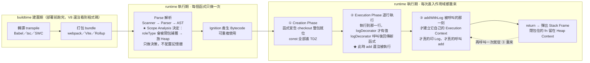

# 高階函式與函數式範式｜取代 OOP 三大設計模式

> 本篇重點 a–k，共 11 個

相關筆記：[[Object.prototype屬性]]、[[useMemo-and-render-optimization]]、[[JS-native-function-check]]
關聯原因：高階函式是 `map`／`filter`／`useMemo` 這類 API 的共同底層機制，理解它才知道 React 的 memoize 與 HOC 為何長那樣。

> [!info] 2026-08-18 新增關聯：[[00-GoF-23種設計模式總覽]]
> 本篇是**特寫**，示範用高階函式取代 Strategy、Decorator、Factory 三個模式的 OOP 寫法；那篇是**母集合**，給出 GoF 23 個模式的全景，並辨異 Proxy／Decorator／Adapter 這三個結構相同但意圖不同的模式。
> 兩篇合看的價值在於：本篇說明「為什麼 JS 不需要那些類別階層」，那篇說明「那些類別階層原本在解什麼問題」。另外那篇釐清了 <mark style="background: #FF5582A6;">HOC 是 Higher-Order Component（高階元件）不是高階函數</mark>，它是 HOF 的特例，對應的是 Decorator 裝飾器模式。

---

## 5W1H 速查：讀本篇之前先把座標定好

> [!important]+ 最常被搞錯的一件事：<mark style="background: #FF5582A6;">呼叫高階函式 ≠ 執行被包進去的那個函式</mark>
> a. `const addWithLog = logDecorator(add)` 這一行跑完，<mark style="background: #FFF3A3A6;">`add` 一次都還沒被執行</mark>，`console.log('開始執行印出 Log...')` 也一次都還沒印。這一行只做了一件事：**生出一個新的函式物件**，並讓它閉包住 `fn`。真正跑起來要等到 `addWithLog(1, 2)` 被呼叫的那一刻。
> b. 順帶把名字釐清：被「高階」修飾的是<mark style="background: #BBFABBA6;">外層那一個</mark>——`map` 是高階函式，<mark style="background: #FF5582A6;">你傳給 `map` 的那個箭頭函式不是</mark>；`logDecorator` 是高階函式，`add` 不是。方向剛好跟直覺相反。
> c. 同一句話也適用 Factory：`createRole('admin')` 執行完，它的 Stack Frame 已經彈出了，但 `roleType` <mark style="background: #FFF3A3A6;">沒有跟著消失</mark>——因為它一開始就被配置在 Heap 上，不在 Stack 上。理由見下面的 **Who** 那一列。

| 5W1H | 問題 | 一句話答案 |
|---|---|---|
| **What** 是什麼 | 高階函式的定義？ | 「<mark style="background: #ADCCFFA6;">接收函式當參數</mark>」或「<mark style="background: #ADCCFFA6;">回傳一個函式</mark>」的那一個函式。只要中一個就算，<mark style="background: #FF5582A6;">被傳進去的那個回呼不算</mark> |
| **When** 什麼時候 | 這些函式各自在哪一刻才有值、才執行？ | a. `function checkout() {}` 是函式**宣告** → <mark style="background: #BBFABBA6;">Creation Phase 就連名帶身體整包就位</mark>；b. `const logDecorator = (fn) => {…}` 是函式**表達式** → <mark style="background: #FFF3A3A6;">Execution Phase 執行到那一行才拿到值</mark>；c. 被裝飾／被生產出來的新函式 → 要等它自己被呼叫，才建立 Execution Context |
| **Who** 誰做的 | 是誰保住了 `roleType` 這個自由變數？ | JS 引擎（V8）。<mark style="background: #ADCCFFA6;">Parse 的 Scope Analysis 在只做一次的那一格就「決定」了</mark>：`roleType` 會被回傳的那個小函式捕獲 → 所以配置到 Heap 的 Context 物件，而不是 Stack Frame。`createRole` return 之後它照樣活著 |
| **Where** 在哪裡 | 這些函式與變數住在哪？ | <mark style="background: #FFF3A3A6;">函式物件一律在 Heap</mark>，變數只是拿著位址。被閉包捕獲的自由變數（`fn`、`roleType`）在 **Heap 的 Context 物件**；沒被捕獲的參數在 **Stack Frame**，`return` 一到就跟著拆掉 |
| **Which** 哪一種 | 三個模式各自靠哪一招？ | Strategy 靠「<mark style="background: #BBFABBA6;">函式當參數</mark>」、Decorator 靠「<mark style="background: #BBFABBA6;">函式當回傳值</mark>」、Factory 靠「<mark style="background: #BBFABBA6;">閉包</mark>」。三招都只是「函式是一等公民」這一條前提的三種用法 |
| **How** 怎麼做到 | 怎麼一眼判斷是不是高階函式？ | 問兩個問題：a. 它的參數裡有沒有函式？b. 它 `return` 出去的是不是函式？<mark style="background: #ADCCFFA6;">其中一個成立就是</mark>。`map`／`filter`／`memoize`／`useMemo`／middleware 全部通過這個測試 |
| **Why** 為什麼 | 為什麼 JS 不太需要那些類別階層？ | 因為 OOP 的那些模式，本來就是在「<mark style="background: #FF5582A6;">函式不能被當值傳遞</mark>」的語言裡，用一整組類別與介面去**模擬**「把一段行為傳進去」。JS 的函式本來就能傳、能回傳、能被閉包記住，所以那層腳手架可以整個拆掉 |

### 時間軸：這件事發生在哪一格

```text
◄──────────── buildtime 建置期 ────────────►◄──────── runtime 執行期 ────────────►
        （你的電腦／CI，部署前就跑完）              （瀏覽器或 Node 載入腳本之後）

 ①轉譯          ②打包            ③Parse          ④Bytecode      ⑤執行期（會重複發生）
 transpile      bundle           解析             產生            ↓↓↓↓↓↓↓↓↓↓
 ┌────────┐   ┌────────┐     ┌───────────┐   ┌──────────┐   ┌────────────────────┐
 │Babel   │   │webpack │     │Scanner    │   │Ignition  │   │ Creation Phase      │
 │tsc     │──►│Vite    │────►│Parser     │──►│把 AST 編成│──►│ ★ 函式宣告 checkout │
 │SWC     │   │Rollup  │     │AST        │   │Bytecode  │   │   連名帶身體整包就位 │
 │        │   │合併壓縮│     │★Scope     │   │          │   │ ★ const 進 TDZ      │
 └────────┘   └────────┘     │ Analysis  │   └──────────┘   ├────────────────────┤
                             │ 決定誰會被 │                  │ Execution Phase     │
                             │ 閉包捕獲   │                  │ ★ 執行到那一行，函式 │
                             │ →Stack還是│                  │   表達式才拿到值     │
                             │   Heap    │                  │ ★ 呼叫時才建立新的   │
                             └───────────┘                  │   Execution Context │
                             每個函式只做一次                 └────────────────────┘
                             只做「決策」，不配置記憶體         呼叫幾次就做幾次

 ★ 注意第 ③ 格那個 Scope Analysis：閉包能不能保住 roleType，是在這裡「決定」的；
   但真正在 RAM 裡挖出那一格 Context，是第 ⑤ 格執行時才做。決策一次，執行每次都要。
```

再把本篇三段程式碼放進同一條軸，看誰在哪一格：

```text
 ── 執行期，時間往右 ──────────────────────────────────────────────────────────►

 ① Creation Phase（還沒執行任何一行）
    ┌──────────────────────────────────────────────────────────────┐
    │ function checkout(amount, payStrategy) {…}                    │
    │   → 函式宣告，連名帶身體整包就位，★ 現在就可以呼叫              │
    │ const payByCreditCard / logDecorator / add / createRole …     │
    │   → 只註冊名字，全部躺在 TDZ，★ 現在碰到就 ReferenceError      │
    └──────────────────────────────────────────────────────────────┘
                                  │
 ② Execution Phase 逐行往下跑     ▼
    ┌──────────────────────────────────────────────────────────────┐
    │ 執行到 const logDecorator = (fn) => {…}                       │
    │   → ★ 這一行才在 Heap 生出函式物件，logDecorator 這時才有值    │
    │                                                              │
    │ 執行到 const addWithLog = logDecorator(add)                   │
    │   → 建立 logDecorator 的 Execution Context，執行它的本體       │
    │   → 它 return 出一個**新的**函式物件，閉包住 fn                │
    │   → ★ 到此為止，add 一次都還沒被執行，Log 一個字都還沒印        │
    │   → logDecorator 的 Stack Frame 彈出，但 fn 留在 Heap Context │
    └──────────────────────────────────────────────────────────────┘
                                  │
 ③ 真正呼叫的那一刻                ▼
    ┌──────────────────────────────────────────────────────────────┐
    │ addWithLog(1, 2)                                             │
    │   → ★ 這時才建立 addWithLog 自己的 Execution Context           │
    │   → 印「開始執行印出 Log…」→ 呼叫 fn（也就是 add）→ 印「執行完畢」│
    │   → return 之後彈出 Stack Frame；閉包住的 fn 依然留在 Heap     │
    │   → 再呼叫一次 addWithLog，從 ③ 整個重來                       │
    └──────────────────────────────────────────────────────────────┘
```



> [!info]- 三個延伸的辨異，一起放在這裡
> a. <mark style="background: #ADCCFFA6;">高階函式不是一種範式</mark>：本篇 (c) 已經說了，它是函數式程式設計（FP）裡最基礎的一項工具，前提是「函式為一等公民」。範式是 FP，工具是 HOF，別把兩個詞當同義詞。
> b. <mark style="background: #FFB8EBA6;">HOC 是 Higher-Order Component（高階元件），不是高階函數</mark>：它是 HOF 的特例，對應的是 Decorator 裝飾器模式，接收一個元件、回傳一個包好的新元件。
> c. <mark style="background: #D2B3FFA6;">閉包不是免費的</mark>：被捕獲的變數住在 Heap，只要那個回傳的小函式還被誰拿著，它就回收不掉。這也是本篇 (j) 說的代價的另一面——`map`／`filter` 每次都生新陣列是 GC 壓力，長命的閉包則是持續佔用。

---

## 重點整理

### 一、高階函式到底「抽離」了什麼

<mark style="background: #ADCCFFA6;">高階函式（Higher-Order Function，HOF）</mark>指的是「<mark style="background: #ADCCFFA6;">接收函式當參數</mark>，或<mark style="background: #ADCCFFA6;">回傳一個函式</mark>」的函式。

(a) <mark style="background: #FFF3A3A6;">它的核心價值是把「底層控制流程」封裝掉</mark>。用傳統 `for` 迴圈時你得自己管索引 `i`、自己定邊界、自己建新陣列再 `push`；換成 `map`／`filter`，這些迭代與儲存細節都被包起來，你只需要交出「每個元素怎麼處理」。

(b) 因此程式碼會從<mark style="background: #ADCCFFA6;">命令式（Imperative，怎麼做）</mark>轉向<mark style="background: #BBFABBA6;">宣告式（Declarative，要做什麼）</mark>，可讀性與可維護性都提升。

(c) <mark style="background: #D2B3FFA6;">高階函式本身不是一個獨立的程式範式</mark>，它是<mark style="background: #ADCCFFA6;">函數式程式設計（Functional Programming, FP）</mark>範式裡最基礎的工具。FP 的前提是函式為「<mark style="background: #ADCCFFA6;">一等公民（First-Class Citizen）</mark>」，也就是函式可以像數值一樣被傳遞與回傳。

| 面向 | 傳統 for 迴圈 | 高階函式 map／filter |
|---|---|---|
| 索引管理 | 自己寫 `i++`、自己顧邊界 | 引擎代管 |
| 結果容器 | 自己 `const out = []` 再 `push` | 自動回傳新陣列 |
| 風格 | 命令式，關注「怎麼做」 | 宣告式，關注「要做什麼」 |
| 重複邏輯 | 每次都要重抄 | 抽成 HOF 一次寫完 |

---

### 二、三大設計模式的高階函式寫法

(d) <mark style="background: #FFF3A3A6;">在支援高階函式的語言裡，很多 OOP 設計模式可以用「函式傳參／函式回傳」取代，不需要建一整組類別與介面。</mark>

#### Strategy 策略模式

把「不同的演算法」各自封裝，讓它們可以隨時互換而不影響呼叫端。

```javascript
// 策略本身就是一個簡單的函式
const payByCreditCard = (amount) => `刷卡付款: ${amount}`;
const payByPaypal     = (amount) => `Paypal 付款: ${amount}`;

// 高階函式接收策略
function checkout(amount, payStrategy) {
  return payStrategy(amount);
}

checkout(100, payByCreditCard); // 隨時切換策略
```

(e) 傳統做法要先定義 `Strategy` 介面，底下再寫 `CreditCardPay`、`PaypalPay` 等實作類別；高階函式版本<mark style="background: #BBFABBA6;">直接把策略函式當參數傳進去就好</mark>。

#### Decorator 裝飾者模式

在不改動原函式結構的前提下，動態疊加額外功能。

```javascript
const logDecorator = (fn) => {
  return (...args) => {
    console.log("開始執行印出 Log...");
    const result = fn(...args);
    console.log("執行完畢！");
    return result;
  };
};

const add = (a, b) => a + b;
const addWithLog = logDecorator(add); // 幫原本的 add 動態裝飾了 Log 功能
```

(f) <mark style="background: #FFF3A3A6;">這就是 React 的 HOC（Higher-Order Component）與後端 Middleware 的同一套骨架</mark>：接收一個東西、回傳一個包了新行為的同型別東西。

#### Factory 工廠模式

由「工廠」根據條件產出對應物件，呼叫者不必知道建立細節。

```javascript
function createRole(roleType) {
  if (roleType === 'admin') {
    return (user) => `${user} 擁有完全存取權限`;
  }
  return (user) => `${user} 僅有讀取權限`;
}

const getAdminPermission = createRole('admin');
getAdminPermission('Alex'); // 生產出來專屬的管理員權限檢查函式
```

(g) 高階函式版本靠的是<mark style="background: #ADCCFFA6;">閉包（Closure）</mark>：`createRole` 執行完了，但回傳的那個小函式仍記得 `roleType`。

| 設計模式 | 傳統 OOP 做法 | 高階函式做法 | 核心機制 |
|---|---|---|---|
| Strategy | 定義介面＋多個實作類別 | 把策略函式當參數傳入 | 函式當參數 |
| Decorator | 建繼承同介面的 Wrapper 類別 | 接收函式、回傳包裝過的新函式 | 函式當回傳值 |
| Factory | Factory 類別內寫 if/else 去 new | 用閉包客製並產出新函式 | 閉包 |

---

### 三、面試可以怎麼說

(h) <mark style="background: #BBFABBA6;">「高階函式讓設計模式輕量化」</mark>：不需要滿滿的類別結構，用「函式即數值」就能達成同樣的彈性與擴充性。

(i) <mark style="background: #FFB8EBA6;">常見的 HOF 例子</mark>：`map`、`filter`、`reduce`、`sort`、`memoize`、React 的 `useMemo`／`useCallback`、Express／Koa 的 middleware。

(j) <mark style="background: #D2B3FFA6;">補充（Gemini 沒講但值得記）</mark>：函數式風格的代價是每次 `map`／`filter` 都產生新陣列，資料量極大時記憶體與 GC 壓力會比原地修改的 `for` 迴圈高；效能敏感的熱路徑仍可能選 `for`。

(k) <mark style="background: #FF5582A6;">別誤會的地方</mark>：「用了 `map` 就是函數式程式設計」是錯的。FP 還要求純函式（Pure Function）與避免副作用，高階函式只是它的入場券。

---

## 各對話來源（原文）

### 高階函式：抽象與函數式範式（2026-08 前後）— https://gemini.google.com/app/46ff8516d0a2c4c3

**使用者：** 高階函式是不是可以不用寫底層的東西？算設計范式嗎？

**Gemini：** 是的，這兩個理解方向都非常精準。高階函式的主要核心價值之一，正是「將底層細節抽離（Abstract Away）」。同時，它也是函數式程式設計（Functional Programming, FP）這套範式中的關鍵核心機制。
1. 高階函式與「隱藏底層細節」——不用重寫底層控制流程：以陣列操作為例，使用傳統 for 迴圈時，你需要手動管理索引值 i、定義邊界條件、手動建立新陣列並將結果 push 進去；而使用高階函式如 map 或 filter 時，底層如何迭代與儲存結果的細節都已被封裝，你只需要專注在傳入「每一個元素該如何被處理」的核心邏輯。提高程式碼可讀性與可維護性：將通用、重複的邏輯（如過濾、映射、記憶化快取 memoize）封裝在高階函式中，能大幅減少重複代碼，讓程式碼更具備宣告式（Declarative）風格——關注「要做什麼」而非「怎麼做」。
2. 高階函式算不算一種設計範式？——屬於函數式程式設計（FP）範式的核心：高階函式本身不是一個獨立的程式範式（Paradigm），而是 Functional Programming 範式中最基礎且強大的工具。在 FP 範式中，函式被視為「一等公民（First-Class Citizen）」，這使得函式可以作為參數傳遞或作為結果回傳。實踐多種設計模式：在傳統物件導向設計模式中，許多模式（如 Strategy 策略模式、Decorator 裝飾者模式、Factory 工廠模式）若在支援高階函式的語言中實作，可以用極為簡潔的高階函式直接替代，而不需建立複雜的類別結構。

**使用者：** Strategy 策略模式、Decorator 裝飾者模式、Factory 工廠模式 這邊是什麼？

**Gemini：** 這三個都是設計模式（Design Patterns），專門用來解決物件導向程式設計（OOP）中經常遇到的架構與彈性問題。在傳統物件導向（如 Java、C++）中，為了實踐這些模式，通常需要定義許多類別（Class）與介面（Interface）；但在支援高階函式的語言中，用簡潔的「函式傳參」或「函式回傳」就能輕鬆達成。
1. Strategy 策略模式——核心概念：將「不同的演算法／邏輯」個別封裝起來，讓它們可以隨時被互相替換，而不影響使用它的主體。傳統做法：定義一個 Strategy 介面，底下寫多個實作類別（例如 CreditCardPay、PaypalPay），再傳入主物件。高階函式寫法：直接將策略函式當作參數傳進去即可。（程式碼見上方「重點整理」）
2. Decorator 裝飾者模式——核心概念：在不改變原本物件或函式結構的前提下，動態地幫它疊加額外的功能（就像穿衣服一樣）。傳統做法：建立一個繼承相同介面的包裝類別（Wrapper），在呼叫原本方法的前後加上新功能。高階函式寫法：使用接收函式並回傳新函式的高階函式（例如常聽到的 HOC 或中間件 Middleware）。
3. Factory 工廠模式——核心概念：建立一個「工廠」，負責根據不同的條件來生產／建立對應的物件，呼叫者不需要知道內部繁瑣的建立細節。傳統做法：寫一個 Factory 類別，裡面寫 if/else 或 switch 來 new 出對應的 Class 實例。高階函式寫法：利用閉包（Closure）或高階函式來「客製化並產出新函式」。
簡單來說，高階函式讓這些設計模式變得更輕量化，不需要建立滿滿的類別結構，直接以「函式即數值」的方式操作就能達成同樣的彈性與擴充性。

---

## 資料來源（含查證時間）

| 主題 | 連結 | 版本／時間 |
|---|---|---|
| 本篇來源對話（Gemini Flash） | https://gemini.google.com/app/46ff8516d0a2c4c3 | 對話擷取於 2026-08-15 |
| MDN｜First-class Function 詞彙表 | https://developer.mozilla.org/en-US/docs/Glossary/First-class_Function | 查證於 2026-08-15 |
| MDN｜Array.prototype.map() | https://developer.mozilla.org/en-US/docs/Web/JavaScript/Reference/Global_Objects/Array/map | 查證於 2026-08-15 |
| React 官方文件｜Higher-Order Components（Legacy 章節） | https://legacy.reactjs.org/docs/higher-order-components.html | 查證於 2026-08-15 |

> ⚠️ 存疑／更正：Gemini 原文把三大模式講得像「高階函式可以完全取代 OOP 設計模式」。實務上兩者是<mark style="background: #FF5582A6;">互補</mark>——當狀態多、生命週期複雜時，類別仍然比一串閉包好維護。這段是我補的，不在原對話中。
