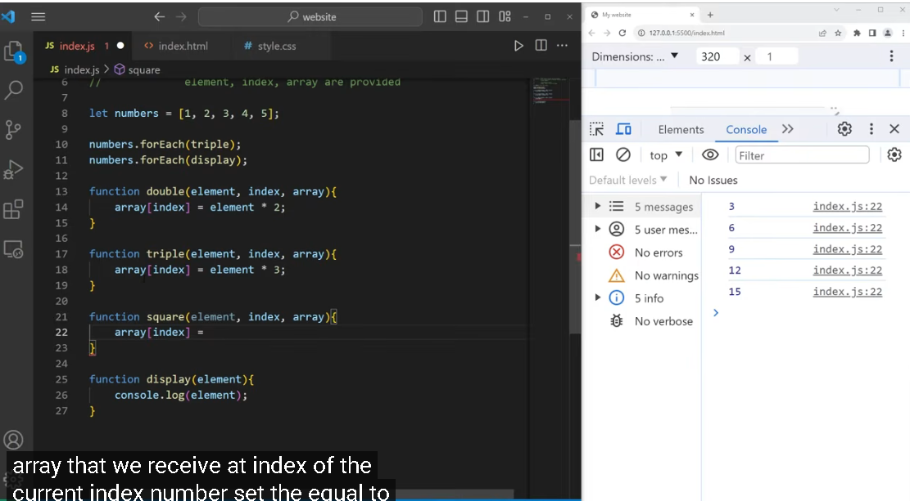

# 陣列遍歷：forEach 與 callback（回呼函式）

> [!important] 🔑 全篇最重點
> `numbers.forEach(display)` 傳的是「**函式本身 `display`**」（不是 `display()`）。
> **forEach 會在內部自動幫你呼叫它 5 次**（陣列幾個元素就呼叫幾次），每次把一個元素當參數傳進去。

> 來源練習：`JavaScript-practicing/while-loop.html`
> 影片：Bro Code — JavaScript forEach() <https://www.youtube.com/watch?v=uOZWH0KEUs4>
> 相關：[[for...in]]（遍歷方法地圖）、[[loops-and-increment-operators]]、[[字串組合-樣板字面值vs加號串接]]

## 一句話

`forEach` 一定要餵一個 **callback（函式）**，它會**自動對陣列每個元素呼叫一次**；要傳「函式本身 `display`」，不是「呼叫它 `display()`」。

## ⚠️ forEach 能用在哪些東西上？（iterable ≠ 有 forEach）

`forEach` **不是萬用的**——它是定義在**特定型別 prototype** 上的方法，只有這些有：

| 有 `.forEach()` | callback 參數 |
|---|---|
| **Array** | `(element, index, array)` |
| **Map** | `(value, key, map)` |
| **Set** | `(value, value, set)`（值出現兩次） |
| **NodeList**（DOM，`querySelectorAll` 回傳） | `(node, index, list)` |
| **TypedArray**（`Int8Array` 等） | `(element, index, array)` |

**「可迭代 iterable」≠「有 forEach」**——這是兩個不同標準：
- 能不能 `for...of` / 展開 `[...]` → 看是不是 **iterable**（有沒有 `Symbol.iterator`）。
- 能不能 `.forEach()` → 看**型別 prototype 有沒有定義 forEach**（上表）。

反例（最關鍵）：
```js
for (const ch of "abc") {}      // ✅ 字串是 iterable
"abc".forEach(...)              // ❌ TypeError！字串「沒有」forEach
```

| | for...of（iterable）？ | 有 .forEach()？ |
|---|---|---|
| Array / Map / Set / NodeList | ✅ | ✅ |
| String 字串 | ✅ | ❌ |
| arguments（類陣列） | ✅ | ❌ |
| plain object `{}` | ❌ | ❌ |

**plain object**：既不可迭代、也沒有 forEach → 要遍歷得先轉陣列或用 for...in：
```js
Object.entries(obj).forEach(([k, v]) => {})   // 先 entries 變陣列再 forEach
for (const k in obj) {}                        // 或 for...in 直接走 key
```

沒有 forEach 的東西想用 → **先轉陣列**：
```js
[..."abc"].forEach(...)              // 字串展開
Array.from(arguments).forEach(...)   // 類陣列轉陣列
```

---

## 基本寫法

```js
let numbers = [4, 5, 9, 10, 11]

numbers.forEach(display)        // 把 display 交給 forEach
function display(element){      // function 宣告會被提升，所以可寫在呼叫後面
  console.log(element)          // 4, 5, 9, 10, 11（每個元素跑一次）
}
```

### forEach 不是「固定三句」！callback 有三種寫法

唯一固定的是 **`陣列.forEach(一個函式)`**；callback 怎麼寫自由：

```js
const numbers = [1, 2, 3];

// A：箭頭函式寫在裡面（最常用，2 行就好）
numbers.forEach(element => console.log(element));

// B：匿名函式寫在裡面
numbers.forEach(function(element){ console.log(element); });

// C：先宣告具名函式，再傳「函式名」（3 句，函式要重複用才划算）
numbers.forEach(display);
function display(element){ console.log(element); }
```

| 部分 | 固定？ |
|---|---|
| `陣列.forEach( 一個函式 )` | ✅ 固定 |
| callback 寫法（A箭頭 / B匿名 / C具名分開） | ❌ 三選一 |
| 參數名（`element`/`n`/`item`）、裡面做什麼 | ❌ 自由 |

→ 實務最常見就是兩行：`numbers.forEach(n => console.log(n))`。

---

## 我練習時的疑問（逐條）

### ① 為何不寫 `numbers.forEach` 就好？
`numbers.forEach` 只是「**指到**這個方法」，沒有執行、也沒告訴它要做什麼 → 什麼都不會發生。
- `numbers.forEach` ＝ 工具放桌上沒用。
- `numbers.forEach(display)` ＝ 使用工具，並告訴它對每個元素做 `display`。
- `console.log(\`${numbers.forEach}\`)` 會印出 `function forEach() { [native code] }`，正好證明它本身只是個函式。

### ② forEach 裡面一定要放東西嗎？
**要。** 一定要放一個 callback 函式，否則：
```js
numbers.forEach()   // ❌ TypeError: undefined is not a function
```

---

## 🔑 核心：傳 `display` ≠ 傳 `display()`

```js
numbers.forEach(display)     // ✅ 傳「函式本身」，forEach 內部幫你呼叫它 5 次
numbers.forEach(display())   // ❌ 先執行 display()（element=undefined），把回傳值丟進去
```
比喻：`display` ＝ 把食譜交給廚師；`display()` ＝ 你自己先煮好把空盤給廚師。

---

## callback 會自動收到 3 個參數

```js
numbers.forEach(function(element, index, array){
  console.log(element, index)   // 元素、索引、整個陣列
})
```
用不到的可省略；要 index 時很方便。

---

## 更常見的寫法：箭頭函式直接寫在裡面

```js
numbers.forEach(element => console.log(element))   // 與另外定義 display 效果相同，更短更常見
```

---

## forEach 的限制

| 限制 | 說明 | 替代 |
|------|------|------|
| **不能 `break`** | 中途停不下來 | `for` / `for...of` |
| **不回傳新陣列** | 回傳 `undefined` | 要邊走邊產生新陣列 → `map` |

---

## 怎麼「測出」forEach 不回傳新陣列？

核心：**把回傳值用變數接住，再 `console.log` 出來**。

```js
let numbers = [4, 5, 9, 10, 11]

// 實驗1：接住 forEach 的回傳值 → undefined
let r1 = numbers.forEach(n => n * 2)
console.log("forEach 回傳:", r1)        // undefined ← 沒有給你新陣列

// 實驗2：對照 map → 真的回傳新陣列
let r2 = numbers.map(n => n * 2)
console.log("map 回傳:", r2)            // [8, 10, 18, 20, 22]
console.log("原陣列:", numbers)         // [4, 5, 9, 10, 11]（沒被改）

// 實驗3：直接判斷是不是陣列
console.log(Array.isArray(numbers.forEach(n => n)))  // false
console.log(Array.isArray(numbers.map(n => n)))      // true
```

| | `forEach(...)` | `map(...)` |
|---|---|---|
| 回傳值 | `undefined` | **新陣列** |
| 原陣列 | 不變 | 不變 |
| 用途 | 每個元素跑一次做事 | 每個轉換後收集成新陣列 |

> 鐵證測法：`let r = numbers.forEach(...)` → `console.log(r)` 看到 `undefined`。

---

## 記憶總表

| 觀念 | 重點 |
|------|------|
| forEach 要什麼 | 一個 callback 函式（必填） |
| 傳什麼 | `display`（函式本身），不是 `display()` |
| 誰來呼叫 callback | forEach 自動對每個元素呼叫一次 |
| callback 參數 | `(element, index, array)` |
| 回傳值 | `undefined`（不回傳新陣列；要新陣列用 `map`） |
| 想中斷 / 想要新陣列 | 用 `for...of` / `map`，不要用 forEach |

---

## TypeError vs SyntaxError（為什麼 `forEach()` 是 TypeError）

| | SyntaxError 語法錯誤 | TypeError 型別錯誤 |
|---|---|---|
| 何時發現 | **解析階段**（還沒執行就擋下） | **執行階段**（跑到才爆） |
| 意思 | 文法看不懂、根本沒法跑 | 文法合法、能跑，但某值的**型別**不能做這操作 |
| 例子 | `New Date()`、少 `)` | `numbers.forEach()` |

`numbers.forEach()` 文法合法 → 通過解析、開始執行 → forEach 內部要呼叫 callback，卻發現是 `undefined`（沒傳）→「undefined 不能當函式呼叫」→ TypeError。
**不是 JS 覺得你「忘了寫」，而是「結構合法、能跑，跑到一半才發現該是函式的東西是 undefined」。**

## 函式提升（hoisting）

```js
numbers.forEach(display)     // line 160：先用
function display(element){}  // line 162：後定義 → 仍可用
```
- `function display(){}` 這種**宣告**會被**提升 hoisting**，所以能先呼叫後定義。
- ⚠️ 但 `const display = () => {}` **不會**提升，定義前使用會報錯。

## 逐句拆解（自我檢查用）

```js
let numbers = [4, 5, 9, 10, 11]   // 宣告數字陣列 numbers
numbers.forEach(display)          // 觸發點：把函式本身 display 交給 forEach
function display(element){         // element 是「參數 parameter」
  console.log(element)
}
```
- 觸發 forEach 的是 `numbers.forEach(display)` 那一行；`display` 本身**不是你某行呼叫的，是 forEach 內部自動呼叫**。
- 5 個元素 → forEach 內部呼叫 display **5 次**，每次把一個元素當 `element` 傳入。✅

---

## callback 的 3 個參數 + 就地改寫原陣列（Bro Code 範例）



```js
let numbers = [1, 2, 3, 4, 5]
numbers.forEach(triple)    // 先把陣列就地 ×3 → [3,6,9,12,15]
numbers.forEach(display)   // 再印出 → 3,6,9,12,15

function double(element, index, array){ array[index] = element * 2 }
function triple(element, index, array){ array[index] = element * 3 }
function square(element, index, array){ array[index] = element * element }
function display(element){ console.log(element) }
```

### Q1：為什麼 callback 可以寫 3 個參數？
forEach **每一圈固定自動送 3 個值**：`(element, index, array)`。
```
你的函式(目前元素, 目前索引, 整個陣列)
         ↓        ↓        ↓
function double(element,  index,   array)
```
- 不是函式特殊，是 forEach 本來就送 3 個 → callback「想接幾個就宣告幾個」（1~3 個都行）。
- **參數靠「位置」對應，不是靠名字**：第1個＝元素、第2個＝索引、第3個＝整個陣列。命名成 `(a,b,c)` 也一樣，`b` 仍是索引。

### Q2：`array[index] = element * 2` 是什麼？
**就地改寫原陣列**。`array`＝第3參數(整個陣列)、`index`＝目前位置 → 把第 index 格覆寫。
- 這就是 console 印 `3,6,9,12,15` 的原因：`forEach(triple)` 把 numbers **原地改成** `[3,6,9,12,15]`。
- forEach 不回傳新陣列，想改值就用 `array[index] = ...` 改原陣列；想「不動原陣列、產生新陣列」用 `map`。

### 補充：`array[index]` 和 `obj[key]` 是同一件事（中括號 = 帶入 key）

陣列其實是「**鍵剛好是數字**」的特殊物件。中括號 `[]` 一律是「**把括號裡的值當 key，去存取屬性**」。

```js
let arr = ["a", "b", "c"]
arr[0]      // "a"
arr["0"]    // "a" ← 證據：用字串也拿得到，陣列 index 骨子裡就是 key
```

| | 括號裡是 key | 動作 |
|---|---|---|
| `Joe[i]`（物件） | `"name"`（字串） | 取值 |
| `arr[index]`（陣列） | `2`（其實是 `"2"`） | 取值 / 設值 |

- 物件 key 是文字、陣列 key 是數字，但 `[]` 做的事**完全相同**。
- `obj[i]`(for...in) 與 `array[index]`(forEach) 都是「括號帶入 key」。
- 區分點：`Joe[i]` 帶入變數 i 的**值**當 key；`Joe.i` 是找名叫 "i" 的屬性。**key 在變數裡、或 key 是數字 → 一定用 `[]`**（`arr.0` 是語法錯誤）。

相關：[[for...in]] 觀察 ②。

### 為什麼 `triple` 回傳 undefined？（副作用 vs 回傳值）

```js
function triple(element, index, array){
  array[index] = element * 3;   // 只改陣列，沒有 return
}
```
- 函式**沒寫 `return` → 自動回傳 `undefined`**。`let r = triple(2,0,[2])` → `r` 是 undefined。
- **但這不是問題**：triple 的工作是「改掉 `array[index]`」這個**副作用 side effect**，不是回傳值。
- **forEach 根本不收 callback 的回傳值**，所以回傳 undefined 完全無妨。陣列變成 `[3,6,9,12,15]` 就證明副作用成功了。

⚠️ 對照：同一個 triple 拿去餵 `map` 會出事——
```js
numbers.map(triple)   // [undefined, undefined, ...] 😱（map 要收回傳值，triple 卻沒 return）
numbers.map(n => n*3) // ✅ map 要「回傳值的版本」
```
→ 核心差別：**forEach 看副作用、不看回傳；map 看回傳值。**

延伸練習（鞏固「forEach 為副作用而生」）：
```js
let sum = 0; numbers.forEach(n => sum += n)          // 累加到外部變數
numbers.forEach((n, index) => console.log(index, n)) // 用 index
```

### 副作用 side effect 的危險 → 為何用 map「消除」

**副作用 = 函式去改動了「自己外面」的東西**（例如 `array[index] = ...` 改到原陣列）。

`console.log(\`triple: ${numbers.forEach(triple)}\`)` 會印 **`triple: undefined`**：forEach 回傳 undefined，不能這樣印結果（triple 是靠副作用改陣列，不回傳）。

⚠️ 副作用會「汙染下游」——實際踩過的災情：
```js
let numbers = [4,5,9,10,11]
numbers.forEach(display)   // 印 4,5,9,10,11（原始）
numbers.forEach(triple)    // triple 把 numbers 就地改成 [12,15,27,30,33]！
numbers.forEach(display)   // 印 12,15,27,30,33 😱 不是原始值了
```
triple 永久改掉 numbers，害後面用到 numbers 的地方全中招，很難察覺。

**map ＝ 無副作用的乾淨版：**
```js
let tripled = numbers.map(n => n * 3)   // 回傳新陣列
console.log(numbers)  // [4,5,9,10,11] 原封不動 ✅
console.log(tripled)  // [12,15,27,30,33] 另一份新的
```

| | `forEach(triple)` 副作用版 | `map(n=>n*3)` 乾淨版 |
|---|---|---|
| 原陣列 | 被改掉 😱 | 不動 ✅ |
| 結果 | undefined | 回傳新陣列 |
| 風險 | 下游全中招 | 安全 |

> 作者教學用意：先用 forEach + `array[index]` 示範「可以改原陣列（副作用）」，再用 map 示範同樣轉換但**不改原陣列**。**能用 map 就別用 forEach 去改原陣列。**

### 「triple 怎麼用才不是 undefined」

undefined 是因為印了 `numbers.forEach(triple)` 的回傳值（forEach 永遠回傳 undefined）。兩種修法：

```js
// 派別 A：維持副作用版（triple 改原陣列）→ 印「陣列本身」，別印 forEach 回傳值
function triple(element, index, array){ array[index] = element * 3 }
numbers.forEach(triple)
console.log(numbers)        // ✅ [12,15,27,30,33]

// 派別 B：乾淨版（triple 改成 return）→ 配 map 接住（推薦）
function triple(element){ return element * 3 }
let tripled = numbers.map(triple)
console.log(tripled)        // ✅ [12,15,27,30,33]
console.log(numbers)        // [4,5,9,10,11] 不變
```
核心：**要嘛印「被改的陣列」(A)，要嘛讓 triple `return` 再用 map 接住 (B)；B 才是消除副作用的正解。**

### Q3：任何函式都能當 callback 嗎？
- **語法上可以**：callback 只是「被當參數傳進去、之後再被呼叫」的函式，任何函式都行。
- **但要參數對得上才正確**：forEach 一律以 `(element, index, array)` 呼叫。經典坑：
  ```js
  ["1","2","3"].map(parseInt)   // 期待 [1,2,3]，結果 [1, NaN, NaN]
  // 因為 parseInt(字串, 進位) 的第2參數被 map 的 index 當成進位制
  ```
- 一句話：**任何函式都能「傳」進去當 callback，但它會被以 `(element, index, array)` 呼叫，參數要對得上才如預期。**

---

## 官方規格總結（forEach 特色）

JavaScript 的 `forEach` 是**陣列專用**的迭代方法，核心特色：語法簡潔、無返回值、無法中斷。它會依序為陣列中的每個**有效元素**執行一次指定的函式。

- **語法簡潔**：無需宣告索引變數或設定迴圈終止條件，可讀性高。
- **無法中斷**：不能用 `break` 提前結束；有提前結束需求改用 `for`、`for...of`，或 `some()` / `every()`。
- **無返回值**：總是返回 `undefined`，無法鏈式調用（chaining）。
- **忽略空槽**：針對「稀疏陣列（Sparse Array）」會自動跳過未賦值的空元素。
- **回呼參數**：callback 可接收三個參數 → 當前元素、當前索引、陣列本身。

> 完整規格見 MDN：Array.prototype.forEach()
> <https://developer.mozilla.org/zh-TW/docs/Web/JavaScript/Reference/Global_Objects/Array/forEach>
