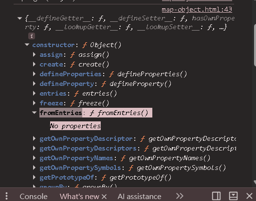

# 在 Console 查看 plain object 的 Object.prototype

> 來源練習：`JavaScript-practicing/`
> 相關：[[for...in]]（原型鏈、可列舉 enumerable）

## plain object 是什麼

用 `{}` 或 `{a:1}`（物件字面值）或 `new Object()` 建的物件。它的原型（prototype）**就是 `Object.prototype`**。

## 怎麼拿出來（Console）

```js
const obj = { name: "Abby" };

Object.getPrototypeOf(obj);     // ✅ 正規做法 → 回傳 Object.prototype
obj.__proto__;                  // 舊寫法，能用但不建議
console.dir(obj);               // 展開 [[Prototype]] 看裡面方法

Object.getPrototypeOf(obj) === Object.prototype;   // true ← 驗證
```

## 會看到什麼

`Object.prototype` 的內建方法（**全都 non-enumerable，所以 for...in 走不到**）：
```
constructor, hasOwnProperty, isPrototypeOf, toString, valueOf, ...
```

## 重點：plain object `{}` 其實「不是空的」


> 影片：builder.io —「Maps more and Objects less」

`const eventsMap = {}` 看起來空空的，但它**早就繼承了一票 `Object.prototype` 的屬性**：
`valueOf`、`toString`、`constructor`、`hasOwnProperty`、`isPrototypeOf`、`propertyIsEnumerable`、`toLocaleString`…

### 為什麼這會出事？（拿 `{}` 當字典/map 的坑）
```js
const map = {};
map["toString"]          // ƒ toString()  ← 你沒設，卻「本來就有」！
if (map["hasOwnProperty"]) { /* 永遠成立，誤判 */ }
"toString" in map        // true ← in 會看繼承屬性
```
你以為 key 不存在，結果撞到繼承來的屬性 → 怪 bug。

### 三種解法
```js
new Map()                       // ✅ 最推薦：Map 天生乾淨，沒有這些繼承屬性
Object.create(null)             // ✅ 建「沒有原型」的純淨物件，連 toString 都沒有
Object.hasOwn(map, "toString")  // ✅ 只認「自有屬性」，繼承的不算（取代 in / hasOwnProperty）
```
→ 影片標題「Maps more and Objects less」的意思：**要當鍵值字典就用 `Map`，別用 plain object。**

## Console 裡的 `ƒ` 符號是什麼？

`ƒ`（斜體小寫 f）是 **Chrome DevTools 用來標示「這是一個函式(function)」** 的圖示，不是 JS 語法。

```
ƒ Object()          ← 一個叫 Object 的函式（Object 建構函式本人）
ƒ toString()        ← 一個叫 toString 的函式（方法）
ƒ ()                ← 匿名 / 箭頭函式
```
- 出現在**任何函式**身上，跟 constructor 無關。`obj.constructor` 顯示 `ƒ Object()`，只是因為 constructor 指向 `Object` 這個函式。
- 看到 `ƒ` → 「這是函式/方法」；沒有 `ƒ`（像 `age: 20`）→ 一般的值（資料）。
- Firefox DevTools 顯示成 `function Object()`，意思相同。

### 展開函式時看到「No properties」？



（上圖：展開 `constructor: ƒ Object()` 看到一排靜態方法 `assign / create / fromEntries…`，點開 `fromEntries` 顯示 `No properties`。）

函式也是物件、**可以**掛屬性，但不代表**一定有**。展開像 `Object.fromEntries` 這種內建方法看到 `No properties`，代表它身上沒掛任何自己的（可列舉）屬性——它只是「一個會做事的函式」。
- 對照：展開 `Object`（建構函式）會看到一堆 `assign / keys / create / fromEntries…`，那些是掛在 Object 身上的**靜態方法（屬性）**；但 `fromEntries` 自己身上就沒再掛東西。
- 比喻：`Object` 是工具箱（裝很多工具）；`fromEntries` 是其中一支工具，裡面沒再裝更小的工具。
- 註：函式的 `name`、`length` 是 non-enumerable，所以不列在這裡（呼應 enumerable 觀念）。

## 原型鏈（plain object 很短）

```js
obj → Object.prototype → null
Object.getPrototypeOf(Object.prototype);   // null ← 鏈的盡頭
```

### ⚠️ 「null」是 Object.prototype 的爸爸，不是它本人！

```
obj  →  Object.prototype  →  null
              ↑                 ↑
   本人是裝了 ~14 個方法的物件   它上面沒有更高的祖先了 → 原型 = null
```
- `Object.getPrototypeOf(Object.prototype) === null` 意思是「**Object.prototype 的上一層是 null**」（到頂了）。
- **不是**說 Object.prototype 是 null。它本人很豐富：`constructor, hasOwnProperty, isPrototypeOf, propertyIsEnumerable, toLocaleString, toString, valueOf, __defineGetter__/__defineSetter__/__lookupGetter__/__lookupSetter__, __proto__(get/set)`…全是 **non-enumerable**。

### `propertyIsEnumerable` 不是「我可枚舉」，是「檢查器」

它是個**方法名**，用來問「某屬性可不可枚舉」，方法本身也是 non-enumerable：
```js
obj.propertyIsEnumerable("name")      // true
obj.propertyIsEnumerable("toString")  // false
```
**方法的名字 ≠ 方法的行為。**

## enumerable（可列舉）vs iterable（可迭代）——完全不同

| | enumerable | iterable |
|---|---|---|
| 是什麼 | **屬性**身上的旗標 | **整個物件**有沒有 `Symbol.iterator` |
| 控制 | 屬性出不出現在 `for...in` / `Object.keys` | 物件能不能 `for...of` / 展開 `...` |
| 層級 | 屬性層級 | 物件層級 |

```js
for (const k in obj) {}      // enumerable：走得到 name，走不到 toString
for (const x of obj) {}      // ❌ plain object not iterable（沒有 Symbol.iterator）
for (const x of [1,2,3]) {}  // ✅ 陣列是 iterable
```
口訣：**enumerable 管「屬性露不露臉」；iterable 管「整包能不能 for...of」。**

## `__proto__` 的 getter/setter 就是 `obj.__proto__` 的幕後機關

`__proto__` 不是普通資料屬性，而是 Object.prototype 上的一對**存取器(accessor)**：
```js
obj.__proto__         // 觸發 get __proto__ → 等於 Object.getPrototypeOf(obj)
obj.__proto__ = xxx   // 觸發 set __proto__ → 等於 Object.setPrototypeOf(obj, xxx)
```
- 因為定義在 Object.prototype 上，所有 plain object 都繼承得到，所以哪個物件都能 `obj.__proto__`。
- ⚠️ `__proto__` 是**已廢棄**寫法，正式用 `Object.getPrototypeOf()` / `Object.setPrototypeOf()`。

## ⚠️ 易錯點

- 取「物件的原型」用 **`Object.getPrototypeOf(obj)`**，不是 `obj.prototype`。
- `obj.prototype` 在 plain object 上是 `undefined`——`prototype` 是**函式**才有的屬性（用來當「用 new 建出來的實例」的原型）。
- 直接在 Console 打 `Object.prototype` 也能看它本人。
