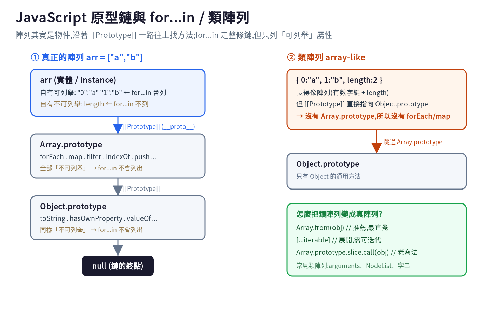

# 別再用 for...in 跑陣列了:從原型鏈看懂 for...in 與 Object.keys 的差別

> JavaScript 初學者最容易踩的雷之一,就是用 `for...in` 去跑陣列。這篇用一張原型鏈圖,講清楚 `for...in` 到底走了什麼、為什麼會出包,以及什麼時候該改用 `Object.keys()`。

## 先看一個會讓你 debug 半天的例子

```js
Array.prototype.shuffle = function () { /* 某個你引入的套件加的 */ };

const scores = [90, 85, 70];
for (const i in scores) {
  console.log(i);
}
// 預期:0 1 2
// 實際:0 1 2 shuffle  ← 多了一個!
```

只要有任何函式庫往 `Array.prototype` 加東西,你的 `for...in` 就會多跑出來。要理解為什麼,得先看 JavaScript 的**原型鏈(prototype chain)**。

## 一張圖看懂原型鏈與 for...in



陣列其實是物件。當你存取 `arr.forEach` 時,JS 在 `arr` 自己身上找不到,就沿著 `[[Prototype]]` 往上找:

`arr` → `Array.prototype`(forEach、map…) → `Object.prototype`(toString…) → `null`

`for...in` 的設計就是「**走完整條原型鏈,列出所有可列舉(enumerable)的鍵**」。

關鍵在 **enumerable(可列舉)** 這個屬性旗標:
- 內建方法(`forEach`、`toString`…)被設成**不可列舉**,所以 `for...in` 看不到它們——這就是為什麼平常你不會看到一堆內建方法跑出來。
- 但你(或套件)用 `Array.prototype.xxx = ...` 加的屬性**預設是可列舉的**,於是就被 `for...in` 一起列出來了。

你可以在瀏覽器 F12 的 Console 自己驗證:

```js
Object.getOwnPropertyDescriptor(Array.prototype, "forEach").enumerable; // false
Object.keys([10, 20]);                 // ["0", "1"]          只列可列舉自有屬性
Object.getOwnPropertyNames([10, 20]);  // ["0", "1", "length"] 連不可列舉也列
```

## 還有一個雷:順序不保證

ECMAScript 規格**不保證** `for...in` 的遍歷順序。現代引擎實務上會把整數鍵照數字升冪走,但這不是規格承諾,你不該依賴它。對需要嚴格 0→1→2 順序的陣列來說,這是另一個不該用 `for...in` 的理由。

## 那要用什麼?

跑**陣列**用 `for...of`、`forEach`,或傳統 `for`:

```js
const scores = [90, 85, 70];
for (const s of scores) { /* 走「值」,保證順序 */ }
scores.forEach((s, i) => { /* 走「值 + 索引」 */ });
```

跑**物件**用 `Object.keys()`(或 `values` / `entries`):

```js
const user = { name: "Abby", age: 30 };
for (const key of Object.keys(user)) {
  console.log(key, user[key]);
}
```

`Object.keys()` 和 `for...in` 最大的不同:它**只回傳物件「自己的」可列舉屬性**,不會往原型鏈上爬,所以不會有「多跑出繼承屬性」的問題;而且它回傳一個**真正的陣列**,順序規則明確又穩定。

## for...in vs Object.keys 對照表

| | `for...in` | `Object.keys(obj)` |
|---|---|---|
| 回傳值 | 無(直接迴圈) | 鍵組成的**新陣列** |
| 含繼承屬性 | ✅ 會(走原型鏈) | ❌ 只自有 |
| 含不可列舉 | ❌ 不含 | ❌ 不含 |
| 順序 | 不保證 | 明確且穩定 |
| 建議用途 | 幾乎別用,尤其別跑陣列 | 安全遍歷物件自有屬性 |

## 一句話帶走

`for...in` 走的是「整條原型鏈上的可列舉鍵」,容易把繼承來的屬性也跑進去、順序又不保證;**陣列用 `for...of` / `forEach`,物件用 `Object.keys()`**,就能避開絕大多數雷。

---

*延伸:`arguments`、`NodeList` 這類「類陣列(array-like)」沒有 `Array.prototype`,所以沒有 `map`,要先用 `Array.from()` 轉成真陣列——這也是同一條原型鏈觀念的延伸。*
