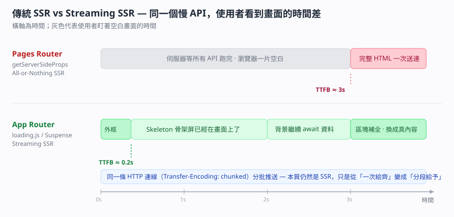

# App Router 與 Pages Router — RSC、Streaming SSR、loading.js 與 error.js 的檔案約定

> [!info]- 🔗 與既有筆記的關聯
> (1) [[SSR-renderToString與Hydration-伺服器端渲染流程]] 講的是「一次性把整棵樹轉成 HTML 字串再 hydrate」，那正好就是本篇說的 Pages Router 式 SSR。本篇是它的下一集：Streaming SSR 怎麼把那個「一次性」拆成「分批」。
> (2) [[react-server-component-slug-動態路由參數]] 已經記過 RSC 在動態路由上的寫法，本篇補的是 RSC 在「路由架構層」為什麼會長成資料夾樹、以及它跟 layout 狀態保留的因果關係。
> (3) [[FCP首次內容繪製-SEO爬蟲與打包五步驟]] 講 FCP 與爬蟲，本篇第五節的 SEO 段落是那篇在框架選型上的延伸：Streaming 改善的是 TTFB 與 FCP，不是 SEO 本身。
> (4) [[動態路由與應用進入點-Nextjs的slug-VueRouter冒號-Express的appget]] 記的是三個框架的路由語法對照，本篇補 Next.js 兩套路由「架構層級」的差異。

> 本篇重點 a–u，共 21 個。



## 重點整理

### 一、兩套路由的表層差異（a–e）

(a) <mark style="background: #ADCCFFA6;">Pages Router 是「檔名即路由」</mark>，`pages/about.js` 自動對應 `/about`。<mark style="background: #ADCCFFA6;">App Router 是「資料夾即路由」</mark>，資料夾名稱是路徑，頁面本身<mark style="background: #FF5582A6;">一定要叫 `page.js` / `page.tsx`</mark>，不能沿用舊習慣隨便命名。

(b) <mark style="background: #FFF3A3A6;">元件預設身分不同</mark>：App Router 的元件<mark style="background: #ADCCFFA6;">預設是 React Server Component（RSC，伺服器元件）</mark>，要用 Hook 或事件處理才加 `'use client'`；Pages Router 所有元件<mark style="background: #ADCCFFA6;">預設都是 Client Component（客戶端元件）</mark>。

(c) 資料取得的入口不同。

| 項目 | Pages Router | App Router |
| --- | --- | --- |
| 取資料方式 | `getServerSideProps` / `getStaticProps` / `getInitialProps` | 在 Async Server Component 裡直接 `await fetch()` 或直接打 DB |
| 這段程式在哪執行 | 伺服器（頁面級別） | 伺服器（元件級別） |
| 需不需要學框架專屬 API | 要 | 不用，寫 Web 標準的 `fetch` |
| 共用佈局 | `_app.js` 或社群的 `getLayout` 變通寫法 | 原生 `layout.js`，可多層巢狀 |
| 載入中的 UI | 自己寫 loading state | 放一個 `loading.js` 就好 |
| 錯誤邊界 | 自己接 Error Boundary | 放一個 `error.js` 就好 |

(d) <mark style="background: #BBFABBA6;">`layout.js` 可以有很多個而且應該有很多個</mark>。`app/layout.js` 是<mark style="background: #ADCCFFA6;">根佈局（Root Layout）</mark>，<mark style="background: #FF5582A6;">裡面必須包含 `<html>` 與 `<body>`</mark>；`app/(rsc)/rsc/layout.js` 是<mark style="background: #ADCCFFA6;">巢狀佈局（Nested Layout）</mark>，只作用在那個子樹。造訪 `/rsc` 時渲染結構會自動疊成 Root Layout ➔ Sub Layout ➔ Page。

(e) <mark style="background: #ADCCFFA6;">括號資料夾 `(rsc)` 叫路由分組（Route Group）</mark>，<mark style="background: #FFF3A3A6;">名稱不會出現在 URL</mark>，所以造訪 `/rsc` 不會變成 `/rsc/rsc`。它純粹是拿來「分組套用不同 layout」用的。

### 二、底層機制：兩者到底差在哪（f–j）

(f) <mark style="background: #FFF3A3A6;">Pages Router 的底層是「整棵樹轉字串 + 一包 JSON」</mark>。伺服器跑完 `getServerSideProps`，把整頁 React 樹渲染成完整 HTML 字串，再附一份 <mark style="background: #ADCCFFA6;">`__NEXT_DATA__`</mark>（頁面初始狀態的 JSON）。瀏覽器收到後做<mark style="background: #ADCCFFA6;">水合（Hydration）</mark>。

(g) <mark style="background: #FFF3A3A6;">App Router 的底層是 RSC Payload（又稱 React Flight 流）</mark>——Server Component 在伺服器上執行後，<mark style="background: #BBFABBA6;">不送 JavaScript 程式碼到瀏覽器</mark>，而是把元件樹轉成一種類 JSON 的串流格式送過去。

(h) <mark style="background: #BBFABBA6;">水合成本因此變成「細粒度」的</mark>：只有標了 `'use client'` 的元件才會產生前端 bundle 並被 hydrate，Server Component 在前端只負責畫 DOM，不佔水合時間也不佔前端記憶體。

(i) <mark style="background: #FFF3A3A6;">「切頁面時 layout 狀態會不會被清掉」的答案就藏在路由樹裡</mark>。App Router 因為路由是資料夾樹，Router 知道 layout 沒變、只有 page 變，所以<mark style="background: #BBFABBA6;">只傳變動的 page 子樹 RSC Payload</mark>，layout 裡的輸入框內容、捲動位置、側邊欄展開狀態都留著。

(j) <mark style="background: #FF5582A6;">Pages Router 切頁面預設是整個視圖區清空重繪</mark>：舊頁面元件整個 Unmount、新頁面整個 Mount，連 Header 與 Sidebar 都會被銷毀重建。要避免只能在 `_app.js` 手寫 `Page.getLayout = ...`，<mark style="background: #FF5582A6;">那是社群變通方案（Workaround），不是框架原生機制</mark>。所以「Pages Router 不支援 layout」＝「缺乏原生（first-class）的巢狀 layout 支援」，<mark style="background: #BBFABBA6;">兩句話語意上是相等的</mark>。

### 三、為什麼「新一代」還在用原生 fetch（k–m）

(k) 這是 Abby 當下最直覺的疑問：都出新的 Router 了怎麼還用舊的 `fetch`？<mark style="background: #FFF3A3A6;">關鍵是那個 `fetch` 已經被 Next.js 在伺服器端「改造」過了（Monkey-patching／擴充）</mark>。

(l) <mark style="background: #ADCCFFA6;">Next.js 幫原生 `fetch` 加上 `next` 與 `cache` 設定</mark>，例如 `fetch(url, { next: { revalidate: 3600 } })`，底層就會自動處理快取、<mark style="background: #ADCCFFA6;">自動去重（Deduplication）</mark>與<mark style="background: #ADCCFFA6;">按需更新（On-demand Revalidation）</mark>。

(m) <mark style="background: #BBFABBA6;">設計動機是「統一心智模型」</mark>：以前要背 Next.js 專屬的 `getStaticProps` / `getServerSideProps`，現在不論 Server 還是 Client 都寫同一套 Web 標準 API，框架能力藏在底層。<mark style="background: #D2B3FFA6;">換句話說，「用原生 API」在這裡是刻意的設計選擇，不是偷懶。</mark>

### 四、Streaming、Suspense、loading.js 與 error.js（n–r）

(n) <mark style="background: #BBFABBA6;">SSR 在 Pages Router 一直都支援</mark>，只要匯出 `getServerSideProps` 就是 SSR。

```js
// pages/example.js
export async function getServerSideProps(context) {
  const res = await fetch('https://api.example.com/data');
  const data = await res.json();
  return { props: { data } };
}
```

(o) 兩種 SSR 的差別在「顆粒度」與「要不要等齊」。

| 面向 | Pages Router 的 SSR | App Router 的 SSR |
| --- | --- | --- |
| 顆粒度 | 頁面級別（Page-level） | 元件級別（Component-level） |
| 回應方式 | 阻塞式，全部備好才回第一個位元組 | 串流，分批推送 |
| 俗稱 | All-or-Nothing SSR | Streaming SSR |
| TTFB | 被最慢的那支 API 拖住 | 幾乎立刻回應 |
| 靠什麼實現 | 無 | HTTP `Transfer-Encoding: chunked` |

(p) <mark style="background: #FFF3A3A6;">Streaming 的本質仍然是 SSR</mark>，資料抓取與渲染都還在伺服器端，只是<mark style="background: #BBFABBA6;">從「一次性給齊」變成「分段漸進式給予」</mark>。<mark style="background: #FF5582A6;">不要把 Streaming 誤會成 CSR 或某種新的渲染模式。</mark>

(q) <mark style="background: #FF5582A6;">三種行為（即時回應 Instant Loading UI、流式 HTML 傳輸、區塊補全 Out-of-order Streaming）完全仰賴 React 18+ 的 `<Suspense>`</mark>。觸發方式有兩種，本質是同一件事：

```tsx
// ① 顯式：自己包 Suspense
<Suspense fallback={<p>資料載入中...</p>}>
  <SlowComponent />
</Suspense>

// ② 隱式：資料夾下放一個 loading.js，Next.js 底層自動包成
<Layout>
  <Suspense fallback={<Loading />}>
    <Page />
  </Suspense>
</Layout>
```

(r) <mark style="background: #FF5582A6;">沒有 `<Suspense>` 也沒有 `loading.js` 時，會退回傳統 SSR 行為</mark>：伺服器停下來等 `await` 跑完才送出完整 HTML，骨架屏與區塊補全都不會發生。至於 <mark style="background: #ADCCFFA6;">`error.js` 走的是 React 的 Error Boundary（錯誤邊界）</mark>，只在出錯的那一層顯示 fallback UI，<mark style="background: #BBFABBA6;">Header、Sidebar、Parent Layout 照常運作不會整頁白屏</mark>，而且會自動提供 `reset()` 讓使用者重試。

### 五、SEO 與 src/ 目錄（s–u）

(s) <mark style="background: #FF5582A6;">「SEO 要好就一定要用 App Router」是錯的說法</mark>。<mark style="background: #BBFABBA6;">兩者都能做到頂級 SEO</mark>，只要頁面有輸出完整 HTML（SSG 或 SSR）。App Router 的優勢是<mark style="background: #FFF3A3A6;">比較容易達到極致</mark>——RSC 讓 bundle 更小（Core Web Vitals 的 LCP／INP 較好看）、Streaming 讓 TTFB 與 FCP 更快、Metadata API 更完整。

(t) App Router 在 SEO 上真正「省事」的地方是<mark style="background: #ADCCFFA6;">檔案約定（File Conventions）</mark>：`sitemap.ts`、`robots.ts`、`opengraph-image.tsx` 直接放在 `app/` 下就會自動生成；Pages Router 這些通常要寫死在 `public/` 或手刻 API Route。Metadata 方面 App Router 用 `generateMetadata` 函式（支援型別檢查與 Layout／Page 疊加合併），Pages Router 用 `next/head` 的 `<Head>`，<mark style="background: #FF5582A6;">巢狀頁面容易出現重複標籤或渲染順序問題</mark>。

(u) <mark style="background: #D2B3FFA6;">有沒有 `src/` 資料夾對功能與效能完全沒有影響</mark>，Next.js 會自動識別。差別只是專案組織：`src/` 把原始碼與根目錄的設定檔（`package.json`、`next.config.js`、`tsconfig.json`、`.env`）隔開，大型專案較好維護。<mark style="background: #FF5582A6;">但 `public/` 永遠必須在最外層根目錄，不能搬進 `src/`。</mark>

## ⚠️ 存疑／需要留意

| 項目 | 對話中的說法 | 需要留意的地方 |
| --- | --- | --- |
| React 版本 | 「App Router 完整整合 React 19 / Canary 的最新特性」 | 實際支援的 React 版本綁定於你安裝的 Next.js 版本，升級前請以該版 release note 為準，不要照抄這句話 |
| Server Actions | 被列為 App Router 專屬 | 概念正確，但功能穩定度隨版本變動，實作前查當版文件 |

## 各對話來源（原文摘要）

### Next.js App Router 與 Pages Router 差異比較（2026-09-05）— https://gemini.google.com/app/9495dffc9a8507ba

依序問了六輪：(1) 兩者差異總覽 →(2)「這很表象，底層怎麼做的」＋「為什麼還用原生 fetch」＋「SSR 也能用在 Pages Router 嗎」＋「loading.js 預設 Streaming 是什麼意思」→(3)「Streaming 代表是 SSR 嗎」「一定要包在 Suspense 內嗎」→(4)「app 跟 app/(rsc)/rsc 都有 layout.js 正常嗎」「_app.js 跟前後端分離的關係」「無支援＝缺乏原生巢狀 layout 嗎」「為何切頁重渲染較頻繁」→(5) 專案要不要用 `src/` 資料夾 →(6)「SEO 要好是要用 App Router 嗎」。原文已整併進上方重點整理，不再重複貼一次。

## 資料來源（含查證時間）

| 主題 | 連結 | 版本／查證時間 |
| --- | --- | --- |
| 本篇 Gemini 對話 | https://gemini.google.com/app/9495dffc9a8507ba | Gemini Flash，2026-09-05 |
| Next.js — App Router 官方文件 | https://nextjs.org/docs/app | Next.js 現行文件，2026-09-05 查證 |
| Next.js — loading.js 檔案約定 | https://nextjs.org/docs/app/api-reference/file-conventions/loading | Next.js 現行文件，2026-09-05 查證 |
| Next.js — error.js 檔案約定 | https://nextjs.org/docs/app/api-reference/file-conventions/error | Next.js 現行文件，2026-09-05 查證 |
| Next.js — Route Groups | https://nextjs.org/docs/app/building-your-application/routing/route-groups | Next.js 現行文件，2026-09-05 查證 |
| React — `<Suspense>` | https://react.dev/reference/react/Suspense | React 現行文件，2026-09-05 查證 |
| MDN — Transfer-Encoding | https://developer.mozilla.org/en-US/docs/Web/HTTP/Headers/Transfer-Encoding | MDN，2026-09-05 查證 |

## 練習題（LeetCode／NeetCode 對照）

本篇屬於框架架構題，LeetCode 與 NeetCode 沒有對應題型。想練「串流分批輸出」的心智模型，可以看 <mark style="background: #D2B3FFA6;">LeetCode 1188. Design Bounded Blocking Queue</mark>（https://leetcode.com/problems/design-bounded-blocking-queue/ ，需 Premium）——生產者一段一段丟、消費者一段一段拿，跟 chunked streaming 的節奏是同一個直覺。

## 關聯筆記

| 筆記 | 關聯原因 |
| --- | --- |
| SSR-renderToString與Hydration-伺服器端渲染流程 | 那篇是本篇說的「All-or-Nothing SSR」的完整流程 |
| react-server-component-slug-動態路由參數 | RSC 在動態路由上的實際寫法 |
| FCP首次內容繪製-SEO爬蟲與打包五步驟 | Streaming 改善的 TTFB 與 FCP 在那篇有量化說明 |
| 動態路由與應用進入點-Nextjs的slug-VueRouter冒號-Express的appget | 三框架路由語法對照 |
| nextjs-login模組層層import-耦合度怎麼判斷 | 同一個 Next.js 專案的模組組織問題 |

---

由 Gemini 對話自動整理 · 更新於 2026-09-05
