```mermaid
flowchart LR
    subgraph BT["buildtime 建置期"]
        A["JSX 原始碼<br/>箭頭函式只是文字"] --> B["轉譯＋打包<br/>Babel／SWC ＋ bundler"]
    end
    subgraph R1["runtime · render 階段（純函式，不碰 DOM）"]
        C["React 呼叫 Counter()<br/>★ 建立 setup 函式物件<br/>★ 建立 cleanup 函式物件<br/>兩者都還沒被執行"]
    end
    subgraph R2["runtime · commit 階段（React 真的動手）"]
        D["執行 setup<br/>setInterval 開始跑<br/>id 被閉包捕獲，配置在 Heap"]
        E["把回傳的 cleanup<br/>存進 effect 的 inst.destroy"]
        F["時機到了才呼叫 cleanup<br/>★ clearInterval&#40;id&#41; 這時才真的執行"]
    end
    B --> C --> D --> E
    E -.->|"卸載前／依賴變動前／StrictMode 檢查"| F
    F -.->|"若是依賴變動，接著跑新的 setup"| D
```

# useEffect 的 setup 與清理函式：`return` 的是一個函式，不是執行結果

> [!info]- 📍 承接 01，銜接 useState 底層
> <mark style="background: #ADCCFFA6;">承接</mark>：[[01-React-純函數與嚴格模式-StrictMode]] 講到 StrictMode 會把元件與 effect 多跑一輪，本篇解釋那一輪到底在檢查什麼——檢查的就是你的清理函式有沒有寫對。
> <mark style="background: #BBFABBA6;">下一步</mark>：本篇的「值為什麼能跨 render 活下來」在 [[useState底層-Fiber-Tree-memoizedState與過期閉包]] 有完整的 Fiber 結構圖。

> 起點：一段最經典的 `setInterval` 計時器程式碼，以及一個口述時很容易講錯的地方——「`return () => clearInterval(id)` 是不是當場執行了 `clearInterval`？」答案是**沒有**，而搞懂為什麼沒有，剛好把 Execution Context、閉包、Heap 配置、React fiber 四件事一次串起來。

---

## 5W1H 速查：讀本篇之前先把座標定好

> [!important]+ 最常被搞錯的一件事先講
> <mark style="background: #FF5582A6;">`return () => clearInterval(id)` 這一行執行時，`clearInterval` 一次都沒有被呼叫</mark>。它只是**建立**了一個函式物件並交還給 React。`clearInterval(id)` 要等到 React 決定該清理時、真的去呼叫那個函式，才會被執行。差一個箭頭（`return clearInterval(id)`）行為就完全相反——那才是當場執行。

| 5W1H | 問題 | 一句話答案 |
|---|---|---|
| **What** 是什麼 | 清理函式是什麼？ | `useEffect` 的第一個參數（setup function）可以選擇性回傳一個「不收參數、不回傳值」的函式，React 官方稱它 cleanup function |
| **When** 什麼時候 | 它什麼時候被執行？ | <mark style="background: #FF5582A6;">不是在 `return` 那一行</mark>。是在三個時機由 React 呼叫：元件卸載前、每次重跑 setup 之前、以及 StrictMode 開發模式掛載後多跑的那一輪 |
| **Who** 誰做的 | 誰呼叫它？ | React 的 commit 階段。不是你、不是 JS 引擎、不是瀏覽器 |
| **Where** 在哪裡 | 它被存在哪？ | 存在該 effect 物件的 `inst.destroy` 欄位上，而那個 effect 掛在 fiber 節點（Heap）上 |
| **Which** 哪一種 | 哪些東西需要清理？ | 會「持續存在」的東西：計時器、事件監聽器、WebSocket／SSE 連線、訂閱、`AbortController`、第三方套件的實例 |
| **How** 怎麼做到 | 它怎麼記得當初那個 `id`？ | 靠**閉包**。`id` 被內層箭頭函式引用，引擎把它從 Stack 搬到 Heap 上的 Context 物件，setup 函式 `return` 之後它依然活著 |
| **Why** 為什麼 | 為什麼一定要寫？ | 因為 effect 建立的東西不會隨元件消失而自動消失，不清理就是記憶體洩漏；而且依賴變動時新舊 effect 會疊加 |

### 時間軸：這件事發生在哪一格

```text
◄────── buildtime 建置期 ──────►◄──────────────── runtime 執行期 ────────────────►
   （轉譯 transpile ＋ 打包 bundle）          （瀏覽器載入腳本之後）

  ①Babel／SWC        ②bundler       ③Parse       ④Bytecode    ⑤每次 render 都重來
  把 JSX 轉標準 JS    合併壓縮        AST         Ignition      ↓↓↓↓↓↓↓↓↓↓↓↓↓
  ┌──────────┐    ┌──────────┐   ┌────────┐   ┌────────┐   ┌────────────────────┐
  │ 你的箭頭  │    │ 打包進    │   │只做一次 │   │可重複  │   │ React 呼叫 Counter()│
  │ 函式只是  │───►│ bundle   │──►│Scope   │──►│使用    │──►│ ★ 建立閉包函式物件   │
  │ 一段文字  │    │          │   │Analysis│   │        │   │ ★ 但還沒執行它       │
  └──────────┘    └──────────┘   └────────┘   └────────┘   └──────────┬─────────┘
                                                                       │
   ★ 清理函式「被建立」在第 ⑤ 格                                        │
   ★ 清理函式「被執行」在更後面：React 的 commit 階段，見下面第二條軸    ▼
```

第二條時間軸放大第 ⑤ 格之後，畫 setup 與 cleanup 的配對關係：

```text
t0  首次 render        React 呼叫 Counter()，建立 setup 函式物件（還沒跑）
t1  commit 後          React 執行 setup ①  → setInterval 開始跑，id 被閉包抓住
                                            ↑ 回傳的 cleanup ① 被存進 inst.destroy
t2  依賴變了／要卸載    React 先執行 cleanup ①  → 這時 clearInterval(id) 才真的跑
t3  若是依賴變動        React 接著執行 setup ②  → 新的計時器、新的 id、新的 cleanup ②
t4  元件卸載            React 執行 cleanup ②  → 收尾
    ────────────────────────────────────────────────────────────────
    規律：setup ① → cleanup ① → setup ② → cleanup ② …
    永遠成對且交錯，不會有兩個 setup 同時活著

    StrictMode（僅開發模式）在 t1 之後會多插一輪：
    setup ① → cleanup ① → setup ①' ，故意檢查你的 cleanup 有沒有寫對
```



---

## (a) 先看那一段一定會壞的程式碼

```jsx
import { useState, useEffect } from 'react'

function Counter() {
  const [count, setCount] = useState(0)

  useEffect(() => {
    const id = setInterval(() => {
      console.log(count)      // 永遠印出 0
      setCount(count + 1)     // 永遠是 0 + 1
    }, 1000)
    return () => clearInterval(id)
  }, [])                      // 依賴陣列是空的

  return <h1>{count}</h1>
}
```

整段翻成中文：

「我做一個叫 `Counter` 的函式元件。用 `useState` 宣告一個叫 `count` 的狀態，初始值 0。接著用 `useEffect` 掛一個副作用，第二個參數是空陣列 `[]`，代表『只在元件掛載後執行一次』。這個副作用裡開了一個每秒觸發一次的 `setInterval`，回傳的計時器編號存進 `id`。每次觸發就印出 `count`、然後把 `count` 加一。最後我 `return` 一個函式給 React 當清理函式。畫面上顯示 `count`。」

實際跑起來：<mark style="background: #FF5582A6;">畫面停在 1，主控台每秒印出一個 0，永遠不會變</mark>。這叫 **stale closure（過期閉包）**，成因見 (e) 與 [[useState底層-Fiber-Tree-memoizedState與過期閉包]]。

---

## (b) 口述時最容易講錯的四個點

這是我實際講給人聽時被抓到的錯誤，逐條校正：

| 常見說法 | 判定 | 校正 |
|---|---|---|
| 「`return` 是終止當前函式」 | <mark style="background: #BBFABBA6;">對</mark> | 執行到 `return` 就不再往下跑 |
| 「`return` 是**丟出**一個值」 | <mark style="background: #FFF3A3A6;">用詞要改</mark> | JS 裡「丟出／拋出」專指 `throw`（丟例外）。`return` 要說**回傳／交還**。面試講「丟出」會被聽成 `throw` |
| 「後面接一個無名函式」 | <mark style="background: #BBFABBA6;">對</mark> | 精確講是**箭頭函式表達式**，而且它真的沒有名字（`fn.name` 是空字串，因為沒有賦值給變數所以拿不到推導名稱） |
| 「**並且執行** `clearInterval`」 | <mark style="background: #FF5582A6;">錯，而且是關鍵的那個錯</mark> | 這一行只建立函式，**沒有執行任何東西**。見 (c) |

---

## (c) 判斷「有沒有被執行」：看括號長在哪裡

```js
return () => clearInterval(id)
//     └┬┘    └─────┬──────┘
//      │           └── 這個括號在「箭頭函式的本體裡」，屬於未來才會跑的程式碼
//      └── 這個括號是「參數列表」，代表這個箭頭函式不收任何參數
```

判斷某個函式有沒有被執行，看的是<mark style="background: #BBFABBA6;">它後面有沒有一組緊貼著的呼叫括號</mark>：

a. `clearInterval(id)` 這串字確實有括號，但它被包在箭頭函式的本體裡，是「函式的內容」，不是「現在執行的動作」。

b. 整個箭頭函式 `() => ...` 後面**沒有**再接 `()`，所以它自己也沒有被呼叫。

c. 所以這一行執行完，記憶體裡多了一個**函式物件**，`clearInterval` 一次都沒被呼叫過。

三種寫法的對照，差一個箭頭天差地遠：

```js
return clearInterval(id)          // ① 立刻執行！回傳 undefined
                                  //    React 拿到 undefined，以為你沒有清理邏輯
                                  //    而且計時器在 setup 當下就被關掉了

return () => clearInterval(id)    // ② 正解：只造一個函式交出去
                                  //    等 React 之後決定何時呼叫

return () => { clearInterval(id) } // ③ 跟 ② 等價，只是寫成區塊本體
```

> [!tip]- 括號身兼多職，不是每個小括號都代表「呼叫」
> 這一點在 [[08-函式呼叫核心機制-Execution-Context-與-Parameter-Binding]] 的 (m) 節有完整整理：`fn(a)` 的括號是引數表達式、`function f(a)` 的括號是參數宣告、`(a + b)` 是分組運算子、`if (x)` 是控制流程語法的一部分。React 裡最常見的例子是 `return ( <div /> )`——那個括號是**分組運算子**，作用是防止 ASI（Automatic Semicolon Insertion，自動分號插入）把 `return` 後面切斷，跟函式呼叫毫無關係。

---

## (d) 簡潔本體藏了一個隱形的 `return`

`() => clearInterval(id)` 是**簡潔本體（concise body）**寫法，完全等價於：

```js
() => { return clearInterval(id) }
```

所以嚴格說，這個清理函式被呼叫時做兩件事：

1. 呼叫 `clearInterval(id)`

2. 把 `clearInterval` 的回傳值（`undefined`）再回傳出去

React 不看這個回傳值，所以實務上沒差，但知道這件事才算真的懂語法。

---

## (e) `id` 為什麼還在？——接回 Execution Context 與 Heap

這是專業解釋跟一般解釋的分水嶺：

a. `id` 是 setup 函式裡的區域變數，用 `const` 宣告。

b. <mark style="background: #ADCCFFA6;">內層的箭頭函式引用了 `id`</mark> → 引擎在 Parse 階段的 Scope Analysis 就判定「這個變數會逃逸」。

c. 所以 `id` 不會被放在 Stack 上（那樣 setup 函式一 `return` 就被清掉），而是被配置到 **Heap 上的 Context 物件**——這正是 [[12-return-清理記憶體-stack-frame與閉包例外]] 講的「`return` 會彈出 stack frame，但閉包是例外」。

d. setup 函式的 Execution Context 被拆掉之後，`id` 這塊記憶體還活著，因為那個清理函式還抓著它。

e. 幾秒或幾分鐘後 React 呼叫清理函式時，它才去讀那塊記憶體，拿到當初那個計時器編號。

<mark style="background: #BBFABBA6;">一句話：清理函式能關掉「當初那一個」計時器，靠的不是 React 記得，而是 JS 閉包把 `id` 從 Stack 搬到了 Heap。</mark>

![[學習React_圖解_setCount(count++)為何失效-三道關卡_2026-09-07.svg]]

> 上圖是同一族的問題：`setCount(count++)` 為何失效的三道關卡。它跟本篇的 stale closure 共用同一個底層原因——**每次 render 都是一次全新的函式呼叫，閉包抓住的是那一次的綁定**。

---

## (f) React 內部怎麼看待這個回傳值（可以直接背的證據）

React 原始碼 `packages/react-reconciler/src/ReactFiberHooks.js` 裡，effect 的型別定義寫得非常清楚：

```ts
type Effect = {
  tag: HookFlags,
  inst: EffectInstance,
  create: () => (() => void) | void,   // ← setup 函式：回傳「一個函式」或「什麼都不回傳」
  deps: Array<mixed> | void | null,
  next: Effect,
};

type EffectInstance = {
  destroy: void | (() => void),        // ← 你 return 的那個清理函式，被存在這裡
};
```

逐行翻成中文：

1. `create` 就是你寫給 `useEffect` 的那個 setup 函式。它的型別簽章 `() => (() => void) | void` 白紙黑字寫著：<mark style="background: #FF5582A6;">它只能回傳「一個不收參數也不回傳值的函式」，或者什麼都不回傳</mark>。

2. `inst` 是一個 `EffectInstance` 物件，裡面的 `destroy` 欄位就是你 `return` 出去的那個清理函式的存放位置。

3. React 原始碼的註解說明了為什麼要獨立包一個 `EffectInstance`：因為 destroy 是**有狀態的**（stateful），effect 被卸載後這個欄位會被設回 `undefined`。

4. `next` 代表 effect 之間也是串成鏈結串列的，跟 hook 本身的鏈結串列是同一套設計思路。

這直接解釋了兩個常見錯誤為什麼會壞：

- 寫 `useEffect(async () => {...})` → async 函式回傳的是 **Promise**，不是函式，型別對不上，React 會在主控台警告
- 寫 `return clearInterval(id)` → 回傳的是 `undefined`，React 以為你沒有清理邏輯

---

## (g) React 什麼時候呼叫 `inst.destroy`：三個時機

專業回答一定要講清楚時機：

1. **元件卸載（unmount）前**——最直覺的那個。

2. **每次要重新執行 setup 之前**——依賴陣列裡的值變了，React 會先跑舊的 cleanup、再跑新的 setup。所以順序永遠是 `setup① → cleanup① → setup② → cleanup② → ...`，<mark style="background: #ADCCFFA6;">成對且交錯，不會有兩個 setup 同時活著</mark>。

3. **開發模式的 StrictMode 下，掛載後會立刻多跑一輪** `setup → cleanup → setup`。這不是 bug，是 React 故意在幫你檢查「你的 cleanup 有沒有寫對」。<mark style="background: #FFF3A3A6;">如果你的元件在 StrictMode 下行為異常（例如計時器變兩倍快、請求送兩次），通常代表 cleanup 漏寫了</mark>——詳見 [[01-React-純函數與嚴格模式-StrictMode]]。

補充一個常被忽略的細節：**cleanup 讀到的是「它那一次 render 的值」，這是正確行為不是 bug**。因為 cleanup① 的任務就是收拾 setup① 建立的東西，它當然要用 setup① 當時的那組值。

---

## (h) 四個常見錯誤

1. **少寫箭頭**：`return clearInterval(id)`。當場執行、回傳 `undefined`，計時器在 setup 一開始就被關掉。

2. **把 setup 寫成 async**：`useEffect(async () => {...})`。回傳 Promise 不是函式。正解是在裡面另外定義一個 async 函式再呼叫它，或用 IIFE。

3. **完全不寫 cleanup**：計時器、監聽器、連線持續累積 → 記憶體洩漏；元件卸載後還呼叫 `setState` 會浪費效能。

4. **依賴陣列騙人**：明明用到 `count` 卻寫 `[]`，就是本篇開頭那個 bug。<mark style="background: #FF5582A6;">依賴陣列不是「我希望它跑幾次」的開關，是「這個 effect 讀了哪些外部值」的誠實申報</mark>。

三種修法與各自代價：

| 修法 | 寫法 | 代價 |
|---|---|---|
| updater function | `setCount(c => c + 1)` | 只適用「新值只依賴舊值」；要讀其他 state 或 prop 就救不了 |
| 誠實申報依賴 | `}, [count])` | 計時器每秒被銷毀重建，時間精度會漂移 |
| `useRef` 當長壽盒子 | `countRef.current = count` | 閉包抓的是盒子的參考不是值，每次讀 `.current` 都最新；但 ref 變動不觸發重渲染，見 [[useRef與Vue的ref-value-可變值不觸發渲染的兩種設計]] |

---

## (i) 面試四段式答法（可以直接背）

**a. 是什麼**：`useEffect` 的 setup 函式可以選擇性地回傳一個函式，React 官方稱它 cleanup function，存在該 effect 的 `inst.destroy` 欄位。

**b. 為什麼需要**：因為 effect 常常會建立「會持續存在的東西」——計時器、事件監聽器、WebSocket 連線、訂閱。這些不會隨元件消失而自動消失，必須有人主動關掉，否則就是記憶體洩漏。

**c. 什麼時候被呼叫**：卸載前、每次重跑 setup 之前、以及 StrictMode 開發模式下掛載後多跑的那一輪。順序永遠是 setup 與 cleanup 成對交錯。

**d. 底層原理**：cleanup 函式靠**閉包**抓住 setup 當次的區域變數（例如計時器 id）。這些變數因為被閉包捕獲，被引擎配置在 Heap 的 Context 物件而非 Stack，所以 setup 函式 `return` 之後它們依然活著，直到 cleanup 被呼叫、effect 被卸載、沒人再引用，才會被 GC 回收。

---

## (j) 與其他筆記的關聯（附理由）

a. [[08-函式呼叫核心機制-Execution-Context-與-Parameter-Binding]]——<mark style="background: #ADCCFFA6;">**理由**：本篇的「setup 函式 return 之後 `id` 為什麼還在」，答案完全來自那篇的 (g)(i) 兩節（Creation Phase 屬於執行期、綁定放 Stack 還是 Heap）</mark>。那篇是語言層，本篇是應用層。

b. [[12-return-清理記憶體-stack-frame與閉包例外]]——**理由**：那篇專門講「`return` 會彈出 stack frame，但閉包是例外」。本篇的清理函式就是那個「例外」最實用的一個案例。

c. [[13-閉包-Closure-私有變數與傳址陷阱]]——**理由**：清理函式抓住 `id` 是最乾淨的閉包用途示範，沒有任何 React 特有的東西。

d. [[for迴圈與setTimeout-var共享變數陷阱-let每輪新綁定與IIFE解法]]——<mark style="background: #FFF3A3A6;">**理由**：那篇的 `var` 陷阱跟本篇的 stale closure 是**同構問題**</mark>：都是「非同步回呼抓住了某個綁定，等它真的執行時，外面的世界已經前進了」。差別只在一個是迴圈的每一輪、一個是 React 的每一次 render。

e. [[useState底層-Fiber-Tree-memoizedState與過期閉包]]——**理由**：本篇說 cleanup 被存在 `inst.destroy`，那篇畫出 fiber 與 memoizedState 的完整結構，可以看到這個欄位在整棵樹的哪個位置。

f. [[React兩階段渲染-Render與Commit-Mount-Update-Unmount生命週期]]——**理由**：本篇說 cleanup 由「commit 階段」呼叫，那篇解釋 render 與 commit 為什麼要分兩階段，以及為什麼副作用不能寫在 render 階段。

g. [[01-React-純函數與嚴格模式-StrictMode]]——**理由**：StrictMode 多跑的那一輪 `setup → cleanup → setup`，就是在測試本篇教你寫的清理函式。

---

## 練習題

LeetCode 的「30 Days of JavaScript」題庫裡有幾題就是在考本篇的閉包與計時器清理：

1. [2725. Interval Cancellation](https://leetcode.com/problems/interval-cancellation/)——`setInterval` ＋ 回傳一個取消函式，<mark style="background: #BBFABBA6;">結構跟 useEffect cleanup 幾乎一模一樣</mark>，最推薦先做這題

2. [2622. Cache With Time Limit](https://leetcode.com/problems/cache-with-time-limit/)——閉包 ＋ 計時器 ＋ 跨呼叫存活的狀態

3. [2620. Counter](https://leetcode.com/problems/counter/)——最小的閉包題，直接對應 (e) 的「綁定被搬到 Heap」

4. [2665. Counter II](https://leetcode.com/problems/counter-ii/)——多個閉包共用同一組綁定

5. [2721. Execute Asynchronous Functions in Parallel](https://leetcode.com/problems/execute-asynchronous-functions-in-parallel/)——非同步回呼與閉包的組合

NeetCode 目前沒有對應的 JavaScript 語言機制題組，上面五題在 LeetCode 站內即可。

---

## 資料來源（含查證時間）

| 主題 | 連結 | 版本／時間 |
|---|---|---|
| React 原始碼 `ReactFiberHooks.js`（`Effect` 與 `EffectInstance` 型別定義、`inst.destroy`） | https://github.com/facebook/react/blob/main/packages/react-reconciler/src/ReactFiberHooks.js | 2026-09-06 查證 |
| React 官方文件 — `useEffect`（setup 與 cleanup 的契約、三個呼叫時機） | https://react.dev/reference/react/useEffect | 2026-09-06 查證 |
| React 官方文件 — Synchronizing with Effects | https://react.dev/learn/synchronizing-with-effects | 2026-09-06 查證 |
| React 官方文件 — State as a Snapshot（stale closure 的官方說法） | https://react.dev/learn/state-as-a-snapshot | 2026-09-06 查證 |
| Dan Abramov — A Complete Guide to useEffect | https://overreacted.io/a-complete-guide-to-useeffect/ | 原文 2019-03，2026-09-06 重讀 |
| MDN — Arrow function expressions（簡潔本體、名稱推導） | https://developer.mozilla.org/en-US/docs/Web/JavaScript/Reference/Functions/Arrow_functions | 2026-09-06 查證 |
| MDN — `clearInterval()` | https://developer.mozilla.org/en-US/docs/Web/API/Window/clearInterval | 2026-09-06 查證 |

---

> [!info]- 🔧 同資料夾的程式碼範例
> `02-useEffect-cleanup-demo.jsx`——把本篇的錯誤版、三種修法、以及一個會在主控台印出 setup／cleanup 執行順序的觀察版放在一起，可以直接貼進 CodeSandbox 或本地專案跑。
