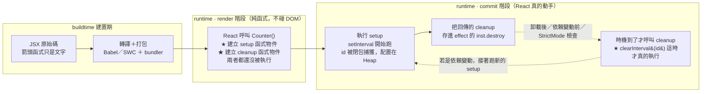

# useEffect 的 setup 與清理函式：`return` 的是一個函式，不是執行結果

> [!info]- 📍 承接 01，銜接 useState 底層
> <mark style="background: #ADCCFFA6;">承接</mark>：[[01-React-純函數與嚴格模式-StrictMode]] 講到 StrictMode 會把元件與 effect 多跑一輪，本篇解釋那一輪到底在檢查什麼——檢查的就是你的清理函式有沒有寫對。
> <mark style="background: #BBFABBA6;">下一步</mark>：本篇的「值為什麼能跨 render 活下來」在 [[useState底層-Fiber-Tree-memoizedState與過期閉包]] 有完整的 Fiber 結構圖。

> 起點：一段最經典的 `setInterval` 計時器程式碼，以及一個口述時很容易講錯的地方——「`return () => clearInterval(id)` 是不是當場執行了 `clearInterval`？」答案是**沒有**，而搞懂為什麼沒有，剛好把 Execution Context、閉包、Heap 配置、React fiber 四件事一次串起來。

---

## 5W1H 速查：讀本篇之前先把座標定好

> [!important]+ 最常被搞錯的一件事先講
> <mark style="background: #FF5582A6;">`return () => clearInterval(id)` 這一行執行時，`clearInterval` 一次都沒有被呼叫</mark>。它只是**建立**了一個函式物件並交還給 React。`clearInterval(id)` 要等到 React 決定該清理時、真的去呼叫那個函式，才會被執行。差一個箭頭（`return clearInterval(id)`）行為就完全相反——那才是當場執行。

> [!important] 新觀念：cleanup 是 setup 函式 `return` 出來的函式
> 通常是以 <mark style="background: #FFF3A3A6;">**setup 函式為主體**</mark>，由它 <mark style="background: #FF5582A6;">**`return` 出一個 cleanup 函式**</mark> 交給 React，而不是另外多傳一個參數給 `useEffect`。
> `return` 這一刻 <mark style="background: #BBFABBA6;">只是建立並交出這個函式，沒有執行它</mark>。互動版第一節有逐步圖解：`02-useEffect的setup清理函式-return一個函式而不是執行它-互動版.html`。

| 5W1H | 問題 | 一句話答案 |
|---|---|---|
| **What** 是什麼 | 清理函式是什麼？ | `useEffect` 的第一個參數（setup function）可以選擇性回傳一個「不收參數、不回傳值」的函式，React 官方稱它 cleanup function |
| **When** 什麼時候 | 它什麼時候被執行？ | <mark style="background: #FF5582A6;">不是在 `return` 那一行</mark>。是在三個時機由 React 呼叫：元件卸載後（官方：after your component is removed from the page）、每次重跑 setup 之前、以及 StrictMode 開發模式掛載後多跑的那一輪 |
| **Who** 誰做的 | 誰呼叫它？ | React 的 commit 階段。不是你、不是 JS 引擎、不是瀏覽器 |
| **Where** 在哪裡 | 它被存在哪？ | 存在該 effect 物件的 `inst.destroy` 欄位上，而那個 effect 掛在 fiber 節點（Heap）上 |
| **Which** 哪一種 | 哪些東西需要清理？ | 會「持續存在」的東西：計時器、事件監聽器、WebSocket／SSE 連線、訂閱、`AbortController`、第三方套件的實例 |
| **How** 怎麼做到 | 它怎麼記得當初那個 `id`？ | 靠**閉包**。`id` 被內層箭頭函式引用，引擎把它從 Stack 搬到 Heap 上的 Context 物件，setup 函式 `return` 之後它依然活著 |
| **Why** 為什麼 | 為什麼一定要寫？ | 因為 effect 建立的東西不會隨元件消失而自動消失，不清理就是記憶體洩漏；而且依賴變動時新舊 effect 會疊加 |

### 時間軸：這件事發生在哪一格

```text
◄────── buildtime 建置期 ──────►◄──────────────── runtime 執行期 ────────────────►
   （轉譯 transpile ＋ 打包 bundle）          （瀏覽器載入腳本之後）

  ①Babel／SWC        ②bundler       ③Parse       ④Bytecode    ⑤每次 render 都重來
  把 JSX 轉標準 JS    合併壓縮        AST         Ignition      ↓↓↓↓↓↓↓↓↓↓↓↓↓
  ┌──────────┐    ┌──────────┐   ┌────────┐   ┌────────┐   ┌────────────────────┐
  │ 你的箭頭  │    │ 打包進    │   │只做一次 │   │可重複  │   │ React 呼叫 Counter()│
  │ 函式只是  │───►│ bundle   │──►│Scope   │──►│使用    │──►│ ★ 建立閉包函式物件   │
  │ 一段文字  │    │          │   │Analysis│   │        │   │ ★ 但還沒執行它       │
  └──────────┘    └──────────┘   └────────┘   └────────┘   └──────────┬─────────┘
                                                                       │
   ★ 清理函式「被建立」在第 ⑤ 格                                        │
   ★ 清理函式「被執行」在更後面：React 的 commit 階段，見下面第二條軸    ▼
```

第二條時間軸放大第 ⑤ 格之後，畫 setup 與 cleanup 的配對關係：

```text
t0  首次 render        React 呼叫 Counter()，建立 setup 函式物件（還沒跑）
t1  commit 後          React 執行 setup ①  → setInterval 開始跑，id 被閉包抓住
                                            ↑ 回傳的 cleanup ① 被存進 inst.destroy
t2  依賴變了／要卸載    React 先執行 cleanup ①  → 這時 clearInterval(id) 才真的跑
t3  若是依賴變動        React 接著執行 setup ②  → 新的計時器、新的 id、新的 cleanup ②
t4  元件卸載            React 執行 cleanup ②  → 收尾
    ────────────────────────────────────────────────────────────────
    規律：setup ① → cleanup ① → setup ② → cleanup ② …
    永遠成對且交錯，不會有兩個 setup 同時活著

    StrictMode（僅開發模式）在 t1 之後會多插一輪：
    setup ① → cleanup ① → setup ①' ，故意檢查你的 cleanup 有沒有寫對
```


```mermaid
flowchart LR
    subgraph BT["buildtime 建置期"]
        A["JSX 原始碼<br/>箭頭函式只是文字"] --> B["轉譯＋打包<br/>Babel／SWC ＋ bundler"]
    end
    subgraph R1["runtime · render 階段（純函式，不碰 DOM）"]
        C["React 呼叫 Counter()<br/>★ 建立 setup 函式物件<br/>★ 建立 cleanup 函式物件<br/>兩者都還沒被執行"]
    end
    subgraph R2["runtime · commit 階段（React 真的動手）"]
        D["執行 setup<br/>setInterval 開始跑<br/>id 被閉包捕獲，配置在 Heap"]
        E["把回傳的 cleanup<br/>存進 effect 的 inst.destroy"]
        F["時機到了才呼叫 cleanup<br/>★ clearInterval&#40;id&#41; 這時才真的執行"]
    end
    B --> C --> D --> E
    E -.->|"卸載後／依賴變動前／StrictMode 檢查"| F
    F -.->|"若是依賴變動，接著跑新的 setup"| D
```

---

## (a) 先看那一段一定會壞的程式碼

```jsx
import { useState, useEffect } from 'react'

function Counter() {
  const [count, setCount] = useState(0)

  useEffect(() => {
    const id = setInterval(() => {
      console.log(count)      // 永遠印出 0
      setCount(count + 1)     // 永遠是 0 + 1
    }, 1000)
    return () => clearInterval(id)
  }, [])                      // 依賴陣列是空的

  return <h1>{count}</h1>
}
```

整段翻成中文：

「我做一個叫 `Counter` 的函式元件。用 `useState` 宣告一個叫 `count` 的狀態，初始值 0。接著用 `useEffect` 掛一個副作用，第二個參數是空陣列 `[]`，代表『只在元件掛載後執行一次』。這個副作用裡開了一個每秒觸發一次的 `setInterval`，回傳的計時器編號存進 `id`。每次觸發就印出 `count`、然後把 `count` 加一。最後我 `return` 一個函式給 React 當清理函式。畫面上顯示 `count`。」

實際跑起來：<mark style="background: #FF5582A6;">畫面停在 1，主控台每秒印出一個 0，永遠不會變</mark>。這叫 **stale closure（過期閉包）**，成因見 (e) 與 [[useState底層-Fiber-Tree-memoizedState與過期閉包]]。

---

## (b) 口述時最容易講錯的四個點

這是我實際講給人聽時被抓到的錯誤，逐條校正：

| 常見說法 | 判定 | 校正 |
|---|---|---|
| 「`return` 是終止當前函式」 | <mark style="background: #BBFABBA6;">對</mark> | 執行到 `return` 就不再往下跑 |
| 「`return` 是**丟出**一個值」 | <mark style="background: #FFF3A3A6;">用詞要改</mark> | JS 裡「丟出／拋出」專指 `throw`（丟例外）。`return` 要說**回傳／交還**。面試講「丟出」會被聽成 `throw` |
| 「後面接一個無名函式」 | <mark style="background: #BBFABBA6;">對</mark> | 精確講是**箭頭函式表達式**，而且它真的沒有名字（`fn.name` 是空字串，因為沒有賦值給變數所以拿不到推導名稱） |
| 「**並且執行** `clearInterval`」 | <mark style="background: #FF5582A6;">錯，而且是關鍵的那個錯</mark> | 這一行只建立函式，**沒有執行任何東西**。見 (c) |

---

## (c) 判斷「有沒有被執行」：看括號長在哪裡

```js
return () => clearInterval(id)
//     └┬┘    └─────┬──────┘
//      │           └── 這個括號在「箭頭函式的本體裡」，屬於未來才會跑的程式碼
//      └── 這個括號是「參數列表」，代表這個箭頭函式不收任何參數
```

判斷某個函式有沒有被執行，看的是<mark style="background: #BBFABBA6;">它後面有沒有一組緊貼著的呼叫括號</mark>：

a. `clearInterval(id)` 這串字確實有括號，但它被包在箭頭函式的本體裡，是「函式的內容」，不是「現在執行的動作」。

b. 整個箭頭函式 `() => ...` 後面**沒有**再接 `()`，所以它自己也沒有被呼叫。

c. 所以這一行執行完，記憶體裡多了一個**函式物件**，`clearInterval` 一次都沒被呼叫過。

三種寫法的對照，差一個箭頭天差地遠：

```js
return clearInterval(id)          // ① 立刻執行！回傳 undefined
                                  //    React 拿到 undefined，以為你沒有清理邏輯
                                  //    而且計時器在 setup 當下就被關掉了

return () => clearInterval(id)    // ② 正解：只造一個函式交出去
                                  //    等 React 之後決定何時呼叫

return () => { clearInterval(id) } // ③ 跟 ② 等價，只是寫成區塊本體
```

> [!tip]- 括號身兼多職，不是每個小括號都代表「呼叫」
> 這一點在 [[08-函式呼叫核心機制-Execution-Context-與-Parameter-Binding]] 的 (m) 節有完整整理：`fn(a)` 的括號是引數表達式、`function f(a)` 的括號是參數宣告、`(a + b)` 是分組運算子、`if (x)` 是控制流程語法的一部分。React 裡最常見的例子是 `return ( <div /> )`——那個括號是**分組運算子**，作用是防止 ASI（Automatic Semicolon Insertion，自動分號插入）把 `return` 後面切斷，跟函式呼叫毫無關係。

---

## (d) 簡潔本體藏了一個隱形的 `return`

`() => clearInterval(id)` 是**簡潔本體（concise body）**寫法，完全等價於：

```js
() => { return clearInterval(id) }
```

所以嚴格說，這個清理函式被呼叫時做兩件事：

1. 呼叫 `clearInterval(id)`

2. 把 `clearInterval` 的回傳值（`undefined`）再回傳出去

React 不看這個回傳值，所以實務上沒差，但知道這件事才算真的懂語法。

---

## (e) `id` 為什麼還在？——接回 Execution Context 與 Heap

這是專業解釋跟一般解釋的分水嶺：

a. `id` 是 setup 函式裡的區域變數，用 `const` 宣告。

b. <mark style="background: #ADCCFFA6;">內層的箭頭函式引用了 `id`</mark> → 引擎在 Parse 階段的 Scope Analysis 就判定「這個變數會逃逸」。

c. 所以 `id` 不會被放在 Stack 上（那樣 setup 函式一 `return` 就被清掉），而是被配置到 **Heap 上的 Context 物件**——這正是 [[12-return-清理記憶體-stack-frame與閉包例外]] 講的「`return` 會彈出 stack frame，但閉包是例外」。

d. setup 函式的 Execution Context 被拆掉之後，`id` 這塊記憶體還活著，因為那個清理函式還抓著它。

e. 幾秒或幾分鐘後 React 呼叫清理函式時，它才去讀那塊記憶體，拿到當初那個計時器編號。

<mark style="background: #BBFABBA6;">一句話：清理函式能關掉「當初那一個」計時器，靠的不是 React 記得，而是 JS 閉包把 `id` 從 Stack 搬到了 Heap。</mark>

> [!important] Context 物件（捕捉變數）記的是什麼：<mark style="background: #FFF3A3A6;">內部函式所引用的外部變數</mark>
> 也就是<mark style="background: #BBFABBA6;">閉包所捕捉的環境資料</mark>，<mark style="background: #FF5582A6;">而不是函式本身</mark>。
> 函式物件另外存在 Effect 物件的 `create` 與 `inst.destroy`，它只是「背著」一個 Context 的位址。
> 圖中凡是 Context 旁邊標「（捕捉變數）」，指的就是這個意思。

**Heap 上的 Context（背包）長什麼樣：**

| 名稱 | 白話 | 依據 |
|---|---|---|
| Context 物件（捕捉變數） | Heap 上的物件，裝「被內層函式抓住的變數」，不是函式本身 | V8 原始碼 `contexts.h` |
| JSFunction | 函式物件，本質是 `(context, 程式碼)` 的組合，所以每個函式都背著一個 Context | 同上，原文：*JSFunctions are pairs (context, function code), sometimes also called closures* |
| Context 的固定欄位 | `scope_info`（描述有哪些變數）、`previous`（指向外一層的 Context）、`extension`（額外資料），之後才是變數本身 | 同上 |
| 建立時機 | 進入函式的那一刻建立，不是建立閉包時，所以每次呼叫都有全新的一份 | 2012 年 Vyacheslav Egorov 的文章，⚠️ 年代久遠，且原文無法開啟，只讀到搜尋摘要，概念仍通用 |
| 規格上的稱呼 | ECMAScript 稱 Lexical Environment、函式的 `[[Environment]]`、outer 參照，大致對應 V8 的 Context、JSFunction 的 context、`previous` | ⚠️ 依記憶整理，未逐字核對規格 |

套到 React 的 Effect 上：`Effect.create` 指向 setup 函式，它背著 Context ①（那一次 render 的 `roomId`、`serverUrl`）。`inst.destroy` 指向 cleanup 函式，它背著 Context ②（`setup()` 那一次呼叫的 `connection`），而 ② 的 `previous` 指回 ①。
所以 cleanup 之後還能 `disconnect()`「當初那一條」連線，也因此 cleanup 若讀 `roomId`，讀到的是它那一次 render 的值，這就是 (g) 說的「cleanup 讀到的是它那一次 render 的值」。
讀變數的規則是：從函式自己的 Context 開始，找不到就沿 `previous` 往外一層。

![[HeapContext_閉包背包_2026-10-04.png]]

![[學習React_圖解_setCount(count++)為何失效-三道關卡_2026-09-07.svg]]

> 上圖是同一族的問題：`setCount(count++)` 為何失效的三道關卡。它跟本篇的 stale closure 共用同一個底層原因——**每次 render 都是一次全新的函式呼叫，閉包抓住的是那一次的綁定**。

---

## (f) React 內部怎麼看待這個回傳值（可以直接背的證據）

React 原始碼 `packages/react-reconciler/src/ReactFiberHooks.js` 裡，effect 的型別定義寫得非常清楚：

```ts
type Effect = {
  tag: HookFlags,
  inst: EffectInstance,
  create: () => (() => void) | void,   // ← setup 函式：回傳「一個函式」或「什麼都不回傳」
  deps: Array<mixed> | void | null,
  next: Effect,
};

type EffectInstance = {
  destroy: void | (() => void),        // ← 你 return 的那個清理函式，被存在這裡
};
```

逐行翻成中文：

1. `create` 就是你寫給 `useEffect` 的那個 setup 函式。它的型別簽章 `() => (() => void) | void` 白紙黑字寫著：<mark style="background: #FF5582A6;">它只能回傳「一個不收參數也不回傳值的函式」，或者什麼都不回傳</mark>。

2. `inst` 是一個 `EffectInstance` 物件，裡面的 `destroy` 欄位就是你 `return` 出去的那個清理函式的存放位置。

3. React 原始碼的註解說明了為什麼要獨立包一個 `EffectInstance`：因為 destroy 是**有狀態的**（stateful），effect 被卸載後這個欄位會被設回 `undefined`。

4. `next` 代表 effect 之間也是串成鏈結串列的，跟 hook 本身的鏈結串列是同一套設計思路。

這直接解釋了兩個常見錯誤為什麼會壞：

- 寫 `useEffect(async () => {...})` → async 函式回傳的是 **Promise**，不是函式，型別對不上，React 會在主控台警告
- 寫 `return clearInterval(id)` → 回傳的是 `undefined`，React 以為你沒有清理邏輯

---

## (g) React 什麼時候呼叫 `inst.destroy`：三個時機

專業回答一定要講清楚時機：

1. **元件卸載（unmount）後**——元件已從畫面移除，React 最後再跑一次。官方原文是 *Your cleanup code runs one final time after your component is removed from the page*。

   > [!warning] ⚠️ 更正（2026-10-04 對照 react.dev 原文）
   > 本篇先前寫成「卸載**前**」，與官方不符。官方說的是「卸載**後**」。

2. **每次要重新執行 setup 之前**——依賴陣列裡的值變了，React 會先跑舊的 cleanup、再跑新的 setup。所以順序永遠是 `setup① → cleanup① → setup② → cleanup② → ...`，<mark style="background: #ADCCFFA6;">成對且交錯，不會有兩個 setup 同時活著</mark>。

3. **開發模式的 StrictMode 下，掛載後會立刻多跑一輪** `setup → cleanup → setup`。這不是 bug，是 React 故意在幫你檢查「你的 cleanup 有沒有寫對」。<mark style="background: #FFF3A3A6;">如果你的元件在 StrictMode 下行為異常（例如計時器變兩倍快、請求送兩次），通常代表 cleanup 漏寫了</mark>——詳見 [[01-React-純函數與嚴格模式-StrictMode]]。

**用 Call Stack（呼叫堆疊）看順序：為什麼不是「cleanup 疊在 setup 上面所以先彈出」**
Call Stack 是後進先出（LIFO）的罐頭堆，只負責「同一時間正在執行、層層呼叫」的函式。
`return () => ...` 只是建立一個函式物件放在 Heap，並沒有呼叫它，所以 cleanup 從來沒有跟 setup 同時在 stack 上。

| 時間點 | Call Stack 上有什麼 | cleanup 在哪裡 |
|---|---|---|
| ① render | `Counter()` | 還沒有，Effect 物件的 `create` 存著 setup 函式 |
| ② commit 執行 setup | `flushPassiveEffects`、`setup()` | 還沒有，`return` 尚未執行 |
| ③ setup 回傳之後 | 空的 | Heap：Effect 物件的 `inst.destroy` |
| ④ 依賴變動，React 呼叫舊 cleanup | `flushPassiveEffects`、`cleanup①()` | 被呼叫中，`inst.destroy` 先被清成 `undefined` |
| ⑤ cleanup 彈出後，呼叫新 setup | `flushPassiveEffects`、`setup②()` | 回傳後 `inst.destroy` 存入 cleanup② |

所以順序不是 stack 決定的，是 React 的 commit 排程決定的：同一次 commit 裡先跑完所有要清理的 cleanup（原始碼 `commitPassiveUnmountEffects`），再跑所有 setup（`commitPassiveMountEffects`）。
`create` 在 render 時存入、`inst.destroy` 在 commit 時 `destroy = create(); inst.destroy = destroy;` 那一行才存入，這就是 ③ 之前 `inst.destroy` 是 `undefined` 的原因。

![[useEffect_setup與cleanup_CallStack罐頭時間軸_2026-10-04.png]]

**那 cleanup 哪一次 commit 會被呼叫？為什麼不是我們自己呼叫？**
這是「回呼函式（callback）」的概念：把函式交給別人，由對方在適當的時機呼叫。

| 你寫的 | 你交出去的函式 | 誰在什麼時候呼叫 |
|---|---|---|
| `setTimeout(fn, 1000)` | `fn` | 瀏覽器，1 秒後 |
| `addEventListener('click', fn)` | `fn` | 瀏覽器，使用者點擊時 |
| `promise.then(fn)` | `fn` | JS 引擎，promise 完成時 |
| `useEffect(() => { ...; return cleanup })` | `cleanup` | React，這個 Effect 需要停止同步時 |

程式裡從來沒有出現 `cleanup()`，因為「什麼時候該清理」只有 React 知道：deps 有沒有變、元件有沒有被移除，都是 React 在比較與維護。
所以 `return` 這一行並不是白做：它把 cleanup 連同它用閉包抓住的 `connection` 一起交給 React 保管，日後 React 才能關掉「當初那一條」連線。

cleanup 會在「setup 之後，第一個符合下列任一條件的 commit」被呼叫：

| 條件 | 是哪一次 commit | 例子 |
|---|---|---|
| deps 變了 | 因 `setState` 或父元件傳入新 props 引發 re-render，該次 render 之後的 commit | `roomId` 從 `general` 改成 `travel` 的那一次 |
| 元件被移除 | 條件式渲染拿掉它、路由切走、父元件移除它的那一次 commit | 按下「關閉聊天室」 |
| StrictMode（開發模式） | 第一次掛載之後緊接著的那一輪 | 見 (g) 第三點 |

若 deps 永遠不變、元件又一直存在，cleanup 就永遠不會被呼叫。

**為什麼是 commit，不是 render：** render 階段必須是純計算，React 可能中斷、重做或丟棄它（見 [[React兩階段渲染-Render與Commit-Mount-Update-Unmount生命週期]]）。若在 render 裡呼叫 cleanup，可能 render 被丟棄了連線卻已經斷掉。commit 才是「確定要生效」的階段，所以改 DOM、跑 setup、跑 cleanup 都排在 commit。

React 呼叫 cleanup 的那幾行，簡化自原始碼 `ReactFiberCommitEffects.js`：

```js
const inst = effect.inst          // 取得這個 Effect 的共用小房子
const destroy = inst.destroy      // 取出 setup 當初 return 的那個函式
if (destroy !== undefined) {      // 有交出 cleanup 才需要呼叫
  inst.destroy = undefined        // 先清空，避免同一個 cleanup 被呼叫兩次
  safelyCallDestroy(finishedWork, nearestMountedAncestor, destroy) // 真正呼叫它，出錯時由 React 接住
}
```

這段程式碼包在一個迴圈裡，React 沿著 `fiber.updateQueue.lastEffect` 那個環，一個 Effect 一個 Effect 走過去。

**deps 沒變的時候呢？（罐頭圖的路線二）**
`updateEffectImpl` 會先用 `areHookInputsEqual` 逐項以 `Object.is` 比較新舊 deps。全部相同就只做 `pushSimpleEffect(hookFlags, inst, create, nextDeps)` 然後 `return`，沒有 `HookHasEffect` 標記，也不執行 `fiber.flags |= Passive`。
所以 commit 看不到 Passive 待辦，不會排 `flushPassiveEffects`，cleanup 與 setup 都不跑。新 render 的 setup 函式雖然存進了 Effect 物件，但從頭到尾沒被執行，`inst.destroy` 仍是上一次的 cleanup，連線維持原樣。

**幾個常見的理解，逐一對照：**

| 你的說法 | 判定 | 說明 |
|---|---|---|
| setup 沒有放在 Heap 上 | 不對 | setup 也是函式物件，存在 Effect 物件的 `create` 欄位，同樣在 Heap。函式物件本身在 Heap，「被呼叫的過程」才會在 Stack 產生 frame |
| cleanup 在 Heap，Stack 上也該有個位子記錄它的位址 | 呼叫期間才對 | 呼叫它的函式有局部變數 `const destroy = inst.destroy` 持有位址，函式彈出就消失。閒置時 Stack 是空的，位址只存在 Heap 的 `inst.destroy`，由 Fiber 一路連到 root |
| `flushPassiveEffects` 是 React 正在執行排好的副作用，包含舊 cleanup 與新 setup | 對 | 順序是先全部 cleanup（`commitPassiveUnmountEffects`），再全部 setup（`commitPassiveMountEffects`） |
| 副作用是非同步處理的，等 DOM 更新完成才統一處理 | 大致對，需補精確 | 這裡的「非同步」是「延後到另一個任務」，不是 `async`／`await`。多數情況排在 Paint 之後。例外：若 render 由離散事件（例如點擊）引發，React 在同一個任務結束前同步 flush，原始碼註解說是為了讓結果「立刻可被觀察」 |

**Stack Frame（堆疊框）到底是什麼？你手繪的「整個 useEffect 一個框，cleanup 疊在 setup 上」要怎麼修：**
Stack Frame 是 JS 每「呼叫」一次函式，就在 Call Stack 疊上去的一個罐頭，裡面有返回位址（做完回到誰）、參數、區域變數，函式回傳就彈出。詳見 [[12-return-清理記憶體-stack-frame與閉包例外]]。

| 你的畫法 | 判定 | 正確理解 |
|---|---|---|
| 整個 useEffect 一個框 | 不對 | 罐頭對應「某一次函式呼叫」，不是「某個 Hook」。一個 useEffect 一輩子會產生好幾個不同時間的罐頭：render 時 `useEffect(...)` 那行、commit 時 `setup()`、之後的 `cleanup()`、再之後新的 `setup()` |
| cleanup 疊在 setup 上面 | 不對 | 兩者是不同時間的兩次呼叫，從不同時在 stack 上。疊在一起只發生在「A 呼叫 B 而 B 還沒做完」，例如 React 的 commit 函式呼叫 `setup()` |
| 把 Effect 物件跟 stack 畫在一起 | 要分開 | Effect 物件（`create`、`deps`、`inst.destroy`）在 Heap 一直都在，罐頭則是暫時的 |
| 一個函式一個 stack frame | 差一個字 | 單位是「每一次呼叫」，不是「每一個函式」。遞迴 `f(3)` 呼叫 `f(2)` 呼叫 `f(1)`，同一個函式同時有 3 個 frame。`setup` 函式在 StrictMode 被呼叫兩次，就是兩個不同時間的 frame。只定義、沒呼叫的函式一個 frame 都沒有，例如 `return () => ...` 建立的 cleanup 在被呼叫之前不佔任何 frame |
| Stack 是後進先出、下面是先進 | 對 | 這個觀念正確，只是套用的對象要換成「同時存在的呼叫」 |

`useEffect(...)` 這一行本身在 render 時是一次很短的呼叫（`mountEffect` 或 `updateEffect`），只是把 setup 登記進 Effect 物件就彈出了，並不會執行 setup。
`setup()` 罐頭裡的區域變數 `connection` 本來會隨罐頭彈出而消失，但因為 cleanup 的函式抓住了它（閉包），引擎把它放到 Heap 的 Context，所以 cleanup 之後還能 `disconnect()`。

![[StackFrame_一個罐頭是一次函式呼叫_2026-10-04.png]]

那個「連回 Effect」的動作，是 commit 前面的階段在 Fiber 上標記 Passive 旗標，等到 `flushPassiveEffects` 執行時，沿著 `fiber.updateQueue.lastEffect` 那個環找到各個 Effect，再取出 `create` 或 `inst.destroy` 來呼叫。

補充一個常被忽略的細節：**cleanup 讀到的是「它那一次 render 的值」，這是正確行為不是 bug**。因為 cleanup① 的任務就是收拾 setup① 建立的東西，它當然要用 setup① 當時的那組值。

---

## (h) 四個常見錯誤

1. **少寫箭頭**：`return clearInterval(id)`。當場執行、回傳 `undefined`，計時器在 setup 一開始就被關掉。

2. **把 setup 寫成 async**：`useEffect(async () => {...})`。回傳 Promise 不是函式。正解是在裡面另外定義一個 async 函式再呼叫它，或用 IIFE。

3. **完全不寫 cleanup**：計時器、監聽器、連線持續累積 → 記憶體洩漏；元件卸載後還呼叫 `setState` 會浪費效能。

4. **依賴陣列騙人**：明明用到 `count` 卻寫 `[]`，就是本篇開頭那個 bug。<mark style="background: #FF5582A6;">依賴陣列不是「我希望它跑幾次」的開關，是「這個 effect 讀了哪些外部值」的誠實申報</mark>。

三種修法與各自代價：

| 修法 | 寫法 | 代價 |
|---|---|---|
| updater function | `setCount(c => c + 1)` | 只適用「新值只依賴舊值」；要讀其他 state 或 prop 就救不了 |
| 誠實申報依賴 | `}, [count])` | 計時器每秒被銷毀重建，時間精度會漂移 |
| `useRef` 當長壽盒子 | `countRef.current = count` | 閉包抓的是盒子的參考不是值，每次讀 `.current` 都最新；但 ref 變動不觸發重渲染，見 [[useRef與Vue的ref-value-可變值不觸發渲染的兩種設計]] |

---

## (i) 面試四段式答法（可以直接背）

**a. 是什麼**：`useEffect` 的 setup 函式可以選擇性地回傳一個函式，React 官方稱它 cleanup function，存在該 effect 的 `inst.destroy` 欄位。

**b. 為什麼需要**：因為 effect 常常會建立「會持續存在的東西」——計時器、事件監聽器、WebSocket 連線、訂閱。這些不會隨元件消失而自動消失，必須有人主動關掉，否則就是記憶體洩漏。

**c. 什麼時候被呼叫**：卸載後、每次重跑 setup 之前、以及 StrictMode 開發模式下掛載後多跑的那一輪。順序永遠是 setup 與 cleanup 成對交錯。

**d. 底層原理**：cleanup 函式靠**閉包**抓住 setup 當次的區域變數（例如計時器 id）。這些變數因為被閉包捕獲，被引擎配置在 Heap 的 Context 物件而非 Stack，所以 setup 函式 `return` 之後它們依然活著，直到 cleanup 被呼叫、effect 被卸載、沒人再引用，才會被 GC 回收。

---

## (j) 與其他筆記的關聯（附理由）

a. [[08-函式呼叫核心機制-Execution-Context-與-Parameter-Binding]]——<mark style="background: #ADCCFFA6;">**理由**：本篇的「setup 函式 return 之後 `id` 為什麼還在」，答案完全來自那篇的 (g)(i) 兩節（Creation Phase 屬於執行期、綁定放 Stack 還是 Heap）</mark>。那篇是語言層，本篇是應用層。

b. [[12-return-清理記憶體-stack-frame與閉包例外]]——**理由**：那篇專門講「`return` 會彈出 stack frame，但閉包是例外」。本篇的清理函式就是那個「例外」最實用的一個案例。

c. [[13-閉包-Closure-私有變數與傳址陷阱]]——**理由**：清理函式抓住 `id` 是最乾淨的閉包用途示範，沒有任何 React 特有的東西。

d. [[for迴圈與setTimeout-var共享變數陷阱-let每輪新綁定與IIFE解法]]——<mark style="background: #FFF3A3A6;">**理由**：那篇的 `var` 陷阱跟本篇的 stale closure 是**同構問題**</mark>：都是「非同步回呼抓住了某個綁定，等它真的執行時，外面的世界已經前進了」。差別只在一個是迴圈的每一輪、一個是 React 的每一次 render。

e. [[useState底層-Fiber-Tree-memoizedState與過期閉包]]——**理由**：本篇說 cleanup 被存在 `inst.destroy`，那篇畫出 fiber 與 memoizedState 的完整結構，可以看到這個欄位在整棵樹的哪個位置。

f. [[React兩階段渲染-Render與Commit-Mount-Update-Unmount生命週期]]——**理由**：本篇說 cleanup 由「commit 階段」呼叫，那篇解釋 render 與 commit 為什麼要分兩階段，以及為什麼副作用不能寫在 render 階段。

g. [[01-React-純函數與嚴格模式-StrictMode]]——**理由**：StrictMode 多跑的那一輪 `setup → cleanup → setup`，就是在測試本篇教你寫的清理函式。

---

## (k) 追加 2026-09-15：Vue 與 Angular 怎麼做同一件事（副作用與清理）

React 的 `useEffect` 要你**手動宣告依賴陣列**；Vue 與 Angular 走的是**自動依賴收集**這條路，所以它們沒有「依賴寫漏 → 過期閉包」這個問題。

| 比較維度 | React `useEffect` | Vue 3 `watchEffect` / `watch` | Angular `effect()`（Signal） |
| --- | --- | --- | --- |
| 依賴怎麼指定 | 手動寫依賴陣列 `[dep]` | `watchEffect` 自動追蹤內部讀到的 ref；`watch` 明確指定來源 | 自動追蹤 effect 內部讀到的 Signal |
| 執行時機 | Commit phase 之後、瀏覽器 paint 完成後非同步執行 | 預設 `pre`（DOM 更新前），可設成 `post` | Change Detection 週期中排程執行 |
| 清理函式怎麼給 | `return () => {...}` | `watchEffect((onCleanup) => { onCleanup(() => {...}) })` | `effect((onCleanup) => { onCleanup(() => {...}) })` |
| 誰負責在卸載時呼叫清理 | React 走 Fiber 上的 `inst.destroy`（見本篇 (f)(g)） | Vue 綁在元件的 effect scope 上 | Angular 綁在 `DestroyRef` 上 |
| 過期閉包風險 | ⚠️ 高，靠 ESLint `react-hooks/exhaustive-deps` 提醒 | ❌ 無（`setup` 只執行一次，指標固定） | ❌ 無（class 實體的 `this` 固定） |

```js
// Vue 3：watchEffect 自動收集內部讀到的 ref，onCleanup 就是 React 的 return
watchEffect(async (onCleanup) => {
  let cancelled = false
  onCleanup(() => { cancelled = true })      // ← 對應 React 的 return () => {}
  const data = await fetchUser(userId.value) // ← 讀了 userId 就自動變成依賴
  if (!cancelled) user.value = data
})
```

```ts
// Angular：effect 必須建在 injection context（例如 constructor）裡，才綁得到 DestroyRef
constructor() {
  effect((onCleanup) => {
    const id = this.userId();                 // ← 讀了 signal 就自動變成依賴
    const controller = new AbortController();
    fetchUser(id, { signal: controller.signal }).then(d => this.user.set(d));
    onCleanup(() => controller.abort());
  });
}
```

<mark style="background: #FFF3A3A6;">**同一個觀念換三個名字：React 叫 cleanup function，Vue 叫 `onCleanup`，Angular 也叫 `onCleanup`——但只有 React 需要你自己把依賴列出來。**</mark>

> [!warning] ⚠️ 版本與查證提醒
> 原對話還附了一張「框架 Runtime 體積」比較表。那些數字隨版本變動極大，本篇不收錄，需要時請查 [bundlephobia](https://bundlephobia.com/) 當下的實際數字。
> 另外原對話說 React 內部有「Fiber DOM」——**沒有這個東西**。正確說法是 Fiber 節點（`FiberNode`）**映射到**真實 DOM 的 Host Component，詳見 [[useState底層-Fiber-Tree-memoizedState與過期閉包]]。

## 練習題

LeetCode 的「30 Days of JavaScript」題庫裡有幾題就是在考本篇的閉包與計時器清理：

1. [2725. Interval Cancellation](https://leetcode.com/problems/interval-cancellation/)——`setInterval` ＋ 回傳一個取消函式，<mark style="background: #BBFABBA6;">結構跟 useEffect cleanup 幾乎一模一樣</mark>，最推薦先做這題

2. [2622. Cache With Time Limit](https://leetcode.com/problems/cache-with-time-limit/)——閉包 ＋ 計時器 ＋ 跨呼叫存活的狀態

3. [2620. Counter](https://leetcode.com/problems/counter/)——最小的閉包題，直接對應 (e) 的「綁定被搬到 Heap」

4. [2665. Counter II](https://leetcode.com/problems/counter-ii/)——多個閉包共用同一組綁定

5. [2721. Execute Asynchronous Functions in Parallel](https://leetcode.com/problems/execute-asynchronous-functions-in-parallel/)——非同步回呼與閉包的組合

NeetCode 目前沒有對應的 JavaScript 語言機制題組，上面五題在 LeetCode 站內即可。

---

## 資料來源（含查證時間）

| 主題 | 連結 | 版本／時間 |
|---|---|---|
| React 原始碼 `ReactFiberHooks.js`（`Effect` 與 `EffectInstance` 型別定義、`inst.destroy`） | https://github.com/facebook/react/blob/main/packages/react-reconciler/src/ReactFiberHooks.js | 2026-09-06 查證 |
| React 官方文件 — `useEffect`（setup 與 cleanup 的契約、三個呼叫時機） | https://react.dev/reference/react/useEffect | 2026-09-06 查證 |
| React 官方文件 — Synchronizing with Effects | https://react.dev/learn/synchronizing-with-effects | 2026-09-06 查證 |
| React 官方文件 — State as a Snapshot（stale closure 的官方說法） | https://react.dev/learn/state-as-a-snapshot | 2026-09-06 查證 |
| React 原始碼 `ReactFiberCommitEffects.js`（`destroy = create(); inst.destroy = destroy;`）、`ReactFiberWorkLoop.js`（`commitPassiveUnmountEffects` 先於 `commitPassiveMountEffects`、`scheduleCallback(NormalSchedulerPriority, …)`、離散事件同步 flush 的註解、`commitRoot`）、`ReactFiberHooks.js`（`updateEffectImpl` 與 `areHookInputsEqual`） | https://github.com/facebook/react/tree/main/packages/react-reconciler/src | main 分支，2026-10-04 實際抓取核對 |
| V8 原始碼 `src/objects/contexts.h`（JSFunction 與 Context 的欄位說明） | https://github.com/v8/v8/blob/main/src/objects/contexts.h | main 分支，2026-10-04 實際抓取核對 |
| Grokking V8 closures for fun（Context 在進入函式時建立、previous 指標串成鏈） | https://mrale.ph/blog/2012/09/23/grokking-v8-closures-for-fun.html | 2012-09-23，⚠️ 原文被網路擋下，僅讀到搜尋摘要 |
| Dan Abramov — A Complete Guide to useEffect | https://overreacted.io/a-complete-guide-to-useeffect/ | 原文 2019-03，2026-09-06 重讀 |
| MDN — Arrow function expressions（簡潔本體、名稱推導） | https://developer.mozilla.org/en-US/docs/Web/JavaScript/Reference/Functions/Arrow_functions | 2026-09-06 查證 |
| MDN — `clearInterval()` | https://developer.mozilla.org/en-US/docs/Web/API/Window/clearInterval | 2026-09-06 查證 |
| Vue `watchEffect` 與 `onCleanup` | https://vuejs.org/api/reactivity-core.html#watcheffect | Vue 3 官方 API，查證 2026-09-15 |
| Angular `effect()` 與 `DestroyRef` | https://angular.dev/guide/signals#effects | Angular 官方，查證 2026-09-15 |
| 本次追加的原始對話（Gemini） | https://gemini.google.com/app/5b6fc934e5d7f253 | 對話擷取 2026-09-15 |

---

> [!info]- 🔧 同資料夾的程式碼範例
> `02-useEffect-cleanup-demo.jsx`——把本篇的錯誤版、三種修法、以及一個會在主控台印出 setup／cleanup 執行順序的觀察版放在一起，可以直接貼進 CodeSandbox 或本地專案跑。
